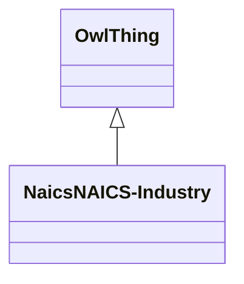

# Class: NaicsNAICS-Industry


URI: [naics:NAICS-Industry](http://w3id.org/fio/v1/naics#NAICS-Industry)





## Inheritance
* [OwlThing](../classes/OwlThing.md)
    * **NaicsNAICS-Industry**


## Slots

| Name | Cardinality and Range | Description | Inheritance | Occurrences |
| ---  | --- | --- | --- | --- |


## LinkML Source

<!-- TODO: investigate https://stackoverflow.com/questions/37606292/how-to-create-tabbed-code-blocks-in-mkdocs-or-sphinx -->

### Direct

<details>

```yaml
name: naics_NAICS-Industry
from_schema: okns:fio-kg
exact_mappings:
- http://w3id.org/fio/v1/naics#NAICS-Industry
rank: 1000
is_a: owl_Thing
class_uri: naics:NAICS-Industry

```
</details>

### Induced

<details>

```yaml
name: naics_NAICS-Industry
from_schema: okns:fio-kg
exact_mappings:
- http://w3id.org/fio/v1/naics#NAICS-Industry
rank: 1000
is_a: owl_Thing
class_uri: naics:NAICS-Industry

```
</details>