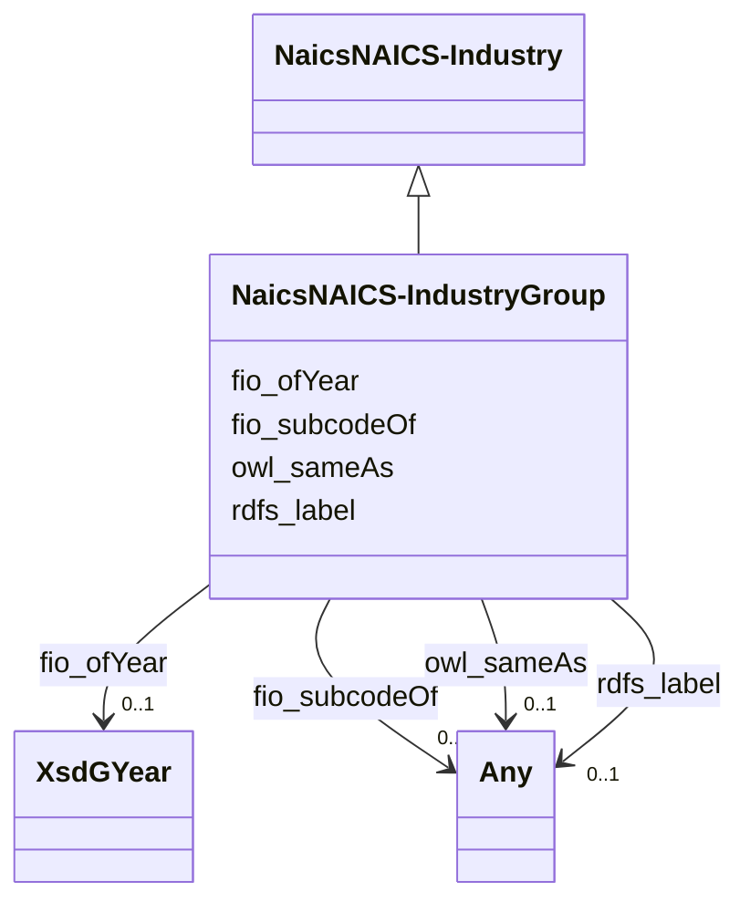

# Class: No class (type) name specified (naics_NAICS-IndustryGroup)


_No class (type) description specified_


This class occurs 308 times.


URI: [naics:NAICS-IndustryGroup](http://sawgraph.spatialai.org/v1/fio/naics#NAICS-IndustryGroup)





## Inheritance
* [FioIndustry](../classes/FioIndustry.md)
    * [NaicsNAICS-Industry](../classes/NaicsNAICS-Industry.md)
        * **NaicsNAICS-IndustryGroup**


## Slots

| Name | Cardinality and Range | Description | Inheritance | Occurrences |
| ---  | --- | --- | --- | --- |
| [rdfs_label](../slots/rdfs_label.md) | 0..1 <br/> [xsd:anyURI](http://www.w3.org/2001/XMLSchema#anyURI)&nbsp;or&nbsp;<br />[xsd:string](http://www.w3.org/2001/XMLSchema#string) | No slot (predicate) description specified <br/>  | direct | 308 |
| [fio_ofYear](../slots/fio_ofYear.md) | 0..1 <br/> [XsdGYear](../classes/XsdGYear.md) | No slot (predicate) description specified <br/>  | direct | 308 |
| [fio_subcodeOf](../slots/fio_subcodeOf.md) | 0..1 <br/> [NaicsNAICS-IndustrySubsector](../classes/NaicsNAICS-IndustrySubsector.md)&nbsp;or&nbsp;<br />[FioIndustry](../classes/FioIndustry.md)&nbsp;or&nbsp;<br />[OwlThing](../classes/OwlThing.md)&nbsp;or&nbsp;<br />[NaicsNAICS-IndustryGroup](../classes/NaicsNAICS-IndustryGroup.md)&nbsp;or&nbsp;<br />[xsd:anyURI](http://www.w3.org/2001/XMLSchema#anyURI)&nbsp;or&nbsp;<br />[NaicsNAICS-Industry](../classes/NaicsNAICS-Industry.md)&nbsp;or&nbsp;<br />[NaicsNAICS-IndustrySector](../classes/NaicsNAICS-IndustrySector.md)&nbsp;or&nbsp;<br />[OwlNamedIndividual](../classes/OwlNamedIndividual.md) | No slot (predicate) description specified <br/>  | direct | 2916 |
| [owl_sameAs](../slots/owl_sameAs.md) | 0..1 <br/> [FioIndustry](../classes/FioIndustry.md)&nbsp;or&nbsp;<br />[OwlThing](../classes/OwlThing.md)&nbsp;or&nbsp;<br />[xsd:anyURI](http://www.w3.org/2001/XMLSchema#anyURI)&nbsp;or&nbsp;<br />[NaicsNAICS-IndustryCode](../classes/NaicsNAICS-IndustryCode.md)&nbsp;or&nbsp;<br />[RdfsResource](../classes/RdfsResource.md)&nbsp;or&nbsp;<br />[RdfList](../classes/RdfList.md)&nbsp;or&nbsp;<br />[NaicsNAICS-Industry](../classes/NaicsNAICS-Industry.md)&nbsp;or&nbsp;<br />[NaicsNAICS-IndustrySector](../classes/NaicsNAICS-IndustrySector.md)&nbsp;or&nbsp;<br />[OwlNamedIndividual](../classes/OwlNamedIndividual.md) | No slot (predicate) description specified | [NaicsNAICS-Industry](../classes/NaicsNAICS-Industry.md), [FioIndustry](../classes/FioIndustry.md) |  |


## Usages

| used by | used in | type | used |
| ---  | --- | --- | --- |
| [B1](../classes/B1.md) | [usfrs_caaIndustry](../slots/usfrs_caaIndustry.md) | any_of[range] | [NaicsNAICS-IndustryGroup](../classes/NaicsNAICS-IndustryGroup.md) |
| [B1](../classes/B1.md) | [fio_ofIndustry](../slots/fio_ofIndustry.md) | any_of[range] | [NaicsNAICS-IndustryGroup](../classes/NaicsNAICS-IndustryGroup.md) |
| [B1](../classes/B1.md) | [usfrs_primaryIndustry](../slots/usfrs_primaryIndustry.md) | any_of[range] | [NaicsNAICS-IndustryGroup](../classes/NaicsNAICS-IndustryGroup.md) |
| [B1](../classes/B1.md) | [usfrs_rcrainfo_Industry](../slots/usfrs_rcrainfo_Industry.md) | any_of[range] | [NaicsNAICS-IndustryGroup](../classes/NaicsNAICS-IndustryGroup.md) |
| [B1](../classes/B1.md) | [usfrs_secondaryIndustry](../slots/usfrs_secondaryIndustry.md) | any_of[range] | [NaicsNAICS-IndustryGroup](../classes/NaicsNAICS-IndustryGroup.md) |
| [B1](../classes/B1.md) | [usfrs_eia_860_Industry](../slots/usfrs_eia_860_Industry.md) | any_of[range] | [NaicsNAICS-IndustryGroup](../classes/NaicsNAICS-IndustryGroup.md) |
| [B1](../classes/B1.md) | [usfrs_eis_Industry](../slots/usfrs_eis_Industry.md) | any_of[range] | [NaicsNAICS-IndustryGroup](../classes/NaicsNAICS-IndustryGroup.md) |
| [FioFacility](../classes/FioFacility.md) | [usfrs_caaIndustry](../slots/usfrs_caaIndustry.md) | any_of[range] | [NaicsNAICS-IndustryGroup](../classes/NaicsNAICS-IndustryGroup.md) |
| [FioFacility](../classes/FioFacility.md) | [fio_ofIndustry](../slots/fio_ofIndustry.md) | any_of[range] | [NaicsNAICS-IndustryGroup](../classes/NaicsNAICS-IndustryGroup.md) |
| [FioFacility](../classes/FioFacility.md) | [usfrs_primaryIndustry](../slots/usfrs_primaryIndustry.md) | any_of[range] | [NaicsNAICS-IndustryGroup](../classes/NaicsNAICS-IndustryGroup.md) |
| [FioFacility](../classes/FioFacility.md) | [usfrs_rcrainfo_Industry](../slots/usfrs_rcrainfo_Industry.md) | any_of[range] | [NaicsNAICS-IndustryGroup](../classes/NaicsNAICS-IndustryGroup.md) |
| [FioFacility](../classes/FioFacility.md) | [usfrs_secondaryIndustry](../slots/usfrs_secondaryIndustry.md) | any_of[range] | [NaicsNAICS-IndustryGroup](../classes/NaicsNAICS-IndustryGroup.md) |
| [FioFacility](../classes/FioFacility.md) | [usfrs_eia_860_Industry](../slots/usfrs_eia_860_Industry.md) | any_of[range] | [NaicsNAICS-IndustryGroup](../classes/NaicsNAICS-IndustryGroup.md) |
| [FioFacility](../classes/FioFacility.md) | [usfrs_eis_Industry](../slots/usfrs_eis_Industry.md) | any_of[range] | [NaicsNAICS-IndustryGroup](../classes/NaicsNAICS-IndustryGroup.md) |
| [FioIndustry](../classes/FioIndustry.md) | [fio_subcodeOf](../slots/fio_subcodeOf.md) | any_of[range] | [NaicsNAICS-IndustryGroup](../classes/NaicsNAICS-IndustryGroup.md) |
| [NaicsNAICS-Industry](../classes/NaicsNAICS-Industry.md) | [fio_subcodeOf](../slots/fio_subcodeOf.md) | any_of[range] | [NaicsNAICS-IndustryGroup](../classes/NaicsNAICS-IndustryGroup.md) |
| [NaicsNAICS-IndustryCode](../classes/NaicsNAICS-IndustryCode.md) | [fio_subcodeOf](../slots/fio_subcodeOf.md) | any_of[range] | [NaicsNAICS-IndustryGroup](../classes/NaicsNAICS-IndustryGroup.md) |
| [NaicsNAICS-IndustryGroup](../classes/NaicsNAICS-IndustryGroup.md) | [fio_subcodeOf](../slots/fio_subcodeOf.md) | any_of[range] | [NaicsNAICS-IndustryGroup](../classes/NaicsNAICS-IndustryGroup.md) |
| [NaicsNAICS-IndustrySector](../classes/NaicsNAICS-IndustrySector.md) | [fio_subcodeOf](../slots/fio_subcodeOf.md) | any_of[range] | [NaicsNAICS-IndustryGroup](../classes/NaicsNAICS-IndustryGroup.md) |
| [NaicsNAICS-IndustrySubsector](../classes/NaicsNAICS-IndustrySubsector.md) | [fio_subcodeOf](../slots/fio_subcodeOf.md) | any_of[range] | [NaicsNAICS-IndustryGroup](../classes/NaicsNAICS-IndustryGroup.md) |
| [OwlNamedIndividual](../classes/OwlNamedIndividual.md) | [fio_subcodeOf](../slots/fio_subcodeOf.md) | any_of[range] | [NaicsNAICS-IndustryGroup](../classes/NaicsNAICS-IndustryGroup.md) |
| [OwlNothing](../classes/OwlNothing.md) | [fio_subcodeOf](../slots/fio_subcodeOf.md) | any_of[range] | [NaicsNAICS-IndustryGroup](../classes/NaicsNAICS-IndustryGroup.md) |
| [OwlThing](../classes/OwlThing.md) | [fio_subcodeOf](../slots/fio_subcodeOf.md) | any_of[range] | [NaicsNAICS-IndustryGroup](../classes/NaicsNAICS-IndustryGroup.md) |
| [UsfrsBarge-Facility](../classes/UsfrsBarge-Facility.md) | [usfrs_caaIndustry](../slots/usfrs_caaIndustry.md) | any_of[range] | [NaicsNAICS-IndustryGroup](../classes/NaicsNAICS-IndustryGroup.md) |
| [UsfrsBarge-Facility](../classes/UsfrsBarge-Facility.md) | [fio_ofIndustry](../slots/fio_ofIndustry.md) | any_of[range] | [NaicsNAICS-IndustryGroup](../classes/NaicsNAICS-IndustryGroup.md) |
| [UsfrsBarge-Facility](../classes/UsfrsBarge-Facility.md) | [usfrs_primaryIndustry](../slots/usfrs_primaryIndustry.md) | any_of[range] | [NaicsNAICS-IndustryGroup](../classes/NaicsNAICS-IndustryGroup.md) |
| [UsfrsBarge-Facility](../classes/UsfrsBarge-Facility.md) | [usfrs_rcrainfo_Industry](../slots/usfrs_rcrainfo_Industry.md) | any_of[range] | [NaicsNAICS-IndustryGroup](../classes/NaicsNAICS-IndustryGroup.md) |
| [UsfrsBarge-Facility](../classes/UsfrsBarge-Facility.md) | [usfrs_secondaryIndustry](../slots/usfrs_secondaryIndustry.md) | any_of[range] | [NaicsNAICS-IndustryGroup](../classes/NaicsNAICS-IndustryGroup.md) |
| [UsfrsBarge-Facility](../classes/UsfrsBarge-Facility.md) | [usfrs_eia_860_Industry](../slots/usfrs_eia_860_Industry.md) | any_of[range] | [NaicsNAICS-IndustryGroup](../classes/NaicsNAICS-IndustryGroup.md) |
| [UsfrsBarge-Facility](../classes/UsfrsBarge-Facility.md) | [usfrs_eis_Industry](../slots/usfrs_eis_Industry.md) | any_of[range] | [NaicsNAICS-IndustryGroup](../classes/NaicsNAICS-IndustryGroup.md) |
| [UsfrsBrownfieldsSite-Facility](../classes/UsfrsBrownfieldsSite-Facility.md) | [usfrs_caaIndustry](../slots/usfrs_caaIndustry.md) | any_of[range] | [NaicsNAICS-IndustryGroup](../classes/NaicsNAICS-IndustryGroup.md) |
| [UsfrsBrownfieldsSite-Facility](../classes/UsfrsBrownfieldsSite-Facility.md) | [fio_ofIndustry](../slots/fio_ofIndustry.md) | any_of[range] | [NaicsNAICS-IndustryGroup](../classes/NaicsNAICS-IndustryGroup.md) |
| [UsfrsBrownfieldsSite-Facility](../classes/UsfrsBrownfieldsSite-Facility.md) | [usfrs_primaryIndustry](../slots/usfrs_primaryIndustry.md) | any_of[range] | [NaicsNAICS-IndustryGroup](../classes/NaicsNAICS-IndustryGroup.md) |
| [UsfrsBrownfieldsSite-Facility](../classes/UsfrsBrownfieldsSite-Facility.md) | [usfrs_rcrainfo_Industry](../slots/usfrs_rcrainfo_Industry.md) | any_of[range] | [NaicsNAICS-IndustryGroup](../classes/NaicsNAICS-IndustryGroup.md) |
| [UsfrsBrownfieldsSite-Facility](../classes/UsfrsBrownfieldsSite-Facility.md) | [usfrs_secondaryIndustry](../slots/usfrs_secondaryIndustry.md) | any_of[range] | [NaicsNAICS-IndustryGroup](../classes/NaicsNAICS-IndustryGroup.md) |
| [UsfrsBrownfieldsSite-Facility](../classes/UsfrsBrownfieldsSite-Facility.md) | [usfrs_eis_Industry](../slots/usfrs_eis_Industry.md) | any_of[range] | [NaicsNAICS-IndustryGroup](../classes/NaicsNAICS-IndustryGroup.md) |
| [UsfrsBrownfieldsSite-Facility](../classes/UsfrsBrownfieldsSite-Facility.md) | [usfrs_eia_860_Industry](../slots/usfrs_eia_860_Industry.md) | any_of[range] | [NaicsNAICS-IndustryGroup](../classes/NaicsNAICS-IndustryGroup.md) |
| [UsfrsContaminatedSite-Facility](../classes/UsfrsContaminatedSite-Facility.md) | [usfrs_caaIndustry](../slots/usfrs_caaIndustry.md) | any_of[range] | [NaicsNAICS-IndustryGroup](../classes/NaicsNAICS-IndustryGroup.md) |
| [UsfrsContaminatedSite-Facility](../classes/UsfrsContaminatedSite-Facility.md) | [fio_ofIndustry](../slots/fio_ofIndustry.md) | any_of[range] | [NaicsNAICS-IndustryGroup](../classes/NaicsNAICS-IndustryGroup.md) |
| [UsfrsContaminatedSite-Facility](../classes/UsfrsContaminatedSite-Facility.md) | [usfrs_primaryIndustry](../slots/usfrs_primaryIndustry.md) | any_of[range] | [NaicsNAICS-IndustryGroup](../classes/NaicsNAICS-IndustryGroup.md) |
| [UsfrsContaminatedSite-Facility](../classes/UsfrsContaminatedSite-Facility.md) | [usfrs_rcrainfo_Industry](../slots/usfrs_rcrainfo_Industry.md) | any_of[range] | [NaicsNAICS-IndustryGroup](../classes/NaicsNAICS-IndustryGroup.md) |
| [UsfrsContaminatedSite-Facility](../classes/UsfrsContaminatedSite-Facility.md) | [usfrs_secondaryIndustry](../slots/usfrs_secondaryIndustry.md) | any_of[range] | [NaicsNAICS-IndustryGroup](../classes/NaicsNAICS-IndustryGroup.md) |
| [UsfrsContaminatedSite-Facility](../classes/UsfrsContaminatedSite-Facility.md) | [usfrs_eia_860_Industry](../slots/usfrs_eia_860_Industry.md) | any_of[range] | [NaicsNAICS-IndustryGroup](../classes/NaicsNAICS-IndustryGroup.md) |
| [UsfrsContaminatedSite-Facility](../classes/UsfrsContaminatedSite-Facility.md) | [usfrs_eis_Industry](../slots/usfrs_eis_Industry.md) | any_of[range] | [NaicsNAICS-IndustryGroup](../classes/NaicsNAICS-IndustryGroup.md) |
| [UsfrsContaminationAddressed-Facility](../classes/UsfrsContaminationAddressed-Facility.md) | [usfrs_caaIndustry](../slots/usfrs_caaIndustry.md) | any_of[range] | [NaicsNAICS-IndustryGroup](../classes/NaicsNAICS-IndustryGroup.md) |
| [UsfrsContaminationAddressed-Facility](../classes/UsfrsContaminationAddressed-Facility.md) | [fio_ofIndustry](../slots/fio_ofIndustry.md) | any_of[range] | [NaicsNAICS-IndustryGroup](../classes/NaicsNAICS-IndustryGroup.md) |
| [UsfrsContaminationAddressed-Facility](../classes/UsfrsContaminationAddressed-Facility.md) | [usfrs_primaryIndustry](../slots/usfrs_primaryIndustry.md) | any_of[range] | [NaicsNAICS-IndustryGroup](../classes/NaicsNAICS-IndustryGroup.md) |
| [UsfrsContaminationAddressed-Facility](../classes/UsfrsContaminationAddressed-Facility.md) | [usfrs_rcrainfo_Industry](../slots/usfrs_rcrainfo_Industry.md) | any_of[range] | [NaicsNAICS-IndustryGroup](../classes/NaicsNAICS-IndustryGroup.md) |
| [UsfrsContaminationAddressed-Facility](../classes/UsfrsContaminationAddressed-Facility.md) | [usfrs_secondaryIndustry](../slots/usfrs_secondaryIndustry.md) | any_of[range] | [NaicsNAICS-IndustryGroup](../classes/NaicsNAICS-IndustryGroup.md) |
| [UsfrsContaminationAddressed-Facility](../classes/UsfrsContaminationAddressed-Facility.md) | [usfrs_eia_860_Industry](../slots/usfrs_eia_860_Industry.md) | any_of[range] | [NaicsNAICS-IndustryGroup](../classes/NaicsNAICS-IndustryGroup.md) |
| [UsfrsContaminationAddressed-Facility](../classes/UsfrsContaminationAddressed-Facility.md) | [usfrs_eis_Industry](../slots/usfrs_eis_Industry.md) | any_of[range] | [NaicsNAICS-IndustryGroup](../classes/NaicsNAICS-IndustryGroup.md) |
| [UsfrsEPA-PFAS-Facility](../classes/UsfrsEPA-PFAS-Facility.md) | [usfrs_caaIndustry](../slots/usfrs_caaIndustry.md) | any_of[range] | [NaicsNAICS-IndustryGroup](../classes/NaicsNAICS-IndustryGroup.md) |
| [UsfrsEPA-PFAS-Facility](../classes/UsfrsEPA-PFAS-Facility.md) | [fio_ofIndustry](../slots/fio_ofIndustry.md) | any_of[range] | [NaicsNAICS-IndustryGroup](../classes/NaicsNAICS-IndustryGroup.md) |
| [UsfrsEPA-PFAS-Facility](../classes/UsfrsEPA-PFAS-Facility.md) | [usfrs_primaryIndustry](../slots/usfrs_primaryIndustry.md) | any_of[range] | [NaicsNAICS-IndustryGroup](../classes/NaicsNAICS-IndustryGroup.md) |
| [UsfrsEPA-PFAS-Facility](../classes/UsfrsEPA-PFAS-Facility.md) | [usfrs_rcrainfo_Industry](../slots/usfrs_rcrainfo_Industry.md) | any_of[range] | [NaicsNAICS-IndustryGroup](../classes/NaicsNAICS-IndustryGroup.md) |
| [UsfrsEPA-PFAS-Facility](../classes/UsfrsEPA-PFAS-Facility.md) | [usfrs_secondaryIndustry](../slots/usfrs_secondaryIndustry.md) | any_of[range] | [NaicsNAICS-IndustryGroup](../classes/NaicsNAICS-IndustryGroup.md) |
| [UsfrsEPA-PFAS-Facility](../classes/UsfrsEPA-PFAS-Facility.md) | [usfrs_eia_860_Industry](../slots/usfrs_eia_860_Industry.md) | any_of[range] | [NaicsNAICS-IndustryGroup](../classes/NaicsNAICS-IndustryGroup.md) |
| [UsfrsEPA-PFAS-Facility](../classes/UsfrsEPA-PFAS-Facility.md) | [usfrs_eis_Industry](../slots/usfrs_eis_Industry.md) | any_of[range] | [NaicsNAICS-IndustryGroup](../classes/NaicsNAICS-IndustryGroup.md) |
| [UsfrsFRS-Facility](../classes/UsfrsFRS-Facility.md) | [usfrs_caaIndustry](../slots/usfrs_caaIndustry.md) | any_of[range] | [NaicsNAICS-IndustryGroup](../classes/NaicsNAICS-IndustryGroup.md) |
| [UsfrsFRS-Facility](../classes/UsfrsFRS-Facility.md) | [fio_ofIndustry](../slots/fio_ofIndustry.md) | any_of[range] | [NaicsNAICS-IndustryGroup](../classes/NaicsNAICS-IndustryGroup.md) |
| [UsfrsFRS-Facility](../classes/UsfrsFRS-Facility.md) | [usfrs_primaryIndustry](../slots/usfrs_primaryIndustry.md) | any_of[range] | [NaicsNAICS-IndustryGroup](../classes/NaicsNAICS-IndustryGroup.md) |
| [UsfrsFRS-Facility](../classes/UsfrsFRS-Facility.md) | [usfrs_rcrainfo_Industry](../slots/usfrs_rcrainfo_Industry.md) | any_of[range] | [NaicsNAICS-IndustryGroup](../classes/NaicsNAICS-IndustryGroup.md) |
| [UsfrsFRS-Facility](../classes/UsfrsFRS-Facility.md) | [usfrs_secondaryIndustry](../slots/usfrs_secondaryIndustry.md) | any_of[range] | [NaicsNAICS-IndustryGroup](../classes/NaicsNAICS-IndustryGroup.md) |
| [UsfrsFRS-Facility](../classes/UsfrsFRS-Facility.md) | [usfrs_eia_860_Industry](../slots/usfrs_eia_860_Industry.md) | any_of[range] | [NaicsNAICS-IndustryGroup](../classes/NaicsNAICS-IndustryGroup.md) |
| [UsfrsFRS-Facility](../classes/UsfrsFRS-Facility.md) | [usfrs_eis_Industry](../slots/usfrs_eis_Industry.md) | any_of[range] | [NaicsNAICS-IndustryGroup](../classes/NaicsNAICS-IndustryGroup.md) |
| [UsfrsFederal-Facility](../classes/UsfrsFederal-Facility.md) | [usfrs_caaIndustry](../slots/usfrs_caaIndustry.md) | any_of[range] | [NaicsNAICS-IndustryGroup](../classes/NaicsNAICS-IndustryGroup.md) |
| [UsfrsFederal-Facility](../classes/UsfrsFederal-Facility.md) | [fio_ofIndustry](../slots/fio_ofIndustry.md) | any_of[range] | [NaicsNAICS-IndustryGroup](../classes/NaicsNAICS-IndustryGroup.md) |
| [UsfrsFederal-Facility](../classes/UsfrsFederal-Facility.md) | [usfrs_primaryIndustry](../slots/usfrs_primaryIndustry.md) | any_of[range] | [NaicsNAICS-IndustryGroup](../classes/NaicsNAICS-IndustryGroup.md) |
| [UsfrsFederal-Facility](../classes/UsfrsFederal-Facility.md) | [usfrs_rcrainfo_Industry](../slots/usfrs_rcrainfo_Industry.md) | any_of[range] | [NaicsNAICS-IndustryGroup](../classes/NaicsNAICS-IndustryGroup.md) |
| [UsfrsFederal-Facility](../classes/UsfrsFederal-Facility.md) | [usfrs_secondaryIndustry](../slots/usfrs_secondaryIndustry.md) | any_of[range] | [NaicsNAICS-IndustryGroup](../classes/NaicsNAICS-IndustryGroup.md) |
| [UsfrsFederal-Facility](../classes/UsfrsFederal-Facility.md) | [usfrs_eis_Industry](../slots/usfrs_eis_Industry.md) | any_of[range] | [NaicsNAICS-IndustryGroup](../classes/NaicsNAICS-IndustryGroup.md) |
| [UsfrsFederal-Facility](../classes/UsfrsFederal-Facility.md) | [usfrs_eia_860_Industry](../slots/usfrs_eia_860_Industry.md) | any_of[range] | [NaicsNAICS-IndustryGroup](../classes/NaicsNAICS-IndustryGroup.md) |
| [UsfrsMonitoringStation-Facility](../classes/UsfrsMonitoringStation-Facility.md) | [usfrs_caaIndustry](../slots/usfrs_caaIndustry.md) | any_of[range] | [NaicsNAICS-IndustryGroup](../classes/NaicsNAICS-IndustryGroup.md) |
| [UsfrsMonitoringStation-Facility](../classes/UsfrsMonitoringStation-Facility.md) | [fio_ofIndustry](../slots/fio_ofIndustry.md) | any_of[range] | [NaicsNAICS-IndustryGroup](../classes/NaicsNAICS-IndustryGroup.md) |
| [UsfrsMonitoringStation-Facility](../classes/UsfrsMonitoringStation-Facility.md) | [usfrs_primaryIndustry](../slots/usfrs_primaryIndustry.md) | any_of[range] | [NaicsNAICS-IndustryGroup](../classes/NaicsNAICS-IndustryGroup.md) |
| [UsfrsMonitoringStation-Facility](../classes/UsfrsMonitoringStation-Facility.md) | [usfrs_rcrainfo_Industry](../slots/usfrs_rcrainfo_Industry.md) | any_of[range] | [NaicsNAICS-IndustryGroup](../classes/NaicsNAICS-IndustryGroup.md) |
| [UsfrsMonitoringStation-Facility](../classes/UsfrsMonitoringStation-Facility.md) | [usfrs_secondaryIndustry](../slots/usfrs_secondaryIndustry.md) | any_of[range] | [NaicsNAICS-IndustryGroup](../classes/NaicsNAICS-IndustryGroup.md) |
| [UsfrsMonitoringStation-Facility](../classes/UsfrsMonitoringStation-Facility.md) | [usfrs_eis_Industry](../slots/usfrs_eis_Industry.md) | any_of[range] | [NaicsNAICS-IndustryGroup](../classes/NaicsNAICS-IndustryGroup.md) |
| [UsfrsMonitoringStation-Facility](../classes/UsfrsMonitoringStation-Facility.md) | [usfrs_eia_860_Industry](../slots/usfrs_eia_860_Industry.md) | any_of[range] | [NaicsNAICS-IndustryGroup](../classes/NaicsNAICS-IndustryGroup.md) |
| [UsfrsPortable-Facility](../classes/UsfrsPortable-Facility.md) | [usfrs_caaIndustry](../slots/usfrs_caaIndustry.md) | any_of[range] | [NaicsNAICS-IndustryGroup](../classes/NaicsNAICS-IndustryGroup.md) |
| [UsfrsPortable-Facility](../classes/UsfrsPortable-Facility.md) | [fio_ofIndustry](../slots/fio_ofIndustry.md) | any_of[range] | [NaicsNAICS-IndustryGroup](../classes/NaicsNAICS-IndustryGroup.md) |
| [UsfrsPortable-Facility](../classes/UsfrsPortable-Facility.md) | [usfrs_primaryIndustry](../slots/usfrs_primaryIndustry.md) | any_of[range] | [NaicsNAICS-IndustryGroup](../classes/NaicsNAICS-IndustryGroup.md) |
| [UsfrsPortable-Facility](../classes/UsfrsPortable-Facility.md) | [usfrs_eis_Industry](../slots/usfrs_eis_Industry.md) | any_of[range] | [NaicsNAICS-IndustryGroup](../classes/NaicsNAICS-IndustryGroup.md) |
| [UsfrsPortable-Facility](../classes/UsfrsPortable-Facility.md) | [usfrs_rcrainfo_Industry](../slots/usfrs_rcrainfo_Industry.md) | any_of[range] | [NaicsNAICS-IndustryGroup](../classes/NaicsNAICS-IndustryGroup.md) |
| [UsfrsPortable-Facility](../classes/UsfrsPortable-Facility.md) | [usfrs_secondaryIndustry](../slots/usfrs_secondaryIndustry.md) | any_of[range] | [NaicsNAICS-IndustryGroup](../classes/NaicsNAICS-IndustryGroup.md) |
| [UsfrsPortable-Facility](../classes/UsfrsPortable-Facility.md) | [usfrs_eia_860_Industry](../slots/usfrs_eia_860_Industry.md) | any_of[range] | [NaicsNAICS-IndustryGroup](../classes/NaicsNAICS-IndustryGroup.md) |
| [UsfrsPotentiallyContaminatedSite-Facility](../classes/UsfrsPotentiallyContaminatedSite-Facility.md) | [usfrs_caaIndustry](../slots/usfrs_caaIndustry.md) | any_of[range] | [NaicsNAICS-IndustryGroup](../classes/NaicsNAICS-IndustryGroup.md) |
| [UsfrsPotentiallyContaminatedSite-Facility](../classes/UsfrsPotentiallyContaminatedSite-Facility.md) | [fio_ofIndustry](../slots/fio_ofIndustry.md) | any_of[range] | [NaicsNAICS-IndustryGroup](../classes/NaicsNAICS-IndustryGroup.md) |
| [UsfrsPotentiallyContaminatedSite-Facility](../classes/UsfrsPotentiallyContaminatedSite-Facility.md) | [usfrs_primaryIndustry](../slots/usfrs_primaryIndustry.md) | any_of[range] | [NaicsNAICS-IndustryGroup](../classes/NaicsNAICS-IndustryGroup.md) |
| [UsfrsPotentiallyContaminatedSite-Facility](../classes/UsfrsPotentiallyContaminatedSite-Facility.md) | [usfrs_rcrainfo_Industry](../slots/usfrs_rcrainfo_Industry.md) | any_of[range] | [NaicsNAICS-IndustryGroup](../classes/NaicsNAICS-IndustryGroup.md) |
| [UsfrsPotentiallyContaminatedSite-Facility](../classes/UsfrsPotentiallyContaminatedSite-Facility.md) | [usfrs_secondaryIndustry](../slots/usfrs_secondaryIndustry.md) | any_of[range] | [NaicsNAICS-IndustryGroup](../classes/NaicsNAICS-IndustryGroup.md) |
| [UsfrsPotentiallyContaminatedSite-Facility](../classes/UsfrsPotentiallyContaminatedSite-Facility.md) | [usfrs_eis_Industry](../slots/usfrs_eis_Industry.md) | any_of[range] | [NaicsNAICS-IndustryGroup](../classes/NaicsNAICS-IndustryGroup.md) |
| [UsfrsPotentiallyContaminatedSite-Facility](../classes/UsfrsPotentiallyContaminatedSite-Facility.md) | [usfrs_eia_860_Industry](../slots/usfrs_eia_860_Industry.md) | any_of[range] | [NaicsNAICS-IndustryGroup](../classes/NaicsNAICS-IndustryGroup.md) |
| [UsfrsStationary-Facility](../classes/UsfrsStationary-Facility.md) | [usfrs_caaIndustry](../slots/usfrs_caaIndustry.md) | any_of[range] | [NaicsNAICS-IndustryGroup](../classes/NaicsNAICS-IndustryGroup.md) |
| [UsfrsStationary-Facility](../classes/UsfrsStationary-Facility.md) | [fio_ofIndustry](../slots/fio_ofIndustry.md) | any_of[range] | [NaicsNAICS-IndustryGroup](../classes/NaicsNAICS-IndustryGroup.md) |
| [UsfrsStationary-Facility](../classes/UsfrsStationary-Facility.md) | [usfrs_primaryIndustry](../slots/usfrs_primaryIndustry.md) | any_of[range] | [NaicsNAICS-IndustryGroup](../classes/NaicsNAICS-IndustryGroup.md) |
| [UsfrsStationary-Facility](../classes/UsfrsStationary-Facility.md) | [usfrs_rcrainfo_Industry](../slots/usfrs_rcrainfo_Industry.md) | any_of[range] | [NaicsNAICS-IndustryGroup](../classes/NaicsNAICS-IndustryGroup.md) |
| [UsfrsStationary-Facility](../classes/UsfrsStationary-Facility.md) | [usfrs_secondaryIndustry](../slots/usfrs_secondaryIndustry.md) | any_of[range] | [NaicsNAICS-IndustryGroup](../classes/NaicsNAICS-IndustryGroup.md) |
| [UsfrsStationary-Facility](../classes/UsfrsStationary-Facility.md) | [usfrs_eia_860_Industry](../slots/usfrs_eia_860_Industry.md) | any_of[range] | [NaicsNAICS-IndustryGroup](../classes/NaicsNAICS-IndustryGroup.md) |
| [UsfrsStationary-Facility](../classes/UsfrsStationary-Facility.md) | [usfrs_eis_Industry](../slots/usfrs_eis_Industry.md) | any_of[range] | [NaicsNAICS-IndustryGroup](../classes/NaicsNAICS-IndustryGroup.md) |
| [UsfrsWaterSystem-Facility](../classes/UsfrsWaterSystem-Facility.md) | [fio_ofIndustry](../slots/fio_ofIndustry.md) | any_of[range] | [NaicsNAICS-IndustryGroup](../classes/NaicsNAICS-IndustryGroup.md) |
| [UsfrsWaterSystem-Facility](../classes/UsfrsWaterSystem-Facility.md) | [usfrs_primaryIndustry](../slots/usfrs_primaryIndustry.md) | any_of[range] | [NaicsNAICS-IndustryGroup](../classes/NaicsNAICS-IndustryGroup.md) |
| [UsfrsWaterSystem-Facility](../classes/UsfrsWaterSystem-Facility.md) | [usfrs_caaIndustry](../slots/usfrs_caaIndustry.md) | any_of[range] | [NaicsNAICS-IndustryGroup](../classes/NaicsNAICS-IndustryGroup.md) |
| [UsfrsWaterSystem-Facility](../classes/UsfrsWaterSystem-Facility.md) | [usfrs_rcrainfo_Industry](../slots/usfrs_rcrainfo_Industry.md) | any_of[range] | [NaicsNAICS-IndustryGroup](../classes/NaicsNAICS-IndustryGroup.md) |
| [UsfrsWaterSystem-Facility](../classes/UsfrsWaterSystem-Facility.md) | [usfrs_secondaryIndustry](../slots/usfrs_secondaryIndustry.md) | any_of[range] | [NaicsNAICS-IndustryGroup](../classes/NaicsNAICS-IndustryGroup.md) |
| [UsfrsWaterSystem-Facility](../classes/UsfrsWaterSystem-Facility.md) | [usfrs_eia_860_Industry](../slots/usfrs_eia_860_Industry.md) | any_of[range] | [NaicsNAICS-IndustryGroup](../classes/NaicsNAICS-IndustryGroup.md) |
| [UsfrsWaterSystem-Facility](../classes/UsfrsWaterSystem-Facility.md) | [usfrs_eis_Industry](../slots/usfrs_eis_Industry.md) | any_of[range] | [NaicsNAICS-IndustryGroup](../classes/NaicsNAICS-IndustryGroup.md) |
| [UsfrsWaterfrontFacility-Facility](../classes/UsfrsWaterfrontFacility-Facility.md) | [usfrs_eis_Industry](../slots/usfrs_eis_Industry.md) | any_of[range] | [NaicsNAICS-IndustryGroup](../classes/NaicsNAICS-IndustryGroup.md) |
| [UsfrsWaterfrontFacility-Facility](../classes/UsfrsWaterfrontFacility-Facility.md) | [usfrs_caaIndustry](../slots/usfrs_caaIndustry.md) | any_of[range] | [NaicsNAICS-IndustryGroup](../classes/NaicsNAICS-IndustryGroup.md) |
| [UsfrsWaterfrontFacility-Facility](../classes/UsfrsWaterfrontFacility-Facility.md) | [fio_ofIndustry](../slots/fio_ofIndustry.md) | any_of[range] | [NaicsNAICS-IndustryGroup](../classes/NaicsNAICS-IndustryGroup.md) |
| [UsfrsWaterfrontFacility-Facility](../classes/UsfrsWaterfrontFacility-Facility.md) | [usfrs_primaryIndustry](../slots/usfrs_primaryIndustry.md) | any_of[range] | [NaicsNAICS-IndustryGroup](../classes/NaicsNAICS-IndustryGroup.md) |
| [UsfrsWaterfrontFacility-Facility](../classes/UsfrsWaterfrontFacility-Facility.md) | [usfrs_rcrainfo_Industry](../slots/usfrs_rcrainfo_Industry.md) | any_of[range] | [NaicsNAICS-IndustryGroup](../classes/NaicsNAICS-IndustryGroup.md) |
| [UsfrsWaterfrontFacility-Facility](../classes/UsfrsWaterfrontFacility-Facility.md) | [usfrs_secondaryIndustry](../slots/usfrs_secondaryIndustry.md) | any_of[range] | [NaicsNAICS-IndustryGroup](../classes/NaicsNAICS-IndustryGroup.md) |
| [UsfrsWaterfrontFacility-Facility](../classes/UsfrsWaterfrontFacility-Facility.md) | [usfrs_eia_860_Industry](../slots/usfrs_eia_860_Industry.md) | any_of[range] | [NaicsNAICS-IndustryGroup](../classes/NaicsNAICS-IndustryGroup.md) |


## LinkML Source

<!-- TODO: investigate https://stackoverflow.com/questions/37606292/how-to-create-tabbed-code-blocks-in-mkdocs-or-sphinx -->

### Direct

<details>

```yaml
name: naics_NAICS-IndustryGroup
conforms_to: No schema conformance document specified
annotations:
  count:
    tag: count
    value: 308
description: No class (type) description specified
title: No class (type) name specified
from_schema: fio-kg
rank: 1000
is_a: naics_NAICS-Industry
slots:
- rdfs_label
- fio_ofYear
- fio_subcodeOf
slot_usage:
  fio_ofYear:
    name: fio_ofYear
    annotations:
      xsd_gYear:
        tag: xsd_gYear
        value: 308
  fio_subcodeOf:
    name: fio_subcodeOf
    annotations:
      fio_Industry:
        tag: fio_Industry
        value: 616
      naics_NAICS-Industry:
        tag: naics_NAICS-Industry
        value: 616
      naics_NAICS-IndustrySector:
        tag: naics_NAICS-IndustrySector
        value: 308
      naics_NAICS-IndustrySubsector:
        tag: naics_NAICS-IndustrySubsector
        value: 308
      owl_NamedIndividual:
        tag: owl_NamedIndividual
        value: 534
      owl_Thing:
        tag: owl_Thing
        value: 534
  rdfs_label:
    name: rdfs_label
    annotations:
      string:
        tag: string
        value: 308
class_uri: naics:NAICS-IndustryGroup

```
</details>

### Induced

<details>

```yaml
name: naics_NAICS-IndustryGroup
conforms_to: No schema conformance document specified
annotations:
  count:
    tag: count
    value: 308
description: No class (type) description specified
title: No class (type) name specified
from_schema: fio-kg
rank: 1000
is_a: naics_NAICS-Industry
slot_usage:
  fio_ofYear:
    name: fio_ofYear
    annotations:
      xsd_gYear:
        tag: xsd_gYear
        value: 308
  fio_subcodeOf:
    name: fio_subcodeOf
    annotations:
      fio_Industry:
        tag: fio_Industry
        value: 616
      naics_NAICS-Industry:
        tag: naics_NAICS-Industry
        value: 616
      naics_NAICS-IndustrySector:
        tag: naics_NAICS-IndustrySector
        value: 308
      naics_NAICS-IndustrySubsector:
        tag: naics_NAICS-IndustrySubsector
        value: 308
      owl_NamedIndividual:
        tag: owl_NamedIndividual
        value: 534
      owl_Thing:
        tag: owl_Thing
        value: 534
  rdfs_label:
    name: rdfs_label
    annotations:
      string:
        tag: string
        value: 308
attributes:
  rdfs_label:
    name: rdfs_label
    annotations:
      string:
        tag: string
        value: 308
    description: No slot (predicate) description specified
    title: No slot (predicate) name specified
    examples:
    - object:
        example_object: 'Agriculture: Agricultural Research Service'
        example_object_type: string
        example_predicate: rdfs:label
        example_subject: fio:d.Agency.C1017
        example_subject_type: prov_Organization
    - object:
        example_object: 'Agriculture: Agricultural Research Service'
        example_object_type: string
        example_predicate: rdfs:label
        example_subject: fio:d.Agency.C1017
        example_subject_type: fio_Agency
    - object:
        example_object: Soybean Farming
        example_object_type: string
        example_predicate: rdfs:label
        example_subject: naics:NAICS-IndustryCode-11111
        example_subject_type: naics_NAICS-IndustryCode
    - object:
        example_object: Soybean Farming
        example_object_type: string
        example_predicate: rdfs:label
        example_subject: naics:NAICS-IndustryCode-11111
        example_subject_type: naics_NAICS-Industry
    - object:
        example_object: Soybean Farming
        example_object_type: string
        example_predicate: rdfs:label
        example_subject: naics:NAICS-IndustryCode-11111
        example_subject_type: owl_Thing
    - object:
        example_object: Soybean Farming
        example_object_type: string
        example_predicate: rdfs:label
        example_subject: naics:NAICS-IndustryCode-11111
        example_subject_type: fio_Industry
    - object:
        example_object: Soybean Farming
        example_object_type: string
        example_predicate: rdfs:label
        example_subject: naics:NAICS-IndustryCode-11111
        example_subject_type: owl_NamedIndividual
    - object:
        example_object: Oilseed and Grain Farming
        example_object_type: string
        example_predicate: rdfs:label
        example_subject: naics:NAICS-IndustryGroup-1111
        example_subject_type: naics_NAICS-IndustryGroup
    - object:
        example_object: Agriculture, Forestry, Fishing and Hunting
        example_object_type: string
        example_predicate: rdfs:label
        example_subject: naics:NAICS-IndustrySector-11
        example_subject_type: naics_NAICS-IndustrySector
    - object:
        example_object: Crop Production
        example_object_type: string
        example_predicate: rdfs:label
        example_subject: naics:NAICS-IndustrySubsector-111
        example_subject_type: naics_NAICS-IndustrySubsector
    - object:
        example_object: PRATT & WHITNEY
        example_object_type: string
        example_predicate: rdfs:label
        example_subject: usfrsdata:d.FRS-Facility.110000314204
        example_subject_type: usfrs_Stationary-Facility
    - object:
        example_object: PRATT & WHITNEY
        example_object_type: string
        example_predicate: rdfs:label
        example_subject: usfrsdata:d.FRS-Facility.110000314204
        example_subject_type: usfrs_FRS-Facility
    - object:
        example_object: PRATT & WHITNEY
        example_object_type: string
        example_predicate: rdfs:label
        example_subject: usfrsdata:d.FRS-Facility.110000314204
        example_subject_type: fio_Facility
    - object:
        example_object: PRATT & WHITNEY
        example_object_type: string
        example_predicate: rdfs:label
        example_subject: usfrsdata:d.FRS-Facility.110000314204
        example_subject_type: __b1
    - object:
        example_object: COOPER WIRING DEVICES
        example_object_type: string
        example_predicate: rdfs:label
        example_subject: usfrsdata:d.FRS-Facility.110000314222
        example_subject_type: usfrs_EPA-PFAS-Facility
    - object:
        example_object: NASA JOHN H. GLENN RESEARCH CENTER - LEWIS FIELD
        example_object_type: string
        example_predicate: rdfs:label
        example_subject: usfrsdata:d.FRS-Facility.110000387714
        example_subject_type: usfrs_Federal-Facility
    - object:
        example_object: BEHR DAYTON THERMAL SYSTEM VOC PLUME
        example_object_type: string
        example_predicate: rdfs:label
        example_subject: usfrsdata:d.FRS-Facility.110000394635
        example_subject_type: usfrs_ContaminatedSite-Facility
    - object:
        example_object: NALCO CHEMICAL COMPANY
        example_object_type: string
        example_predicate: rdfs:label
        example_subject: usfrsdata:d.FRS-Facility.110000888585
        example_subject_type: usfrs_PotentiallyContaminatedSite-Facility
    - object:
        example_object: BEALL MANUFACTURING
        example_object_type: string
        example_predicate: rdfs:label
        example_subject: usfrsdata:d.FRS-Facility.110001347490
        example_subject_type: usfrs_BrownfieldsSite-Facility
    - object:
        example_object: DAYSPRING ASSISTED LIVING AND CARE
        example_object_type: string
        example_predicate: rdfs:label
        example_subject: usfrsdata:d.FRS-Facility.110006216415
        example_subject_type: usfrs_WaterSystem-Facility
    - object:
        example_object: BOWERS LANDFILL
        example_object_type: string
        example_predicate: rdfs:label
        example_subject: usfrsdata:d.FRS-Facility.110009304485
        example_subject_type: usfrs_ContaminationAddressed-Facility
    - object:
        example_object: RETRIEV TECHNOLOGIES INC
        example_object_type: string
        example_predicate: rdfs:label
        example_subject: usfrsdata:d.FRS-Facility.110009668243
        example_subject_type: usfrs_Barge-Facility
    - object:
        example_object: REGIONAL OFFICE BUILDING
        example_object_type: string
        example_predicate: rdfs:label
        example_subject: usfrsdata:d.FRS-Facility.110020787013
        example_subject_type: usfrs_MonitoringStation-Facility
    - object:
        example_object: DOUG GOTT & SONS, INC.
        example_object_type: string
        example_predicate: rdfs:label
        example_subject: usfrsdata:d.FRS-Facility.110046118330
        example_subject_type: usfrs_Portable-Facility
    - object:
        example_object: AGRIUM TERMINAL
        example_object_type: string
        example_predicate: rdfs:label
        example_subject: usfrsdata:d.FRS-Facility.110063004323
        example_subject_type: usfrs_WaterfrontFacility-Facility
    from_schema: fio-kg
    rank: 1000
    domain: rdfs_label
    slot_uri: rdfs:label
    alias: rdfs_label
    owner: naics_NAICS-IndustryGroup
    domain_of:
    - __b1
    - fio_Agency
    - fio_Facility
    - fio_Industry
    - naics_NAICS-Industry
    - naics_NAICS-IndustryCode
    - naics_NAICS-IndustryGroup
    - naics_NAICS-IndustrySector
    - naics_NAICS-IndustrySubsector
    - owl_NamedIndividual
    - owl_Thing
    - prov_Organization
    - usfrs_Barge-Facility
    - usfrs_BrownfieldsSite-Facility
    - usfrs_ContaminatedSite-Facility
    - usfrs_ContaminationAddressed-Facility
    - usfrs_EPA-PFAS-Facility
    - usfrs_FRS-Facility
    - usfrs_Federal-Facility
    - usfrs_MonitoringStation-Facility
    - usfrs_Portable-Facility
    - usfrs_PotentiallyContaminatedSite-Facility
    - usfrs_Stationary-Facility
    - usfrs_WaterSystem-Facility
    - usfrs_WaterfrontFacility-Facility
    range: Any
    any_of:
    - range: uri
    - range: string
  fio_ofYear:
    name: fio_ofYear
    annotations:
      xsd_gYear:
        tag: xsd_gYear
        value: 308
    description: No slot (predicate) description specified
    title: No slot (predicate) name specified
    examples:
    - object:
        example_object: '2022'
        example_object_type: xsd_gYear
        example_predicate: fio:ofYear
        example_subject: naics:NAICS-IndustryCode-11111
        example_subject_type: naics_NAICS-IndustryCode
    - object:
        example_object: '2022'
        example_object_type: xsd_gYear
        example_predicate: fio:ofYear
        example_subject: naics:NAICS-IndustryCode-11111
        example_subject_type: naics_NAICS-Industry
    - object:
        example_object: '2022'
        example_object_type: xsd_gYear
        example_predicate: fio:ofYear
        example_subject: naics:NAICS-IndustryCode-11111
        example_subject_type: owl_Thing
    - object:
        example_object: '2022'
        example_object_type: xsd_gYear
        example_predicate: fio:ofYear
        example_subject: naics:NAICS-IndustryCode-11111
        example_subject_type: fio_Industry
    - object:
        example_object: '2022'
        example_object_type: xsd_gYear
        example_predicate: fio:ofYear
        example_subject: naics:NAICS-IndustryCode-11111
        example_subject_type: owl_NamedIndividual
    - object:
        example_object: '2022'
        example_object_type: xsd_gYear
        example_predicate: fio:ofYear
        example_subject: naics:NAICS-IndustryGroup-1111
        example_subject_type: naics_NAICS-IndustryGroup
    - object:
        example_object: '2022'
        example_object_type: xsd_gYear
        example_predicate: fio:ofYear
        example_subject: naics:NAICS-IndustrySector-11
        example_subject_type: naics_NAICS-IndustrySector
    - object:
        example_object: '2022'
        example_object_type: xsd_gYear
        example_predicate: fio:ofYear
        example_subject: naics:NAICS-IndustrySubsector-111
        example_subject_type: naics_NAICS-IndustrySubsector
    from_schema: fio-kg
    rank: 1000
    slot_uri: fio:ofYear
    alias: fio_ofYear
    owner: naics_NAICS-IndustryGroup
    domain_of:
    - fio_Industry
    - naics_NAICS-Industry
    - naics_NAICS-IndustryCode
    - naics_NAICS-IndustryGroup
    - naics_NAICS-IndustrySector
    - naics_NAICS-IndustrySubsector
    - owl_NamedIndividual
    - owl_Thing
    range: xsd_gYear
  fio_subcodeOf:
    name: fio_subcodeOf
    annotations:
      fio_Industry:
        tag: fio_Industry
        value: 616
      naics_NAICS-Industry:
        tag: naics_NAICS-Industry
        value: 616
      naics_NAICS-IndustrySector:
        tag: naics_NAICS-IndustrySector
        value: 308
      naics_NAICS-IndustrySubsector:
        tag: naics_NAICS-IndustrySubsector
        value: 308
      owl_NamedIndividual:
        tag: owl_NamedIndividual
        value: 534
      owl_Thing:
        tag: owl_Thing
        value: 534
    description: No slot (predicate) description specified
    title: No slot (predicate) name specified
    examples:
    - object:
        example_object: naics:NAICS-IndustryGroup-1111
        example_object_type: naics_NAICS-IndustryGroup
        example_predicate: fio:subcodeOf
        example_subject: naics:NAICS-IndustryCode-11111
        example_subject_type: naics_NAICS-IndustryCode
    - object:
        example_object: naics:NAICS-IndustryGroup-1111
        example_object_type: naics_NAICS-Industry
        example_predicate: fio:subcodeOf
        example_subject: naics:NAICS-IndustryCode-11111
        example_subject_type: naics_NAICS-IndustryCode
    - object:
        example_object: naics:NAICS-IndustryGroup-1111
        example_object_type: owl_Thing
        example_predicate: fio:subcodeOf
        example_subject: naics:NAICS-IndustryCode-11111
        example_subject_type: naics_NAICS-IndustryCode
    - object:
        example_object: naics:NAICS-IndustryGroup-1111
        example_object_type: fio_Industry
        example_predicate: fio:subcodeOf
        example_subject: naics:NAICS-IndustryCode-11111
        example_subject_type: naics_NAICS-IndustryCode
    - object:
        example_object: naics:NAICS-IndustryGroup-1111
        example_object_type: owl_NamedIndividual
        example_predicate: fio:subcodeOf
        example_subject: naics:NAICS-IndustryCode-11111
        example_subject_type: naics_NAICS-IndustryCode
    - object:
        example_object: naics:NAICS-IndustryGroup-1111
        example_object_type: naics_NAICS-IndustryGroup
        example_predicate: fio:subcodeOf
        example_subject: naics:NAICS-IndustryCode-11111
        example_subject_type: naics_NAICS-Industry
    - object:
        example_object: naics:NAICS-IndustryGroup-1111
        example_object_type: naics_NAICS-Industry
        example_predicate: fio:subcodeOf
        example_subject: naics:NAICS-IndustryCode-11111
        example_subject_type: naics_NAICS-Industry
    - object:
        example_object: naics:NAICS-IndustryGroup-1111
        example_object_type: owl_Thing
        example_predicate: fio:subcodeOf
        example_subject: naics:NAICS-IndustryCode-11111
        example_subject_type: naics_NAICS-Industry
    - object:
        example_object: naics:NAICS-IndustryGroup-1111
        example_object_type: fio_Industry
        example_predicate: fio:subcodeOf
        example_subject: naics:NAICS-IndustryCode-11111
        example_subject_type: naics_NAICS-Industry
    - object:
        example_object: naics:NAICS-IndustryGroup-1111
        example_object_type: owl_NamedIndividual
        example_predicate: fio:subcodeOf
        example_subject: naics:NAICS-IndustryCode-11111
        example_subject_type: naics_NAICS-Industry
    - object:
        example_object: naics:NAICS-IndustryGroup-1111
        example_object_type: naics_NAICS-IndustryGroup
        example_predicate: fio:subcodeOf
        example_subject: naics:NAICS-IndustryCode-11111
        example_subject_type: owl_Thing
    - object:
        example_object: naics:NAICS-IndustryGroup-1111
        example_object_type: naics_NAICS-Industry
        example_predicate: fio:subcodeOf
        example_subject: naics:NAICS-IndustryCode-11111
        example_subject_type: owl_Thing
    - object:
        example_object: naics:NAICS-IndustryGroup-1111
        example_object_type: owl_Thing
        example_predicate: fio:subcodeOf
        example_subject: naics:NAICS-IndustryCode-11111
        example_subject_type: owl_Thing
    - object:
        example_object: naics:NAICS-IndustryGroup-1111
        example_object_type: fio_Industry
        example_predicate: fio:subcodeOf
        example_subject: naics:NAICS-IndustryCode-11111
        example_subject_type: owl_Thing
    - object:
        example_object: naics:NAICS-IndustryGroup-1111
        example_object_type: owl_NamedIndividual
        example_predicate: fio:subcodeOf
        example_subject: naics:NAICS-IndustryCode-11111
        example_subject_type: owl_Thing
    - object:
        example_object: naics:NAICS-IndustryGroup-1111
        example_object_type: naics_NAICS-IndustryGroup
        example_predicate: fio:subcodeOf
        example_subject: naics:NAICS-IndustryCode-11111
        example_subject_type: fio_Industry
    - object:
        example_object: naics:NAICS-IndustryGroup-1111
        example_object_type: naics_NAICS-Industry
        example_predicate: fio:subcodeOf
        example_subject: naics:NAICS-IndustryCode-11111
        example_subject_type: fio_Industry
    - object:
        example_object: naics:NAICS-IndustryGroup-1111
        example_object_type: owl_Thing
        example_predicate: fio:subcodeOf
        example_subject: naics:NAICS-IndustryCode-11111
        example_subject_type: fio_Industry
    - object:
        example_object: naics:NAICS-IndustryGroup-1111
        example_object_type: fio_Industry
        example_predicate: fio:subcodeOf
        example_subject: naics:NAICS-IndustryCode-11111
        example_subject_type: fio_Industry
    - object:
        example_object: naics:NAICS-IndustryGroup-1111
        example_object_type: owl_NamedIndividual
        example_predicate: fio:subcodeOf
        example_subject: naics:NAICS-IndustryCode-11111
        example_subject_type: fio_Industry
    - object:
        example_object: naics:NAICS-IndustryGroup-1111
        example_object_type: naics_NAICS-IndustryGroup
        example_predicate: fio:subcodeOf
        example_subject: naics:NAICS-IndustryCode-11111
        example_subject_type: owl_NamedIndividual
    - object:
        example_object: naics:NAICS-IndustryGroup-1111
        example_object_type: naics_NAICS-Industry
        example_predicate: fio:subcodeOf
        example_subject: naics:NAICS-IndustryCode-11111
        example_subject_type: owl_NamedIndividual
    - object:
        example_object: naics:NAICS-IndustryGroup-1111
        example_object_type: owl_Thing
        example_predicate: fio:subcodeOf
        example_subject: naics:NAICS-IndustryCode-11111
        example_subject_type: owl_NamedIndividual
    - object:
        example_object: naics:NAICS-IndustryGroup-1111
        example_object_type: fio_Industry
        example_predicate: fio:subcodeOf
        example_subject: naics:NAICS-IndustryCode-11111
        example_subject_type: owl_NamedIndividual
    - object:
        example_object: naics:NAICS-IndustryGroup-1111
        example_object_type: owl_NamedIndividual
        example_predicate: fio:subcodeOf
        example_subject: naics:NAICS-IndustryCode-11111
        example_subject_type: owl_NamedIndividual
    - object:
        example_object: naics:NAICS-IndustrySector-11
        example_object_type: naics_NAICS-IndustrySector
        example_predicate: fio:subcodeOf
        example_subject: naics:NAICS-IndustryCode-11111
        example_subject_type: naics_NAICS-IndustryCode
    - object:
        example_object: naics:NAICS-IndustrySector-11
        example_object_type: naics_NAICS-IndustrySector
        example_predicate: fio:subcodeOf
        example_subject: naics:NAICS-IndustryCode-11111
        example_subject_type: naics_NAICS-Industry
    - object:
        example_object: naics:NAICS-IndustrySector-11
        example_object_type: naics_NAICS-IndustrySector
        example_predicate: fio:subcodeOf
        example_subject: naics:NAICS-IndustryCode-11111
        example_subject_type: owl_Thing
    - object:
        example_object: naics:NAICS-IndustrySector-11
        example_object_type: naics_NAICS-IndustrySector
        example_predicate: fio:subcodeOf
        example_subject: naics:NAICS-IndustryCode-11111
        example_subject_type: fio_Industry
    - object:
        example_object: naics:NAICS-IndustrySector-11
        example_object_type: naics_NAICS-IndustrySector
        example_predicate: fio:subcodeOf
        example_subject: naics:NAICS-IndustryCode-11111
        example_subject_type: owl_NamedIndividual
    - object:
        example_object: naics:NAICS-IndustrySubsector-111
        example_object_type: naics_NAICS-IndustrySubsector
        example_predicate: fio:subcodeOf
        example_subject: naics:NAICS-IndustryCode-11111
        example_subject_type: naics_NAICS-IndustryCode
    - object:
        example_object: naics:NAICS-IndustrySubsector-111
        example_object_type: naics_NAICS-IndustrySubsector
        example_predicate: fio:subcodeOf
        example_subject: naics:NAICS-IndustryCode-11111
        example_subject_type: naics_NAICS-Industry
    - object:
        example_object: naics:NAICS-IndustrySubsector-111
        example_object_type: naics_NAICS-IndustrySubsector
        example_predicate: fio:subcodeOf
        example_subject: naics:NAICS-IndustryCode-11111
        example_subject_type: owl_Thing
    - object:
        example_object: naics:NAICS-IndustrySubsector-111
        example_object_type: naics_NAICS-IndustrySubsector
        example_predicate: fio:subcodeOf
        example_subject: naics:NAICS-IndustryCode-11111
        example_subject_type: fio_Industry
    - object:
        example_object: naics:NAICS-IndustrySubsector-111
        example_object_type: naics_NAICS-IndustrySubsector
        example_predicate: fio:subcodeOf
        example_subject: naics:NAICS-IndustryCode-11111
        example_subject_type: owl_NamedIndividual
    - object:
        example_object: naics:NAICS-IndustrySector-11
        example_object_type: naics_NAICS-Industry
        example_predicate: fio:subcodeOf
        example_subject: naics:NAICS-IndustryGroup-1111
        example_subject_type: naics_NAICS-IndustryGroup
    - object:
        example_object: naics:NAICS-IndustrySector-11
        example_object_type: owl_Thing
        example_predicate: fio:subcodeOf
        example_subject: naics:NAICS-IndustryGroup-1111
        example_subject_type: naics_NAICS-IndustryGroup
    - object:
        example_object: naics:NAICS-IndustrySector-11
        example_object_type: naics_NAICS-IndustrySector
        example_predicate: fio:subcodeOf
        example_subject: naics:NAICS-IndustryGroup-1111
        example_subject_type: naics_NAICS-IndustryGroup
    - object:
        example_object: naics:NAICS-IndustrySector-11
        example_object_type: fio_Industry
        example_predicate: fio:subcodeOf
        example_subject: naics:NAICS-IndustryGroup-1111
        example_subject_type: naics_NAICS-IndustryGroup
    - object:
        example_object: naics:NAICS-IndustrySector-11
        example_object_type: owl_NamedIndividual
        example_predicate: fio:subcodeOf
        example_subject: naics:NAICS-IndustryGroup-1111
        example_subject_type: naics_NAICS-IndustryGroup
    - object:
        example_object: naics:NAICS-IndustrySubsector-111
        example_object_type: naics_NAICS-IndustrySubsector
        example_predicate: fio:subcodeOf
        example_subject: naics:NAICS-IndustryGroup-1111
        example_subject_type: naics_NAICS-IndustryGroup
    - object:
        example_object: naics:NAICS-IndustrySector-11
        example_object_type: naics_NAICS-Industry
        example_predicate: fio:subcodeOf
        example_subject: naics:NAICS-IndustrySubsector-111
        example_subject_type: naics_NAICS-IndustrySubsector
    - object:
        example_object: naics:NAICS-IndustrySector-11
        example_object_type: owl_Thing
        example_predicate: fio:subcodeOf
        example_subject: naics:NAICS-IndustrySubsector-111
        example_subject_type: naics_NAICS-IndustrySubsector
    - object:
        example_object: naics:NAICS-IndustrySector-11
        example_object_type: naics_NAICS-IndustrySector
        example_predicate: fio:subcodeOf
        example_subject: naics:NAICS-IndustrySubsector-111
        example_subject_type: naics_NAICS-IndustrySubsector
    - object:
        example_object: naics:NAICS-IndustrySector-11
        example_object_type: fio_Industry
        example_predicate: fio:subcodeOf
        example_subject: naics:NAICS-IndustrySubsector-111
        example_subject_type: naics_NAICS-IndustrySubsector
    - object:
        example_object: naics:NAICS-IndustrySector-11
        example_object_type: owl_NamedIndividual
        example_predicate: fio:subcodeOf
        example_subject: naics:NAICS-IndustrySubsector-111
        example_subject_type: naics_NAICS-IndustrySubsector
    from_schema: fio-kg
    rank: 1000
    domain: fio_subcodeOf
    slot_uri: fio:subcodeOf
    alias: fio_subcodeOf
    owner: naics_NAICS-IndustryGroup
    domain_of:
    - fio_Industry
    - naics_NAICS-Industry
    - naics_NAICS-IndustryCode
    - naics_NAICS-IndustryGroup
    - naics_NAICS-IndustrySubsector
    - owl_NamedIndividual
    - owl_Thing
    range: Any
    any_of:
    - range: naics_NAICS-IndustrySubsector
    - range: fio_Industry
    - range: owl_Thing
    - range: naics_NAICS-IndustryGroup
    - range: uri
    - range: naics_NAICS-Industry
    - range: naics_NAICS-IndustrySector
    - range: owl_NamedIndividual
  owl_sameAs:
    name: owl_sameAs
    annotations:
      fio_Industry:
        tag: fio_Industry
        value: 527
      naics_NAICS-Industry:
        tag: naics_NAICS-Industry
        value: 527
      naics_NAICS-IndustryCode:
        tag: naics_NAICS-IndustryCode
        value: 523
      naics_NAICS-IndustrySector:
        tag: naics_NAICS-IndustrySector
        value: 4
      owl_NamedIndividual:
        tag: owl_NamedIndividual
        value: 527
      owl_Thing:
        tag: owl_Thing
        value: 527
    description: No slot (predicate) description specified
    title: No slot (predicate) name specified
    examples:
    - object:
        example_object: naics:NAICS-IndustryCode-11111
        example_object_type: naics_NAICS-IndustryCode
        example_predicate: owl:sameAs
        example_subject: naics:NAICS-IndustryCode-111110
        example_subject_type: naics_NAICS-IndustryCode
    - object:
        example_object: naics:NAICS-IndustryCode-11111
        example_object_type: naics_NAICS-Industry
        example_predicate: owl:sameAs
        example_subject: naics:NAICS-IndustryCode-111110
        example_subject_type: naics_NAICS-IndustryCode
    - object:
        example_object: naics:NAICS-IndustryCode-11111
        example_object_type: owl_Thing
        example_predicate: owl:sameAs
        example_subject: naics:NAICS-IndustryCode-111110
        example_subject_type: naics_NAICS-IndustryCode
    - object:
        example_object: naics:NAICS-IndustryCode-11111
        example_object_type: fio_Industry
        example_predicate: owl:sameAs
        example_subject: naics:NAICS-IndustryCode-111110
        example_subject_type: naics_NAICS-IndustryCode
    - object:
        example_object: naics:NAICS-IndustryCode-11111
        example_object_type: owl_NamedIndividual
        example_predicate: owl:sameAs
        example_subject: naics:NAICS-IndustryCode-111110
        example_subject_type: naics_NAICS-IndustryCode
    - object:
        example_object: naics:NAICS-IndustryCode-11111
        example_object_type: naics_NAICS-IndustryCode
        example_predicate: owl:sameAs
        example_subject: naics:NAICS-IndustryCode-111110
        example_subject_type: naics_NAICS-Industry
    - object:
        example_object: naics:NAICS-IndustryCode-11111
        example_object_type: naics_NAICS-Industry
        example_predicate: owl:sameAs
        example_subject: naics:NAICS-IndustryCode-111110
        example_subject_type: naics_NAICS-Industry
    - object:
        example_object: naics:NAICS-IndustryCode-11111
        example_object_type: owl_Thing
        example_predicate: owl:sameAs
        example_subject: naics:NAICS-IndustryCode-111110
        example_subject_type: naics_NAICS-Industry
    - object:
        example_object: naics:NAICS-IndustryCode-11111
        example_object_type: fio_Industry
        example_predicate: owl:sameAs
        example_subject: naics:NAICS-IndustryCode-111110
        example_subject_type: naics_NAICS-Industry
    - object:
        example_object: naics:NAICS-IndustryCode-11111
        example_object_type: owl_NamedIndividual
        example_predicate: owl:sameAs
        example_subject: naics:NAICS-IndustryCode-111110
        example_subject_type: naics_NAICS-Industry
    - object:
        example_object: naics:NAICS-IndustryCode-11111
        example_object_type: naics_NAICS-IndustryCode
        example_predicate: owl:sameAs
        example_subject: naics:NAICS-IndustryCode-111110
        example_subject_type: owl_Thing
    - object:
        example_object: naics:NAICS-IndustryCode-11111
        example_object_type: naics_NAICS-Industry
        example_predicate: owl:sameAs
        example_subject: naics:NAICS-IndustryCode-111110
        example_subject_type: owl_Thing
    - object:
        example_object: naics:NAICS-IndustryCode-11111
        example_object_type: owl_Thing
        example_predicate: owl:sameAs
        example_subject: naics:NAICS-IndustryCode-111110
        example_subject_type: owl_Thing
    - object:
        example_object: naics:NAICS-IndustryCode-11111
        example_object_type: fio_Industry
        example_predicate: owl:sameAs
        example_subject: naics:NAICS-IndustryCode-111110
        example_subject_type: owl_Thing
    - object:
        example_object: naics:NAICS-IndustryCode-11111
        example_object_type: owl_NamedIndividual
        example_predicate: owl:sameAs
        example_subject: naics:NAICS-IndustryCode-111110
        example_subject_type: owl_Thing
    - object:
        example_object: naics:NAICS-IndustryCode-11111
        example_object_type: naics_NAICS-IndustryCode
        example_predicate: owl:sameAs
        example_subject: naics:NAICS-IndustryCode-111110
        example_subject_type: fio_Industry
    - object:
        example_object: naics:NAICS-IndustryCode-11111
        example_object_type: naics_NAICS-Industry
        example_predicate: owl:sameAs
        example_subject: naics:NAICS-IndustryCode-111110
        example_subject_type: fio_Industry
    - object:
        example_object: naics:NAICS-IndustryCode-11111
        example_object_type: owl_Thing
        example_predicate: owl:sameAs
        example_subject: naics:NAICS-IndustryCode-111110
        example_subject_type: fio_Industry
    - object:
        example_object: naics:NAICS-IndustryCode-11111
        example_object_type: fio_Industry
        example_predicate: owl:sameAs
        example_subject: naics:NAICS-IndustryCode-111110
        example_subject_type: fio_Industry
    - object:
        example_object: naics:NAICS-IndustryCode-11111
        example_object_type: owl_NamedIndividual
        example_predicate: owl:sameAs
        example_subject: naics:NAICS-IndustryCode-111110
        example_subject_type: fio_Industry
    - object:
        example_object: naics:NAICS-IndustryCode-11111
        example_object_type: naics_NAICS-IndustryCode
        example_predicate: owl:sameAs
        example_subject: naics:NAICS-IndustryCode-111110
        example_subject_type: owl_NamedIndividual
    - object:
        example_object: naics:NAICS-IndustryCode-11111
        example_object_type: naics_NAICS-Industry
        example_predicate: owl:sameAs
        example_subject: naics:NAICS-IndustryCode-111110
        example_subject_type: owl_NamedIndividual
    - object:
        example_object: naics:NAICS-IndustryCode-11111
        example_object_type: owl_Thing
        example_predicate: owl:sameAs
        example_subject: naics:NAICS-IndustryCode-111110
        example_subject_type: owl_NamedIndividual
    - object:
        example_object: naics:NAICS-IndustryCode-11111
        example_object_type: fio_Industry
        example_predicate: owl:sameAs
        example_subject: naics:NAICS-IndustryCode-111110
        example_subject_type: owl_NamedIndividual
    - object:
        example_object: naics:NAICS-IndustryCode-11111
        example_object_type: owl_NamedIndividual
        example_predicate: owl:sameAs
        example_subject: naics:NAICS-IndustryCode-111110
        example_subject_type: owl_NamedIndividual
    - object:
        example_object: naics:NAICS-IndustrySector-31
        example_object_type: naics_NAICS-IndustrySector
        example_predicate: owl:sameAs
        example_subject: naics:NAICS-IndustrySector-32
        example_subject_type: fio_Industry
    - object:
        example_object: naics:NAICS-IndustrySector-31
        example_object_type: naics_NAICS-IndustrySector
        example_predicate: owl:sameAs
        example_subject: naics:NAICS-IndustrySector-32
        example_subject_type: naics_NAICS-Industry
    - object:
        example_object: naics:NAICS-IndustrySector-31
        example_object_type: naics_NAICS-Industry
        example_predicate: owl:sameAs
        example_subject: naics:NAICS-IndustrySector-32
        example_subject_type: naics_NAICS-IndustrySector
    - object:
        example_object: naics:NAICS-IndustrySector-31
        example_object_type: owl_Thing
        example_predicate: owl:sameAs
        example_subject: naics:NAICS-IndustrySector-32
        example_subject_type: naics_NAICS-IndustrySector
    - object:
        example_object: naics:NAICS-IndustrySector-31
        example_object_type: naics_NAICS-IndustrySector
        example_predicate: owl:sameAs
        example_subject: naics:NAICS-IndustrySector-32
        example_subject_type: naics_NAICS-IndustrySector
    - object:
        example_object: naics:NAICS-IndustrySector-31
        example_object_type: fio_Industry
        example_predicate: owl:sameAs
        example_subject: naics:NAICS-IndustrySector-32
        example_subject_type: naics_NAICS-IndustrySector
    - object:
        example_object: naics:NAICS-IndustrySector-31
        example_object_type: owl_NamedIndividual
        example_predicate: owl:sameAs
        example_subject: naics:NAICS-IndustrySector-32
        example_subject_type: naics_NAICS-IndustrySector
    - object:
        example_object: rdf:ObjectProperty
        example_object_type: rdfs_Resource
        example_predicate: owl:sameAs
        example_subject: rdf:ObjectProperty
        example_subject_type: owl_Thing
    - object:
        example_object: rdf:ObjectProperty
        example_object_type: owl_Thing
        example_predicate: owl:sameAs
        example_subject: rdf:ObjectProperty
        example_subject_type: rdfs_Resource
    - object:
        example_object: rdf:ObjectProperty
        example_object_type: rdfs_Resource
        example_predicate: owl:sameAs
        example_subject: rdf:ObjectProperty
        example_subject_type: rdfs_Resource
    - object:
        example_object: rdf:nil
        example_object_type: rdf_List
        example_predicate: owl:sameAs
        example_subject: rdf:nil
        example_subject_type: owl_Thing
    - object:
        example_object: rdf:nil
        example_object_type: rdfs_Resource
        example_predicate: owl:sameAs
        example_subject: rdf:nil
        example_subject_type: rdf_List
    - object:
        example_object: rdf:nil
        example_object_type: owl_Thing
        example_predicate: owl:sameAs
        example_subject: rdf:nil
        example_subject_type: rdf_List
    - object:
        example_object: rdf:nil
        example_object_type: rdf_List
        example_predicate: owl:sameAs
        example_subject: rdf:nil
        example_subject_type: rdf_List
    - object:
        example_object: rdf:nil
        example_object_type: rdf_List
        example_predicate: owl:sameAs
        example_subject: rdf:nil
        example_subject_type: rdfs_Resource
    from_schema: fio-kg
    rank: 1000
    domain: owl_sameAs
    slot_uri: owl:sameAs
    alias: owl_sameAs
    owner: naics_NAICS-IndustryGroup
    domain_of:
    - fio_Industry
    - naics_NAICS-Industry
    - naics_NAICS-IndustryCode
    - naics_NAICS-IndustrySector
    - owl_NamedIndividual
    - owl_Thing
    - rdf_List
    - rdfs_Resource
    range: Any
    any_of:
    - range: fio_Industry
    - range: owl_Thing
    - range: uri
    - range: naics_NAICS-IndustryCode
    - range: rdfs_Resource
    - range: rdf_List
    - range: naics_NAICS-Industry
    - range: naics_NAICS-IndustrySector
    - range: owl_NamedIndividual
class_uri: naics:NAICS-IndustryGroup

```
</details>