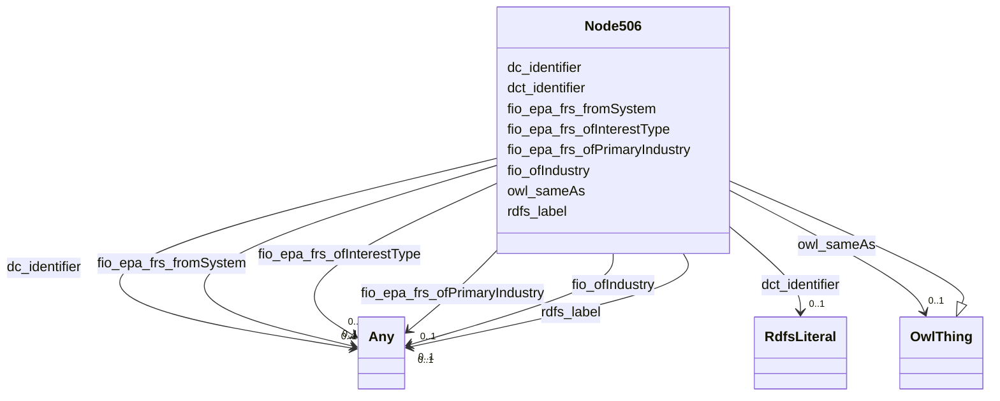

# Class: Node506


This class occurs 23765 times.


URI: [_:node506](_:node506)





## Inheritance
* [OwlThing](../classes/OwlThing.md)
    * **Node506**


## Slots

| Name | Cardinality and Range | Description | Inheritance | Occurrences |
| ---  | --- | --- | --- | --- |
| [rdfs_label](../slots/rdfs_label.md) | 0..1 <br/> [RdfsLiteral](../classes/RdfsLiteral.md)&nbsp;or&nbsp;<br />[xsd:string](http://www.w3.org/2001/XMLSchema#string) | A human-readable name for the subject <br/>  | direct | 23815 |
| [dct_identifier](../slots/dct_identifier.md) | 0..1 <br/> [RdfsLiteral](../classes/RdfsLiteral.md) | Recommended practice is to identify the resource by means of a string conform... <br/> description: An unambiguous reference to the resource within a given context.<br/>No occurrences of this slot in the graph. | direct | 23765 |
| [fio_ofIndustry](../slots/fio_ofIndustry.md) | 0..1 <br/> [OwlNamedIndividual](../classes/OwlNamedIndividual.md)&nbsp;or&nbsp;<br />[OwlThing](../classes/OwlThing.md)&nbsp;or&nbsp;<br />[NaicsNAICS-IndustryGroup](../classes/NaicsNAICS-IndustryGroup.md)&nbsp;or&nbsp;<br />[FioIndustry](../classes/FioIndustry.md)&nbsp;or&nbsp;<br />[NaicsNAICS-IndustryCode](../classes/NaicsNAICS-IndustryCode.md)&nbsp;or&nbsp;<br />[NaicsNAICS-IndustrySector](../classes/NaicsNAICS-IndustrySector.md)&nbsp;or&nbsp;<br />[NaicsNAICS-IndustrySubsector](../classes/NaicsNAICS-IndustrySubsector.md) | A relation between an entity and the industry it is classified under <br/>  | direct | 149509 |
| [dc_identifier](../slots/dc_identifier.md) | 0..1 <br/> [Any](../classes/Any.md) | Recommended practice is to identify the resource by means of a string conform... <br/> description: An unambiguous reference to the resource within a given context.<br/>No occurrences of this slot in the graph. | direct | 23765 |
| [fio_epa_frs_ofInterestType](../slots/fio_epa_frs_ofInterestType.md) | 0..1 <br/> [Fio-epa-frsChemicalReleaseProgram](../classes/Fio-epa-frsChemicalReleaseProgram.md)&nbsp;or&nbsp;<br />[Fio-epa-frsGroundWaterProgram](../classes/Fio-epa-frsGroundWaterProgram.md)&nbsp;or&nbsp;<br />[Fio-epa-frsLegalEnforcementActivities](../classes/Fio-epa-frsLegalEnforcementActivities.md)&nbsp;or&nbsp;<br />[Fio-epa-frsAnimalOperation](../classes/Fio-epa-frsAnimalOperation.md)&nbsp;or&nbsp;<br />[Fio-epa-frsPesticidesProgram](../classes/Fio-epa-frsPesticidesProgram.md)&nbsp;or&nbsp;<br />[Fio-epa-frsEnvironmentalInterestByProgram](../classes/Fio-epa-frsEnvironmentalInterestByProgram.md)&nbsp;or&nbsp;<br />[Fio-epa-frsComplianceInterest](../classes/Fio-epa-frsComplianceInterest.md)&nbsp;or&nbsp;<br />[Fio-epa-frsSolidWasteProgram](../classes/Fio-epa-frsSolidWasteProgram.md)&nbsp;or&nbsp;<br />[Fio-epa-frsRiskInterest](../classes/Fio-epa-frsRiskInterest.md)&nbsp;or&nbsp;<br />[Fio-epa-frsRemediationRedevelopmentProgram](../classes/Fio-epa-frsRemediationRedevelopmentProgram.md)&nbsp;or&nbsp;<br />[Fio-epa-frsWasteWaterProgram](../classes/Fio-epa-frsWasteWaterProgram.md)&nbsp;or&nbsp;<br />[Fio-epa-frsHazardousWasteProgram](../classes/Fio-epa-frsHazardousWasteProgram.md)&nbsp;or&nbsp;<br />[Fio-epa-frsElectronicPermitSystem](../classes/Fio-epa-frsElectronicPermitSystem.md)&nbsp;or&nbsp;<br />[Fio-epa-frsWaterResourcesProgram](../classes/Fio-epa-frsWaterResourcesProgram.md)&nbsp;or&nbsp;<br />[Fio-epa-frsReportingInterest](../classes/Fio-epa-frsReportingInterest.md)&nbsp;or&nbsp;<br />[Fio-epa-frsSiteInterest](../classes/Fio-epa-frsSiteInterest.md)&nbsp;or&nbsp;<br />[Fio-epa-frsAssistanceSupportProgram](../classes/Fio-epa-frsAssistanceSupportProgram.md)&nbsp;or&nbsp;<br />[Fio-epa-frsAirProgram](../classes/Fio-epa-frsAirProgram.md)&nbsp;or&nbsp;<br />[Fio-epa-frsEnforcementInterest](../classes/Fio-epa-frsEnforcementInterest.md)&nbsp;or&nbsp;<br />[OwlThing](../classes/OwlThing.md)&nbsp;or&nbsp;<br />[Fio-epa-frsHealthSafetyProgram](../classes/Fio-epa-frsHealthSafetyProgram.md)&nbsp;or&nbsp;<br />[Fio-epa-frsChemicalStorageProgram](../classes/Fio-epa-frsChemicalStorageProgram.md)&nbsp;or&nbsp;<br />[Fio-epa-frsUndergroundStorageTankProgram](../classes/Fio-epa-frsUndergroundStorageTankProgram.md)&nbsp;or&nbsp;<br />[Fio-epa-frsDrinkingWaterProgram](../classes/Fio-epa-frsDrinkingWaterProgram.md)&nbsp;or&nbsp;<br />[Fio-epa-frsCoastalOceanProgram](../classes/Fio-epa-frsCoastalOceanProgram.md)&nbsp;or&nbsp;<br />[Fio-epa-frsEnvironmentalInterestType](../classes/Fio-epa-frsEnvironmentalInterestType.md)&nbsp;or&nbsp;<br />[Fio-epa-frsPermitInterest](../classes/Fio-epa-frsPermitInterest.md)&nbsp;or&nbsp;<br />[Fio-epa-frsFacilitySiteIdentification](../classes/Fio-epa-frsFacilitySiteIdentification.md)&nbsp;or&nbsp;<br />[Fio-epa-frsRegistryInterest](../classes/Fio-epa-frsRegistryInterest.md)&nbsp;or&nbsp;<br />[Fio-epa-frsRadiationProtectionProgram](../classes/Fio-epa-frsRadiationProtectionProgram.md) |  <br/>  | direct | 31275 |
| [fio_epa_frs_ofPrimaryIndustry](../slots/fio_epa_frs_ofPrimaryIndustry.md) | 0..1 <br/> [OwlNamedIndividual](../classes/OwlNamedIndividual.md)&nbsp;or&nbsp;<br />[OwlThing](../classes/OwlThing.md)&nbsp;or&nbsp;<br />[NaicsNAICS-IndustryGroup](../classes/NaicsNAICS-IndustryGroup.md)&nbsp;or&nbsp;<br />[FioIndustry](../classes/FioIndustry.md)&nbsp;or&nbsp;<br />[NaicsNAICS-IndustryCode](../classes/NaicsNAICS-IndustryCode.md)&nbsp;or&nbsp;<br />[NaicsNAICS-IndustrySector](../classes/NaicsNAICS-IndustrySector.md)&nbsp;or&nbsp;<br />[NaicsNAICS-IndustrySubsector](../classes/NaicsNAICS-IndustrySubsector.md) |  <br/>  | direct | 29133 |
| [owl_sameAs](../slots/owl_sameAs.md) | 0..1 <br/> [OwlThing](../classes/OwlThing.md) | The property that determines that two given individuals are equal <br/> No occurrences of this slot in the graph. | direct | 47675 |
| [fio_epa_frs_fromSystem](../slots/fio_epa_frs_fromSystem.md) | 0..1 <br/> [Fio-epa-frsStateSystem](../classes/Fio-epa-frsStateSystem.md)&nbsp;or&nbsp;<br />[OwlThing](../classes/OwlThing.md)&nbsp;or&nbsp;<br />[Fio-epa-frsRegistrySystem](../classes/Fio-epa-frsRegistrySystem.md)&nbsp;or&nbsp;<br />[Fio-epa-frsLegacySystem](../classes/Fio-epa-frsLegacySystem.md)&nbsp;or&nbsp;<br />[Fio-epa-frsComplianceSystem](../classes/Fio-epa-frsComplianceSystem.md)&nbsp;or&nbsp;<br />[Fio-epa-frsPermitSystem](../classes/Fio-epa-frsPermitSystem.md)&nbsp;or&nbsp;<br />[Fio-epa-frsEnforcementSystem](../classes/Fio-epa-frsEnforcementSystem.md)&nbsp;or&nbsp;<br />[Fio-epa-frsTribalSystem](../classes/Fio-epa-frsTribalSystem.md)&nbsp;or&nbsp;<br />[Fio-epa-frsProjectSystem](../classes/Fio-epa-frsProjectSystem.md)&nbsp;or&nbsp;<br />[Fio-epa-frsProgramInformationSystem](../classes/Fio-epa-frsProgramInformationSystem.md)&nbsp;or&nbsp;<br />[Fio-epa-frsSiteSystem](../classes/Fio-epa-frsSiteSystem.md)&nbsp;or&nbsp;<br />[Fio-epa-frsGrantSystem](../classes/Fio-epa-frsGrantSystem.md)&nbsp;or&nbsp;<br />[Fio-epa-frsReportingSystem](../classes/Fio-epa-frsReportingSystem.md) |  <br/>  | direct | 27851 |


## Usages

| used by | used in | type | used |
| ---  | --- | --- | --- |
| [Node499](../classes/Node499.md) | [fio_epa_frs_hasRecord](../slots/fio_epa_frs_hasRecord.md) | any_of[range] | [Node506](../classes/Node506.md) |
| [Node501](../classes/Node501.md) | [fio_epa_frs_hasRecord](../slots/fio_epa_frs_hasRecord.md) | any_of[range] | [Node506](../classes/Node506.md) |
| [Node502](../classes/Node502.md) | [fio_epa_frs_hasRecord](../slots/fio_epa_frs_hasRecord.md) | any_of[range] | [Node506](../classes/Node506.md) |
| [Node510](../classes/Node510.md) | [fio_epa_frs_hasRecord](../slots/fio_epa_frs_hasRecord.md) | any_of[range] | [Node506](../classes/Node506.md) |
| [Node513](../classes/Node513.md) | [fio_epa_frs_hasRecord](../slots/fio_epa_frs_hasRecord.md) | any_of[range] | [Node506](../classes/Node506.md) |
| [Node515](../classes/Node515.md) | [fio_epa_frs_hasRecord](../slots/fio_epa_frs_hasRecord.md) | any_of[range] | [Node506](../classes/Node506.md) |
| [Node517](../classes/Node517.md) | [fio_epa_frs_hasRecord](../slots/fio_epa_frs_hasRecord.md) | any_of[range] | [Node506](../classes/Node506.md) |
| [Node518](../classes/Node518.md) | [fio_epa_frs_hasRecord](../slots/fio_epa_frs_hasRecord.md) | any_of[range] | [Node506](../classes/Node506.md) |
| [Node521](../classes/Node521.md) | [fio_epa_frs_hasRecord](../slots/fio_epa_frs_hasRecord.md) | any_of[range] | [Node506](../classes/Node506.md) |
| [Node523](../classes/Node523.md) | [fio_epa_frs_hasRecord](../slots/fio_epa_frs_hasRecord.md) | any_of[range] | [Node506](../classes/Node506.md) |
| [Fio-epa-frsEPA-PFAS-Facility](../classes/Fio-epa-frsEPA-PFAS-Facility.md) | [fio_epa_frs_hasRecord](../slots/fio_epa_frs_hasRecord.md) | any_of[range] | [Node506](../classes/Node506.md) |
| [Fio-epa-frsFRS-Facility](../classes/Fio-epa-frsFRS-Facility.md) | [fio_epa_frs_hasRecord](../slots/fio_epa_frs_hasRecord.md) | any_of[range] | [Node506](../classes/Node506.md) |
| [Fio-epa-frsRecord](../classes/Fio-epa-frsRecord.md) | [fio_epa_frs_hasRecord](../slots/fio_epa_frs_hasRecord.md) | any_of[range] | [Node506](../classes/Node506.md) |
| [Fio-epa-frsSupplementalRecord](../classes/Fio-epa-frsSupplementalRecord.md) | [fio_epa_frs_hasRecord](../slots/fio_epa_frs_hasRecord.md) | any_of[range] | [Node506](../classes/Node506.md) |


## LinkML Source

<!-- TODO: investigate https://stackoverflow.com/questions/37606292/how-to-create-tabbed-code-blocks-in-mkdocs-or-sphinx -->

### Direct

<details>

```yaml
name: __node506
from_schema: okns:fiokg
exact_mappings:
- _:node506
rank: 1000
is_a: owl_Thing
slots:
- rdfs_label
- dct_identifier
- fio_ofIndustry
- dc_identifier
- fio-epa-frs_ofInterestType
- fio-epa-frs_ofPrimaryIndustry
- owl_sameAs
- fio-epa-frs_fromSystem
class_uri: _:node506

```
</details>

### Induced

<details>

```yaml
name: __node506
from_schema: okns:fiokg
exact_mappings:
- _:node506
rank: 1000
is_a: owl_Thing
attributes:
  rdfs_label:
    name: rdfs_label
    description: A human-readable name for the subject.
    title: label
    from_schema: okns:owl-rdf-rdfs
    source: http://www.w3.org/2000/01/rdf-schema#
    domain: rdfs_Resource
    slot_uri: rdfs:label
    alias: rdfs_label
    owner: __node506
    domain_of:
    - dcam_VocabularyEncodingScheme
    - owl_OntologyProperty
    - rdf_List
    - rdfs_Datatype
    - time_DayOfWeek
    - time_TemporalUnit
    - sdos_ActionStatusType
    - sdos_AdultOrientedEnumeration
    - sdos_BoardingPolicyType
    - sdos_BodyMeasurementTypeEnumeration
    - sdos_BookFormatType
    - sdos_Boolean
    - sdos_CarUsageType
    - sdos_CertificationStatusEnumeration
    - sdos_ContactPointOption
    - sdos_DayOfWeek
    - sdos_DeliveryMethod
    - sdos_DigitalDocumentPermissionType
    - sdos_DigitalPlatformEnumeration
    - sdos_DriveWheelConfigurationValue
    - sdos_DrugCostCategory
    - sdos_DrugPregnancyCategory
    - sdos_DrugPrescriptionStatus
    - sdos_EUEnergyEfficiencyEnumeration
    - sdos_EnergyStarEnergyEfficiencyEnumeration
    - sdos_EventAttendanceModeEnumeration
    - sdos_EventStatusType
    - sdos_FulfillmentTypeEnumeration
    - sdos_GameAvailabilityEnumeration
    - sdos_GamePlayMode
    - sdos_GameServerStatus
    - sdos_GenderType
    - sdos_GovernmentBenefitsType
    - sdos_HealthAspectEnumeration
    - sdos_IPTCDigitalSourceEnumeration
    - sdos_IncentiveQualifiedExpenseType
    - sdos_IncentiveStatus
    - sdos_IncentiveType
    - sdos_InfectiousAgentClass
    - sdos_ItemAvailability
    - sdos_ItemListOrderType
    - sdos_LegalForceStatus
    - sdos_LegalValueLevel
    - sdos_MapCategoryType
    - sdos_MeasurementMethodEnum
    - sdos_MediaManipulationRatingEnumeration
    - sdos_MedicalAudienceType
    - sdos_MedicalDevicePurpose
    - sdos_MedicalEvidenceLevel
    - sdos_MedicalImagingTechnique
    - sdos_MedicalObservationalStudyDesign
    - sdos_MedicalProcedureType
    - sdos_MedicalSpecialty
    - sdos_MedicalStudyStatus
    - sdos_MedicalTrialDesign
    - sdos_MedicineSystem
    - sdos_MerchantReturnEnumeration
    - sdos_MusicAlbumProductionType
    - sdos_MusicAlbumReleaseType
    - sdos_MusicReleaseFormatType
    - sdos_NLNonprofitType
    - sdos_OfferItemCondition
    - sdos_OrderStatus
    - sdos_PaymentMethodType
    - sdos_PaymentStatusType
    - sdos_PhysicalActivityCategory
    - sdos_PhysicalExam
    - sdos_PriceComponentTypeEnumeration
    - sdos_PriceTypeEnumeration
    - sdos_ProductReturnEnumeration
    - sdos_PurchaseType
    - sdos_RefundTypeEnumeration
    - sdos_ReservationStatusType
    - sdos_RestrictedDiet
    - sdos_ReturnFeesEnumeration
    - sdos_ReturnLabelSourceEnumeration
    - sdos_ReturnMethodEnumeration
    - sdos_RsvpResponseType
    - sdos_SizeSystemEnumeration
    - sdos_SteeringPositionValue
    - sdos_TierBenefitEnumeration
    - sdos_UKNonprofitType
    - sdos_USNonprofitType
    - sdos_WearableMeasurementTypeEnumeration
    - sdos_WearableSizeGroupEnumeration
    - sdos_WearableSizeSystemEnumeration
    - rdf_DatatypeProperty
    - vaem_GraphMetaData
    - vaem_GraphRole
    - vaem_Party
    - vaem_CatalogEntry
    - voag_Attribution
    - voag_AttributionLogo
    - voag_ChangeFrequency
    - voag_ChangeType
    - voag_ConfidentialityLevel
    - voag_CreativeCommonsPermission
    - voag_CreativeCommonsProhibition
    - voag_CreativeCommonsRequirement
    - voag_Governance
    - voag_GovernanceRole
    - voag_Icon
    - voag_IssueStatus
    - voag_LicenseModel
    - voag_Logo
    - voag_Maturity
    - voag_OrganizationLogo
    - voag_Pedigree
    - voag_PriorityValue
    - voag_ProductLogo
    - voag_Provenance
    - voag_PublicationStatus
    - voag_SchemaGraph
    - qudt_AspectClass
    - qudt_BitEncodingType
    - qudt_BooleanEncodingType
    - qudt_ByteEncodingType
    - qudt_CardinalityType
    - qudt_CharEncodingType
    - qudt_DateTimeStringEncodingType
    - qudt_EndianType
    - qudt_FloatingPointEncodingType
    - qudt_IntegerEncodingType
    - qudt_OrderedType
    - qudt_SignednessType
    - kwgo_AirPollutant
    - kwgo_BlueskyWildfireObservableProperty
    - kwgo_CensusObservableProperty
    - kwgo_ClimateObservableProperty
    - kwgo_CroplandObservableProperty
    - kwgo_DroughtIntensity
    - kwgo_FireCause
    - kwgo_HelipadAvailability
    - kwgo_HospitalStatus
    - kwgo_HospitalType
    - kwgo_ImpactObservableProperty
    - kwgo_LSADArea
    - kwgo_MTBSFireObservableProperty
    - kwgo_MagnitudeObservableProperty
    - kwgo_NIFCFireObservableProperty
    - kwgo_PublicHealthObservableProperty
    - kwgo_RoadType
    - kwgo_SmokePlumeObservableProperty
    - kwgo_SoilMapUnitObservableProperty
    - kwgo_StormTrackObservableProperty
    - kwgo_StormTrackletObservableProperty
    - kwgo_VulnerabilityObservableProperty
    - __node359
    - __node499
    - __node501
    - __node502
    - __node506
    - __node507
    - __node508
    - __node510
    - __node512
    - __node513
    - __node515
    - __node517
    - __node518
    - __node519
    - __node521
    - __node523
    - fio-epa-frs_Agency
    - fio-epa-frs_Agency.Agriculture
    - fio-epa-frs_Agency.Commerce
    - fio-epa-frs_Agency.Congress
    - fio-epa-frs_Agency.Defense
    - fio-epa-frs_Agency.Energy
    - fio-epa-frs_Agency.HealthandHumanServices
    - fio-epa-frs_Agency.HomelandSecurity
    - fio-epa-frs_Agency.HousingandUrbanDevelopment
    - fio-epa-frs_Agency.Interior
    - fio-epa-frs_Agency.Judicial
    - fio-epa-frs_Agency.Justice
    - fio-epa-frs_Agency.Labor
    - fio-epa-frs_Agency.State
    - fio-epa-frs_Agency.Transportation
    - fio-epa-frs_Agency.Treasury
    - fio-epa-frs_Agency.VeteransAffairs
    - fio-epa-frs_AirProgram
    - fio-epa-frs_AnimalOperation
    - fio-epa-frs_AssistanceSupportProgram
    - fio-epa-frs_ChemicalReleaseProgram
    - fio-epa-frs_ChemicalStorageProgram
    - fio-epa-frs_CoastalOceanProgram
    - fio-epa-frs_ComplianceInterest
    - fio-epa-frs_ComplianceSystem
    - fio-epa-frs_DrinkingWaterProgram
    - fio-epa-frs_EPA-PFAS-Facility
    - fio-epa-frs_EcologyOperation
    - fio-epa-frs_ElectronicPermitSystem
    - fio-epa-frs_EnforcementInterest
    - fio-epa-frs_EnforcementSystem
    - fio-epa-frs_EnvironmentalInterestByProgram
    - fio-epa-frs_EnvironmentalInterestType
    - fio-epa-frs_FRS-Facility
    - fio-epa-frs_FacilitySiteIdentification
    - fio-epa-frs_FacilityType
    - fio-epa-frs_GrantSystem
    - fio-epa-frs_GroundWaterProgram
    - fio-epa-frs_HazardousWasteProgram
    - fio-epa-frs_HealthSafetyProgram
    - fio-epa-frs_LegacySystem
    - fio-epa-frs_LegalEnforcementActivities
    - fio-epa-frs_PermitInterest
    - fio-epa-frs_PermitSystem
    - fio-epa-frs_PesticidesProgram
    - fio-epa-frs_ProgramInformationSystem
    - fio-epa-frs_ProjectSystem
    - fio-epa-frs_RadiationProtectionProgram
    - fio-epa-frs_RegistryInterest
    - fio-epa-frs_RegistrySystem
    - fio-epa-frs_RemediationRedevelopmentProgram
    - fio-epa-frs_ReportingInterest
    - fio-epa-frs_ReportingSystem
    - fio-epa-frs_RiskInterest
    - fio-epa-frs_SiteInterest
    - fio-epa-frs_SiteSystem
    - fio-epa-frs_SolidWasteProgram
    - fio-epa-frs_StateSystem
    - fio-epa-frs_SupplementalRecord
    - fio-epa-frs_TribalSystem
    - fio-epa-frs_UndergroundStorageTankProgram
    - fio-epa-frs_WasteWaterProgram
    - fio-epa-frs_WaterResourcesProgram
    - naics_NAICS-IndustryCode
    - naics_NAICS-IndustryGroup
    - naics_NAICS-IndustrySector
    - naics_NAICS-IndustrySubsector
    range: Any
    any_of:
    - range: rdfs_Literal
    - range: string
  dct_identifier:
    name: dct_identifier
    description: Recommended practice is to identify the resource by means of a string
      conforming to an identification system. Examples include International Standard
      Book Number (ISBN), Digital Object Identifier (DOI), and Uniform Resource Name
      (URN).  Persistent identifiers should be provided as HTTP URIs.
    title: Identifier
    comments:
    - 'description: An unambiguous reference to the resource within a given context.'
    - No occurrences of this slot in the graph.
    from_schema: okns:dc
    source: http://purl.org/dc/terms/
    slot_uri: dct:identifier
    alias: dct_identifier
    owner: __node506
    domain_of:
    - __node359
    - __node499
    - __node501
    - __node502
    - __node506
    - __node507
    - __node508
    - __node510
    - __node512
    - __node513
    - __node515
    - __node517
    - __node518
    - __node519
    - __node521
    - __node523
    - fio-epa-frs_EPA-PFAS-Facility
    - fio-epa-frs_FRS-Facility
    - fio-epa-frs_Record
    - fio-epa-frs_SupplementalRecord
    - naics_NAICS-IndustryCode
    - naics_NAICS-IndustryGroup
    - naics_NAICS-IndustrySector
    - naics_NAICS-IndustrySubsector
    subproperty_of: dc_identifier
    range: rdfs_Literal
  fio_ofIndustry:
    name: fio_ofIndustry
    description: A relation between an entity and the industry it is classified under
    title: of industry
    from_schema: okns:fiokg
    exact_mappings:
    - http://w3id.org/fio/v1/fio#ofIndustry
    rank: 1000
    slot_uri: fio:ofIndustry
    alias: fio_ofIndustry
    owner: __node506
    domain_of:
    - __node359
    - __node499
    - __node501
    - __node502
    - __node506
    - __node510
    - __node512
    - __node513
    - __node515
    - __node517
    - __node518
    - fio-epa-frs_EPA-PFAS-Facility
    - fio-epa-frs_FRS-Facility
    - fio-epa-frs_Record
    - fio-epa-frs_SupplementalRecord
    range: Any
    any_of:
    - range: owl_NamedIndividual
    - range: owl_Thing
    - range: naics_NAICS-IndustryGroup
    - range: fio_Industry
    - range: naics_NAICS-IndustryCode
    - range: naics_NAICS-IndustrySector
    - range: naics_NAICS-IndustrySubsector
  dc_identifier:
    name: dc_identifier
    description: Recommended practice is to identify the resource by means of a string
      conforming to an identification system.
    title: Identifier
    notes:
    - 'A [second property](/specifications/dublin-core/dcmi-terms/#http://purl.org/dc/terms/identifier)
      with the same name as this property has been declared in the [dcterms: namespace](http://purl.org/dc/terms/).  See
      the Introduction to the document [DCMI Metadata Terms](/specifications/dublin-core/dcmi-terms/)
      for an explanation.'
    comments:
    - 'description: An unambiguous reference to the resource within a given context.'
    - No occurrences of this slot in the graph.
    from_schema: okns:dc
    source: http://purl.org/dc/elements/1.1/
    slot_uri: dc:identifier
    alias: dc_identifier
    owner: __node506
    domain_of:
    - __node359
    - __node499
    - __node501
    - __node502
    - __node506
    - __node507
    - __node508
    - __node510
    - __node512
    - __node513
    - __node515
    - __node517
    - __node518
    - __node519
    - __node521
    - __node523
    - fio-epa-frs_EPA-PFAS-Facility
    - fio-epa-frs_FRS-Facility
    - fio-epa-frs_Record
    - fio-epa-frs_SupplementalRecord
    - naics_NAICS-IndustryCode
    - naics_NAICS-IndustryGroup
    - naics_NAICS-IndustrySector
    - naics_NAICS-IndustrySubsector
    range: Any
  fio-epa-frs_ofInterestType:
    name: fio-epa-frs_ofInterestType
    title: of program category
    from_schema: okns:fiokg
    exact_mappings:
    - http://w3id.org/fio/v1/epa-frs#ofInterestType
    rank: 1000
    slot_uri: fio-epa-frs:ofInterestType
    alias: fio_epa_frs_ofInterestType
    owner: __node506
    domain_of:
    - __node359
    - __node499
    - __node501
    - __node502
    - __node506
    - __node507
    - __node508
    - __node510
    - __node512
    - __node513
    - __node515
    - __node517
    - __node518
    - __node519
    - __node521
    - __node523
    - fio-epa-frs_FRS-Facility
    - fio-epa-frs_SupplementalRecord
    range: Any
    any_of:
    - range: fio-epa-frs_ChemicalReleaseProgram
    - range: fio-epa-frs_GroundWaterProgram
    - range: fio-epa-frs_LegalEnforcementActivities
    - range: fio-epa-frs_AnimalOperation
    - range: fio-epa-frs_PesticidesProgram
    - range: fio-epa-frs_EnvironmentalInterestByProgram
    - range: fio-epa-frs_ComplianceInterest
    - range: fio-epa-frs_SolidWasteProgram
    - range: fio-epa-frs_RiskInterest
    - range: fio-epa-frs_RemediationRedevelopmentProgram
    - range: fio-epa-frs_WasteWaterProgram
    - range: fio-epa-frs_HazardousWasteProgram
    - range: fio-epa-frs_ElectronicPermitSystem
    - range: fio-epa-frs_WaterResourcesProgram
    - range: fio-epa-frs_ReportingInterest
    - range: fio-epa-frs_SiteInterest
    - range: fio-epa-frs_AssistanceSupportProgram
    - range: fio-epa-frs_AirProgram
    - range: fio-epa-frs_EnforcementInterest
    - range: owl_Thing
    - range: fio-epa-frs_HealthSafetyProgram
    - range: fio-epa-frs_ChemicalStorageProgram
    - range: fio-epa-frs_UndergroundStorageTankProgram
    - range: fio-epa-frs_DrinkingWaterProgram
    - range: fio-epa-frs_CoastalOceanProgram
    - range: fio-epa-frs_EnvironmentalInterestType
    - range: fio-epa-frs_PermitInterest
    - range: fio-epa-frs_FacilitySiteIdentification
    - range: fio-epa-frs_RegistryInterest
    - range: fio-epa-frs_RadiationProtectionProgram
  fio-epa-frs_ofPrimaryIndustry:
    name: fio-epa-frs_ofPrimaryIndustry
    title: of Primary Industry
    from_schema: okns:fiokg
    exact_mappings:
    - http://w3id.org/fio/v1/epa-frs#ofPrimaryIndustry
    rank: 1000
    slot_uri: fio-epa-frs:ofPrimaryIndustry
    alias: fio_epa_frs_ofPrimaryIndustry
    owner: __node506
    domain_of:
    - __node359
    - __node499
    - __node501
    - __node502
    - __node506
    - __node510
    - __node512
    - __node513
    - __node515
    - __node517
    - __node518
    - fio-epa-frs_FRS-Facility
    - fio-epa-frs_Record
    - fio-epa-frs_SupplementalRecord
    subproperty_of: fio_ofIndustry
    range: Any
    any_of:
    - range: owl_NamedIndividual
    - range: owl_Thing
    - range: naics_NAICS-IndustryGroup
    - range: fio_Industry
    - range: naics_NAICS-IndustryCode
    - range: naics_NAICS-IndustrySector
    - range: naics_NAICS-IndustrySubsector
  owl_sameAs:
    name: owl_sameAs
    description: The property that determines that two given individuals are equal.
    title: sameAs
    comments:
    - No occurrences of this slot in the graph.
    from_schema: okns:owl-rdf-rdfs
    source: http://www.w3.org/2002/07/owl#
    domain: owl_Thing
    slot_uri: owl:sameAs
    alias: owl_sameAs
    owner: __node506
    domain_of:
    - __node359
    - __node499
    - __node501
    - __node502
    - __node506
    - __node507
    - __node508
    - __node510
    - __node512
    - __node513
    - __node515
    - __node517
    - __node518
    - __node519
    - __node521
    - __node523
    - fio-epa-frs_Agency
    - fio-epa-frs_Agency.Agriculture
    - fio-epa-frs_Agency.Commerce
    - fio-epa-frs_Agency.Congress
    - fio-epa-frs_Agency.Defense
    - fio-epa-frs_Agency.Energy
    - fio-epa-frs_Agency.HealthandHumanServices
    - fio-epa-frs_Agency.HomelandSecurity
    - fio-epa-frs_Agency.HousingandUrbanDevelopment
    - fio-epa-frs_Agency.Interior
    - fio-epa-frs_Agency.Judicial
    - fio-epa-frs_Agency.Justice
    - fio-epa-frs_Agency.Labor
    - fio-epa-frs_Agency.State
    - fio-epa-frs_Agency.Transportation
    - fio-epa-frs_Agency.Treasury
    - fio-epa-frs_Agency.VeteransAffairs
    - fio-epa-frs_AirProgram
    - fio-epa-frs_AnimalOperation
    - fio-epa-frs_AssistanceSupportProgram
    - fio-epa-frs_ChemicalReleaseProgram
    - fio-epa-frs_ChemicalStorageProgram
    - fio-epa-frs_CoastalOceanProgram
    - fio-epa-frs_ComplianceInterest
    - fio-epa-frs_ComplianceSystem
    - fio-epa-frs_DrinkingWaterProgram
    - fio-epa-frs_EPA-PFAS-Facility
    - fio-epa-frs_EcologyOperation
    - fio-epa-frs_ElectronicPermitSystem
    - fio-epa-frs_EnforcementInterest
    - fio-epa-frs_EnforcementSystem
    - fio-epa-frs_EnvironmentalInterestByProgram
    - fio-epa-frs_EnvironmentalInterestType
    - fio-epa-frs_FRS-Facility
    - fio-epa-frs_FacilitySiteIdentification
    - fio-epa-frs_FacilityType
    - fio-epa-frs_GrantSystem
    - fio-epa-frs_GroundWaterProgram
    - fio-epa-frs_HazardousWasteProgram
    - fio-epa-frs_HealthSafetyProgram
    - fio-epa-frs_LegacySystem
    - fio-epa-frs_LegalEnforcementActivities
    - fio-epa-frs_PermitInterest
    - fio-epa-frs_PermitSystem
    - fio-epa-frs_PesticidesProgram
    - fio-epa-frs_ProgramInformationSystem
    - fio-epa-frs_ProjectSystem
    - fio-epa-frs_RadiationProtectionProgram
    - fio-epa-frs_Record
    - fio-epa-frs_RegistryInterest
    - fio-epa-frs_RegistrySystem
    - fio-epa-frs_RemediationRedevelopmentProgram
    - fio-epa-frs_ReportingInterest
    - fio-epa-frs_ReportingSystem
    - fio-epa-frs_RiskInterest
    - fio-epa-frs_SiteInterest
    - fio-epa-frs_SiteSystem
    - fio-epa-frs_SolidWasteProgram
    - fio-epa-frs_StateSystem
    - fio-epa-frs_SupplementalRecord
    - fio-epa-frs_TribalSystem
    - fio-epa-frs_UndergroundStorageTankProgram
    - fio-epa-frs_WasteWaterProgram
    - fio-epa-frs_WaterResourcesProgram
    - fio_Industry
    - kwgo_S2Cell_Level13
    - naics_NAICS-IndustryCode
    - naics_NAICS-IndustryGroup
    - naics_NAICS-IndustrySector
    - naics_NAICS-IndustrySubsector
    range: owl_Thing
  fio-epa-frs_fromSystem:
    name: fio-epa-frs_fromSystem
    from_schema: okns:fiokg
    exact_mappings:
    - http://w3id.org/fio/v1/epa-frs#fromSystem
    rank: 1000
    slot_uri: fio-epa-frs:fromSystem
    alias: fio_epa_frs_fromSystem
    owner: __node506
    domain_of:
    - __node359
    - __node499
    - __node501
    - __node502
    - __node506
    - __node507
    - __node508
    - __node510
    - __node512
    - __node513
    - __node515
    - __node517
    - __node518
    - __node519
    - __node521
    - __node523
    - fio-epa-frs_FRS-Facility
    - fio-epa-frs_Record
    - fio-epa-frs_SupplementalRecord
    range: Any
    any_of:
    - range: fio-epa-frs_StateSystem
    - range: owl_Thing
    - range: fio-epa-frs_RegistrySystem
    - range: fio-epa-frs_LegacySystem
    - range: fio-epa-frs_ComplianceSystem
    - range: fio-epa-frs_PermitSystem
    - range: fio-epa-frs_EnforcementSystem
    - range: fio-epa-frs_TribalSystem
    - range: fio-epa-frs_ProjectSystem
    - range: fio-epa-frs_ProgramInformationSystem
    - range: fio-epa-frs_SiteSystem
    - range: fio-epa-frs_GrantSystem
    - range: fio-epa-frs_ReportingSystem
class_uri: _:node506

```
</details>