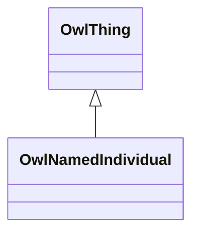

# Class: NamedIndividual (owl_NamedIndividual)


_The class of named individuals._


This class occurs 2308 times.


URI: [owl:NamedIndividual](http://www.w3.org/2002/07/owl#NamedIndividual)





## Inheritance
* [OwlThing](../classes/OwlThing.md)
    * **OwlNamedIndividual**


## Slots

| Name | Cardinality and Range | Description | Inheritance | Occurrences |
| ---  | --- | --- | --- | --- |


## Usages

| used by | used in | type | used |
| ---  | --- | --- | --- |
| [B43f2153f8fa51cc860da104aa4b996c7](../classes/B43f2153f8fa51cc860da104aa4b996c7.md) | [fio_ofIndustry](../slots/fio_ofIndustry.md) | any_of[range] | [OwlNamedIndividual](../classes/OwlNamedIndividual.md) |
| [B43f2153f8fa51cc860da104aa4b996c7](../classes/B43f2153f8fa51cc860da104aa4b996c7.md) | [fio_epa_frs_ofPrimaryIndustry](../slots/fio_epa_frs_ofPrimaryIndustry.md) | any_of[range] | [OwlNamedIndividual](../classes/OwlNamedIndividual.md) |
| [B43f2153f8fa51cc860da104aa4b996c7](../classes/B43f2153f8fa51cc860da104aa4b996c7.md) | [fio_epa_frs_ofSecondaryIndustry](../slots/fio_epa_frs_ofSecondaryIndustry.md) | any_of[range] | [OwlNamedIndividual](../classes/OwlNamedIndividual.md) |
| [B51b8d66516b28a1c54f8d745ede947b9](../classes/B51b8d66516b28a1c54f8d745ede947b9.md) | [fio_ofIndustry](../slots/fio_ofIndustry.md) | any_of[range] | [OwlNamedIndividual](../classes/OwlNamedIndividual.md) |
| [B51b8d66516b28a1c54f8d745ede947b9](../classes/B51b8d66516b28a1c54f8d745ede947b9.md) | [fio_epa_frs_ofPrimaryIndustry](../slots/fio_epa_frs_ofPrimaryIndustry.md) | any_of[range] | [OwlNamedIndividual](../classes/OwlNamedIndividual.md) |
| [B51b8d66516b28a1c54f8d745ede947b9](../classes/B51b8d66516b28a1c54f8d745ede947b9.md) | [fio_epa_frs_ofSecondaryIndustry](../slots/fio_epa_frs_ofSecondaryIndustry.md) | any_of[range] | [OwlNamedIndividual](../classes/OwlNamedIndividual.md) |
| [B5debef6666ba27aa225105865fd22d6c](../classes/B5debef6666ba27aa225105865fd22d6c.md) | [fio_ofIndustry](../slots/fio_ofIndustry.md) | any_of[range] | [OwlNamedIndividual](../classes/OwlNamedIndividual.md) |
| [B5debef6666ba27aa225105865fd22d6c](../classes/B5debef6666ba27aa225105865fd22d6c.md) | [fio_epa_frs_ofSecondaryIndustry](../slots/fio_epa_frs_ofSecondaryIndustry.md) | any_of[range] | [OwlNamedIndividual](../classes/OwlNamedIndividual.md) |
| [B5debef6666ba27aa225105865fd22d6c](../classes/B5debef6666ba27aa225105865fd22d6c.md) | [fio_epa_frs_ofPrimaryIndustry](../slots/fio_epa_frs_ofPrimaryIndustry.md) | any_of[range] | [OwlNamedIndividual](../classes/OwlNamedIndividual.md) |
| [B671ac9cd6796151f919e5affbe3cc5f9](../classes/B671ac9cd6796151f919e5affbe3cc5f9.md) | [fio_ofIndustry](../slots/fio_ofIndustry.md) | any_of[range] | [OwlNamedIndividual](../classes/OwlNamedIndividual.md) |
| [B671ac9cd6796151f919e5affbe3cc5f9](../classes/B671ac9cd6796151f919e5affbe3cc5f9.md) | [fio_epa_frs_ofSecondaryIndustry](../slots/fio_epa_frs_ofSecondaryIndustry.md) | any_of[range] | [OwlNamedIndividual](../classes/OwlNamedIndividual.md) |
| [B671ac9cd6796151f919e5affbe3cc5f9](../classes/B671ac9cd6796151f919e5affbe3cc5f9.md) | [fio_epa_frs_ofPrimaryIndustry](../slots/fio_epa_frs_ofPrimaryIndustry.md) | any_of[range] | [OwlNamedIndividual](../classes/OwlNamedIndividual.md) |
| [B707e8df015ee2912f85cf2fec8dc4718](../classes/B707e8df015ee2912f85cf2fec8dc4718.md) | [fio_ofIndustry](../slots/fio_ofIndustry.md) | any_of[range] | [OwlNamedIndividual](../classes/OwlNamedIndividual.md) |
| [B707e8df015ee2912f85cf2fec8dc4718](../classes/B707e8df015ee2912f85cf2fec8dc4718.md) | [fio_epa_frs_ofPrimaryIndustry](../slots/fio_epa_frs_ofPrimaryIndustry.md) | any_of[range] | [OwlNamedIndividual](../classes/OwlNamedIndividual.md) |
| [B912c2f2722265f457d11b52388b1def0](../classes/B912c2f2722265f457d11b52388b1def0.md) | [fio_ofIndustry](../slots/fio_ofIndustry.md) | any_of[range] | [OwlNamedIndividual](../classes/OwlNamedIndividual.md) |
| [B912c2f2722265f457d11b52388b1def0](../classes/B912c2f2722265f457d11b52388b1def0.md) | [fio_epa_frs_ofPrimaryIndustry](../slots/fio_epa_frs_ofPrimaryIndustry.md) | any_of[range] | [OwlNamedIndividual](../classes/OwlNamedIndividual.md) |
| [B912c2f2722265f457d11b52388b1def0](../classes/B912c2f2722265f457d11b52388b1def0.md) | [fio_epa_frs_ofSecondaryIndustry](../slots/fio_epa_frs_ofSecondaryIndustry.md) | any_of[range] | [OwlNamedIndividual](../classes/OwlNamedIndividual.md) |
| [Ba0ffbf1a7a548fac1e61d3eceada03dd](../classes/Ba0ffbf1a7a548fac1e61d3eceada03dd.md) | [fio_ofIndustry](../slots/fio_ofIndustry.md) | any_of[range] | [OwlNamedIndividual](../classes/OwlNamedIndividual.md) |
| [Ba0ffbf1a7a548fac1e61d3eceada03dd](../classes/Ba0ffbf1a7a548fac1e61d3eceada03dd.md) | [fio_epa_frs_ofSecondaryIndustry](../slots/fio_epa_frs_ofSecondaryIndustry.md) | any_of[range] | [OwlNamedIndividual](../classes/OwlNamedIndividual.md) |
| [Ba0ffbf1a7a548fac1e61d3eceada03dd](../classes/Ba0ffbf1a7a548fac1e61d3eceada03dd.md) | [fio_epa_frs_ofPrimaryIndustry](../slots/fio_epa_frs_ofPrimaryIndustry.md) | any_of[range] | [OwlNamedIndividual](../classes/OwlNamedIndividual.md) |
| [Bdbdbfbd4ef20ffc37226553d96831226](../classes/Bdbdbfbd4ef20ffc37226553d96831226.md) | [fio_ofIndustry](../slots/fio_ofIndustry.md) | any_of[range] | [OwlNamedIndividual](../classes/OwlNamedIndividual.md) |
| [Bdbdbfbd4ef20ffc37226553d96831226](../classes/Bdbdbfbd4ef20ffc37226553d96831226.md) | [fio_epa_frs_ofSecondaryIndustry](../slots/fio_epa_frs_ofSecondaryIndustry.md) | any_of[range] | [OwlNamedIndividual](../classes/OwlNamedIndividual.md) |
| [Bdbdbfbd4ef20ffc37226553d96831226](../classes/Bdbdbfbd4ef20ffc37226553d96831226.md) | [fio_epa_frs_ofPrimaryIndustry](../slots/fio_epa_frs_ofPrimaryIndustry.md) | any_of[range] | [OwlNamedIndividual](../classes/OwlNamedIndividual.md) |
| [Be0e551f6155d8e99ee967119022af97d](../classes/Be0e551f6155d8e99ee967119022af97d.md) | [fio_ofIndustry](../slots/fio_ofIndustry.md) | any_of[range] | [OwlNamedIndividual](../classes/OwlNamedIndividual.md) |
| [Be0e551f6155d8e99ee967119022af97d](../classes/Be0e551f6155d8e99ee967119022af97d.md) | [fio_epa_frs_ofPrimaryIndustry](../slots/fio_epa_frs_ofPrimaryIndustry.md) | any_of[range] | [OwlNamedIndividual](../classes/OwlNamedIndividual.md) |
| [Bf0c649c8d760a3559d3d5e5b1f68a59f](../classes/Bf0c649c8d760a3559d3d5e5b1f68a59f.md) | [fio_ofIndustry](../slots/fio_ofIndustry.md) | any_of[range] | [OwlNamedIndividual](../classes/OwlNamedIndividual.md) |
| [Bf0c649c8d760a3559d3d5e5b1f68a59f](../classes/Bf0c649c8d760a3559d3d5e5b1f68a59f.md) | [fio_epa_frs_ofSecondaryIndustry](../slots/fio_epa_frs_ofSecondaryIndustry.md) | any_of[range] | [OwlNamedIndividual](../classes/OwlNamedIndividual.md) |
| [Bf0c649c8d760a3559d3d5e5b1f68a59f](../classes/Bf0c649c8d760a3559d3d5e5b1f68a59f.md) | [fio_epa_frs_ofPrimaryIndustry](../slots/fio_epa_frs_ofPrimaryIndustry.md) | any_of[range] | [OwlNamedIndividual](../classes/OwlNamedIndividual.md) |
| [Bf906a89c08306329b89456f1d101a6bf](../classes/Bf906a89c08306329b89456f1d101a6bf.md) | [fio_ofIndustry](../slots/fio_ofIndustry.md) | any_of[range] | [OwlNamedIndividual](../classes/OwlNamedIndividual.md) |
| [Bf906a89c08306329b89456f1d101a6bf](../classes/Bf906a89c08306329b89456f1d101a6bf.md) | [fio_epa_frs_ofPrimaryIndustry](../slots/fio_epa_frs_ofPrimaryIndustry.md) | any_of[range] | [OwlNamedIndividual](../classes/OwlNamedIndividual.md) |
| [Fio-epa-frsEPA-PFAS-Facility](../classes/Fio-epa-frsEPA-PFAS-Facility.md) | [fio_ofIndustry](../slots/fio_ofIndustry.md) | any_of[range] | [OwlNamedIndividual](../classes/OwlNamedIndividual.md) |
| [Fio-epa-frsEPA-PFAS-Facility](../classes/Fio-epa-frsEPA-PFAS-Facility.md) | [fio_ownedBy](../slots/fio_ownedBy.md) | any_of[range] | [OwlNamedIndividual](../classes/OwlNamedIndividual.md) |
| [Fio-epa-frsFRS-Facility](../classes/Fio-epa-frsFRS-Facility.md) | [fio_ofIndustry](../slots/fio_ofIndustry.md) | any_of[range] | [OwlNamedIndividual](../classes/OwlNamedIndividual.md) |
| [Fio-epa-frsFRS-Facility](../classes/Fio-epa-frsFRS-Facility.md) | [fio_epa_frs_ofSecondaryIndustry](../slots/fio_epa_frs_ofSecondaryIndustry.md) | any_of[range] | [OwlNamedIndividual](../classes/OwlNamedIndividual.md) |
| [Fio-epa-frsFRS-Facility](../classes/Fio-epa-frsFRS-Facility.md) | [fio_epa_frs_ofPrimaryIndustry](../slots/fio_epa_frs_ofPrimaryIndustry.md) | any_of[range] | [OwlNamedIndividual](../classes/OwlNamedIndividual.md) |
| [Fio-epa-frsFRS-Facility](../classes/Fio-epa-frsFRS-Facility.md) | [fio_ownedBy](../slots/fio_ownedBy.md) | any_of[range] | [OwlNamedIndividual](../classes/OwlNamedIndividual.md) |
| [Fio-epa-frsRecord](../classes/Fio-epa-frsRecord.md) | [fio_ofIndustry](../slots/fio_ofIndustry.md) | any_of[range] | [OwlNamedIndividual](../classes/OwlNamedIndividual.md) |
| [Fio-epa-frsRecord](../classes/Fio-epa-frsRecord.md) | [fio_epa_frs_ofPrimaryIndustry](../slots/fio_epa_frs_ofPrimaryIndustry.md) | any_of[range] | [OwlNamedIndividual](../classes/OwlNamedIndividual.md) |
| [Fio-epa-frsSupplementalRecord](../classes/Fio-epa-frsSupplementalRecord.md) | [fio_ofIndustry](../slots/fio_ofIndustry.md) | any_of[range] | [OwlNamedIndividual](../classes/OwlNamedIndividual.md) |
| [Fio-epa-frsSupplementalRecord](../classes/Fio-epa-frsSupplementalRecord.md) | [fio_epa_frs_ofSecondaryIndustry](../slots/fio_epa_frs_ofSecondaryIndustry.md) | any_of[range] | [OwlNamedIndividual](../classes/OwlNamedIndividual.md) |
| [Fio-epa-frsSupplementalRecord](../classes/Fio-epa-frsSupplementalRecord.md) | [fio_epa_frs_ofPrimaryIndustry](../slots/fio_epa_frs_ofPrimaryIndustry.md) | any_of[range] | [OwlNamedIndividual](../classes/OwlNamedIndividual.md) |
| [NaicsNAICS-IndustryCode](../classes/NaicsNAICS-IndustryCode.md) | [fio_subcodeOf](../slots/fio_subcodeOf.md) | any_of[range] | [OwlNamedIndividual](../classes/OwlNamedIndividual.md) |
| [NaicsNAICS-IndustryGroup](../classes/NaicsNAICS-IndustryGroup.md) | [fio_subcodeOf](../slots/fio_subcodeOf.md) | any_of[range] | [OwlNamedIndividual](../classes/OwlNamedIndividual.md) |
| [NaicsNAICS-IndustrySubsector](../classes/NaicsNAICS-IndustrySubsector.md) | [fio_subcodeOf](../slots/fio_subcodeOf.md) | any_of[range] | [OwlNamedIndividual](../classes/OwlNamedIndividual.md) |


## LinkML Source

<!-- TODO: investigate https://stackoverflow.com/questions/37606292/how-to-create-tabbed-code-blocks-in-mkdocs-or-sphinx -->

### Direct

<details>

```yaml
name: owl_NamedIndividual
description: The class of named individuals.
title: NamedIndividual
from_schema: okns:owl-rdf-rdfs
source: http://www.w3.org/2002/07/owl#
is_a: owl_Thing
class_uri: owl:NamedIndividual

```
</details>

### Induced

<details>

```yaml
name: owl_NamedIndividual
description: The class of named individuals.
title: NamedIndividual
from_schema: okns:owl-rdf-rdfs
source: http://www.w3.org/2002/07/owl#
is_a: owl_Thing
class_uri: owl:NamedIndividual

```
</details>