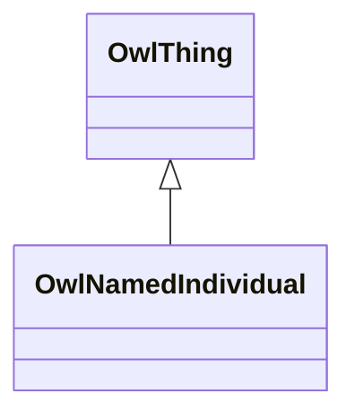

# Class: NamedIndividual (owl_NamedIndividual)


_The class of named individuals._


This class occurs 2308 times.


URI: [owl:NamedIndividual](http://www.w3.org/2002/07/owl#NamedIndividual)





## Inheritance
* [OwlThing](../classes/OwlThing.md)
    * **OwlNamedIndividual**


## Slots

| Name | Cardinality and Range | Description | Inheritance | Occurrences |
| ---  | --- | --- | --- | --- |


## Usages

| used by | used in | type | used |
| ---  | --- | --- | --- |
| [Fio-epa-frsComplianceRecord](../classes/Fio-epa-frsComplianceRecord.md) | [fio_ofIndustry](../slots/fio_ofIndustry.md) | any_of[range] | [OwlNamedIndividual](../classes/OwlNamedIndividual.md) |
| [Fio-epa-frsComplianceRecord](../classes/Fio-epa-frsComplianceRecord.md) | [fio_epa_frs_ofPrimaryIndustry](../slots/fio_epa_frs_ofPrimaryIndustry.md) | any_of[range] | [OwlNamedIndividual](../classes/OwlNamedIndividual.md) |
| [Fio-epa-frsEPA-PFAS-Facility](../classes/Fio-epa-frsEPA-PFAS-Facility.md) | [fio_ofIndustry](../slots/fio_ofIndustry.md) | any_of[range] | [OwlNamedIndividual](../classes/OwlNamedIndividual.md) |
| [Fio-epa-frsEPA-PFAS-Facility](../classes/Fio-epa-frsEPA-PFAS-Facility.md) | [fio_ownedBy](../slots/fio_ownedBy.md) | any_of[range] | [OwlNamedIndividual](../classes/OwlNamedIndividual.md) |
| [Fio-epa-frsEnforcementActivity](../classes/Fio-epa-frsEnforcementActivity.md) | [fio_ofIndustry](../slots/fio_ofIndustry.md) | any_of[range] | [OwlNamedIndividual](../classes/OwlNamedIndividual.md) |
| [Fio-epa-frsEnforcementActivity](../classes/Fio-epa-frsEnforcementActivity.md) | [fio_epa_frs_ofPrimaryIndustry](../slots/fio_epa_frs_ofPrimaryIndustry.md) | any_of[range] | [OwlNamedIndividual](../classes/OwlNamedIndividual.md) |
| [Fio-epa-frsEnforcementTrackingRecord](../classes/Fio-epa-frsEnforcementTrackingRecord.md) | [fio_epa_frs_ofSecondaryIndustry](../slots/fio_epa_frs_ofSecondaryIndustry.md) | any_of[range] | [OwlNamedIndividual](../classes/OwlNamedIndividual.md) |
| [Fio-epa-frsEnforcementTrackingRecord](../classes/Fio-epa-frsEnforcementTrackingRecord.md) | [fio_ofIndustry](../slots/fio_ofIndustry.md) | any_of[range] | [OwlNamedIndividual](../classes/OwlNamedIndividual.md) |
| [Fio-epa-frsEnforcementTrackingRecord](../classes/Fio-epa-frsEnforcementTrackingRecord.md) | [fio_epa_frs_ofPrimaryIndustry](../slots/fio_epa_frs_ofPrimaryIndustry.md) | any_of[range] | [OwlNamedIndividual](../classes/OwlNamedIndividual.md) |
| [Fio-epa-frsFRS-Facility](../classes/Fio-epa-frsFRS-Facility.md) | [fio_ofIndustry](../slots/fio_ofIndustry.md) | any_of[range] | [OwlNamedIndividual](../classes/OwlNamedIndividual.md) |
| [Fio-epa-frsFRS-Facility](../classes/Fio-epa-frsFRS-Facility.md) | [fio_epa_frs_ofSecondaryIndustry](../slots/fio_epa_frs_ofSecondaryIndustry.md) | any_of[range] | [OwlNamedIndividual](../classes/OwlNamedIndividual.md) |
| [Fio-epa-frsFRS-Facility](../classes/Fio-epa-frsFRS-Facility.md) | [fio_epa_frs_ofPrimaryIndustry](../slots/fio_epa_frs_ofPrimaryIndustry.md) | any_of[range] | [OwlNamedIndividual](../classes/OwlNamedIndividual.md) |
| [Fio-epa-frsFRS-Facility](../classes/Fio-epa-frsFRS-Facility.md) | [fio_ownedBy](../slots/fio_ownedBy.md) | any_of[range] | [OwlNamedIndividual](../classes/OwlNamedIndividual.md) |
| [Fio-epa-frsPermitRecord](../classes/Fio-epa-frsPermitRecord.md) | [fio_epa_frs_ofSecondaryIndustry](../slots/fio_epa_frs_ofSecondaryIndustry.md) | any_of[range] | [OwlNamedIndividual](../classes/OwlNamedIndividual.md) |
| [Fio-epa-frsPermitRecord](../classes/Fio-epa-frsPermitRecord.md) | [fio_ofIndustry](../slots/fio_ofIndustry.md) | any_of[range] | [OwlNamedIndividual](../classes/OwlNamedIndividual.md) |
| [Fio-epa-frsPermitRecord](../classes/Fio-epa-frsPermitRecord.md) | [fio_epa_frs_ofPrimaryIndustry](../slots/fio_epa_frs_ofPrimaryIndustry.md) | any_of[range] | [OwlNamedIndividual](../classes/OwlNamedIndividual.md) |
| [Fio-epa-frsRecord](../classes/Fio-epa-frsRecord.md) | [fio_ofIndustry](../slots/fio_ofIndustry.md) | any_of[range] | [OwlNamedIndividual](../classes/OwlNamedIndividual.md) |
| [Fio-epa-frsRecord](../classes/Fio-epa-frsRecord.md) | [fio_epa_frs_ofPrimaryIndustry](../slots/fio_epa_frs_ofPrimaryIndustry.md) | any_of[range] | [OwlNamedIndividual](../classes/OwlNamedIndividual.md) |
| [Fio-epa-frsRegistrationRecord](../classes/Fio-epa-frsRegistrationRecord.md) | [fio_epa_frs_ofSecondaryIndustry](../slots/fio_epa_frs_ofSecondaryIndustry.md) | any_of[range] | [OwlNamedIndividual](../classes/OwlNamedIndividual.md) |
| [Fio-epa-frsRegistrationRecord](../classes/Fio-epa-frsRegistrationRecord.md) | [fio_ofIndustry](../slots/fio_ofIndustry.md) | any_of[range] | [OwlNamedIndividual](../classes/OwlNamedIndividual.md) |
| [Fio-epa-frsRegistrationRecord](../classes/Fio-epa-frsRegistrationRecord.md) | [fio_epa_frs_ofPrimaryIndustry](../slots/fio_epa_frs_ofPrimaryIndustry.md) | any_of[range] | [OwlNamedIndividual](../classes/OwlNamedIndividual.md) |
| [Fio-epa-frsReportingRecord](../classes/Fio-epa-frsReportingRecord.md) | [fio_epa_frs_ofSecondaryIndustry](../slots/fio_epa_frs_ofSecondaryIndustry.md) | any_of[range] | [OwlNamedIndividual](../classes/OwlNamedIndividual.md) |
| [Fio-epa-frsReportingRecord](../classes/Fio-epa-frsReportingRecord.md) | [fio_ofIndustry](../slots/fio_ofIndustry.md) | any_of[range] | [OwlNamedIndividual](../classes/OwlNamedIndividual.md) |
| [Fio-epa-frsReportingRecord](../classes/Fio-epa-frsReportingRecord.md) | [fio_epa_frs_ofPrimaryIndustry](../slots/fio_epa_frs_ofPrimaryIndustry.md) | any_of[range] | [OwlNamedIndividual](../classes/OwlNamedIndividual.md) |
| [Fio-epa-frsStateTrackingRecord](../classes/Fio-epa-frsStateTrackingRecord.md) | [fio_epa_frs_ofSecondaryIndustry](../slots/fio_epa_frs_ofSecondaryIndustry.md) | any_of[range] | [OwlNamedIndividual](../classes/OwlNamedIndividual.md) |
| [Fio-epa-frsStateTrackingRecord](../classes/Fio-epa-frsStateTrackingRecord.md) | [fio_ofIndustry](../slots/fio_ofIndustry.md) | any_of[range] | [OwlNamedIndividual](../classes/OwlNamedIndividual.md) |
| [Fio-epa-frsStateTrackingRecord](../classes/Fio-epa-frsStateTrackingRecord.md) | [fio_epa_frs_ofPrimaryIndustry](../slots/fio_epa_frs_ofPrimaryIndustry.md) | any_of[range] | [OwlNamedIndividual](../classes/OwlNamedIndividual.md) |
| [Fio-epa-frsSupplementalRecord](../classes/Fio-epa-frsSupplementalRecord.md) | [fio_epa_frs_ofSecondaryIndustry](../slots/fio_epa_frs_ofSecondaryIndustry.md) | any_of[range] | [OwlNamedIndividual](../classes/OwlNamedIndividual.md) |
| [Fio-epa-frsSupplementalRecord](../classes/Fio-epa-frsSupplementalRecord.md) | [fio_ofIndustry](../slots/fio_ofIndustry.md) | any_of[range] | [OwlNamedIndividual](../classes/OwlNamedIndividual.md) |
| [Fio-epa-frsSupplementalRecord](../classes/Fio-epa-frsSupplementalRecord.md) | [fio_epa_frs_ofPrimaryIndustry](../slots/fio_epa_frs_ofPrimaryIndustry.md) | any_of[range] | [OwlNamedIndividual](../classes/OwlNamedIndividual.md) |
| [NaicsNAICS-IndustryCode](../classes/NaicsNAICS-IndustryCode.md) | [fio_subcodeOf](../slots/fio_subcodeOf.md) | any_of[range] | [OwlNamedIndividual](../classes/OwlNamedIndividual.md) |
| [NaicsNAICS-IndustryGroup](../classes/NaicsNAICS-IndustryGroup.md) | [fio_subcodeOf](../slots/fio_subcodeOf.md) | any_of[range] | [OwlNamedIndividual](../classes/OwlNamedIndividual.md) |
| [NaicsNAICS-IndustrySubsector](../classes/NaicsNAICS-IndustrySubsector.md) | [fio_subcodeOf](../slots/fio_subcodeOf.md) | any_of[range] | [OwlNamedIndividual](../classes/OwlNamedIndividual.md) |


## LinkML Source

<!-- TODO: investigate https://stackoverflow.com/questions/37606292/how-to-create-tabbed-code-blocks-in-mkdocs-or-sphinx -->

### Direct

<details>

```yaml
name: owl_NamedIndividual
description: The class of named individuals.
title: NamedIndividual
from_schema: okns:owl-rdf-rdfs
source: http://www.w3.org/2002/07/owl#
is_a: owl_Thing
class_uri: owl:NamedIndividual

```
</details>

### Induced

<details>

```yaml
name: owl_NamedIndividual
description: The class of named individuals.
title: NamedIndividual
from_schema: okns:owl-rdf-rdfs
source: http://www.w3.org/2002/07/owl#
is_a: owl_Thing
class_uri: owl:NamedIndividual

```
</details>