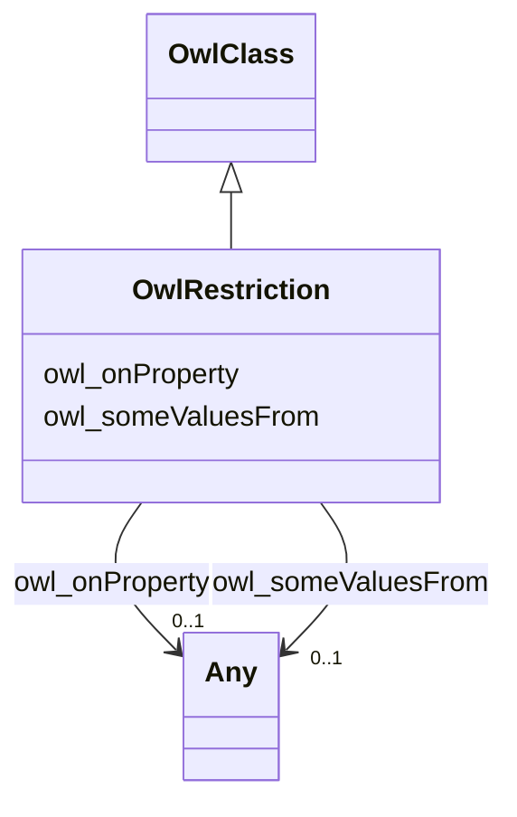

# Class: No class (type) name specified (owl_Restriction)


_No class (type) description specified_


This class occurs 1 times.


URI: [owl:Restriction](http://www.w3.org/2002/07/owl#Restriction)





## Inheritance
* [RdfsClass](../classes/RdfsClass.md)
    * [OwlClass](../classes/OwlClass.md)
        * **OwlRestriction**


## Slots

| Name | Cardinality and Range | Description | Inheritance | Occurrences |
| ---  | --- | --- | --- | --- |
| [owl_someValuesFrom](../slots/owl_someValuesFrom.md) | 0..1 <br/> [xsd:anyURI](http://www.w3.org/2001/XMLSchema#anyURI)&nbsp;or&nbsp;<br />[OwlClass](../classes/OwlClass.md)&nbsp;or&nbsp;<br />[RdfsClass](../classes/RdfsClass.md) | No slot (predicate) description specified <br/>  | direct | 2 |
| [owl_onProperty](../slots/owl_onProperty.md) | 0..1 <br/> [OwlObjectProperty](../classes/OwlObjectProperty.md)&nbsp;or&nbsp;<br />[xsd:anyURI](http://www.w3.org/2001/XMLSchema#anyURI)&nbsp;or&nbsp;<br />[RdfProperty](../classes/RdfProperty.md) | No slot (predicate) description specified <br/>  | direct | 2 |


## LinkML Source

<!-- TODO: investigate https://stackoverflow.com/questions/37606292/how-to-create-tabbed-code-blocks-in-mkdocs-or-sphinx -->

### Direct

<details>

```yaml
name: owl_Restriction
conforms_to: No schema conformance document specified
annotations:
  count:
    tag: count
    value: 1
description: No class (type) description specified
title: No class (type) name specified
from_schema: fio-kg
rank: 1000
is_a: owl_Class
slots:
- owl_someValuesFrom
- owl_onProperty
slot_usage:
  owl_onProperty:
    name: owl_onProperty
    annotations:
      owl_ObjectProperty:
        tag: owl_ObjectProperty
        value: 1
      rdf_Property:
        tag: rdf_Property
        value: 1
  owl_someValuesFrom:
    name: owl_someValuesFrom
    annotations:
      owl_Class:
        tag: owl_Class
        value: 1
      rdfs_Class:
        tag: rdfs_Class
        value: 1
class_uri: owl:Restriction

```
</details>

### Induced

<details>

```yaml
name: owl_Restriction
conforms_to: No schema conformance document specified
annotations:
  count:
    tag: count
    value: 1
description: No class (type) description specified
title: No class (type) name specified
from_schema: fio-kg
rank: 1000
is_a: owl_Class
slot_usage:
  owl_onProperty:
    name: owl_onProperty
    annotations:
      owl_ObjectProperty:
        tag: owl_ObjectProperty
        value: 1
      rdf_Property:
        tag: rdf_Property
        value: 1
  owl_someValuesFrom:
    name: owl_someValuesFrom
    annotations:
      owl_Class:
        tag: owl_Class
        value: 1
      rdfs_Class:
        tag: rdfs_Class
        value: 1
attributes:
  owl_someValuesFrom:
    name: owl_someValuesFrom
    annotations:
      owl_Class:
        tag: owl_Class
        value: 1
      rdfs_Class:
        tag: rdfs_Class
        value: 1
    description: No slot (predicate) description specified
    title: No slot (predicate) name specified
    examples:
    - object:
        example_object: fio:Industry
        example_object_type: rdfs_Class
        example_predicate: owl:someValuesFrom
        example_subject: _:b0
        example_subject_type: owl_Restriction
    - object:
        example_object: fio:Industry
        example_object_type: owl_Class
        example_predicate: owl:someValuesFrom
        example_subject: _:b0
        example_subject_type: owl_Restriction
    from_schema: fio-kg
    rank: 1000
    domain: owl_someValuesFrom
    slot_uri: owl:someValuesFrom
    alias: owl_someValuesFrom
    owner: owl_Restriction
    domain_of:
    - owl_Restriction
    range: Any
    any_of:
    - range: uri
    - range: owl_Class
    - range: rdfs_Class
  owl_onProperty:
    name: owl_onProperty
    annotations:
      owl_ObjectProperty:
        tag: owl_ObjectProperty
        value: 1
      rdf_Property:
        tag: rdf_Property
        value: 1
    description: No slot (predicate) description specified
    title: No slot (predicate) name specified
    examples:
    - object:
        example_object: fio:ofIndustry
        example_object_type: owl_ObjectProperty
        example_predicate: owl:onProperty
        example_subject: _:b0
        example_subject_type: owl_Restriction
    - object:
        example_object: fio:ofIndustry
        example_object_type: rdf_Property
        example_predicate: owl:onProperty
        example_subject: _:b0
        example_subject_type: owl_Restriction
    from_schema: fio-kg
    rank: 1000
    domain: owl_onProperty
    slot_uri: owl:onProperty
    alias: owl_onProperty
    owner: owl_Restriction
    domain_of:
    - owl_Restriction
    range: Any
    any_of:
    - range: owl_ObjectProperty
    - range: uri
    - range: rdf_Property
class_uri: owl:Restriction

```
</details>