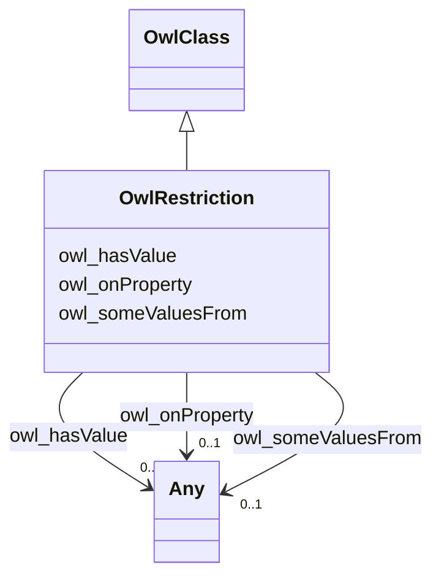

# Class: No class (entity type) name specified (owl_Restriction)


_No class (type) description specified_


This class occurs 16 times.


URI: [owl:Restriction](http://www.w3.org/2002/07/owl#Restriction)





## Inheritance
* [RdfsClass](../classes/RdfsClass.md)
    * [OwlClass](../classes/OwlClass.md)
        * **OwlRestriction**


## Slots

| Name | Cardinality and Range | Description | Inheritance | Occurrences |
| ---  | --- | --- | --- | --- |
| [owl_onProperty](../slots/owl_onProperty.md) | 0..1 <br/> [OwlObjectProperty](../classes/OwlObjectProperty.md)&nbsp;or&nbsp;<br />[RdfProperty](../classes/RdfProperty.md)&nbsp;or&nbsp;<br />[OwlThing](../classes/OwlThing.md) | No slot (predicate) description specified <br/>  | direct | 42 |
| [owl_someValuesFrom](../slots/owl_someValuesFrom.md) | 0..1 <br/> [OwlThing](../classes/OwlThing.md)&nbsp;or&nbsp;<br />[xsd:anyURI](http://www.w3.org/2001/XMLSchema#anyURI)&nbsp;or&nbsp;<br />[OwlClass](../classes/OwlClass.md)&nbsp;or&nbsp;<br />[RdfsClass](../classes/RdfsClass.md) | No slot (predicate) description specified <br/>  | direct | 40 |
| [owl_hasValue](../slots/owl_hasValue.md) | 0..1 <br/> [HttpW3id.orgFioV1Epa-frs#FacilitySiteIdentification](../classes/HttpW3id.orgFioV1Epa-frs#FacilitySiteIdentification.md)&nbsp;or&nbsp;<br />[HttpW3id.orgFioV1Epa-frs#EnvironmentalInterestByProgram](../classes/HttpW3id.orgFioV1Epa-frs#EnvironmentalInterestByProgram.md)&nbsp;or&nbsp;<br />[HttpW3id.orgFioV1Epa-frs#EnvironmentalInterestType](../classes/HttpW3id.orgFioV1Epa-frs#EnvironmentalInterestType.md)&nbsp;or&nbsp;<br />[OwlThing](../classes/OwlThing.md) | No slot (predicate) description specified <br/>  | direct | 8 |


## LinkML Source

<!-- TODO: investigate https://stackoverflow.com/questions/37606292/how-to-create-tabbed-code-blocks-in-mkdocs-or-sphinx -->

### Direct

<details>

```yaml
name: owl_Restriction
conforms_to: No schema conformance document specified
annotations:
  count:
    tag: count
    value: 16
description: No class (type) description specified
title: No class (entity type) name specified
from_schema: fio-kg
rank: 1000
is_a: owl_Class
slots:
- owl_onProperty
- owl_someValuesFrom
- owl_hasValue
slot_usage:
  owl_hasValue:
    name: owl_hasValue
    annotations:
      http___w3id.org_fio_v1_epa-frs#EnvironmentalInterestByProgram:
        tag: http___w3id.org_fio_v1_epa-frs#EnvironmentalInterestByProgram
        value: 2
      http___w3id.org_fio_v1_epa-frs#EnvironmentalInterestType:
        tag: http___w3id.org_fio_v1_epa-frs#EnvironmentalInterestType
        value: 2
      http___w3id.org_fio_v1_epa-frs#FacilitySiteIdentification:
        tag: http___w3id.org_fio_v1_epa-frs#FacilitySiteIdentification
        value: 2
      owl_Thing:
        tag: owl_Thing
        value: 2
  owl_onProperty:
    name: owl_onProperty
    annotations:
      owl_ObjectProperty:
        tag: owl_ObjectProperty
        value: 10
      owl_Thing:
        tag: owl_Thing
        value: 16
      rdf_Property:
        tag: rdf_Property
        value: 16
  owl_someValuesFrom:
    name: owl_someValuesFrom
    annotations:
      owl_Class:
        tag: owl_Class
        value: 13
      owl_Thing:
        tag: owl_Thing
        value: 13
      rdfs_Class:
        tag: rdfs_Class
        value: 13
      uri:
        tag: uri
        value: 1
class_uri: owl:Restriction

```
</details>

### Induced

<details>

```yaml
name: owl_Restriction
conforms_to: No schema conformance document specified
annotations:
  count:
    tag: count
    value: 16
description: No class (type) description specified
title: No class (entity type) name specified
from_schema: fio-kg
rank: 1000
is_a: owl_Class
slot_usage:
  owl_hasValue:
    name: owl_hasValue
    annotations:
      http___w3id.org_fio_v1_epa-frs#EnvironmentalInterestByProgram:
        tag: http___w3id.org_fio_v1_epa-frs#EnvironmentalInterestByProgram
        value: 2
      http___w3id.org_fio_v1_epa-frs#EnvironmentalInterestType:
        tag: http___w3id.org_fio_v1_epa-frs#EnvironmentalInterestType
        value: 2
      http___w3id.org_fio_v1_epa-frs#FacilitySiteIdentification:
        tag: http___w3id.org_fio_v1_epa-frs#FacilitySiteIdentification
        value: 2
      owl_Thing:
        tag: owl_Thing
        value: 2
  owl_onProperty:
    name: owl_onProperty
    annotations:
      owl_ObjectProperty:
        tag: owl_ObjectProperty
        value: 10
      owl_Thing:
        tag: owl_Thing
        value: 16
      rdf_Property:
        tag: rdf_Property
        value: 16
  owl_someValuesFrom:
    name: owl_someValuesFrom
    annotations:
      owl_Class:
        tag: owl_Class
        value: 13
      owl_Thing:
        tag: owl_Thing
        value: 13
      rdfs_Class:
        tag: rdfs_Class
        value: 13
      uri:
        tag: uri
        value: 1
attributes:
  owl_onProperty:
    name: owl_onProperty
    annotations:
      owl_ObjectProperty:
        tag: owl_ObjectProperty
        value: 10
      owl_Thing:
        tag: owl_Thing
        value: 16
      rdf_Property:
        tag: rdf_Property
        value: 16
    description: No slot (predicate) description specified
    title: No slot (predicate) name specified
    examples:
    - object:
        example_object: http://w3id.org/fio/v1/epa-frs#fromSystem
        example_object_type: rdf_Property
        example_predicate: owl:onProperty
        example_subject: _:B010019df0d645bc4b640e83c5a648a6d
        example_subject_type: owl_Restriction
    - object:
        example_object: http://w3id.org/fio/v1/epa-frs#fromSystem
        example_object_type: owl_Thing
        example_predicate: owl:onProperty
        example_subject: _:B010019df0d645bc4b640e83c5a648a6d
        example_subject_type: owl_Restriction
    - object:
        example_object: http://w3id.org/fio/v1/epa-frs#ofInterestType
        example_object_type: owl_ObjectProperty
        example_predicate: owl:onProperty
        example_subject: _:B2eae44cdbebb2dc00571e0a34d8dba01
        example_subject_type: owl_Restriction
    from_schema: fio-kg
    rank: 1000
    slot_uri: owl:onProperty
    alias: owl_onProperty
    owner: owl_Restriction
    domain_of:
    - owl_Restriction
    union_of:
    - '{''domain'': ''owl_Restriction''}'
    - '{''domain'': ''owl_Class''}'
    - '{''domain'': ''rdfs_Class''}'
    range: Any
    any_of:
    - range: owl_ObjectProperty
    - range: rdf_Property
    - range: owl_Thing
  owl_someValuesFrom:
    name: owl_someValuesFrom
    annotations:
      owl_Class:
        tag: owl_Class
        value: 13
      owl_Thing:
        tag: owl_Thing
        value: 13
      rdfs_Class:
        tag: rdfs_Class
        value: 13
      uri:
        tag: uri
        value: 1
    description: No slot (predicate) description specified
    title: No slot (predicate) name specified
    examples:
    - object:
        example_object: http://w3id.org/fio/v1/epa-frs#ReportingSystem
        example_object_type: owl_Thing
        example_predicate: owl:someValuesFrom
        example_subject: _:B010019df0d645bc4b640e83c5a648a6d
        example_subject_type: owl_Restriction
    - object:
        example_object: http://w3id.org/fio/v1/epa-frs#ReportingSystem
        example_object_type: owl_Class
        example_predicate: owl:someValuesFrom
        example_subject: _:B010019df0d645bc4b640e83c5a648a6d
        example_subject_type: owl_Restriction
    - object:
        example_object: http://w3id.org/fio/v1/epa-frs#ReportingSystem
        example_object_type: rdfs_Class
        example_predicate: owl:someValuesFrom
        example_subject: _:B010019df0d645bc4b640e83c5a648a6d
        example_subject_type: owl_Restriction
    - object:
        example_object: _:B1b00703a3b4a6351310cd78550f4f30c
        example_object_type: uri
        example_predicate: owl:someValuesFrom
        example_subject: _:Bcea60150512b327394ca7037688906b9
        example_subject_type: owl_Restriction
    from_schema: fio-kg
    rank: 1000
    slot_uri: owl:someValuesFrom
    alias: owl_someValuesFrom
    owner: owl_Restriction
    domain_of:
    - owl_Restriction
    union_of:
    - '{''domain'': ''owl_Restriction''}'
    - '{''domain'': ''owl_Class''}'
    - '{''domain'': ''rdfs_Class''}'
    range: Any
    any_of:
    - range: owl_Thing
    - range: uri
    - range: owl_Class
    - range: rdfs_Class
  owl_hasValue:
    name: owl_hasValue
    annotations:
      http___w3id.org_fio_v1_epa-frs#EnvironmentalInterestByProgram:
        tag: http___w3id.org_fio_v1_epa-frs#EnvironmentalInterestByProgram
        value: 2
      http___w3id.org_fio_v1_epa-frs#EnvironmentalInterestType:
        tag: http___w3id.org_fio_v1_epa-frs#EnvironmentalInterestType
        value: 2
      http___w3id.org_fio_v1_epa-frs#FacilitySiteIdentification:
        tag: http___w3id.org_fio_v1_epa-frs#FacilitySiteIdentification
        value: 2
      owl_Thing:
        tag: owl_Thing
        value: 2
    description: No slot (predicate) description specified
    title: No slot (predicate) name specified
    examples:
    - object:
        example_object: http://w3id.org/fio/v1/epa-frs-data#d.EnvironmentalInterestType.Tribalmaster
        example_object_type: http___w3id.org_fio_v1_epa-frs#FacilitySiteIdentification
        example_predicate: owl:hasValue
        example_subject: _:B2eae44cdbebb2dc00571e0a34d8dba01
        example_subject_type: owl_Restriction
    - object:
        example_object: http://w3id.org/fio/v1/epa-frs-data#d.EnvironmentalInterestType.Tribalmaster
        example_object_type: http___w3id.org_fio_v1_epa-frs#EnvironmentalInterestByProgram
        example_predicate: owl:hasValue
        example_subject: _:B2eae44cdbebb2dc00571e0a34d8dba01
        example_subject_type: owl_Restriction
    - object:
        example_object: http://w3id.org/fio/v1/epa-frs-data#d.EnvironmentalInterestType.Tribalmaster
        example_object_type: http___w3id.org_fio_v1_epa-frs#EnvironmentalInterestType
        example_predicate: owl:hasValue
        example_subject: _:B2eae44cdbebb2dc00571e0a34d8dba01
        example_subject_type: owl_Restriction
    - object:
        example_object: http://w3id.org/fio/v1/epa-frs-data#d.EnvironmentalInterestType.Tribalmaster
        example_object_type: owl_Thing
        example_predicate: owl:hasValue
        example_subject: _:B2eae44cdbebb2dc00571e0a34d8dba01
        example_subject_type: owl_Restriction
    from_schema: fio-kg
    rank: 1000
    slot_uri: owl:hasValue
    alias: owl_hasValue
    owner: owl_Restriction
    domain_of:
    - owl_Restriction
    union_of:
    - '{''domain'': ''owl_Restriction''}'
    - '{''domain'': ''owl_Class''}'
    - '{''domain'': ''rdfs_Class''}'
    range: Any
    any_of:
    - range: http___w3id.org_fio_v1_epa-frs#FacilitySiteIdentification
    - range: http___w3id.org_fio_v1_epa-frs#EnvironmentalInterestByProgram
    - range: http___w3id.org_fio_v1_epa-frs#EnvironmentalInterestType
    - range: owl_Thing
class_uri: owl:Restriction

```
</details>