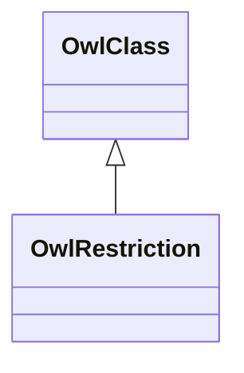

# Class: Restriction (owl_Restriction)


_The class of property restrictions._


This class occurs 32 times.


URI: [owl:Restriction](http://www.w3.org/2002/07/owl#Restriction)





## Inheritance
* [RdfsResource](../classes/RdfsResource.md)
    * [RdfsClass](../classes/RdfsClass.md)
        * [OwlClass](../classes/OwlClass.md)
            * **OwlRestriction**


## Slots

| Name | Cardinality and Range | Description | Inheritance | Occurrences |
| ---  | --- | --- | --- | --- |


## LinkML Source

<!-- TODO: investigate https://stackoverflow.com/questions/37606292/how-to-create-tabbed-code-blocks-in-mkdocs-or-sphinx -->

### Direct

<details>

```yaml
name: owl_Restriction
description: The class of property restrictions.
title: Restriction
from_schema: okns:owl-rdf-rdfs
source: http://www.w3.org/2002/07/owl#
is_a: owl_Class
class_uri: owl:Restriction

```
</details>

### Induced

<details>

```yaml
name: owl_Restriction
description: The class of property restrictions.
title: Restriction
from_schema: okns:owl-rdf-rdfs
source: http://www.w3.org/2002/07/owl#
is_a: owl_Class
class_uri: owl:Restriction

```
</details>