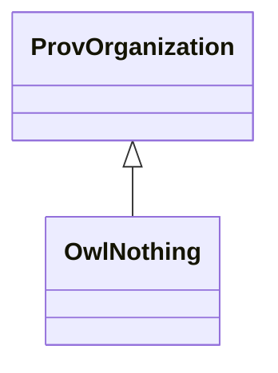

# Class: No class (entity type) name specified -- this class is noted as a superclass of another class in this graph but has not itself been defined. (prov_Organization)


_No class (type) description specified_


URI: [prov:Organization](http://www.w3.org/ns/prov#Organization)





## Inheritance
* **ProvOrganization**
    * [OwlNothing](../classes/OwlNothing.md)


## Slots

| Name | Cardinality and Range | Description | Inheritance | Occurrences |
| ---  | --- | --- | --- | --- |


## LinkML Source

<!-- TODO: investigate https://stackoverflow.com/questions/37606292/how-to-create-tabbed-code-blocks-in-mkdocs-or-sphinx -->

### Direct

<details>

```yaml
name: prov_Organization
conforms_to: No schema conformance document specified
description: No class (type) description specified
title: No class (entity type) name specified -- this class is noted as a superclass
  of another class in this graph but has not itself been defined.
from_schema: fio-kg
rank: 1000
class_uri: prov:Organization

```
</details>

### Induced

<details>

```yaml
name: prov_Organization
conforms_to: No schema conformance document specified
description: No class (type) description specified
title: No class (entity type) name specified -- this class is noted as a superclass
  of another class in this graph but has not itself been defined.
from_schema: fio-kg
rank: 1000
class_uri: prov:Organization

```
</details>