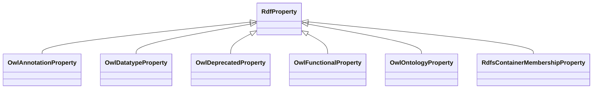

# Class: No class (type) name specified (rdf_Property)


_No class (type) description specified_


This class occurs 0 times.


URI: [rdf:Property](http://www.w3.org/1999/02/22-rdf-syntax-ns#Property)





## Inheritance
* **RdfProperty**
    * [OwlAnnotationProperty](../classes/OwlAnnotationProperty.md)
    * [OwlDatatypeProperty](../classes/OwlDatatypeProperty.md)
    * [OwlDeprecatedProperty](../classes/OwlDeprecatedProperty.md)
    * [OwlFunctionalProperty](../classes/OwlFunctionalProperty.md)
    * [OwlOntologyProperty](../classes/OwlOntologyProperty.md)
    * [RdfsContainerMembershipProperty](../classes/RdfsContainerMembershipProperty.md)


## Slots

| Name | Cardinality and Range | Description | Inheritance | Occurrences |
| ---  | --- | --- | --- | --- |


## Usages

| used by | used in | type | used |
| ---  | --- | --- | --- |
| [OwlRestriction](../classes/OwlRestriction.md) | [owl_onProperty](../slots/owl_onProperty.md) | any_of[range] | [RdfProperty](../classes/RdfProperty.md) |


## LinkML Source

<!-- TODO: investigate https://stackoverflow.com/questions/37606292/how-to-create-tabbed-code-blocks-in-mkdocs-or-sphinx -->

### Direct

<details>

```yaml
name: rdf_Property
conforms_to: No schema conformance document specified
annotations:
  count:
    tag: count
    value: 0
description: No class (type) description specified
title: No class (type) name specified
from_schema: fio-kg
rank: 1000
class_uri: rdf:Property

```
</details>

### Induced

<details>

```yaml
name: rdf_Property
conforms_to: No schema conformance document specified
annotations:
  count:
    tag: count
    value: 0
description: No class (type) description specified
title: No class (type) name specified
from_schema: fio-kg
rank: 1000
class_uri: rdf:Property

```
</details>