# Class: No class (entity type) name specified -- this class is noted as a superclass of another class in this graph but has not itself been defined. (rdfs_Literal)


_No class (type) description specified_


URI: [rdfs:Literal](http://www.w3.org/2000/01/rdf-schema#Literal)

```mermaid
 classDiagram
    class RdfsLiteral
    click RdfsLiteral href "../RdfsLiteral"
      RdfsLiteral <|-- OwlRational
        click OwlRational href "../OwlRational"
      RdfsLiteral <|-- OwlReal
        click OwlReal href "../OwlReal"
      RdfsLiteral <|-- RdfPlainLiteral
        click RdfPlainLiteral href "../RdfPlainLiteral"
      RdfsLiteral <|-- RdfXMLLiteral
        click RdfXMLLiteral href "../RdfXMLLiteral"
      RdfsLiteral <|-- XsdNCName
        click XsdNCName href "../XsdNCName"
      RdfsLiteral <|-- XsdNMTOKEN
        click XsdNMTOKEN href "../XsdNMTOKEN"
      RdfsLiteral <|-- XsdName
        click XsdName href "../XsdName"
      RdfsLiteral <|-- XsdAnyURI
        click XsdAnyURI href "../XsdAnyURI"
      RdfsLiteral <|-- XsdBase64Binary
        click XsdBase64Binary href "../XsdBase64Binary"
      RdfsLiteral <|-- XsdBoolean
        click XsdBoolean href "../XsdBoolean"
      RdfsLiteral <|-- XsdByte
        click XsdByte href "../XsdByte"
      RdfsLiteral <|-- XsdDateTime
        click XsdDateTime href "../XsdDateTime"
      RdfsLiteral <|-- XsdDateTimeStamp
        click XsdDateTimeStamp href "../XsdDateTimeStamp"
      RdfsLiteral <|-- XsdDecimal
        click XsdDecimal href "../XsdDecimal"
      RdfsLiteral <|-- XsdDouble
        click XsdDouble href "../XsdDouble"
      RdfsLiteral <|-- XsdFloat
        click XsdFloat href "../XsdFloat"
      RdfsLiteral <|-- XsdHexBinary
        click XsdHexBinary href "../XsdHexBinary"
      RdfsLiteral <|-- XsdInt
        click XsdInt href "../XsdInt"
      RdfsLiteral <|-- XsdInteger
        click XsdInteger href "../XsdInteger"
      RdfsLiteral <|-- XsdLanguage
        click XsdLanguage href "../XsdLanguage"
      RdfsLiteral <|-- XsdLong
        click XsdLong href "../XsdLong"
      RdfsLiteral <|-- XsdNegativeInteger
        click XsdNegativeInteger href "../XsdNegativeInteger"
      RdfsLiteral <|-- XsdNonNegativeInteger
        click XsdNonNegativeInteger href "../XsdNonNegativeInteger"
      RdfsLiteral <|-- XsdNonPositiveInteger
        click XsdNonPositiveInteger href "../XsdNonPositiveInteger"
      RdfsLiteral <|-- XsdNormalizedString
        click XsdNormalizedString href "../XsdNormalizedString"
      RdfsLiteral <|-- XsdPositiveInteger
        click XsdPositiveInteger href "../XsdPositiveInteger"
      RdfsLiteral <|-- XsdShort
        click XsdShort href "../XsdShort"
      RdfsLiteral <|-- XsdString
        click XsdString href "../XsdString"
      RdfsLiteral <|-- XsdToken
        click XsdToken href "../XsdToken"
      RdfsLiteral <|-- XsdUnsignedByte
        click XsdUnsignedByte href "../XsdUnsignedByte"
      RdfsLiteral <|-- XsdUnsignedInt
        click XsdUnsignedInt href "../XsdUnsignedInt"
      RdfsLiteral <|-- XsdUnsignedLong
        click XsdUnsignedLong href "../XsdUnsignedLong"
      RdfsLiteral <|-- XsdUnsignedShort
        click XsdUnsignedShort href "../XsdUnsignedShort"
      
      
```





## Inheritance
* **RdfsLiteral**
    * [OwlRational](../classes/OwlRational.md)
    * [OwlReal](../classes/OwlReal.md)
    * [RdfPlainLiteral](../classes/RdfPlainLiteral.md)
    * [RdfXMLLiteral](../classes/RdfXMLLiteral.md)
    * [XsdNCName](../classes/XsdNCName.md)
    * [XsdNMTOKEN](../classes/XsdNMTOKEN.md)
    * [XsdName](../classes/XsdName.md)
    * [XsdAnyURI](../classes/XsdAnyURI.md)
    * [XsdBase64Binary](../classes/XsdBase64Binary.md)
    * [XsdBoolean](../classes/XsdBoolean.md)
    * [XsdByte](../classes/XsdByte.md)
    * [XsdDateTime](../classes/XsdDateTime.md)
    * [XsdDateTimeStamp](../classes/XsdDateTimeStamp.md)
    * [XsdDecimal](../classes/XsdDecimal.md)
    * [XsdDouble](../classes/XsdDouble.md)
    * [XsdFloat](../classes/XsdFloat.md)
    * [XsdHexBinary](../classes/XsdHexBinary.md)
    * [XsdInt](../classes/XsdInt.md)
    * [XsdInteger](../classes/XsdInteger.md)
    * [XsdLanguage](../classes/XsdLanguage.md)
    * [XsdLong](../classes/XsdLong.md)
    * [XsdNegativeInteger](../classes/XsdNegativeInteger.md)
    * [XsdNonNegativeInteger](../classes/XsdNonNegativeInteger.md)
    * [XsdNonPositiveInteger](../classes/XsdNonPositiveInteger.md)
    * [XsdNormalizedString](../classes/XsdNormalizedString.md)
    * [XsdPositiveInteger](../classes/XsdPositiveInteger.md)
    * [XsdShort](../classes/XsdShort.md)
    * [XsdString](../classes/XsdString.md)
    * [XsdToken](../classes/XsdToken.md)
    * [XsdUnsignedByte](../classes/XsdUnsignedByte.md)
    * [XsdUnsignedInt](../classes/XsdUnsignedInt.md)
    * [XsdUnsignedLong](../classes/XsdUnsignedLong.md)
    * [XsdUnsignedShort](../classes/XsdUnsignedShort.md)


## Slots

| Name | Cardinality and Range | Description | Inheritance | Occurrences |
| ---  | --- | --- | --- | --- |


## Usages

| used by | used in | type | used |
| ---  | --- | --- | --- |
| [OwlNamedIndividual](../classes/OwlNamedIndividual.md) | [dct_identifier](../slots/dct_identifier.md) | any_of[range] | [RdfsLiteral](../classes/RdfsLiteral.md) |
| [OwlNamedIndividual](../classes/OwlNamedIndividual.md) | [rdfs_label](../slots/rdfs_label.md) | any_of[range] | [RdfsLiteral](../classes/RdfsLiteral.md) |
| [OwlNamedIndividual](../classes/OwlNamedIndividual.md) | [dct_modified](../slots/dct_modified.md) | any_of[range] | [RdfsLiteral](../classes/RdfsLiteral.md) |
| [OwlNamedIndividual](../classes/OwlNamedIndividual.md) | [dct_alternative](../slots/dct_alternative.md) | any_of[range] | [RdfsLiteral](../classes/RdfsLiteral.md) |
| [OwlNamedIndividual](../classes/OwlNamedIndividual.md) | [http___w3id.org_fio_v1_epa_frs#hasFRSId](../slots/http___w3id.org_fio_v1_epa_frs#hasFRSId.md) | any_of[range] | [RdfsLiteral](../classes/RdfsLiteral.md) |
| [OwlNamedIndividual](../classes/OwlNamedIndividual.md) | [dct_created](../slots/dct_created.md) | any_of[range] | [RdfsLiteral](../classes/RdfsLiteral.md) |
| [OwlThing](../classes/OwlThing.md) | [dct_modified](../slots/dct_modified.md) | any_of[range] | [RdfsLiteral](../classes/RdfsLiteral.md) |
| [OwlThing](../classes/OwlThing.md) | [dct_identifier](../slots/dct_identifier.md) | any_of[range] | [RdfsLiteral](../classes/RdfsLiteral.md) |
| [OwlThing](../classes/OwlThing.md) | [dct_alternative](../slots/dct_alternative.md) | any_of[range] | [RdfsLiteral](../classes/RdfsLiteral.md) |
| [OwlThing](../classes/OwlThing.md) | [rdfs_label](../slots/rdfs_label.md) | any_of[range] | [RdfsLiteral](../classes/RdfsLiteral.md) |
| [OwlThing](../classes/OwlThing.md) | [http___w3id.org_fio_v1_epa_frs#hasFRSId](../slots/http___w3id.org_fio_v1_epa_frs#hasFRSId.md) | any_of[range] | [RdfsLiteral](../classes/RdfsLiteral.md) |
| [OwlThing](../classes/OwlThing.md) | [dct_created](../slots/dct_created.md) | any_of[range] | [RdfsLiteral](../classes/RdfsLiteral.md) |
| [B0270b679363208f9c3f4c68ea9459d44](../classes/B0270b679363208f9c3f4c68ea9459d44.md) | [rdfs_label](../slots/rdfs_label.md) | any_of[range] | [RdfsLiteral](../classes/RdfsLiteral.md) |
| [B08b3e94708f8805ddd7e9bf523dbf45e](../classes/B08b3e94708f8805ddd7e9bf523dbf45e.md) | [dct_identifier](../slots/dct_identifier.md) | any_of[range] | [RdfsLiteral](../classes/RdfsLiteral.md) |
| [B08b3e94708f8805ddd7e9bf523dbf45e](../classes/B08b3e94708f8805ddd7e9bf523dbf45e.md) | [rdfs_label](../slots/rdfs_label.md) | any_of[range] | [RdfsLiteral](../classes/RdfsLiteral.md) |
| [B08b3e94708f8805ddd7e9bf523dbf45e](../classes/B08b3e94708f8805ddd7e9bf523dbf45e.md) | [dct_modified](../slots/dct_modified.md) | any_of[range] | [RdfsLiteral](../classes/RdfsLiteral.md) |
| [B08b3e94708f8805ddd7e9bf523dbf45e](../classes/B08b3e94708f8805ddd7e9bf523dbf45e.md) | [dct_alternative](../slots/dct_alternative.md) | any_of[range] | [RdfsLiteral](../classes/RdfsLiteral.md) |
| [B08b3e94708f8805ddd7e9bf523dbf45e](../classes/B08b3e94708f8805ddd7e9bf523dbf45e.md) | [http___w3id.org_fio_v1_epa_frs#hasFRSId](../slots/http___w3id.org_fio_v1_epa_frs#hasFRSId.md) | any_of[range] | [RdfsLiteral](../classes/RdfsLiteral.md) |
| [B08b3e94708f8805ddd7e9bf523dbf45e](../classes/B08b3e94708f8805ddd7e9bf523dbf45e.md) | [dct_created](../slots/dct_created.md) | any_of[range] | [RdfsLiteral](../classes/RdfsLiteral.md) |
| [B1568a680b2c949a6bcb95f2b2d85d9d3](../classes/B1568a680b2c949a6bcb95f2b2d85d9d3.md) | [dct_identifier](../slots/dct_identifier.md) | any_of[range] | [RdfsLiteral](../classes/RdfsLiteral.md) |
| [B1568a680b2c949a6bcb95f2b2d85d9d3](../classes/B1568a680b2c949a6bcb95f2b2d85d9d3.md) | [rdfs_label](../slots/rdfs_label.md) | any_of[range] | [RdfsLiteral](../classes/RdfsLiteral.md) |
| [B1568a680b2c949a6bcb95f2b2d85d9d3](../classes/B1568a680b2c949a6bcb95f2b2d85d9d3.md) | [dct_modified](../slots/dct_modified.md) | any_of[range] | [RdfsLiteral](../classes/RdfsLiteral.md) |
| [B1568a680b2c949a6bcb95f2b2d85d9d3](../classes/B1568a680b2c949a6bcb95f2b2d85d9d3.md) | [dct_alternative](../slots/dct_alternative.md) | any_of[range] | [RdfsLiteral](../classes/RdfsLiteral.md) |
| [B1568a680b2c949a6bcb95f2b2d85d9d3](../classes/B1568a680b2c949a6bcb95f2b2d85d9d3.md) | [http___w3id.org_fio_v1_epa_frs#hasFRSId](../slots/http___w3id.org_fio_v1_epa_frs#hasFRSId.md) | any_of[range] | [RdfsLiteral](../classes/RdfsLiteral.md) |
| [B1568a680b2c949a6bcb95f2b2d85d9d3](../classes/B1568a680b2c949a6bcb95f2b2d85d9d3.md) | [dct_created](../slots/dct_created.md) | any_of[range] | [RdfsLiteral](../classes/RdfsLiteral.md) |
| [B1c3acc9c4ef48dce3e99075a96c7c557](../classes/B1c3acc9c4ef48dce3e99075a96c7c557.md) | [dct_identifier](../slots/dct_identifier.md) | any_of[range] | [RdfsLiteral](../classes/RdfsLiteral.md) |
| [B1c3acc9c4ef48dce3e99075a96c7c557](../classes/B1c3acc9c4ef48dce3e99075a96c7c557.md) | [rdfs_label](../slots/rdfs_label.md) | any_of[range] | [RdfsLiteral](../classes/RdfsLiteral.md) |
| [B1c3acc9c4ef48dce3e99075a96c7c557](../classes/B1c3acc9c4ef48dce3e99075a96c7c557.md) | [dct_modified](../slots/dct_modified.md) | any_of[range] | [RdfsLiteral](../classes/RdfsLiteral.md) |
| [B1c3acc9c4ef48dce3e99075a96c7c557](../classes/B1c3acc9c4ef48dce3e99075a96c7c557.md) | [dct_alternative](../slots/dct_alternative.md) | any_of[range] | [RdfsLiteral](../classes/RdfsLiteral.md) |
| [B1c3acc9c4ef48dce3e99075a96c7c557](../classes/B1c3acc9c4ef48dce3e99075a96c7c557.md) | [http___w3id.org_fio_v1_epa_frs#hasFRSId](../slots/http___w3id.org_fio_v1_epa_frs#hasFRSId.md) | any_of[range] | [RdfsLiteral](../classes/RdfsLiteral.md) |
| [B1c3acc9c4ef48dce3e99075a96c7c557](../classes/B1c3acc9c4ef48dce3e99075a96c7c557.md) | [dct_created](../slots/dct_created.md) | any_of[range] | [RdfsLiteral](../classes/RdfsLiteral.md) |
| [B2f5e0a6411e701c2d293e6e8665132d5](../classes/B2f5e0a6411e701c2d293e6e8665132d5.md) | [dct_identifier](../slots/dct_identifier.md) | any_of[range] | [RdfsLiteral](../classes/RdfsLiteral.md) |
| [B2f5e0a6411e701c2d293e6e8665132d5](../classes/B2f5e0a6411e701c2d293e6e8665132d5.md) | [rdfs_label](../slots/rdfs_label.md) | any_of[range] | [RdfsLiteral](../classes/RdfsLiteral.md) |
| [B2f5e0a6411e701c2d293e6e8665132d5](../classes/B2f5e0a6411e701c2d293e6e8665132d5.md) | [dct_modified](../slots/dct_modified.md) | any_of[range] | [RdfsLiteral](../classes/RdfsLiteral.md) |
| [B2f5e0a6411e701c2d293e6e8665132d5](../classes/B2f5e0a6411e701c2d293e6e8665132d5.md) | [dct_alternative](../slots/dct_alternative.md) | any_of[range] | [RdfsLiteral](../classes/RdfsLiteral.md) |
| [B2f5e0a6411e701c2d293e6e8665132d5](../classes/B2f5e0a6411e701c2d293e6e8665132d5.md) | [http___w3id.org_fio_v1_epa_frs#hasFRSId](../slots/http___w3id.org_fio_v1_epa_frs#hasFRSId.md) | any_of[range] | [RdfsLiteral](../classes/RdfsLiteral.md) |
| [B2f5e0a6411e701c2d293e6e8665132d5](../classes/B2f5e0a6411e701c2d293e6e8665132d5.md) | [dct_created](../slots/dct_created.md) | any_of[range] | [RdfsLiteral](../classes/RdfsLiteral.md) |
| [B323a99959d9aa21ec2cbc4652700b98e](../classes/B323a99959d9aa21ec2cbc4652700b98e.md) | [dct_identifier](../slots/dct_identifier.md) | any_of[range] | [RdfsLiteral](../classes/RdfsLiteral.md) |
| [B323a99959d9aa21ec2cbc4652700b98e](../classes/B323a99959d9aa21ec2cbc4652700b98e.md) | [rdfs_label](../slots/rdfs_label.md) | any_of[range] | [RdfsLiteral](../classes/RdfsLiteral.md) |
| [B323a99959d9aa21ec2cbc4652700b98e](../classes/B323a99959d9aa21ec2cbc4652700b98e.md) | [dct_modified](../slots/dct_modified.md) | any_of[range] | [RdfsLiteral](../classes/RdfsLiteral.md) |
| [B323a99959d9aa21ec2cbc4652700b98e](../classes/B323a99959d9aa21ec2cbc4652700b98e.md) | [dct_alternative](../slots/dct_alternative.md) | any_of[range] | [RdfsLiteral](../classes/RdfsLiteral.md) |
| [B323a99959d9aa21ec2cbc4652700b98e](../classes/B323a99959d9aa21ec2cbc4652700b98e.md) | [http___w3id.org_fio_v1_epa_frs#hasFRSId](../slots/http___w3id.org_fio_v1_epa_frs#hasFRSId.md) | any_of[range] | [RdfsLiteral](../classes/RdfsLiteral.md) |
| [B323a99959d9aa21ec2cbc4652700b98e](../classes/B323a99959d9aa21ec2cbc4652700b98e.md) | [dct_created](../slots/dct_created.md) | any_of[range] | [RdfsLiteral](../classes/RdfsLiteral.md) |
| [B38a1e90ecccbde897be5fbb09f517af6](../classes/B38a1e90ecccbde897be5fbb09f517af6.md) | [dct_identifier](../slots/dct_identifier.md) | any_of[range] | [RdfsLiteral](../classes/RdfsLiteral.md) |
| [B38a1e90ecccbde897be5fbb09f517af6](../classes/B38a1e90ecccbde897be5fbb09f517af6.md) | [rdfs_label](../slots/rdfs_label.md) | any_of[range] | [RdfsLiteral](../classes/RdfsLiteral.md) |
| [B38a1e90ecccbde897be5fbb09f517af6](../classes/B38a1e90ecccbde897be5fbb09f517af6.md) | [dct_modified](../slots/dct_modified.md) | any_of[range] | [RdfsLiteral](../classes/RdfsLiteral.md) |
| [B38a1e90ecccbde897be5fbb09f517af6](../classes/B38a1e90ecccbde897be5fbb09f517af6.md) | [dct_alternative](../slots/dct_alternative.md) | any_of[range] | [RdfsLiteral](../classes/RdfsLiteral.md) |
| [B38a1e90ecccbde897be5fbb09f517af6](../classes/B38a1e90ecccbde897be5fbb09f517af6.md) | [http___w3id.org_fio_v1_epa_frs#hasFRSId](../slots/http___w3id.org_fio_v1_epa_frs#hasFRSId.md) | any_of[range] | [RdfsLiteral](../classes/RdfsLiteral.md) |
| [B38a1e90ecccbde897be5fbb09f517af6](../classes/B38a1e90ecccbde897be5fbb09f517af6.md) | [dct_created](../slots/dct_created.md) | any_of[range] | [RdfsLiteral](../classes/RdfsLiteral.md) |
| [B476e3c68daa13b250d73b29632306372](../classes/B476e3c68daa13b250d73b29632306372.md) | [dct_identifier](../slots/dct_identifier.md) | any_of[range] | [RdfsLiteral](../classes/RdfsLiteral.md) |
| [B476e3c68daa13b250d73b29632306372](../classes/B476e3c68daa13b250d73b29632306372.md) | [rdfs_label](../slots/rdfs_label.md) | any_of[range] | [RdfsLiteral](../classes/RdfsLiteral.md) |
| [B476e3c68daa13b250d73b29632306372](../classes/B476e3c68daa13b250d73b29632306372.md) | [dct_modified](../slots/dct_modified.md) | any_of[range] | [RdfsLiteral](../classes/RdfsLiteral.md) |
| [B476e3c68daa13b250d73b29632306372](../classes/B476e3c68daa13b250d73b29632306372.md) | [dct_alternative](../slots/dct_alternative.md) | any_of[range] | [RdfsLiteral](../classes/RdfsLiteral.md) |
| [B476e3c68daa13b250d73b29632306372](../classes/B476e3c68daa13b250d73b29632306372.md) | [http___w3id.org_fio_v1_epa_frs#hasFRSId](../slots/http___w3id.org_fio_v1_epa_frs#hasFRSId.md) | any_of[range] | [RdfsLiteral](../classes/RdfsLiteral.md) |
| [B476e3c68daa13b250d73b29632306372](../classes/B476e3c68daa13b250d73b29632306372.md) | [dct_created](../slots/dct_created.md) | any_of[range] | [RdfsLiteral](../classes/RdfsLiteral.md) |
| [B519e31a256acdee86701a7c362224016](../classes/B519e31a256acdee86701a7c362224016.md) | [dct_identifier](../slots/dct_identifier.md) | any_of[range] | [RdfsLiteral](../classes/RdfsLiteral.md) |
| [B519e31a256acdee86701a7c362224016](../classes/B519e31a256acdee86701a7c362224016.md) | [rdfs_label](../slots/rdfs_label.md) | any_of[range] | [RdfsLiteral](../classes/RdfsLiteral.md) |
| [B519e31a256acdee86701a7c362224016](../classes/B519e31a256acdee86701a7c362224016.md) | [dct_modified](../slots/dct_modified.md) | any_of[range] | [RdfsLiteral](../classes/RdfsLiteral.md) |
| [B519e31a256acdee86701a7c362224016](../classes/B519e31a256acdee86701a7c362224016.md) | [dct_alternative](../slots/dct_alternative.md) | any_of[range] | [RdfsLiteral](../classes/RdfsLiteral.md) |
| [B519e31a256acdee86701a7c362224016](../classes/B519e31a256acdee86701a7c362224016.md) | [http___w3id.org_fio_v1_epa_frs#hasFRSId](../slots/http___w3id.org_fio_v1_epa_frs#hasFRSId.md) | any_of[range] | [RdfsLiteral](../classes/RdfsLiteral.md) |
| [B519e31a256acdee86701a7c362224016](../classes/B519e31a256acdee86701a7c362224016.md) | [dct_created](../slots/dct_created.md) | any_of[range] | [RdfsLiteral](../classes/RdfsLiteral.md) |
| [B5a22e5b8842ede5af452144337513048](../classes/B5a22e5b8842ede5af452144337513048.md) | [dct_identifier](../slots/dct_identifier.md) | any_of[range] | [RdfsLiteral](../classes/RdfsLiteral.md) |
| [B5a22e5b8842ede5af452144337513048](../classes/B5a22e5b8842ede5af452144337513048.md) | [rdfs_label](../slots/rdfs_label.md) | any_of[range] | [RdfsLiteral](../classes/RdfsLiteral.md) |
| [B5a22e5b8842ede5af452144337513048](../classes/B5a22e5b8842ede5af452144337513048.md) | [dct_modified](../slots/dct_modified.md) | any_of[range] | [RdfsLiteral](../classes/RdfsLiteral.md) |
| [B5a22e5b8842ede5af452144337513048](../classes/B5a22e5b8842ede5af452144337513048.md) | [dct_alternative](../slots/dct_alternative.md) | any_of[range] | [RdfsLiteral](../classes/RdfsLiteral.md) |
| [B5a22e5b8842ede5af452144337513048](../classes/B5a22e5b8842ede5af452144337513048.md) | [http___w3id.org_fio_v1_epa_frs#hasFRSId](../slots/http___w3id.org_fio_v1_epa_frs#hasFRSId.md) | any_of[range] | [RdfsLiteral](../classes/RdfsLiteral.md) |
| [B5a22e5b8842ede5af452144337513048](../classes/B5a22e5b8842ede5af452144337513048.md) | [dct_created](../slots/dct_created.md) | any_of[range] | [RdfsLiteral](../classes/RdfsLiteral.md) |
| [B5cbf557105e91552d50c482f8998b8f7](../classes/B5cbf557105e91552d50c482f8998b8f7.md) | [dct_identifier](../slots/dct_identifier.md) | any_of[range] | [RdfsLiteral](../classes/RdfsLiteral.md) |
| [B5cbf557105e91552d50c482f8998b8f7](../classes/B5cbf557105e91552d50c482f8998b8f7.md) | [rdfs_label](../slots/rdfs_label.md) | any_of[range] | [RdfsLiteral](../classes/RdfsLiteral.md) |
| [B5cbf557105e91552d50c482f8998b8f7](../classes/B5cbf557105e91552d50c482f8998b8f7.md) | [dct_modified](../slots/dct_modified.md) | any_of[range] | [RdfsLiteral](../classes/RdfsLiteral.md) |
| [B5cbf557105e91552d50c482f8998b8f7](../classes/B5cbf557105e91552d50c482f8998b8f7.md) | [dct_alternative](../slots/dct_alternative.md) | any_of[range] | [RdfsLiteral](../classes/RdfsLiteral.md) |
| [B5cbf557105e91552d50c482f8998b8f7](../classes/B5cbf557105e91552d50c482f8998b8f7.md) | [http___w3id.org_fio_v1_epa_frs#hasFRSId](../slots/http___w3id.org_fio_v1_epa_frs#hasFRSId.md) | any_of[range] | [RdfsLiteral](../classes/RdfsLiteral.md) |
| [B5cbf557105e91552d50c482f8998b8f7](../classes/B5cbf557105e91552d50c482f8998b8f7.md) | [dct_created](../slots/dct_created.md) | any_of[range] | [RdfsLiteral](../classes/RdfsLiteral.md) |
| [Bb80bdb469b0fb8e4ff984c2dd5a85a51](../classes/Bb80bdb469b0fb8e4ff984c2dd5a85a51.md) | [dct_identifier](../slots/dct_identifier.md) | any_of[range] | [RdfsLiteral](../classes/RdfsLiteral.md) |
| [Bb80bdb469b0fb8e4ff984c2dd5a85a51](../classes/Bb80bdb469b0fb8e4ff984c2dd5a85a51.md) | [rdfs_label](../slots/rdfs_label.md) | any_of[range] | [RdfsLiteral](../classes/RdfsLiteral.md) |
| [Bc5ee56b9a6ee0d674e66a9ca3280af36](../classes/Bc5ee56b9a6ee0d674e66a9ca3280af36.md) | [dct_identifier](../slots/dct_identifier.md) | any_of[range] | [RdfsLiteral](../classes/RdfsLiteral.md) |
| [Bc5ee56b9a6ee0d674e66a9ca3280af36](../classes/Bc5ee56b9a6ee0d674e66a9ca3280af36.md) | [rdfs_label](../slots/rdfs_label.md) | any_of[range] | [RdfsLiteral](../classes/RdfsLiteral.md) |
| [Bc5ee56b9a6ee0d674e66a9ca3280af36](../classes/Bc5ee56b9a6ee0d674e66a9ca3280af36.md) | [dct_modified](../slots/dct_modified.md) | any_of[range] | [RdfsLiteral](../classes/RdfsLiteral.md) |
| [Bc5ee56b9a6ee0d674e66a9ca3280af36](../classes/Bc5ee56b9a6ee0d674e66a9ca3280af36.md) | [dct_alternative](../slots/dct_alternative.md) | any_of[range] | [RdfsLiteral](../classes/RdfsLiteral.md) |
| [Bc5ee56b9a6ee0d674e66a9ca3280af36](../classes/Bc5ee56b9a6ee0d674e66a9ca3280af36.md) | [http___w3id.org_fio_v1_epa_frs#hasFRSId](../slots/http___w3id.org_fio_v1_epa_frs#hasFRSId.md) | any_of[range] | [RdfsLiteral](../classes/RdfsLiteral.md) |
| [Bc5ee56b9a6ee0d674e66a9ca3280af36](../classes/Bc5ee56b9a6ee0d674e66a9ca3280af36.md) | [dct_created](../slots/dct_created.md) | any_of[range] | [RdfsLiteral](../classes/RdfsLiteral.md) |
| [Be46f6e733f357c9a3de32c1b329e779a](../classes/Be46f6e733f357c9a3de32c1b329e779a.md) | [dct_identifier](../slots/dct_identifier.md) | any_of[range] | [RdfsLiteral](../classes/RdfsLiteral.md) |
| [Be46f6e733f357c9a3de32c1b329e779a](../classes/Be46f6e733f357c9a3de32c1b329e779a.md) | [rdfs_label](../slots/rdfs_label.md) | any_of[range] | [RdfsLiteral](../classes/RdfsLiteral.md) |
| [Be46f6e733f357c9a3de32c1b329e779a](../classes/Be46f6e733f357c9a3de32c1b329e779a.md) | [dct_modified](../slots/dct_modified.md) | any_of[range] | [RdfsLiteral](../classes/RdfsLiteral.md) |
| [Be46f6e733f357c9a3de32c1b329e779a](../classes/Be46f6e733f357c9a3de32c1b329e779a.md) | [dct_alternative](../slots/dct_alternative.md) | any_of[range] | [RdfsLiteral](../classes/RdfsLiteral.md) |
| [Be46f6e733f357c9a3de32c1b329e779a](../classes/Be46f6e733f357c9a3de32c1b329e779a.md) | [http___w3id.org_fio_v1_epa_frs#hasFRSId](../slots/http___w3id.org_fio_v1_epa_frs#hasFRSId.md) | any_of[range] | [RdfsLiteral](../classes/RdfsLiteral.md) |
| [Be46f6e733f357c9a3de32c1b329e779a](../classes/Be46f6e733f357c9a3de32c1b329e779a.md) | [dct_created](../slots/dct_created.md) | any_of[range] | [RdfsLiteral](../classes/RdfsLiteral.md) |
| [Be4c25a6d46a768c4e7e51859d6c12510](../classes/Be4c25a6d46a768c4e7e51859d6c12510.md) | [dct_identifier](../slots/dct_identifier.md) | any_of[range] | [RdfsLiteral](../classes/RdfsLiteral.md) |
| [Be4c25a6d46a768c4e7e51859d6c12510](../classes/Be4c25a6d46a768c4e7e51859d6c12510.md) | [rdfs_label](../slots/rdfs_label.md) | any_of[range] | [RdfsLiteral](../classes/RdfsLiteral.md) |
| [Be4c25a6d46a768c4e7e51859d6c12510](../classes/Be4c25a6d46a768c4e7e51859d6c12510.md) | [dct_modified](../slots/dct_modified.md) | any_of[range] | [RdfsLiteral](../classes/RdfsLiteral.md) |
| [Be4c25a6d46a768c4e7e51859d6c12510](../classes/Be4c25a6d46a768c4e7e51859d6c12510.md) | [dct_alternative](../slots/dct_alternative.md) | any_of[range] | [RdfsLiteral](../classes/RdfsLiteral.md) |
| [Be4c25a6d46a768c4e7e51859d6c12510](../classes/Be4c25a6d46a768c4e7e51859d6c12510.md) | [http___w3id.org_fio_v1_epa_frs#hasFRSId](../slots/http___w3id.org_fio_v1_epa_frs#hasFRSId.md) | any_of[range] | [RdfsLiteral](../classes/RdfsLiteral.md) |
| [Be4c25a6d46a768c4e7e51859d6c12510](../classes/Be4c25a6d46a768c4e7e51859d6c12510.md) | [dct_created](../slots/dct_created.md) | any_of[range] | [RdfsLiteral](../classes/RdfsLiteral.md) |
| [Be7f93ca25b469f263a4abeaf0a1ee33a](../classes/Be7f93ca25b469f263a4abeaf0a1ee33a.md) | [dct_modified](../slots/dct_modified.md) | any_of[range] | [RdfsLiteral](../classes/RdfsLiteral.md) |
| [Be7f93ca25b469f263a4abeaf0a1ee33a](../classes/Be7f93ca25b469f263a4abeaf0a1ee33a.md) | [dct_identifier](../slots/dct_identifier.md) | any_of[range] | [RdfsLiteral](../classes/RdfsLiteral.md) |
| [Be7f93ca25b469f263a4abeaf0a1ee33a](../classes/Be7f93ca25b469f263a4abeaf0a1ee33a.md) | [dct_alternative](../slots/dct_alternative.md) | any_of[range] | [RdfsLiteral](../classes/RdfsLiteral.md) |
| [Be7f93ca25b469f263a4abeaf0a1ee33a](../classes/Be7f93ca25b469f263a4abeaf0a1ee33a.md) | [rdfs_label](../slots/rdfs_label.md) | any_of[range] | [RdfsLiteral](../classes/RdfsLiteral.md) |
| [Be7f93ca25b469f263a4abeaf0a1ee33a](../classes/Be7f93ca25b469f263a4abeaf0a1ee33a.md) | [http___w3id.org_fio_v1_epa_frs#hasFRSId](../slots/http___w3id.org_fio_v1_epa_frs#hasFRSId.md) | any_of[range] | [RdfsLiteral](../classes/RdfsLiteral.md) |
| [Be7f93ca25b469f263a4abeaf0a1ee33a](../classes/Be7f93ca25b469f263a4abeaf0a1ee33a.md) | [dct_created](../slots/dct_created.md) | any_of[range] | [RdfsLiteral](../classes/RdfsLiteral.md) |
| [Bfccfd1b350324c6f9fc54cde2a7c3379](../classes/Bfccfd1b350324c6f9fc54cde2a7c3379.md) | [dct_identifier](../slots/dct_identifier.md) | any_of[range] | [RdfsLiteral](../classes/RdfsLiteral.md) |
| [Bfccfd1b350324c6f9fc54cde2a7c3379](../classes/Bfccfd1b350324c6f9fc54cde2a7c3379.md) | [rdfs_label](../slots/rdfs_label.md) | any_of[range] | [RdfsLiteral](../classes/RdfsLiteral.md) |
| [Bfccfd1b350324c6f9fc54cde2a7c3379](../classes/Bfccfd1b350324c6f9fc54cde2a7c3379.md) | [dct_modified](../slots/dct_modified.md) | any_of[range] | [RdfsLiteral](../classes/RdfsLiteral.md) |
| [Bfccfd1b350324c6f9fc54cde2a7c3379](../classes/Bfccfd1b350324c6f9fc54cde2a7c3379.md) | [dct_alternative](../slots/dct_alternative.md) | any_of[range] | [RdfsLiteral](../classes/RdfsLiteral.md) |
| [Bfccfd1b350324c6f9fc54cde2a7c3379](../classes/Bfccfd1b350324c6f9fc54cde2a7c3379.md) | [http___w3id.org_fio_v1_epa_frs#hasFRSId](../slots/http___w3id.org_fio_v1_epa_frs#hasFRSId.md) | any_of[range] | [RdfsLiteral](../classes/RdfsLiteral.md) |
| [Bfccfd1b350324c6f9fc54cde2a7c3379](../classes/Bfccfd1b350324c6f9fc54cde2a7c3379.md) | [dct_created](../slots/dct_created.md) | any_of[range] | [RdfsLiteral](../classes/RdfsLiteral.md) |
| [FioFacility](../classes/FioFacility.md) | [dct_modified](../slots/dct_modified.md) | any_of[range] | [RdfsLiteral](../classes/RdfsLiteral.md) |
| [FioFacility](../classes/FioFacility.md) | [dct_identifier](../slots/dct_identifier.md) | any_of[range] | [RdfsLiteral](../classes/RdfsLiteral.md) |
| [FioFacility](../classes/FioFacility.md) | [dct_alternative](../slots/dct_alternative.md) | any_of[range] | [RdfsLiteral](../classes/RdfsLiteral.md) |
| [FioFacility](../classes/FioFacility.md) | [rdfs_label](../slots/rdfs_label.md) | any_of[range] | [RdfsLiteral](../classes/RdfsLiteral.md) |
| [FioFacility](../classes/FioFacility.md) | [http___w3id.org_fio_v1_epa_frs#hasFRSId](../slots/http___w3id.org_fio_v1_epa_frs#hasFRSId.md) | any_of[range] | [RdfsLiteral](../classes/RdfsLiteral.md) |
| [FioFacility](../classes/FioFacility.md) | [dct_created](../slots/dct_created.md) | any_of[range] | [RdfsLiteral](../classes/RdfsLiteral.md) |
| [FioIndustry](../classes/FioIndustry.md) | [dct_identifier](../slots/dct_identifier.md) | any_of[range] | [RdfsLiteral](../classes/RdfsLiteral.md) |
| [FioIndustry](../classes/FioIndustry.md) | [rdfs_label](../slots/rdfs_label.md) | any_of[range] | [RdfsLiteral](../classes/RdfsLiteral.md) |
| [FioIndustry](../classes/FioIndustry.md) | [dct_modified](../slots/dct_modified.md) | any_of[range] | [RdfsLiteral](../classes/RdfsLiteral.md) |
| [FioIndustry](../classes/FioIndustry.md) | [dct_alternative](../slots/dct_alternative.md) | any_of[range] | [RdfsLiteral](../classes/RdfsLiteral.md) |
| [FioIndustry](../classes/FioIndustry.md) | [http___w3id.org_fio_v1_epa_frs#hasFRSId](../slots/http___w3id.org_fio_v1_epa_frs#hasFRSId.md) | any_of[range] | [RdfsLiteral](../classes/RdfsLiteral.md) |
| [FioIndustry](../classes/FioIndustry.md) | [dct_created](../slots/dct_created.md) | any_of[range] | [RdfsLiteral](../classes/RdfsLiteral.md) |
| [FioOrganization](../classes/FioOrganization.md) | [rdfs_label](../slots/rdfs_label.md) | any_of[range] | [RdfsLiteral](../classes/RdfsLiteral.md) |
| [HttpW3id.orgFioV1Epa-frs#Agency](../classes/HttpW3id.orgFioV1Epa-frs#Agency.md) | [rdfs_label](../slots/rdfs_label.md) | any_of[range] | [RdfsLiteral](../classes/RdfsLiteral.md) |
| [HttpW3id.orgFioV1Epa-frs#Agency.Agriculture](../classes/HttpW3id.orgFioV1Epa-frs#Agency.Agriculture.md) | [rdfs_label](../slots/rdfs_label.md) | any_of[range] | [RdfsLiteral](../classes/RdfsLiteral.md) |
| [HttpW3id.orgFioV1Epa-frs#Agency.Commerce](../classes/HttpW3id.orgFioV1Epa-frs#Agency.Commerce.md) | [rdfs_label](../slots/rdfs_label.md) | any_of[range] | [RdfsLiteral](../classes/RdfsLiteral.md) |
| [HttpW3id.orgFioV1Epa-frs#Agency.Congress](../classes/HttpW3id.orgFioV1Epa-frs#Agency.Congress.md) | [rdfs_label](../slots/rdfs_label.md) | any_of[range] | [RdfsLiteral](../classes/RdfsLiteral.md) |
| [HttpW3id.orgFioV1Epa-frs#Agency.Defense](../classes/HttpW3id.orgFioV1Epa-frs#Agency.Defense.md) | [rdfs_label](../slots/rdfs_label.md) | any_of[range] | [RdfsLiteral](../classes/RdfsLiteral.md) |
| [HttpW3id.orgFioV1Epa-frs#Agency.Energy](../classes/HttpW3id.orgFioV1Epa-frs#Agency.Energy.md) | [rdfs_label](../slots/rdfs_label.md) | any_of[range] | [RdfsLiteral](../classes/RdfsLiteral.md) |
| [HttpW3id.orgFioV1Epa-frs#Agency.HealthandHumanServices](../classes/HttpW3id.orgFioV1Epa-frs#Agency.HealthandHumanServices.md) | [rdfs_label](../slots/rdfs_label.md) | any_of[range] | [RdfsLiteral](../classes/RdfsLiteral.md) |
| [HttpW3id.orgFioV1Epa-frs#Agency.HomelandSecurity](../classes/HttpW3id.orgFioV1Epa-frs#Agency.HomelandSecurity.md) | [rdfs_label](../slots/rdfs_label.md) | any_of[range] | [RdfsLiteral](../classes/RdfsLiteral.md) |
| [HttpW3id.orgFioV1Epa-frs#Agency.HousingandUrbanDevelopment](../classes/HttpW3id.orgFioV1Epa-frs#Agency.HousingandUrbanDevelopment.md) | [rdfs_label](../slots/rdfs_label.md) | any_of[range] | [RdfsLiteral](../classes/RdfsLiteral.md) |
| [HttpW3id.orgFioV1Epa-frs#Agency.Interior](../classes/HttpW3id.orgFioV1Epa-frs#Agency.Interior.md) | [rdfs_label](../slots/rdfs_label.md) | any_of[range] | [RdfsLiteral](../classes/RdfsLiteral.md) |
| [HttpW3id.orgFioV1Epa-frs#Agency.Judicial](../classes/HttpW3id.orgFioV1Epa-frs#Agency.Judicial.md) | [rdfs_label](../slots/rdfs_label.md) | any_of[range] | [RdfsLiteral](../classes/RdfsLiteral.md) |
| [HttpW3id.orgFioV1Epa-frs#Agency.Justice](../classes/HttpW3id.orgFioV1Epa-frs#Agency.Justice.md) | [rdfs_label](../slots/rdfs_label.md) | any_of[range] | [RdfsLiteral](../classes/RdfsLiteral.md) |
| [HttpW3id.orgFioV1Epa-frs#Agency.Labor](../classes/HttpW3id.orgFioV1Epa-frs#Agency.Labor.md) | [rdfs_label](../slots/rdfs_label.md) | any_of[range] | [RdfsLiteral](../classes/RdfsLiteral.md) |
| [HttpW3id.orgFioV1Epa-frs#Agency.State](../classes/HttpW3id.orgFioV1Epa-frs#Agency.State.md) | [rdfs_label](../slots/rdfs_label.md) | any_of[range] | [RdfsLiteral](../classes/RdfsLiteral.md) |
| [HttpW3id.orgFioV1Epa-frs#Agency.Transportation](../classes/HttpW3id.orgFioV1Epa-frs#Agency.Transportation.md) | [rdfs_label](../slots/rdfs_label.md) | any_of[range] | [RdfsLiteral](../classes/RdfsLiteral.md) |
| [HttpW3id.orgFioV1Epa-frs#Agency.Treasury](../classes/HttpW3id.orgFioV1Epa-frs#Agency.Treasury.md) | [rdfs_label](../slots/rdfs_label.md) | any_of[range] | [RdfsLiteral](../classes/RdfsLiteral.md) |
| [HttpW3id.orgFioV1Epa-frs#Agency.VeteransAffairs](../classes/HttpW3id.orgFioV1Epa-frs#Agency.VeteransAffairs.md) | [rdfs_label](../slots/rdfs_label.md) | any_of[range] | [RdfsLiteral](../classes/RdfsLiteral.md) |
| [HttpW3id.orgFioV1Epa-frs#AirProgram](../classes/HttpW3id.orgFioV1Epa-frs#AirProgram.md) | [rdfs_label](../slots/rdfs_label.md) | any_of[range] | [RdfsLiteral](../classes/RdfsLiteral.md) |
| [HttpW3id.orgFioV1Epa-frs#AirProgram](../classes/HttpW3id.orgFioV1Epa-frs#AirProgram.md) | [dct_modified](../slots/dct_modified.md) | any_of[range] | [RdfsLiteral](../classes/RdfsLiteral.md) |
| [HttpW3id.orgFioV1Epa-frs#AirProgram](../classes/HttpW3id.orgFioV1Epa-frs#AirProgram.md) | [dct_identifier](../slots/dct_identifier.md) | any_of[range] | [RdfsLiteral](../classes/RdfsLiteral.md) |
| [HttpW3id.orgFioV1Epa-frs#AirProgram](../classes/HttpW3id.orgFioV1Epa-frs#AirProgram.md) | [dct_alternative](../slots/dct_alternative.md) | any_of[range] | [RdfsLiteral](../classes/RdfsLiteral.md) |
| [HttpW3id.orgFioV1Epa-frs#AirProgram](../classes/HttpW3id.orgFioV1Epa-frs#AirProgram.md) | [http___w3id.org_fio_v1_epa_frs#hasFRSId](../slots/http___w3id.org_fio_v1_epa_frs#hasFRSId.md) | any_of[range] | [RdfsLiteral](../classes/RdfsLiteral.md) |
| [HttpW3id.orgFioV1Epa-frs#AirProgram](../classes/HttpW3id.orgFioV1Epa-frs#AirProgram.md) | [dct_created](../slots/dct_created.md) | any_of[range] | [RdfsLiteral](../classes/RdfsLiteral.md) |
| [HttpW3id.orgFioV1Epa-frs#AnimalOperation](../classes/HttpW3id.orgFioV1Epa-frs#AnimalOperation.md) | [rdfs_label](../slots/rdfs_label.md) | any_of[range] | [RdfsLiteral](../classes/RdfsLiteral.md) |
| [HttpW3id.orgFioV1Epa-frs#AnimalOperation](../classes/HttpW3id.orgFioV1Epa-frs#AnimalOperation.md) | [dct_modified](../slots/dct_modified.md) | any_of[range] | [RdfsLiteral](../classes/RdfsLiteral.md) |
| [HttpW3id.orgFioV1Epa-frs#AnimalOperation](../classes/HttpW3id.orgFioV1Epa-frs#AnimalOperation.md) | [dct_identifier](../slots/dct_identifier.md) | any_of[range] | [RdfsLiteral](../classes/RdfsLiteral.md) |
| [HttpW3id.orgFioV1Epa-frs#AnimalOperation](../classes/HttpW3id.orgFioV1Epa-frs#AnimalOperation.md) | [dct_alternative](../slots/dct_alternative.md) | any_of[range] | [RdfsLiteral](../classes/RdfsLiteral.md) |
| [HttpW3id.orgFioV1Epa-frs#AnimalOperation](../classes/HttpW3id.orgFioV1Epa-frs#AnimalOperation.md) | [http___w3id.org_fio_v1_epa_frs#hasFRSId](../slots/http___w3id.org_fio_v1_epa_frs#hasFRSId.md) | any_of[range] | [RdfsLiteral](../classes/RdfsLiteral.md) |
| [HttpW3id.orgFioV1Epa-frs#AnimalOperation](../classes/HttpW3id.orgFioV1Epa-frs#AnimalOperation.md) | [dct_created](../slots/dct_created.md) | any_of[range] | [RdfsLiteral](../classes/RdfsLiteral.md) |
| [HttpW3id.orgFioV1Epa-frs#AssistanceSupportProgram](../classes/HttpW3id.orgFioV1Epa-frs#AssistanceSupportProgram.md) | [rdfs_label](../slots/rdfs_label.md) | any_of[range] | [RdfsLiteral](../classes/RdfsLiteral.md) |
| [HttpW3id.orgFioV1Epa-frs#AssistanceSupportProgram](../classes/HttpW3id.orgFioV1Epa-frs#AssistanceSupportProgram.md) | [dct_modified](../slots/dct_modified.md) | any_of[range] | [RdfsLiteral](../classes/RdfsLiteral.md) |
| [HttpW3id.orgFioV1Epa-frs#AssistanceSupportProgram](../classes/HttpW3id.orgFioV1Epa-frs#AssistanceSupportProgram.md) | [dct_identifier](../slots/dct_identifier.md) | any_of[range] | [RdfsLiteral](../classes/RdfsLiteral.md) |
| [HttpW3id.orgFioV1Epa-frs#AssistanceSupportProgram](../classes/HttpW3id.orgFioV1Epa-frs#AssistanceSupportProgram.md) | [dct_alternative](../slots/dct_alternative.md) | any_of[range] | [RdfsLiteral](../classes/RdfsLiteral.md) |
| [HttpW3id.orgFioV1Epa-frs#AssistanceSupportProgram](../classes/HttpW3id.orgFioV1Epa-frs#AssistanceSupportProgram.md) | [http___w3id.org_fio_v1_epa_frs#hasFRSId](../slots/http___w3id.org_fio_v1_epa_frs#hasFRSId.md) | any_of[range] | [RdfsLiteral](../classes/RdfsLiteral.md) |
| [HttpW3id.orgFioV1Epa-frs#AssistanceSupportProgram](../classes/HttpW3id.orgFioV1Epa-frs#AssistanceSupportProgram.md) | [dct_created](../slots/dct_created.md) | any_of[range] | [RdfsLiteral](../classes/RdfsLiteral.md) |
| [HttpW3id.orgFioV1Epa-frs#ChemicalReleaseProgram](../classes/HttpW3id.orgFioV1Epa-frs#ChemicalReleaseProgram.md) | [rdfs_label](../slots/rdfs_label.md) | any_of[range] | [RdfsLiteral](../classes/RdfsLiteral.md) |
| [HttpW3id.orgFioV1Epa-frs#ChemicalReleaseProgram](../classes/HttpW3id.orgFioV1Epa-frs#ChemicalReleaseProgram.md) | [dct_modified](../slots/dct_modified.md) | any_of[range] | [RdfsLiteral](../classes/RdfsLiteral.md) |
| [HttpW3id.orgFioV1Epa-frs#ChemicalReleaseProgram](../classes/HttpW3id.orgFioV1Epa-frs#ChemicalReleaseProgram.md) | [dct_identifier](../slots/dct_identifier.md) | any_of[range] | [RdfsLiteral](../classes/RdfsLiteral.md) |
| [HttpW3id.orgFioV1Epa-frs#ChemicalReleaseProgram](../classes/HttpW3id.orgFioV1Epa-frs#ChemicalReleaseProgram.md) | [dct_alternative](../slots/dct_alternative.md) | any_of[range] | [RdfsLiteral](../classes/RdfsLiteral.md) |
| [HttpW3id.orgFioV1Epa-frs#ChemicalReleaseProgram](../classes/HttpW3id.orgFioV1Epa-frs#ChemicalReleaseProgram.md) | [http___w3id.org_fio_v1_epa_frs#hasFRSId](../slots/http___w3id.org_fio_v1_epa_frs#hasFRSId.md) | any_of[range] | [RdfsLiteral](../classes/RdfsLiteral.md) |
| [HttpW3id.orgFioV1Epa-frs#ChemicalReleaseProgram](../classes/HttpW3id.orgFioV1Epa-frs#ChemicalReleaseProgram.md) | [dct_created](../slots/dct_created.md) | any_of[range] | [RdfsLiteral](../classes/RdfsLiteral.md) |
| [HttpW3id.orgFioV1Epa-frs#ChemicalStorageProgram](../classes/HttpW3id.orgFioV1Epa-frs#ChemicalStorageProgram.md) | [rdfs_label](../slots/rdfs_label.md) | any_of[range] | [RdfsLiteral](../classes/RdfsLiteral.md) |
| [HttpW3id.orgFioV1Epa-frs#ChemicalStorageProgram](../classes/HttpW3id.orgFioV1Epa-frs#ChemicalStorageProgram.md) | [dct_modified](../slots/dct_modified.md) | any_of[range] | [RdfsLiteral](../classes/RdfsLiteral.md) |
| [HttpW3id.orgFioV1Epa-frs#ChemicalStorageProgram](../classes/HttpW3id.orgFioV1Epa-frs#ChemicalStorageProgram.md) | [dct_identifier](../slots/dct_identifier.md) | any_of[range] | [RdfsLiteral](../classes/RdfsLiteral.md) |
| [HttpW3id.orgFioV1Epa-frs#ChemicalStorageProgram](../classes/HttpW3id.orgFioV1Epa-frs#ChemicalStorageProgram.md) | [dct_alternative](../slots/dct_alternative.md) | any_of[range] | [RdfsLiteral](../classes/RdfsLiteral.md) |
| [HttpW3id.orgFioV1Epa-frs#ChemicalStorageProgram](../classes/HttpW3id.orgFioV1Epa-frs#ChemicalStorageProgram.md) | [http___w3id.org_fio_v1_epa_frs#hasFRSId](../slots/http___w3id.org_fio_v1_epa_frs#hasFRSId.md) | any_of[range] | [RdfsLiteral](../classes/RdfsLiteral.md) |
| [HttpW3id.orgFioV1Epa-frs#ChemicalStorageProgram](../classes/HttpW3id.orgFioV1Epa-frs#ChemicalStorageProgram.md) | [dct_created](../slots/dct_created.md) | any_of[range] | [RdfsLiteral](../classes/RdfsLiteral.md) |
| [HttpW3id.orgFioV1Epa-frs#Chemicalstorageprograms](../classes/HttpW3id.orgFioV1Epa-frs#Chemicalstorageprograms.md) | [dct_modified](../slots/dct_modified.md) | any_of[range] | [RdfsLiteral](../classes/RdfsLiteral.md) |
| [HttpW3id.orgFioV1Epa-frs#Chemicalstorageprograms](../classes/HttpW3id.orgFioV1Epa-frs#Chemicalstorageprograms.md) | [dct_identifier](../slots/dct_identifier.md) | any_of[range] | [RdfsLiteral](../classes/RdfsLiteral.md) |
| [HttpW3id.orgFioV1Epa-frs#Chemicalstorageprograms](../classes/HttpW3id.orgFioV1Epa-frs#Chemicalstorageprograms.md) | [dct_alternative](../slots/dct_alternative.md) | any_of[range] | [RdfsLiteral](../classes/RdfsLiteral.md) |
| [HttpW3id.orgFioV1Epa-frs#Chemicalstorageprograms](../classes/HttpW3id.orgFioV1Epa-frs#Chemicalstorageprograms.md) | [rdfs_label](../slots/rdfs_label.md) | any_of[range] | [RdfsLiteral](../classes/RdfsLiteral.md) |
| [HttpW3id.orgFioV1Epa-frs#Chemicalstorageprograms](../classes/HttpW3id.orgFioV1Epa-frs#Chemicalstorageprograms.md) | [http___w3id.org_fio_v1_epa_frs#hasFRSId](../slots/http___w3id.org_fio_v1_epa_frs#hasFRSId.md) | any_of[range] | [RdfsLiteral](../classes/RdfsLiteral.md) |
| [HttpW3id.orgFioV1Epa-frs#Chemicalstorageprograms](../classes/HttpW3id.orgFioV1Epa-frs#Chemicalstorageprograms.md) | [dct_created](../slots/dct_created.md) | any_of[range] | [RdfsLiteral](../classes/RdfsLiteral.md) |
| [HttpW3id.orgFioV1Epa-frs#CoastalOceanProgram](../classes/HttpW3id.orgFioV1Epa-frs#CoastalOceanProgram.md) | [rdfs_label](../slots/rdfs_label.md) | any_of[range] | [RdfsLiteral](../classes/RdfsLiteral.md) |
| [HttpW3id.orgFioV1Epa-frs#CoastalOceanProgram](../classes/HttpW3id.orgFioV1Epa-frs#CoastalOceanProgram.md) | [dct_modified](../slots/dct_modified.md) | any_of[range] | [RdfsLiteral](../classes/RdfsLiteral.md) |
| [HttpW3id.orgFioV1Epa-frs#CoastalOceanProgram](../classes/HttpW3id.orgFioV1Epa-frs#CoastalOceanProgram.md) | [dct_identifier](../slots/dct_identifier.md) | any_of[range] | [RdfsLiteral](../classes/RdfsLiteral.md) |
| [HttpW3id.orgFioV1Epa-frs#CoastalOceanProgram](../classes/HttpW3id.orgFioV1Epa-frs#CoastalOceanProgram.md) | [dct_alternative](../slots/dct_alternative.md) | any_of[range] | [RdfsLiteral](../classes/RdfsLiteral.md) |
| [HttpW3id.orgFioV1Epa-frs#CoastalOceanProgram](../classes/HttpW3id.orgFioV1Epa-frs#CoastalOceanProgram.md) | [http___w3id.org_fio_v1_epa_frs#hasFRSId](../slots/http___w3id.org_fio_v1_epa_frs#hasFRSId.md) | any_of[range] | [RdfsLiteral](../classes/RdfsLiteral.md) |
| [HttpW3id.orgFioV1Epa-frs#CoastalOceanProgram](../classes/HttpW3id.orgFioV1Epa-frs#CoastalOceanProgram.md) | [dct_created](../slots/dct_created.md) | any_of[range] | [RdfsLiteral](../classes/RdfsLiteral.md) |
| [HttpW3id.orgFioV1Epa-frs#ComplianceInterest](../classes/HttpW3id.orgFioV1Epa-frs#ComplianceInterest.md) | [rdfs_label](../slots/rdfs_label.md) | any_of[range] | [RdfsLiteral](../classes/RdfsLiteral.md) |
| [HttpW3id.orgFioV1Epa-frs#ComplianceInterest](../classes/HttpW3id.orgFioV1Epa-frs#ComplianceInterest.md) | [dct_modified](../slots/dct_modified.md) | any_of[range] | [RdfsLiteral](../classes/RdfsLiteral.md) |
| [HttpW3id.orgFioV1Epa-frs#ComplianceInterest](../classes/HttpW3id.orgFioV1Epa-frs#ComplianceInterest.md) | [dct_identifier](../slots/dct_identifier.md) | any_of[range] | [RdfsLiteral](../classes/RdfsLiteral.md) |
| [HttpW3id.orgFioV1Epa-frs#ComplianceInterest](../classes/HttpW3id.orgFioV1Epa-frs#ComplianceInterest.md) | [dct_alternative](../slots/dct_alternative.md) | any_of[range] | [RdfsLiteral](../classes/RdfsLiteral.md) |
| [HttpW3id.orgFioV1Epa-frs#ComplianceInterest](../classes/HttpW3id.orgFioV1Epa-frs#ComplianceInterest.md) | [http___w3id.org_fio_v1_epa_frs#hasFRSId](../slots/http___w3id.org_fio_v1_epa_frs#hasFRSId.md) | any_of[range] | [RdfsLiteral](../classes/RdfsLiteral.md) |
| [HttpW3id.orgFioV1Epa-frs#ComplianceInterest](../classes/HttpW3id.orgFioV1Epa-frs#ComplianceInterest.md) | [dct_created](../slots/dct_created.md) | any_of[range] | [RdfsLiteral](../classes/RdfsLiteral.md) |
| [HttpW3id.orgFioV1Epa-frs#ComplianceRecord](../classes/HttpW3id.orgFioV1Epa-frs#ComplianceRecord.md) | [dct_identifier](../slots/dct_identifier.md) | any_of[range] | [RdfsLiteral](../classes/RdfsLiteral.md) |
| [HttpW3id.orgFioV1Epa-frs#ComplianceRecord](../classes/HttpW3id.orgFioV1Epa-frs#ComplianceRecord.md) | [rdfs_label](../slots/rdfs_label.md) | any_of[range] | [RdfsLiteral](../classes/RdfsLiteral.md) |
| [HttpW3id.orgFioV1Epa-frs#ComplianceSystem](../classes/HttpW3id.orgFioV1Epa-frs#ComplianceSystem.md) | [rdfs_label](../slots/rdfs_label.md) | any_of[range] | [RdfsLiteral](../classes/RdfsLiteral.md) |
| [HttpW3id.orgFioV1Epa-frs#ComplianceSystem](../classes/HttpW3id.orgFioV1Epa-frs#ComplianceSystem.md) | [dct_modified](../slots/dct_modified.md) | any_of[range] | [RdfsLiteral](../classes/RdfsLiteral.md) |
| [HttpW3id.orgFioV1Epa-frs#ComplianceSystem](../classes/HttpW3id.orgFioV1Epa-frs#ComplianceSystem.md) | [dct_identifier](../slots/dct_identifier.md) | any_of[range] | [RdfsLiteral](../classes/RdfsLiteral.md) |
| [HttpW3id.orgFioV1Epa-frs#ComplianceSystem](../classes/HttpW3id.orgFioV1Epa-frs#ComplianceSystem.md) | [dct_alternative](../slots/dct_alternative.md) | any_of[range] | [RdfsLiteral](../classes/RdfsLiteral.md) |
| [HttpW3id.orgFioV1Epa-frs#ComplianceSystem](../classes/HttpW3id.orgFioV1Epa-frs#ComplianceSystem.md) | [http___w3id.org_fio_v1_epa_frs#hasFRSId](../slots/http___w3id.org_fio_v1_epa_frs#hasFRSId.md) | any_of[range] | [RdfsLiteral](../classes/RdfsLiteral.md) |
| [HttpW3id.orgFioV1Epa-frs#ComplianceSystem](../classes/HttpW3id.orgFioV1Epa-frs#ComplianceSystem.md) | [dct_created](../slots/dct_created.md) | any_of[range] | [RdfsLiteral](../classes/RdfsLiteral.md) |
| [HttpW3id.orgFioV1Epa-frs#DrinkingWaterProgram](../classes/HttpW3id.orgFioV1Epa-frs#DrinkingWaterProgram.md) | [rdfs_label](../slots/rdfs_label.md) | any_of[range] | [RdfsLiteral](../classes/RdfsLiteral.md) |
| [HttpW3id.orgFioV1Epa-frs#DrinkingWaterProgram](../classes/HttpW3id.orgFioV1Epa-frs#DrinkingWaterProgram.md) | [dct_modified](../slots/dct_modified.md) | any_of[range] | [RdfsLiteral](../classes/RdfsLiteral.md) |
| [HttpW3id.orgFioV1Epa-frs#DrinkingWaterProgram](../classes/HttpW3id.orgFioV1Epa-frs#DrinkingWaterProgram.md) | [dct_identifier](../slots/dct_identifier.md) | any_of[range] | [RdfsLiteral](../classes/RdfsLiteral.md) |
| [HttpW3id.orgFioV1Epa-frs#DrinkingWaterProgram](../classes/HttpW3id.orgFioV1Epa-frs#DrinkingWaterProgram.md) | [dct_alternative](../slots/dct_alternative.md) | any_of[range] | [RdfsLiteral](../classes/RdfsLiteral.md) |
| [HttpW3id.orgFioV1Epa-frs#DrinkingWaterProgram](../classes/HttpW3id.orgFioV1Epa-frs#DrinkingWaterProgram.md) | [http___w3id.org_fio_v1_epa_frs#hasFRSId](../slots/http___w3id.org_fio_v1_epa_frs#hasFRSId.md) | any_of[range] | [RdfsLiteral](../classes/RdfsLiteral.md) |
| [HttpW3id.orgFioV1Epa-frs#DrinkingWaterProgram](../classes/HttpW3id.orgFioV1Epa-frs#DrinkingWaterProgram.md) | [dct_created](../slots/dct_created.md) | any_of[range] | [RdfsLiteral](../classes/RdfsLiteral.md) |
| [HttpW3id.orgFioV1Epa-frs#EPA-PFAS-Facility](../classes/HttpW3id.orgFioV1Epa-frs#EPA-PFAS-Facility.md) | [dct_modified](../slots/dct_modified.md) | any_of[range] | [RdfsLiteral](../classes/RdfsLiteral.md) |
| [HttpW3id.orgFioV1Epa-frs#EPA-PFAS-Facility](../classes/HttpW3id.orgFioV1Epa-frs#EPA-PFAS-Facility.md) | [dct_identifier](../slots/dct_identifier.md) | any_of[range] | [RdfsLiteral](../classes/RdfsLiteral.md) |
| [HttpW3id.orgFioV1Epa-frs#EPA-PFAS-Facility](../classes/HttpW3id.orgFioV1Epa-frs#EPA-PFAS-Facility.md) | [dct_alternative](../slots/dct_alternative.md) | any_of[range] | [RdfsLiteral](../classes/RdfsLiteral.md) |
| [HttpW3id.orgFioV1Epa-frs#EPA-PFAS-Facility](../classes/HttpW3id.orgFioV1Epa-frs#EPA-PFAS-Facility.md) | [rdfs_label](../slots/rdfs_label.md) | any_of[range] | [RdfsLiteral](../classes/RdfsLiteral.md) |
| [HttpW3id.orgFioV1Epa-frs#EPA-PFAS-Facility](../classes/HttpW3id.orgFioV1Epa-frs#EPA-PFAS-Facility.md) | [http___w3id.org_fio_v1_epa_frs#hasFRSId](../slots/http___w3id.org_fio_v1_epa_frs#hasFRSId.md) | any_of[range] | [RdfsLiteral](../classes/RdfsLiteral.md) |
| [HttpW3id.orgFioV1Epa-frs#EPA-PFAS-Facility](../classes/HttpW3id.orgFioV1Epa-frs#EPA-PFAS-Facility.md) | [dct_created](../slots/dct_created.md) | any_of[range] | [RdfsLiteral](../classes/RdfsLiteral.md) |
| [HttpW3id.orgFioV1Epa-frs#EcologyOperation](../classes/HttpW3id.orgFioV1Epa-frs#EcologyOperation.md) | [rdfs_label](../slots/rdfs_label.md) | any_of[range] | [RdfsLiteral](../classes/RdfsLiteral.md) |
| [HttpW3id.orgFioV1Epa-frs#EcologyOperation](../classes/HttpW3id.orgFioV1Epa-frs#EcologyOperation.md) | [dct_modified](../slots/dct_modified.md) | any_of[range] | [RdfsLiteral](../classes/RdfsLiteral.md) |
| [HttpW3id.orgFioV1Epa-frs#EcologyOperation](../classes/HttpW3id.orgFioV1Epa-frs#EcologyOperation.md) | [dct_identifier](../slots/dct_identifier.md) | any_of[range] | [RdfsLiteral](../classes/RdfsLiteral.md) |
| [HttpW3id.orgFioV1Epa-frs#EcologyOperation](../classes/HttpW3id.orgFioV1Epa-frs#EcologyOperation.md) | [dct_alternative](../slots/dct_alternative.md) | any_of[range] | [RdfsLiteral](../classes/RdfsLiteral.md) |
| [HttpW3id.orgFioV1Epa-frs#EcologyOperation](../classes/HttpW3id.orgFioV1Epa-frs#EcologyOperation.md) | [http___w3id.org_fio_v1_epa_frs#hasFRSId](../slots/http___w3id.org_fio_v1_epa_frs#hasFRSId.md) | any_of[range] | [RdfsLiteral](../classes/RdfsLiteral.md) |
| [HttpW3id.orgFioV1Epa-frs#EcologyOperation](../classes/HttpW3id.orgFioV1Epa-frs#EcologyOperation.md) | [dct_created](../slots/dct_created.md) | any_of[range] | [RdfsLiteral](../classes/RdfsLiteral.md) |
| [HttpW3id.orgFioV1Epa-frs#ElectronicPermitSystem](../classes/HttpW3id.orgFioV1Epa-frs#ElectronicPermitSystem.md) | [rdfs_label](../slots/rdfs_label.md) | any_of[range] | [RdfsLiteral](../classes/RdfsLiteral.md) |
| [HttpW3id.orgFioV1Epa-frs#ElectronicPermitSystem](../classes/HttpW3id.orgFioV1Epa-frs#ElectronicPermitSystem.md) | [dct_modified](../slots/dct_modified.md) | any_of[range] | [RdfsLiteral](../classes/RdfsLiteral.md) |
| [HttpW3id.orgFioV1Epa-frs#ElectronicPermitSystem](../classes/HttpW3id.orgFioV1Epa-frs#ElectronicPermitSystem.md) | [dct_identifier](../slots/dct_identifier.md) | any_of[range] | [RdfsLiteral](../classes/RdfsLiteral.md) |
| [HttpW3id.orgFioV1Epa-frs#ElectronicPermitSystem](../classes/HttpW3id.orgFioV1Epa-frs#ElectronicPermitSystem.md) | [dct_alternative](../slots/dct_alternative.md) | any_of[range] | [RdfsLiteral](../classes/RdfsLiteral.md) |
| [HttpW3id.orgFioV1Epa-frs#ElectronicPermitSystem](../classes/HttpW3id.orgFioV1Epa-frs#ElectronicPermitSystem.md) | [http___w3id.org_fio_v1_epa_frs#hasFRSId](../slots/http___w3id.org_fio_v1_epa_frs#hasFRSId.md) | any_of[range] | [RdfsLiteral](../classes/RdfsLiteral.md) |
| [HttpW3id.orgFioV1Epa-frs#ElectronicPermitSystem](../classes/HttpW3id.orgFioV1Epa-frs#ElectronicPermitSystem.md) | [dct_created](../slots/dct_created.md) | any_of[range] | [RdfsLiteral](../classes/RdfsLiteral.md) |
| [HttpW3id.orgFioV1Epa-frs#EnforcementActivity](../classes/HttpW3id.orgFioV1Epa-frs#EnforcementActivity.md) | [dct_identifier](../slots/dct_identifier.md) | any_of[range] | [RdfsLiteral](../classes/RdfsLiteral.md) |
| [HttpW3id.orgFioV1Epa-frs#EnforcementActivity](../classes/HttpW3id.orgFioV1Epa-frs#EnforcementActivity.md) | [rdfs_label](../slots/rdfs_label.md) | any_of[range] | [RdfsLiteral](../classes/RdfsLiteral.md) |
| [HttpW3id.orgFioV1Epa-frs#EnforcementInterest](../classes/HttpW3id.orgFioV1Epa-frs#EnforcementInterest.md) | [rdfs_label](../slots/rdfs_label.md) | any_of[range] | [RdfsLiteral](../classes/RdfsLiteral.md) |
| [HttpW3id.orgFioV1Epa-frs#EnforcementInterest](../classes/HttpW3id.orgFioV1Epa-frs#EnforcementInterest.md) | [dct_modified](../slots/dct_modified.md) | any_of[range] | [RdfsLiteral](../classes/RdfsLiteral.md) |
| [HttpW3id.orgFioV1Epa-frs#EnforcementInterest](../classes/HttpW3id.orgFioV1Epa-frs#EnforcementInterest.md) | [dct_identifier](../slots/dct_identifier.md) | any_of[range] | [RdfsLiteral](../classes/RdfsLiteral.md) |
| [HttpW3id.orgFioV1Epa-frs#EnforcementInterest](../classes/HttpW3id.orgFioV1Epa-frs#EnforcementInterest.md) | [dct_alternative](../slots/dct_alternative.md) | any_of[range] | [RdfsLiteral](../classes/RdfsLiteral.md) |
| [HttpW3id.orgFioV1Epa-frs#EnforcementInterest](../classes/HttpW3id.orgFioV1Epa-frs#EnforcementInterest.md) | [http___w3id.org_fio_v1_epa_frs#hasFRSId](../slots/http___w3id.org_fio_v1_epa_frs#hasFRSId.md) | any_of[range] | [RdfsLiteral](../classes/RdfsLiteral.md) |
| [HttpW3id.orgFioV1Epa-frs#EnforcementInterest](../classes/HttpW3id.orgFioV1Epa-frs#EnforcementInterest.md) | [dct_created](../slots/dct_created.md) | any_of[range] | [RdfsLiteral](../classes/RdfsLiteral.md) |
| [HttpW3id.orgFioV1Epa-frs#EnforcementSystem](../classes/HttpW3id.orgFioV1Epa-frs#EnforcementSystem.md) | [rdfs_label](../slots/rdfs_label.md) | any_of[range] | [RdfsLiteral](../classes/RdfsLiteral.md) |
| [HttpW3id.orgFioV1Epa-frs#EnforcementSystem](../classes/HttpW3id.orgFioV1Epa-frs#EnforcementSystem.md) | [dct_modified](../slots/dct_modified.md) | any_of[range] | [RdfsLiteral](../classes/RdfsLiteral.md) |
| [HttpW3id.orgFioV1Epa-frs#EnforcementSystem](../classes/HttpW3id.orgFioV1Epa-frs#EnforcementSystem.md) | [dct_identifier](../slots/dct_identifier.md) | any_of[range] | [RdfsLiteral](../classes/RdfsLiteral.md) |
| [HttpW3id.orgFioV1Epa-frs#EnforcementSystem](../classes/HttpW3id.orgFioV1Epa-frs#EnforcementSystem.md) | [dct_alternative](../slots/dct_alternative.md) | any_of[range] | [RdfsLiteral](../classes/RdfsLiteral.md) |
| [HttpW3id.orgFioV1Epa-frs#EnforcementSystem](../classes/HttpW3id.orgFioV1Epa-frs#EnforcementSystem.md) | [http___w3id.org_fio_v1_epa_frs#hasFRSId](../slots/http___w3id.org_fio_v1_epa_frs#hasFRSId.md) | any_of[range] | [RdfsLiteral](../classes/RdfsLiteral.md) |
| [HttpW3id.orgFioV1Epa-frs#EnforcementSystem](../classes/HttpW3id.orgFioV1Epa-frs#EnforcementSystem.md) | [dct_created](../slots/dct_created.md) | any_of[range] | [RdfsLiteral](../classes/RdfsLiteral.md) |
| [HttpW3id.orgFioV1Epa-frs#EnforcementTrackingRecord](../classes/HttpW3id.orgFioV1Epa-frs#EnforcementTrackingRecord.md) | [dct_identifier](../slots/dct_identifier.md) | any_of[range] | [RdfsLiteral](../classes/RdfsLiteral.md) |
| [HttpW3id.orgFioV1Epa-frs#EnforcementTrackingRecord](../classes/HttpW3id.orgFioV1Epa-frs#EnforcementTrackingRecord.md) | [rdfs_label](../slots/rdfs_label.md) | any_of[range] | [RdfsLiteral](../classes/RdfsLiteral.md) |
| [HttpW3id.orgFioV1Epa-frs#EnvironmentalInterestByProgram](../classes/HttpW3id.orgFioV1Epa-frs#EnvironmentalInterestByProgram.md) | [rdfs_label](../slots/rdfs_label.md) | any_of[range] | [RdfsLiteral](../classes/RdfsLiteral.md) |
| [HttpW3id.orgFioV1Epa-frs#EnvironmentalInterestByRecordType](../classes/HttpW3id.orgFioV1Epa-frs#EnvironmentalInterestByRecordType.md) | [rdfs_label](../slots/rdfs_label.md) | any_of[range] | [RdfsLiteral](../classes/RdfsLiteral.md) |
| [HttpW3id.orgFioV1Epa-frs#EnvironmentalInterestType](../classes/HttpW3id.orgFioV1Epa-frs#EnvironmentalInterestType.md) | [rdfs_label](../slots/rdfs_label.md) | any_of[range] | [RdfsLiteral](../classes/RdfsLiteral.md) |
| [HttpW3id.orgFioV1Epa-frs#FRS-Facility](../classes/HttpW3id.orgFioV1Epa-frs#FRS-Facility.md) | [dct_modified](../slots/dct_modified.md) | any_of[range] | [RdfsLiteral](../classes/RdfsLiteral.md) |
| [HttpW3id.orgFioV1Epa-frs#FRS-Facility](../classes/HttpW3id.orgFioV1Epa-frs#FRS-Facility.md) | [dct_identifier](../slots/dct_identifier.md) | any_of[range] | [RdfsLiteral](../classes/RdfsLiteral.md) |
| [HttpW3id.orgFioV1Epa-frs#FRS-Facility](../classes/HttpW3id.orgFioV1Epa-frs#FRS-Facility.md) | [dct_alternative](../slots/dct_alternative.md) | any_of[range] | [RdfsLiteral](../classes/RdfsLiteral.md) |
| [HttpW3id.orgFioV1Epa-frs#FRS-Facility](../classes/HttpW3id.orgFioV1Epa-frs#FRS-Facility.md) | [rdfs_label](../slots/rdfs_label.md) | any_of[range] | [RdfsLiteral](../classes/RdfsLiteral.md) |
| [HttpW3id.orgFioV1Epa-frs#FRS-Facility](../classes/HttpW3id.orgFioV1Epa-frs#FRS-Facility.md) | [http___w3id.org_fio_v1_epa_frs#hasFRSId](../slots/http___w3id.org_fio_v1_epa_frs#hasFRSId.md) | any_of[range] | [RdfsLiteral](../classes/RdfsLiteral.md) |
| [HttpW3id.orgFioV1Epa-frs#FRS-Facility](../classes/HttpW3id.orgFioV1Epa-frs#FRS-Facility.md) | [dct_created](../slots/dct_created.md) | any_of[range] | [RdfsLiteral](../classes/RdfsLiteral.md) |
| [HttpW3id.orgFioV1Epa-frs#FacilitySiteIdentification](../classes/HttpW3id.orgFioV1Epa-frs#FacilitySiteIdentification.md) | [rdfs_label](../slots/rdfs_label.md) | any_of[range] | [RdfsLiteral](../classes/RdfsLiteral.md) |
| [HttpW3id.orgFioV1Epa-frs#FacilitySiteIdentification](../classes/HttpW3id.orgFioV1Epa-frs#FacilitySiteIdentification.md) | [dct_modified](../slots/dct_modified.md) | any_of[range] | [RdfsLiteral](../classes/RdfsLiteral.md) |
| [HttpW3id.orgFioV1Epa-frs#FacilitySiteIdentification](../classes/HttpW3id.orgFioV1Epa-frs#FacilitySiteIdentification.md) | [dct_identifier](../slots/dct_identifier.md) | any_of[range] | [RdfsLiteral](../classes/RdfsLiteral.md) |
| [HttpW3id.orgFioV1Epa-frs#FacilitySiteIdentification](../classes/HttpW3id.orgFioV1Epa-frs#FacilitySiteIdentification.md) | [dct_alternative](../slots/dct_alternative.md) | any_of[range] | [RdfsLiteral](../classes/RdfsLiteral.md) |
| [HttpW3id.orgFioV1Epa-frs#FacilitySiteIdentification](../classes/HttpW3id.orgFioV1Epa-frs#FacilitySiteIdentification.md) | [http___w3id.org_fio_v1_epa_frs#hasFRSId](../slots/http___w3id.org_fio_v1_epa_frs#hasFRSId.md) | any_of[range] | [RdfsLiteral](../classes/RdfsLiteral.md) |
| [HttpW3id.orgFioV1Epa-frs#FacilitySiteIdentification](../classes/HttpW3id.orgFioV1Epa-frs#FacilitySiteIdentification.md) | [dct_created](../slots/dct_created.md) | any_of[range] | [RdfsLiteral](../classes/RdfsLiteral.md) |
| [HttpW3id.orgFioV1Epa-frs#FacilityType](../classes/HttpW3id.orgFioV1Epa-frs#FacilityType.md) | [rdfs_label](../slots/rdfs_label.md) | any_of[range] | [RdfsLiteral](../classes/RdfsLiteral.md) |
| [HttpW3id.orgFioV1Epa-frs#FacilityType](../classes/HttpW3id.orgFioV1Epa-frs#FacilityType.md) | [dct_modified](../slots/dct_modified.md) | any_of[range] | [RdfsLiteral](../classes/RdfsLiteral.md) |
| [HttpW3id.orgFioV1Epa-frs#FacilityType](../classes/HttpW3id.orgFioV1Epa-frs#FacilityType.md) | [dct_identifier](../slots/dct_identifier.md) | any_of[range] | [RdfsLiteral](../classes/RdfsLiteral.md) |
| [HttpW3id.orgFioV1Epa-frs#FacilityType](../classes/HttpW3id.orgFioV1Epa-frs#FacilityType.md) | [dct_alternative](../slots/dct_alternative.md) | any_of[range] | [RdfsLiteral](../classes/RdfsLiteral.md) |
| [HttpW3id.orgFioV1Epa-frs#FacilityType](../classes/HttpW3id.orgFioV1Epa-frs#FacilityType.md) | [http___w3id.org_fio_v1_epa_frs#hasFRSId](../slots/http___w3id.org_fio_v1_epa_frs#hasFRSId.md) | any_of[range] | [RdfsLiteral](../classes/RdfsLiteral.md) |
| [HttpW3id.orgFioV1Epa-frs#FacilityType](../classes/HttpW3id.orgFioV1Epa-frs#FacilityType.md) | [dct_created](../slots/dct_created.md) | any_of[range] | [RdfsLiteral](../classes/RdfsLiteral.md) |
| [HttpW3id.orgFioV1Epa-frs#GrantSystem](../classes/HttpW3id.orgFioV1Epa-frs#GrantSystem.md) | [rdfs_label](../slots/rdfs_label.md) | any_of[range] | [RdfsLiteral](../classes/RdfsLiteral.md) |
| [HttpW3id.orgFioV1Epa-frs#GrantSystem](../classes/HttpW3id.orgFioV1Epa-frs#GrantSystem.md) | [dct_modified](../slots/dct_modified.md) | any_of[range] | [RdfsLiteral](../classes/RdfsLiteral.md) |
| [HttpW3id.orgFioV1Epa-frs#GrantSystem](../classes/HttpW3id.orgFioV1Epa-frs#GrantSystem.md) | [dct_identifier](../slots/dct_identifier.md) | any_of[range] | [RdfsLiteral](../classes/RdfsLiteral.md) |
| [HttpW3id.orgFioV1Epa-frs#GrantSystem](../classes/HttpW3id.orgFioV1Epa-frs#GrantSystem.md) | [dct_alternative](../slots/dct_alternative.md) | any_of[range] | [RdfsLiteral](../classes/RdfsLiteral.md) |
| [HttpW3id.orgFioV1Epa-frs#GrantSystem](../classes/HttpW3id.orgFioV1Epa-frs#GrantSystem.md) | [http___w3id.org_fio_v1_epa_frs#hasFRSId](../slots/http___w3id.org_fio_v1_epa_frs#hasFRSId.md) | any_of[range] | [RdfsLiteral](../classes/RdfsLiteral.md) |
| [HttpW3id.orgFioV1Epa-frs#GrantSystem](../classes/HttpW3id.orgFioV1Epa-frs#GrantSystem.md) | [dct_created](../slots/dct_created.md) | any_of[range] | [RdfsLiteral](../classes/RdfsLiteral.md) |
| [HttpW3id.orgFioV1Epa-frs#GroundWaterProgram](../classes/HttpW3id.orgFioV1Epa-frs#GroundWaterProgram.md) | [rdfs_label](../slots/rdfs_label.md) | any_of[range] | [RdfsLiteral](../classes/RdfsLiteral.md) |
| [HttpW3id.orgFioV1Epa-frs#GroundWaterProgram](../classes/HttpW3id.orgFioV1Epa-frs#GroundWaterProgram.md) | [dct_modified](../slots/dct_modified.md) | any_of[range] | [RdfsLiteral](../classes/RdfsLiteral.md) |
| [HttpW3id.orgFioV1Epa-frs#GroundWaterProgram](../classes/HttpW3id.orgFioV1Epa-frs#GroundWaterProgram.md) | [dct_identifier](../slots/dct_identifier.md) | any_of[range] | [RdfsLiteral](../classes/RdfsLiteral.md) |
| [HttpW3id.orgFioV1Epa-frs#GroundWaterProgram](../classes/HttpW3id.orgFioV1Epa-frs#GroundWaterProgram.md) | [dct_alternative](../slots/dct_alternative.md) | any_of[range] | [RdfsLiteral](../classes/RdfsLiteral.md) |
| [HttpW3id.orgFioV1Epa-frs#GroundWaterProgram](../classes/HttpW3id.orgFioV1Epa-frs#GroundWaterProgram.md) | [http___w3id.org_fio_v1_epa_frs#hasFRSId](../slots/http___w3id.org_fio_v1_epa_frs#hasFRSId.md) | any_of[range] | [RdfsLiteral](../classes/RdfsLiteral.md) |
| [HttpW3id.orgFioV1Epa-frs#GroundWaterProgram](../classes/HttpW3id.orgFioV1Epa-frs#GroundWaterProgram.md) | [dct_created](../slots/dct_created.md) | any_of[range] | [RdfsLiteral](../classes/RdfsLiteral.md) |
| [HttpW3id.orgFioV1Epa-frs#HazardousWasteProgram](../classes/HttpW3id.orgFioV1Epa-frs#HazardousWasteProgram.md) | [rdfs_label](../slots/rdfs_label.md) | any_of[range] | [RdfsLiteral](../classes/RdfsLiteral.md) |
| [HttpW3id.orgFioV1Epa-frs#HazardousWasteProgram](../classes/HttpW3id.orgFioV1Epa-frs#HazardousWasteProgram.md) | [dct_modified](../slots/dct_modified.md) | any_of[range] | [RdfsLiteral](../classes/RdfsLiteral.md) |
| [HttpW3id.orgFioV1Epa-frs#HazardousWasteProgram](../classes/HttpW3id.orgFioV1Epa-frs#HazardousWasteProgram.md) | [dct_identifier](../slots/dct_identifier.md) | any_of[range] | [RdfsLiteral](../classes/RdfsLiteral.md) |
| [HttpW3id.orgFioV1Epa-frs#HazardousWasteProgram](../classes/HttpW3id.orgFioV1Epa-frs#HazardousWasteProgram.md) | [dct_alternative](../slots/dct_alternative.md) | any_of[range] | [RdfsLiteral](../classes/RdfsLiteral.md) |
| [HttpW3id.orgFioV1Epa-frs#HazardousWasteProgram](../classes/HttpW3id.orgFioV1Epa-frs#HazardousWasteProgram.md) | [http___w3id.org_fio_v1_epa_frs#hasFRSId](../slots/http___w3id.org_fio_v1_epa_frs#hasFRSId.md) | any_of[range] | [RdfsLiteral](../classes/RdfsLiteral.md) |
| [HttpW3id.orgFioV1Epa-frs#HazardousWasteProgram](../classes/HttpW3id.orgFioV1Epa-frs#HazardousWasteProgram.md) | [dct_created](../slots/dct_created.md) | any_of[range] | [RdfsLiteral](../classes/RdfsLiteral.md) |
| [HttpW3id.orgFioV1Epa-frs#HealthSafetyProgram](../classes/HttpW3id.orgFioV1Epa-frs#HealthSafetyProgram.md) | [rdfs_label](../slots/rdfs_label.md) | any_of[range] | [RdfsLiteral](../classes/RdfsLiteral.md) |
| [HttpW3id.orgFioV1Epa-frs#HealthSafetyProgram](../classes/HttpW3id.orgFioV1Epa-frs#HealthSafetyProgram.md) | [dct_modified](../slots/dct_modified.md) | any_of[range] | [RdfsLiteral](../classes/RdfsLiteral.md) |
| [HttpW3id.orgFioV1Epa-frs#HealthSafetyProgram](../classes/HttpW3id.orgFioV1Epa-frs#HealthSafetyProgram.md) | [dct_identifier](../slots/dct_identifier.md) | any_of[range] | [RdfsLiteral](../classes/RdfsLiteral.md) |
| [HttpW3id.orgFioV1Epa-frs#HealthSafetyProgram](../classes/HttpW3id.orgFioV1Epa-frs#HealthSafetyProgram.md) | [dct_alternative](../slots/dct_alternative.md) | any_of[range] | [RdfsLiteral](../classes/RdfsLiteral.md) |
| [HttpW3id.orgFioV1Epa-frs#HealthSafetyProgram](../classes/HttpW3id.orgFioV1Epa-frs#HealthSafetyProgram.md) | [http___w3id.org_fio_v1_epa_frs#hasFRSId](../slots/http___w3id.org_fio_v1_epa_frs#hasFRSId.md) | any_of[range] | [RdfsLiteral](../classes/RdfsLiteral.md) |
| [HttpW3id.orgFioV1Epa-frs#HealthSafetyProgram](../classes/HttpW3id.orgFioV1Epa-frs#HealthSafetyProgram.md) | [dct_created](../slots/dct_created.md) | any_of[range] | [RdfsLiteral](../classes/RdfsLiteral.md) |
| [HttpW3id.orgFioV1Epa-frs#LegacySystem](../classes/HttpW3id.orgFioV1Epa-frs#LegacySystem.md) | [rdfs_label](../slots/rdfs_label.md) | any_of[range] | [RdfsLiteral](../classes/RdfsLiteral.md) |
| [HttpW3id.orgFioV1Epa-frs#LegacySystem](../classes/HttpW3id.orgFioV1Epa-frs#LegacySystem.md) | [dct_modified](../slots/dct_modified.md) | any_of[range] | [RdfsLiteral](../classes/RdfsLiteral.md) |
| [HttpW3id.orgFioV1Epa-frs#LegacySystem](../classes/HttpW3id.orgFioV1Epa-frs#LegacySystem.md) | [dct_identifier](../slots/dct_identifier.md) | any_of[range] | [RdfsLiteral](../classes/RdfsLiteral.md) |
| [HttpW3id.orgFioV1Epa-frs#LegacySystem](../classes/HttpW3id.orgFioV1Epa-frs#LegacySystem.md) | [dct_alternative](../slots/dct_alternative.md) | any_of[range] | [RdfsLiteral](../classes/RdfsLiteral.md) |
| [HttpW3id.orgFioV1Epa-frs#LegacySystem](../classes/HttpW3id.orgFioV1Epa-frs#LegacySystem.md) | [http___w3id.org_fio_v1_epa_frs#hasFRSId](../slots/http___w3id.org_fio_v1_epa_frs#hasFRSId.md) | any_of[range] | [RdfsLiteral](../classes/RdfsLiteral.md) |
| [HttpW3id.orgFioV1Epa-frs#LegacySystem](../classes/HttpW3id.orgFioV1Epa-frs#LegacySystem.md) | [dct_created](../slots/dct_created.md) | any_of[range] | [RdfsLiteral](../classes/RdfsLiteral.md) |
| [HttpW3id.orgFioV1Epa-frs#LegalEnforcementActivities](../classes/HttpW3id.orgFioV1Epa-frs#LegalEnforcementActivities.md) | [rdfs_label](../slots/rdfs_label.md) | any_of[range] | [RdfsLiteral](../classes/RdfsLiteral.md) |
| [HttpW3id.orgFioV1Epa-frs#LegalEnforcementActivities](../classes/HttpW3id.orgFioV1Epa-frs#LegalEnforcementActivities.md) | [dct_modified](../slots/dct_modified.md) | any_of[range] | [RdfsLiteral](../classes/RdfsLiteral.md) |
| [HttpW3id.orgFioV1Epa-frs#LegalEnforcementActivities](../classes/HttpW3id.orgFioV1Epa-frs#LegalEnforcementActivities.md) | [dct_identifier](../slots/dct_identifier.md) | any_of[range] | [RdfsLiteral](../classes/RdfsLiteral.md) |
| [HttpW3id.orgFioV1Epa-frs#LegalEnforcementActivities](../classes/HttpW3id.orgFioV1Epa-frs#LegalEnforcementActivities.md) | [dct_alternative](../slots/dct_alternative.md) | any_of[range] | [RdfsLiteral](../classes/RdfsLiteral.md) |
| [HttpW3id.orgFioV1Epa-frs#LegalEnforcementActivities](../classes/HttpW3id.orgFioV1Epa-frs#LegalEnforcementActivities.md) | [http___w3id.org_fio_v1_epa_frs#hasFRSId](../slots/http___w3id.org_fio_v1_epa_frs#hasFRSId.md) | any_of[range] | [RdfsLiteral](../classes/RdfsLiteral.md) |
| [HttpW3id.orgFioV1Epa-frs#LegalEnforcementActivities](../classes/HttpW3id.orgFioV1Epa-frs#LegalEnforcementActivities.md) | [dct_created](../slots/dct_created.md) | any_of[range] | [RdfsLiteral](../classes/RdfsLiteral.md) |
| [HttpW3id.orgFioV1Epa-frs#MonitoringRecord](../classes/HttpW3id.orgFioV1Epa-frs#MonitoringRecord.md) | [dct_identifier](../slots/dct_identifier.md) | any_of[range] | [RdfsLiteral](../classes/RdfsLiteral.md) |
| [HttpW3id.orgFioV1Epa-frs#MonitoringRecord](../classes/HttpW3id.orgFioV1Epa-frs#MonitoringRecord.md) | [rdfs_label](../slots/rdfs_label.md) | any_of[range] | [RdfsLiteral](../classes/RdfsLiteral.md) |
| [HttpW3id.orgFioV1Epa-frs#PermitInterest](../classes/HttpW3id.orgFioV1Epa-frs#PermitInterest.md) | [rdfs_label](../slots/rdfs_label.md) | any_of[range] | [RdfsLiteral](../classes/RdfsLiteral.md) |
| [HttpW3id.orgFioV1Epa-frs#PermitInterest](../classes/HttpW3id.orgFioV1Epa-frs#PermitInterest.md) | [dct_modified](../slots/dct_modified.md) | any_of[range] | [RdfsLiteral](../classes/RdfsLiteral.md) |
| [HttpW3id.orgFioV1Epa-frs#PermitInterest](../classes/HttpW3id.orgFioV1Epa-frs#PermitInterest.md) | [dct_identifier](../slots/dct_identifier.md) | any_of[range] | [RdfsLiteral](../classes/RdfsLiteral.md) |
| [HttpW3id.orgFioV1Epa-frs#PermitInterest](../classes/HttpW3id.orgFioV1Epa-frs#PermitInterest.md) | [dct_alternative](../slots/dct_alternative.md) | any_of[range] | [RdfsLiteral](../classes/RdfsLiteral.md) |
| [HttpW3id.orgFioV1Epa-frs#PermitInterest](../classes/HttpW3id.orgFioV1Epa-frs#PermitInterest.md) | [http___w3id.org_fio_v1_epa_frs#hasFRSId](../slots/http___w3id.org_fio_v1_epa_frs#hasFRSId.md) | any_of[range] | [RdfsLiteral](../classes/RdfsLiteral.md) |
| [HttpW3id.orgFioV1Epa-frs#PermitInterest](../classes/HttpW3id.orgFioV1Epa-frs#PermitInterest.md) | [dct_created](../slots/dct_created.md) | any_of[range] | [RdfsLiteral](../classes/RdfsLiteral.md) |
| [HttpW3id.orgFioV1Epa-frs#PermitRecord](../classes/HttpW3id.orgFioV1Epa-frs#PermitRecord.md) | [dct_identifier](../slots/dct_identifier.md) | any_of[range] | [RdfsLiteral](../classes/RdfsLiteral.md) |
| [HttpW3id.orgFioV1Epa-frs#PermitRecord](../classes/HttpW3id.orgFioV1Epa-frs#PermitRecord.md) | [rdfs_label](../slots/rdfs_label.md) | any_of[range] | [RdfsLiteral](../classes/RdfsLiteral.md) |
| [HttpW3id.orgFioV1Epa-frs#PermitSystem](../classes/HttpW3id.orgFioV1Epa-frs#PermitSystem.md) | [rdfs_label](../slots/rdfs_label.md) | any_of[range] | [RdfsLiteral](../classes/RdfsLiteral.md) |
| [HttpW3id.orgFioV1Epa-frs#PermitSystem](../classes/HttpW3id.orgFioV1Epa-frs#PermitSystem.md) | [dct_modified](../slots/dct_modified.md) | any_of[range] | [RdfsLiteral](../classes/RdfsLiteral.md) |
| [HttpW3id.orgFioV1Epa-frs#PermitSystem](../classes/HttpW3id.orgFioV1Epa-frs#PermitSystem.md) | [dct_identifier](../slots/dct_identifier.md) | any_of[range] | [RdfsLiteral](../classes/RdfsLiteral.md) |
| [HttpW3id.orgFioV1Epa-frs#PermitSystem](../classes/HttpW3id.orgFioV1Epa-frs#PermitSystem.md) | [dct_alternative](../slots/dct_alternative.md) | any_of[range] | [RdfsLiteral](../classes/RdfsLiteral.md) |
| [HttpW3id.orgFioV1Epa-frs#PermitSystem](../classes/HttpW3id.orgFioV1Epa-frs#PermitSystem.md) | [http___w3id.org_fio_v1_epa_frs#hasFRSId](../slots/http___w3id.org_fio_v1_epa_frs#hasFRSId.md) | any_of[range] | [RdfsLiteral](../classes/RdfsLiteral.md) |
| [HttpW3id.orgFioV1Epa-frs#PermitSystem](../classes/HttpW3id.orgFioV1Epa-frs#PermitSystem.md) | [dct_created](../slots/dct_created.md) | any_of[range] | [RdfsLiteral](../classes/RdfsLiteral.md) |
| [HttpW3id.orgFioV1Epa-frs#PesticidesProgram](../classes/HttpW3id.orgFioV1Epa-frs#PesticidesProgram.md) | [rdfs_label](../slots/rdfs_label.md) | any_of[range] | [RdfsLiteral](../classes/RdfsLiteral.md) |
| [HttpW3id.orgFioV1Epa-frs#PesticidesProgram](../classes/HttpW3id.orgFioV1Epa-frs#PesticidesProgram.md) | [dct_modified](../slots/dct_modified.md) | any_of[range] | [RdfsLiteral](../classes/RdfsLiteral.md) |
| [HttpW3id.orgFioV1Epa-frs#PesticidesProgram](../classes/HttpW3id.orgFioV1Epa-frs#PesticidesProgram.md) | [dct_identifier](../slots/dct_identifier.md) | any_of[range] | [RdfsLiteral](../classes/RdfsLiteral.md) |
| [HttpW3id.orgFioV1Epa-frs#PesticidesProgram](../classes/HttpW3id.orgFioV1Epa-frs#PesticidesProgram.md) | [dct_alternative](../slots/dct_alternative.md) | any_of[range] | [RdfsLiteral](../classes/RdfsLiteral.md) |
| [HttpW3id.orgFioV1Epa-frs#PesticidesProgram](../classes/HttpW3id.orgFioV1Epa-frs#PesticidesProgram.md) | [http___w3id.org_fio_v1_epa_frs#hasFRSId](../slots/http___w3id.org_fio_v1_epa_frs#hasFRSId.md) | any_of[range] | [RdfsLiteral](../classes/RdfsLiteral.md) |
| [HttpW3id.orgFioV1Epa-frs#PesticidesProgram](../classes/HttpW3id.orgFioV1Epa-frs#PesticidesProgram.md) | [dct_created](../slots/dct_created.md) | any_of[range] | [RdfsLiteral](../classes/RdfsLiteral.md) |
| [HttpW3id.orgFioV1Epa-frs#ProgramInformationSystem](../classes/HttpW3id.orgFioV1Epa-frs#ProgramInformationSystem.md) | [rdfs_label](../slots/rdfs_label.md) | any_of[range] | [RdfsLiteral](../classes/RdfsLiteral.md) |
| [HttpW3id.orgFioV1Epa-frs#ProjectRecord](../classes/HttpW3id.orgFioV1Epa-frs#ProjectRecord.md) | [dct_identifier](../slots/dct_identifier.md) | any_of[range] | [RdfsLiteral](../classes/RdfsLiteral.md) |
| [HttpW3id.orgFioV1Epa-frs#ProjectRecord](../classes/HttpW3id.orgFioV1Epa-frs#ProjectRecord.md) | [rdfs_label](../slots/rdfs_label.md) | any_of[range] | [RdfsLiteral](../classes/RdfsLiteral.md) |
| [HttpW3id.orgFioV1Epa-frs#ProjectSystem](../classes/HttpW3id.orgFioV1Epa-frs#ProjectSystem.md) | [rdfs_label](../slots/rdfs_label.md) | any_of[range] | [RdfsLiteral](../classes/RdfsLiteral.md) |
| [HttpW3id.orgFioV1Epa-frs#ProjectSystem](../classes/HttpW3id.orgFioV1Epa-frs#ProjectSystem.md) | [dct_modified](../slots/dct_modified.md) | any_of[range] | [RdfsLiteral](../classes/RdfsLiteral.md) |
| [HttpW3id.orgFioV1Epa-frs#ProjectSystem](../classes/HttpW3id.orgFioV1Epa-frs#ProjectSystem.md) | [dct_identifier](../slots/dct_identifier.md) | any_of[range] | [RdfsLiteral](../classes/RdfsLiteral.md) |
| [HttpW3id.orgFioV1Epa-frs#ProjectSystem](../classes/HttpW3id.orgFioV1Epa-frs#ProjectSystem.md) | [dct_alternative](../slots/dct_alternative.md) | any_of[range] | [RdfsLiteral](../classes/RdfsLiteral.md) |
| [HttpW3id.orgFioV1Epa-frs#ProjectSystem](../classes/HttpW3id.orgFioV1Epa-frs#ProjectSystem.md) | [http___w3id.org_fio_v1_epa_frs#hasFRSId](../slots/http___w3id.org_fio_v1_epa_frs#hasFRSId.md) | any_of[range] | [RdfsLiteral](../classes/RdfsLiteral.md) |
| [HttpW3id.orgFioV1Epa-frs#ProjectSystem](../classes/HttpW3id.orgFioV1Epa-frs#ProjectSystem.md) | [dct_created](../slots/dct_created.md) | any_of[range] | [RdfsLiteral](../classes/RdfsLiteral.md) |
| [HttpW3id.orgFioV1Epa-frs#RadiationProtectionProgram](../classes/HttpW3id.orgFioV1Epa-frs#RadiationProtectionProgram.md) | [rdfs_label](../slots/rdfs_label.md) | any_of[range] | [RdfsLiteral](../classes/RdfsLiteral.md) |
| [HttpW3id.orgFioV1Epa-frs#RadiationProtectionProgram](../classes/HttpW3id.orgFioV1Epa-frs#RadiationProtectionProgram.md) | [dct_modified](../slots/dct_modified.md) | any_of[range] | [RdfsLiteral](../classes/RdfsLiteral.md) |
| [HttpW3id.orgFioV1Epa-frs#RadiationProtectionProgram](../classes/HttpW3id.orgFioV1Epa-frs#RadiationProtectionProgram.md) | [dct_identifier](../slots/dct_identifier.md) | any_of[range] | [RdfsLiteral](../classes/RdfsLiteral.md) |
| [HttpW3id.orgFioV1Epa-frs#RadiationProtectionProgram](../classes/HttpW3id.orgFioV1Epa-frs#RadiationProtectionProgram.md) | [dct_alternative](../slots/dct_alternative.md) | any_of[range] | [RdfsLiteral](../classes/RdfsLiteral.md) |
| [HttpW3id.orgFioV1Epa-frs#RadiationProtectionProgram](../classes/HttpW3id.orgFioV1Epa-frs#RadiationProtectionProgram.md) | [http___w3id.org_fio_v1_epa_frs#hasFRSId](../slots/http___w3id.org_fio_v1_epa_frs#hasFRSId.md) | any_of[range] | [RdfsLiteral](../classes/RdfsLiteral.md) |
| [HttpW3id.orgFioV1Epa-frs#RadiationProtectionProgram](../classes/HttpW3id.orgFioV1Epa-frs#RadiationProtectionProgram.md) | [dct_created](../slots/dct_created.md) | any_of[range] | [RdfsLiteral](../classes/RdfsLiteral.md) |
| [HttpW3id.orgFioV1Epa-frs#Record](../classes/HttpW3id.orgFioV1Epa-frs#Record.md) | [dct_identifier](../slots/dct_identifier.md) | any_of[range] | [RdfsLiteral](../classes/RdfsLiteral.md) |
| [HttpW3id.orgFioV1Epa-frs#Record](../classes/HttpW3id.orgFioV1Epa-frs#Record.md) | [rdfs_label](../slots/rdfs_label.md) | any_of[range] | [RdfsLiteral](../classes/RdfsLiteral.md) |
| [HttpW3id.orgFioV1Epa-frs#RegistrationRecord](../classes/HttpW3id.orgFioV1Epa-frs#RegistrationRecord.md) | [dct_identifier](../slots/dct_identifier.md) | any_of[range] | [RdfsLiteral](../classes/RdfsLiteral.md) |
| [HttpW3id.orgFioV1Epa-frs#RegistrationRecord](../classes/HttpW3id.orgFioV1Epa-frs#RegistrationRecord.md) | [rdfs_label](../slots/rdfs_label.md) | any_of[range] | [RdfsLiteral](../classes/RdfsLiteral.md) |
| [HttpW3id.orgFioV1Epa-frs#RegistryInterest](../classes/HttpW3id.orgFioV1Epa-frs#RegistryInterest.md) | [rdfs_label](../slots/rdfs_label.md) | any_of[range] | [RdfsLiteral](../classes/RdfsLiteral.md) |
| [HttpW3id.orgFioV1Epa-frs#RegistryInterest](../classes/HttpW3id.orgFioV1Epa-frs#RegistryInterest.md) | [dct_modified](../slots/dct_modified.md) | any_of[range] | [RdfsLiteral](../classes/RdfsLiteral.md) |
| [HttpW3id.orgFioV1Epa-frs#RegistryInterest](../classes/HttpW3id.orgFioV1Epa-frs#RegistryInterest.md) | [dct_identifier](../slots/dct_identifier.md) | any_of[range] | [RdfsLiteral](../classes/RdfsLiteral.md) |
| [HttpW3id.orgFioV1Epa-frs#RegistryInterest](../classes/HttpW3id.orgFioV1Epa-frs#RegistryInterest.md) | [dct_alternative](../slots/dct_alternative.md) | any_of[range] | [RdfsLiteral](../classes/RdfsLiteral.md) |
| [HttpW3id.orgFioV1Epa-frs#RegistryInterest](../classes/HttpW3id.orgFioV1Epa-frs#RegistryInterest.md) | [http___w3id.org_fio_v1_epa_frs#hasFRSId](../slots/http___w3id.org_fio_v1_epa_frs#hasFRSId.md) | any_of[range] | [RdfsLiteral](../classes/RdfsLiteral.md) |
| [HttpW3id.orgFioV1Epa-frs#RegistryInterest](../classes/HttpW3id.orgFioV1Epa-frs#RegistryInterest.md) | [dct_created](../slots/dct_created.md) | any_of[range] | [RdfsLiteral](../classes/RdfsLiteral.md) |
| [HttpW3id.orgFioV1Epa-frs#RegistrySystem](../classes/HttpW3id.orgFioV1Epa-frs#RegistrySystem.md) | [rdfs_label](../slots/rdfs_label.md) | any_of[range] | [RdfsLiteral](../classes/RdfsLiteral.md) |
| [HttpW3id.orgFioV1Epa-frs#RegistrySystem](../classes/HttpW3id.orgFioV1Epa-frs#RegistrySystem.md) | [dct_modified](../slots/dct_modified.md) | any_of[range] | [RdfsLiteral](../classes/RdfsLiteral.md) |
| [HttpW3id.orgFioV1Epa-frs#RegistrySystem](../classes/HttpW3id.orgFioV1Epa-frs#RegistrySystem.md) | [dct_identifier](../slots/dct_identifier.md) | any_of[range] | [RdfsLiteral](../classes/RdfsLiteral.md) |
| [HttpW3id.orgFioV1Epa-frs#RegistrySystem](../classes/HttpW3id.orgFioV1Epa-frs#RegistrySystem.md) | [dct_alternative](../slots/dct_alternative.md) | any_of[range] | [RdfsLiteral](../classes/RdfsLiteral.md) |
| [HttpW3id.orgFioV1Epa-frs#RegistrySystem](../classes/HttpW3id.orgFioV1Epa-frs#RegistrySystem.md) | [http___w3id.org_fio_v1_epa_frs#hasFRSId](../slots/http___w3id.org_fio_v1_epa_frs#hasFRSId.md) | any_of[range] | [RdfsLiteral](../classes/RdfsLiteral.md) |
| [HttpW3id.orgFioV1Epa-frs#RegistrySystem](../classes/HttpW3id.orgFioV1Epa-frs#RegistrySystem.md) | [dct_created](../slots/dct_created.md) | any_of[range] | [RdfsLiteral](../classes/RdfsLiteral.md) |
| [HttpW3id.orgFioV1Epa-frs#RemediationRedevelopmentProgram](../classes/HttpW3id.orgFioV1Epa-frs#RemediationRedevelopmentProgram.md) | [rdfs_label](../slots/rdfs_label.md) | any_of[range] | [RdfsLiteral](../classes/RdfsLiteral.md) |
| [HttpW3id.orgFioV1Epa-frs#RemediationRedevelopmentProgram](../classes/HttpW3id.orgFioV1Epa-frs#RemediationRedevelopmentProgram.md) | [dct_modified](../slots/dct_modified.md) | any_of[range] | [RdfsLiteral](../classes/RdfsLiteral.md) |
| [HttpW3id.orgFioV1Epa-frs#RemediationRedevelopmentProgram](../classes/HttpW3id.orgFioV1Epa-frs#RemediationRedevelopmentProgram.md) | [dct_identifier](../slots/dct_identifier.md) | any_of[range] | [RdfsLiteral](../classes/RdfsLiteral.md) |
| [HttpW3id.orgFioV1Epa-frs#RemediationRedevelopmentProgram](../classes/HttpW3id.orgFioV1Epa-frs#RemediationRedevelopmentProgram.md) | [dct_alternative](../slots/dct_alternative.md) | any_of[range] | [RdfsLiteral](../classes/RdfsLiteral.md) |
| [HttpW3id.orgFioV1Epa-frs#RemediationRedevelopmentProgram](../classes/HttpW3id.orgFioV1Epa-frs#RemediationRedevelopmentProgram.md) | [http___w3id.org_fio_v1_epa_frs#hasFRSId](../slots/http___w3id.org_fio_v1_epa_frs#hasFRSId.md) | any_of[range] | [RdfsLiteral](../classes/RdfsLiteral.md) |
| [HttpW3id.orgFioV1Epa-frs#RemediationRedevelopmentProgram](../classes/HttpW3id.orgFioV1Epa-frs#RemediationRedevelopmentProgram.md) | [dct_created](../slots/dct_created.md) | any_of[range] | [RdfsLiteral](../classes/RdfsLiteral.md) |
| [HttpW3id.orgFioV1Epa-frs#ReportingInterest](../classes/HttpW3id.orgFioV1Epa-frs#ReportingInterest.md) | [rdfs_label](../slots/rdfs_label.md) | any_of[range] | [RdfsLiteral](../classes/RdfsLiteral.md) |
| [HttpW3id.orgFioV1Epa-frs#ReportingInterest](../classes/HttpW3id.orgFioV1Epa-frs#ReportingInterest.md) | [dct_modified](../slots/dct_modified.md) | any_of[range] | [RdfsLiteral](../classes/RdfsLiteral.md) |
| [HttpW3id.orgFioV1Epa-frs#ReportingInterest](../classes/HttpW3id.orgFioV1Epa-frs#ReportingInterest.md) | [dct_identifier](../slots/dct_identifier.md) | any_of[range] | [RdfsLiteral](../classes/RdfsLiteral.md) |
| [HttpW3id.orgFioV1Epa-frs#ReportingInterest](../classes/HttpW3id.orgFioV1Epa-frs#ReportingInterest.md) | [dct_alternative](../slots/dct_alternative.md) | any_of[range] | [RdfsLiteral](../classes/RdfsLiteral.md) |
| [HttpW3id.orgFioV1Epa-frs#ReportingInterest](../classes/HttpW3id.orgFioV1Epa-frs#ReportingInterest.md) | [http___w3id.org_fio_v1_epa_frs#hasFRSId](../slots/http___w3id.org_fio_v1_epa_frs#hasFRSId.md) | any_of[range] | [RdfsLiteral](../classes/RdfsLiteral.md) |
| [HttpW3id.orgFioV1Epa-frs#ReportingInterest](../classes/HttpW3id.orgFioV1Epa-frs#ReportingInterest.md) | [dct_created](../slots/dct_created.md) | any_of[range] | [RdfsLiteral](../classes/RdfsLiteral.md) |
| [HttpW3id.orgFioV1Epa-frs#ReportingRecord](../classes/HttpW3id.orgFioV1Epa-frs#ReportingRecord.md) | [dct_identifier](../slots/dct_identifier.md) | any_of[range] | [RdfsLiteral](../classes/RdfsLiteral.md) |
| [HttpW3id.orgFioV1Epa-frs#ReportingRecord](../classes/HttpW3id.orgFioV1Epa-frs#ReportingRecord.md) | [rdfs_label](../slots/rdfs_label.md) | any_of[range] | [RdfsLiteral](../classes/RdfsLiteral.md) |
| [HttpW3id.orgFioV1Epa-frs#ReportingSystem](../classes/HttpW3id.orgFioV1Epa-frs#ReportingSystem.md) | [rdfs_label](../slots/rdfs_label.md) | any_of[range] | [RdfsLiteral](../classes/RdfsLiteral.md) |
| [HttpW3id.orgFioV1Epa-frs#ReportingSystem](../classes/HttpW3id.orgFioV1Epa-frs#ReportingSystem.md) | [dct_modified](../slots/dct_modified.md) | any_of[range] | [RdfsLiteral](../classes/RdfsLiteral.md) |
| [HttpW3id.orgFioV1Epa-frs#ReportingSystem](../classes/HttpW3id.orgFioV1Epa-frs#ReportingSystem.md) | [dct_identifier](../slots/dct_identifier.md) | any_of[range] | [RdfsLiteral](../classes/RdfsLiteral.md) |
| [HttpW3id.orgFioV1Epa-frs#ReportingSystem](../classes/HttpW3id.orgFioV1Epa-frs#ReportingSystem.md) | [dct_alternative](../slots/dct_alternative.md) | any_of[range] | [RdfsLiteral](../classes/RdfsLiteral.md) |
| [HttpW3id.orgFioV1Epa-frs#ReportingSystem](../classes/HttpW3id.orgFioV1Epa-frs#ReportingSystem.md) | [http___w3id.org_fio_v1_epa_frs#hasFRSId](../slots/http___w3id.org_fio_v1_epa_frs#hasFRSId.md) | any_of[range] | [RdfsLiteral](../classes/RdfsLiteral.md) |
| [HttpW3id.orgFioV1Epa-frs#ReportingSystem](../classes/HttpW3id.orgFioV1Epa-frs#ReportingSystem.md) | [dct_created](../slots/dct_created.md) | any_of[range] | [RdfsLiteral](../classes/RdfsLiteral.md) |
| [HttpW3id.orgFioV1Epa-frs#RiskInterest](../classes/HttpW3id.orgFioV1Epa-frs#RiskInterest.md) | [rdfs_label](../slots/rdfs_label.md) | any_of[range] | [RdfsLiteral](../classes/RdfsLiteral.md) |
| [HttpW3id.orgFioV1Epa-frs#RiskPlanRecord](../classes/HttpW3id.orgFioV1Epa-frs#RiskPlanRecord.md) | [dct_identifier](../slots/dct_identifier.md) | any_of[range] | [RdfsLiteral](../classes/RdfsLiteral.md) |
| [HttpW3id.orgFioV1Epa-frs#RiskPlanRecord](../classes/HttpW3id.orgFioV1Epa-frs#RiskPlanRecord.md) | [rdfs_label](../slots/rdfs_label.md) | any_of[range] | [RdfsLiteral](../classes/RdfsLiteral.md) |
| [HttpW3id.orgFioV1Epa-frs#SiteInterest](../classes/HttpW3id.orgFioV1Epa-frs#SiteInterest.md) | [rdfs_label](../slots/rdfs_label.md) | any_of[range] | [RdfsLiteral](../classes/RdfsLiteral.md) |
| [HttpW3id.orgFioV1Epa-frs#SiteInterest](../classes/HttpW3id.orgFioV1Epa-frs#SiteInterest.md) | [dct_modified](../slots/dct_modified.md) | any_of[range] | [RdfsLiteral](../classes/RdfsLiteral.md) |
| [HttpW3id.orgFioV1Epa-frs#SiteInterest](../classes/HttpW3id.orgFioV1Epa-frs#SiteInterest.md) | [dct_identifier](../slots/dct_identifier.md) | any_of[range] | [RdfsLiteral](../classes/RdfsLiteral.md) |
| [HttpW3id.orgFioV1Epa-frs#SiteInterest](../classes/HttpW3id.orgFioV1Epa-frs#SiteInterest.md) | [dct_alternative](../slots/dct_alternative.md) | any_of[range] | [RdfsLiteral](../classes/RdfsLiteral.md) |
| [HttpW3id.orgFioV1Epa-frs#SiteInterest](../classes/HttpW3id.orgFioV1Epa-frs#SiteInterest.md) | [http___w3id.org_fio_v1_epa_frs#hasFRSId](../slots/http___w3id.org_fio_v1_epa_frs#hasFRSId.md) | any_of[range] | [RdfsLiteral](../classes/RdfsLiteral.md) |
| [HttpW3id.orgFioV1Epa-frs#SiteInterest](../classes/HttpW3id.orgFioV1Epa-frs#SiteInterest.md) | [dct_created](../slots/dct_created.md) | any_of[range] | [RdfsLiteral](../classes/RdfsLiteral.md) |
| [HttpW3id.orgFioV1Epa-frs#SiteRecord](../classes/HttpW3id.orgFioV1Epa-frs#SiteRecord.md) | [dct_identifier](../slots/dct_identifier.md) | any_of[range] | [RdfsLiteral](../classes/RdfsLiteral.md) |
| [HttpW3id.orgFioV1Epa-frs#SiteRecord](../classes/HttpW3id.orgFioV1Epa-frs#SiteRecord.md) | [rdfs_label](../slots/rdfs_label.md) | any_of[range] | [RdfsLiteral](../classes/RdfsLiteral.md) |
| [HttpW3id.orgFioV1Epa-frs#SiteSystem](../classes/HttpW3id.orgFioV1Epa-frs#SiteSystem.md) | [rdfs_label](../slots/rdfs_label.md) | any_of[range] | [RdfsLiteral](../classes/RdfsLiteral.md) |
| [HttpW3id.orgFioV1Epa-frs#SiteSystem](../classes/HttpW3id.orgFioV1Epa-frs#SiteSystem.md) | [dct_modified](../slots/dct_modified.md) | any_of[range] | [RdfsLiteral](../classes/RdfsLiteral.md) |
| [HttpW3id.orgFioV1Epa-frs#SiteSystem](../classes/HttpW3id.orgFioV1Epa-frs#SiteSystem.md) | [dct_identifier](../slots/dct_identifier.md) | any_of[range] | [RdfsLiteral](../classes/RdfsLiteral.md) |
| [HttpW3id.orgFioV1Epa-frs#SiteSystem](../classes/HttpW3id.orgFioV1Epa-frs#SiteSystem.md) | [dct_alternative](../slots/dct_alternative.md) | any_of[range] | [RdfsLiteral](../classes/RdfsLiteral.md) |
| [HttpW3id.orgFioV1Epa-frs#SiteSystem](../classes/HttpW3id.orgFioV1Epa-frs#SiteSystem.md) | [http___w3id.org_fio_v1_epa_frs#hasFRSId](../slots/http___w3id.org_fio_v1_epa_frs#hasFRSId.md) | any_of[range] | [RdfsLiteral](../classes/RdfsLiteral.md) |
| [HttpW3id.orgFioV1Epa-frs#SiteSystem](../classes/HttpW3id.orgFioV1Epa-frs#SiteSystem.md) | [dct_created](../slots/dct_created.md) | any_of[range] | [RdfsLiteral](../classes/RdfsLiteral.md) |
| [HttpW3id.orgFioV1Epa-frs#SolidWasteProgram](../classes/HttpW3id.orgFioV1Epa-frs#SolidWasteProgram.md) | [rdfs_label](../slots/rdfs_label.md) | any_of[range] | [RdfsLiteral](../classes/RdfsLiteral.md) |
| [HttpW3id.orgFioV1Epa-frs#SolidWasteProgram](../classes/HttpW3id.orgFioV1Epa-frs#SolidWasteProgram.md) | [dct_modified](../slots/dct_modified.md) | any_of[range] | [RdfsLiteral](../classes/RdfsLiteral.md) |
| [HttpW3id.orgFioV1Epa-frs#SolidWasteProgram](../classes/HttpW3id.orgFioV1Epa-frs#SolidWasteProgram.md) | [dct_identifier](../slots/dct_identifier.md) | any_of[range] | [RdfsLiteral](../classes/RdfsLiteral.md) |
| [HttpW3id.orgFioV1Epa-frs#SolidWasteProgram](../classes/HttpW3id.orgFioV1Epa-frs#SolidWasteProgram.md) | [dct_alternative](../slots/dct_alternative.md) | any_of[range] | [RdfsLiteral](../classes/RdfsLiteral.md) |
| [HttpW3id.orgFioV1Epa-frs#SolidWasteProgram](../classes/HttpW3id.orgFioV1Epa-frs#SolidWasteProgram.md) | [http___w3id.org_fio_v1_epa_frs#hasFRSId](../slots/http___w3id.org_fio_v1_epa_frs#hasFRSId.md) | any_of[range] | [RdfsLiteral](../classes/RdfsLiteral.md) |
| [HttpW3id.orgFioV1Epa-frs#SolidWasteProgram](../classes/HttpW3id.orgFioV1Epa-frs#SolidWasteProgram.md) | [dct_created](../slots/dct_created.md) | any_of[range] | [RdfsLiteral](../classes/RdfsLiteral.md) |
| [HttpW3id.orgFioV1Epa-frs#StateSystem](../classes/HttpW3id.orgFioV1Epa-frs#StateSystem.md) | [rdfs_label](../slots/rdfs_label.md) | any_of[range] | [RdfsLiteral](../classes/RdfsLiteral.md) |
| [HttpW3id.orgFioV1Epa-frs#StateSystem](../classes/HttpW3id.orgFioV1Epa-frs#StateSystem.md) | [dct_modified](../slots/dct_modified.md) | any_of[range] | [RdfsLiteral](../classes/RdfsLiteral.md) |
| [HttpW3id.orgFioV1Epa-frs#StateSystem](../classes/HttpW3id.orgFioV1Epa-frs#StateSystem.md) | [dct_identifier](../slots/dct_identifier.md) | any_of[range] | [RdfsLiteral](../classes/RdfsLiteral.md) |
| [HttpW3id.orgFioV1Epa-frs#StateSystem](../classes/HttpW3id.orgFioV1Epa-frs#StateSystem.md) | [dct_alternative](../slots/dct_alternative.md) | any_of[range] | [RdfsLiteral](../classes/RdfsLiteral.md) |
| [HttpW3id.orgFioV1Epa-frs#StateSystem](../classes/HttpW3id.orgFioV1Epa-frs#StateSystem.md) | [http___w3id.org_fio_v1_epa_frs#hasFRSId](../slots/http___w3id.org_fio_v1_epa_frs#hasFRSId.md) | any_of[range] | [RdfsLiteral](../classes/RdfsLiteral.md) |
| [HttpW3id.orgFioV1Epa-frs#StateSystem](../classes/HttpW3id.orgFioV1Epa-frs#StateSystem.md) | [dct_created](../slots/dct_created.md) | any_of[range] | [RdfsLiteral](../classes/RdfsLiteral.md) |
| [HttpW3id.orgFioV1Epa-frs#StateTrackingRecord](../classes/HttpW3id.orgFioV1Epa-frs#StateTrackingRecord.md) | [dct_identifier](../slots/dct_identifier.md) | any_of[range] | [RdfsLiteral](../classes/RdfsLiteral.md) |
| [HttpW3id.orgFioV1Epa-frs#StateTrackingRecord](../classes/HttpW3id.orgFioV1Epa-frs#StateTrackingRecord.md) | [rdfs_label](../slots/rdfs_label.md) | any_of[range] | [RdfsLiteral](../classes/RdfsLiteral.md) |
| [HttpW3id.orgFioV1Epa-frs#StationSystem](../classes/HttpW3id.orgFioV1Epa-frs#StationSystem.md) | [dct_modified](../slots/dct_modified.md) | any_of[range] | [RdfsLiteral](../classes/RdfsLiteral.md) |
| [HttpW3id.orgFioV1Epa-frs#StationSystem](../classes/HttpW3id.orgFioV1Epa-frs#StationSystem.md) | [dct_identifier](../slots/dct_identifier.md) | any_of[range] | [RdfsLiteral](../classes/RdfsLiteral.md) |
| [HttpW3id.orgFioV1Epa-frs#StationSystem](../classes/HttpW3id.orgFioV1Epa-frs#StationSystem.md) | [dct_alternative](../slots/dct_alternative.md) | any_of[range] | [RdfsLiteral](../classes/RdfsLiteral.md) |
| [HttpW3id.orgFioV1Epa-frs#StationSystem](../classes/HttpW3id.orgFioV1Epa-frs#StationSystem.md) | [rdfs_label](../slots/rdfs_label.md) | any_of[range] | [RdfsLiteral](../classes/RdfsLiteral.md) |
| [HttpW3id.orgFioV1Epa-frs#StationSystem](../classes/HttpW3id.orgFioV1Epa-frs#StationSystem.md) | [http___w3id.org_fio_v1_epa_frs#hasFRSId](../slots/http___w3id.org_fio_v1_epa_frs#hasFRSId.md) | any_of[range] | [RdfsLiteral](../classes/RdfsLiteral.md) |
| [HttpW3id.orgFioV1Epa-frs#StationSystem](../classes/HttpW3id.orgFioV1Epa-frs#StationSystem.md) | [dct_created](../slots/dct_created.md) | any_of[range] | [RdfsLiteral](../classes/RdfsLiteral.md) |
| [HttpW3id.orgFioV1Epa-frs#SupplementalRecord](../classes/HttpW3id.orgFioV1Epa-frs#SupplementalRecord.md) | [dct_identifier](../slots/dct_identifier.md) | any_of[range] | [RdfsLiteral](../classes/RdfsLiteral.md) |
| [HttpW3id.orgFioV1Epa-frs#SupplementalRecord](../classes/HttpW3id.orgFioV1Epa-frs#SupplementalRecord.md) | [rdfs_label](../slots/rdfs_label.md) | any_of[range] | [RdfsLiteral](../classes/RdfsLiteral.md) |
| [HttpW3id.orgFioV1Epa-frs#TribalSystem](../classes/HttpW3id.orgFioV1Epa-frs#TribalSystem.md) | [rdfs_label](../slots/rdfs_label.md) | any_of[range] | [RdfsLiteral](../classes/RdfsLiteral.md) |
| [HttpW3id.orgFioV1Epa-frs#TribalSystem](../classes/HttpW3id.orgFioV1Epa-frs#TribalSystem.md) | [dct_modified](../slots/dct_modified.md) | any_of[range] | [RdfsLiteral](../classes/RdfsLiteral.md) |
| [HttpW3id.orgFioV1Epa-frs#TribalSystem](../classes/HttpW3id.orgFioV1Epa-frs#TribalSystem.md) | [dct_identifier](../slots/dct_identifier.md) | any_of[range] | [RdfsLiteral](../classes/RdfsLiteral.md) |
| [HttpW3id.orgFioV1Epa-frs#TribalSystem](../classes/HttpW3id.orgFioV1Epa-frs#TribalSystem.md) | [dct_alternative](../slots/dct_alternative.md) | any_of[range] | [RdfsLiteral](../classes/RdfsLiteral.md) |
| [HttpW3id.orgFioV1Epa-frs#TribalSystem](../classes/HttpW3id.orgFioV1Epa-frs#TribalSystem.md) | [http___w3id.org_fio_v1_epa_frs#hasFRSId](../slots/http___w3id.org_fio_v1_epa_frs#hasFRSId.md) | any_of[range] | [RdfsLiteral](../classes/RdfsLiteral.md) |
| [HttpW3id.orgFioV1Epa-frs#TribalSystem](../classes/HttpW3id.orgFioV1Epa-frs#TribalSystem.md) | [dct_created](../slots/dct_created.md) | any_of[range] | [RdfsLiteral](../classes/RdfsLiteral.md) |
| [HttpW3id.orgFioV1Epa-frs#TribalTrackingRecord](../classes/HttpW3id.orgFioV1Epa-frs#TribalTrackingRecord.md) | [dct_identifier](../slots/dct_identifier.md) | any_of[range] | [RdfsLiteral](../classes/RdfsLiteral.md) |
| [HttpW3id.orgFioV1Epa-frs#TribalTrackingRecord](../classes/HttpW3id.orgFioV1Epa-frs#TribalTrackingRecord.md) | [rdfs_label](../slots/rdfs_label.md) | any_of[range] | [RdfsLiteral](../classes/RdfsLiteral.md) |
| [HttpW3id.orgFioV1Epa-frs#UndergroundStorageTankProgram](../classes/HttpW3id.orgFioV1Epa-frs#UndergroundStorageTankProgram.md) | [rdfs_label](../slots/rdfs_label.md) | any_of[range] | [RdfsLiteral](../classes/RdfsLiteral.md) |
| [HttpW3id.orgFioV1Epa-frs#UndergroundStorageTankProgram](../classes/HttpW3id.orgFioV1Epa-frs#UndergroundStorageTankProgram.md) | [dct_modified](../slots/dct_modified.md) | any_of[range] | [RdfsLiteral](../classes/RdfsLiteral.md) |
| [HttpW3id.orgFioV1Epa-frs#UndergroundStorageTankProgram](../classes/HttpW3id.orgFioV1Epa-frs#UndergroundStorageTankProgram.md) | [dct_identifier](../slots/dct_identifier.md) | any_of[range] | [RdfsLiteral](../classes/RdfsLiteral.md) |
| [HttpW3id.orgFioV1Epa-frs#UndergroundStorageTankProgram](../classes/HttpW3id.orgFioV1Epa-frs#UndergroundStorageTankProgram.md) | [dct_alternative](../slots/dct_alternative.md) | any_of[range] | [RdfsLiteral](../classes/RdfsLiteral.md) |
| [HttpW3id.orgFioV1Epa-frs#UndergroundStorageTankProgram](../classes/HttpW3id.orgFioV1Epa-frs#UndergroundStorageTankProgram.md) | [http___w3id.org_fio_v1_epa_frs#hasFRSId](../slots/http___w3id.org_fio_v1_epa_frs#hasFRSId.md) | any_of[range] | [RdfsLiteral](../classes/RdfsLiteral.md) |
| [HttpW3id.orgFioV1Epa-frs#UndergroundStorageTankProgram](../classes/HttpW3id.orgFioV1Epa-frs#UndergroundStorageTankProgram.md) | [dct_created](../slots/dct_created.md) | any_of[range] | [RdfsLiteral](../classes/RdfsLiteral.md) |
| [HttpW3id.orgFioV1Epa-frs#WasteWaterProgram](../classes/HttpW3id.orgFioV1Epa-frs#WasteWaterProgram.md) | [rdfs_label](../slots/rdfs_label.md) | any_of[range] | [RdfsLiteral](../classes/RdfsLiteral.md) |
| [HttpW3id.orgFioV1Epa-frs#WasteWaterProgram](../classes/HttpW3id.orgFioV1Epa-frs#WasteWaterProgram.md) | [dct_modified](../slots/dct_modified.md) | any_of[range] | [RdfsLiteral](../classes/RdfsLiteral.md) |
| [HttpW3id.orgFioV1Epa-frs#WasteWaterProgram](../classes/HttpW3id.orgFioV1Epa-frs#WasteWaterProgram.md) | [dct_identifier](../slots/dct_identifier.md) | any_of[range] | [RdfsLiteral](../classes/RdfsLiteral.md) |
| [HttpW3id.orgFioV1Epa-frs#WasteWaterProgram](../classes/HttpW3id.orgFioV1Epa-frs#WasteWaterProgram.md) | [dct_alternative](../slots/dct_alternative.md) | any_of[range] | [RdfsLiteral](../classes/RdfsLiteral.md) |
| [HttpW3id.orgFioV1Epa-frs#WasteWaterProgram](../classes/HttpW3id.orgFioV1Epa-frs#WasteWaterProgram.md) | [http___w3id.org_fio_v1_epa_frs#hasFRSId](../slots/http___w3id.org_fio_v1_epa_frs#hasFRSId.md) | any_of[range] | [RdfsLiteral](../classes/RdfsLiteral.md) |
| [HttpW3id.orgFioV1Epa-frs#WasteWaterProgram](../classes/HttpW3id.orgFioV1Epa-frs#WasteWaterProgram.md) | [dct_created](../slots/dct_created.md) | any_of[range] | [RdfsLiteral](../classes/RdfsLiteral.md) |
| [HttpW3id.orgFioV1Epa-frs#WaterResourcesProgram](../classes/HttpW3id.orgFioV1Epa-frs#WaterResourcesProgram.md) | [rdfs_label](../slots/rdfs_label.md) | any_of[range] | [RdfsLiteral](../classes/RdfsLiteral.md) |
| [HttpW3id.orgFioV1Epa-frs#WaterResourcesProgram](../classes/HttpW3id.orgFioV1Epa-frs#WaterResourcesProgram.md) | [dct_modified](../slots/dct_modified.md) | any_of[range] | [RdfsLiteral](../classes/RdfsLiteral.md) |
| [HttpW3id.orgFioV1Epa-frs#WaterResourcesProgram](../classes/HttpW3id.orgFioV1Epa-frs#WaterResourcesProgram.md) | [dct_identifier](../slots/dct_identifier.md) | any_of[range] | [RdfsLiteral](../classes/RdfsLiteral.md) |
| [HttpW3id.orgFioV1Epa-frs#WaterResourcesProgram](../classes/HttpW3id.orgFioV1Epa-frs#WaterResourcesProgram.md) | [dct_alternative](../slots/dct_alternative.md) | any_of[range] | [RdfsLiteral](../classes/RdfsLiteral.md) |
| [HttpW3id.orgFioV1Epa-frs#WaterResourcesProgram](../classes/HttpW3id.orgFioV1Epa-frs#WaterResourcesProgram.md) | [http___w3id.org_fio_v1_epa_frs#hasFRSId](../slots/http___w3id.org_fio_v1_epa_frs#hasFRSId.md) | any_of[range] | [RdfsLiteral](../classes/RdfsLiteral.md) |
| [HttpW3id.orgFioV1Epa-frs#WaterResourcesProgram](../classes/HttpW3id.orgFioV1Epa-frs#WaterResourcesProgram.md) | [dct_created](../slots/dct_created.md) | any_of[range] | [RdfsLiteral](../classes/RdfsLiteral.md) |
| [HttpW3id.orgFioV1Naics#NAICS-Industry](../classes/HttpW3id.orgFioV1Naics#NAICS-Industry.md) | [dct_identifier](../slots/dct_identifier.md) | any_of[range] | [RdfsLiteral](../classes/RdfsLiteral.md) |
| [HttpW3id.orgFioV1Naics#NAICS-Industry](../classes/HttpW3id.orgFioV1Naics#NAICS-Industry.md) | [rdfs_label](../slots/rdfs_label.md) | any_of[range] | [RdfsLiteral](../classes/RdfsLiteral.md) |
| [HttpW3id.orgFioV1Naics#NAICS-Industry](../classes/HttpW3id.orgFioV1Naics#NAICS-Industry.md) | [dct_modified](../slots/dct_modified.md) | any_of[range] | [RdfsLiteral](../classes/RdfsLiteral.md) |
| [HttpW3id.orgFioV1Naics#NAICS-Industry](../classes/HttpW3id.orgFioV1Naics#NAICS-Industry.md) | [dct_alternative](../slots/dct_alternative.md) | any_of[range] | [RdfsLiteral](../classes/RdfsLiteral.md) |
| [HttpW3id.orgFioV1Naics#NAICS-Industry](../classes/HttpW3id.orgFioV1Naics#NAICS-Industry.md) | [http___w3id.org_fio_v1_epa_frs#hasFRSId](../slots/http___w3id.org_fio_v1_epa_frs#hasFRSId.md) | any_of[range] | [RdfsLiteral](../classes/RdfsLiteral.md) |
| [HttpW3id.orgFioV1Naics#NAICS-Industry](../classes/HttpW3id.orgFioV1Naics#NAICS-Industry.md) | [dct_created](../slots/dct_created.md) | any_of[range] | [RdfsLiteral](../classes/RdfsLiteral.md) |
| [HttpW3id.orgFioV1Naics#NAICS-IndustryCode](../classes/HttpW3id.orgFioV1Naics#NAICS-IndustryCode.md) | [dct_identifier](../slots/dct_identifier.md) | any_of[range] | [RdfsLiteral](../classes/RdfsLiteral.md) |
| [HttpW3id.orgFioV1Naics#NAICS-IndustryCode](../classes/HttpW3id.orgFioV1Naics#NAICS-IndustryCode.md) | [rdfs_label](../slots/rdfs_label.md) | any_of[range] | [RdfsLiteral](../classes/RdfsLiteral.md) |
| [HttpW3id.orgFioV1Naics#NAICS-IndustryCode](../classes/HttpW3id.orgFioV1Naics#NAICS-IndustryCode.md) | [dct_modified](../slots/dct_modified.md) | any_of[range] | [RdfsLiteral](../classes/RdfsLiteral.md) |
| [HttpW3id.orgFioV1Naics#NAICS-IndustryCode](../classes/HttpW3id.orgFioV1Naics#NAICS-IndustryCode.md) | [dct_alternative](../slots/dct_alternative.md) | any_of[range] | [RdfsLiteral](../classes/RdfsLiteral.md) |
| [HttpW3id.orgFioV1Naics#NAICS-IndustryCode](../classes/HttpW3id.orgFioV1Naics#NAICS-IndustryCode.md) | [http___w3id.org_fio_v1_epa_frs#hasFRSId](../slots/http___w3id.org_fio_v1_epa_frs#hasFRSId.md) | any_of[range] | [RdfsLiteral](../classes/RdfsLiteral.md) |
| [HttpW3id.orgFioV1Naics#NAICS-IndustryCode](../classes/HttpW3id.orgFioV1Naics#NAICS-IndustryCode.md) | [dct_created](../slots/dct_created.md) | any_of[range] | [RdfsLiteral](../classes/RdfsLiteral.md) |
| [HttpW3id.orgFioV1Naics#NAICS-IndustryGroup](../classes/HttpW3id.orgFioV1Naics#NAICS-IndustryGroup.md) | [dct_identifier](../slots/dct_identifier.md) | any_of[range] | [RdfsLiteral](../classes/RdfsLiteral.md) |
| [HttpW3id.orgFioV1Naics#NAICS-IndustryGroup](../classes/HttpW3id.orgFioV1Naics#NAICS-IndustryGroup.md) | [rdfs_label](../slots/rdfs_label.md) | any_of[range] | [RdfsLiteral](../classes/RdfsLiteral.md) |
| [HttpW3id.orgFioV1Naics#NAICS-IndustryGroup](../classes/HttpW3id.orgFioV1Naics#NAICS-IndustryGroup.md) | [dct_modified](../slots/dct_modified.md) | any_of[range] | [RdfsLiteral](../classes/RdfsLiteral.md) |
| [HttpW3id.orgFioV1Naics#NAICS-IndustryGroup](../classes/HttpW3id.orgFioV1Naics#NAICS-IndustryGroup.md) | [dct_alternative](../slots/dct_alternative.md) | any_of[range] | [RdfsLiteral](../classes/RdfsLiteral.md) |
| [HttpW3id.orgFioV1Naics#NAICS-IndustryGroup](../classes/HttpW3id.orgFioV1Naics#NAICS-IndustryGroup.md) | [http___w3id.org_fio_v1_epa_frs#hasFRSId](../slots/http___w3id.org_fio_v1_epa_frs#hasFRSId.md) | any_of[range] | [RdfsLiteral](../classes/RdfsLiteral.md) |
| [HttpW3id.orgFioV1Naics#NAICS-IndustryGroup](../classes/HttpW3id.orgFioV1Naics#NAICS-IndustryGroup.md) | [dct_created](../slots/dct_created.md) | any_of[range] | [RdfsLiteral](../classes/RdfsLiteral.md) |
| [HttpW3id.orgFioV1Naics#NAICS-IndustrySector](../classes/HttpW3id.orgFioV1Naics#NAICS-IndustrySector.md) | [dct_identifier](../slots/dct_identifier.md) | any_of[range] | [RdfsLiteral](../classes/RdfsLiteral.md) |
| [HttpW3id.orgFioV1Naics#NAICS-IndustrySector](../classes/HttpW3id.orgFioV1Naics#NAICS-IndustrySector.md) | [rdfs_label](../slots/rdfs_label.md) | any_of[range] | [RdfsLiteral](../classes/RdfsLiteral.md) |
| [HttpW3id.orgFioV1Naics#NAICS-IndustrySector](../classes/HttpW3id.orgFioV1Naics#NAICS-IndustrySector.md) | [dct_modified](../slots/dct_modified.md) | any_of[range] | [RdfsLiteral](../classes/RdfsLiteral.md) |
| [HttpW3id.orgFioV1Naics#NAICS-IndustrySector](../classes/HttpW3id.orgFioV1Naics#NAICS-IndustrySector.md) | [dct_alternative](../slots/dct_alternative.md) | any_of[range] | [RdfsLiteral](../classes/RdfsLiteral.md) |
| [HttpW3id.orgFioV1Naics#NAICS-IndustrySector](../classes/HttpW3id.orgFioV1Naics#NAICS-IndustrySector.md) | [http___w3id.org_fio_v1_epa_frs#hasFRSId](../slots/http___w3id.org_fio_v1_epa_frs#hasFRSId.md) | any_of[range] | [RdfsLiteral](../classes/RdfsLiteral.md) |
| [HttpW3id.orgFioV1Naics#NAICS-IndustrySector](../classes/HttpW3id.orgFioV1Naics#NAICS-IndustrySector.md) | [dct_created](../slots/dct_created.md) | any_of[range] | [RdfsLiteral](../classes/RdfsLiteral.md) |
| [HttpW3id.orgFioV1Naics#NAICS-IndustrySubsector](../classes/HttpW3id.orgFioV1Naics#NAICS-IndustrySubsector.md) | [dct_identifier](../slots/dct_identifier.md) | any_of[range] | [RdfsLiteral](../classes/RdfsLiteral.md) |
| [HttpW3id.orgFioV1Naics#NAICS-IndustrySubsector](../classes/HttpW3id.orgFioV1Naics#NAICS-IndustrySubsector.md) | [rdfs_label](../slots/rdfs_label.md) | any_of[range] | [RdfsLiteral](../classes/RdfsLiteral.md) |
| [HttpW3id.orgFioV1Naics#NAICS-IndustrySubsector](../classes/HttpW3id.orgFioV1Naics#NAICS-IndustrySubsector.md) | [dct_modified](../slots/dct_modified.md) | any_of[range] | [RdfsLiteral](../classes/RdfsLiteral.md) |
| [HttpW3id.orgFioV1Naics#NAICS-IndustrySubsector](../classes/HttpW3id.orgFioV1Naics#NAICS-IndustrySubsector.md) | [dct_alternative](../slots/dct_alternative.md) | any_of[range] | [RdfsLiteral](../classes/RdfsLiteral.md) |
| [HttpW3id.orgFioV1Naics#NAICS-IndustrySubsector](../classes/HttpW3id.orgFioV1Naics#NAICS-IndustrySubsector.md) | [http___w3id.org_fio_v1_epa_frs#hasFRSId](../slots/http___w3id.org_fio_v1_epa_frs#hasFRSId.md) | any_of[range] | [RdfsLiteral](../classes/RdfsLiteral.md) |
| [HttpW3id.orgFioV1Naics#NAICS-IndustrySubsector](../classes/HttpW3id.orgFioV1Naics#NAICS-IndustrySubsector.md) | [dct_created](../slots/dct_created.md) | any_of[range] | [RdfsLiteral](../classes/RdfsLiteral.md) |
| [ProvAgent](../classes/ProvAgent.md) | [rdfs_label](../slots/rdfs_label.md) | any_of[range] | [RdfsLiteral](../classes/RdfsLiteral.md) |


## LinkML Source

<!-- TODO: investigate https://stackoverflow.com/questions/37606292/how-to-create-tabbed-code-blocks-in-mkdocs-or-sphinx -->

### Direct

<details>

```yaml
name: rdfs_Literal
conforms_to: No schema conformance document specified
description: No class (type) description specified
title: No class (entity type) name specified -- this class is noted as a superclass
  of another class in this graph but has not itself been defined.
from_schema: fio-kg
rank: 1000
class_uri: rdfs:Literal

```
</details>

### Induced

<details>

```yaml
name: rdfs_Literal
conforms_to: No schema conformance document specified
description: No class (type) description specified
title: No class (entity type) name specified -- this class is noted as a superclass
  of another class in this graph but has not itself been defined.
from_schema: fio-kg
rank: 1000
class_uri: rdfs:Literal

```
</details>