# Class: Resource (rdfs_Resource)


_The class resource, everything._


This class occurs 2645416 times.


URI: [rdfs:Resource](http://www.w3.org/2000/01/rdf-schema#Resource)

```mermaid
 classDiagram
    class RdfsResource
    click RdfsResource href "../RdfsResource"
      RdfsResource <|-- OwlAllDifferent
        click OwlAllDifferent href "../OwlAllDifferent"
      RdfsResource <|-- OwlAllDisjointClasses
        click OwlAllDisjointClasses href "../OwlAllDisjointClasses"
      RdfsResource <|-- OwlAllDisjointProperties
        click OwlAllDisjointProperties href "../OwlAllDisjointProperties"
      RdfsResource <|-- OwlAnnotation
        click OwlAnnotation href "../OwlAnnotation"
      RdfsResource <|-- OwlAxiom
        click OwlAxiom href "../OwlAxiom"
      RdfsResource <|-- OwlNegativePropertyAssertion
        click OwlNegativePropertyAssertion href "../OwlNegativePropertyAssertion"
      RdfsResource <|-- OwlOntology
        click OwlOntology href "../OwlOntology"
      RdfsResource <|-- RdfCompoundLiteral
        click RdfCompoundLiteral href "../RdfCompoundLiteral"
      RdfsResource <|-- RdfList
        click RdfList href "../RdfList"
      RdfsResource <|-- RdfProperty
        click RdfProperty href "../RdfProperty"
      RdfsResource <|-- RdfStatement
        click RdfStatement href "../RdfStatement"
      RdfsResource <|-- RdfsClass
        click RdfsClass href "../RdfsClass"
      RdfsResource <|-- RdfsContainer
        click RdfsContainer href "../RdfsContainer"
      RdfsResource <|-- RdfsLiteral
        click RdfsLiteral href "../RdfsLiteral"
      
      
```





## Inheritance
* **RdfsResource**
    * [OwlAllDifferent](../classes/OwlAllDifferent.md)
    * [OwlAllDisjointClasses](../classes/OwlAllDisjointClasses.md)
    * [OwlAllDisjointProperties](../classes/OwlAllDisjointProperties.md)
    * [OwlAnnotation](../classes/OwlAnnotation.md)
    * [OwlAxiom](../classes/OwlAxiom.md)
    * [OwlNegativePropertyAssertion](../classes/OwlNegativePropertyAssertion.md)
    * [OwlOntology](../classes/OwlOntology.md)
    * [RdfCompoundLiteral](../classes/RdfCompoundLiteral.md)
    * [RdfList](../classes/RdfList.md)
    * [RdfProperty](../classes/RdfProperty.md)
    * [RdfStatement](../classes/RdfStatement.md)
    * [RdfsClass](../classes/RdfsClass.md)
    * [RdfsContainer](../classes/RdfsContainer.md)
    * [RdfsLiteral](../classes/RdfsLiteral.md)


## Slots

| Name | Cardinality and Range | Description | Inheritance | Occurrences |
| ---  | --- | --- | --- | --- |


## Usages

| used by | used in | type | used |
| ---  | --- | --- | --- |
| [TimeDayOfWeek](../classes/TimeDayOfWeek.md) | [rdfs_label](../slots/rdfs_label.md) | domain | [RdfsResource](../classes/RdfsResource.md) |
| [TimeTemporalUnit](../classes/TimeTemporalUnit.md) | [rdfs_label](../slots/rdfs_label.md) | domain | [RdfsResource](../classes/RdfsResource.md) |
| [SdosActionStatusType](../classes/SdosActionStatusType.md) | [rdfs_comment](../slots/rdfs_comment.md) | domain | [RdfsResource](../classes/RdfsResource.md) |
| [SdosActionStatusType](../classes/SdosActionStatusType.md) | [rdfs_label](../slots/rdfs_label.md) | domain | [RdfsResource](../classes/RdfsResource.md) |
| [SdosAdultOrientedEnumeration](../classes/SdosAdultOrientedEnumeration.md) | [rdfs_comment](../slots/rdfs_comment.md) | domain | [RdfsResource](../classes/RdfsResource.md) |
| [SdosAdultOrientedEnumeration](../classes/SdosAdultOrientedEnumeration.md) | [rdfs_label](../slots/rdfs_label.md) | domain | [RdfsResource](../classes/RdfsResource.md) |
| [SdosBoardingPolicyType](../classes/SdosBoardingPolicyType.md) | [rdfs_comment](../slots/rdfs_comment.md) | domain | [RdfsResource](../classes/RdfsResource.md) |
| [SdosBoardingPolicyType](../classes/SdosBoardingPolicyType.md) | [rdfs_label](../slots/rdfs_label.md) | domain | [RdfsResource](../classes/RdfsResource.md) |
| [SdosBodyMeasurementTypeEnumeration](../classes/SdosBodyMeasurementTypeEnumeration.md) | [rdfs_comment](../slots/rdfs_comment.md) | domain | [RdfsResource](../classes/RdfsResource.md) |
| [SdosBodyMeasurementTypeEnumeration](../classes/SdosBodyMeasurementTypeEnumeration.md) | [rdfs_label](../slots/rdfs_label.md) | domain | [RdfsResource](../classes/RdfsResource.md) |
| [SdosBookFormatType](../classes/SdosBookFormatType.md) | [rdfs_comment](../slots/rdfs_comment.md) | domain | [RdfsResource](../classes/RdfsResource.md) |
| [SdosBookFormatType](../classes/SdosBookFormatType.md) | [rdfs_label](../slots/rdfs_label.md) | domain | [RdfsResource](../classes/RdfsResource.md) |
| [SdosBoolean](../classes/SdosBoolean.md) | [rdfs_comment](../slots/rdfs_comment.md) | domain | [RdfsResource](../classes/RdfsResource.md) |
| [SdosBoolean](../classes/SdosBoolean.md) | [rdfs_label](../slots/rdfs_label.md) | domain | [RdfsResource](../classes/RdfsResource.md) |
| [SdosCarUsageType](../classes/SdosCarUsageType.md) | [rdfs_comment](../slots/rdfs_comment.md) | domain | [RdfsResource](../classes/RdfsResource.md) |
| [SdosCarUsageType](../classes/SdosCarUsageType.md) | [rdfs_label](../slots/rdfs_label.md) | domain | [RdfsResource](../classes/RdfsResource.md) |
| [SdosCertificationStatusEnumeration](../classes/SdosCertificationStatusEnumeration.md) | [rdfs_comment](../slots/rdfs_comment.md) | domain | [RdfsResource](../classes/RdfsResource.md) |
| [SdosCertificationStatusEnumeration](../classes/SdosCertificationStatusEnumeration.md) | [rdfs_label](../slots/rdfs_label.md) | domain | [RdfsResource](../classes/RdfsResource.md) |
| [SdosContactPointOption](../classes/SdosContactPointOption.md) | [rdfs_comment](../slots/rdfs_comment.md) | domain | [RdfsResource](../classes/RdfsResource.md) |
| [SdosContactPointOption](../classes/SdosContactPointOption.md) | [rdfs_label](../slots/rdfs_label.md) | domain | [RdfsResource](../classes/RdfsResource.md) |
| [SdosDataType](../classes/SdosDataType.md) | [rdfs_comment](../slots/rdfs_comment.md) | domain | [RdfsResource](../classes/RdfsResource.md) |
| [SdosDataType](../classes/SdosDataType.md) | [rdfs_label](../slots/rdfs_label.md) | domain | [RdfsResource](../classes/RdfsResource.md) |
| [SdosDayOfWeek](../classes/SdosDayOfWeek.md) | [rdfs_comment](../slots/rdfs_comment.md) | domain | [RdfsResource](../classes/RdfsResource.md) |
| [SdosDayOfWeek](../classes/SdosDayOfWeek.md) | [rdfs_label](../slots/rdfs_label.md) | domain | [RdfsResource](../classes/RdfsResource.md) |
| [SdosDeliveryMethod](../classes/SdosDeliveryMethod.md) | [rdfs_comment](../slots/rdfs_comment.md) | domain | [RdfsResource](../classes/RdfsResource.md) |
| [SdosDeliveryMethod](../classes/SdosDeliveryMethod.md) | [rdfs_label](../slots/rdfs_label.md) | domain | [RdfsResource](../classes/RdfsResource.md) |
| [SdosDigitalDocumentPermissionType](../classes/SdosDigitalDocumentPermissionType.md) | [rdfs_comment](../slots/rdfs_comment.md) | domain | [RdfsResource](../classes/RdfsResource.md) |
| [SdosDigitalDocumentPermissionType](../classes/SdosDigitalDocumentPermissionType.md) | [rdfs_label](../slots/rdfs_label.md) | domain | [RdfsResource](../classes/RdfsResource.md) |
| [SdosDigitalPlatformEnumeration](../classes/SdosDigitalPlatformEnumeration.md) | [rdfs_comment](../slots/rdfs_comment.md) | domain | [RdfsResource](../classes/RdfsResource.md) |
| [SdosDigitalPlatformEnumeration](../classes/SdosDigitalPlatformEnumeration.md) | [rdfs_label](../slots/rdfs_label.md) | domain | [RdfsResource](../classes/RdfsResource.md) |
| [SdosDriveWheelConfigurationValue](../classes/SdosDriveWheelConfigurationValue.md) | [rdfs_comment](../slots/rdfs_comment.md) | domain | [RdfsResource](../classes/RdfsResource.md) |
| [SdosDriveWheelConfigurationValue](../classes/SdosDriveWheelConfigurationValue.md) | [rdfs_label](../slots/rdfs_label.md) | domain | [RdfsResource](../classes/RdfsResource.md) |
| [SdosDrugCostCategory](../classes/SdosDrugCostCategory.md) | [rdfs_comment](../slots/rdfs_comment.md) | domain | [RdfsResource](../classes/RdfsResource.md) |
| [SdosDrugCostCategory](../classes/SdosDrugCostCategory.md) | [rdfs_label](../slots/rdfs_label.md) | domain | [RdfsResource](../classes/RdfsResource.md) |
| [SdosDrugPregnancyCategory](../classes/SdosDrugPregnancyCategory.md) | [rdfs_comment](../slots/rdfs_comment.md) | domain | [RdfsResource](../classes/RdfsResource.md) |
| [SdosDrugPregnancyCategory](../classes/SdosDrugPregnancyCategory.md) | [rdfs_label](../slots/rdfs_label.md) | domain | [RdfsResource](../classes/RdfsResource.md) |
| [SdosDrugPrescriptionStatus](../classes/SdosDrugPrescriptionStatus.md) | [rdfs_comment](../slots/rdfs_comment.md) | domain | [RdfsResource](../classes/RdfsResource.md) |
| [SdosDrugPrescriptionStatus](../classes/SdosDrugPrescriptionStatus.md) | [rdfs_label](../slots/rdfs_label.md) | domain | [RdfsResource](../classes/RdfsResource.md) |
| [SdosEUEnergyEfficiencyEnumeration](../classes/SdosEUEnergyEfficiencyEnumeration.md) | [rdfs_comment](../slots/rdfs_comment.md) | domain | [RdfsResource](../classes/RdfsResource.md) |
| [SdosEUEnergyEfficiencyEnumeration](../classes/SdosEUEnergyEfficiencyEnumeration.md) | [rdfs_label](../slots/rdfs_label.md) | domain | [RdfsResource](../classes/RdfsResource.md) |
| [SdosEnergyStarEnergyEfficiencyEnumeration](../classes/SdosEnergyStarEnergyEfficiencyEnumeration.md) | [rdfs_comment](../slots/rdfs_comment.md) | domain | [RdfsResource](../classes/RdfsResource.md) |
| [SdosEnergyStarEnergyEfficiencyEnumeration](../classes/SdosEnergyStarEnergyEfficiencyEnumeration.md) | [rdfs_label](../slots/rdfs_label.md) | domain | [RdfsResource](../classes/RdfsResource.md) |
| [SdosEventAttendanceModeEnumeration](../classes/SdosEventAttendanceModeEnumeration.md) | [rdfs_comment](../slots/rdfs_comment.md) | domain | [RdfsResource](../classes/RdfsResource.md) |
| [SdosEventAttendanceModeEnumeration](../classes/SdosEventAttendanceModeEnumeration.md) | [rdfs_label](../slots/rdfs_label.md) | domain | [RdfsResource](../classes/RdfsResource.md) |
| [SdosEventStatusType](../classes/SdosEventStatusType.md) | [rdfs_comment](../slots/rdfs_comment.md) | domain | [RdfsResource](../classes/RdfsResource.md) |
| [SdosEventStatusType](../classes/SdosEventStatusType.md) | [rdfs_label](../slots/rdfs_label.md) | domain | [RdfsResource](../classes/RdfsResource.md) |
| [SdosFulfillmentTypeEnumeration](../classes/SdosFulfillmentTypeEnumeration.md) | [rdfs_comment](../slots/rdfs_comment.md) | domain | [RdfsResource](../classes/RdfsResource.md) |
| [SdosFulfillmentTypeEnumeration](../classes/SdosFulfillmentTypeEnumeration.md) | [rdfs_label](../slots/rdfs_label.md) | domain | [RdfsResource](../classes/RdfsResource.md) |
| [SdosGameAvailabilityEnumeration](../classes/SdosGameAvailabilityEnumeration.md) | [rdfs_comment](../slots/rdfs_comment.md) | domain | [RdfsResource](../classes/RdfsResource.md) |
| [SdosGameAvailabilityEnumeration](../classes/SdosGameAvailabilityEnumeration.md) | [rdfs_label](../slots/rdfs_label.md) | domain | [RdfsResource](../classes/RdfsResource.md) |
| [SdosGamePlayMode](../classes/SdosGamePlayMode.md) | [rdfs_comment](../slots/rdfs_comment.md) | domain | [RdfsResource](../classes/RdfsResource.md) |
| [SdosGamePlayMode](../classes/SdosGamePlayMode.md) | [rdfs_label](../slots/rdfs_label.md) | domain | [RdfsResource](../classes/RdfsResource.md) |
| [SdosGameServerStatus](../classes/SdosGameServerStatus.md) | [rdfs_comment](../slots/rdfs_comment.md) | domain | [RdfsResource](../classes/RdfsResource.md) |
| [SdosGameServerStatus](../classes/SdosGameServerStatus.md) | [rdfs_label](../slots/rdfs_label.md) | domain | [RdfsResource](../classes/RdfsResource.md) |
| [SdosGenderType](../classes/SdosGenderType.md) | [rdfs_comment](../slots/rdfs_comment.md) | domain | [RdfsResource](../classes/RdfsResource.md) |
| [SdosGenderType](../classes/SdosGenderType.md) | [rdfs_label](../slots/rdfs_label.md) | domain | [RdfsResource](../classes/RdfsResource.md) |
| [SdosGovernmentBenefitsType](../classes/SdosGovernmentBenefitsType.md) | [rdfs_comment](../slots/rdfs_comment.md) | domain | [RdfsResource](../classes/RdfsResource.md) |
| [SdosGovernmentBenefitsType](../classes/SdosGovernmentBenefitsType.md) | [rdfs_label](../slots/rdfs_label.md) | domain | [RdfsResource](../classes/RdfsResource.md) |
| [SdosHealthAspectEnumeration](../classes/SdosHealthAspectEnumeration.md) | [rdfs_comment](../slots/rdfs_comment.md) | domain | [RdfsResource](../classes/RdfsResource.md) |
| [SdosHealthAspectEnumeration](../classes/SdosHealthAspectEnumeration.md) | [rdfs_label](../slots/rdfs_label.md) | domain | [RdfsResource](../classes/RdfsResource.md) |
| [SdosIPTCDigitalSourceEnumeration](../classes/SdosIPTCDigitalSourceEnumeration.md) | [rdfs_label](../slots/rdfs_label.md) | domain | [RdfsResource](../classes/RdfsResource.md) |
| [SdosIPTCDigitalSourceEnumeration](../classes/SdosIPTCDigitalSourceEnumeration.md) | [rdfs_comment](../slots/rdfs_comment.md) | domain | [RdfsResource](../classes/RdfsResource.md) |
| [SdosIncentiveQualifiedExpenseType](../classes/SdosIncentiveQualifiedExpenseType.md) | [rdfs_comment](../slots/rdfs_comment.md) | domain | [RdfsResource](../classes/RdfsResource.md) |
| [SdosIncentiveQualifiedExpenseType](../classes/SdosIncentiveQualifiedExpenseType.md) | [rdfs_label](../slots/rdfs_label.md) | domain | [RdfsResource](../classes/RdfsResource.md) |
| [SdosIncentiveStatus](../classes/SdosIncentiveStatus.md) | [rdfs_comment](../slots/rdfs_comment.md) | domain | [RdfsResource](../classes/RdfsResource.md) |
| [SdosIncentiveStatus](../classes/SdosIncentiveStatus.md) | [rdfs_label](../slots/rdfs_label.md) | domain | [RdfsResource](../classes/RdfsResource.md) |
| [SdosIncentiveType](../classes/SdosIncentiveType.md) | [rdfs_comment](../slots/rdfs_comment.md) | domain | [RdfsResource](../classes/RdfsResource.md) |
| [SdosIncentiveType](../classes/SdosIncentiveType.md) | [rdfs_label](../slots/rdfs_label.md) | domain | [RdfsResource](../classes/RdfsResource.md) |
| [SdosInfectiousAgentClass](../classes/SdosInfectiousAgentClass.md) | [rdfs_comment](../slots/rdfs_comment.md) | domain | [RdfsResource](../classes/RdfsResource.md) |
| [SdosInfectiousAgentClass](../classes/SdosInfectiousAgentClass.md) | [rdfs_label](../slots/rdfs_label.md) | domain | [RdfsResource](../classes/RdfsResource.md) |
| [SdosItemAvailability](../classes/SdosItemAvailability.md) | [rdfs_comment](../slots/rdfs_comment.md) | domain | [RdfsResource](../classes/RdfsResource.md) |
| [SdosItemAvailability](../classes/SdosItemAvailability.md) | [rdfs_label](../slots/rdfs_label.md) | domain | [RdfsResource](../classes/RdfsResource.md) |
| [SdosItemListOrderType](../classes/SdosItemListOrderType.md) | [rdfs_comment](../slots/rdfs_comment.md) | domain | [RdfsResource](../classes/RdfsResource.md) |
| [SdosItemListOrderType](../classes/SdosItemListOrderType.md) | [rdfs_label](../slots/rdfs_label.md) | domain | [RdfsResource](../classes/RdfsResource.md) |
| [SdosLegalForceStatus](../classes/SdosLegalForceStatus.md) | [rdfs_label](../slots/rdfs_label.md) | domain | [RdfsResource](../classes/RdfsResource.md) |
| [SdosLegalForceStatus](../classes/SdosLegalForceStatus.md) | [rdfs_comment](../slots/rdfs_comment.md) | domain | [RdfsResource](../classes/RdfsResource.md) |
| [SdosLegalValueLevel](../classes/SdosLegalValueLevel.md) | [rdfs_label](../slots/rdfs_label.md) | domain | [RdfsResource](../classes/RdfsResource.md) |
| [SdosLegalValueLevel](../classes/SdosLegalValueLevel.md) | [rdfs_comment](../slots/rdfs_comment.md) | domain | [RdfsResource](../classes/RdfsResource.md) |
| [SdosMapCategoryType](../classes/SdosMapCategoryType.md) | [rdfs_comment](../slots/rdfs_comment.md) | domain | [RdfsResource](../classes/RdfsResource.md) |
| [SdosMapCategoryType](../classes/SdosMapCategoryType.md) | [rdfs_label](../slots/rdfs_label.md) | domain | [RdfsResource](../classes/RdfsResource.md) |
| [SdosMeasurementMethodEnum](../classes/SdosMeasurementMethodEnum.md) | [rdfs_comment](../slots/rdfs_comment.md) | domain | [RdfsResource](../classes/RdfsResource.md) |
| [SdosMeasurementMethodEnum](../classes/SdosMeasurementMethodEnum.md) | [rdfs_label](../slots/rdfs_label.md) | domain | [RdfsResource](../classes/RdfsResource.md) |
| [SdosMediaManipulationRatingEnumeration](../classes/SdosMediaManipulationRatingEnumeration.md) | [rdfs_comment](../slots/rdfs_comment.md) | domain | [RdfsResource](../classes/RdfsResource.md) |
| [SdosMediaManipulationRatingEnumeration](../classes/SdosMediaManipulationRatingEnumeration.md) | [rdfs_label](../slots/rdfs_label.md) | domain | [RdfsResource](../classes/RdfsResource.md) |
| [SdosMedicalAudienceType](../classes/SdosMedicalAudienceType.md) | [rdfs_comment](../slots/rdfs_comment.md) | domain | [RdfsResource](../classes/RdfsResource.md) |
| [SdosMedicalAudienceType](../classes/SdosMedicalAudienceType.md) | [rdfs_label](../slots/rdfs_label.md) | domain | [RdfsResource](../classes/RdfsResource.md) |
| [SdosMedicalDevicePurpose](../classes/SdosMedicalDevicePurpose.md) | [rdfs_comment](../slots/rdfs_comment.md) | domain | [RdfsResource](../classes/RdfsResource.md) |
| [SdosMedicalDevicePurpose](../classes/SdosMedicalDevicePurpose.md) | [rdfs_label](../slots/rdfs_label.md) | domain | [RdfsResource](../classes/RdfsResource.md) |
| [SdosMedicalEvidenceLevel](../classes/SdosMedicalEvidenceLevel.md) | [rdfs_comment](../slots/rdfs_comment.md) | domain | [RdfsResource](../classes/RdfsResource.md) |
| [SdosMedicalEvidenceLevel](../classes/SdosMedicalEvidenceLevel.md) | [rdfs_label](../slots/rdfs_label.md) | domain | [RdfsResource](../classes/RdfsResource.md) |
| [SdosMedicalImagingTechnique](../classes/SdosMedicalImagingTechnique.md) | [rdfs_comment](../slots/rdfs_comment.md) | domain | [RdfsResource](../classes/RdfsResource.md) |
| [SdosMedicalImagingTechnique](../classes/SdosMedicalImagingTechnique.md) | [rdfs_label](../slots/rdfs_label.md) | domain | [RdfsResource](../classes/RdfsResource.md) |
| [SdosMedicalObservationalStudyDesign](../classes/SdosMedicalObservationalStudyDesign.md) | [rdfs_comment](../slots/rdfs_comment.md) | domain | [RdfsResource](../classes/RdfsResource.md) |
| [SdosMedicalObservationalStudyDesign](../classes/SdosMedicalObservationalStudyDesign.md) | [rdfs_label](../slots/rdfs_label.md) | domain | [RdfsResource](../classes/RdfsResource.md) |
| [SdosMedicalProcedureType](../classes/SdosMedicalProcedureType.md) | [rdfs_comment](../slots/rdfs_comment.md) | domain | [RdfsResource](../classes/RdfsResource.md) |
| [SdosMedicalProcedureType](../classes/SdosMedicalProcedureType.md) | [rdfs_label](../slots/rdfs_label.md) | domain | [RdfsResource](../classes/RdfsResource.md) |
| [SdosMedicalSpecialty](../classes/SdosMedicalSpecialty.md) | [rdfs_label](../slots/rdfs_label.md) | domain | [RdfsResource](../classes/RdfsResource.md) |
| [SdosMedicalSpecialty](../classes/SdosMedicalSpecialty.md) | [rdfs_comment](../slots/rdfs_comment.md) | domain | [RdfsResource](../classes/RdfsResource.md) |
| [SdosMedicalStudyStatus](../classes/SdosMedicalStudyStatus.md) | [rdfs_comment](../slots/rdfs_comment.md) | domain | [RdfsResource](../classes/RdfsResource.md) |
| [SdosMedicalStudyStatus](../classes/SdosMedicalStudyStatus.md) | [rdfs_label](../slots/rdfs_label.md) | domain | [RdfsResource](../classes/RdfsResource.md) |
| [SdosMedicalTrialDesign](../classes/SdosMedicalTrialDesign.md) | [rdfs_comment](../slots/rdfs_comment.md) | domain | [RdfsResource](../classes/RdfsResource.md) |
| [SdosMedicalTrialDesign](../classes/SdosMedicalTrialDesign.md) | [rdfs_label](../slots/rdfs_label.md) | domain | [RdfsResource](../classes/RdfsResource.md) |
| [SdosMedicineSystem](../classes/SdosMedicineSystem.md) | [rdfs_comment](../slots/rdfs_comment.md) | domain | [RdfsResource](../classes/RdfsResource.md) |
| [SdosMedicineSystem](../classes/SdosMedicineSystem.md) | [rdfs_label](../slots/rdfs_label.md) | domain | [RdfsResource](../classes/RdfsResource.md) |
| [SdosMerchantReturnEnumeration](../classes/SdosMerchantReturnEnumeration.md) | [rdfs_comment](../slots/rdfs_comment.md) | domain | [RdfsResource](../classes/RdfsResource.md) |
| [SdosMerchantReturnEnumeration](../classes/SdosMerchantReturnEnumeration.md) | [rdfs_label](../slots/rdfs_label.md) | domain | [RdfsResource](../classes/RdfsResource.md) |
| [SdosMusicAlbumProductionType](../classes/SdosMusicAlbumProductionType.md) | [rdfs_comment](../slots/rdfs_comment.md) | domain | [RdfsResource](../classes/RdfsResource.md) |
| [SdosMusicAlbumProductionType](../classes/SdosMusicAlbumProductionType.md) | [rdfs_label](../slots/rdfs_label.md) | domain | [RdfsResource](../classes/RdfsResource.md) |
| [SdosMusicAlbumReleaseType](../classes/SdosMusicAlbumReleaseType.md) | [rdfs_comment](../slots/rdfs_comment.md) | domain | [RdfsResource](../classes/RdfsResource.md) |
| [SdosMusicAlbumReleaseType](../classes/SdosMusicAlbumReleaseType.md) | [rdfs_label](../slots/rdfs_label.md) | domain | [RdfsResource](../classes/RdfsResource.md) |
| [SdosMusicReleaseFormatType](../classes/SdosMusicReleaseFormatType.md) | [rdfs_comment](../slots/rdfs_comment.md) | domain | [RdfsResource](../classes/RdfsResource.md) |
| [SdosMusicReleaseFormatType](../classes/SdosMusicReleaseFormatType.md) | [rdfs_label](../slots/rdfs_label.md) | domain | [RdfsResource](../classes/RdfsResource.md) |
| [SdosNLNonprofitType](../classes/SdosNLNonprofitType.md) | [rdfs_comment](../slots/rdfs_comment.md) | domain | [RdfsResource](../classes/RdfsResource.md) |
| [SdosNLNonprofitType](../classes/SdosNLNonprofitType.md) | [rdfs_label](../slots/rdfs_label.md) | domain | [RdfsResource](../classes/RdfsResource.md) |
| [SdosOfferItemCondition](../classes/SdosOfferItemCondition.md) | [rdfs_comment](../slots/rdfs_comment.md) | domain | [RdfsResource](../classes/RdfsResource.md) |
| [SdosOfferItemCondition](../classes/SdosOfferItemCondition.md) | [rdfs_label](../slots/rdfs_label.md) | domain | [RdfsResource](../classes/RdfsResource.md) |
| [SdosOrderStatus](../classes/SdosOrderStatus.md) | [rdfs_comment](../slots/rdfs_comment.md) | domain | [RdfsResource](../classes/RdfsResource.md) |
| [SdosOrderStatus](../classes/SdosOrderStatus.md) | [rdfs_label](../slots/rdfs_label.md) | domain | [RdfsResource](../classes/RdfsResource.md) |
| [SdosPaymentMethodType](../classes/SdosPaymentMethodType.md) | [rdfs_comment](../slots/rdfs_comment.md) | domain | [RdfsResource](../classes/RdfsResource.md) |
| [SdosPaymentMethodType](../classes/SdosPaymentMethodType.md) | [rdfs_label](../slots/rdfs_label.md) | domain | [RdfsResource](../classes/RdfsResource.md) |
| [SdosPaymentStatusType](../classes/SdosPaymentStatusType.md) | [rdfs_comment](../slots/rdfs_comment.md) | domain | [RdfsResource](../classes/RdfsResource.md) |
| [SdosPaymentStatusType](../classes/SdosPaymentStatusType.md) | [rdfs_label](../slots/rdfs_label.md) | domain | [RdfsResource](../classes/RdfsResource.md) |
| [SdosPhysicalActivityCategory](../classes/SdosPhysicalActivityCategory.md) | [rdfs_comment](../slots/rdfs_comment.md) | domain | [RdfsResource](../classes/RdfsResource.md) |
| [SdosPhysicalActivityCategory](../classes/SdosPhysicalActivityCategory.md) | [rdfs_label](../slots/rdfs_label.md) | domain | [RdfsResource](../classes/RdfsResource.md) |
| [SdosPhysicalExam](../classes/SdosPhysicalExam.md) | [rdfs_comment](../slots/rdfs_comment.md) | domain | [RdfsResource](../classes/RdfsResource.md) |
| [SdosPhysicalExam](../classes/SdosPhysicalExam.md) | [rdfs_label](../slots/rdfs_label.md) | domain | [RdfsResource](../classes/RdfsResource.md) |
| [SdosPriceComponentTypeEnumeration](../classes/SdosPriceComponentTypeEnumeration.md) | [rdfs_comment](../slots/rdfs_comment.md) | domain | [RdfsResource](../classes/RdfsResource.md) |
| [SdosPriceComponentTypeEnumeration](../classes/SdosPriceComponentTypeEnumeration.md) | [rdfs_label](../slots/rdfs_label.md) | domain | [RdfsResource](../classes/RdfsResource.md) |
| [SdosPriceTypeEnumeration](../classes/SdosPriceTypeEnumeration.md) | [rdfs_comment](../slots/rdfs_comment.md) | domain | [RdfsResource](../classes/RdfsResource.md) |
| [SdosPriceTypeEnumeration](../classes/SdosPriceTypeEnumeration.md) | [rdfs_label](../slots/rdfs_label.md) | domain | [RdfsResource](../classes/RdfsResource.md) |
| [SdosProductReturnEnumeration](../classes/SdosProductReturnEnumeration.md) | [rdfs_label](../slots/rdfs_label.md) | domain | [RdfsResource](../classes/RdfsResource.md) |
| [SdosProductReturnEnumeration](../classes/SdosProductReturnEnumeration.md) | [rdfs_comment](../slots/rdfs_comment.md) | domain | [RdfsResource](../classes/RdfsResource.md) |
| [SdosPurchaseType](../classes/SdosPurchaseType.md) | [rdfs_comment](../slots/rdfs_comment.md) | domain | [RdfsResource](../classes/RdfsResource.md) |
| [SdosPurchaseType](../classes/SdosPurchaseType.md) | [rdfs_label](../slots/rdfs_label.md) | domain | [RdfsResource](../classes/RdfsResource.md) |
| [SdosRefundTypeEnumeration](../classes/SdosRefundTypeEnumeration.md) | [rdfs_comment](../slots/rdfs_comment.md) | domain | [RdfsResource](../classes/RdfsResource.md) |
| [SdosRefundTypeEnumeration](../classes/SdosRefundTypeEnumeration.md) | [rdfs_label](../slots/rdfs_label.md) | domain | [RdfsResource](../classes/RdfsResource.md) |
| [SdosReservationStatusType](../classes/SdosReservationStatusType.md) | [rdfs_comment](../slots/rdfs_comment.md) | domain | [RdfsResource](../classes/RdfsResource.md) |
| [SdosReservationStatusType](../classes/SdosReservationStatusType.md) | [rdfs_label](../slots/rdfs_label.md) | domain | [RdfsResource](../classes/RdfsResource.md) |
| [SdosRestrictedDiet](../classes/SdosRestrictedDiet.md) | [rdfs_comment](../slots/rdfs_comment.md) | domain | [RdfsResource](../classes/RdfsResource.md) |
| [SdosRestrictedDiet](../classes/SdosRestrictedDiet.md) | [rdfs_label](../slots/rdfs_label.md) | domain | [RdfsResource](../classes/RdfsResource.md) |
| [SdosReturnFeesEnumeration](../classes/SdosReturnFeesEnumeration.md) | [rdfs_comment](../slots/rdfs_comment.md) | domain | [RdfsResource](../classes/RdfsResource.md) |
| [SdosReturnFeesEnumeration](../classes/SdosReturnFeesEnumeration.md) | [rdfs_label](../slots/rdfs_label.md) | domain | [RdfsResource](../classes/RdfsResource.md) |
| [SdosReturnLabelSourceEnumeration](../classes/SdosReturnLabelSourceEnumeration.md) | [rdfs_comment](../slots/rdfs_comment.md) | domain | [RdfsResource](../classes/RdfsResource.md) |
| [SdosReturnLabelSourceEnumeration](../classes/SdosReturnLabelSourceEnumeration.md) | [rdfs_label](../slots/rdfs_label.md) | domain | [RdfsResource](../classes/RdfsResource.md) |
| [SdosReturnMethodEnumeration](../classes/SdosReturnMethodEnumeration.md) | [rdfs_comment](../slots/rdfs_comment.md) | domain | [RdfsResource](../classes/RdfsResource.md) |
| [SdosReturnMethodEnumeration](../classes/SdosReturnMethodEnumeration.md) | [rdfs_label](../slots/rdfs_label.md) | domain | [RdfsResource](../classes/RdfsResource.md) |
| [SdosRsvpResponseType](../classes/SdosRsvpResponseType.md) | [rdfs_comment](../slots/rdfs_comment.md) | domain | [RdfsResource](../classes/RdfsResource.md) |
| [SdosRsvpResponseType](../classes/SdosRsvpResponseType.md) | [rdfs_label](../slots/rdfs_label.md) | domain | [RdfsResource](../classes/RdfsResource.md) |
| [SdosSizeSystemEnumeration](../classes/SdosSizeSystemEnumeration.md) | [rdfs_comment](../slots/rdfs_comment.md) | domain | [RdfsResource](../classes/RdfsResource.md) |
| [SdosSizeSystemEnumeration](../classes/SdosSizeSystemEnumeration.md) | [rdfs_label](../slots/rdfs_label.md) | domain | [RdfsResource](../classes/RdfsResource.md) |
| [SdosSteeringPositionValue](../classes/SdosSteeringPositionValue.md) | [rdfs_comment](../slots/rdfs_comment.md) | domain | [RdfsResource](../classes/RdfsResource.md) |
| [SdosSteeringPositionValue](../classes/SdosSteeringPositionValue.md) | [rdfs_label](../slots/rdfs_label.md) | domain | [RdfsResource](../classes/RdfsResource.md) |
| [SdosTierBenefitEnumeration](../classes/SdosTierBenefitEnumeration.md) | [rdfs_comment](../slots/rdfs_comment.md) | domain | [RdfsResource](../classes/RdfsResource.md) |
| [SdosTierBenefitEnumeration](../classes/SdosTierBenefitEnumeration.md) | [rdfs_label](../slots/rdfs_label.md) | domain | [RdfsResource](../classes/RdfsResource.md) |
| [SdosUKNonprofitType](../classes/SdosUKNonprofitType.md) | [rdfs_comment](../slots/rdfs_comment.md) | domain | [RdfsResource](../classes/RdfsResource.md) |
| [SdosUKNonprofitType](../classes/SdosUKNonprofitType.md) | [rdfs_label](../slots/rdfs_label.md) | domain | [RdfsResource](../classes/RdfsResource.md) |
| [SdosUSNonprofitType](../classes/SdosUSNonprofitType.md) | [rdfs_comment](../slots/rdfs_comment.md) | domain | [RdfsResource](../classes/RdfsResource.md) |
| [SdosUSNonprofitType](../classes/SdosUSNonprofitType.md) | [rdfs_label](../slots/rdfs_label.md) | domain | [RdfsResource](../classes/RdfsResource.md) |
| [SdosWearableMeasurementTypeEnumeration](../classes/SdosWearableMeasurementTypeEnumeration.md) | [rdfs_comment](../slots/rdfs_comment.md) | domain | [RdfsResource](../classes/RdfsResource.md) |
| [SdosWearableMeasurementTypeEnumeration](../classes/SdosWearableMeasurementTypeEnumeration.md) | [rdfs_label](../slots/rdfs_label.md) | domain | [RdfsResource](../classes/RdfsResource.md) |
| [SdosWearableSizeGroupEnumeration](../classes/SdosWearableSizeGroupEnumeration.md) | [rdfs_comment](../slots/rdfs_comment.md) | domain | [RdfsResource](../classes/RdfsResource.md) |
| [SdosWearableSizeGroupEnumeration](../classes/SdosWearableSizeGroupEnumeration.md) | [rdfs_label](../slots/rdfs_label.md) | domain | [RdfsResource](../classes/RdfsResource.md) |
| [SdosWearableSizeSystemEnumeration](../classes/SdosWearableSizeSystemEnumeration.md) | [rdfs_comment](../slots/rdfs_comment.md) | domain | [RdfsResource](../classes/RdfsResource.md) |
| [SdosWearableSizeSystemEnumeration](../classes/SdosWearableSizeSystemEnumeration.md) | [rdfs_label](../slots/rdfs_label.md) | domain | [RdfsResource](../classes/RdfsResource.md) |
| [OwlDataRange](../classes/OwlDataRange.md) | [rdfs_isDefinedBy](../slots/rdfs_isDefinedBy.md) | domain | [RdfsResource](../classes/RdfsResource.md) |
| [OwlDataRange](../classes/OwlDataRange.md) | [rdfs_isDefinedBy](../slots/rdfs_isDefinedBy.md) | any_of[range] | [RdfsResource](../classes/RdfsResource.md) |
| [OwlDataRange](../classes/OwlDataRange.md) | [rdfs_seeAlso](../slots/rdfs_seeAlso.md) | domain | [RdfsResource](../classes/RdfsResource.md) |
| [OwlDataRange](../classes/OwlDataRange.md) | [rdfs_seeAlso](../slots/rdfs_seeAlso.md) | any_of[range] | [RdfsResource](../classes/RdfsResource.md) |
| [OwlDataRange](../classes/OwlDataRange.md) | [rdfs_label](../slots/rdfs_label.md) | domain | [RdfsResource](../classes/RdfsResource.md) |
| [OwlDataRange](../classes/OwlDataRange.md) | [rdfs_comment](../slots/rdfs_comment.md) | domain | [RdfsResource](../classes/RdfsResource.md) |
| [RdfList](../classes/RdfList.md) | [rdfs_label](../slots/rdfs_label.md) | domain | [RdfsResource](../classes/RdfsResource.md) |
| [RdfList](../classes/RdfList.md) | [rdfs_comment](../slots/rdfs_comment.md) | domain | [RdfsResource](../classes/RdfsResource.md) |
| [RdfList](../classes/RdfList.md) | [rdfs_isDefinedBy](../slots/rdfs_isDefinedBy.md) | domain | [RdfsResource](../classes/RdfsResource.md) |
| [RdfList](../classes/RdfList.md) | [rdfs_isDefinedBy](../slots/rdfs_isDefinedBy.md) | any_of[range] | [RdfsResource](../classes/RdfsResource.md) |
| [RdfsDatatype](../classes/RdfsDatatype.md) | [rdfs_isDefinedBy](../slots/rdfs_isDefinedBy.md) | domain | [RdfsResource](../classes/RdfsResource.md) |
| [RdfsDatatype](../classes/RdfsDatatype.md) | [rdfs_isDefinedBy](../slots/rdfs_isDefinedBy.md) | any_of[range] | [RdfsResource](../classes/RdfsResource.md) |
| [RdfsDatatype](../classes/RdfsDatatype.md) | [rdfs_seeAlso](../slots/rdfs_seeAlso.md) | domain | [RdfsResource](../classes/RdfsResource.md) |
| [RdfsDatatype](../classes/RdfsDatatype.md) | [rdfs_seeAlso](../slots/rdfs_seeAlso.md) | any_of[range] | [RdfsResource](../classes/RdfsResource.md) |
| [RdfsDatatype](../classes/RdfsDatatype.md) | [rdfs_label](../slots/rdfs_label.md) | domain | [RdfsResource](../classes/RdfsResource.md) |
| [RdfsDatatype](../classes/RdfsDatatype.md) | [rdfs_comment](../slots/rdfs_comment.md) | domain | [RdfsResource](../classes/RdfsResource.md) |
| [DcamVocabularyEncodingScheme](../classes/DcamVocabularyEncodingScheme.md) | [rdfs_label](../slots/rdfs_label.md) | domain | [RdfsResource](../classes/RdfsResource.md) |
| [DcamVocabularyEncodingScheme](../classes/DcamVocabularyEncodingScheme.md) | [rdfs_comment](../slots/rdfs_comment.md) | domain | [RdfsResource](../classes/RdfsResource.md) |
| [DcamVocabularyEncodingScheme](../classes/DcamVocabularyEncodingScheme.md) | [rdfs_seeAlso](../slots/rdfs_seeAlso.md) | domain | [RdfsResource](../classes/RdfsResource.md) |
| [DcamVocabularyEncodingScheme](../classes/DcamVocabularyEncodingScheme.md) | [rdfs_seeAlso](../slots/rdfs_seeAlso.md) | any_of[range] | [RdfsResource](../classes/RdfsResource.md) |
| [DcamVocabularyEncodingScheme](../classes/DcamVocabularyEncodingScheme.md) | [rdfs_isDefinedBy](../slots/rdfs_isDefinedBy.md) | domain | [RdfsResource](../classes/RdfsResource.md) |
| [DcamVocabularyEncodingScheme](../classes/DcamVocabularyEncodingScheme.md) | [rdfs_isDefinedBy](../slots/rdfs_isDefinedBy.md) | any_of[range] | [RdfsResource](../classes/RdfsResource.md) |
| [DctAgentClass](../classes/DctAgentClass.md) | [rdfs_label](../slots/rdfs_label.md) | domain | [RdfsResource](../classes/RdfsResource.md) |
| [DctAgentClass](../classes/DctAgentClass.md) | [rdfs_comment](../slots/rdfs_comment.md) | domain | [RdfsResource](../classes/RdfsResource.md) |
| [DctAgentClass](../classes/DctAgentClass.md) | [rdfs_isDefinedBy](../slots/rdfs_isDefinedBy.md) | domain | [RdfsResource](../classes/RdfsResource.md) |
| [DctAgentClass](../classes/DctAgentClass.md) | [rdfs_isDefinedBy](../slots/rdfs_isDefinedBy.md) | any_of[range] | [RdfsResource](../classes/RdfsResource.md) |
| [VaemGraphMetaData](../classes/VaemGraphMetaData.md) | [vaem_usesNonImportedResource](../slots/vaem_usesNonImportedResource.md) | any_of[range] | [RdfsResource](../classes/RdfsResource.md) |
| [VaemGraphMetaData](../classes/VaemGraphMetaData.md) | [rdfs_label](../slots/rdfs_label.md) | domain | [RdfsResource](../classes/RdfsResource.md) |
| [VaemGraphMetaData](../classes/VaemGraphMetaData.md) | [rdfs_isDefinedBy](../slots/rdfs_isDefinedBy.md) | domain | [RdfsResource](../classes/RdfsResource.md) |
| [VaemGraphMetaData](../classes/VaemGraphMetaData.md) | [rdfs_isDefinedBy](../slots/rdfs_isDefinedBy.md) | any_of[range] | [RdfsResource](../classes/RdfsResource.md) |
| [VaemGraphRole](../classes/VaemGraphRole.md) | [rdfs_label](../slots/rdfs_label.md) | domain | [RdfsResource](../classes/RdfsResource.md) |
| [VaemGraphRole](../classes/VaemGraphRole.md) | [rdfs_isDefinedBy](../slots/rdfs_isDefinedBy.md) | domain | [RdfsResource](../classes/RdfsResource.md) |
| [VaemGraphRole](../classes/VaemGraphRole.md) | [rdfs_isDefinedBy](../slots/rdfs_isDefinedBy.md) | any_of[range] | [RdfsResource](../classes/RdfsResource.md) |
| [VaemParty](../classes/VaemParty.md) | [rdfs_label](../slots/rdfs_label.md) | domain | [RdfsResource](../classes/RdfsResource.md) |
| [VaemParty](../classes/VaemParty.md) | [rdfs_isDefinedBy](../slots/rdfs_isDefinedBy.md) | domain | [RdfsResource](../classes/RdfsResource.md) |
| [VaemParty](../classes/VaemParty.md) | [rdfs_isDefinedBy](../slots/rdfs_isDefinedBy.md) | any_of[range] | [RdfsResource](../classes/RdfsResource.md) |
| [RdfDatatypeProperty](../classes/RdfDatatypeProperty.md) | [rdfs_comment](../slots/rdfs_comment.md) | domain | [RdfsResource](../classes/RdfsResource.md) |
| [RdfDatatypeProperty](../classes/RdfDatatypeProperty.md) | [rdfs_label](../slots/rdfs_label.md) | domain | [RdfsResource](../classes/RdfsResource.md) |
| [VaemCatalogEntry](../classes/VaemCatalogEntry.md) | [rdfs_isDefinedBy](../slots/rdfs_isDefinedBy.md) | domain | [RdfsResource](../classes/RdfsResource.md) |
| [VaemCatalogEntry](../classes/VaemCatalogEntry.md) | [rdfs_isDefinedBy](../slots/rdfs_isDefinedBy.md) | any_of[range] | [RdfsResource](../classes/RdfsResource.md) |
| [VaemCatalogEntry](../classes/VaemCatalogEntry.md) | [rdfs_label](../slots/rdfs_label.md) | domain | [RdfsResource](../classes/RdfsResource.md) |
| [VoagAttribution](../classes/VoagAttribution.md) | [rdfs_label](../slots/rdfs_label.md) | domain | [RdfsResource](../classes/RdfsResource.md) |
| [VoagAttribution](../classes/VoagAttribution.md) | [rdfs_isDefinedBy](../slots/rdfs_isDefinedBy.md) | domain | [RdfsResource](../classes/RdfsResource.md) |
| [VoagAttribution](../classes/VoagAttribution.md) | [rdfs_isDefinedBy](../slots/rdfs_isDefinedBy.md) | any_of[range] | [RdfsResource](../classes/RdfsResource.md) |
| [VoagAttributionLogo](../classes/VoagAttributionLogo.md) | [rdfs_label](../slots/rdfs_label.md) | domain | [RdfsResource](../classes/RdfsResource.md) |
| [VoagAttributionLogo](../classes/VoagAttributionLogo.md) | [rdfs_isDefinedBy](../slots/rdfs_isDefinedBy.md) | domain | [RdfsResource](../classes/RdfsResource.md) |
| [VoagAttributionLogo](../classes/VoagAttributionLogo.md) | [rdfs_isDefinedBy](../slots/rdfs_isDefinedBy.md) | any_of[range] | [RdfsResource](../classes/RdfsResource.md) |
| [VoagChangeFrequency](../classes/VoagChangeFrequency.md) | [rdfs_isDefinedBy](../slots/rdfs_isDefinedBy.md) | domain | [RdfsResource](../classes/RdfsResource.md) |
| [VoagChangeFrequency](../classes/VoagChangeFrequency.md) | [rdfs_isDefinedBy](../slots/rdfs_isDefinedBy.md) | any_of[range] | [RdfsResource](../classes/RdfsResource.md) |
| [VoagChangeFrequency](../classes/VoagChangeFrequency.md) | [rdfs_label](../slots/rdfs_label.md) | domain | [RdfsResource](../classes/RdfsResource.md) |
| [VoagChangeType](../classes/VoagChangeType.md) | [rdfs_isDefinedBy](../slots/rdfs_isDefinedBy.md) | domain | [RdfsResource](../classes/RdfsResource.md) |
| [VoagChangeType](../classes/VoagChangeType.md) | [rdfs_isDefinedBy](../slots/rdfs_isDefinedBy.md) | any_of[range] | [RdfsResource](../classes/RdfsResource.md) |
| [VoagChangeType](../classes/VoagChangeType.md) | [rdfs_label](../slots/rdfs_label.md) | domain | [RdfsResource](../classes/RdfsResource.md) |
| [VoagConfidentialityLevel](../classes/VoagConfidentialityLevel.md) | [rdfs_label](../slots/rdfs_label.md) | domain | [RdfsResource](../classes/RdfsResource.md) |
| [VoagConfidentialityLevel](../classes/VoagConfidentialityLevel.md) | [rdfs_isDefinedBy](../slots/rdfs_isDefinedBy.md) | domain | [RdfsResource](../classes/RdfsResource.md) |
| [VoagConfidentialityLevel](../classes/VoagConfidentialityLevel.md) | [rdfs_isDefinedBy](../slots/rdfs_isDefinedBy.md) | any_of[range] | [RdfsResource](../classes/RdfsResource.md) |
| [VoagCreativeCommonsPermission](../classes/VoagCreativeCommonsPermission.md) | [rdfs_isDefinedBy](../slots/rdfs_isDefinedBy.md) | domain | [RdfsResource](../classes/RdfsResource.md) |
| [VoagCreativeCommonsPermission](../classes/VoagCreativeCommonsPermission.md) | [rdfs_isDefinedBy](../slots/rdfs_isDefinedBy.md) | any_of[range] | [RdfsResource](../classes/RdfsResource.md) |
| [VoagCreativeCommonsPermission](../classes/VoagCreativeCommonsPermission.md) | [rdfs_label](../slots/rdfs_label.md) | domain | [RdfsResource](../classes/RdfsResource.md) |
| [VoagCreativeCommonsProhibition](../classes/VoagCreativeCommonsProhibition.md) | [rdfs_isDefinedBy](../slots/rdfs_isDefinedBy.md) | domain | [RdfsResource](../classes/RdfsResource.md) |
| [VoagCreativeCommonsProhibition](../classes/VoagCreativeCommonsProhibition.md) | [rdfs_isDefinedBy](../slots/rdfs_isDefinedBy.md) | any_of[range] | [RdfsResource](../classes/RdfsResource.md) |
| [VoagCreativeCommonsProhibition](../classes/VoagCreativeCommonsProhibition.md) | [rdfs_label](../slots/rdfs_label.md) | domain | [RdfsResource](../classes/RdfsResource.md) |
| [VoagCreativeCommonsRequirement](../classes/VoagCreativeCommonsRequirement.md) | [rdfs_isDefinedBy](../slots/rdfs_isDefinedBy.md) | domain | [RdfsResource](../classes/RdfsResource.md) |
| [VoagCreativeCommonsRequirement](../classes/VoagCreativeCommonsRequirement.md) | [rdfs_isDefinedBy](../slots/rdfs_isDefinedBy.md) | any_of[range] | [RdfsResource](../classes/RdfsResource.md) |
| [VoagCreativeCommonsRequirement](../classes/VoagCreativeCommonsRequirement.md) | [rdfs_label](../slots/rdfs_label.md) | domain | [RdfsResource](../classes/RdfsResource.md) |
| [VoagGovernance](../classes/VoagGovernance.md) | [rdfs_isDefinedBy](../slots/rdfs_isDefinedBy.md) | domain | [RdfsResource](../classes/RdfsResource.md) |
| [VoagGovernance](../classes/VoagGovernance.md) | [rdfs_isDefinedBy](../slots/rdfs_isDefinedBy.md) | any_of[range] | [RdfsResource](../classes/RdfsResource.md) |
| [VoagGovernance](../classes/VoagGovernance.md) | [rdfs_label](../slots/rdfs_label.md) | domain | [RdfsResource](../classes/RdfsResource.md) |
| [VoagGovernanceRole](../classes/VoagGovernanceRole.md) | [rdfs_isDefinedBy](../slots/rdfs_isDefinedBy.md) | domain | [RdfsResource](../classes/RdfsResource.md) |
| [VoagGovernanceRole](../classes/VoagGovernanceRole.md) | [rdfs_isDefinedBy](../slots/rdfs_isDefinedBy.md) | any_of[range] | [RdfsResource](../classes/RdfsResource.md) |
| [VoagGovernanceRole](../classes/VoagGovernanceRole.md) | [rdfs_label](../slots/rdfs_label.md) | domain | [RdfsResource](../classes/RdfsResource.md) |
| [VoagIcon](../classes/VoagIcon.md) | [rdfs_label](../slots/rdfs_label.md) | domain | [RdfsResource](../classes/RdfsResource.md) |
| [VoagIcon](../classes/VoagIcon.md) | [rdfs_isDefinedBy](../slots/rdfs_isDefinedBy.md) | domain | [RdfsResource](../classes/RdfsResource.md) |
| [VoagIcon](../classes/VoagIcon.md) | [rdfs_isDefinedBy](../slots/rdfs_isDefinedBy.md) | any_of[range] | [RdfsResource](../classes/RdfsResource.md) |
| [VoagIssueStatus](../classes/VoagIssueStatus.md) | [rdfs_isDefinedBy](../slots/rdfs_isDefinedBy.md) | domain | [RdfsResource](../classes/RdfsResource.md) |
| [VoagIssueStatus](../classes/VoagIssueStatus.md) | [rdfs_isDefinedBy](../slots/rdfs_isDefinedBy.md) | any_of[range] | [RdfsResource](../classes/RdfsResource.md) |
| [VoagIssueStatus](../classes/VoagIssueStatus.md) | [rdfs_label](../slots/rdfs_label.md) | domain | [RdfsResource](../classes/RdfsResource.md) |
| [VoagLicenseModel](../classes/VoagLicenseModel.md) | [rdfs_isDefinedBy](../slots/rdfs_isDefinedBy.md) | domain | [RdfsResource](../classes/RdfsResource.md) |
| [VoagLicenseModel](../classes/VoagLicenseModel.md) | [rdfs_isDefinedBy](../slots/rdfs_isDefinedBy.md) | any_of[range] | [RdfsResource](../classes/RdfsResource.md) |
| [VoagLicenseModel](../classes/VoagLicenseModel.md) | [rdfs_label](../slots/rdfs_label.md) | domain | [RdfsResource](../classes/RdfsResource.md) |
| [VoagLogo](../classes/VoagLogo.md) | [rdfs_label](../slots/rdfs_label.md) | domain | [RdfsResource](../classes/RdfsResource.md) |
| [VoagLogo](../classes/VoagLogo.md) | [rdfs_isDefinedBy](../slots/rdfs_isDefinedBy.md) | domain | [RdfsResource](../classes/RdfsResource.md) |
| [VoagLogo](../classes/VoagLogo.md) | [rdfs_isDefinedBy](../slots/rdfs_isDefinedBy.md) | any_of[range] | [RdfsResource](../classes/RdfsResource.md) |
| [VoagMaturity](../classes/VoagMaturity.md) | [rdfs_isDefinedBy](../slots/rdfs_isDefinedBy.md) | domain | [RdfsResource](../classes/RdfsResource.md) |
| [VoagMaturity](../classes/VoagMaturity.md) | [rdfs_isDefinedBy](../slots/rdfs_isDefinedBy.md) | any_of[range] | [RdfsResource](../classes/RdfsResource.md) |
| [VoagMaturity](../classes/VoagMaturity.md) | [rdfs_label](../slots/rdfs_label.md) | domain | [RdfsResource](../classes/RdfsResource.md) |
| [VoagOrganizationLogo](../classes/VoagOrganizationLogo.md) | [rdfs_label](../slots/rdfs_label.md) | domain | [RdfsResource](../classes/RdfsResource.md) |
| [VoagOrganizationLogo](../classes/VoagOrganizationLogo.md) | [rdfs_isDefinedBy](../slots/rdfs_isDefinedBy.md) | domain | [RdfsResource](../classes/RdfsResource.md) |
| [VoagOrganizationLogo](../classes/VoagOrganizationLogo.md) | [rdfs_isDefinedBy](../slots/rdfs_isDefinedBy.md) | any_of[range] | [RdfsResource](../classes/RdfsResource.md) |
| [VoagPedigree](../classes/VoagPedigree.md) | [rdfs_isDefinedBy](../slots/rdfs_isDefinedBy.md) | domain | [RdfsResource](../classes/RdfsResource.md) |
| [VoagPedigree](../classes/VoagPedigree.md) | [rdfs_isDefinedBy](../slots/rdfs_isDefinedBy.md) | any_of[range] | [RdfsResource](../classes/RdfsResource.md) |
| [VoagPedigree](../classes/VoagPedigree.md) | [rdfs_label](../slots/rdfs_label.md) | domain | [RdfsResource](../classes/RdfsResource.md) |
| [VoagPriorityValue](../classes/VoagPriorityValue.md) | [rdfs_isDefinedBy](../slots/rdfs_isDefinedBy.md) | domain | [RdfsResource](../classes/RdfsResource.md) |
| [VoagPriorityValue](../classes/VoagPriorityValue.md) | [rdfs_isDefinedBy](../slots/rdfs_isDefinedBy.md) | any_of[range] | [RdfsResource](../classes/RdfsResource.md) |
| [VoagPriorityValue](../classes/VoagPriorityValue.md) | [rdfs_label](../slots/rdfs_label.md) | domain | [RdfsResource](../classes/RdfsResource.md) |
| [VoagProductLogo](../classes/VoagProductLogo.md) | [rdfs_label](../slots/rdfs_label.md) | domain | [RdfsResource](../classes/RdfsResource.md) |
| [VoagProductLogo](../classes/VoagProductLogo.md) | [rdfs_isDefinedBy](../slots/rdfs_isDefinedBy.md) | domain | [RdfsResource](../classes/RdfsResource.md) |
| [VoagProductLogo](../classes/VoagProductLogo.md) | [rdfs_isDefinedBy](../slots/rdfs_isDefinedBy.md) | any_of[range] | [RdfsResource](../classes/RdfsResource.md) |
| [VoagProvenance](../classes/VoagProvenance.md) | [rdfs_isDefinedBy](../slots/rdfs_isDefinedBy.md) | domain | [RdfsResource](../classes/RdfsResource.md) |
| [VoagProvenance](../classes/VoagProvenance.md) | [rdfs_isDefinedBy](../slots/rdfs_isDefinedBy.md) | any_of[range] | [RdfsResource](../classes/RdfsResource.md) |
| [VoagProvenance](../classes/VoagProvenance.md) | [rdfs_label](../slots/rdfs_label.md) | domain | [RdfsResource](../classes/RdfsResource.md) |
| [VoagPublicationStatus](../classes/VoagPublicationStatus.md) | [rdfs_isDefinedBy](../slots/rdfs_isDefinedBy.md) | domain | [RdfsResource](../classes/RdfsResource.md) |
| [VoagPublicationStatus](../classes/VoagPublicationStatus.md) | [rdfs_isDefinedBy](../slots/rdfs_isDefinedBy.md) | any_of[range] | [RdfsResource](../classes/RdfsResource.md) |
| [VoagPublicationStatus](../classes/VoagPublicationStatus.md) | [rdfs_label](../slots/rdfs_label.md) | domain | [RdfsResource](../classes/RdfsResource.md) |
| [VoagSchemaGraph](../classes/VoagSchemaGraph.md) | [rdfs_isDefinedBy](../slots/rdfs_isDefinedBy.md) | domain | [RdfsResource](../classes/RdfsResource.md) |
| [VoagSchemaGraph](../classes/VoagSchemaGraph.md) | [rdfs_isDefinedBy](../slots/rdfs_isDefinedBy.md) | any_of[range] | [RdfsResource](../classes/RdfsResource.md) |
| [VoagSchemaGraph](../classes/VoagSchemaGraph.md) | [rdfs_label](../slots/rdfs_label.md) | domain | [RdfsResource](../classes/RdfsResource.md) |
| [QudtAngleUnit](../classes/QudtAngleUnit.md) | [rdfs_label](../slots/rdfs_label.md) | domain | [RdfsResource](../classes/RdfsResource.md) |
| [QudtAngleUnit](../classes/QudtAngleUnit.md) | [rdfs_isDefinedBy](../slots/rdfs_isDefinedBy.md) | domain | [RdfsResource](../classes/RdfsResource.md) |
| [QudtAngleUnit](../classes/QudtAngleUnit.md) | [rdfs_isDefinedBy](../slots/rdfs_isDefinedBy.md) | any_of[range] | [RdfsResource](../classes/RdfsResource.md) |
| [QudtAngleUnit](../classes/QudtAngleUnit.md) | [rdfs_seeAlso](../slots/rdfs_seeAlso.md) | domain | [RdfsResource](../classes/RdfsResource.md) |
| [QudtAngleUnit](../classes/QudtAngleUnit.md) | [rdfs_seeAlso](../slots/rdfs_seeAlso.md) | any_of[range] | [RdfsResource](../classes/RdfsResource.md) |
| [QudtAngleUnit](../classes/QudtAngleUnit.md) | [rdfs_comment](../slots/rdfs_comment.md) | domain | [RdfsResource](../classes/RdfsResource.md) |
| [QudtAspectClass](../classes/QudtAspectClass.md) | [rdfs_comment](../slots/rdfs_comment.md) | domain | [RdfsResource](../classes/RdfsResource.md) |
| [QudtAspectClass](../classes/QudtAspectClass.md) | [rdfs_label](../slots/rdfs_label.md) | domain | [RdfsResource](../classes/RdfsResource.md) |
| [QudtAspectClass](../classes/QudtAspectClass.md) | [rdfs_isDefinedBy](../slots/rdfs_isDefinedBy.md) | domain | [RdfsResource](../classes/RdfsResource.md) |
| [QudtAspectClass](../classes/QudtAspectClass.md) | [rdfs_isDefinedBy](../slots/rdfs_isDefinedBy.md) | any_of[range] | [RdfsResource](../classes/RdfsResource.md) |
| [QudtBinaryPrefix](../classes/QudtBinaryPrefix.md) | [rdfs_label](../slots/rdfs_label.md) | domain | [RdfsResource](../classes/RdfsResource.md) |
| [QudtBinaryPrefix](../classes/QudtBinaryPrefix.md) | [rdfs_isDefinedBy](../slots/rdfs_isDefinedBy.md) | domain | [RdfsResource](../classes/RdfsResource.md) |
| [QudtBinaryPrefix](../classes/QudtBinaryPrefix.md) | [rdfs_isDefinedBy](../slots/rdfs_isDefinedBy.md) | any_of[range] | [RdfsResource](../classes/RdfsResource.md) |
| [QudtBitEncodingType](../classes/QudtBitEncodingType.md) | [rdfs_label](../slots/rdfs_label.md) | domain | [RdfsResource](../classes/RdfsResource.md) |
| [QudtBitEncodingType](../classes/QudtBitEncodingType.md) | [rdfs_isDefinedBy](../slots/rdfs_isDefinedBy.md) | domain | [RdfsResource](../classes/RdfsResource.md) |
| [QudtBitEncodingType](../classes/QudtBitEncodingType.md) | [rdfs_isDefinedBy](../slots/rdfs_isDefinedBy.md) | any_of[range] | [RdfsResource](../classes/RdfsResource.md) |
| [QudtBooleanEncodingType](../classes/QudtBooleanEncodingType.md) | [rdfs_label](../slots/rdfs_label.md) | domain | [RdfsResource](../classes/RdfsResource.md) |
| [QudtBooleanEncodingType](../classes/QudtBooleanEncodingType.md) | [rdfs_isDefinedBy](../slots/rdfs_isDefinedBy.md) | domain | [RdfsResource](../classes/RdfsResource.md) |
| [QudtBooleanEncodingType](../classes/QudtBooleanEncodingType.md) | [rdfs_isDefinedBy](../slots/rdfs_isDefinedBy.md) | any_of[range] | [RdfsResource](../classes/RdfsResource.md) |
| [QudtByteEncodingType](../classes/QudtByteEncodingType.md) | [rdfs_label](../slots/rdfs_label.md) | domain | [RdfsResource](../classes/RdfsResource.md) |
| [QudtByteEncodingType](../classes/QudtByteEncodingType.md) | [rdfs_isDefinedBy](../slots/rdfs_isDefinedBy.md) | domain | [RdfsResource](../classes/RdfsResource.md) |
| [QudtByteEncodingType](../classes/QudtByteEncodingType.md) | [rdfs_isDefinedBy](../slots/rdfs_isDefinedBy.md) | any_of[range] | [RdfsResource](../classes/RdfsResource.md) |
| [QudtCardinalityType](../classes/QudtCardinalityType.md) | [rdfs_label](../slots/rdfs_label.md) | domain | [RdfsResource](../classes/RdfsResource.md) |
| [QudtCardinalityType](../classes/QudtCardinalityType.md) | [rdfs_isDefinedBy](../slots/rdfs_isDefinedBy.md) | domain | [RdfsResource](../classes/RdfsResource.md) |
| [QudtCardinalityType](../classes/QudtCardinalityType.md) | [rdfs_isDefinedBy](../slots/rdfs_isDefinedBy.md) | any_of[range] | [RdfsResource](../classes/RdfsResource.md) |
| [QudtCharEncodingType](../classes/QudtCharEncodingType.md) | [rdfs_isDefinedBy](../slots/rdfs_isDefinedBy.md) | domain | [RdfsResource](../classes/RdfsResource.md) |
| [QudtCharEncodingType](../classes/QudtCharEncodingType.md) | [rdfs_isDefinedBy](../slots/rdfs_isDefinedBy.md) | any_of[range] | [RdfsResource](../classes/RdfsResource.md) |
| [QudtCharEncodingType](../classes/QudtCharEncodingType.md) | [rdfs_label](../slots/rdfs_label.md) | domain | [RdfsResource](../classes/RdfsResource.md) |
| [QudtContextualUnit](../classes/QudtContextualUnit.md) | [rdfs_isDefinedBy](../slots/rdfs_isDefinedBy.md) | domain | [RdfsResource](../classes/RdfsResource.md) |
| [QudtContextualUnit](../classes/QudtContextualUnit.md) | [rdfs_isDefinedBy](../slots/rdfs_isDefinedBy.md) | any_of[range] | [RdfsResource](../classes/RdfsResource.md) |
| [QudtContextualUnit](../classes/QudtContextualUnit.md) | [rdfs_label](../slots/rdfs_label.md) | domain | [RdfsResource](../classes/RdfsResource.md) |
| [QudtContextualUnit](../classes/QudtContextualUnit.md) | [rdfs_seeAlso](../slots/rdfs_seeAlso.md) | domain | [RdfsResource](../classes/RdfsResource.md) |
| [QudtContextualUnit](../classes/QudtContextualUnit.md) | [rdfs_seeAlso](../slots/rdfs_seeAlso.md) | any_of[range] | [RdfsResource](../classes/RdfsResource.md) |
| [QudtContextualUnit](../classes/QudtContextualUnit.md) | [rdfs_comment](../slots/rdfs_comment.md) | domain | [RdfsResource](../classes/RdfsResource.md) |
| [QudtCountingUnit](../classes/QudtCountingUnit.md) | [rdfs_isDefinedBy](../slots/rdfs_isDefinedBy.md) | domain | [RdfsResource](../classes/RdfsResource.md) |
| [QudtCountingUnit](../classes/QudtCountingUnit.md) | [rdfs_isDefinedBy](../slots/rdfs_isDefinedBy.md) | any_of[range] | [RdfsResource](../classes/RdfsResource.md) |
| [QudtCountingUnit](../classes/QudtCountingUnit.md) | [rdfs_label](../slots/rdfs_label.md) | domain | [RdfsResource](../classes/RdfsResource.md) |
| [QudtCountingUnit](../classes/QudtCountingUnit.md) | [rdfs_seeAlso](../slots/rdfs_seeAlso.md) | domain | [RdfsResource](../classes/RdfsResource.md) |
| [QudtCountingUnit](../classes/QudtCountingUnit.md) | [rdfs_seeAlso](../slots/rdfs_seeAlso.md) | any_of[range] | [RdfsResource](../classes/RdfsResource.md) |
| [QudtCountingUnit](../classes/QudtCountingUnit.md) | [rdfs_comment](../slots/rdfs_comment.md) | domain | [RdfsResource](../classes/RdfsResource.md) |
| [QudtCurrencyUnit](../classes/QudtCurrencyUnit.md) | [rdfs_label](../slots/rdfs_label.md) | domain | [RdfsResource](../classes/RdfsResource.md) |
| [QudtCurrencyUnit](../classes/QudtCurrencyUnit.md) | [rdfs_isDefinedBy](../slots/rdfs_isDefinedBy.md) | domain | [RdfsResource](../classes/RdfsResource.md) |
| [QudtCurrencyUnit](../classes/QudtCurrencyUnit.md) | [rdfs_isDefinedBy](../slots/rdfs_isDefinedBy.md) | any_of[range] | [RdfsResource](../classes/RdfsResource.md) |
| [QudtCurrencyUnit](../classes/QudtCurrencyUnit.md) | [rdfs_seeAlso](../slots/rdfs_seeAlso.md) | domain | [RdfsResource](../classes/RdfsResource.md) |
| [QudtCurrencyUnit](../classes/QudtCurrencyUnit.md) | [rdfs_seeAlso](../slots/rdfs_seeAlso.md) | any_of[range] | [RdfsResource](../classes/RdfsResource.md) |
| [QudtCurrencyUnit](../classes/QudtCurrencyUnit.md) | [rdfs_comment](../slots/rdfs_comment.md) | domain | [RdfsResource](../classes/RdfsResource.md) |
| [QudtDateTimeStringEncodingType](../classes/QudtDateTimeStringEncodingType.md) | [rdfs_label](../slots/rdfs_label.md) | domain | [RdfsResource](../classes/RdfsResource.md) |
| [QudtDateTimeStringEncodingType](../classes/QudtDateTimeStringEncodingType.md) | [rdfs_isDefinedBy](../slots/rdfs_isDefinedBy.md) | domain | [RdfsResource](../classes/RdfsResource.md) |
| [QudtDateTimeStringEncodingType](../classes/QudtDateTimeStringEncodingType.md) | [rdfs_isDefinedBy](../slots/rdfs_isDefinedBy.md) | any_of[range] | [RdfsResource](../classes/RdfsResource.md) |
| [QudtDecimalPrefix](../classes/QudtDecimalPrefix.md) | [rdfs_label](../slots/rdfs_label.md) | domain | [RdfsResource](../classes/RdfsResource.md) |
| [QudtDecimalPrefix](../classes/QudtDecimalPrefix.md) | [rdfs_isDefinedBy](../slots/rdfs_isDefinedBy.md) | domain | [RdfsResource](../classes/RdfsResource.md) |
| [QudtDecimalPrefix](../classes/QudtDecimalPrefix.md) | [rdfs_isDefinedBy](../slots/rdfs_isDefinedBy.md) | any_of[range] | [RdfsResource](../classes/RdfsResource.md) |
| [QudtDerivedUnit](../classes/QudtDerivedUnit.md) | [rdfs_seeAlso](../slots/rdfs_seeAlso.md) | domain | [RdfsResource](../classes/RdfsResource.md) |
| [QudtDerivedUnit](../classes/QudtDerivedUnit.md) | [rdfs_seeAlso](../slots/rdfs_seeAlso.md) | any_of[range] | [RdfsResource](../classes/RdfsResource.md) |
| [QudtDerivedUnit](../classes/QudtDerivedUnit.md) | [rdfs_isDefinedBy](../slots/rdfs_isDefinedBy.md) | domain | [RdfsResource](../classes/RdfsResource.md) |
| [QudtDerivedUnit](../classes/QudtDerivedUnit.md) | [rdfs_isDefinedBy](../slots/rdfs_isDefinedBy.md) | any_of[range] | [RdfsResource](../classes/RdfsResource.md) |
| [QudtDerivedUnit](../classes/QudtDerivedUnit.md) | [rdfs_comment](../slots/rdfs_comment.md) | domain | [RdfsResource](../classes/RdfsResource.md) |
| [QudtDerivedUnit](../classes/QudtDerivedUnit.md) | [rdfs_label](../slots/rdfs_label.md) | domain | [RdfsResource](../classes/RdfsResource.md) |
| [QudtDimensionlessUnit](../classes/QudtDimensionlessUnit.md) | [rdfs_label](../slots/rdfs_label.md) | domain | [RdfsResource](../classes/RdfsResource.md) |
| [QudtDimensionlessUnit](../classes/QudtDimensionlessUnit.md) | [rdfs_isDefinedBy](../slots/rdfs_isDefinedBy.md) | domain | [RdfsResource](../classes/RdfsResource.md) |
| [QudtDimensionlessUnit](../classes/QudtDimensionlessUnit.md) | [rdfs_isDefinedBy](../slots/rdfs_isDefinedBy.md) | any_of[range] | [RdfsResource](../classes/RdfsResource.md) |
| [QudtDimensionlessUnit](../classes/QudtDimensionlessUnit.md) | [rdfs_seeAlso](../slots/rdfs_seeAlso.md) | domain | [RdfsResource](../classes/RdfsResource.md) |
| [QudtDimensionlessUnit](../classes/QudtDimensionlessUnit.md) | [rdfs_seeAlso](../slots/rdfs_seeAlso.md) | any_of[range] | [RdfsResource](../classes/RdfsResource.md) |
| [QudtDimensionlessUnit](../classes/QudtDimensionlessUnit.md) | [rdfs_comment](../slots/rdfs_comment.md) | domain | [RdfsResource](../classes/RdfsResource.md) |
| [QudtEndianType](../classes/QudtEndianType.md) | [rdfs_label](../slots/rdfs_label.md) | domain | [RdfsResource](../classes/RdfsResource.md) |
| [QudtEndianType](../classes/QudtEndianType.md) | [rdfs_isDefinedBy](../slots/rdfs_isDefinedBy.md) | domain | [RdfsResource](../classes/RdfsResource.md) |
| [QudtEndianType](../classes/QudtEndianType.md) | [rdfs_isDefinedBy](../slots/rdfs_isDefinedBy.md) | any_of[range] | [RdfsResource](../classes/RdfsResource.md) |
| [QudtFloatingPointEncodingType](../classes/QudtFloatingPointEncodingType.md) | [rdfs_label](../slots/rdfs_label.md) | domain | [RdfsResource](../classes/RdfsResource.md) |
| [QudtFloatingPointEncodingType](../classes/QudtFloatingPointEncodingType.md) | [rdfs_isDefinedBy](../slots/rdfs_isDefinedBy.md) | domain | [RdfsResource](../classes/RdfsResource.md) |
| [QudtFloatingPointEncodingType](../classes/QudtFloatingPointEncodingType.md) | [rdfs_isDefinedBy](../slots/rdfs_isDefinedBy.md) | any_of[range] | [RdfsResource](../classes/RdfsResource.md) |
| [QudtIntegerEncodingType](../classes/QudtIntegerEncodingType.md) | [rdfs_label](../slots/rdfs_label.md) | domain | [RdfsResource](../classes/RdfsResource.md) |
| [QudtIntegerEncodingType](../classes/QudtIntegerEncodingType.md) | [rdfs_isDefinedBy](../slots/rdfs_isDefinedBy.md) | domain | [RdfsResource](../classes/RdfsResource.md) |
| [QudtIntegerEncodingType](../classes/QudtIntegerEncodingType.md) | [rdfs_isDefinedBy](../slots/rdfs_isDefinedBy.md) | any_of[range] | [RdfsResource](../classes/RdfsResource.md) |
| [QudtLogarithmicUnit](../classes/QudtLogarithmicUnit.md) | [rdfs_label](../slots/rdfs_label.md) | domain | [RdfsResource](../classes/RdfsResource.md) |
| [QudtLogarithmicUnit](../classes/QudtLogarithmicUnit.md) | [rdfs_isDefinedBy](../slots/rdfs_isDefinedBy.md) | domain | [RdfsResource](../classes/RdfsResource.md) |
| [QudtLogarithmicUnit](../classes/QudtLogarithmicUnit.md) | [rdfs_isDefinedBy](../slots/rdfs_isDefinedBy.md) | any_of[range] | [RdfsResource](../classes/RdfsResource.md) |
| [QudtLogarithmicUnit](../classes/QudtLogarithmicUnit.md) | [rdfs_seeAlso](../slots/rdfs_seeAlso.md) | domain | [RdfsResource](../classes/RdfsResource.md) |
| [QudtLogarithmicUnit](../classes/QudtLogarithmicUnit.md) | [rdfs_seeAlso](../slots/rdfs_seeAlso.md) | any_of[range] | [RdfsResource](../classes/RdfsResource.md) |
| [QudtLogarithmicUnit](../classes/QudtLogarithmicUnit.md) | [rdfs_comment](../slots/rdfs_comment.md) | domain | [RdfsResource](../classes/RdfsResource.md) |
| [QudtOrderedType](../classes/QudtOrderedType.md) | [rdfs_label](../slots/rdfs_label.md) | domain | [RdfsResource](../classes/RdfsResource.md) |
| [QudtOrderedType](../classes/QudtOrderedType.md) | [rdfs_isDefinedBy](../slots/rdfs_isDefinedBy.md) | domain | [RdfsResource](../classes/RdfsResource.md) |
| [QudtOrderedType](../classes/QudtOrderedType.md) | [rdfs_isDefinedBy](../slots/rdfs_isDefinedBy.md) | any_of[range] | [RdfsResource](../classes/RdfsResource.md) |
| [QudtPlaneAngleUnit](../classes/QudtPlaneAngleUnit.md) | [rdfs_label](../slots/rdfs_label.md) | domain | [RdfsResource](../classes/RdfsResource.md) |
| [QudtPlaneAngleUnit](../classes/QudtPlaneAngleUnit.md) | [rdfs_isDefinedBy](../slots/rdfs_isDefinedBy.md) | domain | [RdfsResource](../classes/RdfsResource.md) |
| [QudtPlaneAngleUnit](../classes/QudtPlaneAngleUnit.md) | [rdfs_isDefinedBy](../slots/rdfs_isDefinedBy.md) | any_of[range] | [RdfsResource](../classes/RdfsResource.md) |
| [QudtPlaneAngleUnit](../classes/QudtPlaneAngleUnit.md) | [rdfs_seeAlso](../slots/rdfs_seeAlso.md) | domain | [RdfsResource](../classes/RdfsResource.md) |
| [QudtPlaneAngleUnit](../classes/QudtPlaneAngleUnit.md) | [rdfs_seeAlso](../slots/rdfs_seeAlso.md) | any_of[range] | [RdfsResource](../classes/RdfsResource.md) |
| [QudtPlaneAngleUnit](../classes/QudtPlaneAngleUnit.md) | [rdfs_comment](../slots/rdfs_comment.md) | domain | [RdfsResource](../classes/RdfsResource.md) |
| [QudtSignednessType](../classes/QudtSignednessType.md) | [rdfs_label](../slots/rdfs_label.md) | domain | [RdfsResource](../classes/RdfsResource.md) |
| [QudtSignednessType](../classes/QudtSignednessType.md) | [rdfs_isDefinedBy](../slots/rdfs_isDefinedBy.md) | domain | [RdfsResource](../classes/RdfsResource.md) |
| [QudtSignednessType](../classes/QudtSignednessType.md) | [rdfs_isDefinedBy](../slots/rdfs_isDefinedBy.md) | any_of[range] | [RdfsResource](../classes/RdfsResource.md) |
| [QudtSolidAngleUnit](../classes/QudtSolidAngleUnit.md) | [rdfs_label](../slots/rdfs_label.md) | domain | [RdfsResource](../classes/RdfsResource.md) |
| [QudtSolidAngleUnit](../classes/QudtSolidAngleUnit.md) | [rdfs_isDefinedBy](../slots/rdfs_isDefinedBy.md) | domain | [RdfsResource](../classes/RdfsResource.md) |
| [QudtSolidAngleUnit](../classes/QudtSolidAngleUnit.md) | [rdfs_isDefinedBy](../slots/rdfs_isDefinedBy.md) | any_of[range] | [RdfsResource](../classes/RdfsResource.md) |
| [QudtSolidAngleUnit](../classes/QudtSolidAngleUnit.md) | [rdfs_seeAlso](../slots/rdfs_seeAlso.md) | domain | [RdfsResource](../classes/RdfsResource.md) |
| [QudtSolidAngleUnit](../classes/QudtSolidAngleUnit.md) | [rdfs_seeAlso](../slots/rdfs_seeAlso.md) | any_of[range] | [RdfsResource](../classes/RdfsResource.md) |
| [QudtSolidAngleUnit](../classes/QudtSolidAngleUnit.md) | [rdfs_comment](../slots/rdfs_comment.md) | domain | [RdfsResource](../classes/RdfsResource.md) |
| [QudtUnit](../classes/QudtUnit.md) | [rdfs_seeAlso](../slots/rdfs_seeAlso.md) | domain | [RdfsResource](../classes/RdfsResource.md) |
| [QudtUnit](../classes/QudtUnit.md) | [rdfs_seeAlso](../slots/rdfs_seeAlso.md) | any_of[range] | [RdfsResource](../classes/RdfsResource.md) |
| [QudtUnit](../classes/QudtUnit.md) | [rdfs_isDefinedBy](../slots/rdfs_isDefinedBy.md) | domain | [RdfsResource](../classes/RdfsResource.md) |
| [QudtUnit](../classes/QudtUnit.md) | [rdfs_isDefinedBy](../slots/rdfs_isDefinedBy.md) | any_of[range] | [RdfsResource](../classes/RdfsResource.md) |
| [QudtUnit](../classes/QudtUnit.md) | [rdfs_comment](../slots/rdfs_comment.md) | domain | [RdfsResource](../classes/RdfsResource.md) |
| [QudtUnit](../classes/QudtUnit.md) | [rdfs_label](../slots/rdfs_label.md) | domain | [RdfsResource](../classes/RdfsResource.md) |
| [KwgoAirPollutant](../classes/KwgoAirPollutant.md) | [rdfs_label](../slots/rdfs_label.md) | domain | [RdfsResource](../classes/RdfsResource.md) |
| [KwgoBlueskyWildfireObservableProperty](../classes/KwgoBlueskyWildfireObservableProperty.md) | [rdfs_label](../slots/rdfs_label.md) | domain | [RdfsResource](../classes/RdfsResource.md) |
| [KwgoCensusObservableProperty](../classes/KwgoCensusObservableProperty.md) | [rdfs_comment](../slots/rdfs_comment.md) | domain | [RdfsResource](../classes/RdfsResource.md) |
| [KwgoCensusObservableProperty](../classes/KwgoCensusObservableProperty.md) | [rdfs_label](../slots/rdfs_label.md) | domain | [RdfsResource](../classes/RdfsResource.md) |
| [KwgoCensusObservableProperty](../classes/KwgoCensusObservableProperty.md) | [rdfs_isDefinedBy](../slots/rdfs_isDefinedBy.md) | domain | [RdfsResource](../classes/RdfsResource.md) |
| [KwgoCensusObservableProperty](../classes/KwgoCensusObservableProperty.md) | [rdfs_isDefinedBy](../slots/rdfs_isDefinedBy.md) | any_of[range] | [RdfsResource](../classes/RdfsResource.md) |
| [KwgoClimateObservableProperty](../classes/KwgoClimateObservableProperty.md) | [rdfs_label](../slots/rdfs_label.md) | domain | [RdfsResource](../classes/RdfsResource.md) |
| [KwgoCroplandObservableProperty](../classes/KwgoCroplandObservableProperty.md) | [rdfs_label](../slots/rdfs_label.md) | domain | [RdfsResource](../classes/RdfsResource.md) |
| [KwgoDroughtIntensity](../classes/KwgoDroughtIntensity.md) | [rdfs_label](../slots/rdfs_label.md) | domain | [RdfsResource](../classes/RdfsResource.md) |
| [KwgoFireCause](../classes/KwgoFireCause.md) | [rdfs_label](../slots/rdfs_label.md) | domain | [RdfsResource](../classes/RdfsResource.md) |
| [KwgoHelipadAvailability](../classes/KwgoHelipadAvailability.md) | [rdfs_label](../slots/rdfs_label.md) | domain | [RdfsResource](../classes/RdfsResource.md) |
| [KwgoHospitalStatus](../classes/KwgoHospitalStatus.md) | [rdfs_label](../slots/rdfs_label.md) | domain | [RdfsResource](../classes/RdfsResource.md) |
| [KwgoHospitalType](../classes/KwgoHospitalType.md) | [rdfs_label](../slots/rdfs_label.md) | domain | [RdfsResource](../classes/RdfsResource.md) |
| [KwgoImpactObservableProperty](../classes/KwgoImpactObservableProperty.md) | [rdfs_label](../slots/rdfs_label.md) | domain | [RdfsResource](../classes/RdfsResource.md) |
| [KwgoLSADArea](../classes/KwgoLSADArea.md) | [rdfs_comment](../slots/rdfs_comment.md) | domain | [RdfsResource](../classes/RdfsResource.md) |
| [KwgoLSADArea](../classes/KwgoLSADArea.md) | [rdfs_label](../slots/rdfs_label.md) | domain | [RdfsResource](../classes/RdfsResource.md) |
| [KwgoMTBSFireObservableProperty](../classes/KwgoMTBSFireObservableProperty.md) | [rdfs_comment](../slots/rdfs_comment.md) | domain | [RdfsResource](../classes/RdfsResource.md) |
| [KwgoMTBSFireObservableProperty](../classes/KwgoMTBSFireObservableProperty.md) | [rdfs_label](../slots/rdfs_label.md) | domain | [RdfsResource](../classes/RdfsResource.md) |
| [KwgoMagnitudeObservableProperty](../classes/KwgoMagnitudeObservableProperty.md) | [rdfs_label](../slots/rdfs_label.md) | domain | [RdfsResource](../classes/RdfsResource.md) |
| [KwgoNIFCFireObservableProperty](../classes/KwgoNIFCFireObservableProperty.md) | [rdfs_label](../slots/rdfs_label.md) | domain | [RdfsResource](../classes/RdfsResource.md) |
| [KwgoPublicHealthObservableProperty](../classes/KwgoPublicHealthObservableProperty.md) | [rdfs_label](../slots/rdfs_label.md) | domain | [RdfsResource](../classes/RdfsResource.md) |
| [KwgoRoadType](../classes/KwgoRoadType.md) | [rdfs_label](../slots/rdfs_label.md) | domain | [RdfsResource](../classes/RdfsResource.md) |
| [KwgoSmokePlumeObservableProperty](../classes/KwgoSmokePlumeObservableProperty.md) | [rdfs_label](../slots/rdfs_label.md) | domain | [RdfsResource](../classes/RdfsResource.md) |
| [KwgoSoilMapUnitObservableProperty](../classes/KwgoSoilMapUnitObservableProperty.md) | [rdfs_comment](../slots/rdfs_comment.md) | domain | [RdfsResource](../classes/RdfsResource.md) |
| [KwgoSoilMapUnitObservableProperty](../classes/KwgoSoilMapUnitObservableProperty.md) | [rdfs_label](../slots/rdfs_label.md) | domain | [RdfsResource](../classes/RdfsResource.md) |
| [KwgoStormTrackObservableProperty](../classes/KwgoStormTrackObservableProperty.md) | [rdfs_label](../slots/rdfs_label.md) | domain | [RdfsResource](../classes/RdfsResource.md) |
| [KwgoStormTrackletObservableProperty](../classes/KwgoStormTrackletObservableProperty.md) | [rdfs_label](../slots/rdfs_label.md) | domain | [RdfsResource](../classes/RdfsResource.md) |
| [KwgoVulnerabilityObservableProperty](../classes/KwgoVulnerabilityObservableProperty.md) | [rdfs_label](../slots/rdfs_label.md) | domain | [RdfsResource](../classes/RdfsResource.md) |
| [Bd7175f49ca206d160fdb4fee4dad2747](../classes/Bd7175f49ca206d160fdb4fee4dad2747.md) | [rdfs_label](../slots/rdfs_label.md) | domain | [RdfsResource](../classes/RdfsResource.md) |
| [Bf500d8a8b0381e9decef451f20ba1677](../classes/Bf500d8a8b0381e9decef451f20ba1677.md) | [rdfs_label](../slots/rdfs_label.md) | domain | [RdfsResource](../classes/RdfsResource.md) |
| [Fio-epa-frsAgency](../classes/Fio-epa-frsAgency.md) | [rdfs_label](../slots/rdfs_label.md) | domain | [RdfsResource](../classes/RdfsResource.md) |
| [Fio-epa-frsAgency.Agriculture](../classes/Fio-epa-frsAgency.Agriculture.md) | [rdfs_label](../slots/rdfs_label.md) | domain | [RdfsResource](../classes/RdfsResource.md) |
| [Fio-epa-frsAgency.Commerce](../classes/Fio-epa-frsAgency.Commerce.md) | [rdfs_label](../slots/rdfs_label.md) | domain | [RdfsResource](../classes/RdfsResource.md) |
| [Fio-epa-frsAgency.Congress](../classes/Fio-epa-frsAgency.Congress.md) | [rdfs_label](../slots/rdfs_label.md) | domain | [RdfsResource](../classes/RdfsResource.md) |
| [Fio-epa-frsAgency.Defense](../classes/Fio-epa-frsAgency.Defense.md) | [rdfs_label](../slots/rdfs_label.md) | domain | [RdfsResource](../classes/RdfsResource.md) |
| [Fio-epa-frsAgency.Energy](../classes/Fio-epa-frsAgency.Energy.md) | [rdfs_label](../slots/rdfs_label.md) | domain | [RdfsResource](../classes/RdfsResource.md) |
| [Fio-epa-frsAgency.HealthandHumanServices](../classes/Fio-epa-frsAgency.HealthandHumanServices.md) | [rdfs_label](../slots/rdfs_label.md) | domain | [RdfsResource](../classes/RdfsResource.md) |
| [Fio-epa-frsAgency.HomelandSecurity](../classes/Fio-epa-frsAgency.HomelandSecurity.md) | [rdfs_label](../slots/rdfs_label.md) | domain | [RdfsResource](../classes/RdfsResource.md) |
| [Fio-epa-frsAgency.HousingandUrbanDevelopment](../classes/Fio-epa-frsAgency.HousingandUrbanDevelopment.md) | [rdfs_label](../slots/rdfs_label.md) | domain | [RdfsResource](../classes/RdfsResource.md) |
| [Fio-epa-frsAgency.Interior](../classes/Fio-epa-frsAgency.Interior.md) | [rdfs_label](../slots/rdfs_label.md) | domain | [RdfsResource](../classes/RdfsResource.md) |
| [Fio-epa-frsAgency.Judicial](../classes/Fio-epa-frsAgency.Judicial.md) | [rdfs_label](../slots/rdfs_label.md) | domain | [RdfsResource](../classes/RdfsResource.md) |
| [Fio-epa-frsAgency.Justice](../classes/Fio-epa-frsAgency.Justice.md) | [rdfs_label](../slots/rdfs_label.md) | domain | [RdfsResource](../classes/RdfsResource.md) |
| [Fio-epa-frsAgency.Labor](../classes/Fio-epa-frsAgency.Labor.md) | [rdfs_label](../slots/rdfs_label.md) | domain | [RdfsResource](../classes/RdfsResource.md) |
| [Fio-epa-frsAgency.State](../classes/Fio-epa-frsAgency.State.md) | [rdfs_label](../slots/rdfs_label.md) | domain | [RdfsResource](../classes/RdfsResource.md) |
| [Fio-epa-frsAgency.Transportation](../classes/Fio-epa-frsAgency.Transportation.md) | [rdfs_label](../slots/rdfs_label.md) | domain | [RdfsResource](../classes/RdfsResource.md) |
| [Fio-epa-frsAgency.Treasury](../classes/Fio-epa-frsAgency.Treasury.md) | [rdfs_label](../slots/rdfs_label.md) | domain | [RdfsResource](../classes/RdfsResource.md) |
| [Fio-epa-frsAgency.VeteransAffairs](../classes/Fio-epa-frsAgency.VeteransAffairs.md) | [rdfs_label](../slots/rdfs_label.md) | domain | [RdfsResource](../classes/RdfsResource.md) |
| [Fio-epa-frsAirProgram](../classes/Fio-epa-frsAirProgram.md) | [rdfs_label](../slots/rdfs_label.md) | domain | [RdfsResource](../classes/RdfsResource.md) |
| [Fio-epa-frsAnimalOperation](../classes/Fio-epa-frsAnimalOperation.md) | [rdfs_label](../slots/rdfs_label.md) | domain | [RdfsResource](../classes/RdfsResource.md) |
| [Fio-epa-frsAssistanceSupportProgram](../classes/Fio-epa-frsAssistanceSupportProgram.md) | [rdfs_label](../slots/rdfs_label.md) | domain | [RdfsResource](../classes/RdfsResource.md) |
| [Fio-epa-frsChemicalReleaseProgram](../classes/Fio-epa-frsChemicalReleaseProgram.md) | [rdfs_label](../slots/rdfs_label.md) | domain | [RdfsResource](../classes/RdfsResource.md) |
| [Fio-epa-frsChemicalStorageProgram](../classes/Fio-epa-frsChemicalStorageProgram.md) | [rdfs_label](../slots/rdfs_label.md) | domain | [RdfsResource](../classes/RdfsResource.md) |
| [Fio-epa-frsCoastalOceanProgram](../classes/Fio-epa-frsCoastalOceanProgram.md) | [rdfs_label](../slots/rdfs_label.md) | domain | [RdfsResource](../classes/RdfsResource.md) |
| [Fio-epa-frsComplianceInterest](../classes/Fio-epa-frsComplianceInterest.md) | [rdfs_label](../slots/rdfs_label.md) | domain | [RdfsResource](../classes/RdfsResource.md) |
| [Fio-epa-frsComplianceRecord](../classes/Fio-epa-frsComplianceRecord.md) | [fio_epa_frs_fromSystem](../slots/fio_epa_frs_fromSystem.md) | any_of[range] | [RdfsResource](../classes/RdfsResource.md) |
| [Fio-epa-frsComplianceRecord](../classes/Fio-epa-frsComplianceRecord.md) | [fio_ofIndustry](../slots/fio_ofIndustry.md) | any_of[range] | [RdfsResource](../classes/RdfsResource.md) |
| [Fio-epa-frsComplianceRecord](../classes/Fio-epa-frsComplianceRecord.md) | [fio_epa_frs_ofInterestType](../slots/fio_epa_frs_ofInterestType.md) | any_of[range] | [RdfsResource](../classes/RdfsResource.md) |
| [Fio-epa-frsComplianceRecord](../classes/Fio-epa-frsComplianceRecord.md) | [rdfs_label](../slots/rdfs_label.md) | domain | [RdfsResource](../classes/RdfsResource.md) |
| [Fio-epa-frsComplianceRecord](../classes/Fio-epa-frsComplianceRecord.md) | [fio_epa_frs_ofPrimaryIndustry](../slots/fio_epa_frs_ofPrimaryIndustry.md) | any_of[range] | [RdfsResource](../classes/RdfsResource.md) |
| [Fio-epa-frsComplianceSystem](../classes/Fio-epa-frsComplianceSystem.md) | [rdfs_label](../slots/rdfs_label.md) | domain | [RdfsResource](../classes/RdfsResource.md) |
| [Fio-epa-frsDrinkingWaterProgram](../classes/Fio-epa-frsDrinkingWaterProgram.md) | [rdfs_label](../slots/rdfs_label.md) | domain | [RdfsResource](../classes/RdfsResource.md) |
| [Fio-epa-frsEPA-PFAS-Facility](../classes/Fio-epa-frsEPA-PFAS-Facility.md) | [fio_epa_frs_hasEnvironmentalInterest](../slots/fio_epa_frs_hasEnvironmentalInterest.md) | any_of[range] | [RdfsResource](../classes/RdfsResource.md) |
| [Fio-epa-frsEPA-PFAS-Facility](../classes/Fio-epa-frsEPA-PFAS-Facility.md) | [fio_ofIndustry](../slots/fio_ofIndustry.md) | any_of[range] | [RdfsResource](../classes/RdfsResource.md) |
| [Fio-epa-frsEPA-PFAS-Facility](../classes/Fio-epa-frsEPA-PFAS-Facility.md) | [spatial_connectedTo](../slots/spatial_connectedTo.md) | any_of[range] | [RdfsResource](../classes/RdfsResource.md) |
| [Fio-epa-frsEPA-PFAS-Facility](../classes/Fio-epa-frsEPA-PFAS-Facility.md) | [fio_epa_frs_ofFacilityType](../slots/fio_epa_frs_ofFacilityType.md) | any_of[range] | [RdfsResource](../classes/RdfsResource.md) |
| [Fio-epa-frsEPA-PFAS-Facility](../classes/Fio-epa-frsEPA-PFAS-Facility.md) | [spatial_spatiallyRelatedTo](../slots/spatial_spatiallyRelatedTo.md) | any_of[range] | [RdfsResource](../classes/RdfsResource.md) |
| [Fio-epa-frsEPA-PFAS-Facility](../classes/Fio-epa-frsEPA-PFAS-Facility.md) | [fio_ownedBy](../slots/fio_ownedBy.md) | any_of[range] | [RdfsResource](../classes/RdfsResource.md) |
| [Fio-epa-frsEPA-PFAS-Facility](../classes/Fio-epa-frsEPA-PFAS-Facility.md) | [fio_epa_frs_hasRecord](../slots/fio_epa_frs_hasRecord.md) | any_of[range] | [RdfsResource](../classes/RdfsResource.md) |
| [Fio-epa-frsEPA-PFAS-Facility](../classes/Fio-epa-frsEPA-PFAS-Facility.md) | [rdfs_label](../slots/rdfs_label.md) | domain | [RdfsResource](../classes/RdfsResource.md) |
| [Fio-epa-frsEcologyOperation](../classes/Fio-epa-frsEcologyOperation.md) | [rdfs_label](../slots/rdfs_label.md) | domain | [RdfsResource](../classes/RdfsResource.md) |
| [Fio-epa-frsElectronicPermitSystem](../classes/Fio-epa-frsElectronicPermitSystem.md) | [rdfs_label](../slots/rdfs_label.md) | domain | [RdfsResource](../classes/RdfsResource.md) |
| [Fio-epa-frsEnforcementActivity](../classes/Fio-epa-frsEnforcementActivity.md) | [fio_epa_frs_hasSupplementalRecord](../slots/fio_epa_frs_hasSupplementalRecord.md) | any_of[range] | [RdfsResource](../classes/RdfsResource.md) |
| [Fio-epa-frsEnforcementActivity](../classes/Fio-epa-frsEnforcementActivity.md) | [fio_epa_frs_fromSystem](../slots/fio_epa_frs_fromSystem.md) | any_of[range] | [RdfsResource](../classes/RdfsResource.md) |
| [Fio-epa-frsEnforcementActivity](../classes/Fio-epa-frsEnforcementActivity.md) | [fio_epa_frs_hasEnvironmentalInterest](../slots/fio_epa_frs_hasEnvironmentalInterest.md) | any_of[range] | [RdfsResource](../classes/RdfsResource.md) |
| [Fio-epa-frsEnforcementActivity](../classes/Fio-epa-frsEnforcementActivity.md) | [fio_ofIndustry](../slots/fio_ofIndustry.md) | any_of[range] | [RdfsResource](../classes/RdfsResource.md) |
| [Fio-epa-frsEnforcementActivity](../classes/Fio-epa-frsEnforcementActivity.md) | [fio_epa_frs_ofInterestType](../slots/fio_epa_frs_ofInterestType.md) | any_of[range] | [RdfsResource](../classes/RdfsResource.md) |
| [Fio-epa-frsEnforcementActivity](../classes/Fio-epa-frsEnforcementActivity.md) | [fio_epa_frs_hasRecord](../slots/fio_epa_frs_hasRecord.md) | any_of[range] | [RdfsResource](../classes/RdfsResource.md) |
| [Fio-epa-frsEnforcementActivity](../classes/Fio-epa-frsEnforcementActivity.md) | [rdfs_label](../slots/rdfs_label.md) | domain | [RdfsResource](../classes/RdfsResource.md) |
| [Fio-epa-frsEnforcementActivity](../classes/Fio-epa-frsEnforcementActivity.md) | [fio_epa_frs_ofPrimaryIndustry](../slots/fio_epa_frs_ofPrimaryIndustry.md) | any_of[range] | [RdfsResource](../classes/RdfsResource.md) |
| [Fio-epa-frsEnforcementInterest](../classes/Fio-epa-frsEnforcementInterest.md) | [rdfs_label](../slots/rdfs_label.md) | domain | [RdfsResource](../classes/RdfsResource.md) |
| [Fio-epa-frsEnforcementSystem](../classes/Fio-epa-frsEnforcementSystem.md) | [rdfs_label](../slots/rdfs_label.md) | domain | [RdfsResource](../classes/RdfsResource.md) |
| [Fio-epa-frsEnforcementTrackingRecord](../classes/Fio-epa-frsEnforcementTrackingRecord.md) | [fio_epa_frs_hasSupplementalRecord](../slots/fio_epa_frs_hasSupplementalRecord.md) | any_of[range] | [RdfsResource](../classes/RdfsResource.md) |
| [Fio-epa-frsEnforcementTrackingRecord](../classes/Fio-epa-frsEnforcementTrackingRecord.md) | [fio_epa_frs_ofSecondaryIndustry](../slots/fio_epa_frs_ofSecondaryIndustry.md) | any_of[range] | [RdfsResource](../classes/RdfsResource.md) |
| [Fio-epa-frsEnforcementTrackingRecord](../classes/Fio-epa-frsEnforcementTrackingRecord.md) | [fio_epa_frs_fromSystem](../slots/fio_epa_frs_fromSystem.md) | any_of[range] | [RdfsResource](../classes/RdfsResource.md) |
| [Fio-epa-frsEnforcementTrackingRecord](../classes/Fio-epa-frsEnforcementTrackingRecord.md) | [fio_epa_frs_hasEnvironmentalInterest](../slots/fio_epa_frs_hasEnvironmentalInterest.md) | any_of[range] | [RdfsResource](../classes/RdfsResource.md) |
| [Fio-epa-frsEnforcementTrackingRecord](../classes/Fio-epa-frsEnforcementTrackingRecord.md) | [fio_ofIndustry](../slots/fio_ofIndustry.md) | any_of[range] | [RdfsResource](../classes/RdfsResource.md) |
| [Fio-epa-frsEnforcementTrackingRecord](../classes/Fio-epa-frsEnforcementTrackingRecord.md) | [fio_epa_frs_ofInterestType](../slots/fio_epa_frs_ofInterestType.md) | any_of[range] | [RdfsResource](../classes/RdfsResource.md) |
| [Fio-epa-frsEnforcementTrackingRecord](../classes/Fio-epa-frsEnforcementTrackingRecord.md) | [fio_epa_frs_hasRecord](../slots/fio_epa_frs_hasRecord.md) | any_of[range] | [RdfsResource](../classes/RdfsResource.md) |
| [Fio-epa-frsEnforcementTrackingRecord](../classes/Fio-epa-frsEnforcementTrackingRecord.md) | [rdfs_label](../slots/rdfs_label.md) | domain | [RdfsResource](../classes/RdfsResource.md) |
| [Fio-epa-frsEnforcementTrackingRecord](../classes/Fio-epa-frsEnforcementTrackingRecord.md) | [fio_epa_frs_ofPrimaryIndustry](../slots/fio_epa_frs_ofPrimaryIndustry.md) | any_of[range] | [RdfsResource](../classes/RdfsResource.md) |
| [Fio-epa-frsEnvironmentalInterestByProgram](../classes/Fio-epa-frsEnvironmentalInterestByProgram.md) | [rdfs_label](../slots/rdfs_label.md) | domain | [RdfsResource](../classes/RdfsResource.md) |
| [Fio-epa-frsEnvironmentalInterestType](../classes/Fio-epa-frsEnvironmentalInterestType.md) | [rdfs_label](../slots/rdfs_label.md) | domain | [RdfsResource](../classes/RdfsResource.md) |
| [Fio-epa-frsFRS-Facility](../classes/Fio-epa-frsFRS-Facility.md) | [fio_epa_frs_fromSystem](../slots/fio_epa_frs_fromSystem.md) | any_of[range] | [RdfsResource](../classes/RdfsResource.md) |
| [Fio-epa-frsFRS-Facility](../classes/Fio-epa-frsFRS-Facility.md) | [fio_ofIndustry](../slots/fio_ofIndustry.md) | any_of[range] | [RdfsResource](../classes/RdfsResource.md) |
| [Fio-epa-frsFRS-Facility](../classes/Fio-epa-frsFRS-Facility.md) | [fio_epa_frs_ofInterestType](../slots/fio_epa_frs_ofInterestType.md) | any_of[range] | [RdfsResource](../classes/RdfsResource.md) |
| [Fio-epa-frsFRS-Facility](../classes/Fio-epa-frsFRS-Facility.md) | [fio_epa_frs_ofFacilityType](../slots/fio_epa_frs_ofFacilityType.md) | any_of[range] | [RdfsResource](../classes/RdfsResource.md) |
| [Fio-epa-frsFRS-Facility](../classes/Fio-epa-frsFRS-Facility.md) | [spatial_spatiallyRelatedTo](../slots/spatial_spatiallyRelatedTo.md) | any_of[range] | [RdfsResource](../classes/RdfsResource.md) |
| [Fio-epa-frsFRS-Facility](../classes/Fio-epa-frsFRS-Facility.md) | [fio_ownedBy](../slots/fio_ownedBy.md) | any_of[range] | [RdfsResource](../classes/RdfsResource.md) |
| [Fio-epa-frsFRS-Facility](../classes/Fio-epa-frsFRS-Facility.md) | [rdfs_label](../slots/rdfs_label.md) | domain | [RdfsResource](../classes/RdfsResource.md) |
| [Fio-epa-frsFRS-Facility](../classes/Fio-epa-frsFRS-Facility.md) | [fio_epa_frs_hasSupplementalRecord](../slots/fio_epa_frs_hasSupplementalRecord.md) | any_of[range] | [RdfsResource](../classes/RdfsResource.md) |
| [Fio-epa-frsFRS-Facility](../classes/Fio-epa-frsFRS-Facility.md) | [spatial_connectedTo](../slots/spatial_connectedTo.md) | any_of[range] | [RdfsResource](../classes/RdfsResource.md) |
| [Fio-epa-frsFRS-Facility](../classes/Fio-epa-frsFRS-Facility.md) | [fio_epa_frs_hasRecord](../slots/fio_epa_frs_hasRecord.md) | any_of[range] | [RdfsResource](../classes/RdfsResource.md) |
| [Fio-epa-frsFRS-Facility](../classes/Fio-epa-frsFRS-Facility.md) | [fio_epa_frs_ofPrimaryIndustry](../slots/fio_epa_frs_ofPrimaryIndustry.md) | any_of[range] | [RdfsResource](../classes/RdfsResource.md) |
| [Fio-epa-frsFRS-Facility](../classes/Fio-epa-frsFRS-Facility.md) | [fio_epa_frs_ofSecondaryIndustry](../slots/fio_epa_frs_ofSecondaryIndustry.md) | any_of[range] | [RdfsResource](../classes/RdfsResource.md) |
| [Fio-epa-frsFRS-Facility](../classes/Fio-epa-frsFRS-Facility.md) | [fio_epa_frs_hasEnvironmentalInterest](../slots/fio_epa_frs_hasEnvironmentalInterest.md) | any_of[range] | [RdfsResource](../classes/RdfsResource.md) |
| [Fio-epa-frsFacilitySiteIdentification](../classes/Fio-epa-frsFacilitySiteIdentification.md) | [rdfs_label](../slots/rdfs_label.md) | domain | [RdfsResource](../classes/RdfsResource.md) |
| [Fio-epa-frsFacilityType](../classes/Fio-epa-frsFacilityType.md) | [rdfs_label](../slots/rdfs_label.md) | domain | [RdfsResource](../classes/RdfsResource.md) |
| [Fio-epa-frsGrantSystem](../classes/Fio-epa-frsGrantSystem.md) | [rdfs_label](../slots/rdfs_label.md) | domain | [RdfsResource](../classes/RdfsResource.md) |
| [Fio-epa-frsGroundWaterProgram](../classes/Fio-epa-frsGroundWaterProgram.md) | [rdfs_label](../slots/rdfs_label.md) | domain | [RdfsResource](../classes/RdfsResource.md) |
| [Fio-epa-frsHazardousWasteProgram](../classes/Fio-epa-frsHazardousWasteProgram.md) | [rdfs_label](../slots/rdfs_label.md) | domain | [RdfsResource](../classes/RdfsResource.md) |
| [Fio-epa-frsHealthSafetyProgram](../classes/Fio-epa-frsHealthSafetyProgram.md) | [rdfs_label](../slots/rdfs_label.md) | domain | [RdfsResource](../classes/RdfsResource.md) |
| [Fio-epa-frsLegacySystem](../classes/Fio-epa-frsLegacySystem.md) | [fio_epa_frs_replacedBy](../slots/fio_epa_frs_replacedBy.md) | any_of[range] | [RdfsResource](../classes/RdfsResource.md) |
| [Fio-epa-frsLegacySystem](../classes/Fio-epa-frsLegacySystem.md) | [rdfs_label](../slots/rdfs_label.md) | domain | [RdfsResource](../classes/RdfsResource.md) |
| [Fio-epa-frsLegalEnforcementActivities](../classes/Fio-epa-frsLegalEnforcementActivities.md) | [rdfs_label](../slots/rdfs_label.md) | domain | [RdfsResource](../classes/RdfsResource.md) |
| [Fio-epa-frsPermitInterest](../classes/Fio-epa-frsPermitInterest.md) | [rdfs_label](../slots/rdfs_label.md) | domain | [RdfsResource](../classes/RdfsResource.md) |
| [Fio-epa-frsPermitRecord](../classes/Fio-epa-frsPermitRecord.md) | [fio_epa_frs_hasSupplementalRecord](../slots/fio_epa_frs_hasSupplementalRecord.md) | any_of[range] | [RdfsResource](../classes/RdfsResource.md) |
| [Fio-epa-frsPermitRecord](../classes/Fio-epa-frsPermitRecord.md) | [fio_epa_frs_ofSecondaryIndustry](../slots/fio_epa_frs_ofSecondaryIndustry.md) | any_of[range] | [RdfsResource](../classes/RdfsResource.md) |
| [Fio-epa-frsPermitRecord](../classes/Fio-epa-frsPermitRecord.md) | [fio_epa_frs_fromSystem](../slots/fio_epa_frs_fromSystem.md) | any_of[range] | [RdfsResource](../classes/RdfsResource.md) |
| [Fio-epa-frsPermitRecord](../classes/Fio-epa-frsPermitRecord.md) | [fio_epa_frs_hasEnvironmentalInterest](../slots/fio_epa_frs_hasEnvironmentalInterest.md) | any_of[range] | [RdfsResource](../classes/RdfsResource.md) |
| [Fio-epa-frsPermitRecord](../classes/Fio-epa-frsPermitRecord.md) | [fio_ofIndustry](../slots/fio_ofIndustry.md) | any_of[range] | [RdfsResource](../classes/RdfsResource.md) |
| [Fio-epa-frsPermitRecord](../classes/Fio-epa-frsPermitRecord.md) | [fio_epa_frs_ofInterestType](../slots/fio_epa_frs_ofInterestType.md) | any_of[range] | [RdfsResource](../classes/RdfsResource.md) |
| [Fio-epa-frsPermitRecord](../classes/Fio-epa-frsPermitRecord.md) | [fio_epa_frs_hasRecord](../slots/fio_epa_frs_hasRecord.md) | any_of[range] | [RdfsResource](../classes/RdfsResource.md) |
| [Fio-epa-frsPermitRecord](../classes/Fio-epa-frsPermitRecord.md) | [rdfs_label](../slots/rdfs_label.md) | domain | [RdfsResource](../classes/RdfsResource.md) |
| [Fio-epa-frsPermitRecord](../classes/Fio-epa-frsPermitRecord.md) | [fio_epa_frs_ofPrimaryIndustry](../slots/fio_epa_frs_ofPrimaryIndustry.md) | any_of[range] | [RdfsResource](../classes/RdfsResource.md) |
| [Fio-epa-frsPermitSystem](../classes/Fio-epa-frsPermitSystem.md) | [fio_epa_frs_partOf](../slots/fio_epa_frs_partOf.md) | any_of[range] | [RdfsResource](../classes/RdfsResource.md) |
| [Fio-epa-frsPermitSystem](../classes/Fio-epa-frsPermitSystem.md) | [rdfs_label](../slots/rdfs_label.md) | domain | [RdfsResource](../classes/RdfsResource.md) |
| [Fio-epa-frsPesticidesProgram](../classes/Fio-epa-frsPesticidesProgram.md) | [rdfs_label](../slots/rdfs_label.md) | domain | [RdfsResource](../classes/RdfsResource.md) |
| [Fio-epa-frsProgramInformationSystem](../classes/Fio-epa-frsProgramInformationSystem.md) | [rdfs_label](../slots/rdfs_label.md) | domain | [RdfsResource](../classes/RdfsResource.md) |
| [Fio-epa-frsProjectRecord](../classes/Fio-epa-frsProjectRecord.md) | [fio_epa_frs_fromSystem](../slots/fio_epa_frs_fromSystem.md) | any_of[range] | [RdfsResource](../classes/RdfsResource.md) |
| [Fio-epa-frsProjectRecord](../classes/Fio-epa-frsProjectRecord.md) | [fio_epa_frs_ofInterestType](../slots/fio_epa_frs_ofInterestType.md) | any_of[range] | [RdfsResource](../classes/RdfsResource.md) |
| [Fio-epa-frsProjectRecord](../classes/Fio-epa-frsProjectRecord.md) | [rdfs_label](../slots/rdfs_label.md) | domain | [RdfsResource](../classes/RdfsResource.md) |
| [Fio-epa-frsProjectSystem](../classes/Fio-epa-frsProjectSystem.md) | [rdfs_label](../slots/rdfs_label.md) | domain | [RdfsResource](../classes/RdfsResource.md) |
| [Fio-epa-frsRadiationProtectionProgram](../classes/Fio-epa-frsRadiationProtectionProgram.md) | [rdfs_label](../slots/rdfs_label.md) | domain | [RdfsResource](../classes/RdfsResource.md) |
| [Fio-epa-frsRecord](../classes/Fio-epa-frsRecord.md) | [fio_epa_frs_hasSupplementalRecord](../slots/fio_epa_frs_hasSupplementalRecord.md) | any_of[range] | [RdfsResource](../classes/RdfsResource.md) |
| [Fio-epa-frsRecord](../classes/Fio-epa-frsRecord.md) | [fio_epa_frs_ofSecondaryIndustry](../slots/fio_epa_frs_ofSecondaryIndustry.md) | any_of[range] | [RdfsResource](../classes/RdfsResource.md) |
| [Fio-epa-frsRecord](../classes/Fio-epa-frsRecord.md) | [fio_epa_frs_fromSystem](../slots/fio_epa_frs_fromSystem.md) | any_of[range] | [RdfsResource](../classes/RdfsResource.md) |
| [Fio-epa-frsRecord](../classes/Fio-epa-frsRecord.md) | [fio_epa_frs_hasEnvironmentalInterest](../slots/fio_epa_frs_hasEnvironmentalInterest.md) | any_of[range] | [RdfsResource](../classes/RdfsResource.md) |
| [Fio-epa-frsRecord](../classes/Fio-epa-frsRecord.md) | [fio_ofIndustry](../slots/fio_ofIndustry.md) | any_of[range] | [RdfsResource](../classes/RdfsResource.md) |
| [Fio-epa-frsRecord](../classes/Fio-epa-frsRecord.md) | [fio_epa_frs_ofInterestType](../slots/fio_epa_frs_ofInterestType.md) | any_of[range] | [RdfsResource](../classes/RdfsResource.md) |
| [Fio-epa-frsRecord](../classes/Fio-epa-frsRecord.md) | [fio_epa_frs_hasRecord](../slots/fio_epa_frs_hasRecord.md) | any_of[range] | [RdfsResource](../classes/RdfsResource.md) |
| [Fio-epa-frsRecord](../classes/Fio-epa-frsRecord.md) | [rdfs_label](../slots/rdfs_label.md) | domain | [RdfsResource](../classes/RdfsResource.md) |
| [Fio-epa-frsRecord](../classes/Fio-epa-frsRecord.md) | [fio_epa_frs_ofPrimaryIndustry](../slots/fio_epa_frs_ofPrimaryIndustry.md) | any_of[range] | [RdfsResource](../classes/RdfsResource.md) |
| [Fio-epa-frsRegistrationRecord](../classes/Fio-epa-frsRegistrationRecord.md) | [fio_epa_frs_hasSupplementalRecord](../slots/fio_epa_frs_hasSupplementalRecord.md) | any_of[range] | [RdfsResource](../classes/RdfsResource.md) |
| [Fio-epa-frsRegistrationRecord](../classes/Fio-epa-frsRegistrationRecord.md) | [fio_epa_frs_ofSecondaryIndustry](../slots/fio_epa_frs_ofSecondaryIndustry.md) | any_of[range] | [RdfsResource](../classes/RdfsResource.md) |
| [Fio-epa-frsRegistrationRecord](../classes/Fio-epa-frsRegistrationRecord.md) | [fio_epa_frs_fromSystem](../slots/fio_epa_frs_fromSystem.md) | any_of[range] | [RdfsResource](../classes/RdfsResource.md) |
| [Fio-epa-frsRegistrationRecord](../classes/Fio-epa-frsRegistrationRecord.md) | [fio_epa_frs_hasEnvironmentalInterest](../slots/fio_epa_frs_hasEnvironmentalInterest.md) | any_of[range] | [RdfsResource](../classes/RdfsResource.md) |
| [Fio-epa-frsRegistrationRecord](../classes/Fio-epa-frsRegistrationRecord.md) | [fio_ofIndustry](../slots/fio_ofIndustry.md) | any_of[range] | [RdfsResource](../classes/RdfsResource.md) |
| [Fio-epa-frsRegistrationRecord](../classes/Fio-epa-frsRegistrationRecord.md) | [fio_epa_frs_ofInterestType](../slots/fio_epa_frs_ofInterestType.md) | any_of[range] | [RdfsResource](../classes/RdfsResource.md) |
| [Fio-epa-frsRegistrationRecord](../classes/Fio-epa-frsRegistrationRecord.md) | [fio_epa_frs_hasRecord](../slots/fio_epa_frs_hasRecord.md) | any_of[range] | [RdfsResource](../classes/RdfsResource.md) |
| [Fio-epa-frsRegistrationRecord](../classes/Fio-epa-frsRegistrationRecord.md) | [rdfs_label](../slots/rdfs_label.md) | domain | [RdfsResource](../classes/RdfsResource.md) |
| [Fio-epa-frsRegistrationRecord](../classes/Fio-epa-frsRegistrationRecord.md) | [fio_epa_frs_ofPrimaryIndustry](../slots/fio_epa_frs_ofPrimaryIndustry.md) | any_of[range] | [RdfsResource](../classes/RdfsResource.md) |
| [Fio-epa-frsRegistryInterest](../classes/Fio-epa-frsRegistryInterest.md) | [rdfs_label](../slots/rdfs_label.md) | domain | [RdfsResource](../classes/RdfsResource.md) |
| [Fio-epa-frsRegistrySystem](../classes/Fio-epa-frsRegistrySystem.md) | [rdfs_label](../slots/rdfs_label.md) | domain | [RdfsResource](../classes/RdfsResource.md) |
| [Fio-epa-frsRemediationRedevelopmentProgram](../classes/Fio-epa-frsRemediationRedevelopmentProgram.md) | [rdfs_label](../slots/rdfs_label.md) | domain | [RdfsResource](../classes/RdfsResource.md) |
| [Fio-epa-frsReportingInterest](../classes/Fio-epa-frsReportingInterest.md) | [rdfs_label](../slots/rdfs_label.md) | domain | [RdfsResource](../classes/RdfsResource.md) |
| [Fio-epa-frsReportingRecord](../classes/Fio-epa-frsReportingRecord.md) | [fio_epa_frs_hasSupplementalRecord](../slots/fio_epa_frs_hasSupplementalRecord.md) | any_of[range] | [RdfsResource](../classes/RdfsResource.md) |
| [Fio-epa-frsReportingRecord](../classes/Fio-epa-frsReportingRecord.md) | [fio_epa_frs_ofSecondaryIndustry](../slots/fio_epa_frs_ofSecondaryIndustry.md) | any_of[range] | [RdfsResource](../classes/RdfsResource.md) |
| [Fio-epa-frsReportingRecord](../classes/Fio-epa-frsReportingRecord.md) | [fio_epa_frs_fromSystem](../slots/fio_epa_frs_fromSystem.md) | any_of[range] | [RdfsResource](../classes/RdfsResource.md) |
| [Fio-epa-frsReportingRecord](../classes/Fio-epa-frsReportingRecord.md) | [fio_epa_frs_hasEnvironmentalInterest](../slots/fio_epa_frs_hasEnvironmentalInterest.md) | any_of[range] | [RdfsResource](../classes/RdfsResource.md) |
| [Fio-epa-frsReportingRecord](../classes/Fio-epa-frsReportingRecord.md) | [fio_ofIndustry](../slots/fio_ofIndustry.md) | any_of[range] | [RdfsResource](../classes/RdfsResource.md) |
| [Fio-epa-frsReportingRecord](../classes/Fio-epa-frsReportingRecord.md) | [fio_epa_frs_ofInterestType](../slots/fio_epa_frs_ofInterestType.md) | any_of[range] | [RdfsResource](../classes/RdfsResource.md) |
| [Fio-epa-frsReportingRecord](../classes/Fio-epa-frsReportingRecord.md) | [fio_epa_frs_hasRecord](../slots/fio_epa_frs_hasRecord.md) | any_of[range] | [RdfsResource](../classes/RdfsResource.md) |
| [Fio-epa-frsReportingRecord](../classes/Fio-epa-frsReportingRecord.md) | [rdfs_label](../slots/rdfs_label.md) | domain | [RdfsResource](../classes/RdfsResource.md) |
| [Fio-epa-frsReportingRecord](../classes/Fio-epa-frsReportingRecord.md) | [fio_epa_frs_ofPrimaryIndustry](../slots/fio_epa_frs_ofPrimaryIndustry.md) | any_of[range] | [RdfsResource](../classes/RdfsResource.md) |
| [Fio-epa-frsReportingSystem](../classes/Fio-epa-frsReportingSystem.md) | [fio_epa_frs_partOf](../slots/fio_epa_frs_partOf.md) | any_of[range] | [RdfsResource](../classes/RdfsResource.md) |
| [Fio-epa-frsReportingSystem](../classes/Fio-epa-frsReportingSystem.md) | [fio_epa_frs_replacedBy](../slots/fio_epa_frs_replacedBy.md) | any_of[range] | [RdfsResource](../classes/RdfsResource.md) |
| [Fio-epa-frsReportingSystem](../classes/Fio-epa-frsReportingSystem.md) | [rdfs_label](../slots/rdfs_label.md) | domain | [RdfsResource](../classes/RdfsResource.md) |
| [Fio-epa-frsRiskInterest](../classes/Fio-epa-frsRiskInterest.md) | [rdfs_label](../slots/rdfs_label.md) | domain | [RdfsResource](../classes/RdfsResource.md) |
| [Fio-epa-frsRiskPlanRecord](../classes/Fio-epa-frsRiskPlanRecord.md) | [fio_epa_frs_hasSupplementalRecord](../slots/fio_epa_frs_hasSupplementalRecord.md) | any_of[range] | [RdfsResource](../classes/RdfsResource.md) |
| [Fio-epa-frsRiskPlanRecord](../classes/Fio-epa-frsRiskPlanRecord.md) | [fio_epa_frs_fromSystem](../slots/fio_epa_frs_fromSystem.md) | any_of[range] | [RdfsResource](../classes/RdfsResource.md) |
| [Fio-epa-frsRiskPlanRecord](../classes/Fio-epa-frsRiskPlanRecord.md) | [fio_epa_frs_hasEnvironmentalInterest](../slots/fio_epa_frs_hasEnvironmentalInterest.md) | any_of[range] | [RdfsResource](../classes/RdfsResource.md) |
| [Fio-epa-frsRiskPlanRecord](../classes/Fio-epa-frsRiskPlanRecord.md) | [fio_epa_frs_ofInterestType](../slots/fio_epa_frs_ofInterestType.md) | any_of[range] | [RdfsResource](../classes/RdfsResource.md) |
| [Fio-epa-frsRiskPlanRecord](../classes/Fio-epa-frsRiskPlanRecord.md) | [fio_epa_frs_hasRecord](../slots/fio_epa_frs_hasRecord.md) | any_of[range] | [RdfsResource](../classes/RdfsResource.md) |
| [Fio-epa-frsRiskPlanRecord](../classes/Fio-epa-frsRiskPlanRecord.md) | [rdfs_label](../slots/rdfs_label.md) | domain | [RdfsResource](../classes/RdfsResource.md) |
| [Fio-epa-frsSiteInterest](../classes/Fio-epa-frsSiteInterest.md) | [rdfs_label](../slots/rdfs_label.md) | domain | [RdfsResource](../classes/RdfsResource.md) |
| [Fio-epa-frsSiteRecord](../classes/Fio-epa-frsSiteRecord.md) | [fio_epa_frs_hasSupplementalRecord](../slots/fio_epa_frs_hasSupplementalRecord.md) | any_of[range] | [RdfsResource](../classes/RdfsResource.md) |
| [Fio-epa-frsSiteRecord](../classes/Fio-epa-frsSiteRecord.md) | [fio_epa_frs_fromSystem](../slots/fio_epa_frs_fromSystem.md) | any_of[range] | [RdfsResource](../classes/RdfsResource.md) |
| [Fio-epa-frsSiteRecord](../classes/Fio-epa-frsSiteRecord.md) | [fio_epa_frs_hasEnvironmentalInterest](../slots/fio_epa_frs_hasEnvironmentalInterest.md) | any_of[range] | [RdfsResource](../classes/RdfsResource.md) |
| [Fio-epa-frsSiteRecord](../classes/Fio-epa-frsSiteRecord.md) | [fio_ofIndustry](../slots/fio_ofIndustry.md) | any_of[range] | [RdfsResource](../classes/RdfsResource.md) |
| [Fio-epa-frsSiteRecord](../classes/Fio-epa-frsSiteRecord.md) | [fio_epa_frs_ofInterestType](../slots/fio_epa_frs_ofInterestType.md) | any_of[range] | [RdfsResource](../classes/RdfsResource.md) |
| [Fio-epa-frsSiteRecord](../classes/Fio-epa-frsSiteRecord.md) | [fio_epa_frs_hasRecord](../slots/fio_epa_frs_hasRecord.md) | any_of[range] | [RdfsResource](../classes/RdfsResource.md) |
| [Fio-epa-frsSiteRecord](../classes/Fio-epa-frsSiteRecord.md) | [rdfs_label](../slots/rdfs_label.md) | domain | [RdfsResource](../classes/RdfsResource.md) |
| [Fio-epa-frsSiteRecord](../classes/Fio-epa-frsSiteRecord.md) | [fio_epa_frs_ofPrimaryIndustry](../slots/fio_epa_frs_ofPrimaryIndustry.md) | any_of[range] | [RdfsResource](../classes/RdfsResource.md) |
| [Fio-epa-frsSiteSystem](../classes/Fio-epa-frsSiteSystem.md) | [fio_epa_frs_replacedBy](../slots/fio_epa_frs_replacedBy.md) | any_of[range] | [RdfsResource](../classes/RdfsResource.md) |
| [Fio-epa-frsSiteSystem](../classes/Fio-epa-frsSiteSystem.md) | [rdfs_label](../slots/rdfs_label.md) | domain | [RdfsResource](../classes/RdfsResource.md) |
| [Fio-epa-frsSolidWasteProgram](../classes/Fio-epa-frsSolidWasteProgram.md) | [rdfs_label](../slots/rdfs_label.md) | domain | [RdfsResource](../classes/RdfsResource.md) |
| [Fio-epa-frsStateSystem](../classes/Fio-epa-frsStateSystem.md) | [rdfs_label](../slots/rdfs_label.md) | domain | [RdfsResource](../classes/RdfsResource.md) |
| [Fio-epa-frsStateTrackingRecord](../classes/Fio-epa-frsStateTrackingRecord.md) | [fio_epa_frs_hasSupplementalRecord](../slots/fio_epa_frs_hasSupplementalRecord.md) | any_of[range] | [RdfsResource](../classes/RdfsResource.md) |
| [Fio-epa-frsStateTrackingRecord](../classes/Fio-epa-frsStateTrackingRecord.md) | [fio_epa_frs_ofSecondaryIndustry](../slots/fio_epa_frs_ofSecondaryIndustry.md) | any_of[range] | [RdfsResource](../classes/RdfsResource.md) |
| [Fio-epa-frsStateTrackingRecord](../classes/Fio-epa-frsStateTrackingRecord.md) | [fio_epa_frs_fromSystem](../slots/fio_epa_frs_fromSystem.md) | any_of[range] | [RdfsResource](../classes/RdfsResource.md) |
| [Fio-epa-frsStateTrackingRecord](../classes/Fio-epa-frsStateTrackingRecord.md) | [fio_epa_frs_hasEnvironmentalInterest](../slots/fio_epa_frs_hasEnvironmentalInterest.md) | any_of[range] | [RdfsResource](../classes/RdfsResource.md) |
| [Fio-epa-frsStateTrackingRecord](../classes/Fio-epa-frsStateTrackingRecord.md) | [fio_ofIndustry](../slots/fio_ofIndustry.md) | any_of[range] | [RdfsResource](../classes/RdfsResource.md) |
| [Fio-epa-frsStateTrackingRecord](../classes/Fio-epa-frsStateTrackingRecord.md) | [fio_epa_frs_ofInterestType](../slots/fio_epa_frs_ofInterestType.md) | any_of[range] | [RdfsResource](../classes/RdfsResource.md) |
| [Fio-epa-frsStateTrackingRecord](../classes/Fio-epa-frsStateTrackingRecord.md) | [fio_epa_frs_hasRecord](../slots/fio_epa_frs_hasRecord.md) | any_of[range] | [RdfsResource](../classes/RdfsResource.md) |
| [Fio-epa-frsStateTrackingRecord](../classes/Fio-epa-frsStateTrackingRecord.md) | [rdfs_label](../slots/rdfs_label.md) | domain | [RdfsResource](../classes/RdfsResource.md) |
| [Fio-epa-frsStateTrackingRecord](../classes/Fio-epa-frsStateTrackingRecord.md) | [fio_epa_frs_ofPrimaryIndustry](../slots/fio_epa_frs_ofPrimaryIndustry.md) | any_of[range] | [RdfsResource](../classes/RdfsResource.md) |
| [Fio-epa-frsSupplementalRecord](../classes/Fio-epa-frsSupplementalRecord.md) | [fio_epa_frs_hasSupplementalRecord](../slots/fio_epa_frs_hasSupplementalRecord.md) | any_of[range] | [RdfsResource](../classes/RdfsResource.md) |
| [Fio-epa-frsSupplementalRecord](../classes/Fio-epa-frsSupplementalRecord.md) | [fio_epa_frs_ofSecondaryIndustry](../slots/fio_epa_frs_ofSecondaryIndustry.md) | any_of[range] | [RdfsResource](../classes/RdfsResource.md) |
| [Fio-epa-frsSupplementalRecord](../classes/Fio-epa-frsSupplementalRecord.md) | [fio_epa_frs_fromSystem](../slots/fio_epa_frs_fromSystem.md) | any_of[range] | [RdfsResource](../classes/RdfsResource.md) |
| [Fio-epa-frsSupplementalRecord](../classes/Fio-epa-frsSupplementalRecord.md) | [fio_epa_frs_hasEnvironmentalInterest](../slots/fio_epa_frs_hasEnvironmentalInterest.md) | any_of[range] | [RdfsResource](../classes/RdfsResource.md) |
| [Fio-epa-frsSupplementalRecord](../classes/Fio-epa-frsSupplementalRecord.md) | [fio_ofIndustry](../slots/fio_ofIndustry.md) | any_of[range] | [RdfsResource](../classes/RdfsResource.md) |
| [Fio-epa-frsSupplementalRecord](../classes/Fio-epa-frsSupplementalRecord.md) | [fio_epa_frs_ofInterestType](../slots/fio_epa_frs_ofInterestType.md) | any_of[range] | [RdfsResource](../classes/RdfsResource.md) |
| [Fio-epa-frsSupplementalRecord](../classes/Fio-epa-frsSupplementalRecord.md) | [fio_epa_frs_hasRecord](../slots/fio_epa_frs_hasRecord.md) | any_of[range] | [RdfsResource](../classes/RdfsResource.md) |
| [Fio-epa-frsSupplementalRecord](../classes/Fio-epa-frsSupplementalRecord.md) | [rdfs_label](../slots/rdfs_label.md) | domain | [RdfsResource](../classes/RdfsResource.md) |
| [Fio-epa-frsSupplementalRecord](../classes/Fio-epa-frsSupplementalRecord.md) | [fio_epa_frs_ofPrimaryIndustry](../slots/fio_epa_frs_ofPrimaryIndustry.md) | any_of[range] | [RdfsResource](../classes/RdfsResource.md) |
| [Fio-epa-frsTribalSystem](../classes/Fio-epa-frsTribalSystem.md) | [rdfs_label](../slots/rdfs_label.md) | domain | [RdfsResource](../classes/RdfsResource.md) |
| [Fio-epa-frsTribalTrackingRecord](../classes/Fio-epa-frsTribalTrackingRecord.md) | [fio_epa_frs_fromSystem](../slots/fio_epa_frs_fromSystem.md) | any_of[range] | [RdfsResource](../classes/RdfsResource.md) |
| [Fio-epa-frsTribalTrackingRecord](../classes/Fio-epa-frsTribalTrackingRecord.md) | [fio_epa_frs_ofInterestType](../slots/fio_epa_frs_ofInterestType.md) | any_of[range] | [RdfsResource](../classes/RdfsResource.md) |
| [Fio-epa-frsTribalTrackingRecord](../classes/Fio-epa-frsTribalTrackingRecord.md) | [rdfs_label](../slots/rdfs_label.md) | domain | [RdfsResource](../classes/RdfsResource.md) |
| [Fio-epa-frsUndergroundStorageTankProgram](../classes/Fio-epa-frsUndergroundStorageTankProgram.md) | [rdfs_label](../slots/rdfs_label.md) | domain | [RdfsResource](../classes/RdfsResource.md) |
| [Fio-epa-frsWasteWaterProgram](../classes/Fio-epa-frsWasteWaterProgram.md) | [rdfs_label](../slots/rdfs_label.md) | domain | [RdfsResource](../classes/RdfsResource.md) |
| [Fio-epa-frsWaterResourcesProgram](../classes/Fio-epa-frsWaterResourcesProgram.md) | [rdfs_label](../slots/rdfs_label.md) | domain | [RdfsResource](../classes/RdfsResource.md) |
| [KwgoS2CellLevel13](../classes/KwgoS2CellLevel13.md) | [spatial_connectedTo](../slots/spatial_connectedTo.md) | any_of[range] | [RdfsResource](../classes/RdfsResource.md) |
| [KwgoS2CellLevel13](../classes/KwgoS2CellLevel13.md) | [spatial_spatiallyRelatedTo](../slots/spatial_spatiallyRelatedTo.md) | any_of[range] | [RdfsResource](../classes/RdfsResource.md) |
| [NaicsNAICS-IndustryCode](../classes/NaicsNAICS-IndustryCode.md) | [fio_subcodeOf](../slots/fio_subcodeOf.md) | any_of[range] | [RdfsResource](../classes/RdfsResource.md) |
| [NaicsNAICS-IndustryCode](../classes/NaicsNAICS-IndustryCode.md) | [rdfs_label](../slots/rdfs_label.md) | domain | [RdfsResource](../classes/RdfsResource.md) |
| [NaicsNAICS-IndustryGroup](../classes/NaicsNAICS-IndustryGroup.md) | [fio_subcodeOf](../slots/fio_subcodeOf.md) | any_of[range] | [RdfsResource](../classes/RdfsResource.md) |
| [NaicsNAICS-IndustryGroup](../classes/NaicsNAICS-IndustryGroup.md) | [rdfs_label](../slots/rdfs_label.md) | domain | [RdfsResource](../classes/RdfsResource.md) |
| [NaicsNAICS-IndustrySector](../classes/NaicsNAICS-IndustrySector.md) | [rdfs_label](../slots/rdfs_label.md) | domain | [RdfsResource](../classes/RdfsResource.md) |
| [NaicsNAICS-IndustrySubsector](../classes/NaicsNAICS-IndustrySubsector.md) | [fio_subcodeOf](../slots/fio_subcodeOf.md) | any_of[range] | [RdfsResource](../classes/RdfsResource.md) |
| [NaicsNAICS-IndustrySubsector](../classes/NaicsNAICS-IndustrySubsector.md) | [rdfs_label](../slots/rdfs_label.md) | domain | [RdfsResource](../classes/RdfsResource.md) |


## LinkML Source

<!-- TODO: investigate https://stackoverflow.com/questions/37606292/how-to-create-tabbed-code-blocks-in-mkdocs-or-sphinx -->

### Direct

<details>

```yaml
name: rdfs_Resource
description: The class resource, everything.
title: Resource
from_schema: okns:owl-rdf-rdfs
source: http://www.w3.org/2000/01/rdf-schema#
class_uri: rdfs:Resource

```
</details>

### Induced

<details>

```yaml
name: rdfs_Resource
description: The class resource, everything.
title: Resource
from_schema: okns:owl-rdf-rdfs
source: http://www.w3.org/2000/01/rdf-schema#
class_uri: rdfs:Resource

```
</details>