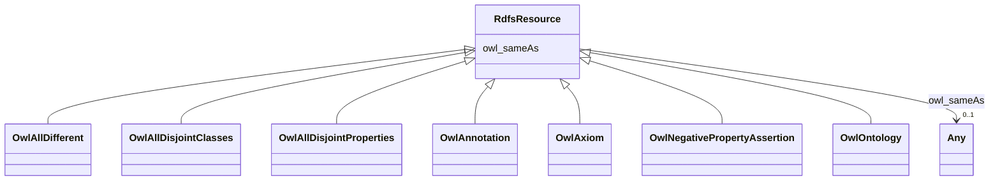

# Class: No class (type) name specified (rdfs_Resource)


_No class (type) description specified_


This class occurs 34 times.


URI: [rdfs:Resource](http://www.w3.org/2000/01/rdf-schema#Resource)





## Inheritance
* **RdfsResource**
    * [OwlAllDifferent](../classes/OwlAllDifferent.md)
    * [OwlAllDisjointClasses](../classes/OwlAllDisjointClasses.md)
    * [OwlAllDisjointProperties](../classes/OwlAllDisjointProperties.md)
    * [OwlAnnotation](../classes/OwlAnnotation.md)
    * [OwlAxiom](../classes/OwlAxiom.md)
    * [OwlNegativePropertyAssertion](../classes/OwlNegativePropertyAssertion.md)
    * [OwlOntology](../classes/OwlOntology.md)


## Slots

| Name | Cardinality and Range | Description | Inheritance | Occurrences |
| ---  | --- | --- | --- | --- |
| [owl_sameAs](../slots/owl_sameAs.md) | 0..1 <br/> [FioIndustry](../classes/FioIndustry.md)&nbsp;or&nbsp;<br />[OwlThing](../classes/OwlThing.md)&nbsp;or&nbsp;<br />[xsd:anyURI](http://www.w3.org/2001/XMLSchema#anyURI)&nbsp;or&nbsp;<br />[NaicsNAICS-IndustryCode](../classes/NaicsNAICS-IndustryCode.md)&nbsp;or&nbsp;<br />[RdfsResource](../classes/RdfsResource.md)&nbsp;or&nbsp;<br />[RdfList](../classes/RdfList.md)&nbsp;or&nbsp;<br />[NaicsNAICS-Industry](../classes/NaicsNAICS-Industry.md)&nbsp;or&nbsp;<br />[NaicsNAICS-IndustrySector](../classes/NaicsNAICS-IndustrySector.md)&nbsp;or&nbsp;<br />[OwlNamedIndividual](../classes/OwlNamedIndividual.md) | No slot (predicate) description specified <br/>  | direct | 5 |


## Usages

| used by | used in | type | used |
| ---  | --- | --- | --- |
| [FioIndustry](../classes/FioIndustry.md) | [owl_sameAs](../slots/owl_sameAs.md) | any_of[range] | [RdfsResource](../classes/RdfsResource.md) |
| [NaicsNAICS-Industry](../classes/NaicsNAICS-Industry.md) | [owl_sameAs](../slots/owl_sameAs.md) | any_of[range] | [RdfsResource](../classes/RdfsResource.md) |
| [NaicsNAICS-IndustryCode](../classes/NaicsNAICS-IndustryCode.md) | [owl_sameAs](../slots/owl_sameAs.md) | any_of[range] | [RdfsResource](../classes/RdfsResource.md) |
| [NaicsNAICS-IndustryGroup](../classes/NaicsNAICS-IndustryGroup.md) | [owl_sameAs](../slots/owl_sameAs.md) | any_of[range] | [RdfsResource](../classes/RdfsResource.md) |
| [NaicsNAICS-IndustrySector](../classes/NaicsNAICS-IndustrySector.md) | [owl_sameAs](../slots/owl_sameAs.md) | any_of[range] | [RdfsResource](../classes/RdfsResource.md) |
| [NaicsNAICS-IndustrySubsector](../classes/NaicsNAICS-IndustrySubsector.md) | [owl_sameAs](../slots/owl_sameAs.md) | any_of[range] | [RdfsResource](../classes/RdfsResource.md) |
| [OwlAllDifferent](../classes/OwlAllDifferent.md) | [owl_sameAs](../slots/owl_sameAs.md) | any_of[range] | [RdfsResource](../classes/RdfsResource.md) |
| [OwlAllDisjointClasses](../classes/OwlAllDisjointClasses.md) | [owl_sameAs](../slots/owl_sameAs.md) | any_of[range] | [RdfsResource](../classes/RdfsResource.md) |
| [OwlAllDisjointProperties](../classes/OwlAllDisjointProperties.md) | [owl_sameAs](../slots/owl_sameAs.md) | any_of[range] | [RdfsResource](../classes/RdfsResource.md) |
| [OwlAnnotation](../classes/OwlAnnotation.md) | [owl_sameAs](../slots/owl_sameAs.md) | any_of[range] | [RdfsResource](../classes/RdfsResource.md) |
| [OwlAxiom](../classes/OwlAxiom.md) | [owl_sameAs](../slots/owl_sameAs.md) | any_of[range] | [RdfsResource](../classes/RdfsResource.md) |
| [OwlNamedIndividual](../classes/OwlNamedIndividual.md) | [owl_sameAs](../slots/owl_sameAs.md) | any_of[range] | [RdfsResource](../classes/RdfsResource.md) |
| [OwlNegativePropertyAssertion](../classes/OwlNegativePropertyAssertion.md) | [owl_sameAs](../slots/owl_sameAs.md) | any_of[range] | [RdfsResource](../classes/RdfsResource.md) |
| [OwlNothing](../classes/OwlNothing.md) | [owl_sameAs](../slots/owl_sameAs.md) | any_of[range] | [RdfsResource](../classes/RdfsResource.md) |
| [OwlOntology](../classes/OwlOntology.md) | [owl_sameAs](../slots/owl_sameAs.md) | any_of[range] | [RdfsResource](../classes/RdfsResource.md) |
| [OwlThing](../classes/OwlThing.md) | [owl_sameAs](../slots/owl_sameAs.md) | any_of[range] | [RdfsResource](../classes/RdfsResource.md) |
| [RdfList](../classes/RdfList.md) | [owl_sameAs](../slots/owl_sameAs.md) | any_of[range] | [RdfsResource](../classes/RdfsResource.md) |
| [RdfsResource](../classes/RdfsResource.md) | [owl_sameAs](../slots/owl_sameAs.md) | any_of[range] | [RdfsResource](../classes/RdfsResource.md) |


## LinkML Source

<!-- TODO: investigate https://stackoverflow.com/questions/37606292/how-to-create-tabbed-code-blocks-in-mkdocs-or-sphinx -->

### Direct

<details>

```yaml
name: rdfs_Resource
conforms_to: No schema conformance document specified
annotations:
  count:
    tag: count
    value: 34
description: No class (type) description specified
title: No class (type) name specified
from_schema: fio-kg
rank: 1000
slots:
- owl_sameAs
slot_usage:
  owl_sameAs:
    name: owl_sameAs
    annotations:
      owl_Thing:
        tag: owl_Thing
        value: 2
      rdf_List:
        tag: rdf_List
        value: 1
      rdfs_Resource:
        tag: rdfs_Resource
        value: 2
class_uri: rdfs:Resource

```
</details>

### Induced

<details>

```yaml
name: rdfs_Resource
conforms_to: No schema conformance document specified
annotations:
  count:
    tag: count
    value: 34
description: No class (type) description specified
title: No class (type) name specified
from_schema: fio-kg
rank: 1000
slot_usage:
  owl_sameAs:
    name: owl_sameAs
    annotations:
      owl_Thing:
        tag: owl_Thing
        value: 2
      rdf_List:
        tag: rdf_List
        value: 1
      rdfs_Resource:
        tag: rdfs_Resource
        value: 2
attributes:
  owl_sameAs:
    name: owl_sameAs
    annotations:
      owl_Thing:
        tag: owl_Thing
        value: 2
      rdf_List:
        tag: rdf_List
        value: 1
      rdfs_Resource:
        tag: rdfs_Resource
        value: 2
    description: No slot (predicate) description specified
    title: No slot (predicate) name specified
    examples:
    - object:
        example_object: naics:NAICS-IndustryCode-11111
        example_object_type: naics_NAICS-IndustryCode
        example_predicate: owl:sameAs
        example_subject: naics:NAICS-IndustryCode-111110
        example_subject_type: naics_NAICS-IndustryCode
    - object:
        example_object: naics:NAICS-IndustryCode-11111
        example_object_type: naics_NAICS-Industry
        example_predicate: owl:sameAs
        example_subject: naics:NAICS-IndustryCode-111110
        example_subject_type: naics_NAICS-IndustryCode
    - object:
        example_object: naics:NAICS-IndustryCode-11111
        example_object_type: owl_Thing
        example_predicate: owl:sameAs
        example_subject: naics:NAICS-IndustryCode-111110
        example_subject_type: naics_NAICS-IndustryCode
    - object:
        example_object: naics:NAICS-IndustryCode-11111
        example_object_type: fio_Industry
        example_predicate: owl:sameAs
        example_subject: naics:NAICS-IndustryCode-111110
        example_subject_type: naics_NAICS-IndustryCode
    - object:
        example_object: naics:NAICS-IndustryCode-11111
        example_object_type: owl_NamedIndividual
        example_predicate: owl:sameAs
        example_subject: naics:NAICS-IndustryCode-111110
        example_subject_type: naics_NAICS-IndustryCode
    - object:
        example_object: naics:NAICS-IndustryCode-11111
        example_object_type: naics_NAICS-IndustryCode
        example_predicate: owl:sameAs
        example_subject: naics:NAICS-IndustryCode-111110
        example_subject_type: naics_NAICS-Industry
    - object:
        example_object: naics:NAICS-IndustryCode-11111
        example_object_type: naics_NAICS-Industry
        example_predicate: owl:sameAs
        example_subject: naics:NAICS-IndustryCode-111110
        example_subject_type: naics_NAICS-Industry
    - object:
        example_object: naics:NAICS-IndustryCode-11111
        example_object_type: owl_Thing
        example_predicate: owl:sameAs
        example_subject: naics:NAICS-IndustryCode-111110
        example_subject_type: naics_NAICS-Industry
    - object:
        example_object: naics:NAICS-IndustryCode-11111
        example_object_type: fio_Industry
        example_predicate: owl:sameAs
        example_subject: naics:NAICS-IndustryCode-111110
        example_subject_type: naics_NAICS-Industry
    - object:
        example_object: naics:NAICS-IndustryCode-11111
        example_object_type: owl_NamedIndividual
        example_predicate: owl:sameAs
        example_subject: naics:NAICS-IndustryCode-111110
        example_subject_type: naics_NAICS-Industry
    - object:
        example_object: naics:NAICS-IndustryCode-11111
        example_object_type: naics_NAICS-IndustryCode
        example_predicate: owl:sameAs
        example_subject: naics:NAICS-IndustryCode-111110
        example_subject_type: owl_Thing
    - object:
        example_object: naics:NAICS-IndustryCode-11111
        example_object_type: naics_NAICS-Industry
        example_predicate: owl:sameAs
        example_subject: naics:NAICS-IndustryCode-111110
        example_subject_type: owl_Thing
    - object:
        example_object: naics:NAICS-IndustryCode-11111
        example_object_type: owl_Thing
        example_predicate: owl:sameAs
        example_subject: naics:NAICS-IndustryCode-111110
        example_subject_type: owl_Thing
    - object:
        example_object: naics:NAICS-IndustryCode-11111
        example_object_type: fio_Industry
        example_predicate: owl:sameAs
        example_subject: naics:NAICS-IndustryCode-111110
        example_subject_type: owl_Thing
    - object:
        example_object: naics:NAICS-IndustryCode-11111
        example_object_type: owl_NamedIndividual
        example_predicate: owl:sameAs
        example_subject: naics:NAICS-IndustryCode-111110
        example_subject_type: owl_Thing
    - object:
        example_object: naics:NAICS-IndustryCode-11111
        example_object_type: naics_NAICS-IndustryCode
        example_predicate: owl:sameAs
        example_subject: naics:NAICS-IndustryCode-111110
        example_subject_type: fio_Industry
    - object:
        example_object: naics:NAICS-IndustryCode-11111
        example_object_type: naics_NAICS-Industry
        example_predicate: owl:sameAs
        example_subject: naics:NAICS-IndustryCode-111110
        example_subject_type: fio_Industry
    - object:
        example_object: naics:NAICS-IndustryCode-11111
        example_object_type: owl_Thing
        example_predicate: owl:sameAs
        example_subject: naics:NAICS-IndustryCode-111110
        example_subject_type: fio_Industry
    - object:
        example_object: naics:NAICS-IndustryCode-11111
        example_object_type: fio_Industry
        example_predicate: owl:sameAs
        example_subject: naics:NAICS-IndustryCode-111110
        example_subject_type: fio_Industry
    - object:
        example_object: naics:NAICS-IndustryCode-11111
        example_object_type: owl_NamedIndividual
        example_predicate: owl:sameAs
        example_subject: naics:NAICS-IndustryCode-111110
        example_subject_type: fio_Industry
    - object:
        example_object: naics:NAICS-IndustryCode-11111
        example_object_type: naics_NAICS-IndustryCode
        example_predicate: owl:sameAs
        example_subject: naics:NAICS-IndustryCode-111110
        example_subject_type: owl_NamedIndividual
    - object:
        example_object: naics:NAICS-IndustryCode-11111
        example_object_type: naics_NAICS-Industry
        example_predicate: owl:sameAs
        example_subject: naics:NAICS-IndustryCode-111110
        example_subject_type: owl_NamedIndividual
    - object:
        example_object: naics:NAICS-IndustryCode-11111
        example_object_type: owl_Thing
        example_predicate: owl:sameAs
        example_subject: naics:NAICS-IndustryCode-111110
        example_subject_type: owl_NamedIndividual
    - object:
        example_object: naics:NAICS-IndustryCode-11111
        example_object_type: fio_Industry
        example_predicate: owl:sameAs
        example_subject: naics:NAICS-IndustryCode-111110
        example_subject_type: owl_NamedIndividual
    - object:
        example_object: naics:NAICS-IndustryCode-11111
        example_object_type: owl_NamedIndividual
        example_predicate: owl:sameAs
        example_subject: naics:NAICS-IndustryCode-111110
        example_subject_type: owl_NamedIndividual
    - object:
        example_object: naics:NAICS-IndustrySector-31
        example_object_type: naics_NAICS-IndustrySector
        example_predicate: owl:sameAs
        example_subject: naics:NAICS-IndustrySector-32
        example_subject_type: fio_Industry
    - object:
        example_object: naics:NAICS-IndustrySector-31
        example_object_type: naics_NAICS-IndustrySector
        example_predicate: owl:sameAs
        example_subject: naics:NAICS-IndustrySector-32
        example_subject_type: naics_NAICS-Industry
    - object:
        example_object: naics:NAICS-IndustrySector-31
        example_object_type: naics_NAICS-Industry
        example_predicate: owl:sameAs
        example_subject: naics:NAICS-IndustrySector-32
        example_subject_type: naics_NAICS-IndustrySector
    - object:
        example_object: naics:NAICS-IndustrySector-31
        example_object_type: owl_Thing
        example_predicate: owl:sameAs
        example_subject: naics:NAICS-IndustrySector-32
        example_subject_type: naics_NAICS-IndustrySector
    - object:
        example_object: naics:NAICS-IndustrySector-31
        example_object_type: naics_NAICS-IndustrySector
        example_predicate: owl:sameAs
        example_subject: naics:NAICS-IndustrySector-32
        example_subject_type: naics_NAICS-IndustrySector
    - object:
        example_object: naics:NAICS-IndustrySector-31
        example_object_type: fio_Industry
        example_predicate: owl:sameAs
        example_subject: naics:NAICS-IndustrySector-32
        example_subject_type: naics_NAICS-IndustrySector
    - object:
        example_object: naics:NAICS-IndustrySector-31
        example_object_type: owl_NamedIndividual
        example_predicate: owl:sameAs
        example_subject: naics:NAICS-IndustrySector-32
        example_subject_type: naics_NAICS-IndustrySector
    - object:
        example_object: rdf:ObjectProperty
        example_object_type: rdfs_Resource
        example_predicate: owl:sameAs
        example_subject: rdf:ObjectProperty
        example_subject_type: owl_Thing
    - object:
        example_object: rdf:ObjectProperty
        example_object_type: owl_Thing
        example_predicate: owl:sameAs
        example_subject: rdf:ObjectProperty
        example_subject_type: rdfs_Resource
    - object:
        example_object: rdf:ObjectProperty
        example_object_type: rdfs_Resource
        example_predicate: owl:sameAs
        example_subject: rdf:ObjectProperty
        example_subject_type: rdfs_Resource
    - object:
        example_object: rdf:nil
        example_object_type: rdf_List
        example_predicate: owl:sameAs
        example_subject: rdf:nil
        example_subject_type: owl_Thing
    - object:
        example_object: rdf:nil
        example_object_type: rdfs_Resource
        example_predicate: owl:sameAs
        example_subject: rdf:nil
        example_subject_type: rdf_List
    - object:
        example_object: rdf:nil
        example_object_type: owl_Thing
        example_predicate: owl:sameAs
        example_subject: rdf:nil
        example_subject_type: rdf_List
    - object:
        example_object: rdf:nil
        example_object_type: rdf_List
        example_predicate: owl:sameAs
        example_subject: rdf:nil
        example_subject_type: rdf_List
    - object:
        example_object: rdf:nil
        example_object_type: rdf_List
        example_predicate: owl:sameAs
        example_subject: rdf:nil
        example_subject_type: rdfs_Resource
    from_schema: fio-kg
    rank: 1000
    domain: owl_sameAs
    slot_uri: owl:sameAs
    alias: owl_sameAs
    owner: rdfs_Resource
    domain_of:
    - fio_Industry
    - naics_NAICS-Industry
    - naics_NAICS-IndustryCode
    - naics_NAICS-IndustrySector
    - owl_NamedIndividual
    - owl_Thing
    - rdf_List
    - rdfs_Resource
    range: Any
    any_of:
    - range: fio_Industry
    - range: owl_Thing
    - range: uri
    - range: naics_NAICS-IndustryCode
    - range: rdfs_Resource
    - range: rdf_List
    - range: naics_NAICS-Industry
    - range: naics_NAICS-IndustrySector
    - range: owl_NamedIndividual
class_uri: rdfs:Resource

```
</details>