# Class: No class (type) name specified (usfrs_WaterSystem-Facility)


_No class (type) description specified_


This class occurs 43116 times.


URI: [usfrs:WaterSystem-Facility](http://sawgraph.spatialai.org/v1/us-frs#WaterSystem-Facility)

```mermaid
 classDiagram
    class UsfrsWaterSystem-Facility
    click UsfrsWaterSystem-Facility href "../UsfrsWaterSystem-Facility"
      UsfrsFRS-Facility <|-- UsfrsWaterSystem-Facility
        click UsfrsFRS-Facility href "../UsfrsFRS-Facility"
      
      UsfrsWaterSystem-Facility : fio_ofAgency
        
          
    
    
    UsfrsWaterSystem-Facility --> "0..1" Any : fio_ofAgency
    click Any href "../Any"

        
      UsfrsWaterSystem-Facility : fio_ofIndustry
        
          
    
    
    UsfrsWaterSystem-Facility --> "0..1" Any : fio_ofIndustry
    click Any href "../Any"

        
      UsfrsWaterSystem-Facility : geo_hasGeometry
        
          
    
    
    UsfrsWaterSystem-Facility --> "0..1" Uri : geo_hasGeometry
    click Uri href "../Uri"

        
      UsfrsWaterSystem-Facility : kwgo_sfWithin
        
          
    
    
    UsfrsWaterSystem-Facility --> "0..1" Uri : kwgo_sfWithin
    click Uri href "../Uri"

        
      UsfrsWaterSystem-Facility : kwgo_spatialRelation
        
          
    
    
    UsfrsWaterSystem-Facility --> "0..1" Any : kwgo_spatialRelation
    click Any href "../Any"

        
      UsfrsWaterSystem-Facility : rdfs_label
        
          
    
    
    UsfrsWaterSystem-Facility --> "0..1" Any : rdfs_label
    click Any href "../Any"

        
      UsfrsWaterSystem-Facility : usfrs_aces_Industry
        
          
    
    
    UsfrsWaterSystem-Facility --> "0..1" Any : usfrs_aces_Industry
    click Any href "../Any"

        
      UsfrsWaterSystem-Facility : usfrs_air_Industry
        
          
    
    
    UsfrsWaterSystem-Facility --> "0..1" Any : usfrs_air_Industry
    click Any href "../Any"

        
      UsfrsWaterSystem-Facility : usfrs_airs_afs_Industry
        
          
    
    
    UsfrsWaterSystem-Facility --> "0..1" Any : usfrs_airs_afs_Industry
    click Any href "../Any"

        
      UsfrsWaterSystem-Facility : usfrs_caaIndustry
        
          
    
    
    UsfrsWaterSystem-Facility --> "0..1" Any : usfrs_caaIndustry
    click Any href "../Any"

        
      UsfrsWaterSystem-Facility : usfrs_camdbs_Industry
        
          
    
    
    UsfrsWaterSystem-Facility --> "0..1" Any : usfrs_camdbs_Industry
    click Any href "../Any"

        
      UsfrsWaterSystem-Facility : usfrs_cedri_Industry
        
          
    
    
    UsfrsWaterSystem-Facility --> "0..1" Any : usfrs_cedri_Industry
    click Any href "../Any"

        
      UsfrsWaterSystem-Facility : usfrs_cwaIndustry
        
          
    
    
    UsfrsWaterSystem-Facility --> "0..1" Any : usfrs_cwaIndustry
    click Any href "../Any"

        
      UsfrsWaterSystem-Facility : usfrs_e_ggrt_Industry
        
          
    
    
    UsfrsWaterSystem-Facility --> "0..1" Any : usfrs_e_ggrt_Industry
    click Any href "../Any"

        
      UsfrsWaterSystem-Facility : usfrs_ecrm_Industry
        
          
    
    
    UsfrsWaterSystem-Facility --> "0..1" Uri : usfrs_ecrm_Industry
    click Uri href "../Uri"

        
      UsfrsWaterSystem-Facility : usfrs_eia_860_Industry
        
          
    
    
    UsfrsWaterSystem-Facility --> "0..1" Any : usfrs_eia_860_Industry
    click Any href "../Any"

        
      UsfrsWaterSystem-Facility : usfrs_eis_Industry
        
          
    
    
    UsfrsWaterSystem-Facility --> "0..1" Any : usfrs_eis_Industry
    click Any href "../Any"

        
      UsfrsWaterSystem-Facility : usfrs_environmentalInterestType
        
          
    
    
    UsfrsWaterSystem-Facility --> "0..1" String : usfrs_environmentalInterestType
    click String href "../String"

        
      UsfrsWaterSystem-Facility : usfrs_epcraIndustry
        
          
    
    
    UsfrsWaterSystem-Facility --> "0..1" Any : usfrs_epcraIndustry
    click Any href "../Any"

        
      UsfrsWaterSystem-Facility : usfrs_eps_Industry
        
          
    
    
    UsfrsWaterSystem-Facility --> "0..1" Any : usfrs_eps_Industry
    click Any href "../Any"

        
      UsfrsWaterSystem-Facility : usfrs_fifraIndustry
        
          
    
    
    UsfrsWaterSystem-Facility --> "0..1" Uri : usfrs_fifraIndustry
    click Uri href "../Uri"

        
      UsfrsWaterSystem-Facility : usfrs_hasACESId
        
          
    
    
    UsfrsWaterSystem-Facility --> "0..1" String : usfrs_hasACESId
    click String href "../String"

        
      UsfrsWaterSystem-Facility : usfrs_hasAIRId
        
          
    
    
    UsfrsWaterSystem-Facility --> "0..1" String : usfrs_hasAIRId
    click String href "../String"

        
      UsfrsWaterSystem-Facility : usfrs_hasAIRSAFSId
        
          
    
    
    UsfrsWaterSystem-Facility --> "0..1" String : usfrs_hasAIRSAFSId
    click String href "../String"

        
      UsfrsWaterSystem-Facility : usfrs_hasCAMDBSId
        
          
    
    
    UsfrsWaterSystem-Facility --> "0..1" String : usfrs_hasCAMDBSId
    click String href "../String"

        
      UsfrsWaterSystem-Facility : usfrs_hasCEDRIId
        
          
    
    
    UsfrsWaterSystem-Facility --> "0..1" String : usfrs_hasCEDRIId
    click String href "../String"

        
      UsfrsWaterSystem-Facility : usfrs_hasECRMId
        
          
    
    
    UsfrsWaterSystem-Facility --> "0..1" String : usfrs_hasECRMId
    click String href "../String"

        
      UsfrsWaterSystem-Facility : usfrs_hasEGGRTId
        
          
    
    
    UsfrsWaterSystem-Facility --> "0..1" String : usfrs_hasEGGRTId
    click String href "../String"

        
      UsfrsWaterSystem-Facility : usfrs_hasEIA860Id
        
          
    
    
    UsfrsWaterSystem-Facility --> "0..1" String : usfrs_hasEIA860Id
    click String href "../String"

        
      UsfrsWaterSystem-Facility : usfrs_hasEISId
        
          
    
    
    UsfrsWaterSystem-Facility --> "0..1" String : usfrs_hasEISId
    click String href "../String"

        
      UsfrsWaterSystem-Facility : usfrs_hasEPSId
        
          
    
    
    UsfrsWaterSystem-Facility --> "0..1" String : usfrs_hasEPSId
    click String href "../String"

        
      UsfrsWaterSystem-Facility : usfrs_hasFRSId
        
          
    
    
    UsfrsWaterSystem-Facility --> "0..1" String : usfrs_hasFRSId
    click String href "../String"

        
      UsfrsWaterSystem-Facility : usfrs_hasICISId
        
          
    
    
    UsfrsWaterSystem-Facility --> "0..1" String : usfrs_hasICISId
    click String href "../String"

        
      UsfrsWaterSystem-Facility : usfrs_hasMEEFISId
        
          
    
    
    UsfrsWaterSystem-Facility --> "0..1" String : usfrs_hasMEEFISId
    click String href "../String"

        
      UsfrsWaterSystem-Facility : usfrs_hasMNTEMPOId
        
          
    
    
    UsfrsWaterSystem-Facility --> "0..1" String : usfrs_hasMNTEMPOId
    click String href "../String"

        
      UsfrsWaterSystem-Facility : usfrs_hasNJNJEMSId
        
          
    
    
    UsfrsWaterSystem-Facility --> "0..1" String : usfrs_hasNJNJEMSId
    click String href "../String"

        
      UsfrsWaterSystem-Facility : usfrs_hasNPDESId
        
          
    
    
    UsfrsWaterSystem-Facility --> "0..1" String : usfrs_hasNPDESId
    click String href "../String"

        
      UsfrsWaterSystem-Facility : usfrs_hasOSHAOISId
        
          
    
    
    UsfrsWaterSystem-Facility --> "0..1" String : usfrs_hasOSHAOISId
    click String href "../String"

        
      UsfrsWaterSystem-Facility : usfrs_hasRCRAINFOId
        
          
    
    
    UsfrsWaterSystem-Facility --> "0..1" String : usfrs_hasRCRAINFOId
    click String href "../String"

        
      UsfrsWaterSystem-Facility : usfrs_hasRMPId
        
          
    
    
    UsfrsWaterSystem-Facility --> "0..1" String : usfrs_hasRMPId
    click String href "../String"

        
      UsfrsWaterSystem-Facility : usfrs_hasTRISId
        
          
    
    
    UsfrsWaterSystem-Facility --> "0..1" String : usfrs_hasTRISId
    click String href "../String"

        
      UsfrsWaterSystem-Facility : usfrs_icis_Industry
        
          
    
    
    UsfrsWaterSystem-Facility --> "0..1" Any : usfrs_icis_Industry
    click Any href "../Any"

        
      UsfrsWaterSystem-Facility : usfrs_me_efis_Industry
        
          
    
    
    UsfrsWaterSystem-Facility --> "0..1" Any : usfrs_me_efis_Industry
    click Any href "../Any"

        
      UsfrsWaterSystem-Facility : usfrs_mn_tempo_Industry
        
          
    
    
    UsfrsWaterSystem-Facility --> "0..1" Any : usfrs_mn_tempo_Industry
    click Any href "../Any"

        
      UsfrsWaterSystem-Facility : usfrs_ncdb_Industry
        
          
    
    
    UsfrsWaterSystem-Facility --> "0..1" Uri : usfrs_ncdb_Industry
    click Uri href "../Uri"

        
      UsfrsWaterSystem-Facility : usfrs_nj_njems_Industry
        
          
    
    
    UsfrsWaterSystem-Facility --> "0..1" Any : usfrs_nj_njems_Industry
    click Any href "../Any"

        
      UsfrsWaterSystem-Facility : usfrs_npdes_Industry
        
          
    
    
    UsfrsWaterSystem-Facility --> "0..1" Any : usfrs_npdes_Industry
    click Any href "../Any"

        
      UsfrsWaterSystem-Facility : usfrs_nv_fp_Industry
        
          
    
    
    UsfrsWaterSystem-Facility --> "0..1" Uri : usfrs_nv_fp_Industry
    click Uri href "../Uri"

        
      UsfrsWaterSystem-Facility : usfrs_oh_core_Industry
        
          
    
    
    UsfrsWaterSystem-Facility --> "0..1" Uri : usfrs_oh_core_Industry
    click Uri href "../Uri"

        
      UsfrsWaterSystem-Facility : usfrs_osha_ois_Industry
        
          
    
    
    UsfrsWaterSystem-Facility --> "0..1" Any : usfrs_osha_ois_Industry
    click Any href "../Any"

        
      UsfrsWaterSystem-Facility : usfrs_primaryIndustry
        
          
    
    
    UsfrsWaterSystem-Facility --> "0..1" Any : usfrs_primaryIndustry
    click Any href "../Any"

        
      UsfrsWaterSystem-Facility : usfrs_rblc_Industry
        
          
    
    
    UsfrsWaterSystem-Facility --> "0..1" Uri : usfrs_rblc_Industry
    click Uri href "../Uri"

        
      UsfrsWaterSystem-Facility : usfrs_rcrainfo_Industry
        
          
    
    
    UsfrsWaterSystem-Facility --> "0..1" Any : usfrs_rcrainfo_Industry
    click Any href "../Any"

        
      UsfrsWaterSystem-Facility : usfrs_rmp_Industry
        
          
    
    
    UsfrsWaterSystem-Facility --> "0..1" Any : usfrs_rmp_Industry
    click Any href "../Any"

        
      UsfrsWaterSystem-Facility : usfrs_secondaryIndustry
        
          
    
    
    UsfrsWaterSystem-Facility --> "0..1" Any : usfrs_secondaryIndustry
    click Any href "../Any"

        
      UsfrsWaterSystem-Facility : usfrs_ssts_Industry
        
          
    
    
    UsfrsWaterSystem-Facility --> "0..1" Uri : usfrs_ssts_Industry
    click Uri href "../Uri"

        
      UsfrsWaterSystem-Facility : usfrs_stateIndustry
        
          
    
    
    UsfrsWaterSystem-Facility --> "0..1" Any : usfrs_stateIndustry
    click Any href "../Any"

        
      UsfrsWaterSystem-Facility : usfrs_tris_Industry
        
          
    
    
    UsfrsWaterSystem-Facility --> "0..1" Any : usfrs_tris_Industry
    click Any href "../Any"

        
      UsfrsWaterSystem-Facility : usfrs_tscaIndustry
        
          
    
    
    UsfrsWaterSystem-Facility --> "0..1" Uri : usfrs_tscaIndustry
    click Uri href "../Uri"

        
      
```





## Inheritance
* [UsfrsFRS-Facility](../classes/UsfrsFRS-Facility.md)
    * **UsfrsWaterSystem-Facility**


## Slots

| Name | Cardinality and Range | Description | Inheritance | Occurrences |
| ---  | --- | --- | --- | --- |
| [usfrs_cwaIndustry](../slots/usfrs_cwaIndustry.md) | 0..1 <br/> [FioIndustry](../classes/FioIndustry.md)&nbsp;or&nbsp;<br />[OwlThing](../classes/OwlThing.md)&nbsp;or&nbsp;<br />[xsd:anyURI](http://www.w3.org/2001/XMLSchema#anyURI)&nbsp;or&nbsp;<br />[NaicsNAICS-IndustryCode](../classes/NaicsNAICS-IndustryCode.md)&nbsp;or&nbsp;<br />[NaicsNAICS-Industry](../classes/NaicsNAICS-Industry.md)&nbsp;or&nbsp;<br />[OwlNamedIndividual](../classes/OwlNamedIndividual.md) | Clean Water Act programs Industry Code <br/>  | direct | 1 |
| [usfrs_hasFRSId](../slots/usfrs_hasFRSId.md) | 0..1 <br/> [xsd:string](http://www.w3.org/2001/XMLSchema#string) | No slot (predicate) description specified <br/>  | direct | 43116 |
| [usfrs_npdes_Industry](../slots/usfrs_npdes_Industry.md) | 0..1 <br/> [FioIndustry](../classes/FioIndustry.md)&nbsp;or&nbsp;<br />[OwlThing](../classes/OwlThing.md)&nbsp;or&nbsp;<br />[xsd:anyURI](http://www.w3.org/2001/XMLSchema#anyURI)&nbsp;or&nbsp;<br />[NaicsNAICS-IndustryCode](../classes/NaicsNAICS-IndustryCode.md)&nbsp;or&nbsp;<br />[NaicsNAICS-Industry](../classes/NaicsNAICS-Industry.md)&nbsp;or&nbsp;<br />[OwlNamedIndividual](../classes/OwlNamedIndividual.md) | National Pollutant Discharge Elimination system Industry Code <br/>  | direct | 1 |
| [rdfs_label](../slots/rdfs_label.md) | 0..1 <br/> [xsd:anyURI](http://www.w3.org/2001/XMLSchema#anyURI)&nbsp;or&nbsp;<br />[xsd:string](http://www.w3.org/2001/XMLSchema#string) | No slot (predicate) description specified <br/>  | direct | 43113 |
| [kwgo_spatialRelation](../slots/kwgo_spatialRelation.md) | 0..1 <br/> [UsfrsFederal-Facility](../classes/UsfrsFederal-Facility.md)&nbsp;or&nbsp;<br />[UsfrsBrownfieldsSite-Facility](../classes/UsfrsBrownfieldsSite-Facility.md)&nbsp;or&nbsp;<br />[UsfrsFRS-Facility](../classes/UsfrsFRS-Facility.md)&nbsp;or&nbsp;<br />[UsfrsWaterfrontFacility-Facility](../classes/UsfrsWaterfrontFacility-Facility.md)&nbsp;or&nbsp;<br />[UsfrsWaterSystem-Facility](../classes/UsfrsWaterSystem-Facility.md)&nbsp;or&nbsp;<br />[UsfrsContaminationAddressed-Facility](../classes/UsfrsContaminationAddressed-Facility.md)&nbsp;or&nbsp;<br />[UsfrsStationary-Facility](../classes/UsfrsStationary-Facility.md)&nbsp;or&nbsp;<br />[xsd:anyURI](http://www.w3.org/2001/XMLSchema#anyURI)&nbsp;or&nbsp;<br />[FioFacility](../classes/FioFacility.md)&nbsp;or&nbsp;<br />[UsfrsContaminatedSite-Facility](../classes/UsfrsContaminatedSite-Facility.md)&nbsp;or&nbsp;<br />[UsfrsMonitoringStation-Facility](../classes/UsfrsMonitoringStation-Facility.md)&nbsp;or&nbsp;<br />[UsfrsPortable-Facility](../classes/UsfrsPortable-Facility.md)&nbsp;or&nbsp;<br />[UsfrsBarge-Facility](../classes/UsfrsBarge-Facility.md)&nbsp;or&nbsp;<br />[UsfrsPotentiallyContaminatedSite-Facility](../classes/UsfrsPotentiallyContaminatedSite-Facility.md)&nbsp;or&nbsp;<br />[B1](../classes/B1.md)&nbsp;or&nbsp;<br />[UsfrsEPA-PFAS-Facility](../classes/UsfrsEPA-PFAS-Facility.md) | No slot (predicate) description specified <br/>  | direct | 377 |
| [kwgo_sfWithin](../slots/kwgo_sfWithin.md) | 0..1 <br/> [xsd:anyURI](http://www.w3.org/2001/XMLSchema#anyURI) | No slot (predicate) description specified <br/>  | direct | 377 |
| [fio_ofIndustry](../slots/fio_ofIndustry.md) | 0..1 <br/> [FioIndustry](../classes/FioIndustry.md)&nbsp;or&nbsp;<br />[OwlThing](../classes/OwlThing.md)&nbsp;or&nbsp;<br />[NaicsNAICS-IndustryGroup](../classes/NaicsNAICS-IndustryGroup.md)&nbsp;or&nbsp;<br />[xsd:anyURI](http://www.w3.org/2001/XMLSchema#anyURI)&nbsp;or&nbsp;<br />[NaicsNAICS-IndustryCode](../classes/NaicsNAICS-IndustryCode.md)&nbsp;or&nbsp;<br />[NaicsNAICS-Industry](../classes/NaicsNAICS-Industry.md)&nbsp;or&nbsp;<br />[OwlNamedIndividual](../classes/OwlNamedIndividual.md) | No slot (predicate) description specified <br/>  | direct | 1 |
| [usfrs_primaryIndustry](../slots/usfrs_primaryIndustry.md) | 0..1 <br/> [FioIndustry](../classes/FioIndustry.md)&nbsp;or&nbsp;<br />[OwlThing](../classes/OwlThing.md)&nbsp;or&nbsp;<br />[NaicsNAICS-IndustryGroup](../classes/NaicsNAICS-IndustryGroup.md)&nbsp;or&nbsp;<br />[NaicsNAICS-IndustryCode](../classes/NaicsNAICS-IndustryCode.md)&nbsp;or&nbsp;<br />[xsd:anyURI](http://www.w3.org/2001/XMLSchema#anyURI)&nbsp;or&nbsp;<br />[NaicsNAICS-Industry](../classes/NaicsNAICS-Industry.md)&nbsp;or&nbsp;<br />[OwlNamedIndividual](../classes/OwlNamedIndividual.md) | No slot (predicate) description specified <br/>  | direct | 1 |
| [geo_hasGeometry](../slots/geo_hasGeometry.md) | 0..1 <br/> [xsd:anyURI](http://www.w3.org/2001/XMLSchema#anyURI) | No slot (predicate) description specified <br/>  | direct | 58 |
| [usfrs_hasECRMId](../slots/usfrs_hasECRMId.md) | 0..1 <br/> [xsd:string](http://www.w3.org/2001/XMLSchema#string) | No slot (predicate) description specified | [UsfrsFRS-Facility](../classes/UsfrsFRS-Facility.md) |  |
| [usfrs_air_Industry](../slots/usfrs_air_Industry.md) | 0..1 <br/> [FioIndustry](../classes/FioIndustry.md)&nbsp;or&nbsp;<br />[OwlThing](../classes/OwlThing.md)&nbsp;or&nbsp;<br />[NaicsNAICS-IndustryCode](../classes/NaicsNAICS-IndustryCode.md)&nbsp;or&nbsp;<br />[xsd:anyURI](http://www.w3.org/2001/XMLSchema#anyURI)&nbsp;or&nbsp;<br />[NaicsNAICS-Industry](../classes/NaicsNAICS-Industry.md)&nbsp;or&nbsp;<br />[OwlNamedIndividual](../classes/OwlNamedIndividual.md) | No slot (predicate) description specified | [UsfrsFRS-Facility](../classes/UsfrsFRS-Facility.md) |  |
| [usfrs_icis_Industry](../slots/usfrs_icis_Industry.md) | 0..1 <br/> [FioIndustry](../classes/FioIndustry.md)&nbsp;or&nbsp;<br />[OwlThing](../classes/OwlThing.md)&nbsp;or&nbsp;<br />[xsd:anyURI](http://www.w3.org/2001/XMLSchema#anyURI)&nbsp;or&nbsp;<br />[NaicsNAICS-IndustryCode](../classes/NaicsNAICS-IndustryCode.md)&nbsp;or&nbsp;<br />[NaicsNAICS-Industry](../classes/NaicsNAICS-Industry.md)&nbsp;or&nbsp;<br />[OwlNamedIndividual](../classes/OwlNamedIndividual.md) | Integrated Compliance Information System Industry Code | [UsfrsFRS-Facility](../classes/UsfrsFRS-Facility.md) |  |
| [usfrs_rblc_Industry](../slots/usfrs_rblc_Industry.md) | 0..1 <br/> [xsd:anyURI](http://www.w3.org/2001/XMLSchema#anyURI) | RACT/BACT/LAER CLEARINGHOUSE Industry Code | [UsfrsFRS-Facility](../classes/UsfrsFRS-Facility.md) |  |
| [usfrs_eps_Industry](../slots/usfrs_eps_Industry.md) | 0..1 <br/> [FioIndustry](../classes/FioIndustry.md)&nbsp;or&nbsp;<br />[OwlThing](../classes/OwlThing.md)&nbsp;or&nbsp;<br />[NaicsNAICS-IndustryCode](../classes/NaicsNAICS-IndustryCode.md)&nbsp;or&nbsp;<br />[xsd:anyURI](http://www.w3.org/2001/XMLSchema#anyURI)&nbsp;or&nbsp;<br />[NaicsNAICS-Industry](../classes/NaicsNAICS-Industry.md)&nbsp;or&nbsp;<br />[OwlNamedIndividual](../classes/OwlNamedIndividual.md) | Electronic Permit System Industry Code | [UsfrsFRS-Facility](../classes/UsfrsFRS-Facility.md) |  |
| [usfrs_caaIndustry](../slots/usfrs_caaIndustry.md) | 0..1 <br/> [FioIndustry](../classes/FioIndustry.md)&nbsp;or&nbsp;<br />[OwlThing](../classes/OwlThing.md)&nbsp;or&nbsp;<br />[NaicsNAICS-IndustryGroup](../classes/NaicsNAICS-IndustryGroup.md)&nbsp;or&nbsp;<br />[NaicsNAICS-IndustryCode](../classes/NaicsNAICS-IndustryCode.md)&nbsp;or&nbsp;<br />[xsd:anyURI](http://www.w3.org/2001/XMLSchema#anyURI)&nbsp;or&nbsp;<br />[NaicsNAICS-Industry](../classes/NaicsNAICS-Industry.md)&nbsp;or&nbsp;<br />[OwlNamedIndividual](../classes/OwlNamedIndividual.md) | Clean Air Act (Air) programs Industry Code | [UsfrsFRS-Facility](../classes/UsfrsFRS-Facility.md) |  |
| [usfrs_hasEGGRTId](../slots/usfrs_hasEGGRTId.md) | 0..1 <br/> [xsd:string](http://www.w3.org/2001/XMLSchema#string) | No slot (predicate) description specified | [UsfrsFRS-Facility](../classes/UsfrsFRS-Facility.md) |  |
| [usfrs_oh_core_Industry](../slots/usfrs_oh_core_Industry.md) | 0..1 <br/> [xsd:anyURI](http://www.w3.org/2001/XMLSchema#anyURI) | No slot (predicate) description specified | [UsfrsFRS-Facility](../classes/UsfrsFRS-Facility.md) |  |
| [usfrs_hasAIRSAFSId](../slots/usfrs_hasAIRSAFSId.md) | 0..1 <br/> [xsd:string](http://www.w3.org/2001/XMLSchema#string) | No slot (predicate) description specified | [UsfrsFRS-Facility](../classes/UsfrsFRS-Facility.md) |  |
| [usfrs_nj_njems_Industry](../slots/usfrs_nj_njems_Industry.md) | 0..1 <br/> [FioIndustry](../classes/FioIndustry.md)&nbsp;or&nbsp;<br />[OwlThing](../classes/OwlThing.md)&nbsp;or&nbsp;<br />[xsd:anyURI](http://www.w3.org/2001/XMLSchema#anyURI)&nbsp;or&nbsp;<br />[NaicsNAICS-IndustryCode](../classes/NaicsNAICS-IndustryCode.md)&nbsp;or&nbsp;<br />[NaicsNAICS-Industry](../classes/NaicsNAICS-Industry.md)&nbsp;or&nbsp;<br />[OwlNamedIndividual](../classes/OwlNamedIndividual.md) | No slot (predicate) description specified | [UsfrsFRS-Facility](../classes/UsfrsFRS-Facility.md) |  |
| [usfrs_e_ggrt_Industry](../slots/usfrs_e_ggrt_Industry.md) | 0..1 <br/> [FioIndustry](../classes/FioIndustry.md)&nbsp;or&nbsp;<br />[OwlThing](../classes/OwlThing.md)&nbsp;or&nbsp;<br />[NaicsNAICS-IndustryCode](../classes/NaicsNAICS-IndustryCode.md)&nbsp;or&nbsp;<br />[xsd:anyURI](http://www.w3.org/2001/XMLSchema#anyURI)&nbsp;or&nbsp;<br />[NaicsNAICS-Industry](../classes/NaicsNAICS-Industry.md)&nbsp;or&nbsp;<br />[OwlNamedIndividual](../classes/OwlNamedIndividual.md) | Electronic Greenhous Gas Reporting Tool Industry Code | [UsfrsFRS-Facility](../classes/UsfrsFRS-Facility.md) |  |
| [usfrs_hasNPDESId](../slots/usfrs_hasNPDESId.md) | 0..1 <br/> [xsd:string](http://www.w3.org/2001/XMLSchema#string) | No slot (predicate) description specified | [UsfrsFRS-Facility](../classes/UsfrsFRS-Facility.md) |  |
| [usfrs_me_efis_Industry](../slots/usfrs_me_efis_Industry.md) | 0..1 <br/> [FioIndustry](../classes/FioIndustry.md)&nbsp;or&nbsp;<br />[OwlThing](../classes/OwlThing.md)&nbsp;or&nbsp;<br />[NaicsNAICS-IndustryCode](../classes/NaicsNAICS-IndustryCode.md)&nbsp;or&nbsp;<br />[xsd:anyURI](http://www.w3.org/2001/XMLSchema#anyURI)&nbsp;or&nbsp;<br />[NaicsNAICS-Industry](../classes/NaicsNAICS-Industry.md)&nbsp;or&nbsp;<br />[OwlNamedIndividual](../classes/OwlNamedIndividual.md) | No slot (predicate) description specified | [UsfrsFRS-Facility](../classes/UsfrsFRS-Facility.md) |  |
| [usfrs_airs_afs_Industry](../slots/usfrs_airs_afs_Industry.md) | 0..1 <br/> [FioIndustry](../classes/FioIndustry.md)&nbsp;or&nbsp;<br />[OwlThing](../classes/OwlThing.md)&nbsp;or&nbsp;<br />[NaicsNAICS-IndustryCode](../classes/NaicsNAICS-IndustryCode.md)&nbsp;or&nbsp;<br />[xsd:anyURI](http://www.w3.org/2001/XMLSchema#anyURI)&nbsp;or&nbsp;<br />[NaicsNAICS-Industry](../classes/NaicsNAICS-Industry.md)&nbsp;or&nbsp;<br />[OwlNamedIndividual](../classes/OwlNamedIndividual.md) | No slot (predicate) description specified | [UsfrsFRS-Facility](../classes/UsfrsFRS-Facility.md) |  |
| [usfrs_cedri_Industry](../slots/usfrs_cedri_Industry.md) | 0..1 <br/> [FioIndustry](../classes/FioIndustry.md)&nbsp;or&nbsp;<br />[OwlThing](../classes/OwlThing.md)&nbsp;or&nbsp;<br />[xsd:anyURI](http://www.w3.org/2001/XMLSchema#anyURI)&nbsp;or&nbsp;<br />[NaicsNAICS-IndustryCode](../classes/NaicsNAICS-IndustryCode.md)&nbsp;or&nbsp;<br />[NaicsNAICS-Industry](../classes/NaicsNAICS-Industry.md)&nbsp;or&nbsp;<br />[OwlNamedIndividual](../classes/OwlNamedIndividual.md) | Compliance and Emissions data reporting Interface Industry Code | [UsfrsFRS-Facility](../classes/UsfrsFRS-Facility.md) |  |
| [usfrs_rcrainfo_Industry](../slots/usfrs_rcrainfo_Industry.md) | 0..1 <br/> [FioIndustry](../classes/FioIndustry.md)&nbsp;or&nbsp;<br />[OwlThing](../classes/OwlThing.md)&nbsp;or&nbsp;<br />[NaicsNAICS-IndustryGroup](../classes/NaicsNAICS-IndustryGroup.md)&nbsp;or&nbsp;<br />[NaicsNAICS-IndustryCode](../classes/NaicsNAICS-IndustryCode.md)&nbsp;or&nbsp;<br />[xsd:anyURI](http://www.w3.org/2001/XMLSchema#anyURI)&nbsp;or&nbsp;<br />[NaicsNAICS-Industry](../classes/NaicsNAICS-Industry.md)&nbsp;or&nbsp;<br />[OwlNamedIndividual](../classes/OwlNamedIndividual.md) | No slot (predicate) description specified | [UsfrsFRS-Facility](../classes/UsfrsFRS-Facility.md) |  |
| [usfrs_tscaIndustry](../slots/usfrs_tscaIndustry.md) | 0..1 <br/> [xsd:anyURI](http://www.w3.org/2001/XMLSchema#anyURI) | Toxic Substances Control Act Industry Code | [UsfrsFRS-Facility](../classes/UsfrsFRS-Facility.md) |  |
| [usfrs_hasMEEFISId](../slots/usfrs_hasMEEFISId.md) | 0..1 <br/> [xsd:string](http://www.w3.org/2001/XMLSchema#string) | No slot (predicate) description specified | [UsfrsFRS-Facility](../classes/UsfrsFRS-Facility.md) |  |
| [usfrs_hasCAMDBSId](../slots/usfrs_hasCAMDBSId.md) | 0..1 <br/> [xsd:string](http://www.w3.org/2001/XMLSchema#string) | No slot (predicate) description specified | [UsfrsFRS-Facility](../classes/UsfrsFRS-Facility.md) |  |
| [usfrs_secondaryIndustry](../slots/usfrs_secondaryIndustry.md) | 0..1 <br/> [FioIndustry](../classes/FioIndustry.md)&nbsp;or&nbsp;<br />[OwlThing](../classes/OwlThing.md)&nbsp;or&nbsp;<br />[NaicsNAICS-IndustryGroup](../classes/NaicsNAICS-IndustryGroup.md)&nbsp;or&nbsp;<br />[NaicsNAICS-IndustryCode](../classes/NaicsNAICS-IndustryCode.md)&nbsp;or&nbsp;<br />[xsd:anyURI](http://www.w3.org/2001/XMLSchema#anyURI)&nbsp;or&nbsp;<br />[NaicsNAICS-Industry](../classes/NaicsNAICS-Industry.md)&nbsp;or&nbsp;<br />[OwlNamedIndividual](../classes/OwlNamedIndividual.md) | No slot (predicate) description specified | [UsfrsFRS-Facility](../classes/UsfrsFRS-Facility.md) |  |
| [usfrs_hasTRISId](../slots/usfrs_hasTRISId.md) | 0..1 <br/> [xsd:string](http://www.w3.org/2001/XMLSchema#string) | No slot (predicate) description specified | [UsfrsFRS-Facility](../classes/UsfrsFRS-Facility.md) |  |
| [usfrs_hasMNTEMPOId](../slots/usfrs_hasMNTEMPOId.md) | 0..1 <br/> [xsd:string](http://www.w3.org/2001/XMLSchema#string) | No slot (predicate) description specified | [UsfrsFRS-Facility](../classes/UsfrsFRS-Facility.md) |  |
| [usfrs_eia_860_Industry](../slots/usfrs_eia_860_Industry.md) | 0..1 <br/> [FioIndustry](../classes/FioIndustry.md)&nbsp;or&nbsp;<br />[OwlThing](../classes/OwlThing.md)&nbsp;or&nbsp;<br />[NaicsNAICS-IndustryGroup](../classes/NaicsNAICS-IndustryGroup.md)&nbsp;or&nbsp;<br />[xsd:anyURI](http://www.w3.org/2001/XMLSchema#anyURI)&nbsp;or&nbsp;<br />[NaicsNAICS-IndustryCode](../classes/NaicsNAICS-IndustryCode.md)&nbsp;or&nbsp;<br />[NaicsNAICS-Industry](../classes/NaicsNAICS-Industry.md)&nbsp;or&nbsp;<br />[OwlNamedIndividual](../classes/OwlNamedIndividual.md) | Energy Information Administration-860 database Industry Code | [UsfrsFRS-Facility](../classes/UsfrsFRS-Facility.md) |  |
| [usfrs_hasEISId](../slots/usfrs_hasEISId.md) | 0..1 <br/> [xsd:string](http://www.w3.org/2001/XMLSchema#string) | No slot (predicate) description specified | [UsfrsFRS-Facility](../classes/UsfrsFRS-Facility.md) |  |
| [usfrs_hasOSHAOISId](../slots/usfrs_hasOSHAOISId.md) | 0..1 <br/> [xsd:string](http://www.w3.org/2001/XMLSchema#string) | No slot (predicate) description specified | [UsfrsFRS-Facility](../classes/UsfrsFRS-Facility.md) |  |
| [usfrs_rmp_Industry](../slots/usfrs_rmp_Industry.md) | 0..1 <br/> [FioIndustry](../classes/FioIndustry.md)&nbsp;or&nbsp;<br />[OwlThing](../classes/OwlThing.md)&nbsp;or&nbsp;<br />[NaicsNAICS-IndustryCode](../classes/NaicsNAICS-IndustryCode.md)&nbsp;or&nbsp;<br />[xsd:anyURI](http://www.w3.org/2001/XMLSchema#anyURI)&nbsp;or&nbsp;<br />[NaicsNAICS-Industry](../classes/NaicsNAICS-Industry.md)&nbsp;or&nbsp;<br />[OwlNamedIndividual](../classes/OwlNamedIndividual.md) | Risk Management Plan Industry Code | [UsfrsFRS-Facility](../classes/UsfrsFRS-Facility.md) |  |
| [usfrs_eis_Industry](../slots/usfrs_eis_Industry.md) | 0..1 <br/> [FioIndustry](../classes/FioIndustry.md)&nbsp;or&nbsp;<br />[OwlThing](../classes/OwlThing.md)&nbsp;or&nbsp;<br />[NaicsNAICS-IndustryGroup](../classes/NaicsNAICS-IndustryGroup.md)&nbsp;or&nbsp;<br />[NaicsNAICS-IndustryCode](../classes/NaicsNAICS-IndustryCode.md)&nbsp;or&nbsp;<br />[xsd:anyURI](http://www.w3.org/2001/XMLSchema#anyURI)&nbsp;or&nbsp;<br />[NaicsNAICS-Industry](../classes/NaicsNAICS-Industry.md)&nbsp;or&nbsp;<br />[OwlNamedIndividual](../classes/OwlNamedIndividual.md) | Emissions Inventory System Industry Code | [UsfrsFRS-Facility](../classes/UsfrsFRS-Facility.md) |  |
| [usfrs_ncdb_Industry](../slots/usfrs_ncdb_Industry.md) | 0..1 <br/> [xsd:anyURI](http://www.w3.org/2001/XMLSchema#anyURI) | National Compliance Database System (pesticide/ toxic substances programs) In... | [UsfrsFRS-Facility](../classes/UsfrsFRS-Facility.md) |  |
| [fio_ofAgency](../slots/fio_ofAgency.md) | 0..1 <br/> [xsd:anyURI](http://www.w3.org/2001/XMLSchema#anyURI)&nbsp;or&nbsp;<br />[ProvOrganization](../classes/ProvOrganization.md)&nbsp;or&nbsp;<br />[FioAgency](../classes/FioAgency.md) | No slot (predicate) description specified | [UsfrsFRS-Facility](../classes/UsfrsFRS-Facility.md) |  |
| [usfrs_hasNJNJEMSId](../slots/usfrs_hasNJNJEMSId.md) | 0..1 <br/> [xsd:string](http://www.w3.org/2001/XMLSchema#string) | No slot (predicate) description specified | [UsfrsFRS-Facility](../classes/UsfrsFRS-Facility.md) |  |
| [usfrs_camdbs_Industry](../slots/usfrs_camdbs_Industry.md) | 0..1 <br/> [FioIndustry](../classes/FioIndustry.md)&nbsp;or&nbsp;<br />[OwlThing](../classes/OwlThing.md)&nbsp;or&nbsp;<br />[NaicsNAICS-IndustryCode](../classes/NaicsNAICS-IndustryCode.md)&nbsp;or&nbsp;<br />[xsd:anyURI](http://www.w3.org/2001/XMLSchema#anyURI)&nbsp;or&nbsp;<br />[NaicsNAICS-Industry](../classes/NaicsNAICS-Industry.md)&nbsp;or&nbsp;<br />[OwlNamedIndividual](../classes/OwlNamedIndividual.md) | CAM (Compliance Assurance Monitoring) database system Industry Code | [UsfrsFRS-Facility](../classes/UsfrsFRS-Facility.md) |  |
| [usfrs_osha_ois_Industry](../slots/usfrs_osha_ois_Industry.md) | 0..1 <br/> [FioIndustry](../classes/FioIndustry.md)&nbsp;or&nbsp;<br />[OwlThing](../classes/OwlThing.md)&nbsp;or&nbsp;<br />[NaicsNAICS-IndustryCode](../classes/NaicsNAICS-IndustryCode.md)&nbsp;or&nbsp;<br />[xsd:anyURI](http://www.w3.org/2001/XMLSchema#anyURI)&nbsp;or&nbsp;<br />[NaicsNAICS-Industry](../classes/NaicsNAICS-Industry.md)&nbsp;or&nbsp;<br />[OwlNamedIndividual](../classes/OwlNamedIndividual.md) | Occupational Safety and Health Administration Information System Industry Cod... | [UsfrsFRS-Facility](../classes/UsfrsFRS-Facility.md) |  |
| [usfrs_ssts_Industry](../slots/usfrs_ssts_Industry.md) | 0..1 <br/> [xsd:anyURI](http://www.w3.org/2001/XMLSchema#anyURI) | Section Seven Tracking System (pesticides programs) Industry Code | [UsfrsFRS-Facility](../classes/UsfrsFRS-Facility.md) |  |
| [usfrs_stateIndustry](../slots/usfrs_stateIndustry.md) | 0..1 <br/> [FioIndustry](../classes/FioIndustry.md)&nbsp;or&nbsp;<br />[OwlThing](../classes/OwlThing.md)&nbsp;or&nbsp;<br />[NaicsNAICS-IndustryCode](../classes/NaicsNAICS-IndustryCode.md)&nbsp;or&nbsp;<br />[xsd:anyURI](http://www.w3.org/2001/XMLSchema#anyURI)&nbsp;or&nbsp;<br />[NaicsNAICS-Industry](../classes/NaicsNAICS-Industry.md)&nbsp;or&nbsp;<br />[OwlNamedIndividual](../classes/OwlNamedIndividual.md) | State programs Industry Code | [UsfrsFRS-Facility](../classes/UsfrsFRS-Facility.md) |  |
| [usfrs_hasRCRAINFOId](../slots/usfrs_hasRCRAINFOId.md) | 0..1 <br/> [xsd:string](http://www.w3.org/2001/XMLSchema#string) | No slot (predicate) description specified | [UsfrsFRS-Facility](../classes/UsfrsFRS-Facility.md) |  |
| [usfrs_ecrm_Industry](../slots/usfrs_ecrm_Industry.md) | 0..1 <br/> [xsd:anyURI](http://www.w3.org/2001/XMLSchema#anyURI) | No slot (predicate) description specified | [UsfrsFRS-Facility](../classes/UsfrsFRS-Facility.md) |  |
| [usfrs_aces_Industry](../slots/usfrs_aces_Industry.md) | 0..1 <br/> [FioIndustry](../classes/FioIndustry.md)&nbsp;or&nbsp;<br />[OwlThing](../classes/OwlThing.md)&nbsp;or&nbsp;<br />[xsd:anyURI](http://www.w3.org/2001/XMLSchema#anyURI)&nbsp;or&nbsp;<br />[NaicsNAICS-IndustryCode](../classes/NaicsNAICS-IndustryCode.md)&nbsp;or&nbsp;<br />[NaicsNAICS-Industry](../classes/NaicsNAICS-Industry.md)&nbsp;or&nbsp;<br />[OwlNamedIndividual](../classes/OwlNamedIndividual.md) | No slot (predicate) description specified | [UsfrsFRS-Facility](../classes/UsfrsFRS-Facility.md) |  |
| [usfrs_hasCEDRIId](../slots/usfrs_hasCEDRIId.md) | 0..1 <br/> [xsd:string](http://www.w3.org/2001/XMLSchema#string) | No slot (predicate) description specified | [UsfrsFRS-Facility](../classes/UsfrsFRS-Facility.md) |  |
| [usfrs_nv_fp_Industry](../slots/usfrs_nv_fp_Industry.md) | 0..1 <br/> [xsd:anyURI](http://www.w3.org/2001/XMLSchema#anyURI) | No slot (predicate) description specified | [UsfrsFRS-Facility](../classes/UsfrsFRS-Facility.md) |  |
| [usfrs_hasAIRId](../slots/usfrs_hasAIRId.md) | 0..1 <br/> [xsd:string](http://www.w3.org/2001/XMLSchema#string) | No slot (predicate) description specified | [UsfrsFRS-Facility](../classes/UsfrsFRS-Facility.md) |  |
| [usfrs_epcraIndustry](../slots/usfrs_epcraIndustry.md) | 0..1 <br/> [FioIndustry](../classes/FioIndustry.md)&nbsp;or&nbsp;<br />[OwlThing](../classes/OwlThing.md)&nbsp;or&nbsp;<br />[NaicsNAICS-IndustryCode](../classes/NaicsNAICS-IndustryCode.md)&nbsp;or&nbsp;<br />[xsd:anyURI](http://www.w3.org/2001/XMLSchema#anyURI)&nbsp;or&nbsp;<br />[NaicsNAICS-Industry](../classes/NaicsNAICS-Industry.md)&nbsp;or&nbsp;<br />[OwlNamedIndividual](../classes/OwlNamedIndividual.md) | Emergency Planning and Community Right-to-Know Act Industry Code | [UsfrsFRS-Facility](../classes/UsfrsFRS-Facility.md) |  |
| [usfrs_hasICISId](../slots/usfrs_hasICISId.md) | 0..1 <br/> [xsd:string](http://www.w3.org/2001/XMLSchema#string) | No slot (predicate) description specified | [UsfrsFRS-Facility](../classes/UsfrsFRS-Facility.md) |  |
| [usfrs_hasEIA860Id](../slots/usfrs_hasEIA860Id.md) | 0..1 <br/> [xsd:string](http://www.w3.org/2001/XMLSchema#string) | No slot (predicate) description specified | [UsfrsFRS-Facility](../classes/UsfrsFRS-Facility.md) |  |
| [usfrs_environmentalInterestType](../slots/usfrs_environmentalInterestType.md) | 0..1 <br/> [xsd:string](http://www.w3.org/2001/XMLSchema#string) | No slot (predicate) description specified | [UsfrsFRS-Facility](../classes/UsfrsFRS-Facility.md) |  |
| [usfrs_hasACESId](../slots/usfrs_hasACESId.md) | 0..1 <br/> [xsd:string](http://www.w3.org/2001/XMLSchema#string) | No slot (predicate) description specified | [UsfrsFRS-Facility](../classes/UsfrsFRS-Facility.md) |  |
| [usfrs_hasEPSId](../slots/usfrs_hasEPSId.md) | 0..1 <br/> [xsd:string](http://www.w3.org/2001/XMLSchema#string) | No slot (predicate) description specified | [UsfrsFRS-Facility](../classes/UsfrsFRS-Facility.md) |  |
| [usfrs_hasRMPId](../slots/usfrs_hasRMPId.md) | 0..1 <br/> [xsd:string](http://www.w3.org/2001/XMLSchema#string) | No slot (predicate) description specified | [UsfrsFRS-Facility](../classes/UsfrsFRS-Facility.md) |  |
| [usfrs_tris_Industry](../slots/usfrs_tris_Industry.md) | 0..1 <br/> [FioIndustry](../classes/FioIndustry.md)&nbsp;or&nbsp;<br />[OwlThing](../classes/OwlThing.md)&nbsp;or&nbsp;<br />[NaicsNAICS-IndustryCode](../classes/NaicsNAICS-IndustryCode.md)&nbsp;or&nbsp;<br />[xsd:anyURI](http://www.w3.org/2001/XMLSchema#anyURI)&nbsp;or&nbsp;<br />[NaicsNAICS-Industry](../classes/NaicsNAICS-Industry.md)&nbsp;or&nbsp;<br />[OwlNamedIndividual](../classes/OwlNamedIndividual.md) | Toxic Release Inventory program Industry Code | [UsfrsFRS-Facility](../classes/UsfrsFRS-Facility.md) |  |
| [usfrs_mn_tempo_Industry](../slots/usfrs_mn_tempo_Industry.md) | 0..1 <br/> [FioIndustry](../classes/FioIndustry.md)&nbsp;or&nbsp;<br />[OwlThing](../classes/OwlThing.md)&nbsp;or&nbsp;<br />[xsd:anyURI](http://www.w3.org/2001/XMLSchema#anyURI)&nbsp;or&nbsp;<br />[NaicsNAICS-IndustryCode](../classes/NaicsNAICS-IndustryCode.md)&nbsp;or&nbsp;<br />[NaicsNAICS-Industry](../classes/NaicsNAICS-Industry.md)&nbsp;or&nbsp;<br />[OwlNamedIndividual](../classes/OwlNamedIndividual.md) | No slot (predicate) description specified | [UsfrsFRS-Facility](../classes/UsfrsFRS-Facility.md) |  |
| [usfrs_fifraIndustry](../slots/usfrs_fifraIndustry.md) | 0..1 <br/> [xsd:anyURI](http://www.w3.org/2001/XMLSchema#anyURI) | Federal Insecticide, Fungicide and Rodenticide Act Industry Code | [UsfrsFRS-Facility](../classes/UsfrsFRS-Facility.md) |  |


## Usages

| used by | used in | type | used |
| ---  | --- | --- | --- |
| [B1](../classes/B1.md) | [kwgo_spatialRelation](../slots/kwgo_spatialRelation.md) | any_of[range] | [UsfrsWaterSystem-Facility](../classes/UsfrsWaterSystem-Facility.md) |
| [FioFacility](../classes/FioFacility.md) | [kwgo_spatialRelation](../slots/kwgo_spatialRelation.md) | any_of[range] | [UsfrsWaterSystem-Facility](../classes/UsfrsWaterSystem-Facility.md) |
| [UsfrsBarge-Facility](../classes/UsfrsBarge-Facility.md) | [kwgo_spatialRelation](../slots/kwgo_spatialRelation.md) | any_of[range] | [UsfrsWaterSystem-Facility](../classes/UsfrsWaterSystem-Facility.md) |
| [UsfrsBrownfieldsSite-Facility](../classes/UsfrsBrownfieldsSite-Facility.md) | [kwgo_spatialRelation](../slots/kwgo_spatialRelation.md) | any_of[range] | [UsfrsWaterSystem-Facility](../classes/UsfrsWaterSystem-Facility.md) |
| [UsfrsContaminatedSite-Facility](../classes/UsfrsContaminatedSite-Facility.md) | [kwgo_spatialRelation](../slots/kwgo_spatialRelation.md) | any_of[range] | [UsfrsWaterSystem-Facility](../classes/UsfrsWaterSystem-Facility.md) |
| [UsfrsContaminationAddressed-Facility](../classes/UsfrsContaminationAddressed-Facility.md) | [kwgo_spatialRelation](../slots/kwgo_spatialRelation.md) | any_of[range] | [UsfrsWaterSystem-Facility](../classes/UsfrsWaterSystem-Facility.md) |
| [UsfrsEPA-PFAS-Facility](../classes/UsfrsEPA-PFAS-Facility.md) | [kwgo_spatialRelation](../slots/kwgo_spatialRelation.md) | any_of[range] | [UsfrsWaterSystem-Facility](../classes/UsfrsWaterSystem-Facility.md) |
| [UsfrsFRS-Facility](../classes/UsfrsFRS-Facility.md) | [kwgo_spatialRelation](../slots/kwgo_spatialRelation.md) | any_of[range] | [UsfrsWaterSystem-Facility](../classes/UsfrsWaterSystem-Facility.md) |
| [UsfrsFederal-Facility](../classes/UsfrsFederal-Facility.md) | [kwgo_spatialRelation](../slots/kwgo_spatialRelation.md) | any_of[range] | [UsfrsWaterSystem-Facility](../classes/UsfrsWaterSystem-Facility.md) |
| [UsfrsMonitoringStation-Facility](../classes/UsfrsMonitoringStation-Facility.md) | [kwgo_spatialRelation](../slots/kwgo_spatialRelation.md) | any_of[range] | [UsfrsWaterSystem-Facility](../classes/UsfrsWaterSystem-Facility.md) |
| [UsfrsPortable-Facility](../classes/UsfrsPortable-Facility.md) | [kwgo_spatialRelation](../slots/kwgo_spatialRelation.md) | any_of[range] | [UsfrsWaterSystem-Facility](../classes/UsfrsWaterSystem-Facility.md) |
| [UsfrsPotentiallyContaminatedSite-Facility](../classes/UsfrsPotentiallyContaminatedSite-Facility.md) | [kwgo_spatialRelation](../slots/kwgo_spatialRelation.md) | any_of[range] | [UsfrsWaterSystem-Facility](../classes/UsfrsWaterSystem-Facility.md) |
| [UsfrsStationary-Facility](../classes/UsfrsStationary-Facility.md) | [kwgo_spatialRelation](../slots/kwgo_spatialRelation.md) | any_of[range] | [UsfrsWaterSystem-Facility](../classes/UsfrsWaterSystem-Facility.md) |
| [UsfrsWaterSystem-Facility](../classes/UsfrsWaterSystem-Facility.md) | [kwgo_spatialRelation](../slots/kwgo_spatialRelation.md) | any_of[range] | [UsfrsWaterSystem-Facility](../classes/UsfrsWaterSystem-Facility.md) |
| [UsfrsWaterfrontFacility-Facility](../classes/UsfrsWaterfrontFacility-Facility.md) | [kwgo_spatialRelation](../slots/kwgo_spatialRelation.md) | any_of[range] | [UsfrsWaterSystem-Facility](../classes/UsfrsWaterSystem-Facility.md) |


## LinkML Source

<!-- TODO: investigate https://stackoverflow.com/questions/37606292/how-to-create-tabbed-code-blocks-in-mkdocs-or-sphinx -->

### Direct

<details>

```yaml
name: usfrs_WaterSystem-Facility
conforms_to: No schema conformance document specified
annotations:
  count:
    tag: count
    value: 43116
description: No class (type) description specified
title: No class (type) name specified
from_schema: fio-kg
rank: 1000
is_a: usfrs_FRS-Facility
slots:
- usfrs_cwaIndustry
- usfrs_hasFRSId
- usfrs_npdes-Industry
- rdfs_label
- kwgo_spatialRelation
- kwgo_sfWithin
- fio_ofIndustry
- usfrs_primaryIndustry
- geo_hasGeometry
slot_usage:
  fio_ofIndustry:
    name: fio_ofIndustry
    annotations:
      uri:
        tag: uri
        value: 1
  geo_hasGeometry:
    name: geo_hasGeometry
    annotations:
      uri:
        tag: uri
        value: 58
  kwgo_sfWithin:
    name: kwgo_sfWithin
    annotations:
      uri:
        tag: uri
        value: 377
  kwgo_spatialRelation:
    name: kwgo_spatialRelation
    annotations:
      uri:
        tag: uri
        value: 377
  rdfs_label:
    name: rdfs_label
    annotations:
      string:
        tag: string
        value: 43113
  usfrs_cwaIndustry:
    name: usfrs_cwaIndustry
    annotations:
      uri:
        tag: uri
        value: 1
  usfrs_hasFRSId:
    name: usfrs_hasFRSId
    annotations:
      string:
        tag: string
        value: 43116
  usfrs_npdes-Industry:
    name: usfrs_npdes-Industry
    annotations:
      uri:
        tag: uri
        value: 1
  usfrs_primaryIndustry:
    name: usfrs_primaryIndustry
    annotations:
      uri:
        tag: uri
        value: 1
class_uri: usfrs:WaterSystem-Facility

```
</details>

### Induced

<details>

```yaml
name: usfrs_WaterSystem-Facility
conforms_to: No schema conformance document specified
annotations:
  count:
    tag: count
    value: 43116
description: No class (type) description specified
title: No class (type) name specified
from_schema: fio-kg
rank: 1000
is_a: usfrs_FRS-Facility
slot_usage:
  fio_ofIndustry:
    name: fio_ofIndustry
    annotations:
      uri:
        tag: uri
        value: 1
  geo_hasGeometry:
    name: geo_hasGeometry
    annotations:
      uri:
        tag: uri
        value: 58
  kwgo_sfWithin:
    name: kwgo_sfWithin
    annotations:
      uri:
        tag: uri
        value: 377
  kwgo_spatialRelation:
    name: kwgo_spatialRelation
    annotations:
      uri:
        tag: uri
        value: 377
  rdfs_label:
    name: rdfs_label
    annotations:
      string:
        tag: string
        value: 43113
  usfrs_cwaIndustry:
    name: usfrs_cwaIndustry
    annotations:
      uri:
        tag: uri
        value: 1
  usfrs_hasFRSId:
    name: usfrs_hasFRSId
    annotations:
      string:
        tag: string
        value: 43116
  usfrs_npdes-Industry:
    name: usfrs_npdes-Industry
    annotations:
      uri:
        tag: uri
        value: 1
  usfrs_primaryIndustry:
    name: usfrs_primaryIndustry
    annotations:
      uri:
        tag: uri
        value: 1
attributes:
  usfrs_cwaIndustry:
    name: usfrs_cwaIndustry
    annotations:
      uri:
        tag: uri
        value: 1
    description: Clean Water Act programs Industry Code
    title: No slot (predicate) name specified
    examples:
    - object:
        example_object: http://sawgraph.spatialai.org/v1/fio/sic#SIC-IndustryCode-3724
        example_object_type: uri
        example_predicate: usfrs:cwaIndustry
        example_subject: usfrsdata:d.FRS-Facility.110000314204
        example_subject_type: usfrs_Stationary-Facility
    - object:
        example_object: http://sawgraph.spatialai.org/v1/fio/sic#SIC-IndustryCode-3724
        example_object_type: uri
        example_predicate: usfrs:cwaIndustry
        example_subject: usfrsdata:d.FRS-Facility.110000314204
        example_subject_type: usfrs_FRS-Facility
    - object:
        example_object: http://sawgraph.spatialai.org/v1/fio/sic#SIC-IndustryCode-3724
        example_object_type: uri
        example_predicate: usfrs:cwaIndustry
        example_subject: usfrsdata:d.FRS-Facility.110000314204
        example_subject_type: fio_Facility
    - object:
        example_object: http://sawgraph.spatialai.org/v1/fio/sic#SIC-IndustryCode-3724
        example_object_type: uri
        example_predicate: usfrs:cwaIndustry
        example_subject: usfrsdata:d.FRS-Facility.110000314204
        example_subject_type: __b1
    - object:
        example_object: naics:NAICS-IndustryCode-424710
        example_object_type: naics_NAICS-IndustryCode
        example_predicate: usfrs:cwaIndustry
        example_subject: usfrsdata:d.FRS-Facility.110000314357
        example_subject_type: __b1
    - object:
        example_object: naics:NAICS-IndustryCode-424710
        example_object_type: naics_NAICS-Industry
        example_predicate: usfrs:cwaIndustry
        example_subject: usfrsdata:d.FRS-Facility.110000314357
        example_subject_type: __b1
    - object:
        example_object: naics:NAICS-IndustryCode-424710
        example_object_type: owl_Thing
        example_predicate: usfrs:cwaIndustry
        example_subject: usfrsdata:d.FRS-Facility.110000314357
        example_subject_type: __b1
    - object:
        example_object: naics:NAICS-IndustryCode-424710
        example_object_type: fio_Industry
        example_predicate: usfrs:cwaIndustry
        example_subject: usfrsdata:d.FRS-Facility.110000314357
        example_subject_type: __b1
    - object:
        example_object: naics:NAICS-IndustryCode-424710
        example_object_type: owl_NamedIndividual
        example_predicate: usfrs:cwaIndustry
        example_subject: usfrsdata:d.FRS-Facility.110000314357
        example_subject_type: __b1
    - object:
        example_object: naics:NAICS-IndustryCode-424710
        example_object_type: naics_NAICS-IndustryCode
        example_predicate: usfrs:cwaIndustry
        example_subject: usfrsdata:d.FRS-Facility.110000314357
        example_subject_type: usfrs_FRS-Facility
    - object:
        example_object: naics:NAICS-IndustryCode-424710
        example_object_type: naics_NAICS-Industry
        example_predicate: usfrs:cwaIndustry
        example_subject: usfrsdata:d.FRS-Facility.110000314357
        example_subject_type: usfrs_FRS-Facility
    - object:
        example_object: naics:NAICS-IndustryCode-424710
        example_object_type: owl_Thing
        example_predicate: usfrs:cwaIndustry
        example_subject: usfrsdata:d.FRS-Facility.110000314357
        example_subject_type: usfrs_FRS-Facility
    - object:
        example_object: naics:NAICS-IndustryCode-424710
        example_object_type: fio_Industry
        example_predicate: usfrs:cwaIndustry
        example_subject: usfrsdata:d.FRS-Facility.110000314357
        example_subject_type: usfrs_FRS-Facility
    - object:
        example_object: naics:NAICS-IndustryCode-424710
        example_object_type: owl_NamedIndividual
        example_predicate: usfrs:cwaIndustry
        example_subject: usfrsdata:d.FRS-Facility.110000314357
        example_subject_type: usfrs_FRS-Facility
    - object:
        example_object: naics:NAICS-IndustryCode-424710
        example_object_type: naics_NAICS-IndustryCode
        example_predicate: usfrs:cwaIndustry
        example_subject: usfrsdata:d.FRS-Facility.110000314357
        example_subject_type: fio_Facility
    - object:
        example_object: naics:NAICS-IndustryCode-424710
        example_object_type: naics_NAICS-Industry
        example_predicate: usfrs:cwaIndustry
        example_subject: usfrsdata:d.FRS-Facility.110000314357
        example_subject_type: fio_Facility
    - object:
        example_object: naics:NAICS-IndustryCode-424710
        example_object_type: owl_Thing
        example_predicate: usfrs:cwaIndustry
        example_subject: usfrsdata:d.FRS-Facility.110000314357
        example_subject_type: fio_Facility
    - object:
        example_object: naics:NAICS-IndustryCode-424710
        example_object_type: fio_Industry
        example_predicate: usfrs:cwaIndustry
        example_subject: usfrsdata:d.FRS-Facility.110000314357
        example_subject_type: fio_Facility
    - object:
        example_object: naics:NAICS-IndustryCode-424710
        example_object_type: owl_NamedIndividual
        example_predicate: usfrs:cwaIndustry
        example_subject: usfrsdata:d.FRS-Facility.110000314357
        example_subject_type: fio_Facility
    - object:
        example_object: naics:NAICS-IndustryCode-424710
        example_object_type: naics_NAICS-IndustryCode
        example_predicate: usfrs:cwaIndustry
        example_subject: usfrsdata:d.FRS-Facility.110000314357
        example_subject_type: usfrs_EPA-PFAS-Facility
    - object:
        example_object: naics:NAICS-IndustryCode-424710
        example_object_type: naics_NAICS-Industry
        example_predicate: usfrs:cwaIndustry
        example_subject: usfrsdata:d.FRS-Facility.110000314357
        example_subject_type: usfrs_EPA-PFAS-Facility
    - object:
        example_object: naics:NAICS-IndustryCode-424710
        example_object_type: owl_Thing
        example_predicate: usfrs:cwaIndustry
        example_subject: usfrsdata:d.FRS-Facility.110000314357
        example_subject_type: usfrs_EPA-PFAS-Facility
    - object:
        example_object: naics:NAICS-IndustryCode-424710
        example_object_type: fio_Industry
        example_predicate: usfrs:cwaIndustry
        example_subject: usfrsdata:d.FRS-Facility.110000314357
        example_subject_type: usfrs_EPA-PFAS-Facility
    - object:
        example_object: naics:NAICS-IndustryCode-424710
        example_object_type: owl_NamedIndividual
        example_predicate: usfrs:cwaIndustry
        example_subject: usfrsdata:d.FRS-Facility.110000314357
        example_subject_type: usfrs_EPA-PFAS-Facility
    - object:
        example_object: naics:NAICS-IndustryCode-424710
        example_object_type: naics_NAICS-IndustryCode
        example_predicate: usfrs:cwaIndustry
        example_subject: usfrsdata:d.FRS-Facility.110000314357
        example_subject_type: usfrs_Stationary-Facility
    - object:
        example_object: naics:NAICS-IndustryCode-424710
        example_object_type: naics_NAICS-Industry
        example_predicate: usfrs:cwaIndustry
        example_subject: usfrsdata:d.FRS-Facility.110000314357
        example_subject_type: usfrs_Stationary-Facility
    - object:
        example_object: naics:NAICS-IndustryCode-424710
        example_object_type: owl_Thing
        example_predicate: usfrs:cwaIndustry
        example_subject: usfrsdata:d.FRS-Facility.110000314357
        example_subject_type: usfrs_Stationary-Facility
    - object:
        example_object: naics:NAICS-IndustryCode-424710
        example_object_type: fio_Industry
        example_predicate: usfrs:cwaIndustry
        example_subject: usfrsdata:d.FRS-Facility.110000314357
        example_subject_type: usfrs_Stationary-Facility
    - object:
        example_object: naics:NAICS-IndustryCode-424710
        example_object_type: owl_NamedIndividual
        example_predicate: usfrs:cwaIndustry
        example_subject: usfrsdata:d.FRS-Facility.110000314357
        example_subject_type: usfrs_Stationary-Facility
    - object:
        example_object: http://sawgraph.spatialai.org/v1/fio/sic#SIC-IndustryCode-5171
        example_object_type: uri
        example_predicate: usfrs:cwaIndustry
        example_subject: usfrsdata:d.FRS-Facility.110000314357
        example_subject_type: usfrs_EPA-PFAS-Facility
    - object:
        example_object: http://sawgraph.spatialai.org/v1/fio/sic#SIC-IndustryCode-3714
        example_object_type: uri
        example_predicate: usfrs:cwaIndustry
        example_subject: usfrsdata:d.FRS-Facility.110000394635
        example_subject_type: usfrs_ContaminatedSite-Facility
    - object:
        example_object: http://sawgraph.spatialai.org/v1/fio/sic#SIC-IndustryCode-2819
        example_object_type: uri
        example_predicate: usfrs:cwaIndustry
        example_subject: usfrsdata:d.FRS-Facility.110000433273
        example_subject_type: usfrs_Federal-Facility
    - object:
        example_object: naics:NAICS-IndustryCode-112511
        example_object_type: naics_NAICS-IndustryCode
        example_predicate: usfrs:cwaIndustry
        example_subject: usfrsdata:d.FRS-Facility.110006889180
        example_subject_type: usfrs_Federal-Facility
    - object:
        example_object: naics:NAICS-IndustryCode-112511
        example_object_type: naics_NAICS-Industry
        example_predicate: usfrs:cwaIndustry
        example_subject: usfrsdata:d.FRS-Facility.110006889180
        example_subject_type: usfrs_Federal-Facility
    - object:
        example_object: naics:NAICS-IndustryCode-112511
        example_object_type: owl_Thing
        example_predicate: usfrs:cwaIndustry
        example_subject: usfrsdata:d.FRS-Facility.110006889180
        example_subject_type: usfrs_Federal-Facility
    - object:
        example_object: naics:NAICS-IndustryCode-112511
        example_object_type: fio_Industry
        example_predicate: usfrs:cwaIndustry
        example_subject: usfrsdata:d.FRS-Facility.110006889180
        example_subject_type: usfrs_Federal-Facility
    - object:
        example_object: naics:NAICS-IndustryCode-112511
        example_object_type: owl_NamedIndividual
        example_predicate: usfrs:cwaIndustry
        example_subject: usfrsdata:d.FRS-Facility.110006889180
        example_subject_type: usfrs_Federal-Facility
    - object:
        example_object: http://sawgraph.spatialai.org/v1/fio/sic#SIC-IndustryCode-4941
        example_object_type: uri
        example_predicate: usfrs:cwaIndustry
        example_subject: usfrsdata:d.FRS-Facility.110009348116
        example_subject_type: usfrs_PotentiallyContaminatedSite-Facility
    - object:
        example_object: http://sawgraph.spatialai.org/v1/fio/sic#SIC-IndustryCode-4952
        example_object_type: uri
        example_predicate: usfrs:cwaIndustry
        example_subject: usfrsdata:d.FRS-Facility.110020794265
        example_subject_type: usfrs_MonitoringStation-Facility
    - object:
        example_object: http://sawgraph.spatialai.org/v1/fio/sic#SIC-IndustryCode-3721
        example_object_type: uri
        example_predicate: usfrs:cwaIndustry
        example_subject: usfrsdata:d.FRS-Facility.110022326044
        example_subject_type: usfrs_BrownfieldsSite-Facility
    - object:
        example_object: http://sawgraph.spatialai.org/v1/fio/sic#SIC-IndustryCode-4212
        example_object_type: uri
        example_predicate: usfrs:cwaIndustry
        example_subject: usfrsdata:d.FRS-Facility.110046118330
        example_subject_type: usfrs_Portable-Facility
    - object:
        example_object: http://sawgraph.spatialai.org/v1/fio/sic#SIC-IndustryCode-8071
        example_object_type: uri
        example_predicate: usfrs:cwaIndustry
        example_subject: usfrsdata:d.FRS-Facility.110052485208
        example_subject_type: usfrs_WaterSystem-Facility
    from_schema: fio-kg
    rank: 1000
    slot_uri: usfrs:cwaIndustry
    alias: usfrs_cwaIndustry
    owner: usfrs_WaterSystem-Facility
    domain_of:
    - __b1
    - fio_Facility
    - usfrs_BrownfieldsSite-Facility
    - usfrs_ContaminatedSite-Facility
    - usfrs_EPA-PFAS-Facility
    - usfrs_FRS-Facility
    - usfrs_Federal-Facility
    - usfrs_MonitoringStation-Facility
    - usfrs_Portable-Facility
    - usfrs_PotentiallyContaminatedSite-Facility
    - usfrs_Stationary-Facility
    - usfrs_WaterSystem-Facility
    range: Any
    any_of:
    - range: fio_Industry
    - range: owl_Thing
    - range: uri
    - range: naics_NAICS-IndustryCode
    - range: naics_NAICS-Industry
    - range: owl_NamedIndividual
  usfrs_hasFRSId:
    name: usfrs_hasFRSId
    annotations:
      string:
        tag: string
        value: 43116
    description: No slot (predicate) description specified
    title: No slot (predicate) name specified
    examples:
    - object:
        example_object: '110000314204'
        example_object_type: string
        example_predicate: usfrs:hasFRSId
        example_subject: usfrsdata:d.FRS-Facility.110000314204
        example_subject_type: usfrs_Stationary-Facility
    - object:
        example_object: '110000314204'
        example_object_type: string
        example_predicate: usfrs:hasFRSId
        example_subject: usfrsdata:d.FRS-Facility.110000314204
        example_subject_type: usfrs_FRS-Facility
    - object:
        example_object: '110000314204'
        example_object_type: string
        example_predicate: usfrs:hasFRSId
        example_subject: usfrsdata:d.FRS-Facility.110000314204
        example_subject_type: fio_Facility
    - object:
        example_object: '110000314204'
        example_object_type: string
        example_predicate: usfrs:hasFRSId
        example_subject: usfrsdata:d.FRS-Facility.110000314204
        example_subject_type: __b1
    - object:
        example_object: '110000314222'
        example_object_type: string
        example_predicate: usfrs:hasFRSId
        example_subject: usfrsdata:d.FRS-Facility.110000314222
        example_subject_type: usfrs_EPA-PFAS-Facility
    - object:
        example_object: '110000387714'
        example_object_type: string
        example_predicate: usfrs:hasFRSId
        example_subject: usfrsdata:d.FRS-Facility.110000387714
        example_subject_type: usfrs_Federal-Facility
    - object:
        example_object: '110000394635'
        example_object_type: string
        example_predicate: usfrs:hasFRSId
        example_subject: usfrsdata:d.FRS-Facility.110000394635
        example_subject_type: usfrs_ContaminatedSite-Facility
    - object:
        example_object: '110000888585'
        example_object_type: string
        example_predicate: usfrs:hasFRSId
        example_subject: usfrsdata:d.FRS-Facility.110000888585
        example_subject_type: usfrs_PotentiallyContaminatedSite-Facility
    - object:
        example_object: '110001347490'
        example_object_type: string
        example_predicate: usfrs:hasFRSId
        example_subject: usfrsdata:d.FRS-Facility.110001347490
        example_subject_type: usfrs_BrownfieldsSite-Facility
    - object:
        example_object: '110006216415'
        example_object_type: string
        example_predicate: usfrs:hasFRSId
        example_subject: usfrsdata:d.FRS-Facility.110006216415
        example_subject_type: usfrs_WaterSystem-Facility
    - object:
        example_object: '110009304485'
        example_object_type: string
        example_predicate: usfrs:hasFRSId
        example_subject: usfrsdata:d.FRS-Facility.110009304485
        example_subject_type: usfrs_ContaminationAddressed-Facility
    - object:
        example_object: '110009668243'
        example_object_type: string
        example_predicate: usfrs:hasFRSId
        example_subject: usfrsdata:d.FRS-Facility.110009668243
        example_subject_type: usfrs_Barge-Facility
    - object:
        example_object: '110020787013'
        example_object_type: string
        example_predicate: usfrs:hasFRSId
        example_subject: usfrsdata:d.FRS-Facility.110020787013
        example_subject_type: usfrs_MonitoringStation-Facility
    - object:
        example_object: '110046118330'
        example_object_type: string
        example_predicate: usfrs:hasFRSId
        example_subject: usfrsdata:d.FRS-Facility.110046118330
        example_subject_type: usfrs_Portable-Facility
    - object:
        example_object: '110063004323'
        example_object_type: string
        example_predicate: usfrs:hasFRSId
        example_subject: usfrsdata:d.FRS-Facility.110063004323
        example_subject_type: usfrs_WaterfrontFacility-Facility
    from_schema: fio-kg
    rank: 1000
    slot_uri: usfrs:hasFRSId
    alias: usfrs_hasFRSId
    owner: usfrs_WaterSystem-Facility
    domain_of:
    - __b1
    - fio_Facility
    - usfrs_Barge-Facility
    - usfrs_BrownfieldsSite-Facility
    - usfrs_ContaminatedSite-Facility
    - usfrs_ContaminationAddressed-Facility
    - usfrs_EPA-PFAS-Facility
    - usfrs_FRS-Facility
    - usfrs_Federal-Facility
    - usfrs_MonitoringStation-Facility
    - usfrs_Portable-Facility
    - usfrs_PotentiallyContaminatedSite-Facility
    - usfrs_Stationary-Facility
    - usfrs_WaterSystem-Facility
    - usfrs_WaterfrontFacility-Facility
    range: string
  usfrs_npdes-Industry:
    name: usfrs_npdes-Industry
    annotations:
      uri:
        tag: uri
        value: 1
    description: National Pollutant Discharge Elimination system Industry Code
    title: No slot (predicate) name specified
    examples:
    - object:
        example_object: http://sawgraph.spatialai.org/v1/fio/sic#SIC-IndustryCode-3724
        example_object_type: uri
        example_predicate: usfrs:npdes-Industry
        example_subject: usfrsdata:d.FRS-Facility.110000314204
        example_subject_type: usfrs_Stationary-Facility
    - object:
        example_object: http://sawgraph.spatialai.org/v1/fio/sic#SIC-IndustryCode-3724
        example_object_type: uri
        example_predicate: usfrs:npdes-Industry
        example_subject: usfrsdata:d.FRS-Facility.110000314204
        example_subject_type: usfrs_FRS-Facility
    - object:
        example_object: http://sawgraph.spatialai.org/v1/fio/sic#SIC-IndustryCode-3724
        example_object_type: uri
        example_predicate: usfrs:npdes-Industry
        example_subject: usfrsdata:d.FRS-Facility.110000314204
        example_subject_type: fio_Facility
    - object:
        example_object: http://sawgraph.spatialai.org/v1/fio/sic#SIC-IndustryCode-3724
        example_object_type: uri
        example_predicate: usfrs:npdes-Industry
        example_subject: usfrsdata:d.FRS-Facility.110000314204
        example_subject_type: __b1
    - object:
        example_object: naics:NAICS-IndustryCode-424710
        example_object_type: naics_NAICS-IndustryCode
        example_predicate: usfrs:npdes-Industry
        example_subject: usfrsdata:d.FRS-Facility.110000314357
        example_subject_type: __b1
    - object:
        example_object: naics:NAICS-IndustryCode-424710
        example_object_type: naics_NAICS-Industry
        example_predicate: usfrs:npdes-Industry
        example_subject: usfrsdata:d.FRS-Facility.110000314357
        example_subject_type: __b1
    - object:
        example_object: naics:NAICS-IndustryCode-424710
        example_object_type: owl_Thing
        example_predicate: usfrs:npdes-Industry
        example_subject: usfrsdata:d.FRS-Facility.110000314357
        example_subject_type: __b1
    - object:
        example_object: naics:NAICS-IndustryCode-424710
        example_object_type: fio_Industry
        example_predicate: usfrs:npdes-Industry
        example_subject: usfrsdata:d.FRS-Facility.110000314357
        example_subject_type: __b1
    - object:
        example_object: naics:NAICS-IndustryCode-424710
        example_object_type: owl_NamedIndividual
        example_predicate: usfrs:npdes-Industry
        example_subject: usfrsdata:d.FRS-Facility.110000314357
        example_subject_type: __b1
    - object:
        example_object: naics:NAICS-IndustryCode-424710
        example_object_type: naics_NAICS-IndustryCode
        example_predicate: usfrs:npdes-Industry
        example_subject: usfrsdata:d.FRS-Facility.110000314357
        example_subject_type: usfrs_FRS-Facility
    - object:
        example_object: naics:NAICS-IndustryCode-424710
        example_object_type: naics_NAICS-Industry
        example_predicate: usfrs:npdes-Industry
        example_subject: usfrsdata:d.FRS-Facility.110000314357
        example_subject_type: usfrs_FRS-Facility
    - object:
        example_object: naics:NAICS-IndustryCode-424710
        example_object_type: owl_Thing
        example_predicate: usfrs:npdes-Industry
        example_subject: usfrsdata:d.FRS-Facility.110000314357
        example_subject_type: usfrs_FRS-Facility
    - object:
        example_object: naics:NAICS-IndustryCode-424710
        example_object_type: fio_Industry
        example_predicate: usfrs:npdes-Industry
        example_subject: usfrsdata:d.FRS-Facility.110000314357
        example_subject_type: usfrs_FRS-Facility
    - object:
        example_object: naics:NAICS-IndustryCode-424710
        example_object_type: owl_NamedIndividual
        example_predicate: usfrs:npdes-Industry
        example_subject: usfrsdata:d.FRS-Facility.110000314357
        example_subject_type: usfrs_FRS-Facility
    - object:
        example_object: naics:NAICS-IndustryCode-424710
        example_object_type: naics_NAICS-IndustryCode
        example_predicate: usfrs:npdes-Industry
        example_subject: usfrsdata:d.FRS-Facility.110000314357
        example_subject_type: fio_Facility
    - object:
        example_object: naics:NAICS-IndustryCode-424710
        example_object_type: naics_NAICS-Industry
        example_predicate: usfrs:npdes-Industry
        example_subject: usfrsdata:d.FRS-Facility.110000314357
        example_subject_type: fio_Facility
    - object:
        example_object: naics:NAICS-IndustryCode-424710
        example_object_type: owl_Thing
        example_predicate: usfrs:npdes-Industry
        example_subject: usfrsdata:d.FRS-Facility.110000314357
        example_subject_type: fio_Facility
    - object:
        example_object: naics:NAICS-IndustryCode-424710
        example_object_type: fio_Industry
        example_predicate: usfrs:npdes-Industry
        example_subject: usfrsdata:d.FRS-Facility.110000314357
        example_subject_type: fio_Facility
    - object:
        example_object: naics:NAICS-IndustryCode-424710
        example_object_type: owl_NamedIndividual
        example_predicate: usfrs:npdes-Industry
        example_subject: usfrsdata:d.FRS-Facility.110000314357
        example_subject_type: fio_Facility
    - object:
        example_object: naics:NAICS-IndustryCode-424710
        example_object_type: naics_NAICS-IndustryCode
        example_predicate: usfrs:npdes-Industry
        example_subject: usfrsdata:d.FRS-Facility.110000314357
        example_subject_type: usfrs_EPA-PFAS-Facility
    - object:
        example_object: naics:NAICS-IndustryCode-424710
        example_object_type: naics_NAICS-Industry
        example_predicate: usfrs:npdes-Industry
        example_subject: usfrsdata:d.FRS-Facility.110000314357
        example_subject_type: usfrs_EPA-PFAS-Facility
    - object:
        example_object: naics:NAICS-IndustryCode-424710
        example_object_type: owl_Thing
        example_predicate: usfrs:npdes-Industry
        example_subject: usfrsdata:d.FRS-Facility.110000314357
        example_subject_type: usfrs_EPA-PFAS-Facility
    - object:
        example_object: naics:NAICS-IndustryCode-424710
        example_object_type: fio_Industry
        example_predicate: usfrs:npdes-Industry
        example_subject: usfrsdata:d.FRS-Facility.110000314357
        example_subject_type: usfrs_EPA-PFAS-Facility
    - object:
        example_object: naics:NAICS-IndustryCode-424710
        example_object_type: owl_NamedIndividual
        example_predicate: usfrs:npdes-Industry
        example_subject: usfrsdata:d.FRS-Facility.110000314357
        example_subject_type: usfrs_EPA-PFAS-Facility
    - object:
        example_object: naics:NAICS-IndustryCode-424710
        example_object_type: naics_NAICS-IndustryCode
        example_predicate: usfrs:npdes-Industry
        example_subject: usfrsdata:d.FRS-Facility.110000314357
        example_subject_type: usfrs_Stationary-Facility
    - object:
        example_object: naics:NAICS-IndustryCode-424710
        example_object_type: naics_NAICS-Industry
        example_predicate: usfrs:npdes-Industry
        example_subject: usfrsdata:d.FRS-Facility.110000314357
        example_subject_type: usfrs_Stationary-Facility
    - object:
        example_object: naics:NAICS-IndustryCode-424710
        example_object_type: owl_Thing
        example_predicate: usfrs:npdes-Industry
        example_subject: usfrsdata:d.FRS-Facility.110000314357
        example_subject_type: usfrs_Stationary-Facility
    - object:
        example_object: naics:NAICS-IndustryCode-424710
        example_object_type: fio_Industry
        example_predicate: usfrs:npdes-Industry
        example_subject: usfrsdata:d.FRS-Facility.110000314357
        example_subject_type: usfrs_Stationary-Facility
    - object:
        example_object: naics:NAICS-IndustryCode-424710
        example_object_type: owl_NamedIndividual
        example_predicate: usfrs:npdes-Industry
        example_subject: usfrsdata:d.FRS-Facility.110000314357
        example_subject_type: usfrs_Stationary-Facility
    - object:
        example_object: http://sawgraph.spatialai.org/v1/fio/sic#SIC-IndustryCode-5171
        example_object_type: uri
        example_predicate: usfrs:npdes-Industry
        example_subject: usfrsdata:d.FRS-Facility.110000314357
        example_subject_type: usfrs_EPA-PFAS-Facility
    - object:
        example_object: http://sawgraph.spatialai.org/v1/fio/sic#SIC-IndustryCode-3714
        example_object_type: uri
        example_predicate: usfrs:npdes-Industry
        example_subject: usfrsdata:d.FRS-Facility.110000394635
        example_subject_type: usfrs_ContaminatedSite-Facility
    - object:
        example_object: http://sawgraph.spatialai.org/v1/fio/sic#SIC-IndustryCode-2819
        example_object_type: uri
        example_predicate: usfrs:npdes-Industry
        example_subject: usfrsdata:d.FRS-Facility.110000433273
        example_subject_type: usfrs_Federal-Facility
    - object:
        example_object: naics:NAICS-IndustryCode-112511
        example_object_type: naics_NAICS-IndustryCode
        example_predicate: usfrs:npdes-Industry
        example_subject: usfrsdata:d.FRS-Facility.110006889180
        example_subject_type: usfrs_Federal-Facility
    - object:
        example_object: naics:NAICS-IndustryCode-112511
        example_object_type: naics_NAICS-Industry
        example_predicate: usfrs:npdes-Industry
        example_subject: usfrsdata:d.FRS-Facility.110006889180
        example_subject_type: usfrs_Federal-Facility
    - object:
        example_object: naics:NAICS-IndustryCode-112511
        example_object_type: owl_Thing
        example_predicate: usfrs:npdes-Industry
        example_subject: usfrsdata:d.FRS-Facility.110006889180
        example_subject_type: usfrs_Federal-Facility
    - object:
        example_object: naics:NAICS-IndustryCode-112511
        example_object_type: fio_Industry
        example_predicate: usfrs:npdes-Industry
        example_subject: usfrsdata:d.FRS-Facility.110006889180
        example_subject_type: usfrs_Federal-Facility
    - object:
        example_object: naics:NAICS-IndustryCode-112511
        example_object_type: owl_NamedIndividual
        example_predicate: usfrs:npdes-Industry
        example_subject: usfrsdata:d.FRS-Facility.110006889180
        example_subject_type: usfrs_Federal-Facility
    - object:
        example_object: http://sawgraph.spatialai.org/v1/fio/sic#SIC-IndustryCode-4941
        example_object_type: uri
        example_predicate: usfrs:npdes-Industry
        example_subject: usfrsdata:d.FRS-Facility.110009348116
        example_subject_type: usfrs_PotentiallyContaminatedSite-Facility
    - object:
        example_object: http://sawgraph.spatialai.org/v1/fio/sic#SIC-IndustryCode-4952
        example_object_type: uri
        example_predicate: usfrs:npdes-Industry
        example_subject: usfrsdata:d.FRS-Facility.110020794265
        example_subject_type: usfrs_MonitoringStation-Facility
    - object:
        example_object: http://sawgraph.spatialai.org/v1/fio/sic#SIC-IndustryCode-3721
        example_object_type: uri
        example_predicate: usfrs:npdes-Industry
        example_subject: usfrsdata:d.FRS-Facility.110022326044
        example_subject_type: usfrs_BrownfieldsSite-Facility
    - object:
        example_object: http://sawgraph.spatialai.org/v1/fio/sic#SIC-IndustryCode-4212
        example_object_type: uri
        example_predicate: usfrs:npdes-Industry
        example_subject: usfrsdata:d.FRS-Facility.110046118330
        example_subject_type: usfrs_Portable-Facility
    - object:
        example_object: http://sawgraph.spatialai.org/v1/fio/sic#SIC-IndustryCode-8071
        example_object_type: uri
        example_predicate: usfrs:npdes-Industry
        example_subject: usfrsdata:d.FRS-Facility.110052485208
        example_subject_type: usfrs_WaterSystem-Facility
    from_schema: fio-kg
    rank: 1000
    slot_uri: usfrs:npdes-Industry
    alias: usfrs_npdes_Industry
    owner: usfrs_WaterSystem-Facility
    domain_of:
    - __b1
    - fio_Facility
    - usfrs_BrownfieldsSite-Facility
    - usfrs_ContaminatedSite-Facility
    - usfrs_EPA-PFAS-Facility
    - usfrs_FRS-Facility
    - usfrs_Federal-Facility
    - usfrs_MonitoringStation-Facility
    - usfrs_Portable-Facility
    - usfrs_PotentiallyContaminatedSite-Facility
    - usfrs_Stationary-Facility
    - usfrs_WaterSystem-Facility
    range: Any
    any_of:
    - range: fio_Industry
    - range: owl_Thing
    - range: uri
    - range: naics_NAICS-IndustryCode
    - range: naics_NAICS-Industry
    - range: owl_NamedIndividual
  rdfs_label:
    name: rdfs_label
    annotations:
      string:
        tag: string
        value: 43113
    description: No slot (predicate) description specified
    title: No slot (predicate) name specified
    examples:
    - object:
        example_object: 'Agriculture: Agricultural Research Service'
        example_object_type: string
        example_predicate: rdfs:label
        example_subject: fio:d.Agency.C1017
        example_subject_type: prov_Organization
    - object:
        example_object: 'Agriculture: Agricultural Research Service'
        example_object_type: string
        example_predicate: rdfs:label
        example_subject: fio:d.Agency.C1017
        example_subject_type: fio_Agency
    - object:
        example_object: Soybean Farming
        example_object_type: string
        example_predicate: rdfs:label
        example_subject: naics:NAICS-IndustryCode-11111
        example_subject_type: naics_NAICS-IndustryCode
    - object:
        example_object: Soybean Farming
        example_object_type: string
        example_predicate: rdfs:label
        example_subject: naics:NAICS-IndustryCode-11111
        example_subject_type: naics_NAICS-Industry
    - object:
        example_object: Soybean Farming
        example_object_type: string
        example_predicate: rdfs:label
        example_subject: naics:NAICS-IndustryCode-11111
        example_subject_type: owl_Thing
    - object:
        example_object: Soybean Farming
        example_object_type: string
        example_predicate: rdfs:label
        example_subject: naics:NAICS-IndustryCode-11111
        example_subject_type: fio_Industry
    - object:
        example_object: Soybean Farming
        example_object_type: string
        example_predicate: rdfs:label
        example_subject: naics:NAICS-IndustryCode-11111
        example_subject_type: owl_NamedIndividual
    - object:
        example_object: Oilseed and Grain Farming
        example_object_type: string
        example_predicate: rdfs:label
        example_subject: naics:NAICS-IndustryGroup-1111
        example_subject_type: naics_NAICS-IndustryGroup
    - object:
        example_object: Agriculture, Forestry, Fishing and Hunting
        example_object_type: string
        example_predicate: rdfs:label
        example_subject: naics:NAICS-IndustrySector-11
        example_subject_type: naics_NAICS-IndustrySector
    - object:
        example_object: Crop Production
        example_object_type: string
        example_predicate: rdfs:label
        example_subject: naics:NAICS-IndustrySubsector-111
        example_subject_type: naics_NAICS-IndustrySubsector
    - object:
        example_object: PRATT & WHITNEY
        example_object_type: string
        example_predicate: rdfs:label
        example_subject: usfrsdata:d.FRS-Facility.110000314204
        example_subject_type: usfrs_Stationary-Facility
    - object:
        example_object: PRATT & WHITNEY
        example_object_type: string
        example_predicate: rdfs:label
        example_subject: usfrsdata:d.FRS-Facility.110000314204
        example_subject_type: usfrs_FRS-Facility
    - object:
        example_object: PRATT & WHITNEY
        example_object_type: string
        example_predicate: rdfs:label
        example_subject: usfrsdata:d.FRS-Facility.110000314204
        example_subject_type: fio_Facility
    - object:
        example_object: PRATT & WHITNEY
        example_object_type: string
        example_predicate: rdfs:label
        example_subject: usfrsdata:d.FRS-Facility.110000314204
        example_subject_type: __b1
    - object:
        example_object: COOPER WIRING DEVICES
        example_object_type: string
        example_predicate: rdfs:label
        example_subject: usfrsdata:d.FRS-Facility.110000314222
        example_subject_type: usfrs_EPA-PFAS-Facility
    - object:
        example_object: NASA JOHN H. GLENN RESEARCH CENTER - LEWIS FIELD
        example_object_type: string
        example_predicate: rdfs:label
        example_subject: usfrsdata:d.FRS-Facility.110000387714
        example_subject_type: usfrs_Federal-Facility
    - object:
        example_object: BEHR DAYTON THERMAL SYSTEM VOC PLUME
        example_object_type: string
        example_predicate: rdfs:label
        example_subject: usfrsdata:d.FRS-Facility.110000394635
        example_subject_type: usfrs_ContaminatedSite-Facility
    - object:
        example_object: NALCO CHEMICAL COMPANY
        example_object_type: string
        example_predicate: rdfs:label
        example_subject: usfrsdata:d.FRS-Facility.110000888585
        example_subject_type: usfrs_PotentiallyContaminatedSite-Facility
    - object:
        example_object: BEALL MANUFACTURING
        example_object_type: string
        example_predicate: rdfs:label
        example_subject: usfrsdata:d.FRS-Facility.110001347490
        example_subject_type: usfrs_BrownfieldsSite-Facility
    - object:
        example_object: DAYSPRING ASSISTED LIVING AND CARE
        example_object_type: string
        example_predicate: rdfs:label
        example_subject: usfrsdata:d.FRS-Facility.110006216415
        example_subject_type: usfrs_WaterSystem-Facility
    - object:
        example_object: BOWERS LANDFILL
        example_object_type: string
        example_predicate: rdfs:label
        example_subject: usfrsdata:d.FRS-Facility.110009304485
        example_subject_type: usfrs_ContaminationAddressed-Facility
    - object:
        example_object: RETRIEV TECHNOLOGIES INC
        example_object_type: string
        example_predicate: rdfs:label
        example_subject: usfrsdata:d.FRS-Facility.110009668243
        example_subject_type: usfrs_Barge-Facility
    - object:
        example_object: REGIONAL OFFICE BUILDING
        example_object_type: string
        example_predicate: rdfs:label
        example_subject: usfrsdata:d.FRS-Facility.110020787013
        example_subject_type: usfrs_MonitoringStation-Facility
    - object:
        example_object: DOUG GOTT & SONS, INC.
        example_object_type: string
        example_predicate: rdfs:label
        example_subject: usfrsdata:d.FRS-Facility.110046118330
        example_subject_type: usfrs_Portable-Facility
    - object:
        example_object: AGRIUM TERMINAL
        example_object_type: string
        example_predicate: rdfs:label
        example_subject: usfrsdata:d.FRS-Facility.110063004323
        example_subject_type: usfrs_WaterfrontFacility-Facility
    from_schema: fio-kg
    rank: 1000
    domain: rdfs_label
    slot_uri: rdfs:label
    alias: rdfs_label
    owner: usfrs_WaterSystem-Facility
    domain_of:
    - __b1
    - fio_Agency
    - fio_Facility
    - fio_Industry
    - naics_NAICS-Industry
    - naics_NAICS-IndustryCode
    - naics_NAICS-IndustryGroup
    - naics_NAICS-IndustrySector
    - naics_NAICS-IndustrySubsector
    - owl_NamedIndividual
    - owl_Thing
    - prov_Organization
    - usfrs_Barge-Facility
    - usfrs_BrownfieldsSite-Facility
    - usfrs_ContaminatedSite-Facility
    - usfrs_ContaminationAddressed-Facility
    - usfrs_EPA-PFAS-Facility
    - usfrs_FRS-Facility
    - usfrs_Federal-Facility
    - usfrs_MonitoringStation-Facility
    - usfrs_Portable-Facility
    - usfrs_PotentiallyContaminatedSite-Facility
    - usfrs_Stationary-Facility
    - usfrs_WaterSystem-Facility
    - usfrs_WaterfrontFacility-Facility
    range: Any
    any_of:
    - range: uri
    - range: string
  kwgo_spatialRelation:
    name: kwgo_spatialRelation
    annotations:
      uri:
        tag: uri
        value: 377
    description: No slot (predicate) description specified
    title: No slot (predicate) name specified
    examples:
    - object:
        example_object: usfrsdata:d.FRS-Facility.110071537786
        example_object_type: usfrs_Stationary-Facility
        example_predicate: kwgo:spatialRelation
        example_subject: https://datacommons.org/browser/geoId/2303187985
        example_subject_type: None
    - object:
        example_object: usfrsdata:d.FRS-Facility.110071537786
        example_object_type: usfrs_FRS-Facility
        example_predicate: kwgo:spatialRelation
        example_subject: https://datacommons.org/browser/geoId/2303187985
        example_subject_type: None
    - object:
        example_object: usfrsdata:d.FRS-Facility.110071537786
        example_object_type: fio_Facility
        example_predicate: kwgo:spatialRelation
        example_subject: https://datacommons.org/browser/geoId/2303187985
        example_subject_type: None
    - object:
        example_object: usfrsdata:d.FRS-Facility.110071537786
        example_object_type: __b1
        example_predicate: kwgo:spatialRelation
        example_subject: https://datacommons.org/browser/geoId/2303187985
        example_subject_type: None
    - object:
        example_object: usfrsdata:d.FRS-Facility.110000314295
        example_object_type: usfrs_EPA-PFAS-Facility
        example_predicate: kwgo:spatialRelation
        example_subject: https://datacommons.org/browser/geoId/2303181475
        example_subject_type: None
    - object:
        example_object: usfrsdata:d.FRS-Facility.110011127226
        example_object_type: usfrs_Federal-Facility
        example_predicate: kwgo:spatialRelation
        example_subject: https://datacommons.org/browser/geoId/2303187985
        example_subject_type: None
    - object:
        example_object: usfrsdata:d.FRS-Facility.110043241177
        example_object_type: usfrs_BrownfieldsSite-Facility
        example_predicate: kwgo:spatialRelation
        example_subject: https://datacommons.org/browser/geoId/2303187985
        example_subject_type: None
    - object:
        example_object: usfrsdata:d.FRS-Facility.110009291612
        example_object_type: usfrs_PotentiallyContaminatedSite-Facility
        example_predicate: kwgo:spatialRelation
        example_subject: https://datacommons.org/browser/geoId/2303170030
        example_subject_type: None
    - object:
        example_object: usfrsdata:d.FRS-Facility.110009337672
        example_object_type: usfrs_ContaminatedSite-Facility
        example_predicate: kwgo:spatialRelation
        example_subject: https://datacommons.org/browser/geoId/2303164675
        example_subject_type: None
    - object:
        example_object: usfrsdata:d.FRS-Facility.110009337690
        example_object_type: usfrs_ContaminationAddressed-Facility
        example_predicate: kwgo:spatialRelation
        example_subject: https://datacommons.org/browser/geoId/2303164675
        example_subject_type: None
    - object:
        example_object: usfrsdata:d.FRS-Facility.110020981419
        example_object_type: usfrs_MonitoringStation-Facility
        example_predicate: kwgo:spatialRelation
        example_subject: https://datacommons.org/browser/geoId/2303187985
        example_subject_type: None
    - object:
        example_object: usfrsdata:d.FRS-Facility.110013131869
        example_object_type: usfrs_WaterSystem-Facility
        example_predicate: kwgo:spatialRelation
        example_subject: https://datacommons.org/browser/geoId/2303133665
        example_subject_type: None
    - object:
        example_object: usfrsdata:d.FRS-Facility.110063004323
        example_object_type: usfrs_WaterfrontFacility-Facility
        example_predicate: kwgo:spatialRelation
        example_subject: kwgr:s2.level13.9803959307836850176
        example_subject_type: None
    - object:
        example_object: usfrsdata:d.FRS-Facility.110070144379
        example_object_type: usfrs_Portable-Facility
        example_predicate: kwgo:spatialRelation
        example_subject: https://datacommons.org/browser/geoId/2303187985
        example_subject_type: None
    - object:
        example_object: kwgr:administrativeRegion.USA.23031
        example_object_type: uri
        example_predicate: kwgo:spatialRelation
        example_subject: usfrsdata:d.FRS-Facility.110000314204
        example_subject_type: usfrs_Stationary-Facility
    - object:
        example_object: kwgr:administrativeRegion.USA.23031
        example_object_type: uri
        example_predicate: kwgo:spatialRelation
        example_subject: usfrsdata:d.FRS-Facility.110000314204
        example_subject_type: usfrs_FRS-Facility
    - object:
        example_object: kwgr:administrativeRegion.USA.23031
        example_object_type: uri
        example_predicate: kwgo:spatialRelation
        example_subject: usfrsdata:d.FRS-Facility.110000314204
        example_subject_type: fio_Facility
    - object:
        example_object: kwgr:administrativeRegion.USA.23031
        example_object_type: uri
        example_predicate: kwgo:spatialRelation
        example_subject: usfrsdata:d.FRS-Facility.110000314204
        example_subject_type: __b1
    - object:
        example_object: kwgr:administrativeRegion.USA.23005
        example_object_type: uri
        example_predicate: kwgo:spatialRelation
        example_subject: usfrsdata:d.FRS-Facility.110000314222
        example_subject_type: usfrs_EPA-PFAS-Facility
    - object:
        example_object: kwgr:administrativeRegion.USA.39035
        example_object_type: uri
        example_predicate: kwgo:spatialRelation
        example_subject: usfrsdata:d.FRS-Facility.110000387714
        example_subject_type: usfrs_Federal-Facility
    - object:
        example_object: kwgr:administrativeRegion.USA.39113
        example_object_type: uri
        example_predicate: kwgo:spatialRelation
        example_subject: usfrsdata:d.FRS-Facility.110000394635
        example_subject_type: usfrs_ContaminatedSite-Facility
    - object:
        example_object: http://sawgraph.spatialai.org/v1/il_isgs_datad.ISGS-Aquifer.BR0001
        example_object_type: uri
        example_predicate: kwgo:spatialRelation
        example_subject: usfrsdata:d.FRS-Facility.110000888585
        example_subject_type: usfrs_PotentiallyContaminatedSite-Facility
    - object:
        example_object: http://sawgraph.spatialai.org/v1/il_isgs_datad.ISGS-Aquifer-System.CM0008
        example_object_type: uri
        example_predicate: kwgo:spatialRelation
        example_subject: usfrsdata:d.FRS-Facility.110001347490
        example_subject_type: usfrs_BrownfieldsSite-Facility
    - object:
        example_object: kwgr:administrativeRegion.USA.39139
        example_object_type: uri
        example_predicate: kwgo:spatialRelation
        example_subject: usfrsdata:d.FRS-Facility.110006216415
        example_subject_type: usfrs_WaterSystem-Facility
    - object:
        example_object: kwgr:administrativeRegion.USA.39129
        example_object_type: uri
        example_predicate: kwgo:spatialRelation
        example_subject: usfrsdata:d.FRS-Facility.110009304485
        example_subject_type: usfrs_ContaminationAddressed-Facility
    - object:
        example_object: kwgr:administrativeRegion.USA.39045
        example_object_type: uri
        example_predicate: kwgo:spatialRelation
        example_subject: usfrsdata:d.FRS-Facility.110009668243
        example_subject_type: usfrs_Barge-Facility
    - object:
        example_object: http://sawgraph.spatialai.org/v1/il_isgs_datad.ISGS-Aquifer-System.CM0008
        example_object_type: uri
        example_predicate: kwgo:spatialRelation
        example_subject: usfrsdata:d.FRS-Facility.110020787013
        example_subject_type: usfrs_MonitoringStation-Facility
    - object:
        example_object: kwgr:administrativeRegion.USA.ME009
        example_object_type: uri
        example_predicate: kwgo:spatialRelation
        example_subject: usfrsdata:d.FRS-Facility.110046118330
        example_subject_type: usfrs_Portable-Facility
    - object:
        example_object: http://sawgraph.spatialai.org/v1/il_isgs_datad.ISGS-Aquifer-System.CM0008
        example_object_type: uri
        example_predicate: kwgo:spatialRelation
        example_subject: usfrsdata:d.FRS-Facility.110063004323
        example_subject_type: usfrs_WaterfrontFacility-Facility
    - object:
        example_object: usfrsdata:d.FRS-Facility.110009668243
        example_object_type: usfrs_Barge-Facility
        example_predicate: kwgo:spatialRelation
        example_subject: kwgr:s2.level13.9820087150551498752
        example_subject_type: None
    from_schema: fio-kg
    rank: 1000
    slot_uri: kwgo:spatialRelation
    alias: kwgo_spatialRelation
    owner: usfrs_WaterSystem-Facility
    domain_of:
    - __b1
    - fio_Facility
    - usfrs_Barge-Facility
    - usfrs_BrownfieldsSite-Facility
    - usfrs_ContaminatedSite-Facility
    - usfrs_ContaminationAddressed-Facility
    - usfrs_EPA-PFAS-Facility
    - usfrs_FRS-Facility
    - usfrs_Federal-Facility
    - usfrs_MonitoringStation-Facility
    - usfrs_Portable-Facility
    - usfrs_PotentiallyContaminatedSite-Facility
    - usfrs_Stationary-Facility
    - usfrs_WaterSystem-Facility
    - usfrs_WaterfrontFacility-Facility
    range: Any
    any_of:
    - range: usfrs_Federal-Facility
    - range: usfrs_BrownfieldsSite-Facility
    - range: usfrs_FRS-Facility
    - range: usfrs_WaterfrontFacility-Facility
    - range: usfrs_WaterSystem-Facility
    - range: usfrs_ContaminationAddressed-Facility
    - range: usfrs_Stationary-Facility
    - range: uri
    - range: fio_Facility
    - range: usfrs_ContaminatedSite-Facility
    - range: usfrs_MonitoringStation-Facility
    - range: usfrs_Portable-Facility
    - range: usfrs_Barge-Facility
    - range: usfrs_PotentiallyContaminatedSite-Facility
    - range: __b1
    - range: usfrs_EPA-PFAS-Facility
  kwgo_sfWithin:
    name: kwgo_sfWithin
    annotations:
      uri:
        tag: uri
        value: 377
    description: No slot (predicate) description specified
    title: No slot (predicate) name specified
    examples:
    - object:
        example_object: kwgr:administrativeRegion.USA.23031
        example_object_type: uri
        example_predicate: kwgo:sfWithin
        example_subject: usfrsdata:d.FRS-Facility.110000314204
        example_subject_type: usfrs_Stationary-Facility
    - object:
        example_object: kwgr:administrativeRegion.USA.23031
        example_object_type: uri
        example_predicate: kwgo:sfWithin
        example_subject: usfrsdata:d.FRS-Facility.110000314204
        example_subject_type: usfrs_FRS-Facility
    - object:
        example_object: kwgr:administrativeRegion.USA.23031
        example_object_type: uri
        example_predicate: kwgo:sfWithin
        example_subject: usfrsdata:d.FRS-Facility.110000314204
        example_subject_type: fio_Facility
    - object:
        example_object: kwgr:administrativeRegion.USA.23031
        example_object_type: uri
        example_predicate: kwgo:sfWithin
        example_subject: usfrsdata:d.FRS-Facility.110000314204
        example_subject_type: __b1
    - object:
        example_object: kwgr:administrativeRegion.USA.23005
        example_object_type: uri
        example_predicate: kwgo:sfWithin
        example_subject: usfrsdata:d.FRS-Facility.110000314222
        example_subject_type: usfrs_EPA-PFAS-Facility
    - object:
        example_object: kwgr:administrativeRegion.USA.39035
        example_object_type: uri
        example_predicate: kwgo:sfWithin
        example_subject: usfrsdata:d.FRS-Facility.110000387714
        example_subject_type: usfrs_Federal-Facility
    - object:
        example_object: kwgr:administrativeRegion.USA.39113
        example_object_type: uri
        example_predicate: kwgo:sfWithin
        example_subject: usfrsdata:d.FRS-Facility.110000394635
        example_subject_type: usfrs_ContaminatedSite-Facility
    - object:
        example_object: http://sawgraph.spatialai.org/v1/il_isgs_datad.ISGS-Aquifer.BR0001
        example_object_type: uri
        example_predicate: kwgo:sfWithin
        example_subject: usfrsdata:d.FRS-Facility.110000888585
        example_subject_type: usfrs_PotentiallyContaminatedSite-Facility
    - object:
        example_object: http://sawgraph.spatialai.org/v1/il_isgs_datad.ISGS-Aquifer-System.CM0008
        example_object_type: uri
        example_predicate: kwgo:sfWithin
        example_subject: usfrsdata:d.FRS-Facility.110001347490
        example_subject_type: usfrs_BrownfieldsSite-Facility
    - object:
        example_object: kwgr:administrativeRegion.USA.39139
        example_object_type: uri
        example_predicate: kwgo:sfWithin
        example_subject: usfrsdata:d.FRS-Facility.110006216415
        example_subject_type: usfrs_WaterSystem-Facility
    - object:
        example_object: kwgr:administrativeRegion.USA.39129
        example_object_type: uri
        example_predicate: kwgo:sfWithin
        example_subject: usfrsdata:d.FRS-Facility.110009304485
        example_subject_type: usfrs_ContaminationAddressed-Facility
    - object:
        example_object: kwgr:administrativeRegion.USA.39045
        example_object_type: uri
        example_predicate: kwgo:sfWithin
        example_subject: usfrsdata:d.FRS-Facility.110009668243
        example_subject_type: usfrs_Barge-Facility
    - object:
        example_object: http://sawgraph.spatialai.org/v1/il_isgs_datad.ISGS-Aquifer-System.CM0008
        example_object_type: uri
        example_predicate: kwgo:sfWithin
        example_subject: usfrsdata:d.FRS-Facility.110020787013
        example_subject_type: usfrs_MonitoringStation-Facility
    - object:
        example_object: kwgr:administrativeRegion.USA.ME009
        example_object_type: uri
        example_predicate: kwgo:sfWithin
        example_subject: usfrsdata:d.FRS-Facility.110046118330
        example_subject_type: usfrs_Portable-Facility
    - object:
        example_object: http://sawgraph.spatialai.org/v1/il_isgs_datad.ISGS-Aquifer-System.CM0008
        example_object_type: uri
        example_predicate: kwgo:sfWithin
        example_subject: usfrsdata:d.FRS-Facility.110063004323
        example_subject_type: usfrs_WaterfrontFacility-Facility
    from_schema: fio-kg
    rank: 1000
    slot_uri: kwgo:sfWithin
    alias: kwgo_sfWithin
    owner: usfrs_WaterSystem-Facility
    domain_of:
    - __b1
    - fio_Facility
    - usfrs_Barge-Facility
    - usfrs_BrownfieldsSite-Facility
    - usfrs_ContaminatedSite-Facility
    - usfrs_ContaminationAddressed-Facility
    - usfrs_EPA-PFAS-Facility
    - usfrs_FRS-Facility
    - usfrs_Federal-Facility
    - usfrs_MonitoringStation-Facility
    - usfrs_Portable-Facility
    - usfrs_PotentiallyContaminatedSite-Facility
    - usfrs_Stationary-Facility
    - usfrs_WaterSystem-Facility
    - usfrs_WaterfrontFacility-Facility
    range: uri
  fio_ofIndustry:
    name: fio_ofIndustry
    annotations:
      uri:
        tag: uri
        value: 1
    description: No slot (predicate) description specified
    title: No slot (predicate) name specified
    examples:
    - object:
        example_object: naics:NAICS-IndustryCode-336412
        example_object_type: naics_NAICS-IndustryCode
        example_predicate: fio:ofIndustry
        example_subject: usfrsdata:d.FRS-Facility.110000314204
        example_subject_type: usfrs_Stationary-Facility
    - object:
        example_object: naics:NAICS-IndustryCode-336412
        example_object_type: naics_NAICS-Industry
        example_predicate: fio:ofIndustry
        example_subject: usfrsdata:d.FRS-Facility.110000314204
        example_subject_type: usfrs_Stationary-Facility
    - object:
        example_object: naics:NAICS-IndustryCode-336412
        example_object_type: owl_Thing
        example_predicate: fio:ofIndustry
        example_subject: usfrsdata:d.FRS-Facility.110000314204
        example_subject_type: usfrs_Stationary-Facility
    - object:
        example_object: naics:NAICS-IndustryCode-336412
        example_object_type: fio_Industry
        example_predicate: fio:ofIndustry
        example_subject: usfrsdata:d.FRS-Facility.110000314204
        example_subject_type: usfrs_Stationary-Facility
    - object:
        example_object: naics:NAICS-IndustryCode-336412
        example_object_type: owl_NamedIndividual
        example_predicate: fio:ofIndustry
        example_subject: usfrsdata:d.FRS-Facility.110000314204
        example_subject_type: usfrs_Stationary-Facility
    - object:
        example_object: naics:NAICS-IndustryCode-336412
        example_object_type: naics_NAICS-IndustryCode
        example_predicate: fio:ofIndustry
        example_subject: usfrsdata:d.FRS-Facility.110000314204
        example_subject_type: usfrs_FRS-Facility
    - object:
        example_object: naics:NAICS-IndustryCode-336412
        example_object_type: naics_NAICS-Industry
        example_predicate: fio:ofIndustry
        example_subject: usfrsdata:d.FRS-Facility.110000314204
        example_subject_type: usfrs_FRS-Facility
    - object:
        example_object: naics:NAICS-IndustryCode-336412
        example_object_type: owl_Thing
        example_predicate: fio:ofIndustry
        example_subject: usfrsdata:d.FRS-Facility.110000314204
        example_subject_type: usfrs_FRS-Facility
    - object:
        example_object: naics:NAICS-IndustryCode-336412
        example_object_type: fio_Industry
        example_predicate: fio:ofIndustry
        example_subject: usfrsdata:d.FRS-Facility.110000314204
        example_subject_type: usfrs_FRS-Facility
    - object:
        example_object: naics:NAICS-IndustryCode-336412
        example_object_type: owl_NamedIndividual
        example_predicate: fio:ofIndustry
        example_subject: usfrsdata:d.FRS-Facility.110000314204
        example_subject_type: usfrs_FRS-Facility
    - object:
        example_object: naics:NAICS-IndustryCode-336412
        example_object_type: naics_NAICS-IndustryCode
        example_predicate: fio:ofIndustry
        example_subject: usfrsdata:d.FRS-Facility.110000314204
        example_subject_type: fio_Facility
    - object:
        example_object: naics:NAICS-IndustryCode-336412
        example_object_type: naics_NAICS-Industry
        example_predicate: fio:ofIndustry
        example_subject: usfrsdata:d.FRS-Facility.110000314204
        example_subject_type: fio_Facility
    - object:
        example_object: naics:NAICS-IndustryCode-336412
        example_object_type: owl_Thing
        example_predicate: fio:ofIndustry
        example_subject: usfrsdata:d.FRS-Facility.110000314204
        example_subject_type: fio_Facility
    - object:
        example_object: naics:NAICS-IndustryCode-336412
        example_object_type: fio_Industry
        example_predicate: fio:ofIndustry
        example_subject: usfrsdata:d.FRS-Facility.110000314204
        example_subject_type: fio_Facility
    - object:
        example_object: naics:NAICS-IndustryCode-336412
        example_object_type: owl_NamedIndividual
        example_predicate: fio:ofIndustry
        example_subject: usfrsdata:d.FRS-Facility.110000314204
        example_subject_type: fio_Facility
    - object:
        example_object: naics:NAICS-IndustryCode-336412
        example_object_type: naics_NAICS-IndustryCode
        example_predicate: fio:ofIndustry
        example_subject: usfrsdata:d.FRS-Facility.110000314204
        example_subject_type: __b1
    - object:
        example_object: naics:NAICS-IndustryCode-336412
        example_object_type: naics_NAICS-Industry
        example_predicate: fio:ofIndustry
        example_subject: usfrsdata:d.FRS-Facility.110000314204
        example_subject_type: __b1
    - object:
        example_object: naics:NAICS-IndustryCode-336412
        example_object_type: owl_Thing
        example_predicate: fio:ofIndustry
        example_subject: usfrsdata:d.FRS-Facility.110000314204
        example_subject_type: __b1
    - object:
        example_object: naics:NAICS-IndustryCode-336412
        example_object_type: fio_Industry
        example_predicate: fio:ofIndustry
        example_subject: usfrsdata:d.FRS-Facility.110000314204
        example_subject_type: __b1
    - object:
        example_object: naics:NAICS-IndustryCode-336412
        example_object_type: owl_NamedIndividual
        example_predicate: fio:ofIndustry
        example_subject: usfrsdata:d.FRS-Facility.110000314204
        example_subject_type: __b1
    - object:
        example_object: http://sawgraph.spatialai.org/v1/fio/sic#SIC-IndustryCode-3724
        example_object_type: uri
        example_predicate: fio:ofIndustry
        example_subject: usfrsdata:d.FRS-Facility.110000314204
        example_subject_type: usfrs_Stationary-Facility
    - object:
        example_object: http://sawgraph.spatialai.org/v1/fio/sic#SIC-IndustryCode-3724
        example_object_type: uri
        example_predicate: fio:ofIndustry
        example_subject: usfrsdata:d.FRS-Facility.110000314204
        example_subject_type: usfrs_FRS-Facility
    - object:
        example_object: http://sawgraph.spatialai.org/v1/fio/sic#SIC-IndustryCode-3724
        example_object_type: uri
        example_predicate: fio:ofIndustry
        example_subject: usfrsdata:d.FRS-Facility.110000314204
        example_subject_type: fio_Facility
    - object:
        example_object: http://sawgraph.spatialai.org/v1/fio/sic#SIC-IndustryCode-3724
        example_object_type: uri
        example_predicate: fio:ofIndustry
        example_subject: usfrsdata:d.FRS-Facility.110000314204
        example_subject_type: __b1
    - object:
        example_object: naics:NAICS-IndustryCode-335931
        example_object_type: naics_NAICS-IndustryCode
        example_predicate: fio:ofIndustry
        example_subject: usfrsdata:d.FRS-Facility.110000314222
        example_subject_type: usfrs_EPA-PFAS-Facility
    - object:
        example_object: naics:NAICS-IndustryCode-335931
        example_object_type: naics_NAICS-Industry
        example_predicate: fio:ofIndustry
        example_subject: usfrsdata:d.FRS-Facility.110000314222
        example_subject_type: usfrs_EPA-PFAS-Facility
    - object:
        example_object: naics:NAICS-IndustryCode-335931
        example_object_type: owl_Thing
        example_predicate: fio:ofIndustry
        example_subject: usfrsdata:d.FRS-Facility.110000314222
        example_subject_type: usfrs_EPA-PFAS-Facility
    - object:
        example_object: naics:NAICS-IndustryCode-335931
        example_object_type: fio_Industry
        example_predicate: fio:ofIndustry
        example_subject: usfrsdata:d.FRS-Facility.110000314222
        example_subject_type: usfrs_EPA-PFAS-Facility
    - object:
        example_object: naics:NAICS-IndustryCode-335931
        example_object_type: owl_NamedIndividual
        example_predicate: fio:ofIndustry
        example_subject: usfrsdata:d.FRS-Facility.110000314222
        example_subject_type: usfrs_EPA-PFAS-Facility
    - object:
        example_object: http://sawgraph.spatialai.org/v1/fio/sic#SIC-IndustryCode-3629
        example_object_type: uri
        example_predicate: fio:ofIndustry
        example_subject: usfrsdata:d.FRS-Facility.110000314222
        example_subject_type: usfrs_EPA-PFAS-Facility
    - object:
        example_object: naics:NAICS-IndustryGroup-3261
        example_object_type: naics_NAICS-IndustryGroup
        example_predicate: fio:ofIndustry
        example_subject: usfrsdata:d.FRS-Facility.110000381523
        example_subject_type: usfrs_Stationary-Facility
    - object:
        example_object: naics:NAICS-IndustryGroup-3261
        example_object_type: naics_NAICS-IndustryGroup
        example_predicate: fio:ofIndustry
        example_subject: usfrsdata:d.FRS-Facility.110000381523
        example_subject_type: usfrs_FRS-Facility
    - object:
        example_object: naics:NAICS-IndustryGroup-3261
        example_object_type: naics_NAICS-IndustryGroup
        example_predicate: fio:ofIndustry
        example_subject: usfrsdata:d.FRS-Facility.110000381523
        example_subject_type: fio_Facility
    - object:
        example_object: naics:NAICS-IndustryGroup-3261
        example_object_type: naics_NAICS-IndustryGroup
        example_predicate: fio:ofIndustry
        example_subject: usfrsdata:d.FRS-Facility.110000381523
        example_subject_type: __b1
    - object:
        example_object: naics:NAICS-IndustryGroup-3261
        example_object_type: naics_NAICS-IndustryGroup
        example_predicate: fio:ofIndustry
        example_subject: usfrsdata:d.FRS-Facility.110000382078
        example_subject_type: usfrs_EPA-PFAS-Facility
    - object:
        example_object: naics:NAICS-IndustryCode-92711
        example_object_type: naics_NAICS-IndustryCode
        example_predicate: fio:ofIndustry
        example_subject: usfrsdata:d.FRS-Facility.110000387714
        example_subject_type: usfrs_Federal-Facility
    - object:
        example_object: naics:NAICS-IndustryCode-92711
        example_object_type: naics_NAICS-Industry
        example_predicate: fio:ofIndustry
        example_subject: usfrsdata:d.FRS-Facility.110000387714
        example_subject_type: usfrs_Federal-Facility
    - object:
        example_object: naics:NAICS-IndustryCode-92711
        example_object_type: owl_Thing
        example_predicate: fio:ofIndustry
        example_subject: usfrsdata:d.FRS-Facility.110000387714
        example_subject_type: usfrs_Federal-Facility
    - object:
        example_object: naics:NAICS-IndustryCode-92711
        example_object_type: fio_Industry
        example_predicate: fio:ofIndustry
        example_subject: usfrsdata:d.FRS-Facility.110000387714
        example_subject_type: usfrs_Federal-Facility
    - object:
        example_object: naics:NAICS-IndustryCode-92711
        example_object_type: owl_NamedIndividual
        example_predicate: fio:ofIndustry
        example_subject: usfrsdata:d.FRS-Facility.110000387714
        example_subject_type: usfrs_Federal-Facility
    - object:
        example_object: http://sawgraph.spatialai.org/v1/fio/sic#SIC-IndustryCode-9661
        example_object_type: uri
        example_predicate: fio:ofIndustry
        example_subject: usfrsdata:d.FRS-Facility.110000387714
        example_subject_type: usfrs_Federal-Facility
    - object:
        example_object: naics:NAICS-IndustryCode-33639
        example_object_type: naics_NAICS-IndustryCode
        example_predicate: fio:ofIndustry
        example_subject: usfrsdata:d.FRS-Facility.110000394635
        example_subject_type: usfrs_ContaminatedSite-Facility
    - object:
        example_object: naics:NAICS-IndustryCode-33639
        example_object_type: naics_NAICS-Industry
        example_predicate: fio:ofIndustry
        example_subject: usfrsdata:d.FRS-Facility.110000394635
        example_subject_type: usfrs_ContaminatedSite-Facility
    - object:
        example_object: naics:NAICS-IndustryCode-33639
        example_object_type: owl_Thing
        example_predicate: fio:ofIndustry
        example_subject: usfrsdata:d.FRS-Facility.110000394635
        example_subject_type: usfrs_ContaminatedSite-Facility
    - object:
        example_object: naics:NAICS-IndustryCode-33639
        example_object_type: fio_Industry
        example_predicate: fio:ofIndustry
        example_subject: usfrsdata:d.FRS-Facility.110000394635
        example_subject_type: usfrs_ContaminatedSite-Facility
    - object:
        example_object: naics:NAICS-IndustryCode-33639
        example_object_type: owl_NamedIndividual
        example_predicate: fio:ofIndustry
        example_subject: usfrsdata:d.FRS-Facility.110000394635
        example_subject_type: usfrs_ContaminatedSite-Facility
    - object:
        example_object: naics:NAICS-IndustryCode-336322
        example_object_type: uri
        example_predicate: fio:ofIndustry
        example_subject: usfrsdata:d.FRS-Facility.110000394635
        example_subject_type: usfrs_ContaminatedSite-Facility
    - object:
        example_object: naics:NAICS-IndustryCode-325611
        example_object_type: naics_NAICS-IndustryCode
        example_predicate: fio:ofIndustry
        example_subject: usfrsdata:d.FRS-Facility.110000888585
        example_subject_type: usfrs_PotentiallyContaminatedSite-Facility
    - object:
        example_object: naics:NAICS-IndustryCode-325611
        example_object_type: naics_NAICS-Industry
        example_predicate: fio:ofIndustry
        example_subject: usfrsdata:d.FRS-Facility.110000888585
        example_subject_type: usfrs_PotentiallyContaminatedSite-Facility
    - object:
        example_object: naics:NAICS-IndustryCode-325611
        example_object_type: owl_Thing
        example_predicate: fio:ofIndustry
        example_subject: usfrsdata:d.FRS-Facility.110000888585
        example_subject_type: usfrs_PotentiallyContaminatedSite-Facility
    - object:
        example_object: naics:NAICS-IndustryCode-325611
        example_object_type: fio_Industry
        example_predicate: fio:ofIndustry
        example_subject: usfrsdata:d.FRS-Facility.110000888585
        example_subject_type: usfrs_PotentiallyContaminatedSite-Facility
    - object:
        example_object: naics:NAICS-IndustryCode-325611
        example_object_type: owl_NamedIndividual
        example_predicate: fio:ofIndustry
        example_subject: usfrsdata:d.FRS-Facility.110000888585
        example_subject_type: usfrs_PotentiallyContaminatedSite-Facility
    - object:
        example_object: http://sawgraph.spatialai.org/v1/fio/sic#SIC-IndustryCode-2833
        example_object_type: uri
        example_predicate: fio:ofIndustry
        example_subject: usfrsdata:d.FRS-Facility.110000888585
        example_subject_type: usfrs_PotentiallyContaminatedSite-Facility
    - object:
        example_object: naics:NAICS-IndustryCode-332811
        example_object_type: naics_NAICS-IndustryCode
        example_predicate: fio:ofIndustry
        example_subject: usfrsdata:d.FRS-Facility.110001347490
        example_subject_type: usfrs_BrownfieldsSite-Facility
    - object:
        example_object: naics:NAICS-IndustryCode-332811
        example_object_type: naics_NAICS-Industry
        example_predicate: fio:ofIndustry
        example_subject: usfrsdata:d.FRS-Facility.110001347490
        example_subject_type: usfrs_BrownfieldsSite-Facility
    - object:
        example_object: naics:NAICS-IndustryCode-332811
        example_object_type: owl_Thing
        example_predicate: fio:ofIndustry
        example_subject: usfrsdata:d.FRS-Facility.110001347490
        example_subject_type: usfrs_BrownfieldsSite-Facility
    - object:
        example_object: naics:NAICS-IndustryCode-332811
        example_object_type: fio_Industry
        example_predicate: fio:ofIndustry
        example_subject: usfrsdata:d.FRS-Facility.110001347490
        example_subject_type: usfrs_BrownfieldsSite-Facility
    - object:
        example_object: naics:NAICS-IndustryCode-332811
        example_object_type: owl_NamedIndividual
        example_predicate: fio:ofIndustry
        example_subject: usfrsdata:d.FRS-Facility.110001347490
        example_subject_type: usfrs_BrownfieldsSite-Facility
    - object:
        example_object: http://sawgraph.spatialai.org/v1/fio/sic#SIC-IndustryCode-3499
        example_object_type: uri
        example_predicate: fio:ofIndustry
        example_subject: usfrsdata:d.FRS-Facility.110001347490
        example_subject_type: usfrs_BrownfieldsSite-Facility
    - object:
        example_object: naics:NAICS-IndustryCode-331314
        example_object_type: naics_NAICS-IndustryCode
        example_predicate: fio:ofIndustry
        example_subject: usfrsdata:d.FRS-Facility.110009668243
        example_subject_type: usfrs_Barge-Facility
    - object:
        example_object: naics:NAICS-IndustryCode-331314
        example_object_type: naics_NAICS-Industry
        example_predicate: fio:ofIndustry
        example_subject: usfrsdata:d.FRS-Facility.110009668243
        example_subject_type: usfrs_Barge-Facility
    - object:
        example_object: naics:NAICS-IndustryCode-331314
        example_object_type: owl_Thing
        example_predicate: fio:ofIndustry
        example_subject: usfrsdata:d.FRS-Facility.110009668243
        example_subject_type: usfrs_Barge-Facility
    - object:
        example_object: naics:NAICS-IndustryCode-331314
        example_object_type: fio_Industry
        example_predicate: fio:ofIndustry
        example_subject: usfrsdata:d.FRS-Facility.110009668243
        example_subject_type: usfrs_Barge-Facility
    - object:
        example_object: naics:NAICS-IndustryCode-331314
        example_object_type: owl_NamedIndividual
        example_predicate: fio:ofIndustry
        example_subject: usfrsdata:d.FRS-Facility.110009668243
        example_subject_type: usfrs_Barge-Facility
    - object:
        example_object: http://sawgraph.spatialai.org/v1/fio/sic#SIC-IndustryCode-3341
        example_object_type: uri
        example_predicate: fio:ofIndustry
        example_subject: usfrsdata:d.FRS-Facility.110009668243
        example_subject_type: usfrs_Barge-Facility
    - object:
        example_object: naics:NAICS-IndustryCode-339999
        example_object_type: naics_NAICS-IndustryCode
        example_predicate: fio:ofIndustry
        example_subject: usfrsdata:d.FRS-Facility.110020787022
        example_subject_type: usfrs_MonitoringStation-Facility
    - object:
        example_object: naics:NAICS-IndustryCode-339999
        example_object_type: naics_NAICS-Industry
        example_predicate: fio:ofIndustry
        example_subject: usfrsdata:d.FRS-Facility.110020787022
        example_subject_type: usfrs_MonitoringStation-Facility
    - object:
        example_object: naics:NAICS-IndustryCode-339999
        example_object_type: owl_Thing
        example_predicate: fio:ofIndustry
        example_subject: usfrsdata:d.FRS-Facility.110020787022
        example_subject_type: usfrs_MonitoringStation-Facility
    - object:
        example_object: naics:NAICS-IndustryCode-339999
        example_object_type: fio_Industry
        example_predicate: fio:ofIndustry
        example_subject: usfrsdata:d.FRS-Facility.110020787022
        example_subject_type: usfrs_MonitoringStation-Facility
    - object:
        example_object: naics:NAICS-IndustryCode-339999
        example_object_type: owl_NamedIndividual
        example_predicate: fio:ofIndustry
        example_subject: usfrsdata:d.FRS-Facility.110020787022
        example_subject_type: usfrs_MonitoringStation-Facility
    - object:
        example_object: http://sawgraph.spatialai.org/v1/fio/sic#SIC-IndustryCode-9999
        example_object_type: uri
        example_predicate: fio:ofIndustry
        example_subject: usfrsdata:d.FRS-Facility.110020787022
        example_subject_type: usfrs_MonitoringStation-Facility
    - object:
        example_object: naics:NAICS-IndustryCode-484110
        example_object_type: naics_NAICS-IndustryCode
        example_predicate: fio:ofIndustry
        example_subject: usfrsdata:d.FRS-Facility.110046118330
        example_subject_type: usfrs_Portable-Facility
    - object:
        example_object: naics:NAICS-IndustryCode-484110
        example_object_type: naics_NAICS-Industry
        example_predicate: fio:ofIndustry
        example_subject: usfrsdata:d.FRS-Facility.110046118330
        example_subject_type: usfrs_Portable-Facility
    - object:
        example_object: naics:NAICS-IndustryCode-484110
        example_object_type: owl_Thing
        example_predicate: fio:ofIndustry
        example_subject: usfrsdata:d.FRS-Facility.110046118330
        example_subject_type: usfrs_Portable-Facility
    - object:
        example_object: naics:NAICS-IndustryCode-484110
        example_object_type: fio_Industry
        example_predicate: fio:ofIndustry
        example_subject: usfrsdata:d.FRS-Facility.110046118330
        example_subject_type: usfrs_Portable-Facility
    - object:
        example_object: naics:NAICS-IndustryCode-484110
        example_object_type: owl_NamedIndividual
        example_predicate: fio:ofIndustry
        example_subject: usfrsdata:d.FRS-Facility.110046118330
        example_subject_type: usfrs_Portable-Facility
    - object:
        example_object: http://sawgraph.spatialai.org/v1/fio/sic#SIC-IndustryCode-4212
        example_object_type: uri
        example_predicate: fio:ofIndustry
        example_subject: usfrsdata:d.FRS-Facility.110046118330
        example_subject_type: usfrs_Portable-Facility
    - object:
        example_object: http://sawgraph.spatialai.org/v1/fio/sic#SIC-IndustryCode-8071
        example_object_type: uri
        example_predicate: fio:ofIndustry
        example_subject: usfrsdata:d.FRS-Facility.110052485208
        example_subject_type: usfrs_WaterSystem-Facility
    - object:
        example_object: naics:NAICS-IndustryCode-325311
        example_object_type: naics_NAICS-IndustryCode
        example_predicate: fio:ofIndustry
        example_subject: usfrsdata:d.FRS-Facility.110063004323
        example_subject_type: usfrs_WaterfrontFacility-Facility
    - object:
        example_object: naics:NAICS-IndustryCode-325311
        example_object_type: naics_NAICS-Industry
        example_predicate: fio:ofIndustry
        example_subject: usfrsdata:d.FRS-Facility.110063004323
        example_subject_type: usfrs_WaterfrontFacility-Facility
    - object:
        example_object: naics:NAICS-IndustryCode-325311
        example_object_type: owl_Thing
        example_predicate: fio:ofIndustry
        example_subject: usfrsdata:d.FRS-Facility.110063004323
        example_subject_type: usfrs_WaterfrontFacility-Facility
    - object:
        example_object: naics:NAICS-IndustryCode-325311
        example_object_type: fio_Industry
        example_predicate: fio:ofIndustry
        example_subject: usfrsdata:d.FRS-Facility.110063004323
        example_subject_type: usfrs_WaterfrontFacility-Facility
    - object:
        example_object: naics:NAICS-IndustryCode-325311
        example_object_type: owl_NamedIndividual
        example_predicate: fio:ofIndustry
        example_subject: usfrsdata:d.FRS-Facility.110063004323
        example_subject_type: usfrs_WaterfrontFacility-Facility
    from_schema: fio-kg
    rank: 1000
    domain: fio_ofIndustry
    slot_uri: fio:ofIndustry
    alias: fio_ofIndustry
    owner: usfrs_WaterSystem-Facility
    domain_of:
    - __b1
    - fio_Facility
    - usfrs_Barge-Facility
    - usfrs_BrownfieldsSite-Facility
    - usfrs_ContaminatedSite-Facility
    - usfrs_EPA-PFAS-Facility
    - usfrs_FRS-Facility
    - usfrs_Federal-Facility
    - usfrs_MonitoringStation-Facility
    - usfrs_Portable-Facility
    - usfrs_PotentiallyContaminatedSite-Facility
    - usfrs_Stationary-Facility
    - usfrs_WaterSystem-Facility
    - usfrs_WaterfrontFacility-Facility
    range: Any
    any_of:
    - range: fio_Industry
    - range: owl_Thing
    - range: naics_NAICS-IndustryGroup
    - range: uri
    - range: naics_NAICS-IndustryCode
    - range: naics_NAICS-Industry
    - range: owl_NamedIndividual
  usfrs_primaryIndustry:
    name: usfrs_primaryIndustry
    annotations:
      uri:
        tag: uri
        value: 1
    description: No slot (predicate) description specified
    title: No slot (predicate) name specified
    examples:
    - object:
        example_object: naics:NAICS-IndustryCode-336412
        example_object_type: naics_NAICS-IndustryCode
        example_predicate: usfrs:primaryIndustry
        example_subject: usfrsdata:d.FRS-Facility.110000314204
        example_subject_type: usfrs_Stationary-Facility
    - object:
        example_object: naics:NAICS-IndustryCode-336412
        example_object_type: naics_NAICS-Industry
        example_predicate: usfrs:primaryIndustry
        example_subject: usfrsdata:d.FRS-Facility.110000314204
        example_subject_type: usfrs_Stationary-Facility
    - object:
        example_object: naics:NAICS-IndustryCode-336412
        example_object_type: owl_Thing
        example_predicate: usfrs:primaryIndustry
        example_subject: usfrsdata:d.FRS-Facility.110000314204
        example_subject_type: usfrs_Stationary-Facility
    - object:
        example_object: naics:NAICS-IndustryCode-336412
        example_object_type: fio_Industry
        example_predicate: usfrs:primaryIndustry
        example_subject: usfrsdata:d.FRS-Facility.110000314204
        example_subject_type: usfrs_Stationary-Facility
    - object:
        example_object: naics:NAICS-IndustryCode-336412
        example_object_type: owl_NamedIndividual
        example_predicate: usfrs:primaryIndustry
        example_subject: usfrsdata:d.FRS-Facility.110000314204
        example_subject_type: usfrs_Stationary-Facility
    - object:
        example_object: naics:NAICS-IndustryCode-336412
        example_object_type: naics_NAICS-IndustryCode
        example_predicate: usfrs:primaryIndustry
        example_subject: usfrsdata:d.FRS-Facility.110000314204
        example_subject_type: usfrs_FRS-Facility
    - object:
        example_object: naics:NAICS-IndustryCode-336412
        example_object_type: naics_NAICS-Industry
        example_predicate: usfrs:primaryIndustry
        example_subject: usfrsdata:d.FRS-Facility.110000314204
        example_subject_type: usfrs_FRS-Facility
    - object:
        example_object: naics:NAICS-IndustryCode-336412
        example_object_type: owl_Thing
        example_predicate: usfrs:primaryIndustry
        example_subject: usfrsdata:d.FRS-Facility.110000314204
        example_subject_type: usfrs_FRS-Facility
    - object:
        example_object: naics:NAICS-IndustryCode-336412
        example_object_type: fio_Industry
        example_predicate: usfrs:primaryIndustry
        example_subject: usfrsdata:d.FRS-Facility.110000314204
        example_subject_type: usfrs_FRS-Facility
    - object:
        example_object: naics:NAICS-IndustryCode-336412
        example_object_type: owl_NamedIndividual
        example_predicate: usfrs:primaryIndustry
        example_subject: usfrsdata:d.FRS-Facility.110000314204
        example_subject_type: usfrs_FRS-Facility
    - object:
        example_object: naics:NAICS-IndustryCode-336412
        example_object_type: naics_NAICS-IndustryCode
        example_predicate: usfrs:primaryIndustry
        example_subject: usfrsdata:d.FRS-Facility.110000314204
        example_subject_type: fio_Facility
    - object:
        example_object: naics:NAICS-IndustryCode-336412
        example_object_type: naics_NAICS-Industry
        example_predicate: usfrs:primaryIndustry
        example_subject: usfrsdata:d.FRS-Facility.110000314204
        example_subject_type: fio_Facility
    - object:
        example_object: naics:NAICS-IndustryCode-336412
        example_object_type: owl_Thing
        example_predicate: usfrs:primaryIndustry
        example_subject: usfrsdata:d.FRS-Facility.110000314204
        example_subject_type: fio_Facility
    - object:
        example_object: naics:NAICS-IndustryCode-336412
        example_object_type: fio_Industry
        example_predicate: usfrs:primaryIndustry
        example_subject: usfrsdata:d.FRS-Facility.110000314204
        example_subject_type: fio_Facility
    - object:
        example_object: naics:NAICS-IndustryCode-336412
        example_object_type: owl_NamedIndividual
        example_predicate: usfrs:primaryIndustry
        example_subject: usfrsdata:d.FRS-Facility.110000314204
        example_subject_type: fio_Facility
    - object:
        example_object: naics:NAICS-IndustryCode-336412
        example_object_type: naics_NAICS-IndustryCode
        example_predicate: usfrs:primaryIndustry
        example_subject: usfrsdata:d.FRS-Facility.110000314204
        example_subject_type: __b1
    - object:
        example_object: naics:NAICS-IndustryCode-336412
        example_object_type: naics_NAICS-Industry
        example_predicate: usfrs:primaryIndustry
        example_subject: usfrsdata:d.FRS-Facility.110000314204
        example_subject_type: __b1
    - object:
        example_object: naics:NAICS-IndustryCode-336412
        example_object_type: owl_Thing
        example_predicate: usfrs:primaryIndustry
        example_subject: usfrsdata:d.FRS-Facility.110000314204
        example_subject_type: __b1
    - object:
        example_object: naics:NAICS-IndustryCode-336412
        example_object_type: fio_Industry
        example_predicate: usfrs:primaryIndustry
        example_subject: usfrsdata:d.FRS-Facility.110000314204
        example_subject_type: __b1
    - object:
        example_object: naics:NAICS-IndustryCode-336412
        example_object_type: owl_NamedIndividual
        example_predicate: usfrs:primaryIndustry
        example_subject: usfrsdata:d.FRS-Facility.110000314204
        example_subject_type: __b1
    - object:
        example_object: http://sawgraph.spatialai.org/v1/fio/sic#SIC-IndustryCode-3724
        example_object_type: uri
        example_predicate: usfrs:primaryIndustry
        example_subject: usfrsdata:d.FRS-Facility.110000314204
        example_subject_type: usfrs_Stationary-Facility
    - object:
        example_object: http://sawgraph.spatialai.org/v1/fio/sic#SIC-IndustryCode-3724
        example_object_type: uri
        example_predicate: usfrs:primaryIndustry
        example_subject: usfrsdata:d.FRS-Facility.110000314204
        example_subject_type: usfrs_FRS-Facility
    - object:
        example_object: http://sawgraph.spatialai.org/v1/fio/sic#SIC-IndustryCode-3724
        example_object_type: uri
        example_predicate: usfrs:primaryIndustry
        example_subject: usfrsdata:d.FRS-Facility.110000314204
        example_subject_type: fio_Facility
    - object:
        example_object: http://sawgraph.spatialai.org/v1/fio/sic#SIC-IndustryCode-3724
        example_object_type: uri
        example_predicate: usfrs:primaryIndustry
        example_subject: usfrsdata:d.FRS-Facility.110000314204
        example_subject_type: __b1
    - object:
        example_object: naics:NAICS-IndustryCode-335931
        example_object_type: naics_NAICS-IndustryCode
        example_predicate: usfrs:primaryIndustry
        example_subject: usfrsdata:d.FRS-Facility.110000314222
        example_subject_type: usfrs_EPA-PFAS-Facility
    - object:
        example_object: naics:NAICS-IndustryCode-335931
        example_object_type: naics_NAICS-Industry
        example_predicate: usfrs:primaryIndustry
        example_subject: usfrsdata:d.FRS-Facility.110000314222
        example_subject_type: usfrs_EPA-PFAS-Facility
    - object:
        example_object: naics:NAICS-IndustryCode-335931
        example_object_type: owl_Thing
        example_predicate: usfrs:primaryIndustry
        example_subject: usfrsdata:d.FRS-Facility.110000314222
        example_subject_type: usfrs_EPA-PFAS-Facility
    - object:
        example_object: naics:NAICS-IndustryCode-335931
        example_object_type: fio_Industry
        example_predicate: usfrs:primaryIndustry
        example_subject: usfrsdata:d.FRS-Facility.110000314222
        example_subject_type: usfrs_EPA-PFAS-Facility
    - object:
        example_object: naics:NAICS-IndustryCode-335931
        example_object_type: owl_NamedIndividual
        example_predicate: usfrs:primaryIndustry
        example_subject: usfrsdata:d.FRS-Facility.110000314222
        example_subject_type: usfrs_EPA-PFAS-Facility
    - object:
        example_object: http://sawgraph.spatialai.org/v1/fio/sic#SIC-IndustryCode-3629
        example_object_type: uri
        example_predicate: usfrs:primaryIndustry
        example_subject: usfrsdata:d.FRS-Facility.110000314222
        example_subject_type: usfrs_EPA-PFAS-Facility
    - object:
        example_object: naics:NAICS-IndustryGroup-3261
        example_object_type: naics_NAICS-IndustryGroup
        example_predicate: usfrs:primaryIndustry
        example_subject: usfrsdata:d.FRS-Facility.110000381523
        example_subject_type: usfrs_Stationary-Facility
    - object:
        example_object: naics:NAICS-IndustryGroup-3261
        example_object_type: naics_NAICS-IndustryGroup
        example_predicate: usfrs:primaryIndustry
        example_subject: usfrsdata:d.FRS-Facility.110000381523
        example_subject_type: usfrs_FRS-Facility
    - object:
        example_object: naics:NAICS-IndustryGroup-3261
        example_object_type: naics_NAICS-IndustryGroup
        example_predicate: usfrs:primaryIndustry
        example_subject: usfrsdata:d.FRS-Facility.110000381523
        example_subject_type: fio_Facility
    - object:
        example_object: naics:NAICS-IndustryGroup-3261
        example_object_type: naics_NAICS-IndustryGroup
        example_predicate: usfrs:primaryIndustry
        example_subject: usfrsdata:d.FRS-Facility.110000381523
        example_subject_type: __b1
    - object:
        example_object: naics:NAICS-IndustryGroup-3261
        example_object_type: naics_NAICS-IndustryGroup
        example_predicate: usfrs:primaryIndustry
        example_subject: usfrsdata:d.FRS-Facility.110000382078
        example_subject_type: usfrs_EPA-PFAS-Facility
    - object:
        example_object: naics:NAICS-IndustryCode-92711
        example_object_type: naics_NAICS-IndustryCode
        example_predicate: usfrs:primaryIndustry
        example_subject: usfrsdata:d.FRS-Facility.110000387714
        example_subject_type: usfrs_Federal-Facility
    - object:
        example_object: naics:NAICS-IndustryCode-92711
        example_object_type: naics_NAICS-Industry
        example_predicate: usfrs:primaryIndustry
        example_subject: usfrsdata:d.FRS-Facility.110000387714
        example_subject_type: usfrs_Federal-Facility
    - object:
        example_object: naics:NAICS-IndustryCode-92711
        example_object_type: owl_Thing
        example_predicate: usfrs:primaryIndustry
        example_subject: usfrsdata:d.FRS-Facility.110000387714
        example_subject_type: usfrs_Federal-Facility
    - object:
        example_object: naics:NAICS-IndustryCode-92711
        example_object_type: fio_Industry
        example_predicate: usfrs:primaryIndustry
        example_subject: usfrsdata:d.FRS-Facility.110000387714
        example_subject_type: usfrs_Federal-Facility
    - object:
        example_object: naics:NAICS-IndustryCode-92711
        example_object_type: owl_NamedIndividual
        example_predicate: usfrs:primaryIndustry
        example_subject: usfrsdata:d.FRS-Facility.110000387714
        example_subject_type: usfrs_Federal-Facility
    - object:
        example_object: http://sawgraph.spatialai.org/v1/fio/sic#SIC-IndustryCode-9661
        example_object_type: uri
        example_predicate: usfrs:primaryIndustry
        example_subject: usfrsdata:d.FRS-Facility.110000387714
        example_subject_type: usfrs_Federal-Facility
    - object:
        example_object: naics:NAICS-IndustryCode-33639
        example_object_type: naics_NAICS-IndustryCode
        example_predicate: usfrs:primaryIndustry
        example_subject: usfrsdata:d.FRS-Facility.110000394635
        example_subject_type: usfrs_ContaminatedSite-Facility
    - object:
        example_object: naics:NAICS-IndustryCode-33639
        example_object_type: naics_NAICS-Industry
        example_predicate: usfrs:primaryIndustry
        example_subject: usfrsdata:d.FRS-Facility.110000394635
        example_subject_type: usfrs_ContaminatedSite-Facility
    - object:
        example_object: naics:NAICS-IndustryCode-33639
        example_object_type: owl_Thing
        example_predicate: usfrs:primaryIndustry
        example_subject: usfrsdata:d.FRS-Facility.110000394635
        example_subject_type: usfrs_ContaminatedSite-Facility
    - object:
        example_object: naics:NAICS-IndustryCode-33639
        example_object_type: fio_Industry
        example_predicate: usfrs:primaryIndustry
        example_subject: usfrsdata:d.FRS-Facility.110000394635
        example_subject_type: usfrs_ContaminatedSite-Facility
    - object:
        example_object: naics:NAICS-IndustryCode-33639
        example_object_type: owl_NamedIndividual
        example_predicate: usfrs:primaryIndustry
        example_subject: usfrsdata:d.FRS-Facility.110000394635
        example_subject_type: usfrs_ContaminatedSite-Facility
    - object:
        example_object: naics:NAICS-IndustryCode-336322
        example_object_type: uri
        example_predicate: usfrs:primaryIndustry
        example_subject: usfrsdata:d.FRS-Facility.110000394635
        example_subject_type: usfrs_ContaminatedSite-Facility
    - object:
        example_object: naics:NAICS-IndustryCode-325611
        example_object_type: naics_NAICS-IndustryCode
        example_predicate: usfrs:primaryIndustry
        example_subject: usfrsdata:d.FRS-Facility.110000888585
        example_subject_type: usfrs_PotentiallyContaminatedSite-Facility
    - object:
        example_object: naics:NAICS-IndustryCode-325611
        example_object_type: naics_NAICS-Industry
        example_predicate: usfrs:primaryIndustry
        example_subject: usfrsdata:d.FRS-Facility.110000888585
        example_subject_type: usfrs_PotentiallyContaminatedSite-Facility
    - object:
        example_object: naics:NAICS-IndustryCode-325611
        example_object_type: owl_Thing
        example_predicate: usfrs:primaryIndustry
        example_subject: usfrsdata:d.FRS-Facility.110000888585
        example_subject_type: usfrs_PotentiallyContaminatedSite-Facility
    - object:
        example_object: naics:NAICS-IndustryCode-325611
        example_object_type: fio_Industry
        example_predicate: usfrs:primaryIndustry
        example_subject: usfrsdata:d.FRS-Facility.110000888585
        example_subject_type: usfrs_PotentiallyContaminatedSite-Facility
    - object:
        example_object: naics:NAICS-IndustryCode-325611
        example_object_type: owl_NamedIndividual
        example_predicate: usfrs:primaryIndustry
        example_subject: usfrsdata:d.FRS-Facility.110000888585
        example_subject_type: usfrs_PotentiallyContaminatedSite-Facility
    - object:
        example_object: http://sawgraph.spatialai.org/v1/fio/sic#SIC-IndustryCode-2899
        example_object_type: uri
        example_predicate: usfrs:primaryIndustry
        example_subject: usfrsdata:d.FRS-Facility.110000888585
        example_subject_type: usfrs_PotentiallyContaminatedSite-Facility
    - object:
        example_object: naics:NAICS-IndustryCode-332811
        example_object_type: naics_NAICS-IndustryCode
        example_predicate: usfrs:primaryIndustry
        example_subject: usfrsdata:d.FRS-Facility.110001347490
        example_subject_type: usfrs_BrownfieldsSite-Facility
    - object:
        example_object: naics:NAICS-IndustryCode-332811
        example_object_type: naics_NAICS-Industry
        example_predicate: usfrs:primaryIndustry
        example_subject: usfrsdata:d.FRS-Facility.110001347490
        example_subject_type: usfrs_BrownfieldsSite-Facility
    - object:
        example_object: naics:NAICS-IndustryCode-332811
        example_object_type: owl_Thing
        example_predicate: usfrs:primaryIndustry
        example_subject: usfrsdata:d.FRS-Facility.110001347490
        example_subject_type: usfrs_BrownfieldsSite-Facility
    - object:
        example_object: naics:NAICS-IndustryCode-332811
        example_object_type: fio_Industry
        example_predicate: usfrs:primaryIndustry
        example_subject: usfrsdata:d.FRS-Facility.110001347490
        example_subject_type: usfrs_BrownfieldsSite-Facility
    - object:
        example_object: naics:NAICS-IndustryCode-332811
        example_object_type: owl_NamedIndividual
        example_predicate: usfrs:primaryIndustry
        example_subject: usfrsdata:d.FRS-Facility.110001347490
        example_subject_type: usfrs_BrownfieldsSite-Facility
    - object:
        example_object: http://sawgraph.spatialai.org/v1/fio/sic#SIC-IndustryCode-3499
        example_object_type: uri
        example_predicate: usfrs:primaryIndustry
        example_subject: usfrsdata:d.FRS-Facility.110001347490
        example_subject_type: usfrs_BrownfieldsSite-Facility
    - object:
        example_object: naics:NAICS-IndustryCode-331314
        example_object_type: naics_NAICS-IndustryCode
        example_predicate: usfrs:primaryIndustry
        example_subject: usfrsdata:d.FRS-Facility.110009668243
        example_subject_type: usfrs_Barge-Facility
    - object:
        example_object: naics:NAICS-IndustryCode-331314
        example_object_type: naics_NAICS-Industry
        example_predicate: usfrs:primaryIndustry
        example_subject: usfrsdata:d.FRS-Facility.110009668243
        example_subject_type: usfrs_Barge-Facility
    - object:
        example_object: naics:NAICS-IndustryCode-331314
        example_object_type: owl_Thing
        example_predicate: usfrs:primaryIndustry
        example_subject: usfrsdata:d.FRS-Facility.110009668243
        example_subject_type: usfrs_Barge-Facility
    - object:
        example_object: naics:NAICS-IndustryCode-331314
        example_object_type: fio_Industry
        example_predicate: usfrs:primaryIndustry
        example_subject: usfrsdata:d.FRS-Facility.110009668243
        example_subject_type: usfrs_Barge-Facility
    - object:
        example_object: naics:NAICS-IndustryCode-331314
        example_object_type: owl_NamedIndividual
        example_predicate: usfrs:primaryIndustry
        example_subject: usfrsdata:d.FRS-Facility.110009668243
        example_subject_type: usfrs_Barge-Facility
    - object:
        example_object: http://sawgraph.spatialai.org/v1/fio/sic#SIC-IndustryCode-3341
        example_object_type: uri
        example_predicate: usfrs:primaryIndustry
        example_subject: usfrsdata:d.FRS-Facility.110009668243
        example_subject_type: usfrs_Barge-Facility
    - object:
        example_object: naics:NAICS-IndustryCode-339999
        example_object_type: naics_NAICS-IndustryCode
        example_predicate: usfrs:primaryIndustry
        example_subject: usfrsdata:d.FRS-Facility.110020787022
        example_subject_type: usfrs_MonitoringStation-Facility
    - object:
        example_object: naics:NAICS-IndustryCode-339999
        example_object_type: naics_NAICS-Industry
        example_predicate: usfrs:primaryIndustry
        example_subject: usfrsdata:d.FRS-Facility.110020787022
        example_subject_type: usfrs_MonitoringStation-Facility
    - object:
        example_object: naics:NAICS-IndustryCode-339999
        example_object_type: owl_Thing
        example_predicate: usfrs:primaryIndustry
        example_subject: usfrsdata:d.FRS-Facility.110020787022
        example_subject_type: usfrs_MonitoringStation-Facility
    - object:
        example_object: naics:NAICS-IndustryCode-339999
        example_object_type: fio_Industry
        example_predicate: usfrs:primaryIndustry
        example_subject: usfrsdata:d.FRS-Facility.110020787022
        example_subject_type: usfrs_MonitoringStation-Facility
    - object:
        example_object: naics:NAICS-IndustryCode-339999
        example_object_type: owl_NamedIndividual
        example_predicate: usfrs:primaryIndustry
        example_subject: usfrsdata:d.FRS-Facility.110020787022
        example_subject_type: usfrs_MonitoringStation-Facility
    - object:
        example_object: http://sawgraph.spatialai.org/v1/fio/sic#SIC-IndustryCode-9999
        example_object_type: uri
        example_predicate: usfrs:primaryIndustry
        example_subject: usfrsdata:d.FRS-Facility.110020787022
        example_subject_type: usfrs_MonitoringStation-Facility
    - object:
        example_object: naics:NAICS-IndustryCode-484110
        example_object_type: naics_NAICS-IndustryCode
        example_predicate: usfrs:primaryIndustry
        example_subject: usfrsdata:d.FRS-Facility.110046118330
        example_subject_type: usfrs_Portable-Facility
    - object:
        example_object: naics:NAICS-IndustryCode-484110
        example_object_type: naics_NAICS-Industry
        example_predicate: usfrs:primaryIndustry
        example_subject: usfrsdata:d.FRS-Facility.110046118330
        example_subject_type: usfrs_Portable-Facility
    - object:
        example_object: naics:NAICS-IndustryCode-484110
        example_object_type: owl_Thing
        example_predicate: usfrs:primaryIndustry
        example_subject: usfrsdata:d.FRS-Facility.110046118330
        example_subject_type: usfrs_Portable-Facility
    - object:
        example_object: naics:NAICS-IndustryCode-484110
        example_object_type: fio_Industry
        example_predicate: usfrs:primaryIndustry
        example_subject: usfrsdata:d.FRS-Facility.110046118330
        example_subject_type: usfrs_Portable-Facility
    - object:
        example_object: naics:NAICS-IndustryCode-484110
        example_object_type: owl_NamedIndividual
        example_predicate: usfrs:primaryIndustry
        example_subject: usfrsdata:d.FRS-Facility.110046118330
        example_subject_type: usfrs_Portable-Facility
    - object:
        example_object: http://sawgraph.spatialai.org/v1/fio/sic#SIC-IndustryCode-4212
        example_object_type: uri
        example_predicate: usfrs:primaryIndustry
        example_subject: usfrsdata:d.FRS-Facility.110046118330
        example_subject_type: usfrs_Portable-Facility
    - object:
        example_object: http://sawgraph.spatialai.org/v1/fio/sic#SIC-IndustryCode-8071
        example_object_type: uri
        example_predicate: usfrs:primaryIndustry
        example_subject: usfrsdata:d.FRS-Facility.110052485208
        example_subject_type: usfrs_WaterSystem-Facility
    - object:
        example_object: naics:NAICS-IndustryCode-325311
        example_object_type: naics_NAICS-IndustryCode
        example_predicate: usfrs:primaryIndustry
        example_subject: usfrsdata:d.FRS-Facility.110063004323
        example_subject_type: usfrs_WaterfrontFacility-Facility
    - object:
        example_object: naics:NAICS-IndustryCode-325311
        example_object_type: naics_NAICS-Industry
        example_predicate: usfrs:primaryIndustry
        example_subject: usfrsdata:d.FRS-Facility.110063004323
        example_subject_type: usfrs_WaterfrontFacility-Facility
    - object:
        example_object: naics:NAICS-IndustryCode-325311
        example_object_type: owl_Thing
        example_predicate: usfrs:primaryIndustry
        example_subject: usfrsdata:d.FRS-Facility.110063004323
        example_subject_type: usfrs_WaterfrontFacility-Facility
    - object:
        example_object: naics:NAICS-IndustryCode-325311
        example_object_type: fio_Industry
        example_predicate: usfrs:primaryIndustry
        example_subject: usfrsdata:d.FRS-Facility.110063004323
        example_subject_type: usfrs_WaterfrontFacility-Facility
    - object:
        example_object: naics:NAICS-IndustryCode-325311
        example_object_type: owl_NamedIndividual
        example_predicate: usfrs:primaryIndustry
        example_subject: usfrsdata:d.FRS-Facility.110063004323
        example_subject_type: usfrs_WaterfrontFacility-Facility
    from_schema: fio-kg
    rank: 1000
    slot_uri: usfrs:primaryIndustry
    alias: usfrs_primaryIndustry
    owner: usfrs_WaterSystem-Facility
    domain_of:
    - __b1
    - fio_Facility
    - usfrs_Barge-Facility
    - usfrs_BrownfieldsSite-Facility
    - usfrs_ContaminatedSite-Facility
    - usfrs_EPA-PFAS-Facility
    - usfrs_FRS-Facility
    - usfrs_Federal-Facility
    - usfrs_MonitoringStation-Facility
    - usfrs_Portable-Facility
    - usfrs_PotentiallyContaminatedSite-Facility
    - usfrs_Stationary-Facility
    - usfrs_WaterSystem-Facility
    - usfrs_WaterfrontFacility-Facility
    range: Any
    any_of:
    - range: fio_Industry
    - range: owl_Thing
    - range: naics_NAICS-IndustryGroup
    - range: naics_NAICS-IndustryCode
    - range: uri
    - range: naics_NAICS-Industry
    - range: owl_NamedIndividual
  geo_hasGeometry:
    name: geo_hasGeometry
    annotations:
      uri:
        tag: uri
        value: 58
    description: No slot (predicate) description specified
    title: No slot (predicate) name specified
    examples:
    - object:
        example_object: usfrsdata:d.FRS-Facility-Geometry.110000314204
        example_object_type: uri
        example_predicate: geo:hasGeometry
        example_subject: usfrsdata:d.FRS-Facility.110000314204
        example_subject_type: usfrs_Stationary-Facility
    - object:
        example_object: usfrsdata:d.FRS-Facility-Geometry.110000314204
        example_object_type: uri
        example_predicate: geo:hasGeometry
        example_subject: usfrsdata:d.FRS-Facility.110000314204
        example_subject_type: usfrs_FRS-Facility
    - object:
        example_object: usfrsdata:d.FRS-Facility-Geometry.110000314204
        example_object_type: uri
        example_predicate: geo:hasGeometry
        example_subject: usfrsdata:d.FRS-Facility.110000314204
        example_subject_type: fio_Facility
    - object:
        example_object: usfrsdata:d.FRS-Facility-Geometry.110000314204
        example_object_type: uri
        example_predicate: geo:hasGeometry
        example_subject: usfrsdata:d.FRS-Facility.110000314204
        example_subject_type: __b1
    - object:
        example_object: usfrsdata:d.FRS-Facility-Geometry.110000314222
        example_object_type: uri
        example_predicate: geo:hasGeometry
        example_subject: usfrsdata:d.FRS-Facility.110000314222
        example_subject_type: usfrs_EPA-PFAS-Facility
    - object:
        example_object: usfrsdata:d.FRS-Facility-Geometry.110000387714
        example_object_type: uri
        example_predicate: geo:hasGeometry
        example_subject: usfrsdata:d.FRS-Facility.110000387714
        example_subject_type: usfrs_Federal-Facility
    - object:
        example_object: usfrsdata:d.FRS-Facility-Geometry.110000394635
        example_object_type: uri
        example_predicate: geo:hasGeometry
        example_subject: usfrsdata:d.FRS-Facility.110000394635
        example_subject_type: usfrs_ContaminatedSite-Facility
    - object:
        example_object: usfrsdata:d.FRS-Facility-Geometry.110000888585
        example_object_type: uri
        example_predicate: geo:hasGeometry
        example_subject: usfrsdata:d.FRS-Facility.110000888585
        example_subject_type: usfrs_PotentiallyContaminatedSite-Facility
    - object:
        example_object: usfrsdata:d.FRS-Facility-Geometry.110001347490
        example_object_type: uri
        example_predicate: geo:hasGeometry
        example_subject: usfrsdata:d.FRS-Facility.110001347490
        example_subject_type: usfrs_BrownfieldsSite-Facility
    - object:
        example_object: usfrsdata:d.FRS-Facility-Geometry.110006262784
        example_object_type: uri
        example_predicate: geo:hasGeometry
        example_subject: usfrsdata:d.FRS-Facility.110006262784
        example_subject_type: usfrs_WaterSystem-Facility
    - object:
        example_object: usfrsdata:d.FRS-Facility-Geometry.110009304485
        example_object_type: uri
        example_predicate: geo:hasGeometry
        example_subject: usfrsdata:d.FRS-Facility.110009304485
        example_subject_type: usfrs_ContaminationAddressed-Facility
    - object:
        example_object: usfrsdata:d.FRS-Facility-Geometry.110009668243
        example_object_type: uri
        example_predicate: geo:hasGeometry
        example_subject: usfrsdata:d.FRS-Facility.110009668243
        example_subject_type: usfrs_Barge-Facility
    - object:
        example_object: usfrsdata:d.FRS-Facility-Geometry.110020787013
        example_object_type: uri
        example_predicate: geo:hasGeometry
        example_subject: usfrsdata:d.FRS-Facility.110020787013
        example_subject_type: usfrs_MonitoringStation-Facility
    - object:
        example_object: usfrsdata:d.FRS-Facility-Geometry.110046118330
        example_object_type: uri
        example_predicate: geo:hasGeometry
        example_subject: usfrsdata:d.FRS-Facility.110046118330
        example_subject_type: usfrs_Portable-Facility
    - object:
        example_object: usfrsdata:d.FRS-Facility-Geometry.110063004323
        example_object_type: uri
        example_predicate: geo:hasGeometry
        example_subject: usfrsdata:d.FRS-Facility.110063004323
        example_subject_type: usfrs_WaterfrontFacility-Facility
    from_schema: fio-kg
    rank: 1000
    slot_uri: geo:hasGeometry
    alias: geo_hasGeometry
    owner: usfrs_WaterSystem-Facility
    domain_of:
    - __b1
    - fio_Facility
    - usfrs_Barge-Facility
    - usfrs_BrownfieldsSite-Facility
    - usfrs_ContaminatedSite-Facility
    - usfrs_ContaminationAddressed-Facility
    - usfrs_EPA-PFAS-Facility
    - usfrs_FRS-Facility
    - usfrs_Federal-Facility
    - usfrs_MonitoringStation-Facility
    - usfrs_Portable-Facility
    - usfrs_PotentiallyContaminatedSite-Facility
    - usfrs_Stationary-Facility
    - usfrs_WaterSystem-Facility
    - usfrs_WaterfrontFacility-Facility
    range: uri
  usfrs_hasECRMId:
    name: usfrs_hasECRMId
    annotations:
      string:
        tag: string
        value: 1
    description: No slot (predicate) description specified
    title: No slot (predicate) name specified
    examples:
    - object:
        example_object: '103'
        example_object_type: string
        example_predicate: usfrs:hasECRMId
        example_subject: usfrsdata:d.FRS-Facility.110028675958
        example_subject_type: usfrs_FRS-Facility
    - object:
        example_object: '103'
        example_object_type: string
        example_predicate: usfrs:hasECRMId
        example_subject: usfrsdata:d.FRS-Facility.110028675958
        example_subject_type: fio_Facility
    - object:
        example_object: '103'
        example_object_type: string
        example_predicate: usfrs:hasECRMId
        example_subject: usfrsdata:d.FRS-Facility.110028675958
        example_subject_type: __b1
    from_schema: fio-kg
    rank: 1000
    slot_uri: usfrs:hasECRMId
    alias: usfrs_hasECRMId
    owner: usfrs_WaterSystem-Facility
    domain_of:
    - __b1
    - fio_Facility
    - usfrs_FRS-Facility
    range: string
  usfrs_air-Industry:
    name: usfrs_air-Industry
    annotations:
      fio_Industry:
        tag: fio_Industry
        value: 19652
      naics_NAICS-Industry:
        tag: naics_NAICS-Industry
        value: 19652
      naics_NAICS-IndustryCode:
        tag: naics_NAICS-IndustryCode
        value: 19652
      owl_NamedIndividual:
        tag: owl_NamedIndividual
        value: 19652
      owl_Thing:
        tag: owl_Thing
        value: 19652
      uri:
        tag: uri
        value: 26036
    description: No slot (predicate) description specified
    title: No slot (predicate) name specified
    examples:
    - object:
        example_object: naics:NAICS-IndustryCode-336412
        example_object_type: naics_NAICS-IndustryCode
        example_predicate: usfrs:air-Industry
        example_subject: usfrsdata:d.FRS-Facility.110000314204
        example_subject_type: usfrs_Stationary-Facility
    - object:
        example_object: naics:NAICS-IndustryCode-336412
        example_object_type: naics_NAICS-Industry
        example_predicate: usfrs:air-Industry
        example_subject: usfrsdata:d.FRS-Facility.110000314204
        example_subject_type: usfrs_Stationary-Facility
    - object:
        example_object: naics:NAICS-IndustryCode-336412
        example_object_type: owl_Thing
        example_predicate: usfrs:air-Industry
        example_subject: usfrsdata:d.FRS-Facility.110000314204
        example_subject_type: usfrs_Stationary-Facility
    - object:
        example_object: naics:NAICS-IndustryCode-336412
        example_object_type: fio_Industry
        example_predicate: usfrs:air-Industry
        example_subject: usfrsdata:d.FRS-Facility.110000314204
        example_subject_type: usfrs_Stationary-Facility
    - object:
        example_object: naics:NAICS-IndustryCode-336412
        example_object_type: owl_NamedIndividual
        example_predicate: usfrs:air-Industry
        example_subject: usfrsdata:d.FRS-Facility.110000314204
        example_subject_type: usfrs_Stationary-Facility
    - object:
        example_object: naics:NAICS-IndustryCode-336412
        example_object_type: naics_NAICS-IndustryCode
        example_predicate: usfrs:air-Industry
        example_subject: usfrsdata:d.FRS-Facility.110000314204
        example_subject_type: usfrs_FRS-Facility
    - object:
        example_object: naics:NAICS-IndustryCode-336412
        example_object_type: naics_NAICS-Industry
        example_predicate: usfrs:air-Industry
        example_subject: usfrsdata:d.FRS-Facility.110000314204
        example_subject_type: usfrs_FRS-Facility
    - object:
        example_object: naics:NAICS-IndustryCode-336412
        example_object_type: owl_Thing
        example_predicate: usfrs:air-Industry
        example_subject: usfrsdata:d.FRS-Facility.110000314204
        example_subject_type: usfrs_FRS-Facility
    - object:
        example_object: naics:NAICS-IndustryCode-336412
        example_object_type: fio_Industry
        example_predicate: usfrs:air-Industry
        example_subject: usfrsdata:d.FRS-Facility.110000314204
        example_subject_type: usfrs_FRS-Facility
    - object:
        example_object: naics:NAICS-IndustryCode-336412
        example_object_type: owl_NamedIndividual
        example_predicate: usfrs:air-Industry
        example_subject: usfrsdata:d.FRS-Facility.110000314204
        example_subject_type: usfrs_FRS-Facility
    - object:
        example_object: naics:NAICS-IndustryCode-336412
        example_object_type: naics_NAICS-IndustryCode
        example_predicate: usfrs:air-Industry
        example_subject: usfrsdata:d.FRS-Facility.110000314204
        example_subject_type: fio_Facility
    - object:
        example_object: naics:NAICS-IndustryCode-336412
        example_object_type: naics_NAICS-Industry
        example_predicate: usfrs:air-Industry
        example_subject: usfrsdata:d.FRS-Facility.110000314204
        example_subject_type: fio_Facility
    - object:
        example_object: naics:NAICS-IndustryCode-336412
        example_object_type: owl_Thing
        example_predicate: usfrs:air-Industry
        example_subject: usfrsdata:d.FRS-Facility.110000314204
        example_subject_type: fio_Facility
    - object:
        example_object: naics:NAICS-IndustryCode-336412
        example_object_type: fio_Industry
        example_predicate: usfrs:air-Industry
        example_subject: usfrsdata:d.FRS-Facility.110000314204
        example_subject_type: fio_Facility
    - object:
        example_object: naics:NAICS-IndustryCode-336412
        example_object_type: owl_NamedIndividual
        example_predicate: usfrs:air-Industry
        example_subject: usfrsdata:d.FRS-Facility.110000314204
        example_subject_type: fio_Facility
    - object:
        example_object: naics:NAICS-IndustryCode-336412
        example_object_type: naics_NAICS-IndustryCode
        example_predicate: usfrs:air-Industry
        example_subject: usfrsdata:d.FRS-Facility.110000314204
        example_subject_type: __b1
    - object:
        example_object: naics:NAICS-IndustryCode-336412
        example_object_type: naics_NAICS-Industry
        example_predicate: usfrs:air-Industry
        example_subject: usfrsdata:d.FRS-Facility.110000314204
        example_subject_type: __b1
    - object:
        example_object: naics:NAICS-IndustryCode-336412
        example_object_type: owl_Thing
        example_predicate: usfrs:air-Industry
        example_subject: usfrsdata:d.FRS-Facility.110000314204
        example_subject_type: __b1
    - object:
        example_object: naics:NAICS-IndustryCode-336412
        example_object_type: fio_Industry
        example_predicate: usfrs:air-Industry
        example_subject: usfrsdata:d.FRS-Facility.110000314204
        example_subject_type: __b1
    - object:
        example_object: naics:NAICS-IndustryCode-336412
        example_object_type: owl_NamedIndividual
        example_predicate: usfrs:air-Industry
        example_subject: usfrsdata:d.FRS-Facility.110000314204
        example_subject_type: __b1
    - object:
        example_object: http://sawgraph.spatialai.org/v1/fio/sic#SIC-IndustryCode-3724
        example_object_type: uri
        example_predicate: usfrs:air-Industry
        example_subject: usfrsdata:d.FRS-Facility.110000314204
        example_subject_type: usfrs_Stationary-Facility
    - object:
        example_object: http://sawgraph.spatialai.org/v1/fio/sic#SIC-IndustryCode-3724
        example_object_type: uri
        example_predicate: usfrs:air-Industry
        example_subject: usfrsdata:d.FRS-Facility.110000314204
        example_subject_type: usfrs_FRS-Facility
    - object:
        example_object: http://sawgraph.spatialai.org/v1/fio/sic#SIC-IndustryCode-3724
        example_object_type: uri
        example_predicate: usfrs:air-Industry
        example_subject: usfrsdata:d.FRS-Facility.110000314204
        example_subject_type: fio_Facility
    - object:
        example_object: http://sawgraph.spatialai.org/v1/fio/sic#SIC-IndustryCode-3724
        example_object_type: uri
        example_predicate: usfrs:air-Industry
        example_subject: usfrsdata:d.FRS-Facility.110000314204
        example_subject_type: __b1
    - object:
        example_object: naics:NAICS-IndustryCode-335931
        example_object_type: naics_NAICS-IndustryCode
        example_predicate: usfrs:air-Industry
        example_subject: usfrsdata:d.FRS-Facility.110000314222
        example_subject_type: usfrs_EPA-PFAS-Facility
    - object:
        example_object: naics:NAICS-IndustryCode-335931
        example_object_type: naics_NAICS-Industry
        example_predicate: usfrs:air-Industry
        example_subject: usfrsdata:d.FRS-Facility.110000314222
        example_subject_type: usfrs_EPA-PFAS-Facility
    - object:
        example_object: naics:NAICS-IndustryCode-335931
        example_object_type: owl_Thing
        example_predicate: usfrs:air-Industry
        example_subject: usfrsdata:d.FRS-Facility.110000314222
        example_subject_type: usfrs_EPA-PFAS-Facility
    - object:
        example_object: naics:NAICS-IndustryCode-335931
        example_object_type: fio_Industry
        example_predicate: usfrs:air-Industry
        example_subject: usfrsdata:d.FRS-Facility.110000314222
        example_subject_type: usfrs_EPA-PFAS-Facility
    - object:
        example_object: naics:NAICS-IndustryCode-335931
        example_object_type: owl_NamedIndividual
        example_predicate: usfrs:air-Industry
        example_subject: usfrsdata:d.FRS-Facility.110000314222
        example_subject_type: usfrs_EPA-PFAS-Facility
    - object:
        example_object: http://sawgraph.spatialai.org/v1/fio/sic#SIC-IndustryCode-9999
        example_object_type: uri
        example_predicate: usfrs:air-Industry
        example_subject: usfrsdata:d.FRS-Facility.110000314222
        example_subject_type: usfrs_EPA-PFAS-Facility
    - object:
        example_object: naics:NAICS-IndustryCode-927110
        example_object_type: naics_NAICS-IndustryCode
        example_predicate: usfrs:air-Industry
        example_subject: usfrsdata:d.FRS-Facility.110000387714
        example_subject_type: usfrs_Federal-Facility
    - object:
        example_object: naics:NAICS-IndustryCode-927110
        example_object_type: naics_NAICS-Industry
        example_predicate: usfrs:air-Industry
        example_subject: usfrsdata:d.FRS-Facility.110000387714
        example_subject_type: usfrs_Federal-Facility
    - object:
        example_object: naics:NAICS-IndustryCode-927110
        example_object_type: owl_Thing
        example_predicate: usfrs:air-Industry
        example_subject: usfrsdata:d.FRS-Facility.110000387714
        example_subject_type: usfrs_Federal-Facility
    - object:
        example_object: naics:NAICS-IndustryCode-927110
        example_object_type: fio_Industry
        example_predicate: usfrs:air-Industry
        example_subject: usfrsdata:d.FRS-Facility.110000387714
        example_subject_type: usfrs_Federal-Facility
    - object:
        example_object: naics:NAICS-IndustryCode-927110
        example_object_type: owl_NamedIndividual
        example_predicate: usfrs:air-Industry
        example_subject: usfrsdata:d.FRS-Facility.110000387714
        example_subject_type: usfrs_Federal-Facility
    - object:
        example_object: http://sawgraph.spatialai.org/v1/fio/sic#SIC-IndustryCode-9661
        example_object_type: uri
        example_predicate: usfrs:air-Industry
        example_subject: usfrsdata:d.FRS-Facility.110000387714
        example_subject_type: usfrs_Federal-Facility
    - object:
        example_object: naics:NAICS-IndustryCode-336322
        example_object_type: uri
        example_predicate: usfrs:air-Industry
        example_subject: usfrsdata:d.FRS-Facility.110000394635
        example_subject_type: usfrs_ContaminatedSite-Facility
    - object:
        example_object: naics:NAICS-IndustryCode-325613
        example_object_type: naics_NAICS-IndustryCode
        example_predicate: usfrs:air-Industry
        example_subject: usfrsdata:d.FRS-Facility.110000888585
        example_subject_type: usfrs_PotentiallyContaminatedSite-Facility
    - object:
        example_object: naics:NAICS-IndustryCode-325613
        example_object_type: naics_NAICS-Industry
        example_predicate: usfrs:air-Industry
        example_subject: usfrsdata:d.FRS-Facility.110000888585
        example_subject_type: usfrs_PotentiallyContaminatedSite-Facility
    - object:
        example_object: naics:NAICS-IndustryCode-325613
        example_object_type: owl_Thing
        example_predicate: usfrs:air-Industry
        example_subject: usfrsdata:d.FRS-Facility.110000888585
        example_subject_type: usfrs_PotentiallyContaminatedSite-Facility
    - object:
        example_object: naics:NAICS-IndustryCode-325613
        example_object_type: fio_Industry
        example_predicate: usfrs:air-Industry
        example_subject: usfrsdata:d.FRS-Facility.110000888585
        example_subject_type: usfrs_PotentiallyContaminatedSite-Facility
    - object:
        example_object: naics:NAICS-IndustryCode-325613
        example_object_type: owl_NamedIndividual
        example_predicate: usfrs:air-Industry
        example_subject: usfrsdata:d.FRS-Facility.110000888585
        example_subject_type: usfrs_PotentiallyContaminatedSite-Facility
    - object:
        example_object: http://sawgraph.spatialai.org/v1/fio/sic#SIC-IndustryCode-2899
        example_object_type: uri
        example_predicate: usfrs:air-Industry
        example_subject: usfrsdata:d.FRS-Facility.110000888585
        example_subject_type: usfrs_PotentiallyContaminatedSite-Facility
    - object:
        example_object: naics:NAICS-IndustryCode-331314
        example_object_type: naics_NAICS-IndustryCode
        example_predicate: usfrs:air-Industry
        example_subject: usfrsdata:d.FRS-Facility.110009668243
        example_subject_type: usfrs_Barge-Facility
    - object:
        example_object: naics:NAICS-IndustryCode-331314
        example_object_type: naics_NAICS-Industry
        example_predicate: usfrs:air-Industry
        example_subject: usfrsdata:d.FRS-Facility.110009668243
        example_subject_type: usfrs_Barge-Facility
    - object:
        example_object: naics:NAICS-IndustryCode-331314
        example_object_type: owl_Thing
        example_predicate: usfrs:air-Industry
        example_subject: usfrsdata:d.FRS-Facility.110009668243
        example_subject_type: usfrs_Barge-Facility
    - object:
        example_object: naics:NAICS-IndustryCode-331314
        example_object_type: fio_Industry
        example_predicate: usfrs:air-Industry
        example_subject: usfrsdata:d.FRS-Facility.110009668243
        example_subject_type: usfrs_Barge-Facility
    - object:
        example_object: naics:NAICS-IndustryCode-331314
        example_object_type: owl_NamedIndividual
        example_predicate: usfrs:air-Industry
        example_subject: usfrsdata:d.FRS-Facility.110009668243
        example_subject_type: usfrs_Barge-Facility
    - object:
        example_object: http://sawgraph.spatialai.org/v1/fio/sic#SIC-IndustryCode-3341
        example_object_type: uri
        example_predicate: usfrs:air-Industry
        example_subject: usfrsdata:d.FRS-Facility.110009668243
        example_subject_type: usfrs_Barge-Facility
    - object:
        example_object: naics:NAICS-IndustryCode-316110
        example_object_type: naics_NAICS-IndustryCode
        example_predicate: usfrs:air-Industry
        example_subject: usfrsdata:d.FRS-Facility.110015329928
        example_subject_type: usfrs_BrownfieldsSite-Facility
    - object:
        example_object: naics:NAICS-IndustryCode-316110
        example_object_type: naics_NAICS-Industry
        example_predicate: usfrs:air-Industry
        example_subject: usfrsdata:d.FRS-Facility.110015329928
        example_subject_type: usfrs_BrownfieldsSite-Facility
    - object:
        example_object: naics:NAICS-IndustryCode-316110
        example_object_type: owl_Thing
        example_predicate: usfrs:air-Industry
        example_subject: usfrsdata:d.FRS-Facility.110015329928
        example_subject_type: usfrs_BrownfieldsSite-Facility
    - object:
        example_object: naics:NAICS-IndustryCode-316110
        example_object_type: fio_Industry
        example_predicate: usfrs:air-Industry
        example_subject: usfrsdata:d.FRS-Facility.110015329928
        example_subject_type: usfrs_BrownfieldsSite-Facility
    - object:
        example_object: naics:NAICS-IndustryCode-316110
        example_object_type: owl_NamedIndividual
        example_predicate: usfrs:air-Industry
        example_subject: usfrsdata:d.FRS-Facility.110015329928
        example_subject_type: usfrs_BrownfieldsSite-Facility
    - object:
        example_object: http://sawgraph.spatialai.org/v1/fio/sic#SIC-IndustryCode-3111
        example_object_type: uri
        example_predicate: usfrs:air-Industry
        example_subject: usfrsdata:d.FRS-Facility.110015329928
        example_subject_type: usfrs_BrownfieldsSite-Facility
    - object:
        example_object: naics:NAICS-IndustryCode-339999
        example_object_type: naics_NAICS-IndustryCode
        example_predicate: usfrs:air-Industry
        example_subject: usfrsdata:d.FRS-Facility.110020787022
        example_subject_type: usfrs_MonitoringStation-Facility
    - object:
        example_object: naics:NAICS-IndustryCode-339999
        example_object_type: naics_NAICS-Industry
        example_predicate: usfrs:air-Industry
        example_subject: usfrsdata:d.FRS-Facility.110020787022
        example_subject_type: usfrs_MonitoringStation-Facility
    - object:
        example_object: naics:NAICS-IndustryCode-339999
        example_object_type: owl_Thing
        example_predicate: usfrs:air-Industry
        example_subject: usfrsdata:d.FRS-Facility.110020787022
        example_subject_type: usfrs_MonitoringStation-Facility
    - object:
        example_object: naics:NAICS-IndustryCode-339999
        example_object_type: fio_Industry
        example_predicate: usfrs:air-Industry
        example_subject: usfrsdata:d.FRS-Facility.110020787022
        example_subject_type: usfrs_MonitoringStation-Facility
    - object:
        example_object: naics:NAICS-IndustryCode-339999
        example_object_type: owl_NamedIndividual
        example_predicate: usfrs:air-Industry
        example_subject: usfrsdata:d.FRS-Facility.110020787022
        example_subject_type: usfrs_MonitoringStation-Facility
    - object:
        example_object: http://sawgraph.spatialai.org/v1/fio/sic#SIC-IndustryCode-9999
        example_object_type: uri
        example_predicate: usfrs:air-Industry
        example_subject: usfrsdata:d.FRS-Facility.110020787022
        example_subject_type: usfrs_MonitoringStation-Facility
    - object:
        example_object: naics:NAICS-IndustryCode-212321
        example_object_type: naics_NAICS-IndustryCode
        example_predicate: usfrs:air-Industry
        example_subject: usfrsdata:d.FRS-Facility.110064845734
        example_subject_type: usfrs_Portable-Facility
    - object:
        example_object: naics:NAICS-IndustryCode-212321
        example_object_type: naics_NAICS-Industry
        example_predicate: usfrs:air-Industry
        example_subject: usfrsdata:d.FRS-Facility.110064845734
        example_subject_type: usfrs_Portable-Facility
    - object:
        example_object: naics:NAICS-IndustryCode-212321
        example_object_type: owl_Thing
        example_predicate: usfrs:air-Industry
        example_subject: usfrsdata:d.FRS-Facility.110064845734
        example_subject_type: usfrs_Portable-Facility
    - object:
        example_object: naics:NAICS-IndustryCode-212321
        example_object_type: fio_Industry
        example_predicate: usfrs:air-Industry
        example_subject: usfrsdata:d.FRS-Facility.110064845734
        example_subject_type: usfrs_Portable-Facility
    - object:
        example_object: naics:NAICS-IndustryCode-212321
        example_object_type: owl_NamedIndividual
        example_predicate: usfrs:air-Industry
        example_subject: usfrsdata:d.FRS-Facility.110064845734
        example_subject_type: usfrs_Portable-Facility
    from_schema: fio-kg
    rank: 1000
    slot_uri: usfrs:air-Industry
    alias: usfrs_air_Industry
    owner: usfrs_WaterSystem-Facility
    domain_of:
    - __b1
    - fio_Facility
    - usfrs_Barge-Facility
    - usfrs_BrownfieldsSite-Facility
    - usfrs_ContaminatedSite-Facility
    - usfrs_EPA-PFAS-Facility
    - usfrs_FRS-Facility
    - usfrs_Federal-Facility
    - usfrs_MonitoringStation-Facility
    - usfrs_Portable-Facility
    - usfrs_PotentiallyContaminatedSite-Facility
    - usfrs_Stationary-Facility
    range: Any
    any_of:
    - range: fio_Industry
    - range: owl_Thing
    - range: naics_NAICS-IndustryCode
    - range: uri
    - range: naics_NAICS-Industry
    - range: owl_NamedIndividual
  usfrs_icis-Industry:
    name: usfrs_icis-Industry
    annotations:
      fio_Industry:
        tag: fio_Industry
        value: 1128
      naics_NAICS-Industry:
        tag: naics_NAICS-Industry
        value: 1128
      naics_NAICS-IndustryCode:
        tag: naics_NAICS-IndustryCode
        value: 1128
      owl_NamedIndividual:
        tag: owl_NamedIndividual
        value: 1128
      owl_Thing:
        tag: owl_Thing
        value: 1128
      uri:
        tag: uri
        value: 3856
    description: Integrated Compliance Information System Industry Code
    title: No slot (predicate) name specified
    examples:
    - object:
        example_object: http://sawgraph.spatialai.org/v1/fio/sic#SIC-IndustryCode-5065
        example_object_type: uri
        example_predicate: usfrs:icis-Industry
        example_subject: usfrsdata:d.FRS-Facility.110000314507
        example_subject_type: usfrs_Stationary-Facility
    - object:
        example_object: http://sawgraph.spatialai.org/v1/fio/sic#SIC-IndustryCode-5065
        example_object_type: uri
        example_predicate: usfrs:icis-Industry
        example_subject: usfrsdata:d.FRS-Facility.110000314507
        example_subject_type: usfrs_FRS-Facility
    - object:
        example_object: http://sawgraph.spatialai.org/v1/fio/sic#SIC-IndustryCode-5065
        example_object_type: uri
        example_predicate: usfrs:icis-Industry
        example_subject: usfrsdata:d.FRS-Facility.110000314507
        example_subject_type: fio_Facility
    - object:
        example_object: http://sawgraph.spatialai.org/v1/fio/sic#SIC-IndustryCode-5065
        example_object_type: uri
        example_predicate: usfrs:icis-Industry
        example_subject: usfrsdata:d.FRS-Facility.110000314507
        example_subject_type: __b1
    - object:
        example_object: http://sawgraph.spatialai.org/v1/fio/sic#SIC-IndustryCode-2611
        example_object_type: uri
        example_predicate: usfrs:icis-Industry
        example_subject: usfrsdata:d.FRS-Facility.110000314570
        example_subject_type: usfrs_EPA-PFAS-Facility
    - object:
        example_object: naics:NAICS-IndustryCode-324191
        example_object_type: naics_NAICS-IndustryCode
        example_predicate: usfrs:icis-Industry
        example_subject: usfrsdata:d.FRS-Facility.110000383987
        example_subject_type: __b1
    - object:
        example_object: naics:NAICS-IndustryCode-324191
        example_object_type: naics_NAICS-Industry
        example_predicate: usfrs:icis-Industry
        example_subject: usfrsdata:d.FRS-Facility.110000383987
        example_subject_type: __b1
    - object:
        example_object: naics:NAICS-IndustryCode-324191
        example_object_type: owl_Thing
        example_predicate: usfrs:icis-Industry
        example_subject: usfrsdata:d.FRS-Facility.110000383987
        example_subject_type: __b1
    - object:
        example_object: naics:NAICS-IndustryCode-324191
        example_object_type: fio_Industry
        example_predicate: usfrs:icis-Industry
        example_subject: usfrsdata:d.FRS-Facility.110000383987
        example_subject_type: __b1
    - object:
        example_object: naics:NAICS-IndustryCode-324191
        example_object_type: owl_NamedIndividual
        example_predicate: usfrs:icis-Industry
        example_subject: usfrsdata:d.FRS-Facility.110000383987
        example_subject_type: __b1
    - object:
        example_object: naics:NAICS-IndustryCode-324191
        example_object_type: naics_NAICS-IndustryCode
        example_predicate: usfrs:icis-Industry
        example_subject: usfrsdata:d.FRS-Facility.110000383987
        example_subject_type: usfrs_FRS-Facility
    - object:
        example_object: naics:NAICS-IndustryCode-324191
        example_object_type: naics_NAICS-Industry
        example_predicate: usfrs:icis-Industry
        example_subject: usfrsdata:d.FRS-Facility.110000383987
        example_subject_type: usfrs_FRS-Facility
    - object:
        example_object: naics:NAICS-IndustryCode-324191
        example_object_type: owl_Thing
        example_predicate: usfrs:icis-Industry
        example_subject: usfrsdata:d.FRS-Facility.110000383987
        example_subject_type: usfrs_FRS-Facility
    - object:
        example_object: naics:NAICS-IndustryCode-324191
        example_object_type: fio_Industry
        example_predicate: usfrs:icis-Industry
        example_subject: usfrsdata:d.FRS-Facility.110000383987
        example_subject_type: usfrs_FRS-Facility
    - object:
        example_object: naics:NAICS-IndustryCode-324191
        example_object_type: owl_NamedIndividual
        example_predicate: usfrs:icis-Industry
        example_subject: usfrsdata:d.FRS-Facility.110000383987
        example_subject_type: usfrs_FRS-Facility
    - object:
        example_object: naics:NAICS-IndustryCode-324191
        example_object_type: naics_NAICS-IndustryCode
        example_predicate: usfrs:icis-Industry
        example_subject: usfrsdata:d.FRS-Facility.110000383987
        example_subject_type: fio_Facility
    - object:
        example_object: naics:NAICS-IndustryCode-324191
        example_object_type: naics_NAICS-Industry
        example_predicate: usfrs:icis-Industry
        example_subject: usfrsdata:d.FRS-Facility.110000383987
        example_subject_type: fio_Facility
    - object:
        example_object: naics:NAICS-IndustryCode-324191
        example_object_type: owl_Thing
        example_predicate: usfrs:icis-Industry
        example_subject: usfrsdata:d.FRS-Facility.110000383987
        example_subject_type: fio_Facility
    - object:
        example_object: naics:NAICS-IndustryCode-324191
        example_object_type: fio_Industry
        example_predicate: usfrs:icis-Industry
        example_subject: usfrsdata:d.FRS-Facility.110000383987
        example_subject_type: fio_Facility
    - object:
        example_object: naics:NAICS-IndustryCode-324191
        example_object_type: owl_NamedIndividual
        example_predicate: usfrs:icis-Industry
        example_subject: usfrsdata:d.FRS-Facility.110000383987
        example_subject_type: fio_Facility
    - object:
        example_object: naics:NAICS-IndustryCode-324191
        example_object_type: naics_NAICS-IndustryCode
        example_predicate: usfrs:icis-Industry
        example_subject: usfrsdata:d.FRS-Facility.110000383987
        example_subject_type: usfrs_EPA-PFAS-Facility
    - object:
        example_object: naics:NAICS-IndustryCode-324191
        example_object_type: naics_NAICS-Industry
        example_predicate: usfrs:icis-Industry
        example_subject: usfrsdata:d.FRS-Facility.110000383987
        example_subject_type: usfrs_EPA-PFAS-Facility
    - object:
        example_object: naics:NAICS-IndustryCode-324191
        example_object_type: owl_Thing
        example_predicate: usfrs:icis-Industry
        example_subject: usfrsdata:d.FRS-Facility.110000383987
        example_subject_type: usfrs_EPA-PFAS-Facility
    - object:
        example_object: naics:NAICS-IndustryCode-324191
        example_object_type: fio_Industry
        example_predicate: usfrs:icis-Industry
        example_subject: usfrsdata:d.FRS-Facility.110000383987
        example_subject_type: usfrs_EPA-PFAS-Facility
    - object:
        example_object: naics:NAICS-IndustryCode-324191
        example_object_type: owl_NamedIndividual
        example_predicate: usfrs:icis-Industry
        example_subject: usfrsdata:d.FRS-Facility.110000383987
        example_subject_type: usfrs_EPA-PFAS-Facility
    - object:
        example_object: naics:NAICS-IndustryCode-324191
        example_object_type: naics_NAICS-IndustryCode
        example_predicate: usfrs:icis-Industry
        example_subject: usfrsdata:d.FRS-Facility.110000383987
        example_subject_type: usfrs_Stationary-Facility
    - object:
        example_object: naics:NAICS-IndustryCode-324191
        example_object_type: naics_NAICS-Industry
        example_predicate: usfrs:icis-Industry
        example_subject: usfrsdata:d.FRS-Facility.110000383987
        example_subject_type: usfrs_Stationary-Facility
    - object:
        example_object: naics:NAICS-IndustryCode-324191
        example_object_type: owl_Thing
        example_predicate: usfrs:icis-Industry
        example_subject: usfrsdata:d.FRS-Facility.110000383987
        example_subject_type: usfrs_Stationary-Facility
    - object:
        example_object: naics:NAICS-IndustryCode-324191
        example_object_type: fio_Industry
        example_predicate: usfrs:icis-Industry
        example_subject: usfrsdata:d.FRS-Facility.110000383987
        example_subject_type: usfrs_Stationary-Facility
    - object:
        example_object: naics:NAICS-IndustryCode-324191
        example_object_type: owl_NamedIndividual
        example_predicate: usfrs:icis-Industry
        example_subject: usfrsdata:d.FRS-Facility.110000383987
        example_subject_type: usfrs_Stationary-Facility
    - object:
        example_object: http://sawgraph.spatialai.org/v1/fio/sic#SIC-IndustryCode-3999
        example_object_type: uri
        example_predicate: usfrs:icis-Industry
        example_subject: usfrsdata:d.FRS-Facility.110000433273
        example_subject_type: usfrs_Federal-Facility
    - object:
        example_object: naics:NAICS-IndustryCode-928110
        example_object_type: naics_NAICS-IndustryCode
        example_predicate: usfrs:icis-Industry
        example_subject: usfrsdata:d.FRS-Facility.110000815351
        example_subject_type: usfrs_Federal-Facility
    - object:
        example_object: naics:NAICS-IndustryCode-928110
        example_object_type: naics_NAICS-Industry
        example_predicate: usfrs:icis-Industry
        example_subject: usfrsdata:d.FRS-Facility.110000815351
        example_subject_type: usfrs_Federal-Facility
    - object:
        example_object: naics:NAICS-IndustryCode-928110
        example_object_type: owl_Thing
        example_predicate: usfrs:icis-Industry
        example_subject: usfrsdata:d.FRS-Facility.110000815351
        example_subject_type: usfrs_Federal-Facility
    - object:
        example_object: naics:NAICS-IndustryCode-928110
        example_object_type: fio_Industry
        example_predicate: usfrs:icis-Industry
        example_subject: usfrsdata:d.FRS-Facility.110000815351
        example_subject_type: usfrs_Federal-Facility
    - object:
        example_object: naics:NAICS-IndustryCode-928110
        example_object_type: owl_NamedIndividual
        example_predicate: usfrs:icis-Industry
        example_subject: usfrsdata:d.FRS-Facility.110000815351
        example_subject_type: usfrs_Federal-Facility
    - object:
        example_object: http://sawgraph.spatialai.org/v1/fio/sic#SIC-IndustryCode-4953
        example_object_type: uri
        example_predicate: usfrs:icis-Industry
        example_subject: usfrsdata:d.FRS-Facility.110009279949
        example_subject_type: usfrs_PotentiallyContaminatedSite-Facility
    - object:
        example_object: http://sawgraph.spatialai.org/v1/fio/sic#SIC-IndustryCode-4953
        example_object_type: uri
        example_predicate: usfrs:icis-Industry
        example_subject: usfrsdata:d.FRS-Facility.110009279985
        example_subject_type: usfrs_ContaminatedSite-Facility
    - object:
        example_object: http://sawgraph.spatialai.org/v1/fio/sic#SIC-IndustryCode-4225
        example_object_type: uri
        example_predicate: usfrs:icis-Industry
        example_subject: usfrsdata:d.FRS-Facility.110009668243
        example_subject_type: usfrs_Barge-Facility
    - object:
        example_object: http://sawgraph.spatialai.org/v1/fio/sic#SIC-IndustryCode-4941
        example_object_type: uri
        example_predicate: usfrs:icis-Industry
        example_subject: usfrsdata:d.FRS-Facility.110020868943
        example_subject_type: usfrs_MonitoringStation-Facility
    - object:
        example_object: naics:NAICS-IndustryCode-311812
        example_object_type: naics_NAICS-IndustryCode
        example_predicate: usfrs:icis-Industry
        example_subject: usfrsdata:d.FRS-Facility.110020881517
        example_subject_type: usfrs_MonitoringStation-Facility
    - object:
        example_object: naics:NAICS-IndustryCode-311812
        example_object_type: naics_NAICS-Industry
        example_predicate: usfrs:icis-Industry
        example_subject: usfrsdata:d.FRS-Facility.110020881517
        example_subject_type: usfrs_MonitoringStation-Facility
    - object:
        example_object: naics:NAICS-IndustryCode-311812
        example_object_type: owl_Thing
        example_predicate: usfrs:icis-Industry
        example_subject: usfrsdata:d.FRS-Facility.110020881517
        example_subject_type: usfrs_MonitoringStation-Facility
    - object:
        example_object: naics:NAICS-IndustryCode-311812
        example_object_type: fio_Industry
        example_predicate: usfrs:icis-Industry
        example_subject: usfrsdata:d.FRS-Facility.110020881517
        example_subject_type: usfrs_MonitoringStation-Facility
    - object:
        example_object: naics:NAICS-IndustryCode-311812
        example_object_type: owl_NamedIndividual
        example_predicate: usfrs:icis-Industry
        example_subject: usfrsdata:d.FRS-Facility.110020881517
        example_subject_type: usfrs_MonitoringStation-Facility
    - object:
        example_object: http://sawgraph.spatialai.org/v1/fio/sic#SIC-IndustryCode-3721
        example_object_type: uri
        example_predicate: usfrs:icis-Industry
        example_subject: usfrsdata:d.FRS-Facility.110022326044
        example_subject_type: usfrs_BrownfieldsSite-Facility
    from_schema: fio-kg
    rank: 1000
    slot_uri: usfrs:icis-Industry
    alias: usfrs_icis_Industry
    owner: usfrs_WaterSystem-Facility
    domain_of:
    - __b1
    - fio_Facility
    - usfrs_Barge-Facility
    - usfrs_BrownfieldsSite-Facility
    - usfrs_ContaminatedSite-Facility
    - usfrs_EPA-PFAS-Facility
    - usfrs_FRS-Facility
    - usfrs_Federal-Facility
    - usfrs_MonitoringStation-Facility
    - usfrs_PotentiallyContaminatedSite-Facility
    - usfrs_Stationary-Facility
    range: Any
    any_of:
    - range: fio_Industry
    - range: owl_Thing
    - range: uri
    - range: naics_NAICS-IndustryCode
    - range: naics_NAICS-Industry
    - range: owl_NamedIndividual
  usfrs_rblc-Industry:
    name: usfrs_rblc-Industry
    annotations:
      uri:
        tag: uri
        value: 126
    description: RACT/BACT/LAER CLEARINGHOUSE Industry Code
    title: No slot (predicate) name specified
    examples:
    - object:
        example_object: http://sawgraph.spatialai.org/v1/fio/sic#SIC-IndustryCode-2611
        example_object_type: uri
        example_predicate: usfrs:rblc-Industry
        example_subject: usfrsdata:d.FRS-Facility.110000314570
        example_subject_type: __b1
    - object:
        example_object: http://sawgraph.spatialai.org/v1/fio/sic#SIC-IndustryCode-2611
        example_object_type: uri
        example_predicate: usfrs:rblc-Industry
        example_subject: usfrsdata:d.FRS-Facility.110000314570
        example_subject_type: usfrs_FRS-Facility
    - object:
        example_object: http://sawgraph.spatialai.org/v1/fio/sic#SIC-IndustryCode-2611
        example_object_type: uri
        example_predicate: usfrs:rblc-Industry
        example_subject: usfrsdata:d.FRS-Facility.110000314570
        example_subject_type: fio_Facility
    - object:
        example_object: http://sawgraph.spatialai.org/v1/fio/sic#SIC-IndustryCode-2611
        example_object_type: uri
        example_predicate: usfrs:rblc-Industry
        example_subject: usfrsdata:d.FRS-Facility.110000314570
        example_subject_type: usfrs_EPA-PFAS-Facility
    - object:
        example_object: http://sawgraph.spatialai.org/v1/fio/sic#SIC-IndustryCode-2611
        example_object_type: uri
        example_predicate: usfrs:rblc-Industry
        example_subject: usfrsdata:d.FRS-Facility.110000314570
        example_subject_type: usfrs_Stationary-Facility
    from_schema: fio-kg
    rank: 1000
    slot_uri: usfrs:rblc-Industry
    alias: usfrs_rblc_Industry
    owner: usfrs_WaterSystem-Facility
    domain_of:
    - __b1
    - fio_Facility
    - usfrs_EPA-PFAS-Facility
    - usfrs_FRS-Facility
    - usfrs_Stationary-Facility
    range: uri
  usfrs_eps-Industry:
    name: usfrs_eps-Industry
    annotations:
      fio_Industry:
        tag: fio_Industry
        value: 26
      naics_NAICS-Industry:
        tag: naics_NAICS-Industry
        value: 26
      naics_NAICS-IndustryCode:
        tag: naics_NAICS-IndustryCode
        value: 26
      owl_NamedIndividual:
        tag: owl_NamedIndividual
        value: 26
      owl_Thing:
        tag: owl_Thing
        value: 26
      uri:
        tag: uri
        value: 3
    description: Electronic Permit System Industry Code
    title: No slot (predicate) name specified
    examples:
    - object:
        example_object: naics:NAICS-IndustryCode-424710
        example_object_type: naics_NAICS-IndustryCode
        example_predicate: usfrs:eps-Industry
        example_subject: usfrsdata:d.FRS-Facility.110000314393
        example_subject_type: __b1
    - object:
        example_object: naics:NAICS-IndustryCode-424710
        example_object_type: naics_NAICS-Industry
        example_predicate: usfrs:eps-Industry
        example_subject: usfrsdata:d.FRS-Facility.110000314393
        example_subject_type: __b1
    - object:
        example_object: naics:NAICS-IndustryCode-424710
        example_object_type: owl_Thing
        example_predicate: usfrs:eps-Industry
        example_subject: usfrsdata:d.FRS-Facility.110000314393
        example_subject_type: __b1
    - object:
        example_object: naics:NAICS-IndustryCode-424710
        example_object_type: fio_Industry
        example_predicate: usfrs:eps-Industry
        example_subject: usfrsdata:d.FRS-Facility.110000314393
        example_subject_type: __b1
    - object:
        example_object: naics:NAICS-IndustryCode-424710
        example_object_type: owl_NamedIndividual
        example_predicate: usfrs:eps-Industry
        example_subject: usfrsdata:d.FRS-Facility.110000314393
        example_subject_type: __b1
    - object:
        example_object: naics:NAICS-IndustryCode-424710
        example_object_type: naics_NAICS-IndustryCode
        example_predicate: usfrs:eps-Industry
        example_subject: usfrsdata:d.FRS-Facility.110000314393
        example_subject_type: usfrs_FRS-Facility
    - object:
        example_object: naics:NAICS-IndustryCode-424710
        example_object_type: naics_NAICS-Industry
        example_predicate: usfrs:eps-Industry
        example_subject: usfrsdata:d.FRS-Facility.110000314393
        example_subject_type: usfrs_FRS-Facility
    - object:
        example_object: naics:NAICS-IndustryCode-424710
        example_object_type: owl_Thing
        example_predicate: usfrs:eps-Industry
        example_subject: usfrsdata:d.FRS-Facility.110000314393
        example_subject_type: usfrs_FRS-Facility
    - object:
        example_object: naics:NAICS-IndustryCode-424710
        example_object_type: fio_Industry
        example_predicate: usfrs:eps-Industry
        example_subject: usfrsdata:d.FRS-Facility.110000314393
        example_subject_type: usfrs_FRS-Facility
    - object:
        example_object: naics:NAICS-IndustryCode-424710
        example_object_type: owl_NamedIndividual
        example_predicate: usfrs:eps-Industry
        example_subject: usfrsdata:d.FRS-Facility.110000314393
        example_subject_type: usfrs_FRS-Facility
    - object:
        example_object: naics:NAICS-IndustryCode-424710
        example_object_type: naics_NAICS-IndustryCode
        example_predicate: usfrs:eps-Industry
        example_subject: usfrsdata:d.FRS-Facility.110000314393
        example_subject_type: fio_Facility
    - object:
        example_object: naics:NAICS-IndustryCode-424710
        example_object_type: naics_NAICS-Industry
        example_predicate: usfrs:eps-Industry
        example_subject: usfrsdata:d.FRS-Facility.110000314393
        example_subject_type: fio_Facility
    - object:
        example_object: naics:NAICS-IndustryCode-424710
        example_object_type: owl_Thing
        example_predicate: usfrs:eps-Industry
        example_subject: usfrsdata:d.FRS-Facility.110000314393
        example_subject_type: fio_Facility
    - object:
        example_object: naics:NAICS-IndustryCode-424710
        example_object_type: fio_Industry
        example_predicate: usfrs:eps-Industry
        example_subject: usfrsdata:d.FRS-Facility.110000314393
        example_subject_type: fio_Facility
    - object:
        example_object: naics:NAICS-IndustryCode-424710
        example_object_type: owl_NamedIndividual
        example_predicate: usfrs:eps-Industry
        example_subject: usfrsdata:d.FRS-Facility.110000314393
        example_subject_type: fio_Facility
    - object:
        example_object: naics:NAICS-IndustryCode-424710
        example_object_type: naics_NAICS-IndustryCode
        example_predicate: usfrs:eps-Industry
        example_subject: usfrsdata:d.FRS-Facility.110000314393
        example_subject_type: usfrs_EPA-PFAS-Facility
    - object:
        example_object: naics:NAICS-IndustryCode-424710
        example_object_type: naics_NAICS-Industry
        example_predicate: usfrs:eps-Industry
        example_subject: usfrsdata:d.FRS-Facility.110000314393
        example_subject_type: usfrs_EPA-PFAS-Facility
    - object:
        example_object: naics:NAICS-IndustryCode-424710
        example_object_type: owl_Thing
        example_predicate: usfrs:eps-Industry
        example_subject: usfrsdata:d.FRS-Facility.110000314393
        example_subject_type: usfrs_EPA-PFAS-Facility
    - object:
        example_object: naics:NAICS-IndustryCode-424710
        example_object_type: fio_Industry
        example_predicate: usfrs:eps-Industry
        example_subject: usfrsdata:d.FRS-Facility.110000314393
        example_subject_type: usfrs_EPA-PFAS-Facility
    - object:
        example_object: naics:NAICS-IndustryCode-424710
        example_object_type: owl_NamedIndividual
        example_predicate: usfrs:eps-Industry
        example_subject: usfrsdata:d.FRS-Facility.110000314393
        example_subject_type: usfrs_EPA-PFAS-Facility
    - object:
        example_object: naics:NAICS-IndustryCode-424710
        example_object_type: naics_NAICS-IndustryCode
        example_predicate: usfrs:eps-Industry
        example_subject: usfrsdata:d.FRS-Facility.110000314393
        example_subject_type: usfrs_Stationary-Facility
    - object:
        example_object: naics:NAICS-IndustryCode-424710
        example_object_type: naics_NAICS-Industry
        example_predicate: usfrs:eps-Industry
        example_subject: usfrsdata:d.FRS-Facility.110000314393
        example_subject_type: usfrs_Stationary-Facility
    - object:
        example_object: naics:NAICS-IndustryCode-424710
        example_object_type: owl_Thing
        example_predicate: usfrs:eps-Industry
        example_subject: usfrsdata:d.FRS-Facility.110000314393
        example_subject_type: usfrs_Stationary-Facility
    - object:
        example_object: naics:NAICS-IndustryCode-424710
        example_object_type: fio_Industry
        example_predicate: usfrs:eps-Industry
        example_subject: usfrsdata:d.FRS-Facility.110000314393
        example_subject_type: usfrs_Stationary-Facility
    - object:
        example_object: naics:NAICS-IndustryCode-424710
        example_object_type: owl_NamedIndividual
        example_predicate: usfrs:eps-Industry
        example_subject: usfrsdata:d.FRS-Facility.110000314393
        example_subject_type: usfrs_Stationary-Facility
    - object:
        example_object: naics:NAICS-IndustryCode-928110
        example_object_type: naics_NAICS-IndustryCode
        example_predicate: usfrs:eps-Industry
        example_subject: usfrsdata:d.FRS-Facility.110000601714
        example_subject_type: usfrs_Federal-Facility
    - object:
        example_object: naics:NAICS-IndustryCode-928110
        example_object_type: naics_NAICS-Industry
        example_predicate: usfrs:eps-Industry
        example_subject: usfrsdata:d.FRS-Facility.110000601714
        example_subject_type: usfrs_Federal-Facility
    - object:
        example_object: naics:NAICS-IndustryCode-928110
        example_object_type: owl_Thing
        example_predicate: usfrs:eps-Industry
        example_subject: usfrsdata:d.FRS-Facility.110000601714
        example_subject_type: usfrs_Federal-Facility
    - object:
        example_object: naics:NAICS-IndustryCode-928110
        example_object_type: fio_Industry
        example_predicate: usfrs:eps-Industry
        example_subject: usfrsdata:d.FRS-Facility.110000601714
        example_subject_type: usfrs_Federal-Facility
    - object:
        example_object: naics:NAICS-IndustryCode-928110
        example_object_type: owl_NamedIndividual
        example_predicate: usfrs:eps-Industry
        example_subject: usfrsdata:d.FRS-Facility.110000601714
        example_subject_type: usfrs_Federal-Facility
    - object:
        example_object: naics:NAICS-IndustryCode-322121
        example_object_type: uri
        example_predicate: usfrs:eps-Industry
        example_subject: usfrsdata:d.FRS-Facility.110008062602
        example_subject_type: __b1
    - object:
        example_object: naics:NAICS-IndustryCode-322121
        example_object_type: uri
        example_predicate: usfrs:eps-Industry
        example_subject: usfrsdata:d.FRS-Facility.110008062602
        example_subject_type: usfrs_FRS-Facility
    - object:
        example_object: naics:NAICS-IndustryCode-322121
        example_object_type: uri
        example_predicate: usfrs:eps-Industry
        example_subject: usfrsdata:d.FRS-Facility.110008062602
        example_subject_type: fio_Facility
    - object:
        example_object: naics:NAICS-IndustryCode-322121
        example_object_type: uri
        example_predicate: usfrs:eps-Industry
        example_subject: usfrsdata:d.FRS-Facility.110008062602
        example_subject_type: usfrs_EPA-PFAS-Facility
    - object:
        example_object: naics:NAICS-IndustryCode-322121
        example_object_type: uri
        example_predicate: usfrs:eps-Industry
        example_subject: usfrsdata:d.FRS-Facility.110008062602
        example_subject_type: usfrs_Stationary-Facility
    from_schema: fio-kg
    rank: 1000
    slot_uri: usfrs:eps-Industry
    alias: usfrs_eps_Industry
    owner: usfrs_WaterSystem-Facility
    domain_of:
    - __b1
    - fio_Facility
    - usfrs_EPA-PFAS-Facility
    - usfrs_FRS-Facility
    - usfrs_Federal-Facility
    - usfrs_Stationary-Facility
    range: Any
    any_of:
    - range: fio_Industry
    - range: owl_Thing
    - range: naics_NAICS-IndustryCode
    - range: uri
    - range: naics_NAICS-Industry
    - range: owl_NamedIndividual
  usfrs_caaIndustry:
    name: usfrs_caaIndustry
    annotations:
      fio_Industry:
        tag: fio_Industry
        value: 36246
      naics_NAICS-Industry:
        tag: naics_NAICS-Industry
        value: 36246
      naics_NAICS-IndustryCode:
        tag: naics_NAICS-IndustryCode
        value: 36150
      naics_NAICS-IndustryGroup:
        tag: naics_NAICS-IndustryGroup
        value: 96
      owl_NamedIndividual:
        tag: owl_NamedIndividual
        value: 36246
      owl_Thing:
        tag: owl_Thing
        value: 36246
      uri:
        tag: uri
        value: 41982
    description: Clean Air Act (Air) programs Industry Code
    title: No slot (predicate) name specified
    examples:
    - object:
        example_object: naics:NAICS-IndustryCode-336412
        example_object_type: naics_NAICS-IndustryCode
        example_predicate: usfrs:caaIndustry
        example_subject: usfrsdata:d.FRS-Facility.110000314204
        example_subject_type: usfrs_Stationary-Facility
    - object:
        example_object: naics:NAICS-IndustryCode-336412
        example_object_type: naics_NAICS-Industry
        example_predicate: usfrs:caaIndustry
        example_subject: usfrsdata:d.FRS-Facility.110000314204
        example_subject_type: usfrs_Stationary-Facility
    - object:
        example_object: naics:NAICS-IndustryCode-336412
        example_object_type: owl_Thing
        example_predicate: usfrs:caaIndustry
        example_subject: usfrsdata:d.FRS-Facility.110000314204
        example_subject_type: usfrs_Stationary-Facility
    - object:
        example_object: naics:NAICS-IndustryCode-336412
        example_object_type: fio_Industry
        example_predicate: usfrs:caaIndustry
        example_subject: usfrsdata:d.FRS-Facility.110000314204
        example_subject_type: usfrs_Stationary-Facility
    - object:
        example_object: naics:NAICS-IndustryCode-336412
        example_object_type: owl_NamedIndividual
        example_predicate: usfrs:caaIndustry
        example_subject: usfrsdata:d.FRS-Facility.110000314204
        example_subject_type: usfrs_Stationary-Facility
    - object:
        example_object: naics:NAICS-IndustryCode-336412
        example_object_type: naics_NAICS-IndustryCode
        example_predicate: usfrs:caaIndustry
        example_subject: usfrsdata:d.FRS-Facility.110000314204
        example_subject_type: usfrs_FRS-Facility
    - object:
        example_object: naics:NAICS-IndustryCode-336412
        example_object_type: naics_NAICS-Industry
        example_predicate: usfrs:caaIndustry
        example_subject: usfrsdata:d.FRS-Facility.110000314204
        example_subject_type: usfrs_FRS-Facility
    - object:
        example_object: naics:NAICS-IndustryCode-336412
        example_object_type: owl_Thing
        example_predicate: usfrs:caaIndustry
        example_subject: usfrsdata:d.FRS-Facility.110000314204
        example_subject_type: usfrs_FRS-Facility
    - object:
        example_object: naics:NAICS-IndustryCode-336412
        example_object_type: fio_Industry
        example_predicate: usfrs:caaIndustry
        example_subject: usfrsdata:d.FRS-Facility.110000314204
        example_subject_type: usfrs_FRS-Facility
    - object:
        example_object: naics:NAICS-IndustryCode-336412
        example_object_type: owl_NamedIndividual
        example_predicate: usfrs:caaIndustry
        example_subject: usfrsdata:d.FRS-Facility.110000314204
        example_subject_type: usfrs_FRS-Facility
    - object:
        example_object: naics:NAICS-IndustryCode-336412
        example_object_type: naics_NAICS-IndustryCode
        example_predicate: usfrs:caaIndustry
        example_subject: usfrsdata:d.FRS-Facility.110000314204
        example_subject_type: fio_Facility
    - object:
        example_object: naics:NAICS-IndustryCode-336412
        example_object_type: naics_NAICS-Industry
        example_predicate: usfrs:caaIndustry
        example_subject: usfrsdata:d.FRS-Facility.110000314204
        example_subject_type: fio_Facility
    - object:
        example_object: naics:NAICS-IndustryCode-336412
        example_object_type: owl_Thing
        example_predicate: usfrs:caaIndustry
        example_subject: usfrsdata:d.FRS-Facility.110000314204
        example_subject_type: fio_Facility
    - object:
        example_object: naics:NAICS-IndustryCode-336412
        example_object_type: fio_Industry
        example_predicate: usfrs:caaIndustry
        example_subject: usfrsdata:d.FRS-Facility.110000314204
        example_subject_type: fio_Facility
    - object:
        example_object: naics:NAICS-IndustryCode-336412
        example_object_type: owl_NamedIndividual
        example_predicate: usfrs:caaIndustry
        example_subject: usfrsdata:d.FRS-Facility.110000314204
        example_subject_type: fio_Facility
    - object:
        example_object: naics:NAICS-IndustryCode-336412
        example_object_type: naics_NAICS-IndustryCode
        example_predicate: usfrs:caaIndustry
        example_subject: usfrsdata:d.FRS-Facility.110000314204
        example_subject_type: __b1
    - object:
        example_object: naics:NAICS-IndustryCode-336412
        example_object_type: naics_NAICS-Industry
        example_predicate: usfrs:caaIndustry
        example_subject: usfrsdata:d.FRS-Facility.110000314204
        example_subject_type: __b1
    - object:
        example_object: naics:NAICS-IndustryCode-336412
        example_object_type: owl_Thing
        example_predicate: usfrs:caaIndustry
        example_subject: usfrsdata:d.FRS-Facility.110000314204
        example_subject_type: __b1
    - object:
        example_object: naics:NAICS-IndustryCode-336412
        example_object_type: fio_Industry
        example_predicate: usfrs:caaIndustry
        example_subject: usfrsdata:d.FRS-Facility.110000314204
        example_subject_type: __b1
    - object:
        example_object: naics:NAICS-IndustryCode-336412
        example_object_type: owl_NamedIndividual
        example_predicate: usfrs:caaIndustry
        example_subject: usfrsdata:d.FRS-Facility.110000314204
        example_subject_type: __b1
    - object:
        example_object: http://sawgraph.spatialai.org/v1/fio/sic#SIC-IndustryCode-3724
        example_object_type: uri
        example_predicate: usfrs:caaIndustry
        example_subject: usfrsdata:d.FRS-Facility.110000314204
        example_subject_type: usfrs_Stationary-Facility
    - object:
        example_object: http://sawgraph.spatialai.org/v1/fio/sic#SIC-IndustryCode-3724
        example_object_type: uri
        example_predicate: usfrs:caaIndustry
        example_subject: usfrsdata:d.FRS-Facility.110000314204
        example_subject_type: usfrs_FRS-Facility
    - object:
        example_object: http://sawgraph.spatialai.org/v1/fio/sic#SIC-IndustryCode-3724
        example_object_type: uri
        example_predicate: usfrs:caaIndustry
        example_subject: usfrsdata:d.FRS-Facility.110000314204
        example_subject_type: fio_Facility
    - object:
        example_object: http://sawgraph.spatialai.org/v1/fio/sic#SIC-IndustryCode-3724
        example_object_type: uri
        example_predicate: usfrs:caaIndustry
        example_subject: usfrsdata:d.FRS-Facility.110000314204
        example_subject_type: __b1
    - object:
        example_object: naics:NAICS-IndustryCode-335931
        example_object_type: naics_NAICS-IndustryCode
        example_predicate: usfrs:caaIndustry
        example_subject: usfrsdata:d.FRS-Facility.110000314222
        example_subject_type: usfrs_EPA-PFAS-Facility
    - object:
        example_object: naics:NAICS-IndustryCode-335931
        example_object_type: naics_NAICS-Industry
        example_predicate: usfrs:caaIndustry
        example_subject: usfrsdata:d.FRS-Facility.110000314222
        example_subject_type: usfrs_EPA-PFAS-Facility
    - object:
        example_object: naics:NAICS-IndustryCode-335931
        example_object_type: owl_Thing
        example_predicate: usfrs:caaIndustry
        example_subject: usfrsdata:d.FRS-Facility.110000314222
        example_subject_type: usfrs_EPA-PFAS-Facility
    - object:
        example_object: naics:NAICS-IndustryCode-335931
        example_object_type: fio_Industry
        example_predicate: usfrs:caaIndustry
        example_subject: usfrsdata:d.FRS-Facility.110000314222
        example_subject_type: usfrs_EPA-PFAS-Facility
    - object:
        example_object: naics:NAICS-IndustryCode-335931
        example_object_type: owl_NamedIndividual
        example_predicate: usfrs:caaIndustry
        example_subject: usfrsdata:d.FRS-Facility.110000314222
        example_subject_type: usfrs_EPA-PFAS-Facility
    - object:
        example_object: http://sawgraph.spatialai.org/v1/fio/sic#SIC-IndustryCode-9999
        example_object_type: uri
        example_predicate: usfrs:caaIndustry
        example_subject: usfrsdata:d.FRS-Facility.110000314222
        example_subject_type: usfrs_EPA-PFAS-Facility
    - object:
        example_object: naics:NAICS-IndustryGroup-3261
        example_object_type: naics_NAICS-IndustryGroup
        example_predicate: usfrs:caaIndustry
        example_subject: usfrsdata:d.FRS-Facility.110000381523
        example_subject_type: usfrs_Stationary-Facility
    - object:
        example_object: naics:NAICS-IndustryGroup-3261
        example_object_type: naics_NAICS-IndustryGroup
        example_predicate: usfrs:caaIndustry
        example_subject: usfrsdata:d.FRS-Facility.110000381523
        example_subject_type: usfrs_FRS-Facility
    - object:
        example_object: naics:NAICS-IndustryGroup-3261
        example_object_type: naics_NAICS-IndustryGroup
        example_predicate: usfrs:caaIndustry
        example_subject: usfrsdata:d.FRS-Facility.110000381523
        example_subject_type: fio_Facility
    - object:
        example_object: naics:NAICS-IndustryGroup-3261
        example_object_type: naics_NAICS-IndustryGroup
        example_predicate: usfrs:caaIndustry
        example_subject: usfrsdata:d.FRS-Facility.110000381523
        example_subject_type: __b1
    - object:
        example_object: naics:NAICS-IndustryGroup-3261
        example_object_type: naics_NAICS-IndustryGroup
        example_predicate: usfrs:caaIndustry
        example_subject: usfrsdata:d.FRS-Facility.110000382078
        example_subject_type: usfrs_EPA-PFAS-Facility
    - object:
        example_object: naics:NAICS-IndustryCode-927110
        example_object_type: naics_NAICS-IndustryCode
        example_predicate: usfrs:caaIndustry
        example_subject: usfrsdata:d.FRS-Facility.110000387714
        example_subject_type: usfrs_Federal-Facility
    - object:
        example_object: naics:NAICS-IndustryCode-927110
        example_object_type: naics_NAICS-Industry
        example_predicate: usfrs:caaIndustry
        example_subject: usfrsdata:d.FRS-Facility.110000387714
        example_subject_type: usfrs_Federal-Facility
    - object:
        example_object: naics:NAICS-IndustryCode-927110
        example_object_type: owl_Thing
        example_predicate: usfrs:caaIndustry
        example_subject: usfrsdata:d.FRS-Facility.110000387714
        example_subject_type: usfrs_Federal-Facility
    - object:
        example_object: naics:NAICS-IndustryCode-927110
        example_object_type: fio_Industry
        example_predicate: usfrs:caaIndustry
        example_subject: usfrsdata:d.FRS-Facility.110000387714
        example_subject_type: usfrs_Federal-Facility
    - object:
        example_object: naics:NAICS-IndustryCode-927110
        example_object_type: owl_NamedIndividual
        example_predicate: usfrs:caaIndustry
        example_subject: usfrsdata:d.FRS-Facility.110000387714
        example_subject_type: usfrs_Federal-Facility
    - object:
        example_object: http://sawgraph.spatialai.org/v1/fio/sic#SIC-IndustryCode-9661
        example_object_type: uri
        example_predicate: usfrs:caaIndustry
        example_subject: usfrsdata:d.FRS-Facility.110000387714
        example_subject_type: usfrs_Federal-Facility
    - object:
        example_object: naics:NAICS-IndustryCode-336322
        example_object_type: uri
        example_predicate: usfrs:caaIndustry
        example_subject: usfrsdata:d.FRS-Facility.110000394635
        example_subject_type: usfrs_ContaminatedSite-Facility
    - object:
        example_object: naics:NAICS-IndustryCode-325613
        example_object_type: naics_NAICS-IndustryCode
        example_predicate: usfrs:caaIndustry
        example_subject: usfrsdata:d.FRS-Facility.110000888585
        example_subject_type: usfrs_PotentiallyContaminatedSite-Facility
    - object:
        example_object: naics:NAICS-IndustryCode-325613
        example_object_type: naics_NAICS-Industry
        example_predicate: usfrs:caaIndustry
        example_subject: usfrsdata:d.FRS-Facility.110000888585
        example_subject_type: usfrs_PotentiallyContaminatedSite-Facility
    - object:
        example_object: naics:NAICS-IndustryCode-325613
        example_object_type: owl_Thing
        example_predicate: usfrs:caaIndustry
        example_subject: usfrsdata:d.FRS-Facility.110000888585
        example_subject_type: usfrs_PotentiallyContaminatedSite-Facility
    - object:
        example_object: naics:NAICS-IndustryCode-325613
        example_object_type: fio_Industry
        example_predicate: usfrs:caaIndustry
        example_subject: usfrsdata:d.FRS-Facility.110000888585
        example_subject_type: usfrs_PotentiallyContaminatedSite-Facility
    - object:
        example_object: naics:NAICS-IndustryCode-325613
        example_object_type: owl_NamedIndividual
        example_predicate: usfrs:caaIndustry
        example_subject: usfrsdata:d.FRS-Facility.110000888585
        example_subject_type: usfrs_PotentiallyContaminatedSite-Facility
    - object:
        example_object: http://sawgraph.spatialai.org/v1/fio/sic#SIC-IndustryCode-2843
        example_object_type: uri
        example_predicate: usfrs:caaIndustry
        example_subject: usfrsdata:d.FRS-Facility.110000888585
        example_subject_type: usfrs_PotentiallyContaminatedSite-Facility
    - object:
        example_object: naics:NAICS-IndustryCode-332999
        example_object_type: naics_NAICS-IndustryCode
        example_predicate: usfrs:caaIndustry
        example_subject: usfrsdata:d.FRS-Facility.110001347490
        example_subject_type: usfrs_BrownfieldsSite-Facility
    - object:
        example_object: naics:NAICS-IndustryCode-332999
        example_object_type: naics_NAICS-Industry
        example_predicate: usfrs:caaIndustry
        example_subject: usfrsdata:d.FRS-Facility.110001347490
        example_subject_type: usfrs_BrownfieldsSite-Facility
    - object:
        example_object: naics:NAICS-IndustryCode-332999
        example_object_type: owl_Thing
        example_predicate: usfrs:caaIndustry
        example_subject: usfrsdata:d.FRS-Facility.110001347490
        example_subject_type: usfrs_BrownfieldsSite-Facility
    - object:
        example_object: naics:NAICS-IndustryCode-332999
        example_object_type: fio_Industry
        example_predicate: usfrs:caaIndustry
        example_subject: usfrsdata:d.FRS-Facility.110001347490
        example_subject_type: usfrs_BrownfieldsSite-Facility
    - object:
        example_object: naics:NAICS-IndustryCode-332999
        example_object_type: owl_NamedIndividual
        example_predicate: usfrs:caaIndustry
        example_subject: usfrsdata:d.FRS-Facility.110001347490
        example_subject_type: usfrs_BrownfieldsSite-Facility
    - object:
        example_object: http://sawgraph.spatialai.org/v1/fio/sic#SIC-IndustryCode-3499
        example_object_type: uri
        example_predicate: usfrs:caaIndustry
        example_subject: usfrsdata:d.FRS-Facility.110001347490
        example_subject_type: usfrs_BrownfieldsSite-Facility
    - object:
        example_object: naics:NAICS-IndustryCode-332510
        example_object_type: naics_NAICS-IndustryCode
        example_predicate: usfrs:caaIndustry
        example_subject: usfrsdata:d.FRS-Facility.110009282855
        example_subject_type: usfrs_ContaminatedSite-Facility
    - object:
        example_object: naics:NAICS-IndustryCode-332510
        example_object_type: naics_NAICS-Industry
        example_predicate: usfrs:caaIndustry
        example_subject: usfrsdata:d.FRS-Facility.110009282855
        example_subject_type: usfrs_ContaminatedSite-Facility
    - object:
        example_object: naics:NAICS-IndustryCode-332510
        example_object_type: owl_Thing
        example_predicate: usfrs:caaIndustry
        example_subject: usfrsdata:d.FRS-Facility.110009282855
        example_subject_type: usfrs_ContaminatedSite-Facility
    - object:
        example_object: naics:NAICS-IndustryCode-332510
        example_object_type: fio_Industry
        example_predicate: usfrs:caaIndustry
        example_subject: usfrsdata:d.FRS-Facility.110009282855
        example_subject_type: usfrs_ContaminatedSite-Facility
    - object:
        example_object: naics:NAICS-IndustryCode-332510
        example_object_type: owl_NamedIndividual
        example_predicate: usfrs:caaIndustry
        example_subject: usfrsdata:d.FRS-Facility.110009282855
        example_subject_type: usfrs_ContaminatedSite-Facility
    - object:
        example_object: naics:NAICS-IndustryCode-331314
        example_object_type: naics_NAICS-IndustryCode
        example_predicate: usfrs:caaIndustry
        example_subject: usfrsdata:d.FRS-Facility.110009668243
        example_subject_type: usfrs_Barge-Facility
    - object:
        example_object: naics:NAICS-IndustryCode-331314
        example_object_type: naics_NAICS-Industry
        example_predicate: usfrs:caaIndustry
        example_subject: usfrsdata:d.FRS-Facility.110009668243
        example_subject_type: usfrs_Barge-Facility
    - object:
        example_object: naics:NAICS-IndustryCode-331314
        example_object_type: owl_Thing
        example_predicate: usfrs:caaIndustry
        example_subject: usfrsdata:d.FRS-Facility.110009668243
        example_subject_type: usfrs_Barge-Facility
    - object:
        example_object: naics:NAICS-IndustryCode-331314
        example_object_type: fio_Industry
        example_predicate: usfrs:caaIndustry
        example_subject: usfrsdata:d.FRS-Facility.110009668243
        example_subject_type: usfrs_Barge-Facility
    - object:
        example_object: naics:NAICS-IndustryCode-331314
        example_object_type: owl_NamedIndividual
        example_predicate: usfrs:caaIndustry
        example_subject: usfrsdata:d.FRS-Facility.110009668243
        example_subject_type: usfrs_Barge-Facility
    - object:
        example_object: http://sawgraph.spatialai.org/v1/fio/sic#SIC-IndustryCode-3341
        example_object_type: uri
        example_predicate: usfrs:caaIndustry
        example_subject: usfrsdata:d.FRS-Facility.110009668243
        example_subject_type: usfrs_Barge-Facility
    - object:
        example_object: naics:NAICS-IndustryCode-339999
        example_object_type: naics_NAICS-IndustryCode
        example_predicate: usfrs:caaIndustry
        example_subject: usfrsdata:d.FRS-Facility.110020787022
        example_subject_type: usfrs_MonitoringStation-Facility
    - object:
        example_object: naics:NAICS-IndustryCode-339999
        example_object_type: naics_NAICS-Industry
        example_predicate: usfrs:caaIndustry
        example_subject: usfrsdata:d.FRS-Facility.110020787022
        example_subject_type: usfrs_MonitoringStation-Facility
    - object:
        example_object: naics:NAICS-IndustryCode-339999
        example_object_type: owl_Thing
        example_predicate: usfrs:caaIndustry
        example_subject: usfrsdata:d.FRS-Facility.110020787022
        example_subject_type: usfrs_MonitoringStation-Facility
    - object:
        example_object: naics:NAICS-IndustryCode-339999
        example_object_type: fio_Industry
        example_predicate: usfrs:caaIndustry
        example_subject: usfrsdata:d.FRS-Facility.110020787022
        example_subject_type: usfrs_MonitoringStation-Facility
    - object:
        example_object: naics:NAICS-IndustryCode-339999
        example_object_type: owl_NamedIndividual
        example_predicate: usfrs:caaIndustry
        example_subject: usfrsdata:d.FRS-Facility.110020787022
        example_subject_type: usfrs_MonitoringStation-Facility
    - object:
        example_object: http://sawgraph.spatialai.org/v1/fio/sic#SIC-IndustryCode-9999
        example_object_type: uri
        example_predicate: usfrs:caaIndustry
        example_subject: usfrsdata:d.FRS-Facility.110020787022
        example_subject_type: usfrs_MonitoringStation-Facility
    - object:
        example_object: naics:NAICS-IndustryCode-324121
        example_object_type: naics_NAICS-IndustryCode
        example_predicate: usfrs:caaIndustry
        example_subject: usfrsdata:d.FRS-Facility.110054264274
        example_subject_type: usfrs_Portable-Facility
    - object:
        example_object: naics:NAICS-IndustryCode-324121
        example_object_type: naics_NAICS-Industry
        example_predicate: usfrs:caaIndustry
        example_subject: usfrsdata:d.FRS-Facility.110054264274
        example_subject_type: usfrs_Portable-Facility
    - object:
        example_object: naics:NAICS-IndustryCode-324121
        example_object_type: owl_Thing
        example_predicate: usfrs:caaIndustry
        example_subject: usfrsdata:d.FRS-Facility.110054264274
        example_subject_type: usfrs_Portable-Facility
    - object:
        example_object: naics:NAICS-IndustryCode-324121
        example_object_type: fio_Industry
        example_predicate: usfrs:caaIndustry
        example_subject: usfrsdata:d.FRS-Facility.110054264274
        example_subject_type: usfrs_Portable-Facility
    - object:
        example_object: naics:NAICS-IndustryCode-324121
        example_object_type: owl_NamedIndividual
        example_predicate: usfrs:caaIndustry
        example_subject: usfrsdata:d.FRS-Facility.110054264274
        example_subject_type: usfrs_Portable-Facility
    - object:
        example_object: naics:NAICS-IndustryCode-325311
        example_object_type: naics_NAICS-IndustryCode
        example_predicate: usfrs:caaIndustry
        example_subject: usfrsdata:d.FRS-Facility.110063004323
        example_subject_type: usfrs_WaterfrontFacility-Facility
    - object:
        example_object: naics:NAICS-IndustryCode-325311
        example_object_type: naics_NAICS-Industry
        example_predicate: usfrs:caaIndustry
        example_subject: usfrsdata:d.FRS-Facility.110063004323
        example_subject_type: usfrs_WaterfrontFacility-Facility
    - object:
        example_object: naics:NAICS-IndustryCode-325311
        example_object_type: owl_Thing
        example_predicate: usfrs:caaIndustry
        example_subject: usfrsdata:d.FRS-Facility.110063004323
        example_subject_type: usfrs_WaterfrontFacility-Facility
    - object:
        example_object: naics:NAICS-IndustryCode-325311
        example_object_type: fio_Industry
        example_predicate: usfrs:caaIndustry
        example_subject: usfrsdata:d.FRS-Facility.110063004323
        example_subject_type: usfrs_WaterfrontFacility-Facility
    - object:
        example_object: naics:NAICS-IndustryCode-325311
        example_object_type: owl_NamedIndividual
        example_predicate: usfrs:caaIndustry
        example_subject: usfrsdata:d.FRS-Facility.110063004323
        example_subject_type: usfrs_WaterfrontFacility-Facility
    - object:
        example_object: naics:NAICS-IndustryCode-212399
        example_object_type: uri
        example_predicate: usfrs:caaIndustry
        example_subject: usfrsdata:d.FRS-Facility.110063965419
        example_subject_type: usfrs_Portable-Facility
    from_schema: fio-kg
    rank: 1000
    slot_uri: usfrs:caaIndustry
    alias: usfrs_caaIndustry
    owner: usfrs_WaterSystem-Facility
    domain_of:
    - __b1
    - fio_Facility
    - usfrs_Barge-Facility
    - usfrs_BrownfieldsSite-Facility
    - usfrs_ContaminatedSite-Facility
    - usfrs_EPA-PFAS-Facility
    - usfrs_FRS-Facility
    - usfrs_Federal-Facility
    - usfrs_MonitoringStation-Facility
    - usfrs_Portable-Facility
    - usfrs_PotentiallyContaminatedSite-Facility
    - usfrs_Stationary-Facility
    - usfrs_WaterfrontFacility-Facility
    range: Any
    any_of:
    - range: fio_Industry
    - range: owl_Thing
    - range: naics_NAICS-IndustryGroup
    - range: naics_NAICS-IndustryCode
    - range: uri
    - range: naics_NAICS-Industry
    - range: owl_NamedIndividual
  usfrs_hasEGGRTId:
    name: usfrs_hasEGGRTId
    annotations:
      string:
        tag: string
        value: 497
    description: No slot (predicate) description specified
    title: No slot (predicate) name specified
    examples:
    - object:
        example_object: '1009581'
        example_object_type: string
        example_predicate: usfrs:hasEGGRTId
        example_subject: usfrsdata:d.FRS-Facility.110000314375
        example_subject_type: __b1
    - object:
        example_object: '1009581'
        example_object_type: string
        example_predicate: usfrs:hasEGGRTId
        example_subject: usfrsdata:d.FRS-Facility.110000314375
        example_subject_type: usfrs_FRS-Facility
    - object:
        example_object: '1009581'
        example_object_type: string
        example_predicate: usfrs:hasEGGRTId
        example_subject: usfrsdata:d.FRS-Facility.110000314375
        example_subject_type: fio_Facility
    - object:
        example_object: '1009581'
        example_object_type: string
        example_predicate: usfrs:hasEGGRTId
        example_subject: usfrsdata:d.FRS-Facility.110000314375
        example_subject_type: usfrs_EPA-PFAS-Facility
    - object:
        example_object: '1009581'
        example_object_type: string
        example_predicate: usfrs:hasEGGRTId
        example_subject: usfrsdata:d.FRS-Facility.110000314375
        example_subject_type: usfrs_Stationary-Facility
    - object:
        example_object: '1003709'
        example_object_type: string
        example_predicate: usfrs:hasEGGRTId
        example_subject: usfrsdata:d.FRS-Facility.110000395260
        example_subject_type: usfrs_Federal-Facility
    from_schema: fio-kg
    rank: 1000
    slot_uri: usfrs:hasEGGRTId
    alias: usfrs_hasEGGRTId
    owner: usfrs_WaterSystem-Facility
    domain_of:
    - __b1
    - fio_Facility
    - usfrs_EPA-PFAS-Facility
    - usfrs_FRS-Facility
    - usfrs_Federal-Facility
    - usfrs_Stationary-Facility
    range: string
  usfrs_oh-core-Industry:
    name: usfrs_oh-core-Industry
    annotations:
      uri:
        tag: uri
        value: 14161
    description: No slot (predicate) description specified
    title: No slot (predicate) name specified
    examples:
    - object:
        example_object: http://sawgraph.spatialai.org/v1/fio/sic#SIC-IndustryCode-2731
        example_object_type: uri
        example_predicate: usfrs:oh-core-Industry
        example_subject: usfrsdata:d.FRS-Facility.110000381337
        example_subject_type: usfrs_Stationary-Facility
    - object:
        example_object: http://sawgraph.spatialai.org/v1/fio/sic#SIC-IndustryCode-2731
        example_object_type: uri
        example_predicate: usfrs:oh-core-Industry
        example_subject: usfrsdata:d.FRS-Facility.110000381337
        example_subject_type: usfrs_FRS-Facility
    - object:
        example_object: http://sawgraph.spatialai.org/v1/fio/sic#SIC-IndustryCode-2731
        example_object_type: uri
        example_predicate: usfrs:oh-core-Industry
        example_subject: usfrsdata:d.FRS-Facility.110000381337
        example_subject_type: fio_Facility
    - object:
        example_object: http://sawgraph.spatialai.org/v1/fio/sic#SIC-IndustryCode-2731
        example_object_type: uri
        example_predicate: usfrs:oh-core-Industry
        example_subject: usfrsdata:d.FRS-Facility.110000381337
        example_subject_type: __b1
    - object:
        example_object: http://sawgraph.spatialai.org/v1/fio/sic#SIC-IndustryCode-2842
        example_object_type: uri
        example_predicate: usfrs:oh-core-Industry
        example_subject: usfrsdata:d.FRS-Facility.110000381373
        example_subject_type: usfrs_EPA-PFAS-Facility
    - object:
        example_object: http://sawgraph.spatialai.org/v1/fio/sic#SIC-IndustryCode-9661
        example_object_type: uri
        example_predicate: usfrs:oh-core-Industry
        example_subject: usfrsdata:d.FRS-Facility.110000387714
        example_subject_type: usfrs_Federal-Facility
    - object:
        example_object: http://sawgraph.spatialai.org/v1/fio/sic#SIC-IndustryCode-3585
        example_object_type: uri
        example_predicate: usfrs:oh-core-Industry
        example_subject: usfrsdata:d.FRS-Facility.110000394635
        example_subject_type: usfrs_ContaminatedSite-Facility
    - object:
        example_object: http://sawgraph.spatialai.org/v1/fio/sic#SIC-IndustryCode-3341
        example_object_type: uri
        example_predicate: usfrs:oh-core-Industry
        example_subject: usfrsdata:d.FRS-Facility.110009668243
        example_subject_type: usfrs_Barge-Facility
    - object:
        example_object: http://sawgraph.spatialai.org/v1/fio/sic#SIC-IndustryCode-4952
        example_object_type: uri
        example_predicate: usfrs:oh-core-Industry
        example_subject: usfrsdata:d.FRS-Facility.110020794265
        example_subject_type: usfrs_MonitoringStation-Facility
    - object:
        example_object: http://sawgraph.spatialai.org/v1/fio/sic#SIC-IndustryCode-3721
        example_object_type: uri
        example_predicate: usfrs:oh-core-Industry
        example_subject: usfrsdata:d.FRS-Facility.110022326044
        example_subject_type: usfrs_BrownfieldsSite-Facility
    - object:
        example_object: http://sawgraph.spatialai.org/v1/fio/sic#SIC-IndustryCode-4953
        example_object_type: uri
        example_predicate: usfrs:oh-core-Industry
        example_subject: usfrsdata:d.FRS-Facility.110024528368
        example_subject_type: usfrs_PotentiallyContaminatedSite-Facility
    from_schema: fio-kg
    rank: 1000
    slot_uri: usfrs:oh-core-Industry
    alias: usfrs_oh_core_Industry
    owner: usfrs_WaterSystem-Facility
    domain_of:
    - __b1
    - fio_Facility
    - usfrs_Barge-Facility
    - usfrs_BrownfieldsSite-Facility
    - usfrs_ContaminatedSite-Facility
    - usfrs_EPA-PFAS-Facility
    - usfrs_FRS-Facility
    - usfrs_Federal-Facility
    - usfrs_MonitoringStation-Facility
    - usfrs_PotentiallyContaminatedSite-Facility
    - usfrs_Stationary-Facility
    range: uri
  usfrs_hasAIRSAFSId:
    name: usfrs_hasAIRSAFSId
    annotations:
      string:
        tag: string
        value: 26613
    description: No slot (predicate) description specified
    title: No slot (predicate) name specified
    examples:
    - object:
        example_object: '2303100002'
        example_object_type: string
        example_predicate: usfrs:hasAIRSAFSId
        example_subject: usfrsdata:d.FRS-Facility.110000314204
        example_subject_type: usfrs_Stationary-Facility
    - object:
        example_object: '2303100002'
        example_object_type: string
        example_predicate: usfrs:hasAIRSAFSId
        example_subject: usfrsdata:d.FRS-Facility.110000314204
        example_subject_type: usfrs_FRS-Facility
    - object:
        example_object: '2303100002'
        example_object_type: string
        example_predicate: usfrs:hasAIRSAFSId
        example_subject: usfrsdata:d.FRS-Facility.110000314204
        example_subject_type: fio_Facility
    - object:
        example_object: '2303100002'
        example_object_type: string
        example_predicate: usfrs:hasAIRSAFSId
        example_subject: usfrsdata:d.FRS-Facility.110000314204
        example_subject_type: __b1
    - object:
        example_object: '2300500672'
        example_object_type: string
        example_predicate: usfrs:hasAIRSAFSId
        example_subject: usfrsdata:d.FRS-Facility.110000314222
        example_subject_type: usfrs_EPA-PFAS-Facility
    - object:
        example_object: '3903500219'
        example_object_type: string
        example_predicate: usfrs:hasAIRSAFSId
        example_subject: usfrsdata:d.FRS-Facility.110000387714
        example_subject_type: usfrs_Federal-Facility
    - object:
        example_object: '3911300064'
        example_object_type: string
        example_predicate: usfrs:hasAIRSAFSId
        example_subject: usfrsdata:d.FRS-Facility.110000394635
        example_subject_type: usfrs_ContaminatedSite-Facility
    - object:
        example_object: '1703100071'
        example_object_type: string
        example_predicate: usfrs:hasAIRSAFSId
        example_subject: usfrsdata:d.FRS-Facility.110000888585
        example_subject_type: usfrs_PotentiallyContaminatedSite-Facility
    - object:
        example_object: '1711900239'
        example_object_type: string
        example_predicate: usfrs:hasAIRSAFSId
        example_subject: usfrsdata:d.FRS-Facility.110001347490
        example_subject_type: usfrs_BrownfieldsSite-Facility
    - object:
        example_object: '3904500040'
        example_object_type: string
        example_predicate: usfrs:hasAIRSAFSId
        example_subject: usfrsdata:d.FRS-Facility.110009668243
        example_subject_type: usfrs_Barge-Facility
    - object:
        example_object: '1703104652'
        example_object_type: string
        example_predicate: usfrs:hasAIRSAFSId
        example_subject: usfrsdata:d.FRS-Facility.110020787022
        example_subject_type: usfrs_MonitoringStation-Facility
    - object:
        example_object: 0277790126
        example_object_type: string
        example_predicate: usfrs:hasAIRSAFSId
        example_subject: usfrsdata:d.FRS-Facility.110063988573
        example_subject_type: usfrs_Portable-Facility
    from_schema: fio-kg
    rank: 1000
    slot_uri: usfrs:hasAIRSAFSId
    alias: usfrs_hasAIRSAFSId
    owner: usfrs_WaterSystem-Facility
    domain_of:
    - __b1
    - fio_Facility
    - usfrs_Barge-Facility
    - usfrs_BrownfieldsSite-Facility
    - usfrs_ContaminatedSite-Facility
    - usfrs_EPA-PFAS-Facility
    - usfrs_FRS-Facility
    - usfrs_Federal-Facility
    - usfrs_MonitoringStation-Facility
    - usfrs_Portable-Facility
    - usfrs_PotentiallyContaminatedSite-Facility
    - usfrs_Stationary-Facility
    range: string
  usfrs_nj-njems-Industry:
    name: usfrs_nj-njems-Industry
    annotations:
      fio_Industry:
        tag: fio_Industry
        value: 3
      naics_NAICS-Industry:
        tag: naics_NAICS-Industry
        value: 3
      naics_NAICS-IndustryCode:
        tag: naics_NAICS-IndustryCode
        value: 3
      owl_NamedIndividual:
        tag: owl_NamedIndividual
        value: 3
      owl_Thing:
        tag: owl_Thing
        value: 3
      uri:
        tag: uri
        value: 3
    description: No slot (predicate) description specified
    title: No slot (predicate) name specified
    examples:
    - object:
        example_object: naics:NAICS-IndustryCode-517110
        example_object_type: uri
        example_predicate: usfrs:nj-njems-Industry
        example_subject: usfrsdata:d.FRS-Facility.110014836357
        example_subject_type: usfrs_Stationary-Facility
    - object:
        example_object: naics:NAICS-IndustryCode-517110
        example_object_type: uri
        example_predicate: usfrs:nj-njems-Industry
        example_subject: usfrsdata:d.FRS-Facility.110014836357
        example_subject_type: usfrs_FRS-Facility
    - object:
        example_object: naics:NAICS-IndustryCode-517110
        example_object_type: uri
        example_predicate: usfrs:nj-njems-Industry
        example_subject: usfrsdata:d.FRS-Facility.110014836357
        example_subject_type: fio_Facility
    - object:
        example_object: naics:NAICS-IndustryCode-517110
        example_object_type: uri
        example_predicate: usfrs:nj-njems-Industry
        example_subject: usfrsdata:d.FRS-Facility.110014836357
        example_subject_type: __b1
    - object:
        example_object: naics:NAICS-IndustryCode-611110
        example_object_type: naics_NAICS-IndustryCode
        example_predicate: usfrs:nj-njems-Industry
        example_subject: usfrsdata:d.FRS-Facility.110014893115
        example_subject_type: usfrs_Stationary-Facility
    - object:
        example_object: naics:NAICS-IndustryCode-611110
        example_object_type: naics_NAICS-Industry
        example_predicate: usfrs:nj-njems-Industry
        example_subject: usfrsdata:d.FRS-Facility.110014893115
        example_subject_type: usfrs_Stationary-Facility
    - object:
        example_object: naics:NAICS-IndustryCode-611110
        example_object_type: owl_Thing
        example_predicate: usfrs:nj-njems-Industry
        example_subject: usfrsdata:d.FRS-Facility.110014893115
        example_subject_type: usfrs_Stationary-Facility
    - object:
        example_object: naics:NAICS-IndustryCode-611110
        example_object_type: fio_Industry
        example_predicate: usfrs:nj-njems-Industry
        example_subject: usfrsdata:d.FRS-Facility.110014893115
        example_subject_type: usfrs_Stationary-Facility
    - object:
        example_object: naics:NAICS-IndustryCode-611110
        example_object_type: owl_NamedIndividual
        example_predicate: usfrs:nj-njems-Industry
        example_subject: usfrsdata:d.FRS-Facility.110014893115
        example_subject_type: usfrs_Stationary-Facility
    - object:
        example_object: naics:NAICS-IndustryCode-611110
        example_object_type: naics_NAICS-IndustryCode
        example_predicate: usfrs:nj-njems-Industry
        example_subject: usfrsdata:d.FRS-Facility.110014893115
        example_subject_type: usfrs_FRS-Facility
    - object:
        example_object: naics:NAICS-IndustryCode-611110
        example_object_type: naics_NAICS-Industry
        example_predicate: usfrs:nj-njems-Industry
        example_subject: usfrsdata:d.FRS-Facility.110014893115
        example_subject_type: usfrs_FRS-Facility
    - object:
        example_object: naics:NAICS-IndustryCode-611110
        example_object_type: owl_Thing
        example_predicate: usfrs:nj-njems-Industry
        example_subject: usfrsdata:d.FRS-Facility.110014893115
        example_subject_type: usfrs_FRS-Facility
    - object:
        example_object: naics:NAICS-IndustryCode-611110
        example_object_type: fio_Industry
        example_predicate: usfrs:nj-njems-Industry
        example_subject: usfrsdata:d.FRS-Facility.110014893115
        example_subject_type: usfrs_FRS-Facility
    - object:
        example_object: naics:NAICS-IndustryCode-611110
        example_object_type: owl_NamedIndividual
        example_predicate: usfrs:nj-njems-Industry
        example_subject: usfrsdata:d.FRS-Facility.110014893115
        example_subject_type: usfrs_FRS-Facility
    - object:
        example_object: naics:NAICS-IndustryCode-611110
        example_object_type: naics_NAICS-IndustryCode
        example_predicate: usfrs:nj-njems-Industry
        example_subject: usfrsdata:d.FRS-Facility.110014893115
        example_subject_type: fio_Facility
    - object:
        example_object: naics:NAICS-IndustryCode-611110
        example_object_type: naics_NAICS-Industry
        example_predicate: usfrs:nj-njems-Industry
        example_subject: usfrsdata:d.FRS-Facility.110014893115
        example_subject_type: fio_Facility
    - object:
        example_object: naics:NAICS-IndustryCode-611110
        example_object_type: owl_Thing
        example_predicate: usfrs:nj-njems-Industry
        example_subject: usfrsdata:d.FRS-Facility.110014893115
        example_subject_type: fio_Facility
    - object:
        example_object: naics:NAICS-IndustryCode-611110
        example_object_type: fio_Industry
        example_predicate: usfrs:nj-njems-Industry
        example_subject: usfrsdata:d.FRS-Facility.110014893115
        example_subject_type: fio_Facility
    - object:
        example_object: naics:NAICS-IndustryCode-611110
        example_object_type: owl_NamedIndividual
        example_predicate: usfrs:nj-njems-Industry
        example_subject: usfrsdata:d.FRS-Facility.110014893115
        example_subject_type: fio_Facility
    - object:
        example_object: naics:NAICS-IndustryCode-611110
        example_object_type: naics_NAICS-IndustryCode
        example_predicate: usfrs:nj-njems-Industry
        example_subject: usfrsdata:d.FRS-Facility.110014893115
        example_subject_type: __b1
    - object:
        example_object: naics:NAICS-IndustryCode-611110
        example_object_type: naics_NAICS-Industry
        example_predicate: usfrs:nj-njems-Industry
        example_subject: usfrsdata:d.FRS-Facility.110014893115
        example_subject_type: __b1
    - object:
        example_object: naics:NAICS-IndustryCode-611110
        example_object_type: owl_Thing
        example_predicate: usfrs:nj-njems-Industry
        example_subject: usfrsdata:d.FRS-Facility.110014893115
        example_subject_type: __b1
    - object:
        example_object: naics:NAICS-IndustryCode-611110
        example_object_type: fio_Industry
        example_predicate: usfrs:nj-njems-Industry
        example_subject: usfrsdata:d.FRS-Facility.110014893115
        example_subject_type: __b1
    - object:
        example_object: naics:NAICS-IndustryCode-611110
        example_object_type: owl_NamedIndividual
        example_predicate: usfrs:nj-njems-Industry
        example_subject: usfrsdata:d.FRS-Facility.110014893115
        example_subject_type: __b1
    from_schema: fio-kg
    rank: 1000
    slot_uri: usfrs:nj-njems-Industry
    alias: usfrs_nj_njems_Industry
    owner: usfrs_WaterSystem-Facility
    domain_of:
    - __b1
    - fio_Facility
    - usfrs_FRS-Facility
    - usfrs_Stationary-Facility
    range: Any
    any_of:
    - range: fio_Industry
    - range: owl_Thing
    - range: uri
    - range: naics_NAICS-IndustryCode
    - range: naics_NAICS-Industry
    - range: owl_NamedIndividual
  usfrs_e-ggrt-Industry:
    name: usfrs_e-ggrt-Industry
    annotations:
      fio_Industry:
        tag: fio_Industry
        value: 510
      naics_NAICS-Industry:
        tag: naics_NAICS-Industry
        value: 510
      naics_NAICS-IndustryCode:
        tag: naics_NAICS-IndustryCode
        value: 510
      owl_NamedIndividual:
        tag: owl_NamedIndividual
        value: 510
      owl_Thing:
        tag: owl_Thing
        value: 510
      uri:
        tag: uri
        value: 24
    description: Electronic Greenhous Gas Reporting Tool Industry Code
    title: No slot (predicate) name specified
    examples:
    - object:
        example_object: naics:NAICS-IndustryCode-334413
        example_object_type: naics_NAICS-IndustryCode
        example_predicate: usfrs:e-ggrt-Industry
        example_subject: usfrsdata:d.FRS-Facility.110000314375
        example_subject_type: __b1
    - object:
        example_object: naics:NAICS-IndustryCode-334413
        example_object_type: naics_NAICS-Industry
        example_predicate: usfrs:e-ggrt-Industry
        example_subject: usfrsdata:d.FRS-Facility.110000314375
        example_subject_type: __b1
    - object:
        example_object: naics:NAICS-IndustryCode-334413
        example_object_type: owl_Thing
        example_predicate: usfrs:e-ggrt-Industry
        example_subject: usfrsdata:d.FRS-Facility.110000314375
        example_subject_type: __b1
    - object:
        example_object: naics:NAICS-IndustryCode-334413
        example_object_type: fio_Industry
        example_predicate: usfrs:e-ggrt-Industry
        example_subject: usfrsdata:d.FRS-Facility.110000314375
        example_subject_type: __b1
    - object:
        example_object: naics:NAICS-IndustryCode-334413
        example_object_type: owl_NamedIndividual
        example_predicate: usfrs:e-ggrt-Industry
        example_subject: usfrsdata:d.FRS-Facility.110000314375
        example_subject_type: __b1
    - object:
        example_object: naics:NAICS-IndustryCode-334413
        example_object_type: naics_NAICS-IndustryCode
        example_predicate: usfrs:e-ggrt-Industry
        example_subject: usfrsdata:d.FRS-Facility.110000314375
        example_subject_type: usfrs_FRS-Facility
    - object:
        example_object: naics:NAICS-IndustryCode-334413
        example_object_type: naics_NAICS-Industry
        example_predicate: usfrs:e-ggrt-Industry
        example_subject: usfrsdata:d.FRS-Facility.110000314375
        example_subject_type: usfrs_FRS-Facility
    - object:
        example_object: naics:NAICS-IndustryCode-334413
        example_object_type: owl_Thing
        example_predicate: usfrs:e-ggrt-Industry
        example_subject: usfrsdata:d.FRS-Facility.110000314375
        example_subject_type: usfrs_FRS-Facility
    - object:
        example_object: naics:NAICS-IndustryCode-334413
        example_object_type: fio_Industry
        example_predicate: usfrs:e-ggrt-Industry
        example_subject: usfrsdata:d.FRS-Facility.110000314375
        example_subject_type: usfrs_FRS-Facility
    - object:
        example_object: naics:NAICS-IndustryCode-334413
        example_object_type: owl_NamedIndividual
        example_predicate: usfrs:e-ggrt-Industry
        example_subject: usfrsdata:d.FRS-Facility.110000314375
        example_subject_type: usfrs_FRS-Facility
    - object:
        example_object: naics:NAICS-IndustryCode-334413
        example_object_type: naics_NAICS-IndustryCode
        example_predicate: usfrs:e-ggrt-Industry
        example_subject: usfrsdata:d.FRS-Facility.110000314375
        example_subject_type: fio_Facility
    - object:
        example_object: naics:NAICS-IndustryCode-334413
        example_object_type: naics_NAICS-Industry
        example_predicate: usfrs:e-ggrt-Industry
        example_subject: usfrsdata:d.FRS-Facility.110000314375
        example_subject_type: fio_Facility
    - object:
        example_object: naics:NAICS-IndustryCode-334413
        example_object_type: owl_Thing
        example_predicate: usfrs:e-ggrt-Industry
        example_subject: usfrsdata:d.FRS-Facility.110000314375
        example_subject_type: fio_Facility
    - object:
        example_object: naics:NAICS-IndustryCode-334413
        example_object_type: fio_Industry
        example_predicate: usfrs:e-ggrt-Industry
        example_subject: usfrsdata:d.FRS-Facility.110000314375
        example_subject_type: fio_Facility
    - object:
        example_object: naics:NAICS-IndustryCode-334413
        example_object_type: owl_NamedIndividual
        example_predicate: usfrs:e-ggrt-Industry
        example_subject: usfrsdata:d.FRS-Facility.110000314375
        example_subject_type: fio_Facility
    - object:
        example_object: naics:NAICS-IndustryCode-334413
        example_object_type: naics_NAICS-IndustryCode
        example_predicate: usfrs:e-ggrt-Industry
        example_subject: usfrsdata:d.FRS-Facility.110000314375
        example_subject_type: usfrs_EPA-PFAS-Facility
    - object:
        example_object: naics:NAICS-IndustryCode-334413
        example_object_type: naics_NAICS-Industry
        example_predicate: usfrs:e-ggrt-Industry
        example_subject: usfrsdata:d.FRS-Facility.110000314375
        example_subject_type: usfrs_EPA-PFAS-Facility
    - object:
        example_object: naics:NAICS-IndustryCode-334413
        example_object_type: owl_Thing
        example_predicate: usfrs:e-ggrt-Industry
        example_subject: usfrsdata:d.FRS-Facility.110000314375
        example_subject_type: usfrs_EPA-PFAS-Facility
    - object:
        example_object: naics:NAICS-IndustryCode-334413
        example_object_type: fio_Industry
        example_predicate: usfrs:e-ggrt-Industry
        example_subject: usfrsdata:d.FRS-Facility.110000314375
        example_subject_type: usfrs_EPA-PFAS-Facility
    - object:
        example_object: naics:NAICS-IndustryCode-334413
        example_object_type: owl_NamedIndividual
        example_predicate: usfrs:e-ggrt-Industry
        example_subject: usfrsdata:d.FRS-Facility.110000314375
        example_subject_type: usfrs_EPA-PFAS-Facility
    - object:
        example_object: naics:NAICS-IndustryCode-334413
        example_object_type: naics_NAICS-IndustryCode
        example_predicate: usfrs:e-ggrt-Industry
        example_subject: usfrsdata:d.FRS-Facility.110000314375
        example_subject_type: usfrs_Stationary-Facility
    - object:
        example_object: naics:NAICS-IndustryCode-334413
        example_object_type: naics_NAICS-Industry
        example_predicate: usfrs:e-ggrt-Industry
        example_subject: usfrsdata:d.FRS-Facility.110000314375
        example_subject_type: usfrs_Stationary-Facility
    - object:
        example_object: naics:NAICS-IndustryCode-334413
        example_object_type: owl_Thing
        example_predicate: usfrs:e-ggrt-Industry
        example_subject: usfrsdata:d.FRS-Facility.110000314375
        example_subject_type: usfrs_Stationary-Facility
    - object:
        example_object: naics:NAICS-IndustryCode-334413
        example_object_type: fio_Industry
        example_predicate: usfrs:e-ggrt-Industry
        example_subject: usfrsdata:d.FRS-Facility.110000314375
        example_subject_type: usfrs_Stationary-Facility
    - object:
        example_object: naics:NAICS-IndustryCode-334413
        example_object_type: owl_NamedIndividual
        example_predicate: usfrs:e-ggrt-Industry
        example_subject: usfrsdata:d.FRS-Facility.110000314375
        example_subject_type: usfrs_Stationary-Facility
    - object:
        example_object: naics:NAICS-IndustryCode-336111
        example_object_type: uri
        example_predicate: usfrs:e-ggrt-Industry
        example_subject: usfrsdata:d.FRS-Facility.110000385164
        example_subject_type: usfrs_Stationary-Facility
    - object:
        example_object: naics:NAICS-IndustryCode-336111
        example_object_type: uri
        example_predicate: usfrs:e-ggrt-Industry
        example_subject: usfrsdata:d.FRS-Facility.110000385164
        example_subject_type: usfrs_FRS-Facility
    - object:
        example_object: naics:NAICS-IndustryCode-336111
        example_object_type: uri
        example_predicate: usfrs:e-ggrt-Industry
        example_subject: usfrsdata:d.FRS-Facility.110000385164
        example_subject_type: fio_Facility
    - object:
        example_object: naics:NAICS-IndustryCode-336111
        example_object_type: uri
        example_predicate: usfrs:e-ggrt-Industry
        example_subject: usfrsdata:d.FRS-Facility.110000385164
        example_subject_type: __b1
    - object:
        example_object: naics:NAICS-IndustryCode-322121
        example_object_type: uri
        example_predicate: usfrs:e-ggrt-Industry
        example_subject: usfrsdata:d.FRS-Facility.110000395117
        example_subject_type: usfrs_EPA-PFAS-Facility
    - object:
        example_object: naics:NAICS-IndustryCode-237990
        example_object_type: naics_NAICS-IndustryCode
        example_predicate: usfrs:e-ggrt-Industry
        example_subject: usfrsdata:d.FRS-Facility.110000395260
        example_subject_type: usfrs_Federal-Facility
    - object:
        example_object: naics:NAICS-IndustryCode-237990
        example_object_type: naics_NAICS-Industry
        example_predicate: usfrs:e-ggrt-Industry
        example_subject: usfrsdata:d.FRS-Facility.110000395260
        example_subject_type: usfrs_Federal-Facility
    - object:
        example_object: naics:NAICS-IndustryCode-237990
        example_object_type: owl_Thing
        example_predicate: usfrs:e-ggrt-Industry
        example_subject: usfrsdata:d.FRS-Facility.110000395260
        example_subject_type: usfrs_Federal-Facility
    - object:
        example_object: naics:NAICS-IndustryCode-237990
        example_object_type: fio_Industry
        example_predicate: usfrs:e-ggrt-Industry
        example_subject: usfrsdata:d.FRS-Facility.110000395260
        example_subject_type: usfrs_Federal-Facility
    - object:
        example_object: naics:NAICS-IndustryCode-237990
        example_object_type: owl_NamedIndividual
        example_predicate: usfrs:e-ggrt-Industry
        example_subject: usfrsdata:d.FRS-Facility.110000395260
        example_subject_type: usfrs_Federal-Facility
    from_schema: fio-kg
    rank: 1000
    slot_uri: usfrs:e-ggrt-Industry
    alias: usfrs_e_ggrt_Industry
    owner: usfrs_WaterSystem-Facility
    domain_of:
    - __b1
    - fio_Facility
    - usfrs_EPA-PFAS-Facility
    - usfrs_FRS-Facility
    - usfrs_Federal-Facility
    - usfrs_Stationary-Facility
    range: Any
    any_of:
    - range: fio_Industry
    - range: owl_Thing
    - range: naics_NAICS-IndustryCode
    - range: uri
    - range: naics_NAICS-Industry
    - range: owl_NamedIndividual
  usfrs_hasNPDESId:
    name: usfrs_hasNPDESId
    annotations:
      string:
        tag: string
        value: 112
    description: No slot (predicate) description specified
    title: No slot (predicate) name specified
    examples:
    - object:
        example_object: ME0022314
        example_object_type: string
        example_predicate: usfrs:hasNPDESId
        example_subject: usfrsdata:d.FRS-Facility.110000314357
        example_subject_type: __b1
    - object:
        example_object: ME0022314
        example_object_type: string
        example_predicate: usfrs:hasNPDESId
        example_subject: usfrsdata:d.FRS-Facility.110000314357
        example_subject_type: usfrs_FRS-Facility
    - object:
        example_object: ME0022314
        example_object_type: string
        example_predicate: usfrs:hasNPDESId
        example_subject: usfrsdata:d.FRS-Facility.110000314357
        example_subject_type: fio_Facility
    - object:
        example_object: ME0022314
        example_object_type: string
        example_predicate: usfrs:hasNPDESId
        example_subject: usfrsdata:d.FRS-Facility.110000314357
        example_subject_type: usfrs_EPA-PFAS-Facility
    - object:
        example_object: ME0022314
        example_object_type: string
        example_predicate: usfrs:hasNPDESId
        example_subject: usfrsdata:d.FRS-Facility.110000314357
        example_subject_type: usfrs_Stationary-Facility
    - object:
        example_object: ME0002437
        example_object_type: string
        example_predicate: usfrs:hasNPDESId
        example_subject: usfrsdata:d.FRS-Facility.110006889180
        example_subject_type: usfrs_Federal-Facility
    from_schema: fio-kg
    rank: 1000
    domain: usfrs_hasNPDESId
    slot_uri: usfrs:hasNPDESId
    alias: usfrs_hasNPDESId
    owner: usfrs_WaterSystem-Facility
    domain_of:
    - __b1
    - fio_Facility
    - usfrs_EPA-PFAS-Facility
    - usfrs_FRS-Facility
    - usfrs_Federal-Facility
    - usfrs_Stationary-Facility
    range: string
  usfrs_me-efis-Industry:
    name: usfrs_me-efis-Industry
    annotations:
      fio_Industry:
        tag: fio_Industry
        value: 1482
      naics_NAICS-Industry:
        tag: naics_NAICS-Industry
        value: 1482
      naics_NAICS-IndustryCode:
        tag: naics_NAICS-IndustryCode
        value: 1482
      owl_NamedIndividual:
        tag: owl_NamedIndividual
        value: 1482
      owl_Thing:
        tag: owl_Thing
        value: 1482
      uri:
        tag: uri
        value: 2085
    description: No slot (predicate) description specified
    title: No slot (predicate) name specified
    examples:
    - object:
        example_object: naics:NAICS-IndustryCode-336412
        example_object_type: naics_NAICS-IndustryCode
        example_predicate: usfrs:me-efis-Industry
        example_subject: usfrsdata:d.FRS-Facility.110000314204
        example_subject_type: usfrs_Stationary-Facility
    - object:
        example_object: naics:NAICS-IndustryCode-336412
        example_object_type: naics_NAICS-Industry
        example_predicate: usfrs:me-efis-Industry
        example_subject: usfrsdata:d.FRS-Facility.110000314204
        example_subject_type: usfrs_Stationary-Facility
    - object:
        example_object: naics:NAICS-IndustryCode-336412
        example_object_type: owl_Thing
        example_predicate: usfrs:me-efis-Industry
        example_subject: usfrsdata:d.FRS-Facility.110000314204
        example_subject_type: usfrs_Stationary-Facility
    - object:
        example_object: naics:NAICS-IndustryCode-336412
        example_object_type: fio_Industry
        example_predicate: usfrs:me-efis-Industry
        example_subject: usfrsdata:d.FRS-Facility.110000314204
        example_subject_type: usfrs_Stationary-Facility
    - object:
        example_object: naics:NAICS-IndustryCode-336412
        example_object_type: owl_NamedIndividual
        example_predicate: usfrs:me-efis-Industry
        example_subject: usfrsdata:d.FRS-Facility.110000314204
        example_subject_type: usfrs_Stationary-Facility
    - object:
        example_object: naics:NAICS-IndustryCode-336412
        example_object_type: naics_NAICS-IndustryCode
        example_predicate: usfrs:me-efis-Industry
        example_subject: usfrsdata:d.FRS-Facility.110000314204
        example_subject_type: usfrs_FRS-Facility
    - object:
        example_object: naics:NAICS-IndustryCode-336412
        example_object_type: naics_NAICS-Industry
        example_predicate: usfrs:me-efis-Industry
        example_subject: usfrsdata:d.FRS-Facility.110000314204
        example_subject_type: usfrs_FRS-Facility
    - object:
        example_object: naics:NAICS-IndustryCode-336412
        example_object_type: owl_Thing
        example_predicate: usfrs:me-efis-Industry
        example_subject: usfrsdata:d.FRS-Facility.110000314204
        example_subject_type: usfrs_FRS-Facility
    - object:
        example_object: naics:NAICS-IndustryCode-336412
        example_object_type: fio_Industry
        example_predicate: usfrs:me-efis-Industry
        example_subject: usfrsdata:d.FRS-Facility.110000314204
        example_subject_type: usfrs_FRS-Facility
    - object:
        example_object: naics:NAICS-IndustryCode-336412
        example_object_type: owl_NamedIndividual
        example_predicate: usfrs:me-efis-Industry
        example_subject: usfrsdata:d.FRS-Facility.110000314204
        example_subject_type: usfrs_FRS-Facility
    - object:
        example_object: naics:NAICS-IndustryCode-336412
        example_object_type: naics_NAICS-IndustryCode
        example_predicate: usfrs:me-efis-Industry
        example_subject: usfrsdata:d.FRS-Facility.110000314204
        example_subject_type: fio_Facility
    - object:
        example_object: naics:NAICS-IndustryCode-336412
        example_object_type: naics_NAICS-Industry
        example_predicate: usfrs:me-efis-Industry
        example_subject: usfrsdata:d.FRS-Facility.110000314204
        example_subject_type: fio_Facility
    - object:
        example_object: naics:NAICS-IndustryCode-336412
        example_object_type: owl_Thing
        example_predicate: usfrs:me-efis-Industry
        example_subject: usfrsdata:d.FRS-Facility.110000314204
        example_subject_type: fio_Facility
    - object:
        example_object: naics:NAICS-IndustryCode-336412
        example_object_type: fio_Industry
        example_predicate: usfrs:me-efis-Industry
        example_subject: usfrsdata:d.FRS-Facility.110000314204
        example_subject_type: fio_Facility
    - object:
        example_object: naics:NAICS-IndustryCode-336412
        example_object_type: owl_NamedIndividual
        example_predicate: usfrs:me-efis-Industry
        example_subject: usfrsdata:d.FRS-Facility.110000314204
        example_subject_type: fio_Facility
    - object:
        example_object: naics:NAICS-IndustryCode-336412
        example_object_type: naics_NAICS-IndustryCode
        example_predicate: usfrs:me-efis-Industry
        example_subject: usfrsdata:d.FRS-Facility.110000314204
        example_subject_type: __b1
    - object:
        example_object: naics:NAICS-IndustryCode-336412
        example_object_type: naics_NAICS-Industry
        example_predicate: usfrs:me-efis-Industry
        example_subject: usfrsdata:d.FRS-Facility.110000314204
        example_subject_type: __b1
    - object:
        example_object: naics:NAICS-IndustryCode-336412
        example_object_type: owl_Thing
        example_predicate: usfrs:me-efis-Industry
        example_subject: usfrsdata:d.FRS-Facility.110000314204
        example_subject_type: __b1
    - object:
        example_object: naics:NAICS-IndustryCode-336412
        example_object_type: fio_Industry
        example_predicate: usfrs:me-efis-Industry
        example_subject: usfrsdata:d.FRS-Facility.110000314204
        example_subject_type: __b1
    - object:
        example_object: naics:NAICS-IndustryCode-336412
        example_object_type: owl_NamedIndividual
        example_predicate: usfrs:me-efis-Industry
        example_subject: usfrsdata:d.FRS-Facility.110000314204
        example_subject_type: __b1
    - object:
        example_object: http://sawgraph.spatialai.org/v1/fio/sic#SIC-IndustryCode-3724
        example_object_type: uri
        example_predicate: usfrs:me-efis-Industry
        example_subject: usfrsdata:d.FRS-Facility.110000314204
        example_subject_type: usfrs_Stationary-Facility
    - object:
        example_object: http://sawgraph.spatialai.org/v1/fio/sic#SIC-IndustryCode-3724
        example_object_type: uri
        example_predicate: usfrs:me-efis-Industry
        example_subject: usfrsdata:d.FRS-Facility.110000314204
        example_subject_type: usfrs_FRS-Facility
    - object:
        example_object: http://sawgraph.spatialai.org/v1/fio/sic#SIC-IndustryCode-3724
        example_object_type: uri
        example_predicate: usfrs:me-efis-Industry
        example_subject: usfrsdata:d.FRS-Facility.110000314204
        example_subject_type: fio_Facility
    - object:
        example_object: http://sawgraph.spatialai.org/v1/fio/sic#SIC-IndustryCode-3724
        example_object_type: uri
        example_predicate: usfrs:me-efis-Industry
        example_subject: usfrsdata:d.FRS-Facility.110000314204
        example_subject_type: __b1
    - object:
        example_object: naics:NAICS-IndustryCode-335999
        example_object_type: naics_NAICS-IndustryCode
        example_predicate: usfrs:me-efis-Industry
        example_subject: usfrsdata:d.FRS-Facility.110000314222
        example_subject_type: usfrs_EPA-PFAS-Facility
    - object:
        example_object: naics:NAICS-IndustryCode-335999
        example_object_type: naics_NAICS-Industry
        example_predicate: usfrs:me-efis-Industry
        example_subject: usfrsdata:d.FRS-Facility.110000314222
        example_subject_type: usfrs_EPA-PFAS-Facility
    - object:
        example_object: naics:NAICS-IndustryCode-335999
        example_object_type: owl_Thing
        example_predicate: usfrs:me-efis-Industry
        example_subject: usfrsdata:d.FRS-Facility.110000314222
        example_subject_type: usfrs_EPA-PFAS-Facility
    - object:
        example_object: naics:NAICS-IndustryCode-335999
        example_object_type: fio_Industry
        example_predicate: usfrs:me-efis-Industry
        example_subject: usfrsdata:d.FRS-Facility.110000314222
        example_subject_type: usfrs_EPA-PFAS-Facility
    - object:
        example_object: naics:NAICS-IndustryCode-335999
        example_object_type: owl_NamedIndividual
        example_predicate: usfrs:me-efis-Industry
        example_subject: usfrsdata:d.FRS-Facility.110000314222
        example_subject_type: usfrs_EPA-PFAS-Facility
    - object:
        example_object: http://sawgraph.spatialai.org/v1/fio/sic#SIC-IndustryCode-3629
        example_object_type: uri
        example_predicate: usfrs:me-efis-Industry
        example_subject: usfrsdata:d.FRS-Facility.110000314222
        example_subject_type: usfrs_EPA-PFAS-Facility
    - object:
        example_object: naics:NAICS-IndustryCode-928110
        example_object_type: naics_NAICS-IndustryCode
        example_predicate: usfrs:me-efis-Industry
        example_subject: usfrsdata:d.FRS-Facility.110000601714
        example_subject_type: usfrs_Federal-Facility
    - object:
        example_object: naics:NAICS-IndustryCode-928110
        example_object_type: naics_NAICS-Industry
        example_predicate: usfrs:me-efis-Industry
        example_subject: usfrsdata:d.FRS-Facility.110000601714
        example_subject_type: usfrs_Federal-Facility
    - object:
        example_object: naics:NAICS-IndustryCode-928110
        example_object_type: owl_Thing
        example_predicate: usfrs:me-efis-Industry
        example_subject: usfrsdata:d.FRS-Facility.110000601714
        example_subject_type: usfrs_Federal-Facility
    - object:
        example_object: naics:NAICS-IndustryCode-928110
        example_object_type: fio_Industry
        example_predicate: usfrs:me-efis-Industry
        example_subject: usfrsdata:d.FRS-Facility.110000601714
        example_subject_type: usfrs_Federal-Facility
    - object:
        example_object: naics:NAICS-IndustryCode-928110
        example_object_type: owl_NamedIndividual
        example_predicate: usfrs:me-efis-Industry
        example_subject: usfrsdata:d.FRS-Facility.110000601714
        example_subject_type: usfrs_Federal-Facility
    - object:
        example_object: http://sawgraph.spatialai.org/v1/fio/sic#SIC-IndustryCode-4832
        example_object_type: uri
        example_predicate: usfrs:me-efis-Industry
        example_subject: usfrsdata:d.FRS-Facility.110000601714
        example_subject_type: usfrs_Federal-Facility
    - object:
        example_object: naics:NAICS-IndustryCode-611110
        example_object_type: naics_NAICS-IndustryCode
        example_predicate: usfrs:me-efis-Industry
        example_subject: usfrsdata:d.FRS-Facility.110020856518
        example_subject_type: usfrs_MonitoringStation-Facility
    - object:
        example_object: naics:NAICS-IndustryCode-611110
        example_object_type: naics_NAICS-Industry
        example_predicate: usfrs:me-efis-Industry
        example_subject: usfrsdata:d.FRS-Facility.110020856518
        example_subject_type: usfrs_MonitoringStation-Facility
    - object:
        example_object: naics:NAICS-IndustryCode-611110
        example_object_type: owl_Thing
        example_predicate: usfrs:me-efis-Industry
        example_subject: usfrsdata:d.FRS-Facility.110020856518
        example_subject_type: usfrs_MonitoringStation-Facility
    - object:
        example_object: naics:NAICS-IndustryCode-611110
        example_object_type: fio_Industry
        example_predicate: usfrs:me-efis-Industry
        example_subject: usfrsdata:d.FRS-Facility.110020856518
        example_subject_type: usfrs_MonitoringStation-Facility
    - object:
        example_object: naics:NAICS-IndustryCode-611110
        example_object_type: owl_NamedIndividual
        example_predicate: usfrs:me-efis-Industry
        example_subject: usfrsdata:d.FRS-Facility.110020856518
        example_subject_type: usfrs_MonitoringStation-Facility
    - object:
        example_object: http://sawgraph.spatialai.org/v1/fio/sic#SIC-IndustryCode-8211
        example_object_type: uri
        example_predicate: usfrs:me-efis-Industry
        example_subject: usfrsdata:d.FRS-Facility.110020856518
        example_subject_type: usfrs_MonitoringStation-Facility
    - object:
        example_object: http://sawgraph.spatialai.org/v1/fio/sic#SIC-IndustryCode-4953
        example_object_type: uri
        example_predicate: usfrs:me-efis-Industry
        example_subject: usfrsdata:d.FRS-Facility.110022918798
        example_subject_type: usfrs_PotentiallyContaminatedSite-Facility
    - object:
        example_object: naics:NAICS-IndustryCode-562111
        example_object_type: naics_NAICS-IndustryCode
        example_predicate: usfrs:me-efis-Industry
        example_subject: usfrsdata:d.FRS-Facility.110038758314
        example_subject_type: usfrs_BrownfieldsSite-Facility
    - object:
        example_object: naics:NAICS-IndustryCode-562111
        example_object_type: naics_NAICS-Industry
        example_predicate: usfrs:me-efis-Industry
        example_subject: usfrsdata:d.FRS-Facility.110038758314
        example_subject_type: usfrs_BrownfieldsSite-Facility
    - object:
        example_object: naics:NAICS-IndustryCode-562111
        example_object_type: owl_Thing
        example_predicate: usfrs:me-efis-Industry
        example_subject: usfrsdata:d.FRS-Facility.110038758314
        example_subject_type: usfrs_BrownfieldsSite-Facility
    - object:
        example_object: naics:NAICS-IndustryCode-562111
        example_object_type: fio_Industry
        example_predicate: usfrs:me-efis-Industry
        example_subject: usfrsdata:d.FRS-Facility.110038758314
        example_subject_type: usfrs_BrownfieldsSite-Facility
    - object:
        example_object: naics:NAICS-IndustryCode-562111
        example_object_type: owl_NamedIndividual
        example_predicate: usfrs:me-efis-Industry
        example_subject: usfrsdata:d.FRS-Facility.110038758314
        example_subject_type: usfrs_BrownfieldsSite-Facility
    - object:
        example_object: http://sawgraph.spatialai.org/v1/fio/sic#SIC-IndustryCode-4212
        example_object_type: uri
        example_predicate: usfrs:me-efis-Industry
        example_subject: usfrsdata:d.FRS-Facility.110038758314
        example_subject_type: usfrs_BrownfieldsSite-Facility
    - object:
        example_object: naics:NAICS-IndustryCode-212319
        example_object_type: naics_NAICS-IndustryCode
        example_predicate: usfrs:me-efis-Industry
        example_subject: usfrsdata:d.FRS-Facility.110043993685
        example_subject_type: usfrs_ContaminatedSite-Facility
    - object:
        example_object: naics:NAICS-IndustryCode-212319
        example_object_type: naics_NAICS-Industry
        example_predicate: usfrs:me-efis-Industry
        example_subject: usfrsdata:d.FRS-Facility.110043993685
        example_subject_type: usfrs_ContaminatedSite-Facility
    - object:
        example_object: naics:NAICS-IndustryCode-212319
        example_object_type: owl_Thing
        example_predicate: usfrs:me-efis-Industry
        example_subject: usfrsdata:d.FRS-Facility.110043993685
        example_subject_type: usfrs_ContaminatedSite-Facility
    - object:
        example_object: naics:NAICS-IndustryCode-212319
        example_object_type: fio_Industry
        example_predicate: usfrs:me-efis-Industry
        example_subject: usfrsdata:d.FRS-Facility.110043993685
        example_subject_type: usfrs_ContaminatedSite-Facility
    - object:
        example_object: naics:NAICS-IndustryCode-212319
        example_object_type: owl_NamedIndividual
        example_predicate: usfrs:me-efis-Industry
        example_subject: usfrsdata:d.FRS-Facility.110043993685
        example_subject_type: usfrs_ContaminatedSite-Facility
    - object:
        example_object: http://sawgraph.spatialai.org/v1/fio/sic#SIC-IndustryCode-1429
        example_object_type: uri
        example_predicate: usfrs:me-efis-Industry
        example_subject: usfrsdata:d.FRS-Facility.110043993685
        example_subject_type: usfrs_ContaminatedSite-Facility
    - object:
        example_object: naics:NAICS-IndustryCode-484110
        example_object_type: naics_NAICS-IndustryCode
        example_predicate: usfrs:me-efis-Industry
        example_subject: usfrsdata:d.FRS-Facility.110046118330
        example_subject_type: usfrs_Portable-Facility
    - object:
        example_object: naics:NAICS-IndustryCode-484110
        example_object_type: naics_NAICS-Industry
        example_predicate: usfrs:me-efis-Industry
        example_subject: usfrsdata:d.FRS-Facility.110046118330
        example_subject_type: usfrs_Portable-Facility
    - object:
        example_object: naics:NAICS-IndustryCode-484110
        example_object_type: owl_Thing
        example_predicate: usfrs:me-efis-Industry
        example_subject: usfrsdata:d.FRS-Facility.110046118330
        example_subject_type: usfrs_Portable-Facility
    - object:
        example_object: naics:NAICS-IndustryCode-484110
        example_object_type: fio_Industry
        example_predicate: usfrs:me-efis-Industry
        example_subject: usfrsdata:d.FRS-Facility.110046118330
        example_subject_type: usfrs_Portable-Facility
    - object:
        example_object: naics:NAICS-IndustryCode-484110
        example_object_type: owl_NamedIndividual
        example_predicate: usfrs:me-efis-Industry
        example_subject: usfrsdata:d.FRS-Facility.110046118330
        example_subject_type: usfrs_Portable-Facility
    - object:
        example_object: http://sawgraph.spatialai.org/v1/fio/sic#SIC-IndustryCode-4212
        example_object_type: uri
        example_predicate: usfrs:me-efis-Industry
        example_subject: usfrsdata:d.FRS-Facility.110046118330
        example_subject_type: usfrs_Portable-Facility
    from_schema: fio-kg
    rank: 1000
    slot_uri: usfrs:me-efis-Industry
    alias: usfrs_me_efis_Industry
    owner: usfrs_WaterSystem-Facility
    domain_of:
    - __b1
    - fio_Facility
    - usfrs_BrownfieldsSite-Facility
    - usfrs_ContaminatedSite-Facility
    - usfrs_EPA-PFAS-Facility
    - usfrs_FRS-Facility
    - usfrs_Federal-Facility
    - usfrs_MonitoringStation-Facility
    - usfrs_Portable-Facility
    - usfrs_PotentiallyContaminatedSite-Facility
    - usfrs_Stationary-Facility
    range: Any
    any_of:
    - range: fio_Industry
    - range: owl_Thing
    - range: naics_NAICS-IndustryCode
    - range: uri
    - range: naics_NAICS-Industry
    - range: owl_NamedIndividual
  usfrs_airs-afs-Industry:
    name: usfrs_airs-afs-Industry
    annotations:
      fio_Industry:
        tag: fio_Industry
        value: 22236
      naics_NAICS-Industry:
        tag: naics_NAICS-Industry
        value: 22236
      naics_NAICS-IndustryCode:
        tag: naics_NAICS-IndustryCode
        value: 22236
      owl_NamedIndividual:
        tag: owl_NamedIndividual
        value: 22236
      owl_Thing:
        tag: owl_Thing
        value: 22236
      uri:
        tag: uri
        value: 30138
    description: No slot (predicate) description specified
    title: No slot (predicate) name specified
    examples:
    - object:
        example_object: naics:NAICS-IndustryCode-336412
        example_object_type: naics_NAICS-IndustryCode
        example_predicate: usfrs:airs-afs-Industry
        example_subject: usfrsdata:d.FRS-Facility.110000314204
        example_subject_type: usfrs_Stationary-Facility
    - object:
        example_object: naics:NAICS-IndustryCode-336412
        example_object_type: naics_NAICS-Industry
        example_predicate: usfrs:airs-afs-Industry
        example_subject: usfrsdata:d.FRS-Facility.110000314204
        example_subject_type: usfrs_Stationary-Facility
    - object:
        example_object: naics:NAICS-IndustryCode-336412
        example_object_type: owl_Thing
        example_predicate: usfrs:airs-afs-Industry
        example_subject: usfrsdata:d.FRS-Facility.110000314204
        example_subject_type: usfrs_Stationary-Facility
    - object:
        example_object: naics:NAICS-IndustryCode-336412
        example_object_type: fio_Industry
        example_predicate: usfrs:airs-afs-Industry
        example_subject: usfrsdata:d.FRS-Facility.110000314204
        example_subject_type: usfrs_Stationary-Facility
    - object:
        example_object: naics:NAICS-IndustryCode-336412
        example_object_type: owl_NamedIndividual
        example_predicate: usfrs:airs-afs-Industry
        example_subject: usfrsdata:d.FRS-Facility.110000314204
        example_subject_type: usfrs_Stationary-Facility
    - object:
        example_object: naics:NAICS-IndustryCode-336412
        example_object_type: naics_NAICS-IndustryCode
        example_predicate: usfrs:airs-afs-Industry
        example_subject: usfrsdata:d.FRS-Facility.110000314204
        example_subject_type: usfrs_FRS-Facility
    - object:
        example_object: naics:NAICS-IndustryCode-336412
        example_object_type: naics_NAICS-Industry
        example_predicate: usfrs:airs-afs-Industry
        example_subject: usfrsdata:d.FRS-Facility.110000314204
        example_subject_type: usfrs_FRS-Facility
    - object:
        example_object: naics:NAICS-IndustryCode-336412
        example_object_type: owl_Thing
        example_predicate: usfrs:airs-afs-Industry
        example_subject: usfrsdata:d.FRS-Facility.110000314204
        example_subject_type: usfrs_FRS-Facility
    - object:
        example_object: naics:NAICS-IndustryCode-336412
        example_object_type: fio_Industry
        example_predicate: usfrs:airs-afs-Industry
        example_subject: usfrsdata:d.FRS-Facility.110000314204
        example_subject_type: usfrs_FRS-Facility
    - object:
        example_object: naics:NAICS-IndustryCode-336412
        example_object_type: owl_NamedIndividual
        example_predicate: usfrs:airs-afs-Industry
        example_subject: usfrsdata:d.FRS-Facility.110000314204
        example_subject_type: usfrs_FRS-Facility
    - object:
        example_object: naics:NAICS-IndustryCode-336412
        example_object_type: naics_NAICS-IndustryCode
        example_predicate: usfrs:airs-afs-Industry
        example_subject: usfrsdata:d.FRS-Facility.110000314204
        example_subject_type: fio_Facility
    - object:
        example_object: naics:NAICS-IndustryCode-336412
        example_object_type: naics_NAICS-Industry
        example_predicate: usfrs:airs-afs-Industry
        example_subject: usfrsdata:d.FRS-Facility.110000314204
        example_subject_type: fio_Facility
    - object:
        example_object: naics:NAICS-IndustryCode-336412
        example_object_type: owl_Thing
        example_predicate: usfrs:airs-afs-Industry
        example_subject: usfrsdata:d.FRS-Facility.110000314204
        example_subject_type: fio_Facility
    - object:
        example_object: naics:NAICS-IndustryCode-336412
        example_object_type: fio_Industry
        example_predicate: usfrs:airs-afs-Industry
        example_subject: usfrsdata:d.FRS-Facility.110000314204
        example_subject_type: fio_Facility
    - object:
        example_object: naics:NAICS-IndustryCode-336412
        example_object_type: owl_NamedIndividual
        example_predicate: usfrs:airs-afs-Industry
        example_subject: usfrsdata:d.FRS-Facility.110000314204
        example_subject_type: fio_Facility
    - object:
        example_object: naics:NAICS-IndustryCode-336412
        example_object_type: naics_NAICS-IndustryCode
        example_predicate: usfrs:airs-afs-Industry
        example_subject: usfrsdata:d.FRS-Facility.110000314204
        example_subject_type: __b1
    - object:
        example_object: naics:NAICS-IndustryCode-336412
        example_object_type: naics_NAICS-Industry
        example_predicate: usfrs:airs-afs-Industry
        example_subject: usfrsdata:d.FRS-Facility.110000314204
        example_subject_type: __b1
    - object:
        example_object: naics:NAICS-IndustryCode-336412
        example_object_type: owl_Thing
        example_predicate: usfrs:airs-afs-Industry
        example_subject: usfrsdata:d.FRS-Facility.110000314204
        example_subject_type: __b1
    - object:
        example_object: naics:NAICS-IndustryCode-336412
        example_object_type: fio_Industry
        example_predicate: usfrs:airs-afs-Industry
        example_subject: usfrsdata:d.FRS-Facility.110000314204
        example_subject_type: __b1
    - object:
        example_object: naics:NAICS-IndustryCode-336412
        example_object_type: owl_NamedIndividual
        example_predicate: usfrs:airs-afs-Industry
        example_subject: usfrsdata:d.FRS-Facility.110000314204
        example_subject_type: __b1
    - object:
        example_object: http://sawgraph.spatialai.org/v1/fio/sic#SIC-IndustryCode-3724
        example_object_type: uri
        example_predicate: usfrs:airs-afs-Industry
        example_subject: usfrsdata:d.FRS-Facility.110000314204
        example_subject_type: usfrs_Stationary-Facility
    - object:
        example_object: http://sawgraph.spatialai.org/v1/fio/sic#SIC-IndustryCode-3724
        example_object_type: uri
        example_predicate: usfrs:airs-afs-Industry
        example_subject: usfrsdata:d.FRS-Facility.110000314204
        example_subject_type: usfrs_FRS-Facility
    - object:
        example_object: http://sawgraph.spatialai.org/v1/fio/sic#SIC-IndustryCode-3724
        example_object_type: uri
        example_predicate: usfrs:airs-afs-Industry
        example_subject: usfrsdata:d.FRS-Facility.110000314204
        example_subject_type: fio_Facility
    - object:
        example_object: http://sawgraph.spatialai.org/v1/fio/sic#SIC-IndustryCode-3724
        example_object_type: uri
        example_predicate: usfrs:airs-afs-Industry
        example_subject: usfrsdata:d.FRS-Facility.110000314204
        example_subject_type: __b1
    - object:
        example_object: naics:NAICS-IndustryCode-335931
        example_object_type: naics_NAICS-IndustryCode
        example_predicate: usfrs:airs-afs-Industry
        example_subject: usfrsdata:d.FRS-Facility.110000314222
        example_subject_type: usfrs_EPA-PFAS-Facility
    - object:
        example_object: naics:NAICS-IndustryCode-335931
        example_object_type: naics_NAICS-Industry
        example_predicate: usfrs:airs-afs-Industry
        example_subject: usfrsdata:d.FRS-Facility.110000314222
        example_subject_type: usfrs_EPA-PFAS-Facility
    - object:
        example_object: naics:NAICS-IndustryCode-335931
        example_object_type: owl_Thing
        example_predicate: usfrs:airs-afs-Industry
        example_subject: usfrsdata:d.FRS-Facility.110000314222
        example_subject_type: usfrs_EPA-PFAS-Facility
    - object:
        example_object: naics:NAICS-IndustryCode-335931
        example_object_type: fio_Industry
        example_predicate: usfrs:airs-afs-Industry
        example_subject: usfrsdata:d.FRS-Facility.110000314222
        example_subject_type: usfrs_EPA-PFAS-Facility
    - object:
        example_object: naics:NAICS-IndustryCode-335931
        example_object_type: owl_NamedIndividual
        example_predicate: usfrs:airs-afs-Industry
        example_subject: usfrsdata:d.FRS-Facility.110000314222
        example_subject_type: usfrs_EPA-PFAS-Facility
    - object:
        example_object: http://sawgraph.spatialai.org/v1/fio/sic#SIC-IndustryCode-9999
        example_object_type: uri
        example_predicate: usfrs:airs-afs-Industry
        example_subject: usfrsdata:d.FRS-Facility.110000314222
        example_subject_type: usfrs_EPA-PFAS-Facility
    - object:
        example_object: naics:NAICS-IndustryCode-927110
        example_object_type: naics_NAICS-IndustryCode
        example_predicate: usfrs:airs-afs-Industry
        example_subject: usfrsdata:d.FRS-Facility.110000387714
        example_subject_type: usfrs_Federal-Facility
    - object:
        example_object: naics:NAICS-IndustryCode-927110
        example_object_type: naics_NAICS-Industry
        example_predicate: usfrs:airs-afs-Industry
        example_subject: usfrsdata:d.FRS-Facility.110000387714
        example_subject_type: usfrs_Federal-Facility
    - object:
        example_object: naics:NAICS-IndustryCode-927110
        example_object_type: owl_Thing
        example_predicate: usfrs:airs-afs-Industry
        example_subject: usfrsdata:d.FRS-Facility.110000387714
        example_subject_type: usfrs_Federal-Facility
    - object:
        example_object: naics:NAICS-IndustryCode-927110
        example_object_type: fio_Industry
        example_predicate: usfrs:airs-afs-Industry
        example_subject: usfrsdata:d.FRS-Facility.110000387714
        example_subject_type: usfrs_Federal-Facility
    - object:
        example_object: naics:NAICS-IndustryCode-927110
        example_object_type: owl_NamedIndividual
        example_predicate: usfrs:airs-afs-Industry
        example_subject: usfrsdata:d.FRS-Facility.110000387714
        example_subject_type: usfrs_Federal-Facility
    - object:
        example_object: http://sawgraph.spatialai.org/v1/fio/sic#SIC-IndustryCode-9661
        example_object_type: uri
        example_predicate: usfrs:airs-afs-Industry
        example_subject: usfrsdata:d.FRS-Facility.110000387714
        example_subject_type: usfrs_Federal-Facility
    - object:
        example_object: naics:NAICS-IndustryCode-336322
        example_object_type: uri
        example_predicate: usfrs:airs-afs-Industry
        example_subject: usfrsdata:d.FRS-Facility.110000394635
        example_subject_type: usfrs_ContaminatedSite-Facility
    - object:
        example_object: naics:NAICS-IndustryCode-325998
        example_object_type: naics_NAICS-IndustryCode
        example_predicate: usfrs:airs-afs-Industry
        example_subject: usfrsdata:d.FRS-Facility.110000888585
        example_subject_type: usfrs_PotentiallyContaminatedSite-Facility
    - object:
        example_object: naics:NAICS-IndustryCode-325998
        example_object_type: naics_NAICS-Industry
        example_predicate: usfrs:airs-afs-Industry
        example_subject: usfrsdata:d.FRS-Facility.110000888585
        example_subject_type: usfrs_PotentiallyContaminatedSite-Facility
    - object:
        example_object: naics:NAICS-IndustryCode-325998
        example_object_type: owl_Thing
        example_predicate: usfrs:airs-afs-Industry
        example_subject: usfrsdata:d.FRS-Facility.110000888585
        example_subject_type: usfrs_PotentiallyContaminatedSite-Facility
    - object:
        example_object: naics:NAICS-IndustryCode-325998
        example_object_type: fio_Industry
        example_predicate: usfrs:airs-afs-Industry
        example_subject: usfrsdata:d.FRS-Facility.110000888585
        example_subject_type: usfrs_PotentiallyContaminatedSite-Facility
    - object:
        example_object: naics:NAICS-IndustryCode-325998
        example_object_type: owl_NamedIndividual
        example_predicate: usfrs:airs-afs-Industry
        example_subject: usfrsdata:d.FRS-Facility.110000888585
        example_subject_type: usfrs_PotentiallyContaminatedSite-Facility
    - object:
        example_object: http://sawgraph.spatialai.org/v1/fio/sic#SIC-IndustryCode-2843
        example_object_type: uri
        example_predicate: usfrs:airs-afs-Industry
        example_subject: usfrsdata:d.FRS-Facility.110000888585
        example_subject_type: usfrs_PotentiallyContaminatedSite-Facility
    - object:
        example_object: naics:NAICS-IndustryCode-332999
        example_object_type: naics_NAICS-IndustryCode
        example_predicate: usfrs:airs-afs-Industry
        example_subject: usfrsdata:d.FRS-Facility.110001347490
        example_subject_type: usfrs_BrownfieldsSite-Facility
    - object:
        example_object: naics:NAICS-IndustryCode-332999
        example_object_type: naics_NAICS-Industry
        example_predicate: usfrs:airs-afs-Industry
        example_subject: usfrsdata:d.FRS-Facility.110001347490
        example_subject_type: usfrs_BrownfieldsSite-Facility
    - object:
        example_object: naics:NAICS-IndustryCode-332999
        example_object_type: owl_Thing
        example_predicate: usfrs:airs-afs-Industry
        example_subject: usfrsdata:d.FRS-Facility.110001347490
        example_subject_type: usfrs_BrownfieldsSite-Facility
    - object:
        example_object: naics:NAICS-IndustryCode-332999
        example_object_type: fio_Industry
        example_predicate: usfrs:airs-afs-Industry
        example_subject: usfrsdata:d.FRS-Facility.110001347490
        example_subject_type: usfrs_BrownfieldsSite-Facility
    - object:
        example_object: naics:NAICS-IndustryCode-332999
        example_object_type: owl_NamedIndividual
        example_predicate: usfrs:airs-afs-Industry
        example_subject: usfrsdata:d.FRS-Facility.110001347490
        example_subject_type: usfrs_BrownfieldsSite-Facility
    - object:
        example_object: http://sawgraph.spatialai.org/v1/fio/sic#SIC-IndustryCode-3499
        example_object_type: uri
        example_predicate: usfrs:airs-afs-Industry
        example_subject: usfrsdata:d.FRS-Facility.110001347490
        example_subject_type: usfrs_BrownfieldsSite-Facility
    - object:
        example_object: naics:NAICS-IndustryCode-332510
        example_object_type: naics_NAICS-IndustryCode
        example_predicate: usfrs:airs-afs-Industry
        example_subject: usfrsdata:d.FRS-Facility.110009282855
        example_subject_type: usfrs_ContaminatedSite-Facility
    - object:
        example_object: naics:NAICS-IndustryCode-332510
        example_object_type: naics_NAICS-Industry
        example_predicate: usfrs:airs-afs-Industry
        example_subject: usfrsdata:d.FRS-Facility.110009282855
        example_subject_type: usfrs_ContaminatedSite-Facility
    - object:
        example_object: naics:NAICS-IndustryCode-332510
        example_object_type: owl_Thing
        example_predicate: usfrs:airs-afs-Industry
        example_subject: usfrsdata:d.FRS-Facility.110009282855
        example_subject_type: usfrs_ContaminatedSite-Facility
    - object:
        example_object: naics:NAICS-IndustryCode-332510
        example_object_type: fio_Industry
        example_predicate: usfrs:airs-afs-Industry
        example_subject: usfrsdata:d.FRS-Facility.110009282855
        example_subject_type: usfrs_ContaminatedSite-Facility
    - object:
        example_object: naics:NAICS-IndustryCode-332510
        example_object_type: owl_NamedIndividual
        example_predicate: usfrs:airs-afs-Industry
        example_subject: usfrsdata:d.FRS-Facility.110009282855
        example_subject_type: usfrs_ContaminatedSite-Facility
    - object:
        example_object: naics:NAICS-IndustryCode-562211
        example_object_type: naics_NAICS-IndustryCode
        example_predicate: usfrs:airs-afs-Industry
        example_subject: usfrsdata:d.FRS-Facility.110009668243
        example_subject_type: usfrs_Barge-Facility
    - object:
        example_object: naics:NAICS-IndustryCode-562211
        example_object_type: naics_NAICS-Industry
        example_predicate: usfrs:airs-afs-Industry
        example_subject: usfrsdata:d.FRS-Facility.110009668243
        example_subject_type: usfrs_Barge-Facility
    - object:
        example_object: naics:NAICS-IndustryCode-562211
        example_object_type: owl_Thing
        example_predicate: usfrs:airs-afs-Industry
        example_subject: usfrsdata:d.FRS-Facility.110009668243
        example_subject_type: usfrs_Barge-Facility
    - object:
        example_object: naics:NAICS-IndustryCode-562211
        example_object_type: fio_Industry
        example_predicate: usfrs:airs-afs-Industry
        example_subject: usfrsdata:d.FRS-Facility.110009668243
        example_subject_type: usfrs_Barge-Facility
    - object:
        example_object: naics:NAICS-IndustryCode-562211
        example_object_type: owl_NamedIndividual
        example_predicate: usfrs:airs-afs-Industry
        example_subject: usfrsdata:d.FRS-Facility.110009668243
        example_subject_type: usfrs_Barge-Facility
    - object:
        example_object: http://sawgraph.spatialai.org/v1/fio/sic#SIC-IndustryCode-3341
        example_object_type: uri
        example_predicate: usfrs:airs-afs-Industry
        example_subject: usfrsdata:d.FRS-Facility.110009668243
        example_subject_type: usfrs_Barge-Facility
    - object:
        example_object: naics:NAICS-IndustryCode-339999
        example_object_type: naics_NAICS-IndustryCode
        example_predicate: usfrs:airs-afs-Industry
        example_subject: usfrsdata:d.FRS-Facility.110020787022
        example_subject_type: usfrs_MonitoringStation-Facility
    - object:
        example_object: naics:NAICS-IndustryCode-339999
        example_object_type: naics_NAICS-Industry
        example_predicate: usfrs:airs-afs-Industry
        example_subject: usfrsdata:d.FRS-Facility.110020787022
        example_subject_type: usfrs_MonitoringStation-Facility
    - object:
        example_object: naics:NAICS-IndustryCode-339999
        example_object_type: owl_Thing
        example_predicate: usfrs:airs-afs-Industry
        example_subject: usfrsdata:d.FRS-Facility.110020787022
        example_subject_type: usfrs_MonitoringStation-Facility
    - object:
        example_object: naics:NAICS-IndustryCode-339999
        example_object_type: fio_Industry
        example_predicate: usfrs:airs-afs-Industry
        example_subject: usfrsdata:d.FRS-Facility.110020787022
        example_subject_type: usfrs_MonitoringStation-Facility
    - object:
        example_object: naics:NAICS-IndustryCode-339999
        example_object_type: owl_NamedIndividual
        example_predicate: usfrs:airs-afs-Industry
        example_subject: usfrsdata:d.FRS-Facility.110020787022
        example_subject_type: usfrs_MonitoringStation-Facility
    - object:
        example_object: http://sawgraph.spatialai.org/v1/fio/sic#SIC-IndustryCode-9999
        example_object_type: uri
        example_predicate: usfrs:airs-afs-Industry
        example_subject: usfrsdata:d.FRS-Facility.110020787022
        example_subject_type: usfrs_MonitoringStation-Facility
    - object:
        example_object: naics:NAICS-IndustryCode-562910
        example_object_type: naics_NAICS-IndustryCode
        example_predicate: usfrs:airs-afs-Industry
        example_subject: usfrsdata:d.FRS-Facility.110063988573
        example_subject_type: usfrs_Portable-Facility
    - object:
        example_object: naics:NAICS-IndustryCode-562910
        example_object_type: naics_NAICS-Industry
        example_predicate: usfrs:airs-afs-Industry
        example_subject: usfrsdata:d.FRS-Facility.110063988573
        example_subject_type: usfrs_Portable-Facility
    - object:
        example_object: naics:NAICS-IndustryCode-562910
        example_object_type: owl_Thing
        example_predicate: usfrs:airs-afs-Industry
        example_subject: usfrsdata:d.FRS-Facility.110063988573
        example_subject_type: usfrs_Portable-Facility
    - object:
        example_object: naics:NAICS-IndustryCode-562910
        example_object_type: fio_Industry
        example_predicate: usfrs:airs-afs-Industry
        example_subject: usfrsdata:d.FRS-Facility.110063988573
        example_subject_type: usfrs_Portable-Facility
    - object:
        example_object: naics:NAICS-IndustryCode-562910
        example_object_type: owl_NamedIndividual
        example_predicate: usfrs:airs-afs-Industry
        example_subject: usfrsdata:d.FRS-Facility.110063988573
        example_subject_type: usfrs_Portable-Facility
    - object:
        example_object: http://sawgraph.spatialai.org/v1/fio/sic#SIC-IndustryCode-1629
        example_object_type: uri
        example_predicate: usfrs:airs-afs-Industry
        example_subject: usfrsdata:d.FRS-Facility.110063988573
        example_subject_type: usfrs_Portable-Facility
    from_schema: fio-kg
    rank: 1000
    slot_uri: usfrs:airs-afs-Industry
    alias: usfrs_airs_afs_Industry
    owner: usfrs_WaterSystem-Facility
    domain_of:
    - __b1
    - fio_Facility
    - usfrs_Barge-Facility
    - usfrs_BrownfieldsSite-Facility
    - usfrs_ContaminatedSite-Facility
    - usfrs_EPA-PFAS-Facility
    - usfrs_FRS-Facility
    - usfrs_Federal-Facility
    - usfrs_MonitoringStation-Facility
    - usfrs_Portable-Facility
    - usfrs_PotentiallyContaminatedSite-Facility
    - usfrs_Stationary-Facility
    range: Any
    any_of:
    - range: fio_Industry
    - range: owl_Thing
    - range: naics_NAICS-IndustryCode
    - range: uri
    - range: naics_NAICS-Industry
    - range: owl_NamedIndividual
  usfrs_cedri-Industry:
    name: usfrs_cedri-Industry
    annotations:
      fio_Industry:
        tag: fio_Industry
        value: 37
      naics_NAICS-Industry:
        tag: naics_NAICS-Industry
        value: 37
      naics_NAICS-IndustryCode:
        tag: naics_NAICS-IndustryCode
        value: 37
      owl_NamedIndividual:
        tag: owl_NamedIndividual
        value: 37
      owl_Thing:
        tag: owl_Thing
        value: 37
      uri:
        tag: uri
        value: 1
    description: Compliance and Emissions data reporting Interface Industry Code
    title: No slot (predicate) name specified
    examples:
    - object:
        example_object: naics:NAICS-IndustryCode-336112
        example_object_type: uri
        example_predicate: usfrs:cedri-Industry
        example_subject: usfrsdata:d.FRS-Facility.110000382979
        example_subject_type: usfrs_Stationary-Facility
    - object:
        example_object: naics:NAICS-IndustryCode-336112
        example_object_type: uri
        example_predicate: usfrs:cedri-Industry
        example_subject: usfrsdata:d.FRS-Facility.110000382979
        example_subject_type: usfrs_FRS-Facility
    - object:
        example_object: naics:NAICS-IndustryCode-336112
        example_object_type: uri
        example_predicate: usfrs:cedri-Industry
        example_subject: usfrsdata:d.FRS-Facility.110000382979
        example_subject_type: fio_Facility
    - object:
        example_object: naics:NAICS-IndustryCode-336112
        example_object_type: uri
        example_predicate: usfrs:cedri-Industry
        example_subject: usfrsdata:d.FRS-Facility.110000382979
        example_subject_type: __b1
    - object:
        example_object: naics:NAICS-IndustryCode-331315
        example_object_type: naics_NAICS-IndustryCode
        example_predicate: usfrs:cedri-Industry
        example_subject: usfrsdata:d.FRS-Facility.110000389963
        example_subject_type: __b1
    - object:
        example_object: naics:NAICS-IndustryCode-331315
        example_object_type: naics_NAICS-Industry
        example_predicate: usfrs:cedri-Industry
        example_subject: usfrsdata:d.FRS-Facility.110000389963
        example_subject_type: __b1
    - object:
        example_object: naics:NAICS-IndustryCode-331315
        example_object_type: owl_Thing
        example_predicate: usfrs:cedri-Industry
        example_subject: usfrsdata:d.FRS-Facility.110000389963
        example_subject_type: __b1
    - object:
        example_object: naics:NAICS-IndustryCode-331315
        example_object_type: fio_Industry
        example_predicate: usfrs:cedri-Industry
        example_subject: usfrsdata:d.FRS-Facility.110000389963
        example_subject_type: __b1
    - object:
        example_object: naics:NAICS-IndustryCode-331315
        example_object_type: owl_NamedIndividual
        example_predicate: usfrs:cedri-Industry
        example_subject: usfrsdata:d.FRS-Facility.110000389963
        example_subject_type: __b1
    - object:
        example_object: naics:NAICS-IndustryCode-331315
        example_object_type: naics_NAICS-IndustryCode
        example_predicate: usfrs:cedri-Industry
        example_subject: usfrsdata:d.FRS-Facility.110000389963
        example_subject_type: usfrs_FRS-Facility
    - object:
        example_object: naics:NAICS-IndustryCode-331315
        example_object_type: naics_NAICS-Industry
        example_predicate: usfrs:cedri-Industry
        example_subject: usfrsdata:d.FRS-Facility.110000389963
        example_subject_type: usfrs_FRS-Facility
    - object:
        example_object: naics:NAICS-IndustryCode-331315
        example_object_type: owl_Thing
        example_predicate: usfrs:cedri-Industry
        example_subject: usfrsdata:d.FRS-Facility.110000389963
        example_subject_type: usfrs_FRS-Facility
    - object:
        example_object: naics:NAICS-IndustryCode-331315
        example_object_type: fio_Industry
        example_predicate: usfrs:cedri-Industry
        example_subject: usfrsdata:d.FRS-Facility.110000389963
        example_subject_type: usfrs_FRS-Facility
    - object:
        example_object: naics:NAICS-IndustryCode-331315
        example_object_type: owl_NamedIndividual
        example_predicate: usfrs:cedri-Industry
        example_subject: usfrsdata:d.FRS-Facility.110000389963
        example_subject_type: usfrs_FRS-Facility
    - object:
        example_object: naics:NAICS-IndustryCode-331315
        example_object_type: naics_NAICS-IndustryCode
        example_predicate: usfrs:cedri-Industry
        example_subject: usfrsdata:d.FRS-Facility.110000389963
        example_subject_type: fio_Facility
    - object:
        example_object: naics:NAICS-IndustryCode-331315
        example_object_type: naics_NAICS-Industry
        example_predicate: usfrs:cedri-Industry
        example_subject: usfrsdata:d.FRS-Facility.110000389963
        example_subject_type: fio_Facility
    - object:
        example_object: naics:NAICS-IndustryCode-331315
        example_object_type: owl_Thing
        example_predicate: usfrs:cedri-Industry
        example_subject: usfrsdata:d.FRS-Facility.110000389963
        example_subject_type: fio_Facility
    - object:
        example_object: naics:NAICS-IndustryCode-331315
        example_object_type: fio_Industry
        example_predicate: usfrs:cedri-Industry
        example_subject: usfrsdata:d.FRS-Facility.110000389963
        example_subject_type: fio_Facility
    - object:
        example_object: naics:NAICS-IndustryCode-331315
        example_object_type: owl_NamedIndividual
        example_predicate: usfrs:cedri-Industry
        example_subject: usfrsdata:d.FRS-Facility.110000389963
        example_subject_type: fio_Facility
    - object:
        example_object: naics:NAICS-IndustryCode-331315
        example_object_type: naics_NAICS-IndustryCode
        example_predicate: usfrs:cedri-Industry
        example_subject: usfrsdata:d.FRS-Facility.110000389963
        example_subject_type: usfrs_EPA-PFAS-Facility
    - object:
        example_object: naics:NAICS-IndustryCode-331315
        example_object_type: naics_NAICS-Industry
        example_predicate: usfrs:cedri-Industry
        example_subject: usfrsdata:d.FRS-Facility.110000389963
        example_subject_type: usfrs_EPA-PFAS-Facility
    - object:
        example_object: naics:NAICS-IndustryCode-331315
        example_object_type: owl_Thing
        example_predicate: usfrs:cedri-Industry
        example_subject: usfrsdata:d.FRS-Facility.110000389963
        example_subject_type: usfrs_EPA-PFAS-Facility
    - object:
        example_object: naics:NAICS-IndustryCode-331315
        example_object_type: fio_Industry
        example_predicate: usfrs:cedri-Industry
        example_subject: usfrsdata:d.FRS-Facility.110000389963
        example_subject_type: usfrs_EPA-PFAS-Facility
    - object:
        example_object: naics:NAICS-IndustryCode-331315
        example_object_type: owl_NamedIndividual
        example_predicate: usfrs:cedri-Industry
        example_subject: usfrsdata:d.FRS-Facility.110000389963
        example_subject_type: usfrs_EPA-PFAS-Facility
    - object:
        example_object: naics:NAICS-IndustryCode-331315
        example_object_type: naics_NAICS-IndustryCode
        example_predicate: usfrs:cedri-Industry
        example_subject: usfrsdata:d.FRS-Facility.110000389963
        example_subject_type: usfrs_Stationary-Facility
    - object:
        example_object: naics:NAICS-IndustryCode-331315
        example_object_type: naics_NAICS-Industry
        example_predicate: usfrs:cedri-Industry
        example_subject: usfrsdata:d.FRS-Facility.110000389963
        example_subject_type: usfrs_Stationary-Facility
    - object:
        example_object: naics:NAICS-IndustryCode-331315
        example_object_type: owl_Thing
        example_predicate: usfrs:cedri-Industry
        example_subject: usfrsdata:d.FRS-Facility.110000389963
        example_subject_type: usfrs_Stationary-Facility
    - object:
        example_object: naics:NAICS-IndustryCode-331315
        example_object_type: fio_Industry
        example_predicate: usfrs:cedri-Industry
        example_subject: usfrsdata:d.FRS-Facility.110000389963
        example_subject_type: usfrs_Stationary-Facility
    - object:
        example_object: naics:NAICS-IndustryCode-331315
        example_object_type: owl_NamedIndividual
        example_predicate: usfrs:cedri-Industry
        example_subject: usfrsdata:d.FRS-Facility.110000389963
        example_subject_type: usfrs_Stationary-Facility
    from_schema: fio-kg
    rank: 1000
    slot_uri: usfrs:cedri-Industry
    alias: usfrs_cedri_Industry
    owner: usfrs_WaterSystem-Facility
    domain_of:
    - __b1
    - fio_Facility
    - usfrs_EPA-PFAS-Facility
    - usfrs_FRS-Facility
    - usfrs_Stationary-Facility
    range: Any
    any_of:
    - range: fio_Industry
    - range: owl_Thing
    - range: uri
    - range: naics_NAICS-IndustryCode
    - range: naics_NAICS-Industry
    - range: owl_NamedIndividual
  usfrs_rcrainfo-Industry:
    name: usfrs_rcrainfo-Industry
    annotations:
      fio_Industry:
        tag: fio_Industry
        value: 25770
      naics_NAICS-Industry:
        tag: naics_NAICS-Industry
        value: 25770
      naics_NAICS-IndustryCode:
        tag: naics_NAICS-IndustryCode
        value: 25735
      naics_NAICS-IndustryGroup:
        tag: naics_NAICS-IndustryGroup
        value: 35
      owl_NamedIndividual:
        tag: owl_NamedIndividual
        value: 25770
      owl_Thing:
        tag: owl_Thing
        value: 25770
      uri:
        tag: uri
        value: 7132
    description: No slot (predicate) description specified
    title: No slot (predicate) name specified
    examples:
    - object:
        example_object: naics:NAICS-IndustryCode-336412
        example_object_type: naics_NAICS-IndustryCode
        example_predicate: usfrs:rcrainfo-Industry
        example_subject: usfrsdata:d.FRS-Facility.110000314204
        example_subject_type: usfrs_Stationary-Facility
    - object:
        example_object: naics:NAICS-IndustryCode-336412
        example_object_type: naics_NAICS-Industry
        example_predicate: usfrs:rcrainfo-Industry
        example_subject: usfrsdata:d.FRS-Facility.110000314204
        example_subject_type: usfrs_Stationary-Facility
    - object:
        example_object: naics:NAICS-IndustryCode-336412
        example_object_type: owl_Thing
        example_predicate: usfrs:rcrainfo-Industry
        example_subject: usfrsdata:d.FRS-Facility.110000314204
        example_subject_type: usfrs_Stationary-Facility
    - object:
        example_object: naics:NAICS-IndustryCode-336412
        example_object_type: fio_Industry
        example_predicate: usfrs:rcrainfo-Industry
        example_subject: usfrsdata:d.FRS-Facility.110000314204
        example_subject_type: usfrs_Stationary-Facility
    - object:
        example_object: naics:NAICS-IndustryCode-336412
        example_object_type: owl_NamedIndividual
        example_predicate: usfrs:rcrainfo-Industry
        example_subject: usfrsdata:d.FRS-Facility.110000314204
        example_subject_type: usfrs_Stationary-Facility
    - object:
        example_object: naics:NAICS-IndustryCode-336412
        example_object_type: naics_NAICS-IndustryCode
        example_predicate: usfrs:rcrainfo-Industry
        example_subject: usfrsdata:d.FRS-Facility.110000314204
        example_subject_type: usfrs_FRS-Facility
    - object:
        example_object: naics:NAICS-IndustryCode-336412
        example_object_type: naics_NAICS-Industry
        example_predicate: usfrs:rcrainfo-Industry
        example_subject: usfrsdata:d.FRS-Facility.110000314204
        example_subject_type: usfrs_FRS-Facility
    - object:
        example_object: naics:NAICS-IndustryCode-336412
        example_object_type: owl_Thing
        example_predicate: usfrs:rcrainfo-Industry
        example_subject: usfrsdata:d.FRS-Facility.110000314204
        example_subject_type: usfrs_FRS-Facility
    - object:
        example_object: naics:NAICS-IndustryCode-336412
        example_object_type: fio_Industry
        example_predicate: usfrs:rcrainfo-Industry
        example_subject: usfrsdata:d.FRS-Facility.110000314204
        example_subject_type: usfrs_FRS-Facility
    - object:
        example_object: naics:NAICS-IndustryCode-336412
        example_object_type: owl_NamedIndividual
        example_predicate: usfrs:rcrainfo-Industry
        example_subject: usfrsdata:d.FRS-Facility.110000314204
        example_subject_type: usfrs_FRS-Facility
    - object:
        example_object: naics:NAICS-IndustryCode-336412
        example_object_type: naics_NAICS-IndustryCode
        example_predicate: usfrs:rcrainfo-Industry
        example_subject: usfrsdata:d.FRS-Facility.110000314204
        example_subject_type: fio_Facility
    - object:
        example_object: naics:NAICS-IndustryCode-336412
        example_object_type: naics_NAICS-Industry
        example_predicate: usfrs:rcrainfo-Industry
        example_subject: usfrsdata:d.FRS-Facility.110000314204
        example_subject_type: fio_Facility
    - object:
        example_object: naics:NAICS-IndustryCode-336412
        example_object_type: owl_Thing
        example_predicate: usfrs:rcrainfo-Industry
        example_subject: usfrsdata:d.FRS-Facility.110000314204
        example_subject_type: fio_Facility
    - object:
        example_object: naics:NAICS-IndustryCode-336412
        example_object_type: fio_Industry
        example_predicate: usfrs:rcrainfo-Industry
        example_subject: usfrsdata:d.FRS-Facility.110000314204
        example_subject_type: fio_Facility
    - object:
        example_object: naics:NAICS-IndustryCode-336412
        example_object_type: owl_NamedIndividual
        example_predicate: usfrs:rcrainfo-Industry
        example_subject: usfrsdata:d.FRS-Facility.110000314204
        example_subject_type: fio_Facility
    - object:
        example_object: naics:NAICS-IndustryCode-336412
        example_object_type: naics_NAICS-IndustryCode
        example_predicate: usfrs:rcrainfo-Industry
        example_subject: usfrsdata:d.FRS-Facility.110000314204
        example_subject_type: __b1
    - object:
        example_object: naics:NAICS-IndustryCode-336412
        example_object_type: naics_NAICS-Industry
        example_predicate: usfrs:rcrainfo-Industry
        example_subject: usfrsdata:d.FRS-Facility.110000314204
        example_subject_type: __b1
    - object:
        example_object: naics:NAICS-IndustryCode-336412
        example_object_type: owl_Thing
        example_predicate: usfrs:rcrainfo-Industry
        example_subject: usfrsdata:d.FRS-Facility.110000314204
        example_subject_type: __b1
    - object:
        example_object: naics:NAICS-IndustryCode-336412
        example_object_type: fio_Industry
        example_predicate: usfrs:rcrainfo-Industry
        example_subject: usfrsdata:d.FRS-Facility.110000314204
        example_subject_type: __b1
    - object:
        example_object: naics:NAICS-IndustryCode-336412
        example_object_type: owl_NamedIndividual
        example_predicate: usfrs:rcrainfo-Industry
        example_subject: usfrsdata:d.FRS-Facility.110000314204
        example_subject_type: __b1
    - object:
        example_object: naics:NAICS-IndustryCode-32311
        example_object_type: naics_NAICS-IndustryCode
        example_predicate: usfrs:rcrainfo-Industry
        example_subject: usfrsdata:d.FRS-Facility.110000314295
        example_subject_type: usfrs_EPA-PFAS-Facility
    - object:
        example_object: naics:NAICS-IndustryCode-32311
        example_object_type: naics_NAICS-Industry
        example_predicate: usfrs:rcrainfo-Industry
        example_subject: usfrsdata:d.FRS-Facility.110000314295
        example_subject_type: usfrs_EPA-PFAS-Facility
    - object:
        example_object: naics:NAICS-IndustryCode-32311
        example_object_type: owl_Thing
        example_predicate: usfrs:rcrainfo-Industry
        example_subject: usfrsdata:d.FRS-Facility.110000314295
        example_subject_type: usfrs_EPA-PFAS-Facility
    - object:
        example_object: naics:NAICS-IndustryCode-32311
        example_object_type: fio_Industry
        example_predicate: usfrs:rcrainfo-Industry
        example_subject: usfrsdata:d.FRS-Facility.110000314295
        example_subject_type: usfrs_EPA-PFAS-Facility
    - object:
        example_object: naics:NAICS-IndustryCode-32311
        example_object_type: owl_NamedIndividual
        example_predicate: usfrs:rcrainfo-Industry
        example_subject: usfrsdata:d.FRS-Facility.110000314295
        example_subject_type: usfrs_EPA-PFAS-Facility
    - object:
        example_object: naics:NAICS-IndustryCode-322121
        example_object_type: uri
        example_predicate: usfrs:rcrainfo-Industry
        example_subject: usfrsdata:d.FRS-Facility.110000314455
        example_subject_type: __b1
    - object:
        example_object: naics:NAICS-IndustryCode-322121
        example_object_type: uri
        example_predicate: usfrs:rcrainfo-Industry
        example_subject: usfrsdata:d.FRS-Facility.110000314455
        example_subject_type: usfrs_FRS-Facility
    - object:
        example_object: naics:NAICS-IndustryCode-322121
        example_object_type: uri
        example_predicate: usfrs:rcrainfo-Industry
        example_subject: usfrsdata:d.FRS-Facility.110000314455
        example_subject_type: fio_Facility
    - object:
        example_object: naics:NAICS-IndustryCode-322121
        example_object_type: uri
        example_predicate: usfrs:rcrainfo-Industry
        example_subject: usfrsdata:d.FRS-Facility.110000314455
        example_subject_type: usfrs_EPA-PFAS-Facility
    - object:
        example_object: naics:NAICS-IndustryCode-322121
        example_object_type: uri
        example_predicate: usfrs:rcrainfo-Industry
        example_subject: usfrsdata:d.FRS-Facility.110000314455
        example_subject_type: usfrs_Stationary-Facility
    - object:
        example_object: naics:NAICS-IndustryCode-92711
        example_object_type: naics_NAICS-IndustryCode
        example_predicate: usfrs:rcrainfo-Industry
        example_subject: usfrsdata:d.FRS-Facility.110000387714
        example_subject_type: usfrs_Federal-Facility
    - object:
        example_object: naics:NAICS-IndustryCode-92711
        example_object_type: naics_NAICS-Industry
        example_predicate: usfrs:rcrainfo-Industry
        example_subject: usfrsdata:d.FRS-Facility.110000387714
        example_subject_type: usfrs_Federal-Facility
    - object:
        example_object: naics:NAICS-IndustryCode-92711
        example_object_type: owl_Thing
        example_predicate: usfrs:rcrainfo-Industry
        example_subject: usfrsdata:d.FRS-Facility.110000387714
        example_subject_type: usfrs_Federal-Facility
    - object:
        example_object: naics:NAICS-IndustryCode-92711
        example_object_type: fio_Industry
        example_predicate: usfrs:rcrainfo-Industry
        example_subject: usfrsdata:d.FRS-Facility.110000387714
        example_subject_type: usfrs_Federal-Facility
    - object:
        example_object: naics:NAICS-IndustryCode-92711
        example_object_type: owl_NamedIndividual
        example_predicate: usfrs:rcrainfo-Industry
        example_subject: usfrsdata:d.FRS-Facility.110000387714
        example_subject_type: usfrs_Federal-Facility
    - object:
        example_object: naics:NAICS-IndustryCode-33639
        example_object_type: naics_NAICS-IndustryCode
        example_predicate: usfrs:rcrainfo-Industry
        example_subject: usfrsdata:d.FRS-Facility.110000394635
        example_subject_type: usfrs_ContaminatedSite-Facility
    - object:
        example_object: naics:NAICS-IndustryCode-33639
        example_object_type: naics_NAICS-Industry
        example_predicate: usfrs:rcrainfo-Industry
        example_subject: usfrsdata:d.FRS-Facility.110000394635
        example_subject_type: usfrs_ContaminatedSite-Facility
    - object:
        example_object: naics:NAICS-IndustryCode-33639
        example_object_type: owl_Thing
        example_predicate: usfrs:rcrainfo-Industry
        example_subject: usfrsdata:d.FRS-Facility.110000394635
        example_subject_type: usfrs_ContaminatedSite-Facility
    - object:
        example_object: naics:NAICS-IndustryCode-33639
        example_object_type: fio_Industry
        example_predicate: usfrs:rcrainfo-Industry
        example_subject: usfrsdata:d.FRS-Facility.110000394635
        example_subject_type: usfrs_ContaminatedSite-Facility
    - object:
        example_object: naics:NAICS-IndustryCode-33639
        example_object_type: owl_NamedIndividual
        example_predicate: usfrs:rcrainfo-Industry
        example_subject: usfrsdata:d.FRS-Facility.110000394635
        example_subject_type: usfrs_ContaminatedSite-Facility
    - object:
        example_object: naics:NAICS-IndustryGroup-8112
        example_object_type: naics_NAICS-IndustryGroup
        example_predicate: usfrs:rcrainfo-Industry
        example_subject: usfrsdata:d.FRS-Facility.110000612579
        example_subject_type: __b1
    - object:
        example_object: naics:NAICS-IndustryGroup-8112
        example_object_type: naics_NAICS-IndustryGroup
        example_predicate: usfrs:rcrainfo-Industry
        example_subject: usfrsdata:d.FRS-Facility.110000612579
        example_subject_type: usfrs_FRS-Facility
    - object:
        example_object: naics:NAICS-IndustryGroup-8112
        example_object_type: naics_NAICS-IndustryGroup
        example_predicate: usfrs:rcrainfo-Industry
        example_subject: usfrsdata:d.FRS-Facility.110000612579
        example_subject_type: fio_Facility
    - object:
        example_object: naics:NAICS-IndustryGroup-8112
        example_object_type: naics_NAICS-IndustryGroup
        example_predicate: usfrs:rcrainfo-Industry
        example_subject: usfrsdata:d.FRS-Facility.110000612579
        example_subject_type: usfrs_EPA-PFAS-Facility
    - object:
        example_object: naics:NAICS-IndustryGroup-8112
        example_object_type: naics_NAICS-IndustryGroup
        example_predicate: usfrs:rcrainfo-Industry
        example_subject: usfrsdata:d.FRS-Facility.110000612579
        example_subject_type: usfrs_Stationary-Facility
    - object:
        example_object: naics:NAICS-IndustryCode-325611
        example_object_type: naics_NAICS-IndustryCode
        example_predicate: usfrs:rcrainfo-Industry
        example_subject: usfrsdata:d.FRS-Facility.110000888585
        example_subject_type: usfrs_PotentiallyContaminatedSite-Facility
    - object:
        example_object: naics:NAICS-IndustryCode-325611
        example_object_type: naics_NAICS-Industry
        example_predicate: usfrs:rcrainfo-Industry
        example_subject: usfrsdata:d.FRS-Facility.110000888585
        example_subject_type: usfrs_PotentiallyContaminatedSite-Facility
    - object:
        example_object: naics:NAICS-IndustryCode-325611
        example_object_type: owl_Thing
        example_predicate: usfrs:rcrainfo-Industry
        example_subject: usfrsdata:d.FRS-Facility.110000888585
        example_subject_type: usfrs_PotentiallyContaminatedSite-Facility
    - object:
        example_object: naics:NAICS-IndustryCode-325611
        example_object_type: fio_Industry
        example_predicate: usfrs:rcrainfo-Industry
        example_subject: usfrsdata:d.FRS-Facility.110000888585
        example_subject_type: usfrs_PotentiallyContaminatedSite-Facility
    - object:
        example_object: naics:NAICS-IndustryCode-325611
        example_object_type: owl_NamedIndividual
        example_predicate: usfrs:rcrainfo-Industry
        example_subject: usfrsdata:d.FRS-Facility.110000888585
        example_subject_type: usfrs_PotentiallyContaminatedSite-Facility
    - object:
        example_object: naics:NAICS-IndustryCode-44711
        example_object_type: uri
        example_predicate: usfrs:rcrainfo-Industry
        example_subject: usfrsdata:d.FRS-Facility.110004576646
        example_subject_type: usfrs_BrownfieldsSite-Facility
    - object:
        example_object: naics:NAICS-IndustryCode-323115
        example_object_type: uri
        example_predicate: usfrs:rcrainfo-Industry
        example_subject: usfrsdata:d.FRS-Facility.110005808929
        example_subject_type: usfrs_Federal-Facility
    - object:
        example_object: naics:NAICS-IndustryCode-42393
        example_object_type: naics_NAICS-IndustryCode
        example_predicate: usfrs:rcrainfo-Industry
        example_subject: usfrsdata:d.FRS-Facility.110009668243
        example_subject_type: usfrs_Barge-Facility
    - object:
        example_object: naics:NAICS-IndustryCode-42393
        example_object_type: naics_NAICS-Industry
        example_predicate: usfrs:rcrainfo-Industry
        example_subject: usfrsdata:d.FRS-Facility.110009668243
        example_subject_type: usfrs_Barge-Facility
    - object:
        example_object: naics:NAICS-IndustryCode-42393
        example_object_type: owl_Thing
        example_predicate: usfrs:rcrainfo-Industry
        example_subject: usfrsdata:d.FRS-Facility.110009668243
        example_subject_type: usfrs_Barge-Facility
    - object:
        example_object: naics:NAICS-IndustryCode-42393
        example_object_type: fio_Industry
        example_predicate: usfrs:rcrainfo-Industry
        example_subject: usfrsdata:d.FRS-Facility.110009668243
        example_subject_type: usfrs_Barge-Facility
    - object:
        example_object: naics:NAICS-IndustryCode-42393
        example_object_type: owl_NamedIndividual
        example_predicate: usfrs:rcrainfo-Industry
        example_subject: usfrsdata:d.FRS-Facility.110009668243
        example_subject_type: usfrs_Barge-Facility
    - object:
        example_object: naics:NAICS-IndustryCode-31611
        example_object_type: naics_NAICS-IndustryCode
        example_predicate: usfrs:rcrainfo-Industry
        example_subject: usfrsdata:d.FRS-Facility.110015329928
        example_subject_type: usfrs_BrownfieldsSite-Facility
    - object:
        example_object: naics:NAICS-IndustryCode-31611
        example_object_type: naics_NAICS-Industry
        example_predicate: usfrs:rcrainfo-Industry
        example_subject: usfrsdata:d.FRS-Facility.110015329928
        example_subject_type: usfrs_BrownfieldsSite-Facility
    - object:
        example_object: naics:NAICS-IndustryCode-31611
        example_object_type: owl_Thing
        example_predicate: usfrs:rcrainfo-Industry
        example_subject: usfrsdata:d.FRS-Facility.110015329928
        example_subject_type: usfrs_BrownfieldsSite-Facility
    - object:
        example_object: naics:NAICS-IndustryCode-31611
        example_object_type: fio_Industry
        example_predicate: usfrs:rcrainfo-Industry
        example_subject: usfrsdata:d.FRS-Facility.110015329928
        example_subject_type: usfrs_BrownfieldsSite-Facility
    - object:
        example_object: naics:NAICS-IndustryCode-31611
        example_object_type: owl_NamedIndividual
        example_predicate: usfrs:rcrainfo-Industry
        example_subject: usfrsdata:d.FRS-Facility.110015329928
        example_subject_type: usfrs_BrownfieldsSite-Facility
    - object:
        example_object: naics:NAICS-IndustryCode-22131
        example_object_type: naics_NAICS-IndustryCode
        example_predicate: usfrs:rcrainfo-Industry
        example_subject: usfrsdata:d.FRS-Facility.110020868881
        example_subject_type: usfrs_MonitoringStation-Facility
    - object:
        example_object: naics:NAICS-IndustryCode-22131
        example_object_type: naics_NAICS-Industry
        example_predicate: usfrs:rcrainfo-Industry
        example_subject: usfrsdata:d.FRS-Facility.110020868881
        example_subject_type: usfrs_MonitoringStation-Facility
    - object:
        example_object: naics:NAICS-IndustryCode-22131
        example_object_type: owl_Thing
        example_predicate: usfrs:rcrainfo-Industry
        example_subject: usfrsdata:d.FRS-Facility.110020868881
        example_subject_type: usfrs_MonitoringStation-Facility
    - object:
        example_object: naics:NAICS-IndustryCode-22131
        example_object_type: fio_Industry
        example_predicate: usfrs:rcrainfo-Industry
        example_subject: usfrsdata:d.FRS-Facility.110020868881
        example_subject_type: usfrs_MonitoringStation-Facility
    - object:
        example_object: naics:NAICS-IndustryCode-22131
        example_object_type: owl_NamedIndividual
        example_predicate: usfrs:rcrainfo-Industry
        example_subject: usfrsdata:d.FRS-Facility.110020868881
        example_subject_type: usfrs_MonitoringStation-Facility
    - object:
        example_object: naics:NAICS-IndustryCode-45299
        example_object_type: uri
        example_predicate: usfrs:rcrainfo-Industry
        example_subject: usfrsdata:d.FRS-Facility.110034191292
        example_subject_type: usfrs_PotentiallyContaminatedSite-Facility
    from_schema: fio-kg
    rank: 1000
    slot_uri: usfrs:rcrainfo-Industry
    alias: usfrs_rcrainfo_Industry
    owner: usfrs_WaterSystem-Facility
    domain_of:
    - __b1
    - fio_Facility
    - usfrs_Barge-Facility
    - usfrs_BrownfieldsSite-Facility
    - usfrs_ContaminatedSite-Facility
    - usfrs_EPA-PFAS-Facility
    - usfrs_FRS-Facility
    - usfrs_Federal-Facility
    - usfrs_MonitoringStation-Facility
    - usfrs_PotentiallyContaminatedSite-Facility
    - usfrs_Stationary-Facility
    range: Any
    any_of:
    - range: fio_Industry
    - range: owl_Thing
    - range: naics_NAICS-IndustryGroup
    - range: naics_NAICS-IndustryCode
    - range: uri
    - range: naics_NAICS-Industry
    - range: owl_NamedIndividual
  usfrs_tscaIndustry:
    name: usfrs_tscaIndustry
    annotations:
      uri:
        tag: uri
        value: 536
    description: Toxic Substances Control Act Industry Code
    title: No slot (predicate) name specified
    examples:
    - object:
        example_object: http://sawgraph.spatialai.org/v1/fio/sic#SIC-IndustryCode-3441
        example_object_type: uri
        example_predicate: usfrs:tscaIndustry
        example_subject: usfrsdata:d.FRS-Facility.110000314464
        example_subject_type: usfrs_Stationary-Facility
    - object:
        example_object: http://sawgraph.spatialai.org/v1/fio/sic#SIC-IndustryCode-3441
        example_object_type: uri
        example_predicate: usfrs:tscaIndustry
        example_subject: usfrsdata:d.FRS-Facility.110000314464
        example_subject_type: usfrs_FRS-Facility
    - object:
        example_object: http://sawgraph.spatialai.org/v1/fio/sic#SIC-IndustryCode-3441
        example_object_type: uri
        example_predicate: usfrs:tscaIndustry
        example_subject: usfrsdata:d.FRS-Facility.110000314464
        example_subject_type: fio_Facility
    - object:
        example_object: http://sawgraph.spatialai.org/v1/fio/sic#SIC-IndustryCode-3441
        example_object_type: uri
        example_predicate: usfrs:tscaIndustry
        example_subject: usfrsdata:d.FRS-Facility.110000314464
        example_subject_type: __b1
    - object:
        example_object: http://sawgraph.spatialai.org/v1/fio/sic#SIC-IndustryCode-3499
        example_object_type: uri
        example_predicate: usfrs:tscaIndustry
        example_subject: usfrsdata:d.FRS-Facility.110000381934
        example_subject_type: usfrs_EPA-PFAS-Facility
    - object:
        example_object: http://sawgraph.spatialai.org/v1/fio/sic#SIC-IndustryCode-3585
        example_object_type: uri
        example_predicate: usfrs:tscaIndustry
        example_subject: usfrsdata:d.FRS-Facility.110000394635
        example_subject_type: usfrs_ContaminatedSite-Facility
    - object:
        example_object: http://sawgraph.spatialai.org/v1/fio/sic#SIC-IndustryCode-3523
        example_object_type: uri
        example_predicate: usfrs:tscaIndustry
        example_subject: usfrsdata:d.FRS-Facility.110001347490
        example_subject_type: usfrs_BrownfieldsSite-Facility
    from_schema: fio-kg
    rank: 1000
    slot_uri: usfrs:tscaIndustry
    alias: usfrs_tscaIndustry
    owner: usfrs_WaterSystem-Facility
    domain_of:
    - __b1
    - fio_Facility
    - usfrs_BrownfieldsSite-Facility
    - usfrs_ContaminatedSite-Facility
    - usfrs_EPA-PFAS-Facility
    - usfrs_FRS-Facility
    - usfrs_Stationary-Facility
    range: uri
  usfrs_hasMEEFISId:
    name: usfrs_hasMEEFISId
    annotations:
      string:
        tag: string
        value: 1723
    description: No slot (predicate) description specified
    title: No slot (predicate) name specified
    examples:
    - object:
        example_object: FN000000001212506427
        example_object_type: string
        example_predicate: usfrs:hasMEEFISId
        example_subject: usfrsdata:d.FRS-Facility.110000314204
        example_subject_type: usfrs_Stationary-Facility
    - object:
        example_object: FN000000001212506427
        example_object_type: string
        example_predicate: usfrs:hasMEEFISId
        example_subject: usfrsdata:d.FRS-Facility.110000314204
        example_subject_type: usfrs_FRS-Facility
    - object:
        example_object: FN000000001212506427
        example_object_type: string
        example_predicate: usfrs:hasMEEFISId
        example_subject: usfrsdata:d.FRS-Facility.110000314204
        example_subject_type: fio_Facility
    - object:
        example_object: FN000000001212506427
        example_object_type: string
        example_predicate: usfrs:hasMEEFISId
        example_subject: usfrsdata:d.FRS-Facility.110000314204
        example_subject_type: __b1
    - object:
        example_object: FN000000305612506482
        example_object_type: string
        example_predicate: usfrs:hasMEEFISId
        example_subject: usfrsdata:d.FRS-Facility.110000314222
        example_subject_type: usfrs_EPA-PFAS-Facility
    - object:
        example_object: FN00000021349245772
        example_object_type: string
        example_predicate: usfrs:hasMEEFISId
        example_subject: usfrsdata:d.FRS-Facility.110000601714
        example_subject_type: usfrs_Federal-Facility
    - object:
        example_object: FN000000325212676771
        example_object_type: string
        example_predicate: usfrs:hasMEEFISId
        example_subject: usfrsdata:d.FRS-Facility.110020856518
        example_subject_type: usfrs_MonitoringStation-Facility
    - object:
        example_object: FN000000307312676879
        example_object_type: string
        example_predicate: usfrs:hasMEEFISId
        example_subject: usfrsdata:d.FRS-Facility.110038758314
        example_subject_type: usfrs_BrownfieldsSite-Facility
    - object:
        example_object: FN00000004089240537
        example_object_type: string
        example_predicate: usfrs:hasMEEFISId
        example_subject: usfrsdata:d.FRS-Facility.110043993685
        example_subject_type: usfrs_ContaminatedSite-Facility
    - object:
        example_object: FN000000293315874678
        example_object_type: string
        example_predicate: usfrs:hasMEEFISId
        example_subject: usfrsdata:d.FRS-Facility.110046118330
        example_subject_type: usfrs_Portable-Facility
    from_schema: fio-kg
    rank: 1000
    slot_uri: usfrs:hasMEEFISId
    alias: usfrs_hasMEEFISId
    owner: usfrs_WaterSystem-Facility
    domain_of:
    - __b1
    - fio_Facility
    - usfrs_BrownfieldsSite-Facility
    - usfrs_ContaminatedSite-Facility
    - usfrs_EPA-PFAS-Facility
    - usfrs_FRS-Facility
    - usfrs_Federal-Facility
    - usfrs_MonitoringStation-Facility
    - usfrs_Portable-Facility
    - usfrs_Stationary-Facility
    range: string
  usfrs_hasCAMDBSId:
    name: usfrs_hasCAMDBSId
    annotations:
      string:
        tag: string
        value: 200
    description: No slot (predicate) description specified
    title: No slot (predicate) name specified
    examples:
    - object:
        example_object: '2843'
        example_object_type: string
        example_predicate: usfrs:hasCAMDBSId
        example_subject: usfrsdata:d.FRS-Facility.110000382069
        example_subject_type: usfrs_Stationary-Facility
    - object:
        example_object: '2843'
        example_object_type: string
        example_predicate: usfrs:hasCAMDBSId
        example_subject: usfrsdata:d.FRS-Facility.110000382069
        example_subject_type: usfrs_FRS-Facility
    - object:
        example_object: '2843'
        example_object_type: string
        example_predicate: usfrs:hasCAMDBSId
        example_subject: usfrsdata:d.FRS-Facility.110000382069
        example_subject_type: fio_Facility
    - object:
        example_object: '2843'
        example_object_type: string
        example_predicate: usfrs:hasCAMDBSId
        example_subject: usfrsdata:d.FRS-Facility.110000382069
        example_subject_type: __b1
    - object:
        example_object: '880030'
        example_object_type: string
        example_predicate: usfrs:hasCAMDBSId
        example_subject: usfrsdata:d.FRS-Facility.110000384361
        example_subject_type: usfrs_EPA-PFAS-Facility
    - object:
        example_object: '880091'
        example_object_type: string
        example_predicate: usfrs:hasCAMDBSId
        example_subject: usfrsdata:d.FRS-Facility.110041995758
        example_subject_type: usfrs_Federal-Facility
    - object:
        example_object: '880090'
        example_object_type: string
        example_predicate: usfrs:hasCAMDBSId
        example_subject: usfrsdata:d.FRS-Facility.110043315873
        example_subject_type: usfrs_BrownfieldsSite-Facility
    from_schema: fio-kg
    rank: 1000
    slot_uri: usfrs:hasCAMDBSId
    alias: usfrs_hasCAMDBSId
    owner: usfrs_WaterSystem-Facility
    domain_of:
    - __b1
    - fio_Facility
    - usfrs_BrownfieldsSite-Facility
    - usfrs_EPA-PFAS-Facility
    - usfrs_FRS-Facility
    - usfrs_Federal-Facility
    - usfrs_Stationary-Facility
    range: string
  usfrs_secondaryIndustry:
    name: usfrs_secondaryIndustry
    annotations:
      fio_Industry:
        tag: fio_Industry
        value: 3345
      naics_NAICS-Industry:
        tag: naics_NAICS-Industry
        value: 3345
      naics_NAICS-IndustryCode:
        tag: naics_NAICS-IndustryCode
        value: 3341
      naics_NAICS-IndustryGroup:
        tag: naics_NAICS-IndustryGroup
        value: 4
      owl_NamedIndividual:
        tag: owl_NamedIndividual
        value: 3345
      owl_Thing:
        tag: owl_Thing
        value: 3345
      uri:
        tag: uri
        value: 3654
    description: No slot (predicate) description specified
    title: No slot (predicate) name specified
    examples:
    - object:
        example_object: naics:NAICS-IndustryCode-424710
        example_object_type: naics_NAICS-IndustryCode
        example_predicate: usfrs:secondaryIndustry
        example_subject: usfrsdata:d.FRS-Facility.110000314357
        example_subject_type: __b1
    - object:
        example_object: naics:NAICS-IndustryCode-424710
        example_object_type: naics_NAICS-Industry
        example_predicate: usfrs:secondaryIndustry
        example_subject: usfrsdata:d.FRS-Facility.110000314357
        example_subject_type: __b1
    - object:
        example_object: naics:NAICS-IndustryCode-424710
        example_object_type: owl_Thing
        example_predicate: usfrs:secondaryIndustry
        example_subject: usfrsdata:d.FRS-Facility.110000314357
        example_subject_type: __b1
    - object:
        example_object: naics:NAICS-IndustryCode-424710
        example_object_type: fio_Industry
        example_predicate: usfrs:secondaryIndustry
        example_subject: usfrsdata:d.FRS-Facility.110000314357
        example_subject_type: __b1
    - object:
        example_object: naics:NAICS-IndustryCode-424710
        example_object_type: owl_NamedIndividual
        example_predicate: usfrs:secondaryIndustry
        example_subject: usfrsdata:d.FRS-Facility.110000314357
        example_subject_type: __b1
    - object:
        example_object: naics:NAICS-IndustryCode-424710
        example_object_type: naics_NAICS-IndustryCode
        example_predicate: usfrs:secondaryIndustry
        example_subject: usfrsdata:d.FRS-Facility.110000314357
        example_subject_type: usfrs_FRS-Facility
    - object:
        example_object: naics:NAICS-IndustryCode-424710
        example_object_type: naics_NAICS-Industry
        example_predicate: usfrs:secondaryIndustry
        example_subject: usfrsdata:d.FRS-Facility.110000314357
        example_subject_type: usfrs_FRS-Facility
    - object:
        example_object: naics:NAICS-IndustryCode-424710
        example_object_type: owl_Thing
        example_predicate: usfrs:secondaryIndustry
        example_subject: usfrsdata:d.FRS-Facility.110000314357
        example_subject_type: usfrs_FRS-Facility
    - object:
        example_object: naics:NAICS-IndustryCode-424710
        example_object_type: fio_Industry
        example_predicate: usfrs:secondaryIndustry
        example_subject: usfrsdata:d.FRS-Facility.110000314357
        example_subject_type: usfrs_FRS-Facility
    - object:
        example_object: naics:NAICS-IndustryCode-424710
        example_object_type: owl_NamedIndividual
        example_predicate: usfrs:secondaryIndustry
        example_subject: usfrsdata:d.FRS-Facility.110000314357
        example_subject_type: usfrs_FRS-Facility
    - object:
        example_object: naics:NAICS-IndustryCode-424710
        example_object_type: naics_NAICS-IndustryCode
        example_predicate: usfrs:secondaryIndustry
        example_subject: usfrsdata:d.FRS-Facility.110000314357
        example_subject_type: fio_Facility
    - object:
        example_object: naics:NAICS-IndustryCode-424710
        example_object_type: naics_NAICS-Industry
        example_predicate: usfrs:secondaryIndustry
        example_subject: usfrsdata:d.FRS-Facility.110000314357
        example_subject_type: fio_Facility
    - object:
        example_object: naics:NAICS-IndustryCode-424710
        example_object_type: owl_Thing
        example_predicate: usfrs:secondaryIndustry
        example_subject: usfrsdata:d.FRS-Facility.110000314357
        example_subject_type: fio_Facility
    - object:
        example_object: naics:NAICS-IndustryCode-424710
        example_object_type: fio_Industry
        example_predicate: usfrs:secondaryIndustry
        example_subject: usfrsdata:d.FRS-Facility.110000314357
        example_subject_type: fio_Facility
    - object:
        example_object: naics:NAICS-IndustryCode-424710
        example_object_type: owl_NamedIndividual
        example_predicate: usfrs:secondaryIndustry
        example_subject: usfrsdata:d.FRS-Facility.110000314357
        example_subject_type: fio_Facility
    - object:
        example_object: naics:NAICS-IndustryCode-424710
        example_object_type: naics_NAICS-IndustryCode
        example_predicate: usfrs:secondaryIndustry
        example_subject: usfrsdata:d.FRS-Facility.110000314357
        example_subject_type: usfrs_EPA-PFAS-Facility
    - object:
        example_object: naics:NAICS-IndustryCode-424710
        example_object_type: naics_NAICS-Industry
        example_predicate: usfrs:secondaryIndustry
        example_subject: usfrsdata:d.FRS-Facility.110000314357
        example_subject_type: usfrs_EPA-PFAS-Facility
    - object:
        example_object: naics:NAICS-IndustryCode-424710
        example_object_type: owl_Thing
        example_predicate: usfrs:secondaryIndustry
        example_subject: usfrsdata:d.FRS-Facility.110000314357
        example_subject_type: usfrs_EPA-PFAS-Facility
    - object:
        example_object: naics:NAICS-IndustryCode-424710
        example_object_type: fio_Industry
        example_predicate: usfrs:secondaryIndustry
        example_subject: usfrsdata:d.FRS-Facility.110000314357
        example_subject_type: usfrs_EPA-PFAS-Facility
    - object:
        example_object: naics:NAICS-IndustryCode-424710
        example_object_type: owl_NamedIndividual
        example_predicate: usfrs:secondaryIndustry
        example_subject: usfrsdata:d.FRS-Facility.110000314357
        example_subject_type: usfrs_EPA-PFAS-Facility
    - object:
        example_object: naics:NAICS-IndustryCode-424710
        example_object_type: naics_NAICS-IndustryCode
        example_predicate: usfrs:secondaryIndustry
        example_subject: usfrsdata:d.FRS-Facility.110000314357
        example_subject_type: usfrs_Stationary-Facility
    - object:
        example_object: naics:NAICS-IndustryCode-424710
        example_object_type: naics_NAICS-Industry
        example_predicate: usfrs:secondaryIndustry
        example_subject: usfrsdata:d.FRS-Facility.110000314357
        example_subject_type: usfrs_Stationary-Facility
    - object:
        example_object: naics:NAICS-IndustryCode-424710
        example_object_type: owl_Thing
        example_predicate: usfrs:secondaryIndustry
        example_subject: usfrsdata:d.FRS-Facility.110000314357
        example_subject_type: usfrs_Stationary-Facility
    - object:
        example_object: naics:NAICS-IndustryCode-424710
        example_object_type: fio_Industry
        example_predicate: usfrs:secondaryIndustry
        example_subject: usfrsdata:d.FRS-Facility.110000314357
        example_subject_type: usfrs_Stationary-Facility
    - object:
        example_object: naics:NAICS-IndustryCode-424710
        example_object_type: owl_NamedIndividual
        example_predicate: usfrs:secondaryIndustry
        example_subject: usfrsdata:d.FRS-Facility.110000314357
        example_subject_type: usfrs_Stationary-Facility
    - object:
        example_object: http://sawgraph.spatialai.org/v1/fio/sic#SIC-IndustryCode-5171
        example_object_type: uri
        example_predicate: usfrs:secondaryIndustry
        example_subject: usfrsdata:d.FRS-Facility.110000314357
        example_subject_type: __b1
    - object:
        example_object: http://sawgraph.spatialai.org/v1/fio/sic#SIC-IndustryCode-5171
        example_object_type: uri
        example_predicate: usfrs:secondaryIndustry
        example_subject: usfrsdata:d.FRS-Facility.110000314357
        example_subject_type: usfrs_FRS-Facility
    - object:
        example_object: http://sawgraph.spatialai.org/v1/fio/sic#SIC-IndustryCode-5171
        example_object_type: uri
        example_predicate: usfrs:secondaryIndustry
        example_subject: usfrsdata:d.FRS-Facility.110000314357
        example_subject_type: fio_Facility
    - object:
        example_object: http://sawgraph.spatialai.org/v1/fio/sic#SIC-IndustryCode-5171
        example_object_type: uri
        example_predicate: usfrs:secondaryIndustry
        example_subject: usfrsdata:d.FRS-Facility.110000314357
        example_subject_type: usfrs_EPA-PFAS-Facility
    - object:
        example_object: http://sawgraph.spatialai.org/v1/fio/sic#SIC-IndustryCode-5171
        example_object_type: uri
        example_predicate: usfrs:secondaryIndustry
        example_subject: usfrsdata:d.FRS-Facility.110000314357
        example_subject_type: usfrs_Stationary-Facility
    - object:
        example_object: naics:NAICS-IndustryCode-237990
        example_object_type: naics_NAICS-IndustryCode
        example_predicate: usfrs:secondaryIndustry
        example_subject: usfrsdata:d.FRS-Facility.110000395260
        example_subject_type: usfrs_Federal-Facility
    - object:
        example_object: naics:NAICS-IndustryCode-237990
        example_object_type: naics_NAICS-Industry
        example_predicate: usfrs:secondaryIndustry
        example_subject: usfrsdata:d.FRS-Facility.110000395260
        example_subject_type: usfrs_Federal-Facility
    - object:
        example_object: naics:NAICS-IndustryCode-237990
        example_object_type: owl_Thing
        example_predicate: usfrs:secondaryIndustry
        example_subject: usfrsdata:d.FRS-Facility.110000395260
        example_subject_type: usfrs_Federal-Facility
    - object:
        example_object: naics:NAICS-IndustryCode-237990
        example_object_type: fio_Industry
        example_predicate: usfrs:secondaryIndustry
        example_subject: usfrsdata:d.FRS-Facility.110000395260
        example_subject_type: usfrs_Federal-Facility
    - object:
        example_object: naics:NAICS-IndustryCode-237990
        example_object_type: owl_NamedIndividual
        example_predicate: usfrs:secondaryIndustry
        example_subject: usfrsdata:d.FRS-Facility.110000395260
        example_subject_type: usfrs_Federal-Facility
    - object:
        example_object: http://sawgraph.spatialai.org/v1/fio/sic#SIC-IndustryCode-4226
        example_object_type: uri
        example_predicate: usfrs:secondaryIndustry
        example_subject: usfrsdata:d.FRS-Facility.110000433273
        example_subject_type: usfrs_Federal-Facility
    - object:
        example_object: naics:NAICS-IndustryGroup-8112
        example_object_type: naics_NAICS-IndustryGroup
        example_predicate: usfrs:secondaryIndustry
        example_subject: usfrsdata:d.FRS-Facility.110000612579
        example_subject_type: __b1
    - object:
        example_object: naics:NAICS-IndustryGroup-8112
        example_object_type: naics_NAICS-IndustryGroup
        example_predicate: usfrs:secondaryIndustry
        example_subject: usfrsdata:d.FRS-Facility.110000612579
        example_subject_type: usfrs_FRS-Facility
    - object:
        example_object: naics:NAICS-IndustryGroup-8112
        example_object_type: naics_NAICS-IndustryGroup
        example_predicate: usfrs:secondaryIndustry
        example_subject: usfrsdata:d.FRS-Facility.110000612579
        example_subject_type: fio_Facility
    - object:
        example_object: naics:NAICS-IndustryGroup-8112
        example_object_type: naics_NAICS-IndustryGroup
        example_predicate: usfrs:secondaryIndustry
        example_subject: usfrsdata:d.FRS-Facility.110000612579
        example_subject_type: usfrs_EPA-PFAS-Facility
    - object:
        example_object: naics:NAICS-IndustryGroup-8112
        example_object_type: naics_NAICS-IndustryGroup
        example_predicate: usfrs:secondaryIndustry
        example_subject: usfrsdata:d.FRS-Facility.110000612579
        example_subject_type: usfrs_Stationary-Facility
    - object:
        example_object: naics:NAICS-IndustryCode-325613
        example_object_type: naics_NAICS-IndustryCode
        example_predicate: usfrs:secondaryIndustry
        example_subject: usfrsdata:d.FRS-Facility.110000888585
        example_subject_type: usfrs_PotentiallyContaminatedSite-Facility
    - object:
        example_object: naics:NAICS-IndustryCode-325613
        example_object_type: naics_NAICS-Industry
        example_predicate: usfrs:secondaryIndustry
        example_subject: usfrsdata:d.FRS-Facility.110000888585
        example_subject_type: usfrs_PotentiallyContaminatedSite-Facility
    - object:
        example_object: naics:NAICS-IndustryCode-325613
        example_object_type: owl_Thing
        example_predicate: usfrs:secondaryIndustry
        example_subject: usfrsdata:d.FRS-Facility.110000888585
        example_subject_type: usfrs_PotentiallyContaminatedSite-Facility
    - object:
        example_object: naics:NAICS-IndustryCode-325613
        example_object_type: fio_Industry
        example_predicate: usfrs:secondaryIndustry
        example_subject: usfrsdata:d.FRS-Facility.110000888585
        example_subject_type: usfrs_PotentiallyContaminatedSite-Facility
    - object:
        example_object: naics:NAICS-IndustryCode-325613
        example_object_type: owl_NamedIndividual
        example_predicate: usfrs:secondaryIndustry
        example_subject: usfrsdata:d.FRS-Facility.110000888585
        example_subject_type: usfrs_PotentiallyContaminatedSite-Facility
    - object:
        example_object: http://sawgraph.spatialai.org/v1/fio/sic#SIC-IndustryCode-2843
        example_object_type: uri
        example_predicate: usfrs:secondaryIndustry
        example_subject: usfrsdata:d.FRS-Facility.110000888585
        example_subject_type: usfrs_PotentiallyContaminatedSite-Facility
    - object:
        example_object: http://sawgraph.spatialai.org/v1/fio/sic#SIC-IndustryCode-4953
        example_object_type: uri
        example_predicate: usfrs:secondaryIndustry
        example_subject: usfrsdata:d.FRS-Facility.110009304458
        example_subject_type: usfrs_ContaminatedSite-Facility
    - object:
        example_object: naics:NAICS-IndustryCode-42393
        example_object_type: naics_NAICS-IndustryCode
        example_predicate: usfrs:secondaryIndustry
        example_subject: usfrsdata:d.FRS-Facility.110009668243
        example_subject_type: usfrs_Barge-Facility
    - object:
        example_object: naics:NAICS-IndustryCode-42393
        example_object_type: naics_NAICS-Industry
        example_predicate: usfrs:secondaryIndustry
        example_subject: usfrsdata:d.FRS-Facility.110009668243
        example_subject_type: usfrs_Barge-Facility
    - object:
        example_object: naics:NAICS-IndustryCode-42393
        example_object_type: owl_Thing
        example_predicate: usfrs:secondaryIndustry
        example_subject: usfrsdata:d.FRS-Facility.110009668243
        example_subject_type: usfrs_Barge-Facility
    - object:
        example_object: naics:NAICS-IndustryCode-42393
        example_object_type: fio_Industry
        example_predicate: usfrs:secondaryIndustry
        example_subject: usfrsdata:d.FRS-Facility.110009668243
        example_subject_type: usfrs_Barge-Facility
    - object:
        example_object: naics:NAICS-IndustryCode-42393
        example_object_type: owl_NamedIndividual
        example_predicate: usfrs:secondaryIndustry
        example_subject: usfrsdata:d.FRS-Facility.110009668243
        example_subject_type: usfrs_Barge-Facility
    - object:
        example_object: http://sawgraph.spatialai.org/v1/fio/sic#SIC-IndustryCode-9411
        example_object_type: uri
        example_predicate: usfrs:secondaryIndustry
        example_subject: usfrsdata:d.FRS-Facility.110020952673
        example_subject_type: usfrs_MonitoringStation-Facility
    - object:
        example_object: http://sawgraph.spatialai.org/v1/fio/sic#SIC-IndustryCode-3721
        example_object_type: uri
        example_predicate: usfrs:secondaryIndustry
        example_subject: usfrsdata:d.FRS-Facility.110022326044
        example_subject_type: usfrs_BrownfieldsSite-Facility
    - object:
        example_object: naics:NAICS-IndustryCode-212321
        example_object_type: naics_NAICS-IndustryCode
        example_predicate: usfrs:secondaryIndustry
        example_subject: usfrsdata:d.FRS-Facility.110043993685
        example_subject_type: usfrs_ContaminatedSite-Facility
    - object:
        example_object: naics:NAICS-IndustryCode-212321
        example_object_type: naics_NAICS-Industry
        example_predicate: usfrs:secondaryIndustry
        example_subject: usfrsdata:d.FRS-Facility.110043993685
        example_subject_type: usfrs_ContaminatedSite-Facility
    - object:
        example_object: naics:NAICS-IndustryCode-212321
        example_object_type: owl_Thing
        example_predicate: usfrs:secondaryIndustry
        example_subject: usfrsdata:d.FRS-Facility.110043993685
        example_subject_type: usfrs_ContaminatedSite-Facility
    - object:
        example_object: naics:NAICS-IndustryCode-212321
        example_object_type: fio_Industry
        example_predicate: usfrs:secondaryIndustry
        example_subject: usfrsdata:d.FRS-Facility.110043993685
        example_subject_type: usfrs_ContaminatedSite-Facility
    - object:
        example_object: naics:NAICS-IndustryCode-212321
        example_object_type: owl_NamedIndividual
        example_predicate: usfrs:secondaryIndustry
        example_subject: usfrsdata:d.FRS-Facility.110043993685
        example_subject_type: usfrs_ContaminatedSite-Facility
    from_schema: fio-kg
    rank: 1000
    slot_uri: usfrs:secondaryIndustry
    alias: usfrs_secondaryIndustry
    owner: usfrs_WaterSystem-Facility
    domain_of:
    - __b1
    - fio_Facility
    - usfrs_Barge-Facility
    - usfrs_BrownfieldsSite-Facility
    - usfrs_ContaminatedSite-Facility
    - usfrs_EPA-PFAS-Facility
    - usfrs_FRS-Facility
    - usfrs_Federal-Facility
    - usfrs_MonitoringStation-Facility
    - usfrs_PotentiallyContaminatedSite-Facility
    - usfrs_Stationary-Facility
    range: Any
    any_of:
    - range: fio_Industry
    - range: owl_Thing
    - range: naics_NAICS-IndustryGroup
    - range: naics_NAICS-IndustryCode
    - range: uri
    - range: naics_NAICS-Industry
    - range: owl_NamedIndividual
  usfrs_hasTRISId:
    name: usfrs_hasTRISId
    annotations:
      string:
        tag: string
        value: 6452
    description: No slot (predicate) description specified
    title: No slot (predicate) name specified
    examples:
    - object:
        example_object: 03906PRTTWROUTE
        example_object_type: string
        example_predicate: usfrs:hasTRISId
        example_subject: usfrsdata:d.FRS-Facility.110000314204
        example_subject_type: usfrs_Stationary-Facility
    - object:
        example_object: 03906PRTTWROUTE
        example_object_type: string
        example_predicate: usfrs:hasTRISId
        example_subject: usfrsdata:d.FRS-Facility.110000314204
        example_subject_type: usfrs_FRS-Facility
    - object:
        example_object: 03906PRTTWROUTE
        example_object_type: string
        example_predicate: usfrs:hasTRISId
        example_subject: usfrsdata:d.FRS-Facility.110000314204
        example_subject_type: fio_Facility
    - object:
        example_object: 03906PRTTWROUTE
        example_object_type: string
        example_predicate: usfrs:hasTRISId
        example_subject: usfrsdata:d.FRS-Facility.110000314204
        example_subject_type: __b1
    - object:
        example_object: 04011RRWHR1CRES
        example_object_type: string
        example_predicate: usfrs:hasTRISId
        example_subject: usfrsdata:d.FRS-Facility.110000314222
        example_subject_type: usfrs_EPA-PFAS-Facility
    - object:
        example_object: 44135NSLWS21000
        example_object_type: string
        example_predicate: usfrs:hasTRISId
        example_subject: usfrsdata:d.FRS-Facility.110000387714
        example_subject_type: usfrs_Federal-Facility
    - object:
        example_object: 60638NLCCH6216W
        example_object_type: string
        example_predicate: usfrs:hasTRISId
        example_subject: usfrsdata:d.FRS-Facility.110000888585
        example_subject_type: usfrs_PotentiallyContaminatedSite-Facility
    - object:
        example_object: 04234KRYTNRTE2A
        example_object_type: string
        example_predicate: usfrs:hasTRISId
        example_subject: usfrsdata:d.FRS-Facility.110002088400
        example_subject_type: usfrs_BrownfieldsSite-Facility
    - object:
        example_object: 43130TXCNC265QU
        example_object_type: string
        example_predicate: usfrs:hasTRISId
        example_subject: usfrsdata:d.FRS-Facility.110009668243
        example_subject_type: usfrs_Barge-Facility
    from_schema: fio-kg
    rank: 1000
    slot_uri: usfrs:hasTRISId
    alias: usfrs_hasTRISId
    owner: usfrs_WaterSystem-Facility
    domain_of:
    - __b1
    - fio_Facility
    - usfrs_Barge-Facility
    - usfrs_BrownfieldsSite-Facility
    - usfrs_EPA-PFAS-Facility
    - usfrs_FRS-Facility
    - usfrs_Federal-Facility
    - usfrs_PotentiallyContaminatedSite-Facility
    - usfrs_Stationary-Facility
    range: string
  usfrs_hasMNTEMPOId:
    name: usfrs_hasMNTEMPOId
    annotations:
      string:
        tag: string
        value: 6
    description: No slot (predicate) description specified
    title: No slot (predicate) name specified
    examples:
    - object:
        example_object: '50326'
        example_object_type: string
        example_predicate: usfrs:hasMNTEMPOId
        example_subject: usfrsdata:d.FRS-Facility.110005824867
        example_subject_type: usfrs_Stationary-Facility
    - object:
        example_object: '50326'
        example_object_type: string
        example_predicate: usfrs:hasMNTEMPOId
        example_subject: usfrsdata:d.FRS-Facility.110005824867
        example_subject_type: usfrs_FRS-Facility
    - object:
        example_object: '50326'
        example_object_type: string
        example_predicate: usfrs:hasMNTEMPOId
        example_subject: usfrsdata:d.FRS-Facility.110005824867
        example_subject_type: fio_Facility
    - object:
        example_object: '50326'
        example_object_type: string
        example_predicate: usfrs:hasMNTEMPOId
        example_subject: usfrsdata:d.FRS-Facility.110005824867
        example_subject_type: __b1
    - object:
        example_object: '97413'
        example_object_type: string
        example_predicate: usfrs:hasMNTEMPOId
        example_subject: usfrsdata:d.FRS-Facility.110018052426
        example_subject_type: usfrs_EPA-PFAS-Facility
    from_schema: fio-kg
    rank: 1000
    slot_uri: usfrs:hasMNTEMPOId
    alias: usfrs_hasMNTEMPOId
    owner: usfrs_WaterSystem-Facility
    domain_of:
    - __b1
    - fio_Facility
    - usfrs_EPA-PFAS-Facility
    - usfrs_FRS-Facility
    - usfrs_Stationary-Facility
    range: string
  usfrs_eia-860-Industry:
    name: usfrs_eia-860-Industry
    annotations:
      fio_Industry:
        tag: fio_Industry
        value: 18
      naics_NAICS-Industry:
        tag: naics_NAICS-Industry
        value: 18
      naics_NAICS-IndustryCode:
        tag: naics_NAICS-IndustryCode
        value: 15
      naics_NAICS-IndustryGroup:
        tag: naics_NAICS-IndustryGroup
        value: 3
      owl_NamedIndividual:
        tag: owl_NamedIndividual
        value: 18
      owl_Thing:
        tag: owl_Thing
        value: 18
      uri:
        tag: uri
        value: 5
    description: Energy Information Administration-860 database Industry Code
    title: No slot (predicate) name specified
    examples:
    - object:
        example_object: naics:NAICS-IndustryGroup-3311
        example_object_type: naics_NAICS-IndustryGroup
        example_predicate: usfrs:eia-860-Industry
        example_subject: usfrsdata:d.FRS-Facility.110000389847
        example_subject_type: usfrs_Stationary-Facility
    - object:
        example_object: naics:NAICS-IndustryGroup-3311
        example_object_type: naics_NAICS-Industry
        example_predicate: usfrs:eia-860-Industry
        example_subject: usfrsdata:d.FRS-Facility.110000389847
        example_subject_type: usfrs_Stationary-Facility
    - object:
        example_object: naics:NAICS-IndustryGroup-3311
        example_object_type: owl_Thing
        example_predicate: usfrs:eia-860-Industry
        example_subject: usfrsdata:d.FRS-Facility.110000389847
        example_subject_type: usfrs_Stationary-Facility
    - object:
        example_object: naics:NAICS-IndustryGroup-3311
        example_object_type: fio_Industry
        example_predicate: usfrs:eia-860-Industry
        example_subject: usfrsdata:d.FRS-Facility.110000389847
        example_subject_type: usfrs_Stationary-Facility
    - object:
        example_object: naics:NAICS-IndustryGroup-3311
        example_object_type: owl_NamedIndividual
        example_predicate: usfrs:eia-860-Industry
        example_subject: usfrsdata:d.FRS-Facility.110000389847
        example_subject_type: usfrs_Stationary-Facility
    - object:
        example_object: naics:NAICS-IndustryGroup-3311
        example_object_type: naics_NAICS-IndustryGroup
        example_predicate: usfrs:eia-860-Industry
        example_subject: usfrsdata:d.FRS-Facility.110000389847
        example_subject_type: usfrs_FRS-Facility
    - object:
        example_object: naics:NAICS-IndustryGroup-3311
        example_object_type: naics_NAICS-Industry
        example_predicate: usfrs:eia-860-Industry
        example_subject: usfrsdata:d.FRS-Facility.110000389847
        example_subject_type: usfrs_FRS-Facility
    - object:
        example_object: naics:NAICS-IndustryGroup-3311
        example_object_type: owl_Thing
        example_predicate: usfrs:eia-860-Industry
        example_subject: usfrsdata:d.FRS-Facility.110000389847
        example_subject_type: usfrs_FRS-Facility
    - object:
        example_object: naics:NAICS-IndustryGroup-3311
        example_object_type: fio_Industry
        example_predicate: usfrs:eia-860-Industry
        example_subject: usfrsdata:d.FRS-Facility.110000389847
        example_subject_type: usfrs_FRS-Facility
    - object:
        example_object: naics:NAICS-IndustryGroup-3311
        example_object_type: owl_NamedIndividual
        example_predicate: usfrs:eia-860-Industry
        example_subject: usfrsdata:d.FRS-Facility.110000389847
        example_subject_type: usfrs_FRS-Facility
    - object:
        example_object: naics:NAICS-IndustryGroup-3311
        example_object_type: naics_NAICS-IndustryGroup
        example_predicate: usfrs:eia-860-Industry
        example_subject: usfrsdata:d.FRS-Facility.110000389847
        example_subject_type: fio_Facility
    - object:
        example_object: naics:NAICS-IndustryGroup-3311
        example_object_type: naics_NAICS-Industry
        example_predicate: usfrs:eia-860-Industry
        example_subject: usfrsdata:d.FRS-Facility.110000389847
        example_subject_type: fio_Facility
    - object:
        example_object: naics:NAICS-IndustryGroup-3311
        example_object_type: owl_Thing
        example_predicate: usfrs:eia-860-Industry
        example_subject: usfrsdata:d.FRS-Facility.110000389847
        example_subject_type: fio_Facility
    - object:
        example_object: naics:NAICS-IndustryGroup-3311
        example_object_type: fio_Industry
        example_predicate: usfrs:eia-860-Industry
        example_subject: usfrsdata:d.FRS-Facility.110000389847
        example_subject_type: fio_Facility
    - object:
        example_object: naics:NAICS-IndustryGroup-3311
        example_object_type: owl_NamedIndividual
        example_predicate: usfrs:eia-860-Industry
        example_subject: usfrsdata:d.FRS-Facility.110000389847
        example_subject_type: fio_Facility
    - object:
        example_object: naics:NAICS-IndustryGroup-3311
        example_object_type: naics_NAICS-IndustryGroup
        example_predicate: usfrs:eia-860-Industry
        example_subject: usfrsdata:d.FRS-Facility.110000389847
        example_subject_type: __b1
    - object:
        example_object: naics:NAICS-IndustryGroup-3311
        example_object_type: naics_NAICS-Industry
        example_predicate: usfrs:eia-860-Industry
        example_subject: usfrsdata:d.FRS-Facility.110000389847
        example_subject_type: __b1
    - object:
        example_object: naics:NAICS-IndustryGroup-3311
        example_object_type: owl_Thing
        example_predicate: usfrs:eia-860-Industry
        example_subject: usfrsdata:d.FRS-Facility.110000389847
        example_subject_type: __b1
    - object:
        example_object: naics:NAICS-IndustryGroup-3311
        example_object_type: fio_Industry
        example_predicate: usfrs:eia-860-Industry
        example_subject: usfrsdata:d.FRS-Facility.110000389847
        example_subject_type: __b1
    - object:
        example_object: naics:NAICS-IndustryGroup-3311
        example_object_type: owl_NamedIndividual
        example_predicate: usfrs:eia-860-Industry
        example_subject: usfrsdata:d.FRS-Facility.110000389847
        example_subject_type: __b1
    - object:
        example_object: naics:NAICS-IndustryCode-322122
        example_object_type: uri
        example_predicate: usfrs:eia-860-Industry
        example_subject: usfrsdata:d.FRS-Facility.110000395117
        example_subject_type: __b1
    - object:
        example_object: naics:NAICS-IndustryCode-322122
        example_object_type: uri
        example_predicate: usfrs:eia-860-Industry
        example_subject: usfrsdata:d.FRS-Facility.110000395117
        example_subject_type: usfrs_FRS-Facility
    - object:
        example_object: naics:NAICS-IndustryCode-322122
        example_object_type: uri
        example_predicate: usfrs:eia-860-Industry
        example_subject: usfrsdata:d.FRS-Facility.110000395117
        example_subject_type: fio_Facility
    - object:
        example_object: naics:NAICS-IndustryCode-322122
        example_object_type: uri
        example_predicate: usfrs:eia-860-Industry
        example_subject: usfrsdata:d.FRS-Facility.110000395117
        example_subject_type: usfrs_EPA-PFAS-Facility
    - object:
        example_object: naics:NAICS-IndustryCode-322122
        example_object_type: uri
        example_predicate: usfrs:eia-860-Industry
        example_subject: usfrsdata:d.FRS-Facility.110000395117
        example_subject_type: usfrs_Stationary-Facility
    - object:
        example_object: naics:NAICS-IndustryCode-32411
        example_object_type: naics_NAICS-IndustryCode
        example_predicate: usfrs:eia-860-Industry
        example_subject: usfrsdata:d.FRS-Facility.110000595339
        example_subject_type: __b1
    - object:
        example_object: naics:NAICS-IndustryCode-32411
        example_object_type: naics_NAICS-IndustryCode
        example_predicate: usfrs:eia-860-Industry
        example_subject: usfrsdata:d.FRS-Facility.110000595339
        example_subject_type: usfrs_FRS-Facility
    - object:
        example_object: naics:NAICS-IndustryCode-32411
        example_object_type: naics_NAICS-IndustryCode
        example_predicate: usfrs:eia-860-Industry
        example_subject: usfrsdata:d.FRS-Facility.110000595339
        example_subject_type: fio_Facility
    - object:
        example_object: naics:NAICS-IndustryCode-32411
        example_object_type: naics_NAICS-IndustryCode
        example_predicate: usfrs:eia-860-Industry
        example_subject: usfrsdata:d.FRS-Facility.110000595339
        example_subject_type: usfrs_EPA-PFAS-Facility
    - object:
        example_object: naics:NAICS-IndustryCode-32411
        example_object_type: naics_NAICS-Industry
        example_predicate: usfrs:eia-860-Industry
        example_subject: usfrsdata:d.FRS-Facility.110000595339
        example_subject_type: usfrs_EPA-PFAS-Facility
    - object:
        example_object: naics:NAICS-IndustryCode-32411
        example_object_type: owl_Thing
        example_predicate: usfrs:eia-860-Industry
        example_subject: usfrsdata:d.FRS-Facility.110000595339
        example_subject_type: usfrs_EPA-PFAS-Facility
    - object:
        example_object: naics:NAICS-IndustryCode-32411
        example_object_type: fio_Industry
        example_predicate: usfrs:eia-860-Industry
        example_subject: usfrsdata:d.FRS-Facility.110000595339
        example_subject_type: usfrs_EPA-PFAS-Facility
    - object:
        example_object: naics:NAICS-IndustryCode-32411
        example_object_type: owl_NamedIndividual
        example_predicate: usfrs:eia-860-Industry
        example_subject: usfrsdata:d.FRS-Facility.110000595339
        example_subject_type: usfrs_EPA-PFAS-Facility
    - object:
        example_object: naics:NAICS-IndustryCode-32411
        example_object_type: naics_NAICS-IndustryCode
        example_predicate: usfrs:eia-860-Industry
        example_subject: usfrsdata:d.FRS-Facility.110000595339
        example_subject_type: usfrs_Stationary-Facility
    from_schema: fio-kg
    rank: 1000
    slot_uri: usfrs:eia-860-Industry
    alias: usfrs_eia_860_Industry
    owner: usfrs_WaterSystem-Facility
    domain_of:
    - __b1
    - fio_Facility
    - usfrs_EPA-PFAS-Facility
    - usfrs_FRS-Facility
    - usfrs_Stationary-Facility
    range: Any
    any_of:
    - range: fio_Industry
    - range: owl_Thing
    - range: naics_NAICS-IndustryGroup
    - range: uri
    - range: naics_NAICS-IndustryCode
    - range: naics_NAICS-Industry
    - range: owl_NamedIndividual
  usfrs_hasEISId:
    name: usfrs_hasEISId
    annotations:
      string:
        tag: string
        value: 15807
    description: No slot (predicate) description specified
    title: No slot (predicate) name specified
    examples:
    - object:
        example_object: '8024911'
        example_object_type: string
        example_predicate: usfrs:hasEISId
        example_subject: usfrsdata:d.FRS-Facility.110000314204
        example_subject_type: usfrs_Stationary-Facility
    - object:
        example_object: '8024911'
        example_object_type: string
        example_predicate: usfrs:hasEISId
        example_subject: usfrsdata:d.FRS-Facility.110000314204
        example_subject_type: usfrs_FRS-Facility
    - object:
        example_object: '8024911'
        example_object_type: string
        example_predicate: usfrs:hasEISId
        example_subject: usfrsdata:d.FRS-Facility.110000314204
        example_subject_type: fio_Facility
    - object:
        example_object: '8024911'
        example_object_type: string
        example_predicate: usfrs:hasEISId
        example_subject: usfrsdata:d.FRS-Facility.110000314204
        example_subject_type: __b1
    - object:
        example_object: '5987711'
        example_object_type: string
        example_predicate: usfrs:hasEISId
        example_subject: usfrsdata:d.FRS-Facility.110000314295
        example_subject_type: usfrs_EPA-PFAS-Facility
    - object:
        example_object: '8251211'
        example_object_type: string
        example_predicate: usfrs:hasEISId
        example_subject: usfrsdata:d.FRS-Facility.110000387714
        example_subject_type: usfrs_Federal-Facility
    - object:
        example_object: '930511'
        example_object_type: string
        example_predicate: usfrs:hasEISId
        example_subject: usfrsdata:d.FRS-Facility.110000888585
        example_subject_type: usfrs_PotentiallyContaminatedSite-Facility
    - object:
        example_object: '4867211'
        example_object_type: string
        example_predicate: usfrs:hasEISId
        example_subject: usfrsdata:d.FRS-Facility.110020787068
        example_subject_type: usfrs_MonitoringStation-Facility
    - object:
        example_object: '4690211'
        example_object_type: string
        example_predicate: usfrs:hasEISId
        example_subject: usfrsdata:d.FRS-Facility.110032954710
        example_subject_type: usfrs_BrownfieldsSite-Facility
    - object:
        example_object: '14704511'
        example_object_type: string
        example_predicate: usfrs:hasEISId
        example_subject: usfrsdata:d.FRS-Facility.110054264274
        example_subject_type: usfrs_Portable-Facility
    - object:
        example_object: '5430311'
        example_object_type: string
        example_predicate: usfrs:hasEISId
        example_subject: usfrsdata:d.FRS-Facility.110063004323
        example_subject_type: usfrs_WaterfrontFacility-Facility
    from_schema: fio-kg
    rank: 1000
    slot_uri: usfrs:hasEISId
    alias: usfrs_hasEISId
    owner: usfrs_WaterSystem-Facility
    domain_of:
    - __b1
    - fio_Facility
    - usfrs_BrownfieldsSite-Facility
    - usfrs_EPA-PFAS-Facility
    - usfrs_FRS-Facility
    - usfrs_Federal-Facility
    - usfrs_MonitoringStation-Facility
    - usfrs_Portable-Facility
    - usfrs_PotentiallyContaminatedSite-Facility
    - usfrs_Stationary-Facility
    - usfrs_WaterfrontFacility-Facility
    range: string
  usfrs_hasOSHAOISId:
    name: usfrs_hasOSHAOISId
    annotations:
      string:
        tag: string
        value: 10004
    description: No slot (predicate) description specified
    title: No slot (predicate) name specified
    examples:
    - object:
        example_object: '342133618'
        example_object_type: string
        example_predicate: usfrs:hasOSHAOISId
        example_subject: usfrsdata:d.FRS-Facility.110000314204
        example_subject_type: usfrs_Stationary-Facility
    - object:
        example_object: '342133618'
        example_object_type: string
        example_predicate: usfrs:hasOSHAOISId
        example_subject: usfrsdata:d.FRS-Facility.110000314204
        example_subject_type: usfrs_FRS-Facility
    - object:
        example_object: '342133618'
        example_object_type: string
        example_predicate: usfrs:hasOSHAOISId
        example_subject: usfrsdata:d.FRS-Facility.110000314204
        example_subject_type: fio_Facility
    - object:
        example_object: '342133618'
        example_object_type: string
        example_predicate: usfrs:hasOSHAOISId
        example_subject: usfrsdata:d.FRS-Facility.110000314204
        example_subject_type: __b1
    - object:
        example_object: '341510410'
        example_object_type: string
        example_predicate: usfrs:hasOSHAOISId
        example_subject: usfrsdata:d.FRS-Facility.110000314437
        example_subject_type: usfrs_EPA-PFAS-Facility
    - object:
        example_object: '341266484'
        example_object_type: string
        example_predicate: usfrs:hasOSHAOISId
        example_subject: usfrsdata:d.FRS-Facility.110000394635
        example_subject_type: usfrs_ContaminatedSite-Facility
    - object:
        example_object: '339022170'
        example_object_type: string
        example_predicate: usfrs:hasOSHAOISId
        example_subject: usfrsdata:d.FRS-Facility.110001347490
        example_subject_type: usfrs_BrownfieldsSite-Facility
    - object:
        example_object: '340181114'
        example_object_type: string
        example_predicate: usfrs:hasOSHAOISId
        example_subject: usfrsdata:d.FRS-Facility.110040852459
        example_subject_type: usfrs_Federal-Facility
    - object:
        example_object: '338996515'
        example_object_type: string
        example_predicate: usfrs:hasOSHAOISId
        example_subject: usfrsdata:d.FRS-Facility.110070058189
        example_subject_type: usfrs_PotentiallyContaminatedSite-Facility
    from_schema: fio-kg
    rank: 1000
    slot_uri: usfrs:hasOSHAOISId
    alias: usfrs_hasOSHAOISId
    owner: usfrs_WaterSystem-Facility
    domain_of:
    - __b1
    - fio_Facility
    - usfrs_BrownfieldsSite-Facility
    - usfrs_ContaminatedSite-Facility
    - usfrs_EPA-PFAS-Facility
    - usfrs_FRS-Facility
    - usfrs_Federal-Facility
    - usfrs_PotentiallyContaminatedSite-Facility
    - usfrs_Stationary-Facility
    range: string
  usfrs_rmp-Industry:
    name: usfrs_rmp-Industry
    annotations:
      fio_Industry:
        tag: fio_Industry
        value: 2212
      naics_NAICS-Industry:
        tag: naics_NAICS-Industry
        value: 2212
      naics_NAICS-IndustryCode:
        tag: naics_NAICS-IndustryCode
        value: 2212
      owl_NamedIndividual:
        tag: owl_NamedIndividual
        value: 2212
      owl_Thing:
        tag: owl_Thing
        value: 2212
      uri:
        tag: uri
        value: 135
    description: Risk Management Plan Industry Code
    title: No slot (predicate) name specified
    examples:
    - object:
        example_object: naics:NAICS-IndustryCode-334413
        example_object_type: naics_NAICS-IndustryCode
        example_predicate: usfrs:rmp-Industry
        example_subject: usfrsdata:d.FRS-Facility.110000314375
        example_subject_type: __b1
    - object:
        example_object: naics:NAICS-IndustryCode-334413
        example_object_type: naics_NAICS-Industry
        example_predicate: usfrs:rmp-Industry
        example_subject: usfrsdata:d.FRS-Facility.110000314375
        example_subject_type: __b1
    - object:
        example_object: naics:NAICS-IndustryCode-334413
        example_object_type: owl_Thing
        example_predicate: usfrs:rmp-Industry
        example_subject: usfrsdata:d.FRS-Facility.110000314375
        example_subject_type: __b1
    - object:
        example_object: naics:NAICS-IndustryCode-334413
        example_object_type: fio_Industry
        example_predicate: usfrs:rmp-Industry
        example_subject: usfrsdata:d.FRS-Facility.110000314375
        example_subject_type: __b1
    - object:
        example_object: naics:NAICS-IndustryCode-334413
        example_object_type: owl_NamedIndividual
        example_predicate: usfrs:rmp-Industry
        example_subject: usfrsdata:d.FRS-Facility.110000314375
        example_subject_type: __b1
    - object:
        example_object: naics:NAICS-IndustryCode-334413
        example_object_type: naics_NAICS-IndustryCode
        example_predicate: usfrs:rmp-Industry
        example_subject: usfrsdata:d.FRS-Facility.110000314375
        example_subject_type: usfrs_FRS-Facility
    - object:
        example_object: naics:NAICS-IndustryCode-334413
        example_object_type: naics_NAICS-Industry
        example_predicate: usfrs:rmp-Industry
        example_subject: usfrsdata:d.FRS-Facility.110000314375
        example_subject_type: usfrs_FRS-Facility
    - object:
        example_object: naics:NAICS-IndustryCode-334413
        example_object_type: owl_Thing
        example_predicate: usfrs:rmp-Industry
        example_subject: usfrsdata:d.FRS-Facility.110000314375
        example_subject_type: usfrs_FRS-Facility
    - object:
        example_object: naics:NAICS-IndustryCode-334413
        example_object_type: fio_Industry
        example_predicate: usfrs:rmp-Industry
        example_subject: usfrsdata:d.FRS-Facility.110000314375
        example_subject_type: usfrs_FRS-Facility
    - object:
        example_object: naics:NAICS-IndustryCode-334413
        example_object_type: owl_NamedIndividual
        example_predicate: usfrs:rmp-Industry
        example_subject: usfrsdata:d.FRS-Facility.110000314375
        example_subject_type: usfrs_FRS-Facility
    - object:
        example_object: naics:NAICS-IndustryCode-334413
        example_object_type: naics_NAICS-IndustryCode
        example_predicate: usfrs:rmp-Industry
        example_subject: usfrsdata:d.FRS-Facility.110000314375
        example_subject_type: fio_Facility
    - object:
        example_object: naics:NAICS-IndustryCode-334413
        example_object_type: naics_NAICS-Industry
        example_predicate: usfrs:rmp-Industry
        example_subject: usfrsdata:d.FRS-Facility.110000314375
        example_subject_type: fio_Facility
    - object:
        example_object: naics:NAICS-IndustryCode-334413
        example_object_type: owl_Thing
        example_predicate: usfrs:rmp-Industry
        example_subject: usfrsdata:d.FRS-Facility.110000314375
        example_subject_type: fio_Facility
    - object:
        example_object: naics:NAICS-IndustryCode-334413
        example_object_type: fio_Industry
        example_predicate: usfrs:rmp-Industry
        example_subject: usfrsdata:d.FRS-Facility.110000314375
        example_subject_type: fio_Facility
    - object:
        example_object: naics:NAICS-IndustryCode-334413
        example_object_type: owl_NamedIndividual
        example_predicate: usfrs:rmp-Industry
        example_subject: usfrsdata:d.FRS-Facility.110000314375
        example_subject_type: fio_Facility
    - object:
        example_object: naics:NAICS-IndustryCode-334413
        example_object_type: naics_NAICS-IndustryCode
        example_predicate: usfrs:rmp-Industry
        example_subject: usfrsdata:d.FRS-Facility.110000314375
        example_subject_type: usfrs_EPA-PFAS-Facility
    - object:
        example_object: naics:NAICS-IndustryCode-334413
        example_object_type: naics_NAICS-Industry
        example_predicate: usfrs:rmp-Industry
        example_subject: usfrsdata:d.FRS-Facility.110000314375
        example_subject_type: usfrs_EPA-PFAS-Facility
    - object:
        example_object: naics:NAICS-IndustryCode-334413
        example_object_type: owl_Thing
        example_predicate: usfrs:rmp-Industry
        example_subject: usfrsdata:d.FRS-Facility.110000314375
        example_subject_type: usfrs_EPA-PFAS-Facility
    - object:
        example_object: naics:NAICS-IndustryCode-334413
        example_object_type: fio_Industry
        example_predicate: usfrs:rmp-Industry
        example_subject: usfrsdata:d.FRS-Facility.110000314375
        example_subject_type: usfrs_EPA-PFAS-Facility
    - object:
        example_object: naics:NAICS-IndustryCode-334413
        example_object_type: owl_NamedIndividual
        example_predicate: usfrs:rmp-Industry
        example_subject: usfrsdata:d.FRS-Facility.110000314375
        example_subject_type: usfrs_EPA-PFAS-Facility
    - object:
        example_object: naics:NAICS-IndustryCode-334413
        example_object_type: naics_NAICS-IndustryCode
        example_predicate: usfrs:rmp-Industry
        example_subject: usfrsdata:d.FRS-Facility.110000314375
        example_subject_type: usfrs_Stationary-Facility
    - object:
        example_object: naics:NAICS-IndustryCode-334413
        example_object_type: naics_NAICS-Industry
        example_predicate: usfrs:rmp-Industry
        example_subject: usfrsdata:d.FRS-Facility.110000314375
        example_subject_type: usfrs_Stationary-Facility
    - object:
        example_object: naics:NAICS-IndustryCode-334413
        example_object_type: owl_Thing
        example_predicate: usfrs:rmp-Industry
        example_subject: usfrsdata:d.FRS-Facility.110000314375
        example_subject_type: usfrs_Stationary-Facility
    - object:
        example_object: naics:NAICS-IndustryCode-334413
        example_object_type: fio_Industry
        example_predicate: usfrs:rmp-Industry
        example_subject: usfrsdata:d.FRS-Facility.110000314375
        example_subject_type: usfrs_Stationary-Facility
    - object:
        example_object: naics:NAICS-IndustryCode-334413
        example_object_type: owl_NamedIndividual
        example_predicate: usfrs:rmp-Industry
        example_subject: usfrsdata:d.FRS-Facility.110000314375
        example_subject_type: usfrs_Stationary-Facility
    - object:
        example_object: naics:NAICS-IndustryCode-33511
        example_object_type: uri
        example_predicate: usfrs:rmp-Industry
        example_subject: usfrsdata:d.FRS-Facility.110000314507
        example_subject_type: usfrs_Stationary-Facility
    - object:
        example_object: naics:NAICS-IndustryCode-33511
        example_object_type: uri
        example_predicate: usfrs:rmp-Industry
        example_subject: usfrsdata:d.FRS-Facility.110000314507
        example_subject_type: usfrs_FRS-Facility
    - object:
        example_object: naics:NAICS-IndustryCode-33511
        example_object_type: uri
        example_predicate: usfrs:rmp-Industry
        example_subject: usfrsdata:d.FRS-Facility.110000314507
        example_subject_type: fio_Facility
    - object:
        example_object: naics:NAICS-IndustryCode-33511
        example_object_type: uri
        example_predicate: usfrs:rmp-Industry
        example_subject: usfrsdata:d.FRS-Facility.110000314507
        example_subject_type: __b1
    - object:
        example_object: naics:NAICS-IndustryCode-322121
        example_object_type: uri
        example_predicate: usfrs:rmp-Industry
        example_subject: usfrsdata:d.FRS-Facility.110000314589
        example_subject_type: usfrs_EPA-PFAS-Facility
    - object:
        example_object: naics:NAICS-IndustryCode-32518
        example_object_type: naics_NAICS-IndustryCode
        example_predicate: usfrs:rmp-Industry
        example_subject: usfrsdata:d.FRS-Facility.110000395260
        example_subject_type: usfrs_Federal-Facility
    - object:
        example_object: naics:NAICS-IndustryCode-32518
        example_object_type: naics_NAICS-Industry
        example_predicate: usfrs:rmp-Industry
        example_subject: usfrsdata:d.FRS-Facility.110000395260
        example_subject_type: usfrs_Federal-Facility
    - object:
        example_object: naics:NAICS-IndustryCode-32518
        example_object_type: owl_Thing
        example_predicate: usfrs:rmp-Industry
        example_subject: usfrsdata:d.FRS-Facility.110000395260
        example_subject_type: usfrs_Federal-Facility
    - object:
        example_object: naics:NAICS-IndustryCode-32518
        example_object_type: fio_Industry
        example_predicate: usfrs:rmp-Industry
        example_subject: usfrsdata:d.FRS-Facility.110000395260
        example_subject_type: usfrs_Federal-Facility
    - object:
        example_object: naics:NAICS-IndustryCode-32518
        example_object_type: owl_NamedIndividual
        example_predicate: usfrs:rmp-Industry
        example_subject: usfrsdata:d.FRS-Facility.110000395260
        example_subject_type: usfrs_Federal-Facility
    - object:
        example_object: naics:NAICS-IndustryCode-325188
        example_object_type: uri
        example_predicate: usfrs:rmp-Industry
        example_subject: usfrsdata:d.FRS-Facility.110000395260
        example_subject_type: usfrs_Federal-Facility
    - object:
        example_object: naics:NAICS-IndustryCode-325998
        example_object_type: naics_NAICS-IndustryCode
        example_predicate: usfrs:rmp-Industry
        example_subject: usfrsdata:d.FRS-Facility.110000888585
        example_subject_type: usfrs_PotentiallyContaminatedSite-Facility
    - object:
        example_object: naics:NAICS-IndustryCode-325998
        example_object_type: naics_NAICS-Industry
        example_predicate: usfrs:rmp-Industry
        example_subject: usfrsdata:d.FRS-Facility.110000888585
        example_subject_type: usfrs_PotentiallyContaminatedSite-Facility
    - object:
        example_object: naics:NAICS-IndustryCode-325998
        example_object_type: owl_Thing
        example_predicate: usfrs:rmp-Industry
        example_subject: usfrsdata:d.FRS-Facility.110000888585
        example_subject_type: usfrs_PotentiallyContaminatedSite-Facility
    - object:
        example_object: naics:NAICS-IndustryCode-325998
        example_object_type: fio_Industry
        example_predicate: usfrs:rmp-Industry
        example_subject: usfrsdata:d.FRS-Facility.110000888585
        example_subject_type: usfrs_PotentiallyContaminatedSite-Facility
    - object:
        example_object: naics:NAICS-IndustryCode-325998
        example_object_type: owl_NamedIndividual
        example_predicate: usfrs:rmp-Industry
        example_subject: usfrsdata:d.FRS-Facility.110000888585
        example_subject_type: usfrs_PotentiallyContaminatedSite-Facility
    - object:
        example_object: naics:NAICS-IndustryCode-22131
        example_object_type: naics_NAICS-IndustryCode
        example_predicate: usfrs:rmp-Industry
        example_subject: usfrsdata:d.FRS-Facility.110020868943
        example_subject_type: usfrs_MonitoringStation-Facility
    - object:
        example_object: naics:NAICS-IndustryCode-22131
        example_object_type: naics_NAICS-Industry
        example_predicate: usfrs:rmp-Industry
        example_subject: usfrsdata:d.FRS-Facility.110020868943
        example_subject_type: usfrs_MonitoringStation-Facility
    - object:
        example_object: naics:NAICS-IndustryCode-22131
        example_object_type: owl_Thing
        example_predicate: usfrs:rmp-Industry
        example_subject: usfrsdata:d.FRS-Facility.110020868943
        example_subject_type: usfrs_MonitoringStation-Facility
    - object:
        example_object: naics:NAICS-IndustryCode-22131
        example_object_type: fio_Industry
        example_predicate: usfrs:rmp-Industry
        example_subject: usfrsdata:d.FRS-Facility.110020868943
        example_subject_type: usfrs_MonitoringStation-Facility
    - object:
        example_object: naics:NAICS-IndustryCode-22131
        example_object_type: owl_NamedIndividual
        example_predicate: usfrs:rmp-Industry
        example_subject: usfrsdata:d.FRS-Facility.110020868943
        example_subject_type: usfrs_MonitoringStation-Facility
    from_schema: fio-kg
    rank: 1000
    slot_uri: usfrs:rmp-Industry
    alias: usfrs_rmp_Industry
    owner: usfrs_WaterSystem-Facility
    domain_of:
    - __b1
    - fio_Facility
    - usfrs_EPA-PFAS-Facility
    - usfrs_FRS-Facility
    - usfrs_Federal-Facility
    - usfrs_MonitoringStation-Facility
    - usfrs_PotentiallyContaminatedSite-Facility
    - usfrs_Stationary-Facility
    range: Any
    any_of:
    - range: fio_Industry
    - range: owl_Thing
    - range: naics_NAICS-IndustryCode
    - range: uri
    - range: naics_NAICS-Industry
    - range: owl_NamedIndividual
  usfrs_eis-Industry:
    name: usfrs_eis-Industry
    annotations:
      fio_Industry:
        tag: fio_Industry
        value: 15210
      naics_NAICS-Industry:
        tag: naics_NAICS-Industry
        value: 15210
      naics_NAICS-IndustryCode:
        tag: naics_NAICS-IndustryCode
        value: 15114
      naics_NAICS-IndustryGroup:
        tag: naics_NAICS-IndustryGroup
        value: 96
      owl_NamedIndividual:
        tag: owl_NamedIndividual
        value: 15210
      owl_Thing:
        tag: owl_Thing
        value: 15210
      uri:
        tag: uri
        value: 465
    description: Emissions Inventory System Industry Code
    title: No slot (predicate) name specified
    examples:
    - object:
        example_object: naics:NAICS-IndustryCode-336412
        example_object_type: naics_NAICS-IndustryCode
        example_predicate: usfrs:eis-Industry
        example_subject: usfrsdata:d.FRS-Facility.110000314204
        example_subject_type: usfrs_Stationary-Facility
    - object:
        example_object: naics:NAICS-IndustryCode-336412
        example_object_type: naics_NAICS-Industry
        example_predicate: usfrs:eis-Industry
        example_subject: usfrsdata:d.FRS-Facility.110000314204
        example_subject_type: usfrs_Stationary-Facility
    - object:
        example_object: naics:NAICS-IndustryCode-336412
        example_object_type: owl_Thing
        example_predicate: usfrs:eis-Industry
        example_subject: usfrsdata:d.FRS-Facility.110000314204
        example_subject_type: usfrs_Stationary-Facility
    - object:
        example_object: naics:NAICS-IndustryCode-336412
        example_object_type: fio_Industry
        example_predicate: usfrs:eis-Industry
        example_subject: usfrsdata:d.FRS-Facility.110000314204
        example_subject_type: usfrs_Stationary-Facility
    - object:
        example_object: naics:NAICS-IndustryCode-336412
        example_object_type: owl_NamedIndividual
        example_predicate: usfrs:eis-Industry
        example_subject: usfrsdata:d.FRS-Facility.110000314204
        example_subject_type: usfrs_Stationary-Facility
    - object:
        example_object: naics:NAICS-IndustryCode-336412
        example_object_type: naics_NAICS-IndustryCode
        example_predicate: usfrs:eis-Industry
        example_subject: usfrsdata:d.FRS-Facility.110000314204
        example_subject_type: usfrs_FRS-Facility
    - object:
        example_object: naics:NAICS-IndustryCode-336412
        example_object_type: naics_NAICS-Industry
        example_predicate: usfrs:eis-Industry
        example_subject: usfrsdata:d.FRS-Facility.110000314204
        example_subject_type: usfrs_FRS-Facility
    - object:
        example_object: naics:NAICS-IndustryCode-336412
        example_object_type: owl_Thing
        example_predicate: usfrs:eis-Industry
        example_subject: usfrsdata:d.FRS-Facility.110000314204
        example_subject_type: usfrs_FRS-Facility
    - object:
        example_object: naics:NAICS-IndustryCode-336412
        example_object_type: fio_Industry
        example_predicate: usfrs:eis-Industry
        example_subject: usfrsdata:d.FRS-Facility.110000314204
        example_subject_type: usfrs_FRS-Facility
    - object:
        example_object: naics:NAICS-IndustryCode-336412
        example_object_type: owl_NamedIndividual
        example_predicate: usfrs:eis-Industry
        example_subject: usfrsdata:d.FRS-Facility.110000314204
        example_subject_type: usfrs_FRS-Facility
    - object:
        example_object: naics:NAICS-IndustryCode-336412
        example_object_type: naics_NAICS-IndustryCode
        example_predicate: usfrs:eis-Industry
        example_subject: usfrsdata:d.FRS-Facility.110000314204
        example_subject_type: fio_Facility
    - object:
        example_object: naics:NAICS-IndustryCode-336412
        example_object_type: naics_NAICS-Industry
        example_predicate: usfrs:eis-Industry
        example_subject: usfrsdata:d.FRS-Facility.110000314204
        example_subject_type: fio_Facility
    - object:
        example_object: naics:NAICS-IndustryCode-336412
        example_object_type: owl_Thing
        example_predicate: usfrs:eis-Industry
        example_subject: usfrsdata:d.FRS-Facility.110000314204
        example_subject_type: fio_Facility
    - object:
        example_object: naics:NAICS-IndustryCode-336412
        example_object_type: fio_Industry
        example_predicate: usfrs:eis-Industry
        example_subject: usfrsdata:d.FRS-Facility.110000314204
        example_subject_type: fio_Facility
    - object:
        example_object: naics:NAICS-IndustryCode-336412
        example_object_type: owl_NamedIndividual
        example_predicate: usfrs:eis-Industry
        example_subject: usfrsdata:d.FRS-Facility.110000314204
        example_subject_type: fio_Facility
    - object:
        example_object: naics:NAICS-IndustryCode-336412
        example_object_type: naics_NAICS-IndustryCode
        example_predicate: usfrs:eis-Industry
        example_subject: usfrsdata:d.FRS-Facility.110000314204
        example_subject_type: __b1
    - object:
        example_object: naics:NAICS-IndustryCode-336412
        example_object_type: naics_NAICS-Industry
        example_predicate: usfrs:eis-Industry
        example_subject: usfrsdata:d.FRS-Facility.110000314204
        example_subject_type: __b1
    - object:
        example_object: naics:NAICS-IndustryCode-336412
        example_object_type: owl_Thing
        example_predicate: usfrs:eis-Industry
        example_subject: usfrsdata:d.FRS-Facility.110000314204
        example_subject_type: __b1
    - object:
        example_object: naics:NAICS-IndustryCode-336412
        example_object_type: fio_Industry
        example_predicate: usfrs:eis-Industry
        example_subject: usfrsdata:d.FRS-Facility.110000314204
        example_subject_type: __b1
    - object:
        example_object: naics:NAICS-IndustryCode-336412
        example_object_type: owl_NamedIndividual
        example_predicate: usfrs:eis-Industry
        example_subject: usfrsdata:d.FRS-Facility.110000314204
        example_subject_type: __b1
    - object:
        example_object: naics:NAICS-IndustryCode-323111
        example_object_type: naics_NAICS-IndustryCode
        example_predicate: usfrs:eis-Industry
        example_subject: usfrsdata:d.FRS-Facility.110000314295
        example_subject_type: usfrs_EPA-PFAS-Facility
    - object:
        example_object: naics:NAICS-IndustryCode-323111
        example_object_type: naics_NAICS-Industry
        example_predicate: usfrs:eis-Industry
        example_subject: usfrsdata:d.FRS-Facility.110000314295
        example_subject_type: usfrs_EPA-PFAS-Facility
    - object:
        example_object: naics:NAICS-IndustryCode-323111
        example_object_type: owl_Thing
        example_predicate: usfrs:eis-Industry
        example_subject: usfrsdata:d.FRS-Facility.110000314295
        example_subject_type: usfrs_EPA-PFAS-Facility
    - object:
        example_object: naics:NAICS-IndustryCode-323111
        example_object_type: fio_Industry
        example_predicate: usfrs:eis-Industry
        example_subject: usfrsdata:d.FRS-Facility.110000314295
        example_subject_type: usfrs_EPA-PFAS-Facility
    - object:
        example_object: naics:NAICS-IndustryCode-323111
        example_object_type: owl_NamedIndividual
        example_predicate: usfrs:eis-Industry
        example_subject: usfrsdata:d.FRS-Facility.110000314295
        example_subject_type: usfrs_EPA-PFAS-Facility
    - object:
        example_object: naics:NAICS-IndustryCode-322121
        example_object_type: uri
        example_predicate: usfrs:eis-Industry
        example_subject: usfrsdata:d.FRS-Facility.110000314455
        example_subject_type: __b1
    - object:
        example_object: naics:NAICS-IndustryCode-322121
        example_object_type: uri
        example_predicate: usfrs:eis-Industry
        example_subject: usfrsdata:d.FRS-Facility.110000314455
        example_subject_type: usfrs_FRS-Facility
    - object:
        example_object: naics:NAICS-IndustryCode-322121
        example_object_type: uri
        example_predicate: usfrs:eis-Industry
        example_subject: usfrsdata:d.FRS-Facility.110000314455
        example_subject_type: fio_Facility
    - object:
        example_object: naics:NAICS-IndustryCode-322121
        example_object_type: uri
        example_predicate: usfrs:eis-Industry
        example_subject: usfrsdata:d.FRS-Facility.110000314455
        example_subject_type: usfrs_EPA-PFAS-Facility
    - object:
        example_object: naics:NAICS-IndustryCode-322121
        example_object_type: uri
        example_predicate: usfrs:eis-Industry
        example_subject: usfrsdata:d.FRS-Facility.110000314455
        example_subject_type: usfrs_Stationary-Facility
    - object:
        example_object: naics:NAICS-IndustryGroup-3261
        example_object_type: naics_NAICS-IndustryGroup
        example_predicate: usfrs:eis-Industry
        example_subject: usfrsdata:d.FRS-Facility.110000381523
        example_subject_type: usfrs_Stationary-Facility
    - object:
        example_object: naics:NAICS-IndustryGroup-3261
        example_object_type: naics_NAICS-IndustryGroup
        example_predicate: usfrs:eis-Industry
        example_subject: usfrsdata:d.FRS-Facility.110000381523
        example_subject_type: usfrs_FRS-Facility
    - object:
        example_object: naics:NAICS-IndustryGroup-3261
        example_object_type: naics_NAICS-IndustryGroup
        example_predicate: usfrs:eis-Industry
        example_subject: usfrsdata:d.FRS-Facility.110000381523
        example_subject_type: fio_Facility
    - object:
        example_object: naics:NAICS-IndustryGroup-3261
        example_object_type: naics_NAICS-IndustryGroup
        example_predicate: usfrs:eis-Industry
        example_subject: usfrsdata:d.FRS-Facility.110000381523
        example_subject_type: __b1
    - object:
        example_object: naics:NAICS-IndustryGroup-3261
        example_object_type: naics_NAICS-IndustryGroup
        example_predicate: usfrs:eis-Industry
        example_subject: usfrsdata:d.FRS-Facility.110000382078
        example_subject_type: usfrs_EPA-PFAS-Facility
    - object:
        example_object: naics:NAICS-IndustryCode-927110
        example_object_type: naics_NAICS-IndustryCode
        example_predicate: usfrs:eis-Industry
        example_subject: usfrsdata:d.FRS-Facility.110000387714
        example_subject_type: usfrs_Federal-Facility
    - object:
        example_object: naics:NAICS-IndustryCode-927110
        example_object_type: naics_NAICS-Industry
        example_predicate: usfrs:eis-Industry
        example_subject: usfrsdata:d.FRS-Facility.110000387714
        example_subject_type: usfrs_Federal-Facility
    - object:
        example_object: naics:NAICS-IndustryCode-927110
        example_object_type: owl_Thing
        example_predicate: usfrs:eis-Industry
        example_subject: usfrsdata:d.FRS-Facility.110000387714
        example_subject_type: usfrs_Federal-Facility
    - object:
        example_object: naics:NAICS-IndustryCode-927110
        example_object_type: fio_Industry
        example_predicate: usfrs:eis-Industry
        example_subject: usfrsdata:d.FRS-Facility.110000387714
        example_subject_type: usfrs_Federal-Facility
    - object:
        example_object: naics:NAICS-IndustryCode-927110
        example_object_type: owl_NamedIndividual
        example_predicate: usfrs:eis-Industry
        example_subject: usfrsdata:d.FRS-Facility.110000387714
        example_subject_type: usfrs_Federal-Facility
    - object:
        example_object: naics:NAICS-IndustryCode-325998
        example_object_type: naics_NAICS-IndustryCode
        example_predicate: usfrs:eis-Industry
        example_subject: usfrsdata:d.FRS-Facility.110000888585
        example_subject_type: usfrs_PotentiallyContaminatedSite-Facility
    - object:
        example_object: naics:NAICS-IndustryCode-325998
        example_object_type: naics_NAICS-Industry
        example_predicate: usfrs:eis-Industry
        example_subject: usfrsdata:d.FRS-Facility.110000888585
        example_subject_type: usfrs_PotentiallyContaminatedSite-Facility
    - object:
        example_object: naics:NAICS-IndustryCode-325998
        example_object_type: owl_Thing
        example_predicate: usfrs:eis-Industry
        example_subject: usfrsdata:d.FRS-Facility.110000888585
        example_subject_type: usfrs_PotentiallyContaminatedSite-Facility
    - object:
        example_object: naics:NAICS-IndustryCode-325998
        example_object_type: fio_Industry
        example_predicate: usfrs:eis-Industry
        example_subject: usfrsdata:d.FRS-Facility.110000888585
        example_subject_type: usfrs_PotentiallyContaminatedSite-Facility
    - object:
        example_object: naics:NAICS-IndustryCode-325998
        example_object_type: owl_NamedIndividual
        example_predicate: usfrs:eis-Industry
        example_subject: usfrsdata:d.FRS-Facility.110000888585
        example_subject_type: usfrs_PotentiallyContaminatedSite-Facility
    - object:
        example_object: naics:NAICS-IndustryCode-488119
        example_object_type: naics_NAICS-IndustryCode
        example_predicate: usfrs:eis-Industry
        example_subject: usfrsdata:d.FRS-Facility.110020787068
        example_subject_type: usfrs_MonitoringStation-Facility
    - object:
        example_object: naics:NAICS-IndustryCode-488119
        example_object_type: naics_NAICS-Industry
        example_predicate: usfrs:eis-Industry
        example_subject: usfrsdata:d.FRS-Facility.110020787068
        example_subject_type: usfrs_MonitoringStation-Facility
    - object:
        example_object: naics:NAICS-IndustryCode-488119
        example_object_type: owl_Thing
        example_predicate: usfrs:eis-Industry
        example_subject: usfrsdata:d.FRS-Facility.110020787068
        example_subject_type: usfrs_MonitoringStation-Facility
    - object:
        example_object: naics:NAICS-IndustryCode-488119
        example_object_type: fio_Industry
        example_predicate: usfrs:eis-Industry
        example_subject: usfrsdata:d.FRS-Facility.110020787068
        example_subject_type: usfrs_MonitoringStation-Facility
    - object:
        example_object: naics:NAICS-IndustryCode-488119
        example_object_type: owl_NamedIndividual
        example_predicate: usfrs:eis-Industry
        example_subject: usfrsdata:d.FRS-Facility.110020787068
        example_subject_type: usfrs_MonitoringStation-Facility
    - object:
        example_object: naics:NAICS-IndustryCode-331222
        example_object_type: naics_NAICS-IndustryCode
        example_predicate: usfrs:eis-Industry
        example_subject: usfrsdata:d.FRS-Facility.110032954710
        example_subject_type: usfrs_BrownfieldsSite-Facility
    - object:
        example_object: naics:NAICS-IndustryCode-331222
        example_object_type: naics_NAICS-Industry
        example_predicate: usfrs:eis-Industry
        example_subject: usfrsdata:d.FRS-Facility.110032954710
        example_subject_type: usfrs_BrownfieldsSite-Facility
    - object:
        example_object: naics:NAICS-IndustryCode-331222
        example_object_type: owl_Thing
        example_predicate: usfrs:eis-Industry
        example_subject: usfrsdata:d.FRS-Facility.110032954710
        example_subject_type: usfrs_BrownfieldsSite-Facility
    - object:
        example_object: naics:NAICS-IndustryCode-331222
        example_object_type: fio_Industry
        example_predicate: usfrs:eis-Industry
        example_subject: usfrsdata:d.FRS-Facility.110032954710
        example_subject_type: usfrs_BrownfieldsSite-Facility
    - object:
        example_object: naics:NAICS-IndustryCode-331222
        example_object_type: owl_NamedIndividual
        example_predicate: usfrs:eis-Industry
        example_subject: usfrsdata:d.FRS-Facility.110032954710
        example_subject_type: usfrs_BrownfieldsSite-Facility
    - object:
        example_object: naics:NAICS-IndustryCode-324121
        example_object_type: naics_NAICS-IndustryCode
        example_predicate: usfrs:eis-Industry
        example_subject: usfrsdata:d.FRS-Facility.110054264274
        example_subject_type: usfrs_Portable-Facility
    - object:
        example_object: naics:NAICS-IndustryCode-324121
        example_object_type: naics_NAICS-Industry
        example_predicate: usfrs:eis-Industry
        example_subject: usfrsdata:d.FRS-Facility.110054264274
        example_subject_type: usfrs_Portable-Facility
    - object:
        example_object: naics:NAICS-IndustryCode-324121
        example_object_type: owl_Thing
        example_predicate: usfrs:eis-Industry
        example_subject: usfrsdata:d.FRS-Facility.110054264274
        example_subject_type: usfrs_Portable-Facility
    - object:
        example_object: naics:NAICS-IndustryCode-324121
        example_object_type: fio_Industry
        example_predicate: usfrs:eis-Industry
        example_subject: usfrsdata:d.FRS-Facility.110054264274
        example_subject_type: usfrs_Portable-Facility
    - object:
        example_object: naics:NAICS-IndustryCode-324121
        example_object_type: owl_NamedIndividual
        example_predicate: usfrs:eis-Industry
        example_subject: usfrsdata:d.FRS-Facility.110054264274
        example_subject_type: usfrs_Portable-Facility
    - object:
        example_object: naics:NAICS-IndustryCode-325311
        example_object_type: naics_NAICS-IndustryCode
        example_predicate: usfrs:eis-Industry
        example_subject: usfrsdata:d.FRS-Facility.110063004323
        example_subject_type: usfrs_WaterfrontFacility-Facility
    - object:
        example_object: naics:NAICS-IndustryCode-325311
        example_object_type: naics_NAICS-Industry
        example_predicate: usfrs:eis-Industry
        example_subject: usfrsdata:d.FRS-Facility.110063004323
        example_subject_type: usfrs_WaterfrontFacility-Facility
    - object:
        example_object: naics:NAICS-IndustryCode-325311
        example_object_type: owl_Thing
        example_predicate: usfrs:eis-Industry
        example_subject: usfrsdata:d.FRS-Facility.110063004323
        example_subject_type: usfrs_WaterfrontFacility-Facility
    - object:
        example_object: naics:NAICS-IndustryCode-325311
        example_object_type: fio_Industry
        example_predicate: usfrs:eis-Industry
        example_subject: usfrsdata:d.FRS-Facility.110063004323
        example_subject_type: usfrs_WaterfrontFacility-Facility
    - object:
        example_object: naics:NAICS-IndustryCode-325311
        example_object_type: owl_NamedIndividual
        example_predicate: usfrs:eis-Industry
        example_subject: usfrsdata:d.FRS-Facility.110063004323
        example_subject_type: usfrs_WaterfrontFacility-Facility
    - object:
        example_object: naics:NAICS-IndustryCode-212399
        example_object_type: uri
        example_predicate: usfrs:eis-Industry
        example_subject: usfrsdata:d.FRS-Facility.110063965419
        example_subject_type: usfrs_Portable-Facility
    from_schema: fio-kg
    rank: 1000
    slot_uri: usfrs:eis-Industry
    alias: usfrs_eis_Industry
    owner: usfrs_WaterSystem-Facility
    domain_of:
    - __b1
    - fio_Facility
    - usfrs_BrownfieldsSite-Facility
    - usfrs_EPA-PFAS-Facility
    - usfrs_FRS-Facility
    - usfrs_Federal-Facility
    - usfrs_MonitoringStation-Facility
    - usfrs_Portable-Facility
    - usfrs_PotentiallyContaminatedSite-Facility
    - usfrs_Stationary-Facility
    - usfrs_WaterfrontFacility-Facility
    range: Any
    any_of:
    - range: fio_Industry
    - range: owl_Thing
    - range: naics_NAICS-IndustryGroup
    - range: naics_NAICS-IndustryCode
    - range: uri
    - range: naics_NAICS-Industry
    - range: owl_NamedIndividual
  usfrs_ncdb-Industry:
    name: usfrs_ncdb-Industry
    annotations:
      uri:
        tag: uri
        value: 536
    description: National Compliance Database System (pesticide/ toxic substances
      programs) Industry Code
    title: No slot (predicate) name specified
    examples:
    - object:
        example_object: http://sawgraph.spatialai.org/v1/fio/sic#SIC-IndustryCode-3441
        example_object_type: uri
        example_predicate: usfrs:ncdb-Industry
        example_subject: usfrsdata:d.FRS-Facility.110000314464
        example_subject_type: usfrs_Stationary-Facility
    - object:
        example_object: http://sawgraph.spatialai.org/v1/fio/sic#SIC-IndustryCode-3441
        example_object_type: uri
        example_predicate: usfrs:ncdb-Industry
        example_subject: usfrsdata:d.FRS-Facility.110000314464
        example_subject_type: usfrs_FRS-Facility
    - object:
        example_object: http://sawgraph.spatialai.org/v1/fio/sic#SIC-IndustryCode-3441
        example_object_type: uri
        example_predicate: usfrs:ncdb-Industry
        example_subject: usfrsdata:d.FRS-Facility.110000314464
        example_subject_type: fio_Facility
    - object:
        example_object: http://sawgraph.spatialai.org/v1/fio/sic#SIC-IndustryCode-3441
        example_object_type: uri
        example_predicate: usfrs:ncdb-Industry
        example_subject: usfrsdata:d.FRS-Facility.110000314464
        example_subject_type: __b1
    - object:
        example_object: http://sawgraph.spatialai.org/v1/fio/sic#SIC-IndustryCode-3499
        example_object_type: uri
        example_predicate: usfrs:ncdb-Industry
        example_subject: usfrsdata:d.FRS-Facility.110000381934
        example_subject_type: usfrs_EPA-PFAS-Facility
    - object:
        example_object: http://sawgraph.spatialai.org/v1/fio/sic#SIC-IndustryCode-3585
        example_object_type: uri
        example_predicate: usfrs:ncdb-Industry
        example_subject: usfrsdata:d.FRS-Facility.110000394635
        example_subject_type: usfrs_ContaminatedSite-Facility
    - object:
        example_object: http://sawgraph.spatialai.org/v1/fio/sic#SIC-IndustryCode-3523
        example_object_type: uri
        example_predicate: usfrs:ncdb-Industry
        example_subject: usfrsdata:d.FRS-Facility.110001347490
        example_subject_type: usfrs_BrownfieldsSite-Facility
    from_schema: fio-kg
    rank: 1000
    slot_uri: usfrs:ncdb-Industry
    alias: usfrs_ncdb_Industry
    owner: usfrs_WaterSystem-Facility
    domain_of:
    - __b1
    - fio_Facility
    - usfrs_BrownfieldsSite-Facility
    - usfrs_ContaminatedSite-Facility
    - usfrs_EPA-PFAS-Facility
    - usfrs_FRS-Facility
    - usfrs_Stationary-Facility
    range: uri
  fio_ofAgency:
    name: fio_ofAgency
    annotations:
      fio_Agency:
        tag: fio_Agency
        value: 44
      prov_Organization:
        tag: prov_Organization
        value: 44
    description: No slot (predicate) description specified
    title: No slot (predicate) name specified
    examples:
    - object:
        example_object: fio:d.Agency.D1700
        example_object_type: prov_Organization
        example_predicate: fio:ofAgency
        example_subject: usfrsdata:d.FRS-Facility.110000601714
        example_subject_type: __b1
    - object:
        example_object: fio:d.Agency.D1700
        example_object_type: fio_Agency
        example_predicate: fio:ofAgency
        example_subject: usfrsdata:d.FRS-Facility.110000601714
        example_subject_type: __b1
    - object:
        example_object: fio:d.Agency.D1700
        example_object_type: prov_Organization
        example_predicate: fio:ofAgency
        example_subject: usfrsdata:d.FRS-Facility.110000601714
        example_subject_type: usfrs_Federal-Facility
    - object:
        example_object: fio:d.Agency.D1700
        example_object_type: fio_Agency
        example_predicate: fio:ofAgency
        example_subject: usfrsdata:d.FRS-Facility.110000601714
        example_subject_type: usfrs_Federal-Facility
    - object:
        example_object: fio:d.Agency.D1700
        example_object_type: prov_Organization
        example_predicate: fio:ofAgency
        example_subject: usfrsdata:d.FRS-Facility.110000601714
        example_subject_type: usfrs_FRS-Facility
    - object:
        example_object: fio:d.Agency.D1700
        example_object_type: fio_Agency
        example_predicate: fio:ofAgency
        example_subject: usfrsdata:d.FRS-Facility.110000601714
        example_subject_type: usfrs_FRS-Facility
    - object:
        example_object: fio:d.Agency.D1700
        example_object_type: prov_Organization
        example_predicate: fio:ofAgency
        example_subject: usfrsdata:d.FRS-Facility.110000601714
        example_subject_type: fio_Facility
    - object:
        example_object: fio:d.Agency.D1700
        example_object_type: fio_Agency
        example_predicate: fio:ofAgency
        example_subject: usfrsdata:d.FRS-Facility.110000601714
        example_subject_type: fio_Facility
    - object:
        example_object: fio:d.Agency.D1700
        example_object_type: prov_Organization
        example_predicate: fio:ofAgency
        example_subject: usfrsdata:d.FRS-Facility.110000601714
        example_subject_type: usfrs_EPA-PFAS-Facility
    - object:
        example_object: fio:d.Agency.D1700
        example_object_type: fio_Agency
        example_predicate: fio:ofAgency
        example_subject: usfrsdata:d.FRS-Facility.110000601714
        example_subject_type: usfrs_EPA-PFAS-Facility
    - object:
        example_object: fio:d.Agency.D1700
        example_object_type: prov_Organization
        example_predicate: fio:ofAgency
        example_subject: usfrsdata:d.FRS-Facility.110000601714
        example_subject_type: usfrs_Stationary-Facility
    - object:
        example_object: fio:d.Agency.D1700
        example_object_type: fio_Agency
        example_predicate: fio:ofAgency
        example_subject: usfrsdata:d.FRS-Facility.110000601714
        example_subject_type: usfrs_Stationary-Facility
    - object:
        example_object: fio:d.Agency.D1700
        example_object_type: prov_Organization
        example_predicate: fio:ofAgency
        example_subject: usfrsdata:d.FRS-Facility.110020825473
        example_subject_type: usfrs_MonitoringStation-Facility
    - object:
        example_object: fio:d.Agency.D1700
        example_object_type: fio_Agency
        example_predicate: fio:ofAgency
        example_subject: usfrsdata:d.FRS-Facility.110020825473
        example_subject_type: usfrs_MonitoringStation-Facility
    from_schema: fio-kg
    rank: 1000
    domain: fio_ofAgency
    slot_uri: fio:ofAgency
    alias: fio_ofAgency
    owner: usfrs_WaterSystem-Facility
    domain_of:
    - __b1
    - fio_Facility
    - usfrs_EPA-PFAS-Facility
    - usfrs_FRS-Facility
    - usfrs_Federal-Facility
    - usfrs_MonitoringStation-Facility
    - usfrs_Stationary-Facility
    range: Any
    any_of:
    - range: uri
    - range: prov_Organization
    - range: fio_Agency
  usfrs_hasNJNJEMSId:
    name: usfrs_hasNJNJEMSId
    annotations:
      string:
        tag: string
        value: 4
    description: No slot (predicate) description specified
    title: No slot (predicate) name specified
    examples:
    - object:
        example_object: '124450'
        example_object_type: string
        example_predicate: usfrs:hasNJNJEMSId
        example_subject: usfrsdata:d.FRS-Facility.110014836357
        example_subject_type: usfrs_Stationary-Facility
    - object:
        example_object: '124450'
        example_object_type: string
        example_predicate: usfrs:hasNJNJEMSId
        example_subject: usfrsdata:d.FRS-Facility.110014836357
        example_subject_type: usfrs_FRS-Facility
    - object:
        example_object: '124450'
        example_object_type: string
        example_predicate: usfrs:hasNJNJEMSId
        example_subject: usfrsdata:d.FRS-Facility.110014836357
        example_subject_type: fio_Facility
    - object:
        example_object: '124450'
        example_object_type: string
        example_predicate: usfrs:hasNJNJEMSId
        example_subject: usfrsdata:d.FRS-Facility.110014836357
        example_subject_type: __b1
    from_schema: fio-kg
    rank: 1000
    slot_uri: usfrs:hasNJNJEMSId
    alias: usfrs_hasNJNJEMSId
    owner: usfrs_WaterSystem-Facility
    domain_of:
    - __b1
    - fio_Facility
    - usfrs_FRS-Facility
    - usfrs_Stationary-Facility
    range: string
  usfrs_camdbs-Industry:
    name: usfrs_camdbs-Industry
    annotations:
      fio_Industry:
        tag: fio_Industry
        value: 196
      naics_NAICS-Industry:
        tag: naics_NAICS-Industry
        value: 196
      naics_NAICS-IndustryCode:
        tag: naics_NAICS-IndustryCode
        value: 196
      owl_NamedIndividual:
        tag: owl_NamedIndividual
        value: 196
      owl_Thing:
        tag: owl_Thing
        value: 196
      uri:
        tag: uri
        value: 102
    description: CAM (Compliance Assurance Monitoring) database system Industry Code
    title: No slot (predicate) name specified
    examples:
    - object:
        example_object: naics:NAICS-IndustryCode-221112
        example_object_type: naics_NAICS-IndustryCode
        example_predicate: usfrs:camdbs-Industry
        example_subject: usfrsdata:d.FRS-Facility.110000382069
        example_subject_type: usfrs_Stationary-Facility
    - object:
        example_object: naics:NAICS-IndustryCode-221112
        example_object_type: naics_NAICS-Industry
        example_predicate: usfrs:camdbs-Industry
        example_subject: usfrsdata:d.FRS-Facility.110000382069
        example_subject_type: usfrs_Stationary-Facility
    - object:
        example_object: naics:NAICS-IndustryCode-221112
        example_object_type: owl_Thing
        example_predicate: usfrs:camdbs-Industry
        example_subject: usfrsdata:d.FRS-Facility.110000382069
        example_subject_type: usfrs_Stationary-Facility
    - object:
        example_object: naics:NAICS-IndustryCode-221112
        example_object_type: fio_Industry
        example_predicate: usfrs:camdbs-Industry
        example_subject: usfrsdata:d.FRS-Facility.110000382069
        example_subject_type: usfrs_Stationary-Facility
    - object:
        example_object: naics:NAICS-IndustryCode-221112
        example_object_type: owl_NamedIndividual
        example_predicate: usfrs:camdbs-Industry
        example_subject: usfrsdata:d.FRS-Facility.110000382069
        example_subject_type: usfrs_Stationary-Facility
    - object:
        example_object: naics:NAICS-IndustryCode-221112
        example_object_type: naics_NAICS-IndustryCode
        example_predicate: usfrs:camdbs-Industry
        example_subject: usfrsdata:d.FRS-Facility.110000382069
        example_subject_type: usfrs_FRS-Facility
    - object:
        example_object: naics:NAICS-IndustryCode-221112
        example_object_type: naics_NAICS-Industry
        example_predicate: usfrs:camdbs-Industry
        example_subject: usfrsdata:d.FRS-Facility.110000382069
        example_subject_type: usfrs_FRS-Facility
    - object:
        example_object: naics:NAICS-IndustryCode-221112
        example_object_type: owl_Thing
        example_predicate: usfrs:camdbs-Industry
        example_subject: usfrsdata:d.FRS-Facility.110000382069
        example_subject_type: usfrs_FRS-Facility
    - object:
        example_object: naics:NAICS-IndustryCode-221112
        example_object_type: fio_Industry
        example_predicate: usfrs:camdbs-Industry
        example_subject: usfrsdata:d.FRS-Facility.110000382069
        example_subject_type: usfrs_FRS-Facility
    - object:
        example_object: naics:NAICS-IndustryCode-221112
        example_object_type: owl_NamedIndividual
        example_predicate: usfrs:camdbs-Industry
        example_subject: usfrsdata:d.FRS-Facility.110000382069
        example_subject_type: usfrs_FRS-Facility
    - object:
        example_object: naics:NAICS-IndustryCode-221112
        example_object_type: naics_NAICS-IndustryCode
        example_predicate: usfrs:camdbs-Industry
        example_subject: usfrsdata:d.FRS-Facility.110000382069
        example_subject_type: fio_Facility
    - object:
        example_object: naics:NAICS-IndustryCode-221112
        example_object_type: naics_NAICS-Industry
        example_predicate: usfrs:camdbs-Industry
        example_subject: usfrsdata:d.FRS-Facility.110000382069
        example_subject_type: fio_Facility
    - object:
        example_object: naics:NAICS-IndustryCode-221112
        example_object_type: owl_Thing
        example_predicate: usfrs:camdbs-Industry
        example_subject: usfrsdata:d.FRS-Facility.110000382069
        example_subject_type: fio_Facility
    - object:
        example_object: naics:NAICS-IndustryCode-221112
        example_object_type: fio_Industry
        example_predicate: usfrs:camdbs-Industry
        example_subject: usfrsdata:d.FRS-Facility.110000382069
        example_subject_type: fio_Facility
    - object:
        example_object: naics:NAICS-IndustryCode-221112
        example_object_type: owl_NamedIndividual
        example_predicate: usfrs:camdbs-Industry
        example_subject: usfrsdata:d.FRS-Facility.110000382069
        example_subject_type: fio_Facility
    - object:
        example_object: naics:NAICS-IndustryCode-221112
        example_object_type: naics_NAICS-IndustryCode
        example_predicate: usfrs:camdbs-Industry
        example_subject: usfrsdata:d.FRS-Facility.110000382069
        example_subject_type: __b1
    - object:
        example_object: naics:NAICS-IndustryCode-221112
        example_object_type: naics_NAICS-Industry
        example_predicate: usfrs:camdbs-Industry
        example_subject: usfrsdata:d.FRS-Facility.110000382069
        example_subject_type: __b1
    - object:
        example_object: naics:NAICS-IndustryCode-221112
        example_object_type: owl_Thing
        example_predicate: usfrs:camdbs-Industry
        example_subject: usfrsdata:d.FRS-Facility.110000382069
        example_subject_type: __b1
    - object:
        example_object: naics:NAICS-IndustryCode-221112
        example_object_type: fio_Industry
        example_predicate: usfrs:camdbs-Industry
        example_subject: usfrsdata:d.FRS-Facility.110000382069
        example_subject_type: __b1
    - object:
        example_object: naics:NAICS-IndustryCode-221112
        example_object_type: owl_NamedIndividual
        example_predicate: usfrs:camdbs-Industry
        example_subject: usfrsdata:d.FRS-Facility.110000382069
        example_subject_type: __b1
    - object:
        example_object: http://sawgraph.spatialai.org/v1/fio/sic#SIC-IndustryCode-4911
        example_object_type: uri
        example_predicate: usfrs:camdbs-Industry
        example_subject: usfrsdata:d.FRS-Facility.110000382069
        example_subject_type: usfrs_Stationary-Facility
    - object:
        example_object: http://sawgraph.spatialai.org/v1/fio/sic#SIC-IndustryCode-4911
        example_object_type: uri
        example_predicate: usfrs:camdbs-Industry
        example_subject: usfrsdata:d.FRS-Facility.110000382069
        example_subject_type: usfrs_FRS-Facility
    - object:
        example_object: http://sawgraph.spatialai.org/v1/fio/sic#SIC-IndustryCode-4911
        example_object_type: uri
        example_predicate: usfrs:camdbs-Industry
        example_subject: usfrsdata:d.FRS-Facility.110000382069
        example_subject_type: fio_Facility
    - object:
        example_object: http://sawgraph.spatialai.org/v1/fio/sic#SIC-IndustryCode-4911
        example_object_type: uri
        example_predicate: usfrs:camdbs-Industry
        example_subject: usfrsdata:d.FRS-Facility.110000382069
        example_subject_type: __b1
    - object:
        example_object: naics:NAICS-IndustryCode-324110
        example_object_type: naics_NAICS-IndustryCode
        example_predicate: usfrs:camdbs-Industry
        example_subject: usfrsdata:d.FRS-Facility.110000384361
        example_subject_type: usfrs_EPA-PFAS-Facility
    - object:
        example_object: naics:NAICS-IndustryCode-324110
        example_object_type: naics_NAICS-Industry
        example_predicate: usfrs:camdbs-Industry
        example_subject: usfrsdata:d.FRS-Facility.110000384361
        example_subject_type: usfrs_EPA-PFAS-Facility
    - object:
        example_object: naics:NAICS-IndustryCode-324110
        example_object_type: owl_Thing
        example_predicate: usfrs:camdbs-Industry
        example_subject: usfrsdata:d.FRS-Facility.110000384361
        example_subject_type: usfrs_EPA-PFAS-Facility
    - object:
        example_object: naics:NAICS-IndustryCode-324110
        example_object_type: fio_Industry
        example_predicate: usfrs:camdbs-Industry
        example_subject: usfrsdata:d.FRS-Facility.110000384361
        example_subject_type: usfrs_EPA-PFAS-Facility
    - object:
        example_object: naics:NAICS-IndustryCode-324110
        example_object_type: owl_NamedIndividual
        example_predicate: usfrs:camdbs-Industry
        example_subject: usfrsdata:d.FRS-Facility.110000384361
        example_subject_type: usfrs_EPA-PFAS-Facility
    - object:
        example_object: naics:NAICS-IndustryCode-322121
        example_object_type: uri
        example_predicate: usfrs:camdbs-Industry
        example_subject: usfrsdata:d.FRS-Facility.110000392174
        example_subject_type: usfrs_EPA-PFAS-Facility
    - object:
        example_object: naics:NAICS-IndustryCode-928110
        example_object_type: naics_NAICS-IndustryCode
        example_predicate: usfrs:camdbs-Industry
        example_subject: usfrsdata:d.FRS-Facility.110041995758
        example_subject_type: usfrs_Federal-Facility
    - object:
        example_object: naics:NAICS-IndustryCode-928110
        example_object_type: naics_NAICS-Industry
        example_predicate: usfrs:camdbs-Industry
        example_subject: usfrsdata:d.FRS-Facility.110041995758
        example_subject_type: usfrs_Federal-Facility
    - object:
        example_object: naics:NAICS-IndustryCode-928110
        example_object_type: owl_Thing
        example_predicate: usfrs:camdbs-Industry
        example_subject: usfrsdata:d.FRS-Facility.110041995758
        example_subject_type: usfrs_Federal-Facility
    - object:
        example_object: naics:NAICS-IndustryCode-928110
        example_object_type: fio_Industry
        example_predicate: usfrs:camdbs-Industry
        example_subject: usfrsdata:d.FRS-Facility.110041995758
        example_subject_type: usfrs_Federal-Facility
    - object:
        example_object: naics:NAICS-IndustryCode-928110
        example_object_type: owl_NamedIndividual
        example_predicate: usfrs:camdbs-Industry
        example_subject: usfrsdata:d.FRS-Facility.110041995758
        example_subject_type: usfrs_Federal-Facility
    - object:
        example_object: naics:NAICS-IndustryCode-221330
        example_object_type: naics_NAICS-IndustryCode
        example_predicate: usfrs:camdbs-Industry
        example_subject: usfrsdata:d.FRS-Facility.110043315873
        example_subject_type: usfrs_BrownfieldsSite-Facility
    - object:
        example_object: naics:NAICS-IndustryCode-221330
        example_object_type: naics_NAICS-Industry
        example_predicate: usfrs:camdbs-Industry
        example_subject: usfrsdata:d.FRS-Facility.110043315873
        example_subject_type: usfrs_BrownfieldsSite-Facility
    - object:
        example_object: naics:NAICS-IndustryCode-221330
        example_object_type: owl_Thing
        example_predicate: usfrs:camdbs-Industry
        example_subject: usfrsdata:d.FRS-Facility.110043315873
        example_subject_type: usfrs_BrownfieldsSite-Facility
    - object:
        example_object: naics:NAICS-IndustryCode-221330
        example_object_type: fio_Industry
        example_predicate: usfrs:camdbs-Industry
        example_subject: usfrsdata:d.FRS-Facility.110043315873
        example_subject_type: usfrs_BrownfieldsSite-Facility
    - object:
        example_object: naics:NAICS-IndustryCode-221330
        example_object_type: owl_NamedIndividual
        example_predicate: usfrs:camdbs-Industry
        example_subject: usfrsdata:d.FRS-Facility.110043315873
        example_subject_type: usfrs_BrownfieldsSite-Facility
    from_schema: fio-kg
    rank: 1000
    slot_uri: usfrs:camdbs-Industry
    alias: usfrs_camdbs_Industry
    owner: usfrs_WaterSystem-Facility
    domain_of:
    - __b1
    - fio_Facility
    - usfrs_BrownfieldsSite-Facility
    - usfrs_EPA-PFAS-Facility
    - usfrs_FRS-Facility
    - usfrs_Federal-Facility
    - usfrs_Stationary-Facility
    range: Any
    any_of:
    - range: fio_Industry
    - range: owl_Thing
    - range: naics_NAICS-IndustryCode
    - range: uri
    - range: naics_NAICS-Industry
    - range: owl_NamedIndividual
  usfrs_osha-ois-Industry:
    name: usfrs_osha-ois-Industry
    annotations:
      fio_Industry:
        tag: fio_Industry
        value: 6130
      naics_NAICS-Industry:
        tag: naics_NAICS-Industry
        value: 6130
      naics_NAICS-IndustryCode:
        tag: naics_NAICS-IndustryCode
        value: 6130
      owl_NamedIndividual:
        tag: owl_NamedIndividual
        value: 6130
      owl_Thing:
        tag: owl_Thing
        value: 6130
      uri:
        tag: uri
        value: 1474
    description: Occupational Safety and Health Administration Information System
      Industry Code
    title: No slot (predicate) name specified
    examples:
    - object:
        example_object: naics:NAICS-IndustryCode-336412
        example_object_type: naics_NAICS-IndustryCode
        example_predicate: usfrs:osha-ois-Industry
        example_subject: usfrsdata:d.FRS-Facility.110000314204
        example_subject_type: usfrs_Stationary-Facility
    - object:
        example_object: naics:NAICS-IndustryCode-336412
        example_object_type: naics_NAICS-Industry
        example_predicate: usfrs:osha-ois-Industry
        example_subject: usfrsdata:d.FRS-Facility.110000314204
        example_subject_type: usfrs_Stationary-Facility
    - object:
        example_object: naics:NAICS-IndustryCode-336412
        example_object_type: owl_Thing
        example_predicate: usfrs:osha-ois-Industry
        example_subject: usfrsdata:d.FRS-Facility.110000314204
        example_subject_type: usfrs_Stationary-Facility
    - object:
        example_object: naics:NAICS-IndustryCode-336412
        example_object_type: fio_Industry
        example_predicate: usfrs:osha-ois-Industry
        example_subject: usfrsdata:d.FRS-Facility.110000314204
        example_subject_type: usfrs_Stationary-Facility
    - object:
        example_object: naics:NAICS-IndustryCode-336412
        example_object_type: owl_NamedIndividual
        example_predicate: usfrs:osha-ois-Industry
        example_subject: usfrsdata:d.FRS-Facility.110000314204
        example_subject_type: usfrs_Stationary-Facility
    - object:
        example_object: naics:NAICS-IndustryCode-336412
        example_object_type: naics_NAICS-IndustryCode
        example_predicate: usfrs:osha-ois-Industry
        example_subject: usfrsdata:d.FRS-Facility.110000314204
        example_subject_type: usfrs_FRS-Facility
    - object:
        example_object: naics:NAICS-IndustryCode-336412
        example_object_type: naics_NAICS-Industry
        example_predicate: usfrs:osha-ois-Industry
        example_subject: usfrsdata:d.FRS-Facility.110000314204
        example_subject_type: usfrs_FRS-Facility
    - object:
        example_object: naics:NAICS-IndustryCode-336412
        example_object_type: owl_Thing
        example_predicate: usfrs:osha-ois-Industry
        example_subject: usfrsdata:d.FRS-Facility.110000314204
        example_subject_type: usfrs_FRS-Facility
    - object:
        example_object: naics:NAICS-IndustryCode-336412
        example_object_type: fio_Industry
        example_predicate: usfrs:osha-ois-Industry
        example_subject: usfrsdata:d.FRS-Facility.110000314204
        example_subject_type: usfrs_FRS-Facility
    - object:
        example_object: naics:NAICS-IndustryCode-336412
        example_object_type: owl_NamedIndividual
        example_predicate: usfrs:osha-ois-Industry
        example_subject: usfrsdata:d.FRS-Facility.110000314204
        example_subject_type: usfrs_FRS-Facility
    - object:
        example_object: naics:NAICS-IndustryCode-336412
        example_object_type: naics_NAICS-IndustryCode
        example_predicate: usfrs:osha-ois-Industry
        example_subject: usfrsdata:d.FRS-Facility.110000314204
        example_subject_type: fio_Facility
    - object:
        example_object: naics:NAICS-IndustryCode-336412
        example_object_type: naics_NAICS-Industry
        example_predicate: usfrs:osha-ois-Industry
        example_subject: usfrsdata:d.FRS-Facility.110000314204
        example_subject_type: fio_Facility
    - object:
        example_object: naics:NAICS-IndustryCode-336412
        example_object_type: owl_Thing
        example_predicate: usfrs:osha-ois-Industry
        example_subject: usfrsdata:d.FRS-Facility.110000314204
        example_subject_type: fio_Facility
    - object:
        example_object: naics:NAICS-IndustryCode-336412
        example_object_type: fio_Industry
        example_predicate: usfrs:osha-ois-Industry
        example_subject: usfrsdata:d.FRS-Facility.110000314204
        example_subject_type: fio_Facility
    - object:
        example_object: naics:NAICS-IndustryCode-336412
        example_object_type: owl_NamedIndividual
        example_predicate: usfrs:osha-ois-Industry
        example_subject: usfrsdata:d.FRS-Facility.110000314204
        example_subject_type: fio_Facility
    - object:
        example_object: naics:NAICS-IndustryCode-336412
        example_object_type: naics_NAICS-IndustryCode
        example_predicate: usfrs:osha-ois-Industry
        example_subject: usfrsdata:d.FRS-Facility.110000314204
        example_subject_type: __b1
    - object:
        example_object: naics:NAICS-IndustryCode-336412
        example_object_type: naics_NAICS-Industry
        example_predicate: usfrs:osha-ois-Industry
        example_subject: usfrsdata:d.FRS-Facility.110000314204
        example_subject_type: __b1
    - object:
        example_object: naics:NAICS-IndustryCode-336412
        example_object_type: owl_Thing
        example_predicate: usfrs:osha-ois-Industry
        example_subject: usfrsdata:d.FRS-Facility.110000314204
        example_subject_type: __b1
    - object:
        example_object: naics:NAICS-IndustryCode-336412
        example_object_type: fio_Industry
        example_predicate: usfrs:osha-ois-Industry
        example_subject: usfrsdata:d.FRS-Facility.110000314204
        example_subject_type: __b1
    - object:
        example_object: naics:NAICS-IndustryCode-336412
        example_object_type: owl_NamedIndividual
        example_predicate: usfrs:osha-ois-Industry
        example_subject: usfrsdata:d.FRS-Facility.110000314204
        example_subject_type: __b1
    - object:
        example_object: http://sawgraph.spatialai.org/v1/fio/sic#SIC-IndustryCode-3732
        example_object_type: uri
        example_predicate: usfrs:osha-ois-Industry
        example_subject: usfrsdata:d.FRS-Facility.110000314240
        example_subject_type: usfrs_Stationary-Facility
    - object:
        example_object: http://sawgraph.spatialai.org/v1/fio/sic#SIC-IndustryCode-3732
        example_object_type: uri
        example_predicate: usfrs:osha-ois-Industry
        example_subject: usfrsdata:d.FRS-Facility.110000314240
        example_subject_type: usfrs_FRS-Facility
    - object:
        example_object: http://sawgraph.spatialai.org/v1/fio/sic#SIC-IndustryCode-3732
        example_object_type: uri
        example_predicate: usfrs:osha-ois-Industry
        example_subject: usfrsdata:d.FRS-Facility.110000314240
        example_subject_type: fio_Facility
    - object:
        example_object: http://sawgraph.spatialai.org/v1/fio/sic#SIC-IndustryCode-3732
        example_object_type: uri
        example_predicate: usfrs:osha-ois-Industry
        example_subject: usfrsdata:d.FRS-Facility.110000314240
        example_subject_type: __b1
    - object:
        example_object: naics:NAICS-IndustryCode-326130
        example_object_type: naics_NAICS-IndustryCode
        example_predicate: usfrs:osha-ois-Industry
        example_subject: usfrsdata:d.FRS-Facility.110000314437
        example_subject_type: usfrs_EPA-PFAS-Facility
    - object:
        example_object: naics:NAICS-IndustryCode-326130
        example_object_type: naics_NAICS-Industry
        example_predicate: usfrs:osha-ois-Industry
        example_subject: usfrsdata:d.FRS-Facility.110000314437
        example_subject_type: usfrs_EPA-PFAS-Facility
    - object:
        example_object: naics:NAICS-IndustryCode-326130
        example_object_type: owl_Thing
        example_predicate: usfrs:osha-ois-Industry
        example_subject: usfrsdata:d.FRS-Facility.110000314437
        example_subject_type: usfrs_EPA-PFAS-Facility
    - object:
        example_object: naics:NAICS-IndustryCode-326130
        example_object_type: fio_Industry
        example_predicate: usfrs:osha-ois-Industry
        example_subject: usfrsdata:d.FRS-Facility.110000314437
        example_subject_type: usfrs_EPA-PFAS-Facility
    - object:
        example_object: naics:NAICS-IndustryCode-326130
        example_object_type: owl_NamedIndividual
        example_predicate: usfrs:osha-ois-Industry
        example_subject: usfrsdata:d.FRS-Facility.110000314437
        example_subject_type: usfrs_EPA-PFAS-Facility
    - object:
        example_object: naics:NAICS-IndustryCode-322121
        example_object_type: uri
        example_predicate: usfrs:osha-ois-Industry
        example_subject: usfrsdata:d.FRS-Facility.110000314570
        example_subject_type: usfrs_EPA-PFAS-Facility
    - object:
        example_object: naics:NAICS-IndustryCode-336391
        example_object_type: uri
        example_predicate: usfrs:osha-ois-Industry
        example_subject: usfrsdata:d.FRS-Facility.110000394635
        example_subject_type: usfrs_ContaminatedSite-Facility
    - object:
        example_object: naics:NAICS-IndustryCode-332811
        example_object_type: naics_NAICS-IndustryCode
        example_predicate: usfrs:osha-ois-Industry
        example_subject: usfrsdata:d.FRS-Facility.110001347490
        example_subject_type: usfrs_BrownfieldsSite-Facility
    - object:
        example_object: naics:NAICS-IndustryCode-332811
        example_object_type: naics_NAICS-Industry
        example_predicate: usfrs:osha-ois-Industry
        example_subject: usfrsdata:d.FRS-Facility.110001347490
        example_subject_type: usfrs_BrownfieldsSite-Facility
    - object:
        example_object: naics:NAICS-IndustryCode-332811
        example_object_type: owl_Thing
        example_predicate: usfrs:osha-ois-Industry
        example_subject: usfrsdata:d.FRS-Facility.110001347490
        example_subject_type: usfrs_BrownfieldsSite-Facility
    - object:
        example_object: naics:NAICS-IndustryCode-332811
        example_object_type: fio_Industry
        example_predicate: usfrs:osha-ois-Industry
        example_subject: usfrsdata:d.FRS-Facility.110001347490
        example_subject_type: usfrs_BrownfieldsSite-Facility
    - object:
        example_object: naics:NAICS-IndustryCode-332811
        example_object_type: owl_NamedIndividual
        example_predicate: usfrs:osha-ois-Industry
        example_subject: usfrsdata:d.FRS-Facility.110001347490
        example_subject_type: usfrs_BrownfieldsSite-Facility
    - object:
        example_object: naics:NAICS-IndustryCode-336611
        example_object_type: naics_NAICS-IndustryCode
        example_predicate: usfrs:osha-ois-Industry
        example_subject: usfrsdata:d.FRS-Facility.110040852459
        example_subject_type: usfrs_Federal-Facility
    - object:
        example_object: naics:NAICS-IndustryCode-336611
        example_object_type: naics_NAICS-Industry
        example_predicate: usfrs:osha-ois-Industry
        example_subject: usfrsdata:d.FRS-Facility.110040852459
        example_subject_type: usfrs_Federal-Facility
    - object:
        example_object: naics:NAICS-IndustryCode-336611
        example_object_type: owl_Thing
        example_predicate: usfrs:osha-ois-Industry
        example_subject: usfrsdata:d.FRS-Facility.110040852459
        example_subject_type: usfrs_Federal-Facility
    - object:
        example_object: naics:NAICS-IndustryCode-336611
        example_object_type: fio_Industry
        example_predicate: usfrs:osha-ois-Industry
        example_subject: usfrsdata:d.FRS-Facility.110040852459
        example_subject_type: usfrs_Federal-Facility
    - object:
        example_object: naics:NAICS-IndustryCode-336611
        example_object_type: owl_NamedIndividual
        example_predicate: usfrs:osha-ois-Industry
        example_subject: usfrsdata:d.FRS-Facility.110040852459
        example_subject_type: usfrs_Federal-Facility
    - object:
        example_object: naics:NAICS-IndustryCode-311711
        example_object_type: uri
        example_predicate: usfrs:osha-ois-Industry
        example_subject: usfrsdata:d.FRS-Facility.110070058189
        example_subject_type: usfrs_PotentiallyContaminatedSite-Facility
    - object:
        example_object: naics:NAICS-IndustryCode-333298
        example_object_type: uri
        example_predicate: usfrs:osha-ois-Industry
        example_subject: usfrsdata:d.FRS-Facility.110070275639
        example_subject_type: usfrs_Federal-Facility
    - object:
        example_object: naics:NAICS-IndustryCode-333996
        example_object_type: naics_NAICS-IndustryCode
        example_predicate: usfrs:osha-ois-Industry
        example_subject: usfrsdata:d.FRS-Facility.110070293462
        example_subject_type: usfrs_PotentiallyContaminatedSite-Facility
    - object:
        example_object: naics:NAICS-IndustryCode-333996
        example_object_type: naics_NAICS-Industry
        example_predicate: usfrs:osha-ois-Industry
        example_subject: usfrsdata:d.FRS-Facility.110070293462
        example_subject_type: usfrs_PotentiallyContaminatedSite-Facility
    - object:
        example_object: naics:NAICS-IndustryCode-333996
        example_object_type: owl_Thing
        example_predicate: usfrs:osha-ois-Industry
        example_subject: usfrsdata:d.FRS-Facility.110070293462
        example_subject_type: usfrs_PotentiallyContaminatedSite-Facility
    - object:
        example_object: naics:NAICS-IndustryCode-333996
        example_object_type: fio_Industry
        example_predicate: usfrs:osha-ois-Industry
        example_subject: usfrsdata:d.FRS-Facility.110070293462
        example_subject_type: usfrs_PotentiallyContaminatedSite-Facility
    - object:
        example_object: naics:NAICS-IndustryCode-333996
        example_object_type: owl_NamedIndividual
        example_predicate: usfrs:osha-ois-Industry
        example_subject: usfrsdata:d.FRS-Facility.110070293462
        example_subject_type: usfrs_PotentiallyContaminatedSite-Facility
    from_schema: fio-kg
    rank: 1000
    slot_uri: usfrs:osha-ois-Industry
    alias: usfrs_osha_ois_Industry
    owner: usfrs_WaterSystem-Facility
    domain_of:
    - __b1
    - fio_Facility
    - usfrs_BrownfieldsSite-Facility
    - usfrs_ContaminatedSite-Facility
    - usfrs_EPA-PFAS-Facility
    - usfrs_FRS-Facility
    - usfrs_Federal-Facility
    - usfrs_PotentiallyContaminatedSite-Facility
    - usfrs_Stationary-Facility
    range: Any
    any_of:
    - range: fio_Industry
    - range: owl_Thing
    - range: naics_NAICS-IndustryCode
    - range: uri
    - range: naics_NAICS-Industry
    - range: owl_NamedIndividual
  usfrs_ssts-Industry:
    name: usfrs_ssts-Industry
    annotations:
      uri:
        tag: uri
        value: 1797
    description: Section Seven Tracking System (pesticides programs) Industry Code
    title: No slot (predicate) name specified
    examples:
    - object:
        example_object: http://sawgraph.spatialai.org/v1/fio/sic#SIC-IndustryCode-3699
        example_object_type: uri
        example_predicate: usfrs:ssts-Industry
        example_subject: usfrsdata:d.FRS-Facility.110000314384
        example_subject_type: __b1
    - object:
        example_object: http://sawgraph.spatialai.org/v1/fio/sic#SIC-IndustryCode-3699
        example_object_type: uri
        example_predicate: usfrs:ssts-Industry
        example_subject: usfrsdata:d.FRS-Facility.110000314384
        example_subject_type: usfrs_FRS-Facility
    - object:
        example_object: http://sawgraph.spatialai.org/v1/fio/sic#SIC-IndustryCode-3699
        example_object_type: uri
        example_predicate: usfrs:ssts-Industry
        example_subject: usfrsdata:d.FRS-Facility.110000314384
        example_subject_type: fio_Facility
    - object:
        example_object: http://sawgraph.spatialai.org/v1/fio/sic#SIC-IndustryCode-3699
        example_object_type: uri
        example_predicate: usfrs:ssts-Industry
        example_subject: usfrsdata:d.FRS-Facility.110000314384
        example_subject_type: usfrs_EPA-PFAS-Facility
    - object:
        example_object: http://sawgraph.spatialai.org/v1/fio/sic#SIC-IndustryCode-3699
        example_object_type: uri
        example_predicate: usfrs:ssts-Industry
        example_subject: usfrsdata:d.FRS-Facility.110000314384
        example_subject_type: usfrs_Stationary-Facility
    - object:
        example_object: http://sawgraph.spatialai.org/v1/fio/sic#SIC-IndustryCode-2819
        example_object_type: uri
        example_predicate: usfrs:ssts-Industry
        example_subject: usfrsdata:d.FRS-Facility.110000433273
        example_subject_type: usfrs_Federal-Facility
    - object:
        example_object: http://sawgraph.spatialai.org/v1/fio/sic#SIC-IndustryCode-2833
        example_object_type: uri
        example_predicate: usfrs:ssts-Industry
        example_subject: usfrsdata:d.FRS-Facility.110000888585
        example_subject_type: usfrs_PotentiallyContaminatedSite-Facility
    from_schema: fio-kg
    rank: 1000
    slot_uri: usfrs:ssts-Industry
    alias: usfrs_ssts_Industry
    owner: usfrs_WaterSystem-Facility
    domain_of:
    - __b1
    - fio_Facility
    - usfrs_EPA-PFAS-Facility
    - usfrs_FRS-Facility
    - usfrs_Federal-Facility
    - usfrs_PotentiallyContaminatedSite-Facility
    - usfrs_Stationary-Facility
    range: uri
  usfrs_stateIndustry:
    name: usfrs_stateIndustry
    annotations:
      fio_Industry:
        tag: fio_Industry
        value: 1482
      naics_NAICS-Industry:
        tag: naics_NAICS-Industry
        value: 1482
      naics_NAICS-IndustryCode:
        tag: naics_NAICS-IndustryCode
        value: 1482
      owl_NamedIndividual:
        tag: owl_NamedIndividual
        value: 1482
      owl_Thing:
        tag: owl_Thing
        value: 1482
      uri:
        tag: uri
        value: 2085
    description: State programs Industry Code
    title: No slot (predicate) name specified
    examples:
    - object:
        example_object: naics:NAICS-IndustryCode-336412
        example_object_type: naics_NAICS-IndustryCode
        example_predicate: usfrs:stateIndustry
        example_subject: usfrsdata:d.FRS-Facility.110000314204
        example_subject_type: usfrs_Stationary-Facility
    - object:
        example_object: naics:NAICS-IndustryCode-336412
        example_object_type: naics_NAICS-Industry
        example_predicate: usfrs:stateIndustry
        example_subject: usfrsdata:d.FRS-Facility.110000314204
        example_subject_type: usfrs_Stationary-Facility
    - object:
        example_object: naics:NAICS-IndustryCode-336412
        example_object_type: owl_Thing
        example_predicate: usfrs:stateIndustry
        example_subject: usfrsdata:d.FRS-Facility.110000314204
        example_subject_type: usfrs_Stationary-Facility
    - object:
        example_object: naics:NAICS-IndustryCode-336412
        example_object_type: fio_Industry
        example_predicate: usfrs:stateIndustry
        example_subject: usfrsdata:d.FRS-Facility.110000314204
        example_subject_type: usfrs_Stationary-Facility
    - object:
        example_object: naics:NAICS-IndustryCode-336412
        example_object_type: owl_NamedIndividual
        example_predicate: usfrs:stateIndustry
        example_subject: usfrsdata:d.FRS-Facility.110000314204
        example_subject_type: usfrs_Stationary-Facility
    - object:
        example_object: naics:NAICS-IndustryCode-336412
        example_object_type: naics_NAICS-IndustryCode
        example_predicate: usfrs:stateIndustry
        example_subject: usfrsdata:d.FRS-Facility.110000314204
        example_subject_type: usfrs_FRS-Facility
    - object:
        example_object: naics:NAICS-IndustryCode-336412
        example_object_type: naics_NAICS-Industry
        example_predicate: usfrs:stateIndustry
        example_subject: usfrsdata:d.FRS-Facility.110000314204
        example_subject_type: usfrs_FRS-Facility
    - object:
        example_object: naics:NAICS-IndustryCode-336412
        example_object_type: owl_Thing
        example_predicate: usfrs:stateIndustry
        example_subject: usfrsdata:d.FRS-Facility.110000314204
        example_subject_type: usfrs_FRS-Facility
    - object:
        example_object: naics:NAICS-IndustryCode-336412
        example_object_type: fio_Industry
        example_predicate: usfrs:stateIndustry
        example_subject: usfrsdata:d.FRS-Facility.110000314204
        example_subject_type: usfrs_FRS-Facility
    - object:
        example_object: naics:NAICS-IndustryCode-336412
        example_object_type: owl_NamedIndividual
        example_predicate: usfrs:stateIndustry
        example_subject: usfrsdata:d.FRS-Facility.110000314204
        example_subject_type: usfrs_FRS-Facility
    - object:
        example_object: naics:NAICS-IndustryCode-336412
        example_object_type: naics_NAICS-IndustryCode
        example_predicate: usfrs:stateIndustry
        example_subject: usfrsdata:d.FRS-Facility.110000314204
        example_subject_type: fio_Facility
    - object:
        example_object: naics:NAICS-IndustryCode-336412
        example_object_type: naics_NAICS-Industry
        example_predicate: usfrs:stateIndustry
        example_subject: usfrsdata:d.FRS-Facility.110000314204
        example_subject_type: fio_Facility
    - object:
        example_object: naics:NAICS-IndustryCode-336412
        example_object_type: owl_Thing
        example_predicate: usfrs:stateIndustry
        example_subject: usfrsdata:d.FRS-Facility.110000314204
        example_subject_type: fio_Facility
    - object:
        example_object: naics:NAICS-IndustryCode-336412
        example_object_type: fio_Industry
        example_predicate: usfrs:stateIndustry
        example_subject: usfrsdata:d.FRS-Facility.110000314204
        example_subject_type: fio_Facility
    - object:
        example_object: naics:NAICS-IndustryCode-336412
        example_object_type: owl_NamedIndividual
        example_predicate: usfrs:stateIndustry
        example_subject: usfrsdata:d.FRS-Facility.110000314204
        example_subject_type: fio_Facility
    - object:
        example_object: naics:NAICS-IndustryCode-336412
        example_object_type: naics_NAICS-IndustryCode
        example_predicate: usfrs:stateIndustry
        example_subject: usfrsdata:d.FRS-Facility.110000314204
        example_subject_type: __b1
    - object:
        example_object: naics:NAICS-IndustryCode-336412
        example_object_type: naics_NAICS-Industry
        example_predicate: usfrs:stateIndustry
        example_subject: usfrsdata:d.FRS-Facility.110000314204
        example_subject_type: __b1
    - object:
        example_object: naics:NAICS-IndustryCode-336412
        example_object_type: owl_Thing
        example_predicate: usfrs:stateIndustry
        example_subject: usfrsdata:d.FRS-Facility.110000314204
        example_subject_type: __b1
    - object:
        example_object: naics:NAICS-IndustryCode-336412
        example_object_type: fio_Industry
        example_predicate: usfrs:stateIndustry
        example_subject: usfrsdata:d.FRS-Facility.110000314204
        example_subject_type: __b1
    - object:
        example_object: naics:NAICS-IndustryCode-336412
        example_object_type: owl_NamedIndividual
        example_predicate: usfrs:stateIndustry
        example_subject: usfrsdata:d.FRS-Facility.110000314204
        example_subject_type: __b1
    - object:
        example_object: http://sawgraph.spatialai.org/v1/fio/sic#SIC-IndustryCode-3724
        example_object_type: uri
        example_predicate: usfrs:stateIndustry
        example_subject: usfrsdata:d.FRS-Facility.110000314204
        example_subject_type: usfrs_Stationary-Facility
    - object:
        example_object: http://sawgraph.spatialai.org/v1/fio/sic#SIC-IndustryCode-3724
        example_object_type: uri
        example_predicate: usfrs:stateIndustry
        example_subject: usfrsdata:d.FRS-Facility.110000314204
        example_subject_type: usfrs_FRS-Facility
    - object:
        example_object: http://sawgraph.spatialai.org/v1/fio/sic#SIC-IndustryCode-3724
        example_object_type: uri
        example_predicate: usfrs:stateIndustry
        example_subject: usfrsdata:d.FRS-Facility.110000314204
        example_subject_type: fio_Facility
    - object:
        example_object: http://sawgraph.spatialai.org/v1/fio/sic#SIC-IndustryCode-3724
        example_object_type: uri
        example_predicate: usfrs:stateIndustry
        example_subject: usfrsdata:d.FRS-Facility.110000314204
        example_subject_type: __b1
    - object:
        example_object: naics:NAICS-IndustryCode-335999
        example_object_type: naics_NAICS-IndustryCode
        example_predicate: usfrs:stateIndustry
        example_subject: usfrsdata:d.FRS-Facility.110000314222
        example_subject_type: usfrs_EPA-PFAS-Facility
    - object:
        example_object: naics:NAICS-IndustryCode-335999
        example_object_type: naics_NAICS-Industry
        example_predicate: usfrs:stateIndustry
        example_subject: usfrsdata:d.FRS-Facility.110000314222
        example_subject_type: usfrs_EPA-PFAS-Facility
    - object:
        example_object: naics:NAICS-IndustryCode-335999
        example_object_type: owl_Thing
        example_predicate: usfrs:stateIndustry
        example_subject: usfrsdata:d.FRS-Facility.110000314222
        example_subject_type: usfrs_EPA-PFAS-Facility
    - object:
        example_object: naics:NAICS-IndustryCode-335999
        example_object_type: fio_Industry
        example_predicate: usfrs:stateIndustry
        example_subject: usfrsdata:d.FRS-Facility.110000314222
        example_subject_type: usfrs_EPA-PFAS-Facility
    - object:
        example_object: naics:NAICS-IndustryCode-335999
        example_object_type: owl_NamedIndividual
        example_predicate: usfrs:stateIndustry
        example_subject: usfrsdata:d.FRS-Facility.110000314222
        example_subject_type: usfrs_EPA-PFAS-Facility
    - object:
        example_object: http://sawgraph.spatialai.org/v1/fio/sic#SIC-IndustryCode-3629
        example_object_type: uri
        example_predicate: usfrs:stateIndustry
        example_subject: usfrsdata:d.FRS-Facility.110000314222
        example_subject_type: usfrs_EPA-PFAS-Facility
    - object:
        example_object: naics:NAICS-IndustryCode-928110
        example_object_type: naics_NAICS-IndustryCode
        example_predicate: usfrs:stateIndustry
        example_subject: usfrsdata:d.FRS-Facility.110000601714
        example_subject_type: usfrs_Federal-Facility
    - object:
        example_object: naics:NAICS-IndustryCode-928110
        example_object_type: naics_NAICS-Industry
        example_predicate: usfrs:stateIndustry
        example_subject: usfrsdata:d.FRS-Facility.110000601714
        example_subject_type: usfrs_Federal-Facility
    - object:
        example_object: naics:NAICS-IndustryCode-928110
        example_object_type: owl_Thing
        example_predicate: usfrs:stateIndustry
        example_subject: usfrsdata:d.FRS-Facility.110000601714
        example_subject_type: usfrs_Federal-Facility
    - object:
        example_object: naics:NAICS-IndustryCode-928110
        example_object_type: fio_Industry
        example_predicate: usfrs:stateIndustry
        example_subject: usfrsdata:d.FRS-Facility.110000601714
        example_subject_type: usfrs_Federal-Facility
    - object:
        example_object: naics:NAICS-IndustryCode-928110
        example_object_type: owl_NamedIndividual
        example_predicate: usfrs:stateIndustry
        example_subject: usfrsdata:d.FRS-Facility.110000601714
        example_subject_type: usfrs_Federal-Facility
    - object:
        example_object: http://sawgraph.spatialai.org/v1/fio/sic#SIC-IndustryCode-4832
        example_object_type: uri
        example_predicate: usfrs:stateIndustry
        example_subject: usfrsdata:d.FRS-Facility.110000601714
        example_subject_type: usfrs_Federal-Facility
    - object:
        example_object: naics:NAICS-IndustryCode-611110
        example_object_type: naics_NAICS-IndustryCode
        example_predicate: usfrs:stateIndustry
        example_subject: usfrsdata:d.FRS-Facility.110020856518
        example_subject_type: usfrs_MonitoringStation-Facility
    - object:
        example_object: naics:NAICS-IndustryCode-611110
        example_object_type: naics_NAICS-Industry
        example_predicate: usfrs:stateIndustry
        example_subject: usfrsdata:d.FRS-Facility.110020856518
        example_subject_type: usfrs_MonitoringStation-Facility
    - object:
        example_object: naics:NAICS-IndustryCode-611110
        example_object_type: owl_Thing
        example_predicate: usfrs:stateIndustry
        example_subject: usfrsdata:d.FRS-Facility.110020856518
        example_subject_type: usfrs_MonitoringStation-Facility
    - object:
        example_object: naics:NAICS-IndustryCode-611110
        example_object_type: fio_Industry
        example_predicate: usfrs:stateIndustry
        example_subject: usfrsdata:d.FRS-Facility.110020856518
        example_subject_type: usfrs_MonitoringStation-Facility
    - object:
        example_object: naics:NAICS-IndustryCode-611110
        example_object_type: owl_NamedIndividual
        example_predicate: usfrs:stateIndustry
        example_subject: usfrsdata:d.FRS-Facility.110020856518
        example_subject_type: usfrs_MonitoringStation-Facility
    - object:
        example_object: http://sawgraph.spatialai.org/v1/fio/sic#SIC-IndustryCode-8211
        example_object_type: uri
        example_predicate: usfrs:stateIndustry
        example_subject: usfrsdata:d.FRS-Facility.110020856518
        example_subject_type: usfrs_MonitoringStation-Facility
    - object:
        example_object: http://sawgraph.spatialai.org/v1/fio/sic#SIC-IndustryCode-4953
        example_object_type: uri
        example_predicate: usfrs:stateIndustry
        example_subject: usfrsdata:d.FRS-Facility.110022918798
        example_subject_type: usfrs_PotentiallyContaminatedSite-Facility
    - object:
        example_object: naics:NAICS-IndustryCode-562111
        example_object_type: naics_NAICS-IndustryCode
        example_predicate: usfrs:stateIndustry
        example_subject: usfrsdata:d.FRS-Facility.110038758314
        example_subject_type: usfrs_BrownfieldsSite-Facility
    - object:
        example_object: naics:NAICS-IndustryCode-562111
        example_object_type: naics_NAICS-Industry
        example_predicate: usfrs:stateIndustry
        example_subject: usfrsdata:d.FRS-Facility.110038758314
        example_subject_type: usfrs_BrownfieldsSite-Facility
    - object:
        example_object: naics:NAICS-IndustryCode-562111
        example_object_type: owl_Thing
        example_predicate: usfrs:stateIndustry
        example_subject: usfrsdata:d.FRS-Facility.110038758314
        example_subject_type: usfrs_BrownfieldsSite-Facility
    - object:
        example_object: naics:NAICS-IndustryCode-562111
        example_object_type: fio_Industry
        example_predicate: usfrs:stateIndustry
        example_subject: usfrsdata:d.FRS-Facility.110038758314
        example_subject_type: usfrs_BrownfieldsSite-Facility
    - object:
        example_object: naics:NAICS-IndustryCode-562111
        example_object_type: owl_NamedIndividual
        example_predicate: usfrs:stateIndustry
        example_subject: usfrsdata:d.FRS-Facility.110038758314
        example_subject_type: usfrs_BrownfieldsSite-Facility
    - object:
        example_object: http://sawgraph.spatialai.org/v1/fio/sic#SIC-IndustryCode-4212
        example_object_type: uri
        example_predicate: usfrs:stateIndustry
        example_subject: usfrsdata:d.FRS-Facility.110038758314
        example_subject_type: usfrs_BrownfieldsSite-Facility
    - object:
        example_object: naics:NAICS-IndustryCode-212319
        example_object_type: naics_NAICS-IndustryCode
        example_predicate: usfrs:stateIndustry
        example_subject: usfrsdata:d.FRS-Facility.110043993685
        example_subject_type: usfrs_ContaminatedSite-Facility
    - object:
        example_object: naics:NAICS-IndustryCode-212319
        example_object_type: naics_NAICS-Industry
        example_predicate: usfrs:stateIndustry
        example_subject: usfrsdata:d.FRS-Facility.110043993685
        example_subject_type: usfrs_ContaminatedSite-Facility
    - object:
        example_object: naics:NAICS-IndustryCode-212319
        example_object_type: owl_Thing
        example_predicate: usfrs:stateIndustry
        example_subject: usfrsdata:d.FRS-Facility.110043993685
        example_subject_type: usfrs_ContaminatedSite-Facility
    - object:
        example_object: naics:NAICS-IndustryCode-212319
        example_object_type: fio_Industry
        example_predicate: usfrs:stateIndustry
        example_subject: usfrsdata:d.FRS-Facility.110043993685
        example_subject_type: usfrs_ContaminatedSite-Facility
    - object:
        example_object: naics:NAICS-IndustryCode-212319
        example_object_type: owl_NamedIndividual
        example_predicate: usfrs:stateIndustry
        example_subject: usfrsdata:d.FRS-Facility.110043993685
        example_subject_type: usfrs_ContaminatedSite-Facility
    - object:
        example_object: http://sawgraph.spatialai.org/v1/fio/sic#SIC-IndustryCode-1429
        example_object_type: uri
        example_predicate: usfrs:stateIndustry
        example_subject: usfrsdata:d.FRS-Facility.110043993685
        example_subject_type: usfrs_ContaminatedSite-Facility
    - object:
        example_object: naics:NAICS-IndustryCode-484110
        example_object_type: naics_NAICS-IndustryCode
        example_predicate: usfrs:stateIndustry
        example_subject: usfrsdata:d.FRS-Facility.110046118330
        example_subject_type: usfrs_Portable-Facility
    - object:
        example_object: naics:NAICS-IndustryCode-484110
        example_object_type: naics_NAICS-Industry
        example_predicate: usfrs:stateIndustry
        example_subject: usfrsdata:d.FRS-Facility.110046118330
        example_subject_type: usfrs_Portable-Facility
    - object:
        example_object: naics:NAICS-IndustryCode-484110
        example_object_type: owl_Thing
        example_predicate: usfrs:stateIndustry
        example_subject: usfrsdata:d.FRS-Facility.110046118330
        example_subject_type: usfrs_Portable-Facility
    - object:
        example_object: naics:NAICS-IndustryCode-484110
        example_object_type: fio_Industry
        example_predicate: usfrs:stateIndustry
        example_subject: usfrsdata:d.FRS-Facility.110046118330
        example_subject_type: usfrs_Portable-Facility
    - object:
        example_object: naics:NAICS-IndustryCode-484110
        example_object_type: owl_NamedIndividual
        example_predicate: usfrs:stateIndustry
        example_subject: usfrsdata:d.FRS-Facility.110046118330
        example_subject_type: usfrs_Portable-Facility
    - object:
        example_object: http://sawgraph.spatialai.org/v1/fio/sic#SIC-IndustryCode-4212
        example_object_type: uri
        example_predicate: usfrs:stateIndustry
        example_subject: usfrsdata:d.FRS-Facility.110046118330
        example_subject_type: usfrs_Portable-Facility
    from_schema: fio-kg
    rank: 1000
    slot_uri: usfrs:stateIndustry
    alias: usfrs_stateIndustry
    owner: usfrs_WaterSystem-Facility
    domain_of:
    - __b1
    - fio_Facility
    - usfrs_BrownfieldsSite-Facility
    - usfrs_ContaminatedSite-Facility
    - usfrs_EPA-PFAS-Facility
    - usfrs_FRS-Facility
    - usfrs_Federal-Facility
    - usfrs_MonitoringStation-Facility
    - usfrs_Portable-Facility
    - usfrs_PotentiallyContaminatedSite-Facility
    - usfrs_Stationary-Facility
    range: Any
    any_of:
    - range: fio_Industry
    - range: owl_Thing
    - range: naics_NAICS-IndustryCode
    - range: uri
    - range: naics_NAICS-Industry
    - range: owl_NamedIndividual
  usfrs_hasRCRAINFOId:
    name: usfrs_hasRCRAINFOId
    annotations:
      string:
        tag: string
        value: 30246
    description: No slot (predicate) description specified
    title: No slot (predicate) name specified
    examples:
    - object:
        example_object: MED000791681
        example_object_type: string
        example_predicate: usfrs:hasRCRAINFOId
        example_subject: usfrsdata:d.FRS-Facility.110000314204
        example_subject_type: usfrs_Stationary-Facility
    - object:
        example_object: MED000791681
        example_object_type: string
        example_predicate: usfrs:hasRCRAINFOId
        example_subject: usfrsdata:d.FRS-Facility.110000314204
        example_subject_type: usfrs_FRS-Facility
    - object:
        example_object: MED000791681
        example_object_type: string
        example_predicate: usfrs:hasRCRAINFOId
        example_subject: usfrsdata:d.FRS-Facility.110000314204
        example_subject_type: fio_Facility
    - object:
        example_object: MED000791681
        example_object_type: string
        example_predicate: usfrs:hasRCRAINFOId
        example_subject: usfrsdata:d.FRS-Facility.110000314204
        example_subject_type: __b1
    - object:
        example_object: MED054608179
        example_object_type: string
        example_predicate: usfrs:hasRCRAINFOId
        example_subject: usfrsdata:d.FRS-Facility.110000314295
        example_subject_type: usfrs_EPA-PFAS-Facility
    - object:
        example_object: OH0800005035
        example_object_type: string
        example_predicate: usfrs:hasRCRAINFOId
        example_subject: usfrsdata:d.FRS-Facility.110000387714
        example_subject_type: usfrs_Federal-Facility
    - object:
        example_object: OHD074703547
        example_object_type: string
        example_predicate: usfrs:hasRCRAINFOId
        example_subject: usfrsdata:d.FRS-Facility.110000394635
        example_subject_type: usfrs_ContaminatedSite-Facility
    - object:
        example_object: ILD005092572
        example_object_type: string
        example_predicate: usfrs:hasRCRAINFOId
        example_subject: usfrsdata:d.FRS-Facility.110000888585
        example_subject_type: usfrs_PotentiallyContaminatedSite-Facility
    - object:
        example_object: OH0000865501
        example_object_type: string
        example_predicate: usfrs:hasRCRAINFOId
        example_subject: usfrsdata:d.FRS-Facility.110004576646
        example_subject_type: usfrs_BrownfieldsSite-Facility
    - object:
        example_object: OHD071654958
        example_object_type: string
        example_predicate: usfrs:hasRCRAINFOId
        example_subject: usfrsdata:d.FRS-Facility.110009668243
        example_subject_type: usfrs_Barge-Facility
    - object:
        example_object: ILR000144659
        example_object_type: string
        example_predicate: usfrs:hasRCRAINFOId
        example_subject: usfrsdata:d.FRS-Facility.110020868881
        example_subject_type: usfrs_MonitoringStation-Facility
    from_schema: fio-kg
    rank: 1000
    slot_uri: usfrs:hasRCRAINFOId
    alias: usfrs_hasRCRAINFOId
    owner: usfrs_WaterSystem-Facility
    domain_of:
    - __b1
    - fio_Facility
    - usfrs_Barge-Facility
    - usfrs_BrownfieldsSite-Facility
    - usfrs_ContaminatedSite-Facility
    - usfrs_EPA-PFAS-Facility
    - usfrs_FRS-Facility
    - usfrs_Federal-Facility
    - usfrs_MonitoringStation-Facility
    - usfrs_PotentiallyContaminatedSite-Facility
    - usfrs_Stationary-Facility
    range: string
  usfrs_ecrm-Industry:
    name: usfrs_ecrm-Industry
    annotations:
      uri:
        tag: uri
        value: 1
    description: No slot (predicate) description specified
    title: No slot (predicate) name specified
    examples:
    - object:
        example_object: naics:NAICS-IndustryCode-421510
        example_object_type: uri
        example_predicate: usfrs:ecrm-Industry
        example_subject: usfrsdata:d.FRS-Facility.110028675958
        example_subject_type: usfrs_FRS-Facility
    - object:
        example_object: naics:NAICS-IndustryCode-421510
        example_object_type: uri
        example_predicate: usfrs:ecrm-Industry
        example_subject: usfrsdata:d.FRS-Facility.110028675958
        example_subject_type: fio_Facility
    - object:
        example_object: naics:NAICS-IndustryCode-421510
        example_object_type: uri
        example_predicate: usfrs:ecrm-Industry
        example_subject: usfrsdata:d.FRS-Facility.110028675958
        example_subject_type: __b1
    from_schema: fio-kg
    rank: 1000
    slot_uri: usfrs:ecrm-Industry
    alias: usfrs_ecrm_Industry
    owner: usfrs_WaterSystem-Facility
    domain_of:
    - __b1
    - fio_Facility
    - usfrs_FRS-Facility
    range: uri
  usfrs_aces-Industry:
    name: usfrs_aces-Industry
    annotations:
      fio_Industry:
        tag: fio_Industry
        value: 70
      naics_NAICS-Industry:
        tag: naics_NAICS-Industry
        value: 70
      naics_NAICS-IndustryCode:
        tag: naics_NAICS-IndustryCode
        value: 70
      owl_NamedIndividual:
        tag: owl_NamedIndividual
        value: 70
      owl_Thing:
        tag: owl_Thing
        value: 70
      uri:
        tag: uri
        value: 177
    description: No slot (predicate) description specified
    title: No slot (predicate) name specified
    examples:
    - object:
        example_object: http://sawgraph.spatialai.org/v1/fio/sic#SIC-IndustryCode-1521
        example_object_type: uri
        example_predicate: usfrs:aces-Industry
        example_subject: usfrsdata:d.FRS-Facility.110000429279
        example_subject_type: __b1
    - object:
        example_object: http://sawgraph.spatialai.org/v1/fio/sic#SIC-IndustryCode-1521
        example_object_type: uri
        example_predicate: usfrs:aces-Industry
        example_subject: usfrsdata:d.FRS-Facility.110000429279
        example_subject_type: usfrs_FRS-Facility
    - object:
        example_object: http://sawgraph.spatialai.org/v1/fio/sic#SIC-IndustryCode-1521
        example_object_type: uri
        example_predicate: usfrs:aces-Industry
        example_subject: usfrsdata:d.FRS-Facility.110000429279
        example_subject_type: fio_Facility
    - object:
        example_object: http://sawgraph.spatialai.org/v1/fio/sic#SIC-IndustryCode-1521
        example_object_type: uri
        example_predicate: usfrs:aces-Industry
        example_subject: usfrsdata:d.FRS-Facility.110000429279
        example_subject_type: usfrs_EPA-PFAS-Facility
    - object:
        example_object: http://sawgraph.spatialai.org/v1/fio/sic#SIC-IndustryCode-1521
        example_object_type: uri
        example_predicate: usfrs:aces-Industry
        example_subject: usfrsdata:d.FRS-Facility.110000429279
        example_subject_type: usfrs_Stationary-Facility
    - object:
        example_object: naics:NAICS-IndustryCode-325998
        example_object_type: naics_NAICS-IndustryCode
        example_predicate: usfrs:aces-Industry
        example_subject: usfrsdata:d.FRS-Facility.110000429821
        example_subject_type: __b1
    - object:
        example_object: naics:NAICS-IndustryCode-325998
        example_object_type: naics_NAICS-Industry
        example_predicate: usfrs:aces-Industry
        example_subject: usfrsdata:d.FRS-Facility.110000429821
        example_subject_type: __b1
    - object:
        example_object: naics:NAICS-IndustryCode-325998
        example_object_type: owl_Thing
        example_predicate: usfrs:aces-Industry
        example_subject: usfrsdata:d.FRS-Facility.110000429821
        example_subject_type: __b1
    - object:
        example_object: naics:NAICS-IndustryCode-325998
        example_object_type: fio_Industry
        example_predicate: usfrs:aces-Industry
        example_subject: usfrsdata:d.FRS-Facility.110000429821
        example_subject_type: __b1
    - object:
        example_object: naics:NAICS-IndustryCode-325998
        example_object_type: owl_NamedIndividual
        example_predicate: usfrs:aces-Industry
        example_subject: usfrsdata:d.FRS-Facility.110000429821
        example_subject_type: __b1
    - object:
        example_object: naics:NAICS-IndustryCode-325998
        example_object_type: naics_NAICS-IndustryCode
        example_predicate: usfrs:aces-Industry
        example_subject: usfrsdata:d.FRS-Facility.110000429821
        example_subject_type: usfrs_FRS-Facility
    - object:
        example_object: naics:NAICS-IndustryCode-325998
        example_object_type: naics_NAICS-Industry
        example_predicate: usfrs:aces-Industry
        example_subject: usfrsdata:d.FRS-Facility.110000429821
        example_subject_type: usfrs_FRS-Facility
    - object:
        example_object: naics:NAICS-IndustryCode-325998
        example_object_type: owl_Thing
        example_predicate: usfrs:aces-Industry
        example_subject: usfrsdata:d.FRS-Facility.110000429821
        example_subject_type: usfrs_FRS-Facility
    - object:
        example_object: naics:NAICS-IndustryCode-325998
        example_object_type: fio_Industry
        example_predicate: usfrs:aces-Industry
        example_subject: usfrsdata:d.FRS-Facility.110000429821
        example_subject_type: usfrs_FRS-Facility
    - object:
        example_object: naics:NAICS-IndustryCode-325998
        example_object_type: owl_NamedIndividual
        example_predicate: usfrs:aces-Industry
        example_subject: usfrsdata:d.FRS-Facility.110000429821
        example_subject_type: usfrs_FRS-Facility
    - object:
        example_object: naics:NAICS-IndustryCode-325998
        example_object_type: naics_NAICS-IndustryCode
        example_predicate: usfrs:aces-Industry
        example_subject: usfrsdata:d.FRS-Facility.110000429821
        example_subject_type: fio_Facility
    - object:
        example_object: naics:NAICS-IndustryCode-325998
        example_object_type: naics_NAICS-Industry
        example_predicate: usfrs:aces-Industry
        example_subject: usfrsdata:d.FRS-Facility.110000429821
        example_subject_type: fio_Facility
    - object:
        example_object: naics:NAICS-IndustryCode-325998
        example_object_type: owl_Thing
        example_predicate: usfrs:aces-Industry
        example_subject: usfrsdata:d.FRS-Facility.110000429821
        example_subject_type: fio_Facility
    - object:
        example_object: naics:NAICS-IndustryCode-325998
        example_object_type: fio_Industry
        example_predicate: usfrs:aces-Industry
        example_subject: usfrsdata:d.FRS-Facility.110000429821
        example_subject_type: fio_Facility
    - object:
        example_object: naics:NAICS-IndustryCode-325998
        example_object_type: owl_NamedIndividual
        example_predicate: usfrs:aces-Industry
        example_subject: usfrsdata:d.FRS-Facility.110000429821
        example_subject_type: fio_Facility
    - object:
        example_object: naics:NAICS-IndustryCode-325998
        example_object_type: naics_NAICS-IndustryCode
        example_predicate: usfrs:aces-Industry
        example_subject: usfrsdata:d.FRS-Facility.110000429821
        example_subject_type: usfrs_EPA-PFAS-Facility
    - object:
        example_object: naics:NAICS-IndustryCode-325998
        example_object_type: naics_NAICS-Industry
        example_predicate: usfrs:aces-Industry
        example_subject: usfrsdata:d.FRS-Facility.110000429821
        example_subject_type: usfrs_EPA-PFAS-Facility
    - object:
        example_object: naics:NAICS-IndustryCode-325998
        example_object_type: owl_Thing
        example_predicate: usfrs:aces-Industry
        example_subject: usfrsdata:d.FRS-Facility.110000429821
        example_subject_type: usfrs_EPA-PFAS-Facility
    - object:
        example_object: naics:NAICS-IndustryCode-325998
        example_object_type: fio_Industry
        example_predicate: usfrs:aces-Industry
        example_subject: usfrsdata:d.FRS-Facility.110000429821
        example_subject_type: usfrs_EPA-PFAS-Facility
    - object:
        example_object: naics:NAICS-IndustryCode-325998
        example_object_type: owl_NamedIndividual
        example_predicate: usfrs:aces-Industry
        example_subject: usfrsdata:d.FRS-Facility.110000429821
        example_subject_type: usfrs_EPA-PFAS-Facility
    - object:
        example_object: naics:NAICS-IndustryCode-325998
        example_object_type: naics_NAICS-IndustryCode
        example_predicate: usfrs:aces-Industry
        example_subject: usfrsdata:d.FRS-Facility.110000429821
        example_subject_type: usfrs_Stationary-Facility
    - object:
        example_object: naics:NAICS-IndustryCode-325998
        example_object_type: naics_NAICS-Industry
        example_predicate: usfrs:aces-Industry
        example_subject: usfrsdata:d.FRS-Facility.110000429821
        example_subject_type: usfrs_Stationary-Facility
    - object:
        example_object: naics:NAICS-IndustryCode-325998
        example_object_type: owl_Thing
        example_predicate: usfrs:aces-Industry
        example_subject: usfrsdata:d.FRS-Facility.110000429821
        example_subject_type: usfrs_Stationary-Facility
    - object:
        example_object: naics:NAICS-IndustryCode-325998
        example_object_type: fio_Industry
        example_predicate: usfrs:aces-Industry
        example_subject: usfrsdata:d.FRS-Facility.110000429821
        example_subject_type: usfrs_Stationary-Facility
    - object:
        example_object: naics:NAICS-IndustryCode-325998
        example_object_type: owl_NamedIndividual
        example_predicate: usfrs:aces-Industry
        example_subject: usfrsdata:d.FRS-Facility.110000429821
        example_subject_type: usfrs_Stationary-Facility
    - object:
        example_object: naics:NAICS-IndustryCode-562211
        example_object_type: naics_NAICS-IndustryCode
        example_predicate: usfrs:aces-Industry
        example_subject: usfrsdata:d.FRS-Facility.110041963168
        example_subject_type: usfrs_Federal-Facility
    - object:
        example_object: naics:NAICS-IndustryCode-562211
        example_object_type: naics_NAICS-Industry
        example_predicate: usfrs:aces-Industry
        example_subject: usfrsdata:d.FRS-Facility.110041963168
        example_subject_type: usfrs_Federal-Facility
    - object:
        example_object: naics:NAICS-IndustryCode-562211
        example_object_type: owl_Thing
        example_predicate: usfrs:aces-Industry
        example_subject: usfrsdata:d.FRS-Facility.110041963168
        example_subject_type: usfrs_Federal-Facility
    - object:
        example_object: naics:NAICS-IndustryCode-562211
        example_object_type: fio_Industry
        example_predicate: usfrs:aces-Industry
        example_subject: usfrsdata:d.FRS-Facility.110041963168
        example_subject_type: usfrs_Federal-Facility
    - object:
        example_object: naics:NAICS-IndustryCode-562211
        example_object_type: owl_NamedIndividual
        example_predicate: usfrs:aces-Industry
        example_subject: usfrsdata:d.FRS-Facility.110041963168
        example_subject_type: usfrs_Federal-Facility
    - object:
        example_object: http://sawgraph.spatialai.org/v1/fio/sic#SIC-IndustryCode-4953
        example_object_type: uri
        example_predicate: usfrs:aces-Industry
        example_subject: usfrsdata:d.FRS-Facility.110041963168
        example_subject_type: usfrs_Federal-Facility
    from_schema: fio-kg
    rank: 1000
    slot_uri: usfrs:aces-Industry
    alias: usfrs_aces_Industry
    owner: usfrs_WaterSystem-Facility
    domain_of:
    - __b1
    - fio_Facility
    - usfrs_EPA-PFAS-Facility
    - usfrs_FRS-Facility
    - usfrs_Federal-Facility
    - usfrs_Stationary-Facility
    range: Any
    any_of:
    - range: fio_Industry
    - range: owl_Thing
    - range: uri
    - range: naics_NAICS-IndustryCode
    - range: naics_NAICS-Industry
    - range: owl_NamedIndividual
  usfrs_hasCEDRIId:
    name: usfrs_hasCEDRIId
    annotations:
      string:
        tag: string
        value: 38
    description: No slot (predicate) description specified
    title: No slot (predicate) name specified
    examples:
    - object:
        example_object: CEDRI82641
        example_object_type: string
        example_predicate: usfrs:hasCEDRIId
        example_subject: usfrsdata:d.FRS-Facility.110000382979
        example_subject_type: usfrs_Stationary-Facility
    - object:
        example_object: CEDRI82641
        example_object_type: string
        example_predicate: usfrs:hasCEDRIId
        example_subject: usfrsdata:d.FRS-Facility.110000382979
        example_subject_type: usfrs_FRS-Facility
    - object:
        example_object: CEDRI82641
        example_object_type: string
        example_predicate: usfrs:hasCEDRIId
        example_subject: usfrsdata:d.FRS-Facility.110000382979
        example_subject_type: fio_Facility
    - object:
        example_object: CEDRI82641
        example_object_type: string
        example_predicate: usfrs:hasCEDRIId
        example_subject: usfrsdata:d.FRS-Facility.110000382979
        example_subject_type: __b1
    - object:
        example_object: CEDRI10020242
        example_object_type: string
        example_predicate: usfrs:hasCEDRIId
        example_subject: usfrsdata:d.FRS-Facility.110000389963
        example_subject_type: usfrs_EPA-PFAS-Facility
    from_schema: fio-kg
    rank: 1000
    slot_uri: usfrs:hasCEDRIId
    alias: usfrs_hasCEDRIId
    owner: usfrs_WaterSystem-Facility
    domain_of:
    - __b1
    - fio_Facility
    - usfrs_EPA-PFAS-Facility
    - usfrs_FRS-Facility
    - usfrs_Stationary-Facility
    range: string
  usfrs_nv-fp-Industry:
    name: usfrs_nv-fp-Industry
    annotations:
      uri:
        tag: uri
        value: 1
    description: No slot (predicate) description specified
    title: No slot (predicate) name specified
    examples:
    - object:
        example_object: http://sawgraph.spatialai.org/v1/fio/sic#SIC-IndustryCode-3089
        example_object_type: uri
        example_predicate: usfrs:nv-fp-Industry
        example_subject: usfrsdata:d.FRS-Facility.110059863376
        example_subject_type: usfrs_Stationary-Facility
    - object:
        example_object: http://sawgraph.spatialai.org/v1/fio/sic#SIC-IndustryCode-3089
        example_object_type: uri
        example_predicate: usfrs:nv-fp-Industry
        example_subject: usfrsdata:d.FRS-Facility.110059863376
        example_subject_type: usfrs_FRS-Facility
    - object:
        example_object: http://sawgraph.spatialai.org/v1/fio/sic#SIC-IndustryCode-3089
        example_object_type: uri
        example_predicate: usfrs:nv-fp-Industry
        example_subject: usfrsdata:d.FRS-Facility.110059863376
        example_subject_type: fio_Facility
    - object:
        example_object: http://sawgraph.spatialai.org/v1/fio/sic#SIC-IndustryCode-3089
        example_object_type: uri
        example_predicate: usfrs:nv-fp-Industry
        example_subject: usfrsdata:d.FRS-Facility.110059863376
        example_subject_type: __b1
    from_schema: fio-kg
    rank: 1000
    slot_uri: usfrs:nv-fp-Industry
    alias: usfrs_nv_fp_Industry
    owner: usfrs_WaterSystem-Facility
    domain_of:
    - __b1
    - fio_Facility
    - usfrs_FRS-Facility
    - usfrs_Stationary-Facility
    range: uri
  usfrs_hasAIRId:
    name: usfrs_hasAIRId
    annotations:
      string:
        tag: string
        value: 22529
    description: No slot (predicate) description specified
    title: No slot (predicate) name specified
    examples:
    - object:
        example_object: ME0000002303100002
        example_object_type: string
        example_predicate: usfrs:hasAIRId
        example_subject: usfrsdata:d.FRS-Facility.110000314204
        example_subject_type: usfrs_Stationary-Facility
    - object:
        example_object: ME0000002303100002
        example_object_type: string
        example_predicate: usfrs:hasAIRId
        example_subject: usfrsdata:d.FRS-Facility.110000314204
        example_subject_type: usfrs_FRS-Facility
    - object:
        example_object: ME0000002303100002
        example_object_type: string
        example_predicate: usfrs:hasAIRId
        example_subject: usfrsdata:d.FRS-Facility.110000314204
        example_subject_type: fio_Facility
    - object:
        example_object: ME0000002303100002
        example_object_type: string
        example_predicate: usfrs:hasAIRId
        example_subject: usfrsdata:d.FRS-Facility.110000314204
        example_subject_type: __b1
    - object:
        example_object: ME0000002300500672
        example_object_type: string
        example_predicate: usfrs:hasAIRId
        example_subject: usfrsdata:d.FRS-Facility.110000314222
        example_subject_type: usfrs_EPA-PFAS-Facility
    - object:
        example_object: OH0000001318001169
        example_object_type: string
        example_predicate: usfrs:hasAIRId
        example_subject: usfrsdata:d.FRS-Facility.110000387714
        example_subject_type: usfrs_Federal-Facility
    - object:
        example_object: OH0000000857040734
        example_object_type: string
        example_predicate: usfrs:hasAIRId
        example_subject: usfrsdata:d.FRS-Facility.110000394635
        example_subject_type: usfrs_ContaminatedSite-Facility
    - object:
        example_object: IL000031012AAO
        example_object_type: string
        example_predicate: usfrs:hasAIRId
        example_subject: usfrsdata:d.FRS-Facility.110000888585
        example_subject_type: usfrs_PotentiallyContaminatedSite-Facility
    - object:
        example_object: OH0000000123000290
        example_object_type: string
        example_predicate: usfrs:hasAIRId
        example_subject: usfrsdata:d.FRS-Facility.110009668243
        example_subject_type: usfrs_Barge-Facility
    - object:
        example_object: ME0000002301300019
        example_object_type: string
        example_predicate: usfrs:hasAIRId
        example_subject: usfrsdata:d.FRS-Facility.110015329928
        example_subject_type: usfrs_BrownfieldsSite-Facility
    - object:
        example_object: IL000031183ACF
        example_object_type: string
        example_predicate: usfrs:hasAIRId
        example_subject: usfrsdata:d.FRS-Facility.110020787022
        example_subject_type: usfrs_MonitoringStation-Facility
    - object:
        example_object: ME000ACIN000085
        example_object_type: string
        example_predicate: usfrs:hasAIRId
        example_subject: usfrsdata:d.FRS-Facility.110064845734
        example_subject_type: usfrs_Portable-Facility
    from_schema: fio-kg
    rank: 1000
    slot_uri: usfrs:hasAIRId
    alias: usfrs_hasAIRId
    owner: usfrs_WaterSystem-Facility
    domain_of:
    - __b1
    - fio_Facility
    - usfrs_Barge-Facility
    - usfrs_BrownfieldsSite-Facility
    - usfrs_ContaminatedSite-Facility
    - usfrs_EPA-PFAS-Facility
    - usfrs_FRS-Facility
    - usfrs_Federal-Facility
    - usfrs_MonitoringStation-Facility
    - usfrs_Portable-Facility
    - usfrs_PotentiallyContaminatedSite-Facility
    - usfrs_Stationary-Facility
    range: string
  usfrs_epcraIndustry:
    name: usfrs_epcraIndustry
    annotations:
      fio_Industry:
        tag: fio_Industry
        value: 6070
      naics_NAICS-Industry:
        tag: naics_NAICS-Industry
        value: 6070
      naics_NAICS-IndustryCode:
        tag: naics_NAICS-IndustryCode
        value: 6070
      owl_NamedIndividual:
        tag: owl_NamedIndividual
        value: 6070
      owl_Thing:
        tag: owl_Thing
        value: 6070
      uri:
        tag: uri
        value: 4402
    description: Emergency Planning and Community Right-to-Know Act Industry Code
    title: No slot (predicate) name specified
    examples:
    - object:
        example_object: naics:NAICS-IndustryCode-336412
        example_object_type: naics_NAICS-IndustryCode
        example_predicate: usfrs:epcraIndustry
        example_subject: usfrsdata:d.FRS-Facility.110000314204
        example_subject_type: usfrs_Stationary-Facility
    - object:
        example_object: naics:NAICS-IndustryCode-336412
        example_object_type: naics_NAICS-Industry
        example_predicate: usfrs:epcraIndustry
        example_subject: usfrsdata:d.FRS-Facility.110000314204
        example_subject_type: usfrs_Stationary-Facility
    - object:
        example_object: naics:NAICS-IndustryCode-336412
        example_object_type: owl_Thing
        example_predicate: usfrs:epcraIndustry
        example_subject: usfrsdata:d.FRS-Facility.110000314204
        example_subject_type: usfrs_Stationary-Facility
    - object:
        example_object: naics:NAICS-IndustryCode-336412
        example_object_type: fio_Industry
        example_predicate: usfrs:epcraIndustry
        example_subject: usfrsdata:d.FRS-Facility.110000314204
        example_subject_type: usfrs_Stationary-Facility
    - object:
        example_object: naics:NAICS-IndustryCode-336412
        example_object_type: owl_NamedIndividual
        example_predicate: usfrs:epcraIndustry
        example_subject: usfrsdata:d.FRS-Facility.110000314204
        example_subject_type: usfrs_Stationary-Facility
    - object:
        example_object: naics:NAICS-IndustryCode-336412
        example_object_type: naics_NAICS-IndustryCode
        example_predicate: usfrs:epcraIndustry
        example_subject: usfrsdata:d.FRS-Facility.110000314204
        example_subject_type: usfrs_FRS-Facility
    - object:
        example_object: naics:NAICS-IndustryCode-336412
        example_object_type: naics_NAICS-Industry
        example_predicate: usfrs:epcraIndustry
        example_subject: usfrsdata:d.FRS-Facility.110000314204
        example_subject_type: usfrs_FRS-Facility
    - object:
        example_object: naics:NAICS-IndustryCode-336412
        example_object_type: owl_Thing
        example_predicate: usfrs:epcraIndustry
        example_subject: usfrsdata:d.FRS-Facility.110000314204
        example_subject_type: usfrs_FRS-Facility
    - object:
        example_object: naics:NAICS-IndustryCode-336412
        example_object_type: fio_Industry
        example_predicate: usfrs:epcraIndustry
        example_subject: usfrsdata:d.FRS-Facility.110000314204
        example_subject_type: usfrs_FRS-Facility
    - object:
        example_object: naics:NAICS-IndustryCode-336412
        example_object_type: owl_NamedIndividual
        example_predicate: usfrs:epcraIndustry
        example_subject: usfrsdata:d.FRS-Facility.110000314204
        example_subject_type: usfrs_FRS-Facility
    - object:
        example_object: naics:NAICS-IndustryCode-336412
        example_object_type: naics_NAICS-IndustryCode
        example_predicate: usfrs:epcraIndustry
        example_subject: usfrsdata:d.FRS-Facility.110000314204
        example_subject_type: fio_Facility
    - object:
        example_object: naics:NAICS-IndustryCode-336412
        example_object_type: naics_NAICS-Industry
        example_predicate: usfrs:epcraIndustry
        example_subject: usfrsdata:d.FRS-Facility.110000314204
        example_subject_type: fio_Facility
    - object:
        example_object: naics:NAICS-IndustryCode-336412
        example_object_type: owl_Thing
        example_predicate: usfrs:epcraIndustry
        example_subject: usfrsdata:d.FRS-Facility.110000314204
        example_subject_type: fio_Facility
    - object:
        example_object: naics:NAICS-IndustryCode-336412
        example_object_type: fio_Industry
        example_predicate: usfrs:epcraIndustry
        example_subject: usfrsdata:d.FRS-Facility.110000314204
        example_subject_type: fio_Facility
    - object:
        example_object: naics:NAICS-IndustryCode-336412
        example_object_type: owl_NamedIndividual
        example_predicate: usfrs:epcraIndustry
        example_subject: usfrsdata:d.FRS-Facility.110000314204
        example_subject_type: fio_Facility
    - object:
        example_object: naics:NAICS-IndustryCode-336412
        example_object_type: naics_NAICS-IndustryCode
        example_predicate: usfrs:epcraIndustry
        example_subject: usfrsdata:d.FRS-Facility.110000314204
        example_subject_type: __b1
    - object:
        example_object: naics:NAICS-IndustryCode-336412
        example_object_type: naics_NAICS-Industry
        example_predicate: usfrs:epcraIndustry
        example_subject: usfrsdata:d.FRS-Facility.110000314204
        example_subject_type: __b1
    - object:
        example_object: naics:NAICS-IndustryCode-336412
        example_object_type: owl_Thing
        example_predicate: usfrs:epcraIndustry
        example_subject: usfrsdata:d.FRS-Facility.110000314204
        example_subject_type: __b1
    - object:
        example_object: naics:NAICS-IndustryCode-336412
        example_object_type: fio_Industry
        example_predicate: usfrs:epcraIndustry
        example_subject: usfrsdata:d.FRS-Facility.110000314204
        example_subject_type: __b1
    - object:
        example_object: naics:NAICS-IndustryCode-336412
        example_object_type: owl_NamedIndividual
        example_predicate: usfrs:epcraIndustry
        example_subject: usfrsdata:d.FRS-Facility.110000314204
        example_subject_type: __b1
    - object:
        example_object: naics:NAICS-IndustryCode-335931
        example_object_type: naics_NAICS-IndustryCode
        example_predicate: usfrs:epcraIndustry
        example_subject: usfrsdata:d.FRS-Facility.110000314222
        example_subject_type: usfrs_EPA-PFAS-Facility
    - object:
        example_object: naics:NAICS-IndustryCode-335931
        example_object_type: naics_NAICS-Industry
        example_predicate: usfrs:epcraIndustry
        example_subject: usfrsdata:d.FRS-Facility.110000314222
        example_subject_type: usfrs_EPA-PFAS-Facility
    - object:
        example_object: naics:NAICS-IndustryCode-335931
        example_object_type: owl_Thing
        example_predicate: usfrs:epcraIndustry
        example_subject: usfrsdata:d.FRS-Facility.110000314222
        example_subject_type: usfrs_EPA-PFAS-Facility
    - object:
        example_object: naics:NAICS-IndustryCode-335931
        example_object_type: fio_Industry
        example_predicate: usfrs:epcraIndustry
        example_subject: usfrsdata:d.FRS-Facility.110000314222
        example_subject_type: usfrs_EPA-PFAS-Facility
    - object:
        example_object: naics:NAICS-IndustryCode-335931
        example_object_type: owl_NamedIndividual
        example_predicate: usfrs:epcraIndustry
        example_subject: usfrsdata:d.FRS-Facility.110000314222
        example_subject_type: usfrs_EPA-PFAS-Facility
    - object:
        example_object: naics:NAICS-IndustryCode-331111
        example_object_type: uri
        example_predicate: usfrs:epcraIndustry
        example_subject: usfrsdata:d.FRS-Facility.110000314231
        example_subject_type: usfrs_Stationary-Facility
    - object:
        example_object: naics:NAICS-IndustryCode-331111
        example_object_type: uri
        example_predicate: usfrs:epcraIndustry
        example_subject: usfrsdata:d.FRS-Facility.110000314231
        example_subject_type: usfrs_FRS-Facility
    - object:
        example_object: naics:NAICS-IndustryCode-331111
        example_object_type: uri
        example_predicate: usfrs:epcraIndustry
        example_subject: usfrsdata:d.FRS-Facility.110000314231
        example_subject_type: fio_Facility
    - object:
        example_object: naics:NAICS-IndustryCode-331111
        example_object_type: uri
        example_predicate: usfrs:epcraIndustry
        example_subject: usfrsdata:d.FRS-Facility.110000314231
        example_subject_type: __b1
    - object:
        example_object: naics:NAICS-IndustryCode-323110
        example_object_type: uri
        example_predicate: usfrs:epcraIndustry
        example_subject: usfrsdata:d.FRS-Facility.110000314295
        example_subject_type: usfrs_EPA-PFAS-Facility
    - object:
        example_object: naics:NAICS-IndustryCode-927110
        example_object_type: naics_NAICS-IndustryCode
        example_predicate: usfrs:epcraIndustry
        example_subject: usfrsdata:d.FRS-Facility.110000387714
        example_subject_type: usfrs_Federal-Facility
    - object:
        example_object: naics:NAICS-IndustryCode-927110
        example_object_type: naics_NAICS-Industry
        example_predicate: usfrs:epcraIndustry
        example_subject: usfrsdata:d.FRS-Facility.110000387714
        example_subject_type: usfrs_Federal-Facility
    - object:
        example_object: naics:NAICS-IndustryCode-927110
        example_object_type: owl_Thing
        example_predicate: usfrs:epcraIndustry
        example_subject: usfrsdata:d.FRS-Facility.110000387714
        example_subject_type: usfrs_Federal-Facility
    - object:
        example_object: naics:NAICS-IndustryCode-927110
        example_object_type: fio_Industry
        example_predicate: usfrs:epcraIndustry
        example_subject: usfrsdata:d.FRS-Facility.110000387714
        example_subject_type: usfrs_Federal-Facility
    - object:
        example_object: naics:NAICS-IndustryCode-927110
        example_object_type: owl_NamedIndividual
        example_predicate: usfrs:epcraIndustry
        example_subject: usfrsdata:d.FRS-Facility.110000387714
        example_subject_type: usfrs_Federal-Facility
    - object:
        example_object: http://sawgraph.spatialai.org/v1/fio/sic#SIC-IndustryCode-9661
        example_object_type: uri
        example_predicate: usfrs:epcraIndustry
        example_subject: usfrsdata:d.FRS-Facility.110000387714
        example_subject_type: usfrs_Federal-Facility
    - object:
        example_object: naics:NAICS-IndustryCode-325998
        example_object_type: naics_NAICS-IndustryCode
        example_predicate: usfrs:epcraIndustry
        example_subject: usfrsdata:d.FRS-Facility.110000888585
        example_subject_type: usfrs_PotentiallyContaminatedSite-Facility
    - object:
        example_object: naics:NAICS-IndustryCode-325998
        example_object_type: naics_NAICS-Industry
        example_predicate: usfrs:epcraIndustry
        example_subject: usfrsdata:d.FRS-Facility.110000888585
        example_subject_type: usfrs_PotentiallyContaminatedSite-Facility
    - object:
        example_object: naics:NAICS-IndustryCode-325998
        example_object_type: owl_Thing
        example_predicate: usfrs:epcraIndustry
        example_subject: usfrsdata:d.FRS-Facility.110000888585
        example_subject_type: usfrs_PotentiallyContaminatedSite-Facility
    - object:
        example_object: naics:NAICS-IndustryCode-325998
        example_object_type: fio_Industry
        example_predicate: usfrs:epcraIndustry
        example_subject: usfrsdata:d.FRS-Facility.110000888585
        example_subject_type: usfrs_PotentiallyContaminatedSite-Facility
    - object:
        example_object: naics:NAICS-IndustryCode-325998
        example_object_type: owl_NamedIndividual
        example_predicate: usfrs:epcraIndustry
        example_subject: usfrsdata:d.FRS-Facility.110000888585
        example_subject_type: usfrs_PotentiallyContaminatedSite-Facility
    - object:
        example_object: naics:NAICS-IndustryCode-316110
        example_object_type: naics_NAICS-IndustryCode
        example_predicate: usfrs:epcraIndustry
        example_subject: usfrsdata:d.FRS-Facility.110002088400
        example_subject_type: usfrs_BrownfieldsSite-Facility
    - object:
        example_object: naics:NAICS-IndustryCode-316110
        example_object_type: naics_NAICS-Industry
        example_predicate: usfrs:epcraIndustry
        example_subject: usfrsdata:d.FRS-Facility.110002088400
        example_subject_type: usfrs_BrownfieldsSite-Facility
    - object:
        example_object: naics:NAICS-IndustryCode-316110
        example_object_type: owl_Thing
        example_predicate: usfrs:epcraIndustry
        example_subject: usfrsdata:d.FRS-Facility.110002088400
        example_subject_type: usfrs_BrownfieldsSite-Facility
    - object:
        example_object: naics:NAICS-IndustryCode-316110
        example_object_type: fio_Industry
        example_predicate: usfrs:epcraIndustry
        example_subject: usfrsdata:d.FRS-Facility.110002088400
        example_subject_type: usfrs_BrownfieldsSite-Facility
    - object:
        example_object: naics:NAICS-IndustryCode-316110
        example_object_type: owl_NamedIndividual
        example_predicate: usfrs:epcraIndustry
        example_subject: usfrsdata:d.FRS-Facility.110002088400
        example_subject_type: usfrs_BrownfieldsSite-Facility
    - object:
        example_object: http://sawgraph.spatialai.org/v1/fio/sic#SIC-IndustryCode-3111
        example_object_type: uri
        example_predicate: usfrs:epcraIndustry
        example_subject: usfrsdata:d.FRS-Facility.110002088400
        example_subject_type: usfrs_BrownfieldsSite-Facility
    - object:
        example_object: http://sawgraph.spatialai.org/v1/fio/sic#SIC-IndustryCode-3089
        example_object_type: uri
        example_predicate: usfrs:epcraIndustry
        example_subject: usfrsdata:d.FRS-Facility.110002110153
        example_subject_type: usfrs_PotentiallyContaminatedSite-Facility
    - object:
        example_object: naics:NAICS-IndustryCode-423930
        example_object_type: naics_NAICS-IndustryCode
        example_predicate: usfrs:epcraIndustry
        example_subject: usfrsdata:d.FRS-Facility.110009668243
        example_subject_type: usfrs_Barge-Facility
    - object:
        example_object: naics:NAICS-IndustryCode-423930
        example_object_type: naics_NAICS-Industry
        example_predicate: usfrs:epcraIndustry
        example_subject: usfrsdata:d.FRS-Facility.110009668243
        example_subject_type: usfrs_Barge-Facility
    - object:
        example_object: naics:NAICS-IndustryCode-423930
        example_object_type: owl_Thing
        example_predicate: usfrs:epcraIndustry
        example_subject: usfrsdata:d.FRS-Facility.110009668243
        example_subject_type: usfrs_Barge-Facility
    - object:
        example_object: naics:NAICS-IndustryCode-423930
        example_object_type: fio_Industry
        example_predicate: usfrs:epcraIndustry
        example_subject: usfrsdata:d.FRS-Facility.110009668243
        example_subject_type: usfrs_Barge-Facility
    - object:
        example_object: naics:NAICS-IndustryCode-423930
        example_object_type: owl_NamedIndividual
        example_predicate: usfrs:epcraIndustry
        example_subject: usfrsdata:d.FRS-Facility.110009668243
        example_subject_type: usfrs_Barge-Facility
    from_schema: fio-kg
    rank: 1000
    slot_uri: usfrs:epcraIndustry
    alias: usfrs_epcraIndustry
    owner: usfrs_WaterSystem-Facility
    domain_of:
    - __b1
    - fio_Facility
    - usfrs_Barge-Facility
    - usfrs_BrownfieldsSite-Facility
    - usfrs_EPA-PFAS-Facility
    - usfrs_FRS-Facility
    - usfrs_Federal-Facility
    - usfrs_PotentiallyContaminatedSite-Facility
    - usfrs_Stationary-Facility
    range: Any
    any_of:
    - range: fio_Industry
    - range: owl_Thing
    - range: naics_NAICS-IndustryCode
    - range: uri
    - range: naics_NAICS-Industry
    - range: owl_NamedIndividual
  usfrs_hasICISId:
    name: usfrs_hasICISId
    annotations:
      string:
        tag: string
        value: 1065
    description: No slot (predicate) description specified
    title: No slot (predicate) name specified
    examples:
    - object:
        example_object: '6679785'
        example_object_type: string
        example_predicate: usfrs:hasICISId
        example_subject: usfrsdata:d.FRS-Facility.110000383166
        example_subject_type: usfrs_Stationary-Facility
    - object:
        example_object: '6679785'
        example_object_type: string
        example_predicate: usfrs:hasICISId
        example_subject: usfrsdata:d.FRS-Facility.110000383166
        example_subject_type: usfrs_FRS-Facility
    - object:
        example_object: '6679785'
        example_object_type: string
        example_predicate: usfrs:hasICISId
        example_subject: usfrsdata:d.FRS-Facility.110000383166
        example_subject_type: fio_Facility
    - object:
        example_object: '6679785'
        example_object_type: string
        example_predicate: usfrs:hasICISId
        example_subject: usfrsdata:d.FRS-Facility.110000383166
        example_subject_type: __b1
    - object:
        example_object: '1400020735'
        example_object_type: string
        example_predicate: usfrs:hasICISId
        example_subject: usfrsdata:d.FRS-Facility.110000383987
        example_subject_type: usfrs_EPA-PFAS-Facility
    - object:
        example_object: '2600014665'
        example_object_type: string
        example_predicate: usfrs:hasICISId
        example_subject: usfrsdata:d.FRS-Facility.110000815351
        example_subject_type: usfrs_Federal-Facility
    - object:
        example_object: '1800063593'
        example_object_type: string
        example_predicate: usfrs:hasICISId
        example_subject: usfrsdata:d.FRS-Facility.110020881517
        example_subject_type: usfrs_MonitoringStation-Facility
    from_schema: fio-kg
    rank: 1000
    slot_uri: usfrs:hasICISId
    alias: usfrs_hasICISId
    owner: usfrs_WaterSystem-Facility
    domain_of:
    - __b1
    - fio_Facility
    - usfrs_EPA-PFAS-Facility
    - usfrs_FRS-Facility
    - usfrs_Federal-Facility
    - usfrs_MonitoringStation-Facility
    - usfrs_Stationary-Facility
    range: string
  usfrs_hasEIA860Id:
    name: usfrs_hasEIA860Id
    annotations:
      string:
        tag: string
        value: 23
    description: No slot (predicate) description specified
    title: No slot (predicate) name specified
    examples:
    - object:
        example_object: '54207'
        example_object_type: string
        example_predicate: usfrs:hasEIA860Id
        example_subject: usfrsdata:d.FRS-Facility.110000389847
        example_subject_type: usfrs_Stationary-Facility
    - object:
        example_object: '54207'
        example_object_type: string
        example_predicate: usfrs:hasEIA860Id
        example_subject: usfrsdata:d.FRS-Facility.110000389847
        example_subject_type: usfrs_FRS-Facility
    - object:
        example_object: '54207'
        example_object_type: string
        example_predicate: usfrs:hasEIA860Id
        example_subject: usfrsdata:d.FRS-Facility.110000389847
        example_subject_type: fio_Facility
    - object:
        example_object: '54207'
        example_object_type: string
        example_predicate: usfrs:hasEIA860Id
        example_subject: usfrsdata:d.FRS-Facility.110000389847
        example_subject_type: __b1
    - object:
        example_object: '10244'
        example_object_type: string
        example_predicate: usfrs:hasEIA860Id
        example_subject: usfrsdata:d.FRS-Facility.110000395117
        example_subject_type: usfrs_EPA-PFAS-Facility
    from_schema: fio-kg
    rank: 1000
    slot_uri: usfrs:hasEIA860Id
    alias: usfrs_hasEIA860Id
    owner: usfrs_WaterSystem-Facility
    domain_of:
    - __b1
    - fio_Facility
    - usfrs_EPA-PFAS-Facility
    - usfrs_FRS-Facility
    - usfrs_Stationary-Facility
    range: string
  usfrs_environmentalInterestType:
    name: usfrs_environmentalInterestType
    annotations:
      string:
        tag: string
        value: 100661
    description: No slot (predicate) description specified
    title: No slot (predicate) name specified
    examples:
    - object:
        example_object: AIR SYNTHETIC MINOR
        example_object_type: string
        example_predicate: usfrs:environmentalInterestType
        example_subject: usfrsdata:d.FRS-Facility.110000314204
        example_subject_type: usfrs_Stationary-Facility
    - object:
        example_object: AIR SYNTHETIC MINOR
        example_object_type: string
        example_predicate: usfrs:environmentalInterestType
        example_subject: usfrsdata:d.FRS-Facility.110000314204
        example_subject_type: usfrs_FRS-Facility
    - object:
        example_object: AIR SYNTHETIC MINOR
        example_object_type: string
        example_predicate: usfrs:environmentalInterestType
        example_subject: usfrsdata:d.FRS-Facility.110000314204
        example_subject_type: fio_Facility
    - object:
        example_object: AIR SYNTHETIC MINOR
        example_object_type: string
        example_predicate: usfrs:environmentalInterestType
        example_subject: usfrsdata:d.FRS-Facility.110000314204
        example_subject_type: __b1
    - object:
        example_object: AIR MINOR
        example_object_type: string
        example_predicate: usfrs:environmentalInterestType
        example_subject: usfrsdata:d.FRS-Facility.110000314222
        example_subject_type: usfrs_EPA-PFAS-Facility
    - object:
        example_object: AIR EMISSIONS CLASSIFICATION UNKNOWN
        example_object_type: string
        example_predicate: usfrs:environmentalInterestType
        example_subject: usfrsdata:d.FRS-Facility.110000387714
        example_subject_type: usfrs_Federal-Facility
    - object:
        example_object: AIR SYNTHETIC MINOR
        example_object_type: string
        example_predicate: usfrs:environmentalInterestType
        example_subject: usfrsdata:d.FRS-Facility.110000394635
        example_subject_type: usfrs_ContaminatedSite-Facility
    - object:
        example_object: AIR EMISSIONS CLASSIFICATION UNKNOWN
        example_object_type: string
        example_predicate: usfrs:environmentalInterestType
        example_subject: usfrsdata:d.FRS-Facility.110000888585
        example_subject_type: usfrs_PotentiallyContaminatedSite-Facility
    - object:
        example_object: AIR MINOR
        example_object_type: string
        example_predicate: usfrs:environmentalInterestType
        example_subject: usfrsdata:d.FRS-Facility.110001347490
        example_subject_type: usfrs_BrownfieldsSite-Facility
    - object:
        example_object: AIR MINOR
        example_object_type: string
        example_predicate: usfrs:environmentalInterestType
        example_subject: usfrsdata:d.FRS-Facility.110009668243
        example_subject_type: usfrs_Barge-Facility
    - object:
        example_object: AIR MINOR
        example_object_type: string
        example_predicate: usfrs:environmentalInterestType
        example_subject: usfrsdata:d.FRS-Facility.110020787022
        example_subject_type: usfrs_MonitoringStation-Facility
    - object:
        example_object: STATE MASTER
        example_object_type: string
        example_predicate: usfrs:environmentalInterestType
        example_subject: usfrsdata:d.FRS-Facility.110046118330
        example_subject_type: usfrs_Portable-Facility
    - object:
        example_object: AIR EMISSIONS CLASSIFICATION UNKNOWN
        example_object_type: string
        example_predicate: usfrs:environmentalInterestType
        example_subject: usfrsdata:d.FRS-Facility.110063004323
        example_subject_type: usfrs_WaterfrontFacility-Facility
    from_schema: fio-kg
    rank: 1000
    slot_uri: usfrs:environmentalInterestType
    alias: usfrs_environmentalInterestType
    owner: usfrs_WaterSystem-Facility
    domain_of:
    - __b1
    - fio_Facility
    - usfrs_Barge-Facility
    - usfrs_BrownfieldsSite-Facility
    - usfrs_ContaminatedSite-Facility
    - usfrs_EPA-PFAS-Facility
    - usfrs_FRS-Facility
    - usfrs_Federal-Facility
    - usfrs_MonitoringStation-Facility
    - usfrs_Portable-Facility
    - usfrs_PotentiallyContaminatedSite-Facility
    - usfrs_Stationary-Facility
    - usfrs_WaterfrontFacility-Facility
    range: string
  usfrs_hasACESId:
    name: usfrs_hasACESId
    annotations:
      string:
        tag: string
        value: 80
    description: No slot (predicate) description specified
    title: No slot (predicate) name specified
    examples:
    - object:
        example_object: '170000102270'
        example_object_type: string
        example_predicate: usfrs:hasACESId
        example_subject: usfrsdata:d.FRS-Facility.110000429821
        example_subject_type: __b1
    - object:
        example_object: '170000102270'
        example_object_type: string
        example_predicate: usfrs:hasACESId
        example_subject: usfrsdata:d.FRS-Facility.110000429821
        example_subject_type: usfrs_FRS-Facility
    - object:
        example_object: '170000102270'
        example_object_type: string
        example_predicate: usfrs:hasACESId
        example_subject: usfrsdata:d.FRS-Facility.110000429821
        example_subject_type: fio_Facility
    - object:
        example_object: '170000102270'
        example_object_type: string
        example_predicate: usfrs:hasACESId
        example_subject: usfrsdata:d.FRS-Facility.110000429821
        example_subject_type: usfrs_EPA-PFAS-Facility
    - object:
        example_object: '170000102270'
        example_object_type: string
        example_predicate: usfrs:hasACESId
        example_subject: usfrsdata:d.FRS-Facility.110000429821
        example_subject_type: usfrs_Stationary-Facility
    - object:
        example_object: '170000077315'
        example_object_type: string
        example_predicate: usfrs:hasACESId
        example_subject: usfrsdata:d.FRS-Facility.110041963168
        example_subject_type: usfrs_Federal-Facility
    from_schema: fio-kg
    rank: 1000
    slot_uri: usfrs:hasACESId
    alias: usfrs_hasACESId
    owner: usfrs_WaterSystem-Facility
    domain_of:
    - __b1
    - fio_Facility
    - usfrs_EPA-PFAS-Facility
    - usfrs_FRS-Facility
    - usfrs_Federal-Facility
    - usfrs_Stationary-Facility
    range: string
  usfrs_hasEPSId:
    name: usfrs_hasEPSId
    annotations:
      string:
        tag: string
        value: 29
    description: No slot (predicate) description specified
    title: No slot (predicate) name specified
    examples:
    - object:
        example_object: EPS10053496
        example_object_type: string
        example_predicate: usfrs:hasEPSId
        example_subject: usfrsdata:d.FRS-Facility.110000314393
        example_subject_type: __b1
    - object:
        example_object: EPS10053496
        example_object_type: string
        example_predicate: usfrs:hasEPSId
        example_subject: usfrsdata:d.FRS-Facility.110000314393
        example_subject_type: usfrs_FRS-Facility
    - object:
        example_object: EPS10053496
        example_object_type: string
        example_predicate: usfrs:hasEPSId
        example_subject: usfrsdata:d.FRS-Facility.110000314393
        example_subject_type: fio_Facility
    - object:
        example_object: EPS10053496
        example_object_type: string
        example_predicate: usfrs:hasEPSId
        example_subject: usfrsdata:d.FRS-Facility.110000314393
        example_subject_type: usfrs_EPA-PFAS-Facility
    - object:
        example_object: EPS10053496
        example_object_type: string
        example_predicate: usfrs:hasEPSId
        example_subject: usfrsdata:d.FRS-Facility.110000314393
        example_subject_type: usfrs_Stationary-Facility
    - object:
        example_object: EPS10053830
        example_object_type: string
        example_predicate: usfrs:hasEPSId
        example_subject: usfrsdata:d.FRS-Facility.110000601714
        example_subject_type: usfrs_Federal-Facility
    from_schema: fio-kg
    rank: 1000
    slot_uri: usfrs:hasEPSId
    alias: usfrs_hasEPSId
    owner: usfrs_WaterSystem-Facility
    domain_of:
    - __b1
    - fio_Facility
    - usfrs_EPA-PFAS-Facility
    - usfrs_FRS-Facility
    - usfrs_Federal-Facility
    - usfrs_Stationary-Facility
    range: string
  usfrs_hasRMPId:
    name: usfrs_hasRMPId
    annotations:
      string:
        tag: string
        value: 1951
    description: No slot (predicate) description specified
    title: No slot (predicate) name specified
    examples:
    - object:
        example_object: '100000184392'
        example_object_type: string
        example_predicate: usfrs:hasRMPId
        example_subject: usfrsdata:d.FRS-Facility.110000314375
        example_subject_type: __b1
    - object:
        example_object: '100000184392'
        example_object_type: string
        example_predicate: usfrs:hasRMPId
        example_subject: usfrsdata:d.FRS-Facility.110000314375
        example_subject_type: usfrs_FRS-Facility
    - object:
        example_object: '100000184392'
        example_object_type: string
        example_predicate: usfrs:hasRMPId
        example_subject: usfrsdata:d.FRS-Facility.110000314375
        example_subject_type: fio_Facility
    - object:
        example_object: '100000184392'
        example_object_type: string
        example_predicate: usfrs:hasRMPId
        example_subject: usfrsdata:d.FRS-Facility.110000314375
        example_subject_type: usfrs_EPA-PFAS-Facility
    - object:
        example_object: '100000184392'
        example_object_type: string
        example_predicate: usfrs:hasRMPId
        example_subject: usfrsdata:d.FRS-Facility.110000314375
        example_subject_type: usfrs_Stationary-Facility
    - object:
        example_object: '100000212254'
        example_object_type: string
        example_predicate: usfrs:hasRMPId
        example_subject: usfrsdata:d.FRS-Facility.110000395260
        example_subject_type: usfrs_Federal-Facility
    - object:
        example_object: '100000143702'
        example_object_type: string
        example_predicate: usfrs:hasRMPId
        example_subject: usfrsdata:d.FRS-Facility.110000888585
        example_subject_type: usfrs_PotentiallyContaminatedSite-Facility
    - object:
        example_object: '100000045159'
        example_object_type: string
        example_predicate: usfrs:hasRMPId
        example_subject: usfrsdata:d.FRS-Facility.110020868943
        example_subject_type: usfrs_MonitoringStation-Facility
    from_schema: fio-kg
    rank: 1000
    slot_uri: usfrs:hasRMPId
    alias: usfrs_hasRMPId
    owner: usfrs_WaterSystem-Facility
    domain_of:
    - __b1
    - fio_Facility
    - usfrs_EPA-PFAS-Facility
    - usfrs_FRS-Facility
    - usfrs_Federal-Facility
    - usfrs_MonitoringStation-Facility
    - usfrs_PotentiallyContaminatedSite-Facility
    - usfrs_Stationary-Facility
    range: string
  usfrs_tris-Industry:
    name: usfrs_tris-Industry
    annotations:
      fio_Industry:
        tag: fio_Industry
        value: 6070
      naics_NAICS-Industry:
        tag: naics_NAICS-Industry
        value: 6070
      naics_NAICS-IndustryCode:
        tag: naics_NAICS-IndustryCode
        value: 6070
      owl_NamedIndividual:
        tag: owl_NamedIndividual
        value: 6070
      owl_Thing:
        tag: owl_Thing
        value: 6070
      uri:
        tag: uri
        value: 4402
    description: Toxic Release Inventory program Industry Code
    title: No slot (predicate) name specified
    examples:
    - object:
        example_object: naics:NAICS-IndustryCode-336412
        example_object_type: naics_NAICS-IndustryCode
        example_predicate: usfrs:tris-Industry
        example_subject: usfrsdata:d.FRS-Facility.110000314204
        example_subject_type: usfrs_Stationary-Facility
    - object:
        example_object: naics:NAICS-IndustryCode-336412
        example_object_type: naics_NAICS-Industry
        example_predicate: usfrs:tris-Industry
        example_subject: usfrsdata:d.FRS-Facility.110000314204
        example_subject_type: usfrs_Stationary-Facility
    - object:
        example_object: naics:NAICS-IndustryCode-336412
        example_object_type: owl_Thing
        example_predicate: usfrs:tris-Industry
        example_subject: usfrsdata:d.FRS-Facility.110000314204
        example_subject_type: usfrs_Stationary-Facility
    - object:
        example_object: naics:NAICS-IndustryCode-336412
        example_object_type: fio_Industry
        example_predicate: usfrs:tris-Industry
        example_subject: usfrsdata:d.FRS-Facility.110000314204
        example_subject_type: usfrs_Stationary-Facility
    - object:
        example_object: naics:NAICS-IndustryCode-336412
        example_object_type: owl_NamedIndividual
        example_predicate: usfrs:tris-Industry
        example_subject: usfrsdata:d.FRS-Facility.110000314204
        example_subject_type: usfrs_Stationary-Facility
    - object:
        example_object: naics:NAICS-IndustryCode-336412
        example_object_type: naics_NAICS-IndustryCode
        example_predicate: usfrs:tris-Industry
        example_subject: usfrsdata:d.FRS-Facility.110000314204
        example_subject_type: usfrs_FRS-Facility
    - object:
        example_object: naics:NAICS-IndustryCode-336412
        example_object_type: naics_NAICS-Industry
        example_predicate: usfrs:tris-Industry
        example_subject: usfrsdata:d.FRS-Facility.110000314204
        example_subject_type: usfrs_FRS-Facility
    - object:
        example_object: naics:NAICS-IndustryCode-336412
        example_object_type: owl_Thing
        example_predicate: usfrs:tris-Industry
        example_subject: usfrsdata:d.FRS-Facility.110000314204
        example_subject_type: usfrs_FRS-Facility
    - object:
        example_object: naics:NAICS-IndustryCode-336412
        example_object_type: fio_Industry
        example_predicate: usfrs:tris-Industry
        example_subject: usfrsdata:d.FRS-Facility.110000314204
        example_subject_type: usfrs_FRS-Facility
    - object:
        example_object: naics:NAICS-IndustryCode-336412
        example_object_type: owl_NamedIndividual
        example_predicate: usfrs:tris-Industry
        example_subject: usfrsdata:d.FRS-Facility.110000314204
        example_subject_type: usfrs_FRS-Facility
    - object:
        example_object: naics:NAICS-IndustryCode-336412
        example_object_type: naics_NAICS-IndustryCode
        example_predicate: usfrs:tris-Industry
        example_subject: usfrsdata:d.FRS-Facility.110000314204
        example_subject_type: fio_Facility
    - object:
        example_object: naics:NAICS-IndustryCode-336412
        example_object_type: naics_NAICS-Industry
        example_predicate: usfrs:tris-Industry
        example_subject: usfrsdata:d.FRS-Facility.110000314204
        example_subject_type: fio_Facility
    - object:
        example_object: naics:NAICS-IndustryCode-336412
        example_object_type: owl_Thing
        example_predicate: usfrs:tris-Industry
        example_subject: usfrsdata:d.FRS-Facility.110000314204
        example_subject_type: fio_Facility
    - object:
        example_object: naics:NAICS-IndustryCode-336412
        example_object_type: fio_Industry
        example_predicate: usfrs:tris-Industry
        example_subject: usfrsdata:d.FRS-Facility.110000314204
        example_subject_type: fio_Facility
    - object:
        example_object: naics:NAICS-IndustryCode-336412
        example_object_type: owl_NamedIndividual
        example_predicate: usfrs:tris-Industry
        example_subject: usfrsdata:d.FRS-Facility.110000314204
        example_subject_type: fio_Facility
    - object:
        example_object: naics:NAICS-IndustryCode-336412
        example_object_type: naics_NAICS-IndustryCode
        example_predicate: usfrs:tris-Industry
        example_subject: usfrsdata:d.FRS-Facility.110000314204
        example_subject_type: __b1
    - object:
        example_object: naics:NAICS-IndustryCode-336412
        example_object_type: naics_NAICS-Industry
        example_predicate: usfrs:tris-Industry
        example_subject: usfrsdata:d.FRS-Facility.110000314204
        example_subject_type: __b1
    - object:
        example_object: naics:NAICS-IndustryCode-336412
        example_object_type: owl_Thing
        example_predicate: usfrs:tris-Industry
        example_subject: usfrsdata:d.FRS-Facility.110000314204
        example_subject_type: __b1
    - object:
        example_object: naics:NAICS-IndustryCode-336412
        example_object_type: fio_Industry
        example_predicate: usfrs:tris-Industry
        example_subject: usfrsdata:d.FRS-Facility.110000314204
        example_subject_type: __b1
    - object:
        example_object: naics:NAICS-IndustryCode-336412
        example_object_type: owl_NamedIndividual
        example_predicate: usfrs:tris-Industry
        example_subject: usfrsdata:d.FRS-Facility.110000314204
        example_subject_type: __b1
    - object:
        example_object: naics:NAICS-IndustryCode-335931
        example_object_type: naics_NAICS-IndustryCode
        example_predicate: usfrs:tris-Industry
        example_subject: usfrsdata:d.FRS-Facility.110000314222
        example_subject_type: usfrs_EPA-PFAS-Facility
    - object:
        example_object: naics:NAICS-IndustryCode-335931
        example_object_type: naics_NAICS-Industry
        example_predicate: usfrs:tris-Industry
        example_subject: usfrsdata:d.FRS-Facility.110000314222
        example_subject_type: usfrs_EPA-PFAS-Facility
    - object:
        example_object: naics:NAICS-IndustryCode-335931
        example_object_type: owl_Thing
        example_predicate: usfrs:tris-Industry
        example_subject: usfrsdata:d.FRS-Facility.110000314222
        example_subject_type: usfrs_EPA-PFAS-Facility
    - object:
        example_object: naics:NAICS-IndustryCode-335931
        example_object_type: fio_Industry
        example_predicate: usfrs:tris-Industry
        example_subject: usfrsdata:d.FRS-Facility.110000314222
        example_subject_type: usfrs_EPA-PFAS-Facility
    - object:
        example_object: naics:NAICS-IndustryCode-335931
        example_object_type: owl_NamedIndividual
        example_predicate: usfrs:tris-Industry
        example_subject: usfrsdata:d.FRS-Facility.110000314222
        example_subject_type: usfrs_EPA-PFAS-Facility
    - object:
        example_object: naics:NAICS-IndustryCode-331111
        example_object_type: uri
        example_predicate: usfrs:tris-Industry
        example_subject: usfrsdata:d.FRS-Facility.110000314231
        example_subject_type: usfrs_Stationary-Facility
    - object:
        example_object: naics:NAICS-IndustryCode-331111
        example_object_type: uri
        example_predicate: usfrs:tris-Industry
        example_subject: usfrsdata:d.FRS-Facility.110000314231
        example_subject_type: usfrs_FRS-Facility
    - object:
        example_object: naics:NAICS-IndustryCode-331111
        example_object_type: uri
        example_predicate: usfrs:tris-Industry
        example_subject: usfrsdata:d.FRS-Facility.110000314231
        example_subject_type: fio_Facility
    - object:
        example_object: naics:NAICS-IndustryCode-331111
        example_object_type: uri
        example_predicate: usfrs:tris-Industry
        example_subject: usfrsdata:d.FRS-Facility.110000314231
        example_subject_type: __b1
    - object:
        example_object: naics:NAICS-IndustryCode-323110
        example_object_type: uri
        example_predicate: usfrs:tris-Industry
        example_subject: usfrsdata:d.FRS-Facility.110000314295
        example_subject_type: usfrs_EPA-PFAS-Facility
    - object:
        example_object: naics:NAICS-IndustryCode-927110
        example_object_type: naics_NAICS-IndustryCode
        example_predicate: usfrs:tris-Industry
        example_subject: usfrsdata:d.FRS-Facility.110000387714
        example_subject_type: usfrs_Federal-Facility
    - object:
        example_object: naics:NAICS-IndustryCode-927110
        example_object_type: naics_NAICS-Industry
        example_predicate: usfrs:tris-Industry
        example_subject: usfrsdata:d.FRS-Facility.110000387714
        example_subject_type: usfrs_Federal-Facility
    - object:
        example_object: naics:NAICS-IndustryCode-927110
        example_object_type: owl_Thing
        example_predicate: usfrs:tris-Industry
        example_subject: usfrsdata:d.FRS-Facility.110000387714
        example_subject_type: usfrs_Federal-Facility
    - object:
        example_object: naics:NAICS-IndustryCode-927110
        example_object_type: fio_Industry
        example_predicate: usfrs:tris-Industry
        example_subject: usfrsdata:d.FRS-Facility.110000387714
        example_subject_type: usfrs_Federal-Facility
    - object:
        example_object: naics:NAICS-IndustryCode-927110
        example_object_type: owl_NamedIndividual
        example_predicate: usfrs:tris-Industry
        example_subject: usfrsdata:d.FRS-Facility.110000387714
        example_subject_type: usfrs_Federal-Facility
    - object:
        example_object: http://sawgraph.spatialai.org/v1/fio/sic#SIC-IndustryCode-9661
        example_object_type: uri
        example_predicate: usfrs:tris-Industry
        example_subject: usfrsdata:d.FRS-Facility.110000387714
        example_subject_type: usfrs_Federal-Facility
    - object:
        example_object: naics:NAICS-IndustryCode-325998
        example_object_type: naics_NAICS-IndustryCode
        example_predicate: usfrs:tris-Industry
        example_subject: usfrsdata:d.FRS-Facility.110000888585
        example_subject_type: usfrs_PotentiallyContaminatedSite-Facility
    - object:
        example_object: naics:NAICS-IndustryCode-325998
        example_object_type: naics_NAICS-Industry
        example_predicate: usfrs:tris-Industry
        example_subject: usfrsdata:d.FRS-Facility.110000888585
        example_subject_type: usfrs_PotentiallyContaminatedSite-Facility
    - object:
        example_object: naics:NAICS-IndustryCode-325998
        example_object_type: owl_Thing
        example_predicate: usfrs:tris-Industry
        example_subject: usfrsdata:d.FRS-Facility.110000888585
        example_subject_type: usfrs_PotentiallyContaminatedSite-Facility
    - object:
        example_object: naics:NAICS-IndustryCode-325998
        example_object_type: fio_Industry
        example_predicate: usfrs:tris-Industry
        example_subject: usfrsdata:d.FRS-Facility.110000888585
        example_subject_type: usfrs_PotentiallyContaminatedSite-Facility
    - object:
        example_object: naics:NAICS-IndustryCode-325998
        example_object_type: owl_NamedIndividual
        example_predicate: usfrs:tris-Industry
        example_subject: usfrsdata:d.FRS-Facility.110000888585
        example_subject_type: usfrs_PotentiallyContaminatedSite-Facility
    - object:
        example_object: naics:NAICS-IndustryCode-316110
        example_object_type: naics_NAICS-IndustryCode
        example_predicate: usfrs:tris-Industry
        example_subject: usfrsdata:d.FRS-Facility.110002088400
        example_subject_type: usfrs_BrownfieldsSite-Facility
    - object:
        example_object: naics:NAICS-IndustryCode-316110
        example_object_type: naics_NAICS-Industry
        example_predicate: usfrs:tris-Industry
        example_subject: usfrsdata:d.FRS-Facility.110002088400
        example_subject_type: usfrs_BrownfieldsSite-Facility
    - object:
        example_object: naics:NAICS-IndustryCode-316110
        example_object_type: owl_Thing
        example_predicate: usfrs:tris-Industry
        example_subject: usfrsdata:d.FRS-Facility.110002088400
        example_subject_type: usfrs_BrownfieldsSite-Facility
    - object:
        example_object: naics:NAICS-IndustryCode-316110
        example_object_type: fio_Industry
        example_predicate: usfrs:tris-Industry
        example_subject: usfrsdata:d.FRS-Facility.110002088400
        example_subject_type: usfrs_BrownfieldsSite-Facility
    - object:
        example_object: naics:NAICS-IndustryCode-316110
        example_object_type: owl_NamedIndividual
        example_predicate: usfrs:tris-Industry
        example_subject: usfrsdata:d.FRS-Facility.110002088400
        example_subject_type: usfrs_BrownfieldsSite-Facility
    - object:
        example_object: http://sawgraph.spatialai.org/v1/fio/sic#SIC-IndustryCode-3111
        example_object_type: uri
        example_predicate: usfrs:tris-Industry
        example_subject: usfrsdata:d.FRS-Facility.110002088400
        example_subject_type: usfrs_BrownfieldsSite-Facility
    - object:
        example_object: http://sawgraph.spatialai.org/v1/fio/sic#SIC-IndustryCode-3089
        example_object_type: uri
        example_predicate: usfrs:tris-Industry
        example_subject: usfrsdata:d.FRS-Facility.110002110153
        example_subject_type: usfrs_PotentiallyContaminatedSite-Facility
    - object:
        example_object: naics:NAICS-IndustryCode-423930
        example_object_type: naics_NAICS-IndustryCode
        example_predicate: usfrs:tris-Industry
        example_subject: usfrsdata:d.FRS-Facility.110009668243
        example_subject_type: usfrs_Barge-Facility
    - object:
        example_object: naics:NAICS-IndustryCode-423930
        example_object_type: naics_NAICS-Industry
        example_predicate: usfrs:tris-Industry
        example_subject: usfrsdata:d.FRS-Facility.110009668243
        example_subject_type: usfrs_Barge-Facility
    - object:
        example_object: naics:NAICS-IndustryCode-423930
        example_object_type: owl_Thing
        example_predicate: usfrs:tris-Industry
        example_subject: usfrsdata:d.FRS-Facility.110009668243
        example_subject_type: usfrs_Barge-Facility
    - object:
        example_object: naics:NAICS-IndustryCode-423930
        example_object_type: fio_Industry
        example_predicate: usfrs:tris-Industry
        example_subject: usfrsdata:d.FRS-Facility.110009668243
        example_subject_type: usfrs_Barge-Facility
    - object:
        example_object: naics:NAICS-IndustryCode-423930
        example_object_type: owl_NamedIndividual
        example_predicate: usfrs:tris-Industry
        example_subject: usfrsdata:d.FRS-Facility.110009668243
        example_subject_type: usfrs_Barge-Facility
    from_schema: fio-kg
    rank: 1000
    slot_uri: usfrs:tris-Industry
    alias: usfrs_tris_Industry
    owner: usfrs_WaterSystem-Facility
    domain_of:
    - __b1
    - fio_Facility
    - usfrs_Barge-Facility
    - usfrs_BrownfieldsSite-Facility
    - usfrs_EPA-PFAS-Facility
    - usfrs_FRS-Facility
    - usfrs_Federal-Facility
    - usfrs_PotentiallyContaminatedSite-Facility
    - usfrs_Stationary-Facility
    range: Any
    any_of:
    - range: fio_Industry
    - range: owl_Thing
    - range: naics_NAICS-IndustryCode
    - range: uri
    - range: naics_NAICS-Industry
    - range: owl_NamedIndividual
  usfrs_mn-tempo-Industry:
    name: usfrs_mn-tempo-Industry
    annotations:
      fio_Industry:
        tag: fio_Industry
        value: 6
      naics_NAICS-Industry:
        tag: naics_NAICS-Industry
        value: 6
      naics_NAICS-IndustryCode:
        tag: naics_NAICS-IndustryCode
        value: 6
      owl_NamedIndividual:
        tag: owl_NamedIndividual
        value: 6
      owl_Thing:
        tag: owl_Thing
        value: 6
      uri:
        tag: uri
        value: 19
    description: No slot (predicate) description specified
    title: No slot (predicate) name specified
    examples:
    - object:
        example_object: http://sawgraph.spatialai.org/v1/fio/sic#SIC-IndustryCode-0919
        example_object_type: uri
        example_predicate: usfrs:mn-tempo-Industry
        example_subject: usfrsdata:d.FRS-Facility.110001342690
        example_subject_type: usfrs_Stationary-Facility
    - object:
        example_object: http://sawgraph.spatialai.org/v1/fio/sic#SIC-IndustryCode-0919
        example_object_type: uri
        example_predicate: usfrs:mn-tempo-Industry
        example_subject: usfrsdata:d.FRS-Facility.110001342690
        example_subject_type: usfrs_FRS-Facility
    - object:
        example_object: http://sawgraph.spatialai.org/v1/fio/sic#SIC-IndustryCode-0919
        example_object_type: uri
        example_predicate: usfrs:mn-tempo-Industry
        example_subject: usfrsdata:d.FRS-Facility.110001342690
        example_subject_type: fio_Facility
    - object:
        example_object: http://sawgraph.spatialai.org/v1/fio/sic#SIC-IndustryCode-0919
        example_object_type: uri
        example_predicate: usfrs:mn-tempo-Industry
        example_subject: usfrsdata:d.FRS-Facility.110001342690
        example_subject_type: __b1
    - object:
        example_object: naics:NAICS-IndustryCode-811121
        example_object_type: naics_NAICS-IndustryCode
        example_predicate: usfrs:mn-tempo-Industry
        example_subject: usfrsdata:d.FRS-Facility.110005824867
        example_subject_type: usfrs_Stationary-Facility
    - object:
        example_object: naics:NAICS-IndustryCode-811121
        example_object_type: naics_NAICS-Industry
        example_predicate: usfrs:mn-tempo-Industry
        example_subject: usfrsdata:d.FRS-Facility.110005824867
        example_subject_type: usfrs_Stationary-Facility
    - object:
        example_object: naics:NAICS-IndustryCode-811121
        example_object_type: owl_Thing
        example_predicate: usfrs:mn-tempo-Industry
        example_subject: usfrsdata:d.FRS-Facility.110005824867
        example_subject_type: usfrs_Stationary-Facility
    - object:
        example_object: naics:NAICS-IndustryCode-811121
        example_object_type: fio_Industry
        example_predicate: usfrs:mn-tempo-Industry
        example_subject: usfrsdata:d.FRS-Facility.110005824867
        example_subject_type: usfrs_Stationary-Facility
    - object:
        example_object: naics:NAICS-IndustryCode-811121
        example_object_type: owl_NamedIndividual
        example_predicate: usfrs:mn-tempo-Industry
        example_subject: usfrsdata:d.FRS-Facility.110005824867
        example_subject_type: usfrs_Stationary-Facility
    - object:
        example_object: naics:NAICS-IndustryCode-811121
        example_object_type: naics_NAICS-IndustryCode
        example_predicate: usfrs:mn-tempo-Industry
        example_subject: usfrsdata:d.FRS-Facility.110005824867
        example_subject_type: usfrs_FRS-Facility
    - object:
        example_object: naics:NAICS-IndustryCode-811121
        example_object_type: naics_NAICS-Industry
        example_predicate: usfrs:mn-tempo-Industry
        example_subject: usfrsdata:d.FRS-Facility.110005824867
        example_subject_type: usfrs_FRS-Facility
    - object:
        example_object: naics:NAICS-IndustryCode-811121
        example_object_type: owl_Thing
        example_predicate: usfrs:mn-tempo-Industry
        example_subject: usfrsdata:d.FRS-Facility.110005824867
        example_subject_type: usfrs_FRS-Facility
    - object:
        example_object: naics:NAICS-IndustryCode-811121
        example_object_type: fio_Industry
        example_predicate: usfrs:mn-tempo-Industry
        example_subject: usfrsdata:d.FRS-Facility.110005824867
        example_subject_type: usfrs_FRS-Facility
    - object:
        example_object: naics:NAICS-IndustryCode-811121
        example_object_type: owl_NamedIndividual
        example_predicate: usfrs:mn-tempo-Industry
        example_subject: usfrsdata:d.FRS-Facility.110005824867
        example_subject_type: usfrs_FRS-Facility
    - object:
        example_object: naics:NAICS-IndustryCode-811121
        example_object_type: naics_NAICS-IndustryCode
        example_predicate: usfrs:mn-tempo-Industry
        example_subject: usfrsdata:d.FRS-Facility.110005824867
        example_subject_type: fio_Facility
    - object:
        example_object: naics:NAICS-IndustryCode-811121
        example_object_type: naics_NAICS-Industry
        example_predicate: usfrs:mn-tempo-Industry
        example_subject: usfrsdata:d.FRS-Facility.110005824867
        example_subject_type: fio_Facility
    - object:
        example_object: naics:NAICS-IndustryCode-811121
        example_object_type: owl_Thing
        example_predicate: usfrs:mn-tempo-Industry
        example_subject: usfrsdata:d.FRS-Facility.110005824867
        example_subject_type: fio_Facility
    - object:
        example_object: naics:NAICS-IndustryCode-811121
        example_object_type: fio_Industry
        example_predicate: usfrs:mn-tempo-Industry
        example_subject: usfrsdata:d.FRS-Facility.110005824867
        example_subject_type: fio_Facility
    - object:
        example_object: naics:NAICS-IndustryCode-811121
        example_object_type: owl_NamedIndividual
        example_predicate: usfrs:mn-tempo-Industry
        example_subject: usfrsdata:d.FRS-Facility.110005824867
        example_subject_type: fio_Facility
    - object:
        example_object: naics:NAICS-IndustryCode-811121
        example_object_type: naics_NAICS-IndustryCode
        example_predicate: usfrs:mn-tempo-Industry
        example_subject: usfrsdata:d.FRS-Facility.110005824867
        example_subject_type: __b1
    - object:
        example_object: naics:NAICS-IndustryCode-811121
        example_object_type: naics_NAICS-Industry
        example_predicate: usfrs:mn-tempo-Industry
        example_subject: usfrsdata:d.FRS-Facility.110005824867
        example_subject_type: __b1
    - object:
        example_object: naics:NAICS-IndustryCode-811121
        example_object_type: owl_Thing
        example_predicate: usfrs:mn-tempo-Industry
        example_subject: usfrsdata:d.FRS-Facility.110005824867
        example_subject_type: __b1
    - object:
        example_object: naics:NAICS-IndustryCode-811121
        example_object_type: fio_Industry
        example_predicate: usfrs:mn-tempo-Industry
        example_subject: usfrsdata:d.FRS-Facility.110005824867
        example_subject_type: __b1
    - object:
        example_object: naics:NAICS-IndustryCode-811121
        example_object_type: owl_NamedIndividual
        example_predicate: usfrs:mn-tempo-Industry
        example_subject: usfrsdata:d.FRS-Facility.110005824867
        example_subject_type: __b1
    - object:
        example_object: naics:NAICS-IndustryCode-562112
        example_object_type: naics_NAICS-IndustryCode
        example_predicate: usfrs:mn-tempo-Industry
        example_subject: usfrsdata:d.FRS-Facility.110018052426
        example_subject_type: usfrs_EPA-PFAS-Facility
    - object:
        example_object: naics:NAICS-IndustryCode-562112
        example_object_type: naics_NAICS-Industry
        example_predicate: usfrs:mn-tempo-Industry
        example_subject: usfrsdata:d.FRS-Facility.110018052426
        example_subject_type: usfrs_EPA-PFAS-Facility
    - object:
        example_object: naics:NAICS-IndustryCode-562112
        example_object_type: owl_Thing
        example_predicate: usfrs:mn-tempo-Industry
        example_subject: usfrsdata:d.FRS-Facility.110018052426
        example_subject_type: usfrs_EPA-PFAS-Facility
    - object:
        example_object: naics:NAICS-IndustryCode-562112
        example_object_type: fio_Industry
        example_predicate: usfrs:mn-tempo-Industry
        example_subject: usfrsdata:d.FRS-Facility.110018052426
        example_subject_type: usfrs_EPA-PFAS-Facility
    - object:
        example_object: naics:NAICS-IndustryCode-562112
        example_object_type: owl_NamedIndividual
        example_predicate: usfrs:mn-tempo-Industry
        example_subject: usfrsdata:d.FRS-Facility.110018052426
        example_subject_type: usfrs_EPA-PFAS-Facility
    - object:
        example_object: http://sawgraph.spatialai.org/v1/fio/sic#SIC-IndustryCode-4212
        example_object_type: uri
        example_predicate: usfrs:mn-tempo-Industry
        example_subject: usfrsdata:d.FRS-Facility.110018052426
        example_subject_type: usfrs_EPA-PFAS-Facility
    from_schema: fio-kg
    rank: 1000
    slot_uri: usfrs:mn-tempo-Industry
    alias: usfrs_mn_tempo_Industry
    owner: usfrs_WaterSystem-Facility
    domain_of:
    - __b1
    - fio_Facility
    - usfrs_EPA-PFAS-Facility
    - usfrs_FRS-Facility
    - usfrs_Stationary-Facility
    range: Any
    any_of:
    - range: fio_Industry
    - range: owl_Thing
    - range: uri
    - range: naics_NAICS-IndustryCode
    - range: naics_NAICS-Industry
    - range: owl_NamedIndividual
  usfrs_fifraIndustry:
    name: usfrs_fifraIndustry
    annotations:
      uri:
        tag: uri
        value: 2331
    description: Federal Insecticide, Fungicide and Rodenticide Act Industry Code
    title: No slot (predicate) name specified
    examples:
    - object:
        example_object: http://sawgraph.spatialai.org/v1/fio/sic#SIC-IndustryCode-3699
        example_object_type: uri
        example_predicate: usfrs:fifraIndustry
        example_subject: usfrsdata:d.FRS-Facility.110000314384
        example_subject_type: __b1
    - object:
        example_object: http://sawgraph.spatialai.org/v1/fio/sic#SIC-IndustryCode-3699
        example_object_type: uri
        example_predicate: usfrs:fifraIndustry
        example_subject: usfrsdata:d.FRS-Facility.110000314384
        example_subject_type: usfrs_FRS-Facility
    - object:
        example_object: http://sawgraph.spatialai.org/v1/fio/sic#SIC-IndustryCode-3699
        example_object_type: uri
        example_predicate: usfrs:fifraIndustry
        example_subject: usfrsdata:d.FRS-Facility.110000314384
        example_subject_type: fio_Facility
    - object:
        example_object: http://sawgraph.spatialai.org/v1/fio/sic#SIC-IndustryCode-3699
        example_object_type: uri
        example_predicate: usfrs:fifraIndustry
        example_subject: usfrsdata:d.FRS-Facility.110000314384
        example_subject_type: usfrs_EPA-PFAS-Facility
    - object:
        example_object: http://sawgraph.spatialai.org/v1/fio/sic#SIC-IndustryCode-3699
        example_object_type: uri
        example_predicate: usfrs:fifraIndustry
        example_subject: usfrsdata:d.FRS-Facility.110000314384
        example_subject_type: usfrs_Stationary-Facility
    - object:
        example_object: http://sawgraph.spatialai.org/v1/fio/sic#SIC-IndustryCode-3585
        example_object_type: uri
        example_predicate: usfrs:fifraIndustry
        example_subject: usfrsdata:d.FRS-Facility.110000394635
        example_subject_type: usfrs_ContaminatedSite-Facility
    - object:
        example_object: http://sawgraph.spatialai.org/v1/fio/sic#SIC-IndustryCode-2819
        example_object_type: uri
        example_predicate: usfrs:fifraIndustry
        example_subject: usfrsdata:d.FRS-Facility.110000433273
        example_subject_type: usfrs_Federal-Facility
    - object:
        example_object: http://sawgraph.spatialai.org/v1/fio/sic#SIC-IndustryCode-2833
        example_object_type: uri
        example_predicate: usfrs:fifraIndustry
        example_subject: usfrsdata:d.FRS-Facility.110000888585
        example_subject_type: usfrs_PotentiallyContaminatedSite-Facility
    - object:
        example_object: http://sawgraph.spatialai.org/v1/fio/sic#SIC-IndustryCode-3523
        example_object_type: uri
        example_predicate: usfrs:fifraIndustry
        example_subject: usfrsdata:d.FRS-Facility.110001347490
        example_subject_type: usfrs_BrownfieldsSite-Facility
    from_schema: fio-kg
    rank: 1000
    slot_uri: usfrs:fifraIndustry
    alias: usfrs_fifraIndustry
    owner: usfrs_WaterSystem-Facility
    domain_of:
    - __b1
    - fio_Facility
    - usfrs_BrownfieldsSite-Facility
    - usfrs_ContaminatedSite-Facility
    - usfrs_EPA-PFAS-Facility
    - usfrs_FRS-Facility
    - usfrs_Federal-Facility
    - usfrs_PotentiallyContaminatedSite-Facility
    - usfrs_Stationary-Facility
    range: uri
class_uri: usfrs:WaterSystem-Facility

```
</details>