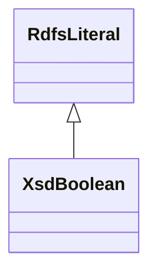

# Class: No class (entity type) name specified (xsd_boolean)


_No class (type) description specified_


URI: [xsd:boolean](http://www.w3.org/2001/XMLSchema#boolean)





## Inheritance
* [RdfsLiteral](../classes/RdfsLiteral.md)
    * **XsdBoolean**


## Slots

| Name | Cardinality and Range | Description | Inheritance | Occurrences |
| ---  | --- | --- | --- | --- |


## LinkML Source

<!-- TODO: investigate https://stackoverflow.com/questions/37606292/how-to-create-tabbed-code-blocks-in-mkdocs-or-sphinx -->

### Direct

<details>

```yaml
name: xsd_boolean
conforms_to: No schema conformance document specified
description: No class (type) description specified
title: No class (entity type) name specified
from_schema: fio-kg
rank: 1000
is_a: rdfs_Literal
class_uri: xsd:boolean

```
</details>

### Induced

<details>

```yaml
name: xsd_boolean
conforms_to: No schema conformance document specified
description: No class (type) description specified
title: No class (entity type) name specified
from_schema: fio-kg
rank: 1000
is_a: rdfs_Literal
class_uri: xsd:boolean

```
</details>