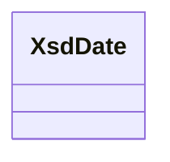

# Class: XsdDate


URI: [xsd:date](http://www.w3.org/2001/XMLSchema#date)





<!-- no inheritance hierarchy -->


## Slots

| Name | Cardinality and Range | Description | Inheritance | Occurrences |
| ---  | --- | --- | --- | --- |


## LinkML Source

<!-- TODO: investigate https://stackoverflow.com/questions/37606292/how-to-create-tabbed-code-blocks-in-mkdocs-or-sphinx -->

### Direct

<details>

```yaml
name: xsd_date
from_schema: okns:fiokg
exact_mappings:
- http://www.w3.org/2001/XMLSchema#date
rank: 1000
class_uri: xsd:date

```
</details>

### Induced

<details>

```yaml
name: xsd_date
from_schema: okns:fiokg
exact_mappings:
- http://www.w3.org/2001/XMLSchema#date
rank: 1000
class_uri: xsd:date

```
</details>