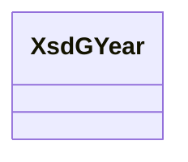

# Class: No class (type) name specified (xsd_gYear)


_No class (type) description specified_


This class occurs 0 times.


URI: [xsd:gYear](http://www.w3.org/2001/XMLSchema#gYear)





<!-- no inheritance hierarchy -->


## Slots

| Name | Cardinality and Range | Description | Inheritance | Occurrences |
| ---  | --- | --- | --- | --- |


## Usages

| used by | used in | type | used |
| ---  | --- | --- | --- |
| [FioIndustry](../classes/FioIndustry.md) | [fio_ofYear](../slots/fio_ofYear.md) | range | [XsdGYear](../classes/XsdGYear.md) |
| [NaicsNAICS-Industry](../classes/NaicsNAICS-Industry.md) | [fio_ofYear](../slots/fio_ofYear.md) | range | [XsdGYear](../classes/XsdGYear.md) |
| [NaicsNAICS-IndustryCode](../classes/NaicsNAICS-IndustryCode.md) | [fio_ofYear](../slots/fio_ofYear.md) | range | [XsdGYear](../classes/XsdGYear.md) |
| [NaicsNAICS-IndustryGroup](../classes/NaicsNAICS-IndustryGroup.md) | [fio_ofYear](../slots/fio_ofYear.md) | range | [XsdGYear](../classes/XsdGYear.md) |
| [NaicsNAICS-IndustrySector](../classes/NaicsNAICS-IndustrySector.md) | [fio_ofYear](../slots/fio_ofYear.md) | range | [XsdGYear](../classes/XsdGYear.md) |
| [NaicsNAICS-IndustrySubsector](../classes/NaicsNAICS-IndustrySubsector.md) | [fio_ofYear](../slots/fio_ofYear.md) | range | [XsdGYear](../classes/XsdGYear.md) |
| [OwlNamedIndividual](../classes/OwlNamedIndividual.md) | [fio_ofYear](../slots/fio_ofYear.md) | range | [XsdGYear](../classes/XsdGYear.md) |
| [OwlNothing](../classes/OwlNothing.md) | [fio_ofYear](../slots/fio_ofYear.md) | range | [XsdGYear](../classes/XsdGYear.md) |
| [OwlThing](../classes/OwlThing.md) | [fio_ofYear](../slots/fio_ofYear.md) | range | [XsdGYear](../classes/XsdGYear.md) |


## LinkML Source

<!-- TODO: investigate https://stackoverflow.com/questions/37606292/how-to-create-tabbed-code-blocks-in-mkdocs-or-sphinx -->

### Direct

<details>

```yaml
name: xsd_gYear
conforms_to: No schema conformance document specified
annotations:
  count:
    tag: count
    value: 0
description: No class (type) description specified
title: No class (type) name specified
from_schema: fio-kg
rank: 1000
class_uri: xsd:gYear

```
</details>

### Induced

<details>

```yaml
name: xsd_gYear
conforms_to: No schema conformance document specified
annotations:
  count:
    tag: count
    value: 0
description: No class (type) description specified
title: No class (type) name specified
from_schema: fio-kg
rank: 1000
class_uri: xsd:gYear

```
</details>