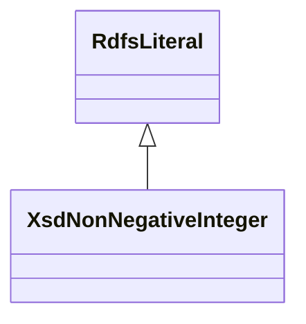

# Class: XsdNonNegativeInteger


URI: [xsd:nonNegativeInteger](http://www.w3.org/2001/XMLSchema#nonNegativeInteger)





## Inheritance
* [RdfsResource](../classes/RdfsResource.md)
    * [RdfsLiteral](../classes/RdfsLiteral.md)
        * **XsdNonNegativeInteger**


## Slots

| Name | Cardinality and Range | Description | Inheritance | Occurrences |
| ---  | --- | --- | --- | --- |


## LinkML Source

<!-- TODO: investigate https://stackoverflow.com/questions/37606292/how-to-create-tabbed-code-blocks-in-mkdocs-or-sphinx -->

### Direct

<details>

```yaml
name: xsd_nonNegativeInteger
from_schema: okns:fio-kg
exact_mappings:
- http://www.w3.org/2001/XMLSchema#nonNegativeInteger
rank: 1000
is_a: rdfs_Literal
class_uri: xsd:nonNegativeInteger

```
</details>

### Induced

<details>

```yaml
name: xsd_nonNegativeInteger
from_schema: okns:fio-kg
exact_mappings:
- http://www.w3.org/2001/XMLSchema#nonNegativeInteger
rank: 1000
is_a: rdfs_Literal
class_uri: xsd:nonNegativeInteger

```
</details>