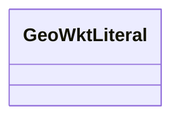

# Class: WKTLiteral (geo_wktLiteral)


URI: [geoconnex/:GeoWktLiteral](geoconnex/:GeoWktLiteral)





<!-- no inheritance hierarchy -->


## Slots

| Name | Cardinality and Range | Description | Inheritance |
| ---  | --- | --- | --- |


## Usages

| used by | used in | type | used |
| ---  | --- | --- | --- |
| [Sf#GeometryCollection](../classes/Sf#GeometryCollection.md) | [geo_asWKT](../slots/geo_asWKT.md) | range | [GeoWktLiteral](../classes/GeoWktLiteral.md) |
| [Sf#LineString](../classes/Sf#LineString.md) | [geo_asWKT](../slots/geo_asWKT.md) | range | [GeoWktLiteral](../classes/GeoWktLiteral.md) |
| [Sf#MultiPolygon](../classes/Sf#MultiPolygon.md) | [geo_asWKT](../slots/geo_asWKT.md) | range | [GeoWktLiteral](../classes/GeoWktLiteral.md) |
| [Sf#MultiPolygon](../classes/Sf#MultiPolygon.md) | [gsp_asWKT](../slots/gsp_asWKT.md) | range | [GeoWktLiteral](../classes/GeoWktLiteral.md) |
| [Sf#Point](../classes/Sf#Point.md) | [geo_asWKT](../slots/geo_asWKT.md) | range | [GeoWktLiteral](../classes/GeoWktLiteral.md) |
| [Sf#Point](../classes/Sf#Point.md) | [gsp_asWKT](../slots/gsp_asWKT.md) | range | [GeoWktLiteral](../classes/GeoWktLiteral.md) |
| [Sf#Point](../classes/Sf#Point.md) | [geosparql_asWKT](../slots/geosparql_asWKT.md) | range | [GeoWktLiteral](../classes/GeoWktLiteral.md) |
| [Sf#Polygon](../classes/Sf#Polygon.md) | [geo_asWKT](../slots/geo_asWKT.md) | range | [GeoWktLiteral](../classes/GeoWktLiteral.md) |
| [Sf#Polygon](../classes/Sf#Polygon.md) | [gsp_asWKT](../slots/gsp_asWKT.md) | range | [GeoWktLiteral](../classes/GeoWktLiteral.md) |


## Identifier and Mapping Information


### Schema Source


* from schema: geoconnex


## Mappings

| Mapping Type | Mapped Value |
| ---  | ---  |
| self | geoconnex/:GeoWktLiteral |
| native | geoconnex/:GeoWktLiteral |


## LinkML Source

<!-- TODO: investigate https://stackoverflow.com/questions/37606292/how-to-create-tabbed-code-blocks-in-mkdocs-or-sphinx -->

### Direct

<details>
```yaml
name: geo_wktLiteral
title: WKTLiteral
from_schema: geoconnex
rank: 1000

```
</details>

### Induced

<details>
```yaml
name: geo_wktLiteral
title: WKTLiteral
from_schema: geoconnex
rank: 1000

```
</details>