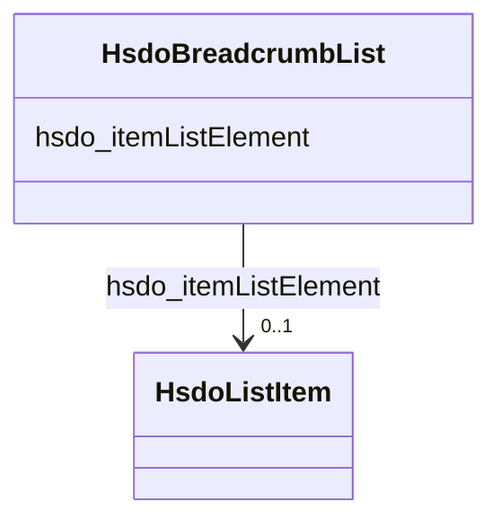

# Class: BreadcrumbList (hsdo_BreadcrumbList)


_A BreadcrumbList is an ItemList consisting of a chain of linked Web pages, typically described using at least their URL and their name, and typically ending with the current page.\n\nThe [[position]] property is used to reconstruct the order of the items in a BreadcrumbList. The convention is that a breadcrumb list has an [[itemListOrder]] of [[ItemListOrderAscending]] (lower values listed first), and that the first items in this list correspond to the "top" or beginning of the breadcrumb trail, e.g. with a site or section homepage. The specific values of 'position' are not assigned meaning for a BreadcrumbList, but they should be integers, e.g. beginning with '1' for the first item in the list._

_      _


URI: [hsdo:BreadcrumbList](http://schema.org/BreadcrumbList)





<!-- no inheritance hierarchy -->


## Slots

| Name | Cardinality and Range | Description | Inheritance |
| ---  | --- | --- | --- |
| [hsdo_itemListElement](../slots/hsdo_itemListElement.md) | 0..1 <br/> [HsdoListItem](../classes/HsdoListItem.md) | No slot (predicate) description specified <br/> 5 occurrences with subject type hsdo_BreadcrumbList and object type hsdo_ListItem. | direct |


## Usages

| used by | used in | type | used |
| ---  | --- | --- | --- |
| [HsdoWebPage](../classes/HsdoWebPage.md) | [hsdo_breadcrumb](../slots/hsdo_breadcrumb.md) | range | [HsdoBreadcrumbList](../classes/HsdoBreadcrumbList.md) |


## Identifier and Mapping Information


### Schema Source


* from schema: geoconnex


## Mappings

| Mapping Type | Mapped Value |
| ---  | ---  |
| self | hsdo:BreadcrumbList |
| native | geoconnex/:HsdoBreadcrumbList |


## LinkML Source

<!-- TODO: investigate https://stackoverflow.com/questions/37606292/how-to-create-tabbed-code-blocks-in-mkdocs-or-sphinx -->

### Direct

<details>
```yaml
name: hsdo_BreadcrumbList
conforms_to: No schema conformance document specified
description: "A BreadcrumbList is an ItemList consisting of a chain of linked Web\
  \ pages, typically described using at least their URL and their name, and typically\
  \ ending with the current page.\\n\\nThe [[position]] property is used to reconstruct\
  \ the order of the items in a BreadcrumbList. The convention is that a breadcrumb\
  \ list has an [[itemListOrder]] of [[ItemListOrderAscending]] (lower values listed\
  \ first), and that the first items in this list correspond to the \"top\" or beginning\
  \ of the breadcrumb trail, e.g. with a site or section homepage. The specific values\
  \ of 'position' are not assigned meaning for a BreadcrumbList, but they should be\
  \ integers, e.g. beginning with '1' for the first item in the list.\n      "
title: BreadcrumbList
notes:
- Class with 3 occurrences.
from_schema: geoconnex
rank: 1000
slots:
- hsdo_itemListElement
class_uri: hsdo:BreadcrumbList

```
</details>

### Induced

<details>
```yaml
name: hsdo_BreadcrumbList
conforms_to: No schema conformance document specified
description: "A BreadcrumbList is an ItemList consisting of a chain of linked Web\
  \ pages, typically described using at least their URL and their name, and typically\
  \ ending with the current page.\\n\\nThe [[position]] property is used to reconstruct\
  \ the order of the items in a BreadcrumbList. The convention is that a breadcrumb\
  \ list has an [[itemListOrder]] of [[ItemListOrderAscending]] (lower values listed\
  \ first), and that the first items in this list correspond to the \"top\" or beginning\
  \ of the breadcrumb trail, e.g. with a site or section homepage. The specific values\
  \ of 'position' are not assigned meaning for a BreadcrumbList, but they should be\
  \ integers, e.g. beginning with '1' for the first item in the list.\n      "
title: BreadcrumbList
notes:
- Class with 3 occurrences.
from_schema: geoconnex
rank: 1000
attributes:
  hsdo_itemListElement:
    name: hsdo_itemListElement
    description: No slot (predicate) description specified
    comments:
    - 5 occurrences with subject type hsdo_BreadcrumbList and object type hsdo_ListItem.
    examples:
    - description: hsdo_BreadcrumbList → hsdo_ListItem
      object:
        example_object: https://internetofwater.org/who-we-are/#listItem
        example_predicate: hsdo:itemListElement
        example_subject: https://internetofwater.org/who-we-are/#breadcrumblist
    from_schema: geoconnex
    rank: 1000
    slot_uri: hsdo:itemListElement
    alias: hsdo_itemListElement
    owner: hsdo_BreadcrumbList
    domain_of:
    - hsdo_BreadcrumbList
    range: hsdo_ListItem
class_uri: hsdo:BreadcrumbList

```
</details>