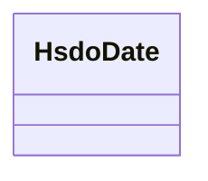

# Class: Date (hsdo_Date)


URI: [geoconnex/:HsdoDate](geoconnex/:HsdoDate)





<!-- no inheritance hierarchy -->


## Slots

| Name | Cardinality and Range | Description | Inheritance |
| ---  | --- | --- | --- |


## Usages

| used by | used in | type | used |
| ---  | --- | --- | --- |
| [HsdoNewsArticle](../classes/HsdoNewsArticle.md) | [hsdo_datePublished](../slots/hsdo_datePublished.md) | range | [HsdoDate](../classes/HsdoDate.md) |
| [HsdoNewsArticle](../classes/HsdoNewsArticle.md) | [hsdo_dateModified](../slots/hsdo_dateModified.md) | range | [HsdoDate](../classes/HsdoDate.md) |
| [HsdoWebPage](../classes/HsdoWebPage.md) | [hsdo_datePublished](../slots/hsdo_datePublished.md) | range | [HsdoDate](../classes/HsdoDate.md) |
| [HsdoWebPage](../classes/HsdoWebPage.md) | [hsdo_dateModified](../slots/hsdo_dateModified.md) | range | [HsdoDate](../classes/HsdoDate.md) |


## Identifier and Mapping Information


### Schema Source


* from schema: geoconnex


## Mappings

| Mapping Type | Mapped Value |
| ---  | ---  |
| self | geoconnex/:HsdoDate |
| native | geoconnex/:HsdoDate |


## LinkML Source

<!-- TODO: investigate https://stackoverflow.com/questions/37606292/how-to-create-tabbed-code-blocks-in-mkdocs-or-sphinx -->

### Direct

<details>
```yaml
name: hsdo_Date
title: Date
from_schema: geoconnex
rank: 1000

```
</details>

### Induced

<details>
```yaml
name: hsdo_Date
title: Date
from_schema: geoconnex
rank: 1000

```
</details>