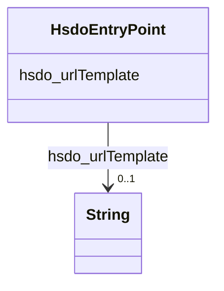

# Class: EntryPoint (hsdo_EntryPoint)


_An entry point, within some Web-based protocol._


URI: [hsdo:EntryPoint](http://schema.org/EntryPoint)





<!-- no inheritance hierarchy -->


## Slots

| Name | Cardinality and Range | Description | Inheritance |
| ---  | --- | --- | --- |
| [hsdo_urlTemplate](../slots/hsdo_urlTemplate.md) | 0..1 <br/> [xsd:string](xsd:string) | No slot (predicate) description specified <br/> 1 occurrences with subject type hsdo_EntryPoint and object type string. | direct |


## Usages

| used by | used in | type | used |
| ---  | --- | --- | --- |
| [HsdoSearchAction](../classes/HsdoSearchAction.md) | [hsdo_target](../slots/hsdo_target.md) | range | [HsdoEntryPoint](../classes/HsdoEntryPoint.md) |


## Identifier and Mapping Information


### Schema Source


* from schema: geoconnex


## Mappings

| Mapping Type | Mapped Value |
| ---  | ---  |
| self | hsdo:EntryPoint |
| native | geoconnex/:HsdoEntryPoint |


## LinkML Source

<!-- TODO: investigate https://stackoverflow.com/questions/37606292/how-to-create-tabbed-code-blocks-in-mkdocs-or-sphinx -->

### Direct

<details>
```yaml
name: hsdo_EntryPoint
conforms_to: No schema conformance document specified
description: An entry point, within some Web-based protocol.
title: EntryPoint
notes:
- Class with 1 occurrences.
from_schema: geoconnex
rank: 1000
slots:
- hsdo_urlTemplate
class_uri: hsdo:EntryPoint

```
</details>

### Induced

<details>
```yaml
name: hsdo_EntryPoint
conforms_to: No schema conformance document specified
description: An entry point, within some Web-based protocol.
title: EntryPoint
notes:
- Class with 1 occurrences.
from_schema: geoconnex
rank: 1000
attributes:
  hsdo_urlTemplate:
    name: hsdo_urlTemplate
    description: No slot (predicate) description specified
    comments:
    - 1 occurrences with subject type hsdo_EntryPoint and object type string.
    examples:
    - description: hsdo_EntryPoint → string
      object:
        example_object: https://internetofwater.org/?s={search_term_string}
        example_predicate: hsdo:urlTemplate
        example_subject: https://gleaner.io/xid/genid/cktr9ekip8ta6ev27pk0
    from_schema: geoconnex
    rank: 1000
    slot_uri: hsdo:urlTemplate
    alias: hsdo_urlTemplate
    owner: hsdo_EntryPoint
    domain_of:
    - hsdo_EntryPoint
    range: string
class_uri: hsdo:EntryPoint

```
</details>