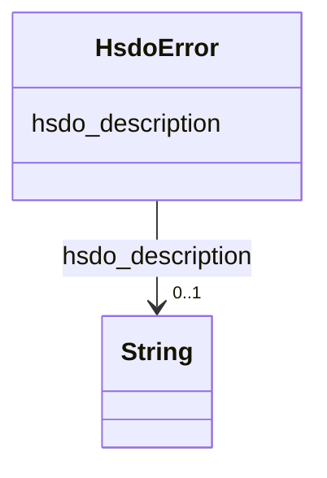

# Class: error (hsdo_error)


_For failed actions, more information on the cause of the failure._


URI: [hsdo:error](http://schema.org/error)





<!-- no inheritance hierarchy -->


## Slots

| Name | Cardinality and Range | Description | Inheritance |
| ---  | --- | --- | --- |
| [hsdo_description](../slots/hsdo_description.md) | 0..1 <br/> [xsd:string](xsd:string) | No slot (predicate) description specified <br/> 1 occurrences with subject type http___geosciences.ca_def_groundwater#GW_HydrogeoUnit and object type string.<br/>1 occurrences with subject type https___www.opengis.net_def_appschema_hy_features_hyf_HY_Catchment and object type string.<br/>1 occurrences with subject type https___www.opengis.net_def_appschema_hy_features_hyf_HY_HydrometricNetwork and object type string.<br/>48677 occurrences with subject type hsdo_WebPage and object type string.<br/>1 occurrences with subject type hsdo_WebSite and object type string.<br/>17 occurrences with subject type hsdo_error and object type string.<br/>2 occurrences with subject type hsdo_NewsArticle and object type string. | direct |


## Identifier and Mapping Information


### Schema Source


* from schema: geoconnex


## Mappings

| Mapping Type | Mapped Value |
| ---  | ---  |
| self | hsdo:error |
| native | geoconnex/:HsdoError |


## LinkML Source

<!-- TODO: investigate https://stackoverflow.com/questions/37606292/how-to-create-tabbed-code-blocks-in-mkdocs-or-sphinx -->

### Direct

<details>
```yaml
name: hsdo_error
conforms_to: No schema conformance document specified
description: For failed actions, more information on the cause of the failure.
title: error
notes:
- Class with 17 occurrences.
from_schema: geoconnex
rank: 1000
slots:
- hsdo_description
class_uri: hsdo:error

```
</details>

### Induced

<details>
```yaml
name: hsdo_error
conforms_to: No schema conformance document specified
description: For failed actions, more information on the cause of the failure.
title: error
notes:
- Class with 17 occurrences.
from_schema: geoconnex
rank: 1000
attributes:
  hsdo_description:
    name: hsdo_description
    description: No slot (predicate) description specified
    comments:
    - 1 occurrences with subject type http___geosciences.ca_def_groundwater#GW_HydrogeoUnit
      and object type string.
    - 1 occurrences with subject type https___www.opengis.net_def_appschema_hy_features_hyf_HY_Catchment
      and object type string.
    - 1 occurrences with subject type https___www.opengis.net_def_appschema_hy_features_hyf_HY_HydrometricNetwork
      and object type string.
    - 48677 occurrences with subject type hsdo_WebPage and object type string.
    - 1 occurrences with subject type hsdo_WebSite and object type string.
    - 17 occurrences with subject type hsdo_error and object type string.
    - 2 occurrences with subject type hsdo_NewsArticle and object type string.
    examples:
    - description: http___geosciences.ca_def_groundwater#GW_HydrogeoUnit → string
      object:
        example_object: '

          In the context of the southern area of the St. Lawrence Platform of (south
          Lowlands), the clay unit is generally not continuous or thick. The bedrock
          is rather covered by a till unit of at least 10 m thick which may allow
          significant bedrock aquifer recharge rates. This limited sedimentary cover
          suggests that there would be links between the bedrock aquifer and streams,
          particularly along some sections of the Richelieu River, which constitute
          discharge areas. The flow is oriented east-west, from the recharge areas
          to Richelieu River or others discharge areas. The surficial permeable sediments
          with significant thickness have small spatial extension, thus that the aquifer
          potential is mainly based on fractured bedrock aquifer. In the unit, there
          is a significant use of groundwater as water supply. The predominant semi-confined
          conditions involve a moderate vulnerability of the bedrock aquifer. Groundwater
          exceeds frequently some aesthetic criteria as Fe, Mn, S, Na, and F in the
          central area of the hydrogeological unit.

          '
        example_predicate: hsdo:description
        example_subject: https://geoconnex.ca/id/hydrogeounits/Richelieu1
    - description: https___www.opengis.net_def_appschema_hy_features_hyf_HY_Catchment
        → string
      object:
        example_object: USGS Watershed Boundary Dataset Twelve Digit Hydrologic Unit
          Code Watershed
        example_predicate: hsdo:description
        example_subject: https://geoconnex.us/SELFIE/usgs/huc/huc12obs/070900020601
    - description: https___www.opengis.net_def_appschema_hy_features_hyf_HY_HydrometricNetwork
        → string
      object:
        example_object: Monitoring locations in the Waunakee Marsh-Sixmile Creek watershed.
        example_predicate: hsdo:description
        example_subject: https://geoconnex.us/SELFIE/usgs/hydrometricnetwork/huc12obs/070900020601
    - description: hsdo_WebPage → string
      object:
        example_object: The Internet of Water Coalition works with partners to build
          modern data infrastructure & create a community of people using water data
          to make better decisions
        example_predicate: hsdo:description
        example_subject: https://internetofwater.org/
    - description: hsdo_WebSite → string
      object:
        example_object: Better Water Data for Better Water Management
        example_predicate: hsdo:description
        example_subject: https://internetofwater.org/#website
    - description: hsdo_error → string
      object:
        example_object: 'Something bad happened. Contact us with Reference Number:
          115163272'
        example_predicate: hsdo:description
        example_subject: https://gleaner.io/xid/genid/cksk7tsip8t6t2qvs9a0
    - description: hsdo_NewsArticle → string
      object:
        example_object: 'Begin with a point of interest. For example:lon: -117.12lat:
          46.43'
        example_predicate: hsdo:description
        example_subject: https://gleaner.io/xid/genid/cktr9ekip8ta6ev27pkg
    from_schema: geoconnex
    rank: 1000
    slot_uri: hsdo:description
    alias: hsdo_description
    owner: hsdo_error
    domain_of:
    - hsdo_NewsArticle
    - hsdo_WebPage
    - hsdo_WebSite
    - hsdo_error
    - http___geosciences.ca_def_groundwater#GW_HydrogeoUnit
    - https___www.opengis.net_def_appschema_hy_features_hyf_HY_Catchment
    - https___www.opengis.net_def_appschema_hy_features_hyf_HY_HydrometricNetwork
    range: string
class_uri: hsdo:error

```
</details>