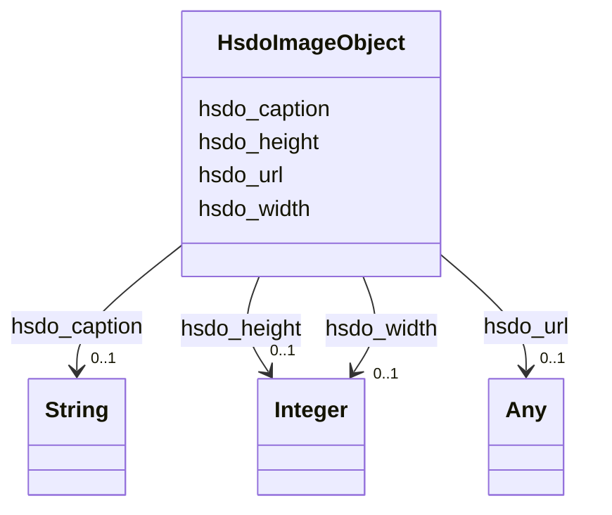

# Class: ImageObject (hsdo_ImageObject)


_An image file._


URI: [hsdo:ImageObject](http://schema.org/ImageObject)





<!-- no inheritance hierarchy -->


## Slots

| Name | Cardinality and Range | Description | Inheritance |
| ---  | --- | --- | --- |
| [hsdo_width](../slots/hsdo_width.md) | 0..1 <br/> [xsd:integer](xsd:integer) | No slot (predicate) description specified <br/> 3 occurrences with subject type hsdo_ImageObject and object type integer. | direct |
| [hsdo_url](../slots/hsdo_url.md) | 0..1 <br/> [xsd:anyURI](xsd:anyURI)&nbsp;or&nbsp;<br />[HsdoWebPage](../classes/HsdoWebPage.md) | No slot (predicate) description specified <br/> 5 occurrences with subject type hsdo_ImageObject and object type uri.<br/>4 occurrences with subject type hsdo_WebPage and object type hsdo_WebPage.<br/>1 occurrences with subject type hsdo_Organization and object type hsdo_WebPage.<br/>1 occurrences with subject type hsdo_WebSite and object type hsdo_WebPage.<br/>1 occurrences with subject type hsdo_WebPage and object type uri. | direct |
| [hsdo_height](../slots/hsdo_height.md) | 0..1 <br/> [xsd:integer](xsd:integer) | No slot (predicate) description specified <br/> 3 occurrences with subject type hsdo_ImageObject and object type integer. | direct |
| [hsdo_caption](../slots/hsdo_caption.md) | 0..1 <br/> [xsd:string](xsd:string) | No slot (predicate) description specified <br/> 3 occurrences with subject type hsdo_ImageObject and object type string. | direct |


## Usages

| used by | used in | type | used |
| ---  | --- | --- | --- |
| [HsdoNewsArticle](../classes/HsdoNewsArticle.md) | [hsdo_image](../slots/hsdo_image.md) | any_of[range] | [HsdoImageObject](../classes/HsdoImageObject.md) |
| [HsdoOrganization](../classes/HsdoOrganization.md) | [hsdo_image](../slots/hsdo_image.md) | any_of[range] | [HsdoImageObject](../classes/HsdoImageObject.md) |
| [HsdoOrganization](../classes/HsdoOrganization.md) | [hsdo_logo](../slots/hsdo_logo.md) | range | [HsdoImageObject](../classes/HsdoImageObject.md) |
| [HttpGeosciences.caDefGroundwater#GWHydrogeoUnit](../classes/HttpGeosciences.caDefGroundwater#GWHydrogeoUnit.md) | [hsdo_image](../slots/hsdo_image.md) | any_of[range] | [HsdoImageObject](../classes/HsdoImageObject.md) |


## Identifier and Mapping Information


### Schema Source


* from schema: geoconnex


## Mappings

| Mapping Type | Mapped Value |
| ---  | ---  |
| self | hsdo:ImageObject |
| native | geoconnex/:HsdoImageObject |


## LinkML Source

<!-- TODO: investigate https://stackoverflow.com/questions/37606292/how-to-create-tabbed-code-blocks-in-mkdocs-or-sphinx -->

### Direct

<details>
```yaml
name: hsdo_ImageObject
conforms_to: No schema conformance document specified
description: An image file.
title: ImageObject
notes:
- Class with 5 occurrences.
from_schema: geoconnex
rank: 1000
slots:
- hsdo_width
- hsdo_url
- hsdo_height
- hsdo_caption
class_uri: hsdo:ImageObject

```
</details>

### Induced

<details>
```yaml
name: hsdo_ImageObject
conforms_to: No schema conformance document specified
description: An image file.
title: ImageObject
notes:
- Class with 5 occurrences.
from_schema: geoconnex
rank: 1000
attributes:
  hsdo_width:
    name: hsdo_width
    description: No slot (predicate) description specified
    comments:
    - 3 occurrences with subject type hsdo_ImageObject and object type integer.
    examples:
    - description: hsdo_ImageObject → integer
      object:
        example_object: '380'
        example_predicate: hsdo:width
        example_subject: https://internetofwater.org/#organizationLogo
    from_schema: geoconnex
    rank: 1000
    slot_uri: hsdo:width
    alias: hsdo_width
    owner: hsdo_ImageObject
    domain_of:
    - hsdo_ImageObject
    range: integer
  hsdo_url:
    name: hsdo_url
    description: No slot (predicate) description specified
    comments:
    - 5 occurrences with subject type hsdo_ImageObject and object type uri.
    - 4 occurrences with subject type hsdo_WebPage and object type hsdo_WebPage.
    - 1 occurrences with subject type hsdo_Organization and object type hsdo_WebPage.
    - 1 occurrences with subject type hsdo_WebSite and object type hsdo_WebPage.
    - 1 occurrences with subject type hsdo_WebPage and object type uri.
    examples:
    - description: hsdo_ImageObject → uri
      object:
        example_object: https://storymaps.arcgis.com/static/images/logo.png
        example_predicate: hsdo:url
        example_subject: https://gleaner.io/xid/genid/cktr9ekip8ta6ev27pm0
    - description: hsdo_WebPage → hsdo_WebPage
      object:
        example_object: https://internetofwater.org/internet-of-water-principles/
        example_predicate: hsdo:url
        example_subject: https://internetofwater.org/internet-of-water-principles/#webpage
    - description: hsdo_Organization → hsdo_WebPage
      object:
        example_object: https://internetofwater.org/
        example_predicate: hsdo:url
        example_subject: https://internetofwater.org/#organization
    - description: hsdo_WebSite → hsdo_WebPage
      object:
        example_object: https://internetofwater.org/
        example_predicate: hsdo:url
        example_subject: https://internetofwater.org/#website
    - description: hsdo_WebPage → uri
      object:
        example_object: https://internetofwater.org/who-we-are/
        example_predicate: hsdo:url
        example_subject: https://internetofwater.org/who-we-are/#webpage
    from_schema: geoconnex
    rank: 1000
    slot_uri: hsdo:url
    alias: hsdo_url
    owner: hsdo_ImageObject
    domain_of:
    - hsdo_ImageObject
    - hsdo_Organization
    - hsdo_WebPage
    - hsdo_WebSite
    range: Any
    any_of:
    - range: uri
    - range: hsdo_WebPage
  hsdo_height:
    name: hsdo_height
    description: No slot (predicate) description specified
    comments:
    - 3 occurrences with subject type hsdo_ImageObject and object type integer.
    examples:
    - description: hsdo_ImageObject → integer
      object:
        example_object: '144'
        example_predicate: hsdo:height
        example_subject: https://internetofwater.org/#organizationLogo
    from_schema: geoconnex
    rank: 1000
    slot_uri: hsdo:height
    alias: hsdo_height
    owner: hsdo_ImageObject
    domain_of:
    - hsdo_ImageObject
    range: integer
  hsdo_caption:
    name: hsdo_caption
    description: No slot (predicate) description specified
    comments:
    - 3 occurrences with subject type hsdo_ImageObject and object type string.
    examples:
    - description: hsdo_ImageObject → string
      object:
        example_object: Internet of Water Logo
        example_predicate: hsdo:caption
        example_subject: https://internetofwater.org/#organizationLogo
    from_schema: geoconnex
    rank: 1000
    slot_uri: hsdo:caption
    alias: hsdo_caption
    owner: hsdo_ImageObject
    domain_of:
    - hsdo_ImageObject
    range: string
class_uri: hsdo:ImageObject

```
</details>