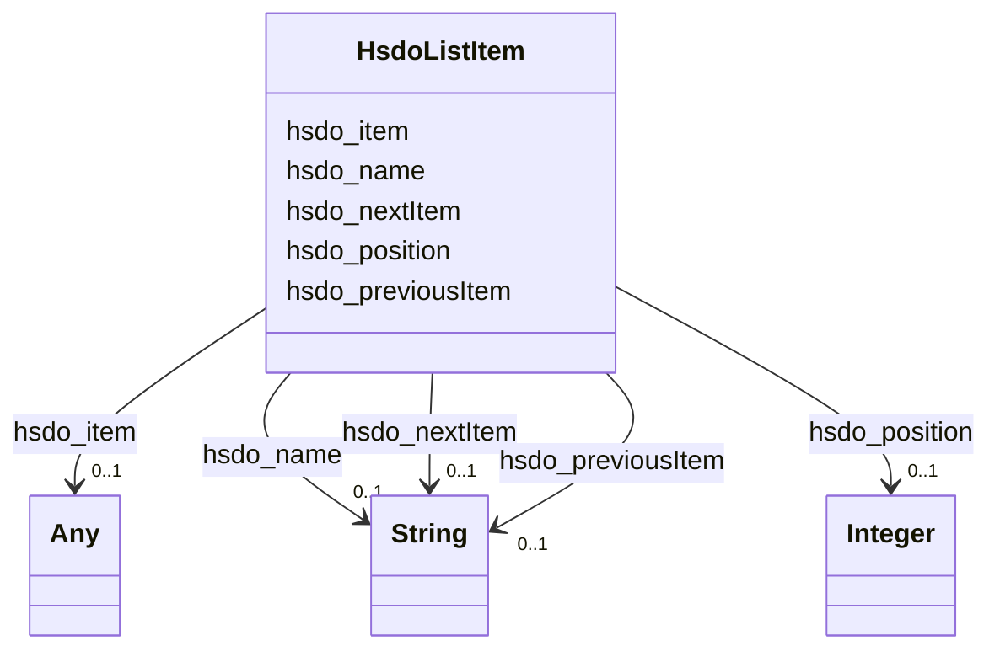

# Class: ListItem (hsdo_ListItem)


_An list item, e.g. a step in a checklist or how-to description._


URI: [hsdo:ListItem](http://schema.org/ListItem)





<!-- no inheritance hierarchy -->


## Slots

| Name | Cardinality and Range | Description | Inheritance |
| ---  | --- | --- | --- |
| [hsdo_nextItem](../slots/hsdo_nextItem.md) | 0..1 <br/> [xsd:string](xsd:string) | No slot (predicate) description specified <br/> 2 occurrences with subject type hsdo_ListItem and object type string. | direct |
| [hsdo_name](../slots/hsdo_name.md) | 0..1 <br/> [xsd:string](xsd:string) | No slot (predicate) description specified <br/> 1 occurrences with subject type rdfs_Resource and object type string.<br/>1 occurrences with subject type http___geosciences.ca_def_groundwater#GW_HydrogeoUnit and object type string.<br/>1 occurrences with subject type https___www.opengis.net_def_appschema_hy_features_hyf_HY_Catchment and object type string.<br/>1 occurrences with subject type https___www.opengis.net_def_appschema_hy_features_hyf_HY_HydrometricNetwork and object type string.<br/>2 occurrences with subject type hsdo_Person and object type string.<br/>3 occurrences with subject type hsdo_Organization and object type string.<br/>48677 occurrences with subject type hsdo_WebPage and object type string.<br/>3 occurrences with subject type hsdo_ListItem and object type string.<br/>1 occurrences with subject type hsdo_WebSite and object type string. | direct |
| [hsdo_item](../slots/hsdo_item.md) | 0..1 <br/> [xsd:string](xsd:string)&nbsp;or&nbsp;<br />[HsdoWebPage](../classes/HsdoWebPage.md) | No slot (predicate) description specified <br/> 2 occurrences with subject type hsdo_ListItem and object type hsdo_WebPage.<br/>1 occurrences with subject type hsdo_ListItem and object type string. | direct |
| [hsdo_position](../slots/hsdo_position.md) | 0..1 <br/> [xsd:integer](xsd:integer) | No slot (predicate) description specified <br/> 3 occurrences with subject type hsdo_ListItem and object type integer. | direct |
| [hsdo_previousItem](../slots/hsdo_previousItem.md) | 0..1 <br/> [xsd:string](xsd:string) | No slot (predicate) description specified <br/> 2 occurrences with subject type hsdo_ListItem and object type string. | direct |


## Usages

| used by | used in | type | used |
| ---  | --- | --- | --- |
| [HsdoBreadcrumbList](../classes/HsdoBreadcrumbList.md) | [hsdo_itemListElement](../slots/hsdo_itemListElement.md) | range | [HsdoListItem](../classes/HsdoListItem.md) |


## Identifier and Mapping Information


### Schema Source


* from schema: geoconnex


## Mappings

| Mapping Type | Mapped Value |
| ---  | ---  |
| self | hsdo:ListItem |
| native | geoconnex/:HsdoListItem |


## LinkML Source

<!-- TODO: investigate https://stackoverflow.com/questions/37606292/how-to-create-tabbed-code-blocks-in-mkdocs-or-sphinx -->

### Direct

<details>
```yaml
name: hsdo_ListItem
conforms_to: No schema conformance document specified
description: An list item, e.g. a step in a checklist or how-to description.
title: ListItem
notes:
- Class with 3 occurrences.
from_schema: geoconnex
rank: 1000
slots:
- hsdo_nextItem
- hsdo_name
- hsdo_item
- hsdo_position
- hsdo_previousItem
class_uri: hsdo:ListItem

```
</details>

### Induced

<details>
```yaml
name: hsdo_ListItem
conforms_to: No schema conformance document specified
description: An list item, e.g. a step in a checklist or how-to description.
title: ListItem
notes:
- Class with 3 occurrences.
from_schema: geoconnex
rank: 1000
attributes:
  hsdo_nextItem:
    name: hsdo_nextItem
    description: No slot (predicate) description specified
    comments:
    - 2 occurrences with subject type hsdo_ListItem and object type string.
    examples:
    - description: hsdo_ListItem → string
      object:
        example_object: https://internetofwater.org/internet-of-water-principles/#listItem
        example_predicate: hsdo:nextItem
        example_subject: https://internetofwater.org/#listItem
    from_schema: geoconnex
    rank: 1000
    slot_uri: hsdo:nextItem
    alias: hsdo_nextItem
    owner: hsdo_ListItem
    domain_of:
    - hsdo_ListItem
    range: string
  hsdo_name:
    name: hsdo_name
    description: No slot (predicate) description specified
    comments:
    - 1 occurrences with subject type rdfs_Resource and object type string.
    - 1 occurrences with subject type http___geosciences.ca_def_groundwater#GW_HydrogeoUnit
      and object type string.
    - 1 occurrences with subject type https___www.opengis.net_def_appschema_hy_features_hyf_HY_Catchment
      and object type string.
    - 1 occurrences with subject type https___www.opengis.net_def_appschema_hy_features_hyf_HY_HydrometricNetwork
      and object type string.
    - 2 occurrences with subject type hsdo_Person and object type string.
    - 3 occurrences with subject type hsdo_Organization and object type string.
    - 48677 occurrences with subject type hsdo_WebPage and object type string.
    - 3 occurrences with subject type hsdo_ListItem and object type string.
    - 1 occurrences with subject type hsdo_WebSite and object type string.
    examples:
    - description: rdfs_Resource → string
      object:
        example_object: 'Watershed : Little River - Riviere Richelieu'
        example_predicate: hsdo:name
        example_subject: https://geoconnex.ca/id/catchment/02OJ*CA
    - description: http___geosciences.ca_def_groundwater#GW_HydrogeoUnit → string
      object:
        example_object: 'Hydrogeologic unit : Southern St Lawrence Platform'
        example_predicate: hsdo:name
        example_subject: https://geoconnex.ca/id/hydrogeounits/Richelieu1
    - description: https___www.opengis.net_def_appschema_hy_features_hyf_HY_Catchment
        → string
      object:
        example_object: Waunakee Marsh-Sixmile Creek
        example_predicate: hsdo:name
        example_subject: https://geoconnex.us/SELFIE/usgs/huc/huc12obs/070900020601
    - description: https___www.opengis.net_def_appschema_hy_features_hyf_HY_HydrometricNetwork
        → string
      object:
        example_object: Waunakee Marsh-Sixmile Creek Monitoring Network
        example_predicate: hsdo:name
        example_subject: https://geoconnex.us/SELFIE/usgs/hydrometricnetwork/huc12obs/070900020601
    - description: hsdo_Person → string
      object:
        example_object: Kyle Onda
        example_predicate: hsdo:name
        example_subject: https://gleaner.io/xid/genid/cktr9ekip8ta6ev27pl0
    - description: hsdo_Organization → string
      object:
        example_object: Esri
        example_predicate: hsdo:name
        example_subject: https://gleaner.io/xid/genid/cktr9ekip8ta6ev27plg
    - description: hsdo_WebPage → string
      object:
        example_object: Home
        example_predicate: hsdo:name
        example_subject: https://internetofwater.org/
    - description: hsdo_ListItem → string
      object:
        example_object: Home
        example_predicate: hsdo:name
        example_subject: https://internetofwater.org/#listItem
    - description: hsdo_WebSite → string
      object:
        example_object: Internet of Water
        example_predicate: hsdo:name
        example_subject: https://internetofwater.org/#website
    from_schema: geoconnex
    rank: 1000
    slot_uri: hsdo:name
    alias: hsdo_name
    owner: hsdo_ListItem
    domain_of:
    - hsdo_ListItem
    - hsdo_Organization
    - hsdo_Person
    - hsdo_WebPage
    - hsdo_WebSite
    - http___geosciences.ca_def_groundwater#GW_HydrogeoUnit
    - https___www.opengis.net_def_appschema_hy_features_hyf_HY_Catchment
    - https___www.opengis.net_def_appschema_hy_features_hyf_HY_HydrometricNetwork
    - rdfs_Resource
    range: string
  hsdo_item:
    name: hsdo_item
    description: No slot (predicate) description specified
    comments:
    - 2 occurrences with subject type hsdo_ListItem and object type hsdo_WebPage.
    - 1 occurrences with subject type hsdo_ListItem and object type string.
    examples:
    - description: hsdo_ListItem → hsdo_WebPage
      object:
        example_object: https://internetofwater.org/internet-of-water-principles/
        example_predicate: hsdo:item
        example_subject: https://internetofwater.org/internet-of-water-principles/#listItem
    - description: hsdo_ListItem → string
      object:
        example_object: https://internetofwater.org/
        example_predicate: hsdo:item
        example_subject: https://internetofwater.org/#listItem
    from_schema: geoconnex
    rank: 1000
    slot_uri: hsdo:item
    alias: hsdo_item
    owner: hsdo_ListItem
    domain_of:
    - hsdo_ListItem
    range: Any
    any_of:
    - range: string
    - range: hsdo_WebPage
  hsdo_position:
    name: hsdo_position
    description: No slot (predicate) description specified
    comments:
    - 3 occurrences with subject type hsdo_ListItem and object type integer.
    examples:
    - description: hsdo_ListItem → integer
      object:
        example_object: '1'
        example_predicate: hsdo:position
        example_subject: https://internetofwater.org/#listItem
    from_schema: geoconnex
    rank: 1000
    slot_uri: hsdo:position
    alias: hsdo_position
    owner: hsdo_ListItem
    domain_of:
    - hsdo_ListItem
    range: integer
  hsdo_previousItem:
    name: hsdo_previousItem
    description: No slot (predicate) description specified
    comments:
    - 2 occurrences with subject type hsdo_ListItem and object type string.
    examples:
    - description: hsdo_ListItem → string
      object:
        example_object: https://internetofwater.org/#listItem
        example_predicate: hsdo:previousItem
        example_subject: https://internetofwater.org/internet-of-water-principles/#listItem
    from_schema: geoconnex
    rank: 1000
    slot_uri: hsdo:previousItem
    alias: hsdo_previousItem
    owner: hsdo_ListItem
    domain_of:
    - hsdo_ListItem
    range: string
class_uri: hsdo:ListItem

```
</details>