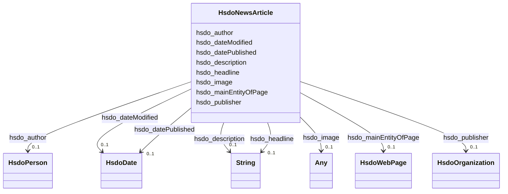

# Class: NewsArticle (hsdo_NewsArticle)


_A NewsArticle is an article whose content reports news, or provides background context and supporting materials for understanding the news._

__

_A more detailed overview of [schema.org News markup](/docs/news.html) is also available._

__


URI: [hsdo:NewsArticle](http://schema.org/NewsArticle)





<!-- no inheritance hierarchy -->


## Slots

| Name | Cardinality and Range | Description | Inheritance |
| ---  | --- | --- | --- |
| [hsdo_author](../slots/hsdo_author.md) | 0..1 <br/> [HsdoPerson](../classes/HsdoPerson.md) | No slot (predicate) description specified <br/> 2 occurrences with subject type hsdo_NewsArticle and object type hsdo_Person. | direct |
| [hsdo_datePublished](../slots/hsdo_datePublished.md) | 0..1 <br/> [HsdoDate](../classes/HsdoDate.md) | No slot (predicate) description specified <br/> 2 occurrences with subject type hsdo_NewsArticle and object type hsdo_Date.<br/>3 occurrences with subject type hsdo_WebPage and object type hsdo_Date. | direct |
| [hsdo_mainEntityOfPage](../slots/hsdo_mainEntityOfPage.md) | 0..1 <br/> [HsdoWebPage](../classes/HsdoWebPage.md) | No slot (predicate) description specified <br/> 2 occurrences with subject type hsdo_NewsArticle and object type hsdo_WebPage. | direct |
| [hsdo_image](../slots/hsdo_image.md) | 0..1 <br/> [xsd:anyURI](xsd:anyURI)&nbsp;or&nbsp;<br />[xsd:string](xsd:string)&nbsp;or&nbsp;<br />[HsdoImageObject](../classes/HsdoImageObject.md) | No slot (predicate) description specified <br/> 1 occurrences with subject type http___geosciences.ca_def_groundwater#GW_HydrogeoUnit and object type string.<br/>1 occurrences with subject type hsdo_Organization and object type hsdo_ImageObject.<br/>2 occurrences with subject type hsdo_NewsArticle and object type uri. | direct |
| [hsdo_publisher](../slots/hsdo_publisher.md) | 0..1 <br/> [HsdoOrganization](../classes/HsdoOrganization.md) | No slot (predicate) description specified <br/> 1 occurrences with subject type hsdo_WebSite and object type hsdo_Organization.<br/>2 occurrences with subject type hsdo_NewsArticle and object type hsdo_Organization. | direct |
| [hsdo_description](../slots/hsdo_description.md) | 0..1 <br/> [xsd:string](xsd:string) | No slot (predicate) description specified <br/> 1 occurrences with subject type http___geosciences.ca_def_groundwater#GW_HydrogeoUnit and object type string.<br/>1 occurrences with subject type https___www.opengis.net_def_appschema_hy_features_hyf_HY_Catchment and object type string.<br/>1 occurrences with subject type https___www.opengis.net_def_appschema_hy_features_hyf_HY_HydrometricNetwork and object type string.<br/>48677 occurrences with subject type hsdo_WebPage and object type string.<br/>1 occurrences with subject type hsdo_WebSite and object type string.<br/>17 occurrences with subject type hsdo_error and object type string.<br/>2 occurrences with subject type hsdo_NewsArticle and object type string. | direct |
| [hsdo_headline](../slots/hsdo_headline.md) | 0..1 <br/> [xsd:string](xsd:string) | No slot (predicate) description specified <br/> 2 occurrences with subject type hsdo_NewsArticle and object type string. | direct |
| [hsdo_dateModified](../slots/hsdo_dateModified.md) | 0..1 <br/> [HsdoDate](../classes/HsdoDate.md) | No slot (predicate) description specified <br/> 2 occurrences with subject type hsdo_NewsArticle and object type hsdo_Date.<br/>3 occurrences with subject type hsdo_WebPage and object type hsdo_Date. | direct |


## Identifier and Mapping Information


### Schema Source


* from schema: geoconnex


## Mappings

| Mapping Type | Mapped Value |
| ---  | ---  |
| self | hsdo:NewsArticle |
| native | geoconnex/:HsdoNewsArticle |


## LinkML Source

<!-- TODO: investigate https://stackoverflow.com/questions/37606292/how-to-create-tabbed-code-blocks-in-mkdocs-or-sphinx -->

### Direct

<details>
```yaml
name: hsdo_NewsArticle
conforms_to: No schema conformance document specified
description: 'A NewsArticle is an article whose content reports news, or provides
  background context and supporting materials for understanding the news.


  A more detailed overview of [schema.org News markup](/docs/news.html) is also available.

  '
title: NewsArticle
notes:
- Class with 2 occurrences.
from_schema: geoconnex
rank: 1000
slots:
- hsdo_author
- hsdo_datePublished
- hsdo_mainEntityOfPage
- hsdo_image
- hsdo_publisher
- hsdo_description
- hsdo_headline
- hsdo_dateModified
class_uri: hsdo:NewsArticle

```
</details>

### Induced

<details>
```yaml
name: hsdo_NewsArticle
conforms_to: No schema conformance document specified
description: 'A NewsArticle is an article whose content reports news, or provides
  background context and supporting materials for understanding the news.


  A more detailed overview of [schema.org News markup](/docs/news.html) is also available.

  '
title: NewsArticle
notes:
- Class with 2 occurrences.
from_schema: geoconnex
rank: 1000
attributes:
  hsdo_author:
    name: hsdo_author
    description: No slot (predicate) description specified
    comments:
    - 2 occurrences with subject type hsdo_NewsArticle and object type hsdo_Person.
    examples:
    - description: hsdo_NewsArticle → hsdo_Person
      object:
        example_object: https://gleaner.io/xid/genid/cktr9esip8ta6ev27pn0
        example_predicate: hsdo:author
        example_subject: https://gleaner.io/xid/genid/cktr9esip8ta6ev27pmg
    from_schema: geoconnex
    rank: 1000
    slot_uri: hsdo:author
    alias: hsdo_author
    owner: hsdo_NewsArticle
    domain_of:
    - hsdo_NewsArticle
    range: hsdo_Person
  hsdo_datePublished:
    name: hsdo_datePublished
    description: No slot (predicate) description specified
    comments:
    - 2 occurrences with subject type hsdo_NewsArticle and object type hsdo_Date.
    - 3 occurrences with subject type hsdo_WebPage and object type hsdo_Date.
    examples:
    - description: hsdo_NewsArticle → hsdo_Date
      object:
        example_object: '2022-04-21T03:30:52.000Z'
        example_predicate: hsdo:datePublished
        example_subject: https://gleaner.io/xid/genid/cktr9ekip8ta6ev27pkg
    - description: hsdo_WebPage → hsdo_Date
      object:
        example_object: '2022-03-30T20:11:43-04:00'
        example_predicate: hsdo:datePublished
        example_subject: https://internetofwater.org/#webpage
    from_schema: geoconnex
    rank: 1000
    slot_uri: hsdo:datePublished
    alias: hsdo_datePublished
    owner: hsdo_NewsArticle
    domain_of:
    - hsdo_NewsArticle
    - hsdo_WebPage
    range: hsdo_Date
  hsdo_mainEntityOfPage:
    name: hsdo_mainEntityOfPage
    description: No slot (predicate) description specified
    comments:
    - 2 occurrences with subject type hsdo_NewsArticle and object type hsdo_WebPage.
    examples:
    - description: hsdo_NewsArticle → hsdo_WebPage
      object:
        example_object: https://storymaps.arcgis.com/stories/0ecb1aaf143b4e1981dbe30f38fceec5
        example_predicate: hsdo:mainEntityOfPage
        example_subject: https://gleaner.io/xid/genid/cktr9esip8ta6ev27pmg
    from_schema: geoconnex
    rank: 1000
    slot_uri: hsdo:mainEntityOfPage
    alias: hsdo_mainEntityOfPage
    owner: hsdo_NewsArticle
    domain_of:
    - hsdo_NewsArticle
    range: hsdo_WebPage
  hsdo_image:
    name: hsdo_image
    description: No slot (predicate) description specified
    comments:
    - 1 occurrences with subject type http___geosciences.ca_def_groundwater#GW_HydrogeoUnit
      and object type string.
    - 1 occurrences with subject type hsdo_Organization and object type hsdo_ImageObject.
    - 2 occurrences with subject type hsdo_NewsArticle and object type uri.
    examples:
    - description: http___geosciences.ca_def_groundwater#GW_HydrogeoUnit → string
      object:
        example_object: http://gin.gw-info.net/service/ngwds//en/wms/ngwd-wms/inset?REQUEST=GetMap&SERVICE=WMS&VERSION=1.1.1&LAYERS=area&STYLES=&FORMAT=image/png&BGCOLOR=0xFFFFFF&TRANSPARENT=TRUE&SRS=EPSG:4326&BBOX=-73.6883387829505,44.9741147159004,-72.8050177950318,45.6366054568393&WIDTH=400&HEIGHT=300&TABLE=gw_data.hydrogeological_units&FIELD=id&ID=1
        example_predicate: hsdo:image
        example_subject: https://geoconnex.ca/id/hydrogeounits/Richelieu1
    - description: hsdo_Organization → hsdo_ImageObject
      object:
        example_object: https://internetofwater.org/#organizationLogo
        example_predicate: hsdo:image
        example_subject: https://internetofwater.org/#organization
    - description: hsdo_NewsArticle → uri
      object:
        example_object: https://cdn.arcgis.com/sharing/rest/content/items/0ecb1aaf143b4e1981dbe30f38fceec5/resources/H3VVK2S0MqXGFbHoqFWxE.png?w=400
        example_predicate: hsdo:image
        example_subject: https://gleaner.io/xid/genid/cktr9ekip8ta6ev27pkg
    from_schema: geoconnex
    rank: 1000
    slot_uri: hsdo:image
    alias: hsdo_image
    owner: hsdo_NewsArticle
    domain_of:
    - hsdo_NewsArticle
    - hsdo_Organization
    - http___geosciences.ca_def_groundwater#GW_HydrogeoUnit
    range: Any
    any_of:
    - range: uri
    - range: string
    - range: hsdo_ImageObject
  hsdo_publisher:
    name: hsdo_publisher
    description: No slot (predicate) description specified
    comments:
    - 1 occurrences with subject type hsdo_WebSite and object type hsdo_Organization.
    - 2 occurrences with subject type hsdo_NewsArticle and object type hsdo_Organization.
    examples:
    - description: hsdo_WebSite → hsdo_Organization
      object:
        example_object: https://internetofwater.org/#organization
        example_predicate: hsdo:publisher
        example_subject: https://internetofwater.org/#website
    - description: hsdo_NewsArticle → hsdo_Organization
      object:
        example_object: https://gleaner.io/xid/genid/cktr9esip8ta6ev27png
        example_predicate: hsdo:publisher
        example_subject: https://gleaner.io/xid/genid/cktr9esip8ta6ev27pmg
    from_schema: geoconnex
    rank: 1000
    slot_uri: hsdo:publisher
    alias: hsdo_publisher
    owner: hsdo_NewsArticle
    domain_of:
    - hsdo_NewsArticle
    - hsdo_WebSite
    range: hsdo_Organization
  hsdo_description:
    name: hsdo_description
    description: No slot (predicate) description specified
    comments:
    - 1 occurrences with subject type http___geosciences.ca_def_groundwater#GW_HydrogeoUnit
      and object type string.
    - 1 occurrences with subject type https___www.opengis.net_def_appschema_hy_features_hyf_HY_Catchment
      and object type string.
    - 1 occurrences with subject type https___www.opengis.net_def_appschema_hy_features_hyf_HY_HydrometricNetwork
      and object type string.
    - 48677 occurrences with subject type hsdo_WebPage and object type string.
    - 1 occurrences with subject type hsdo_WebSite and object type string.
    - 17 occurrences with subject type hsdo_error and object type string.
    - 2 occurrences with subject type hsdo_NewsArticle and object type string.
    examples:
    - description: http___geosciences.ca_def_groundwater#GW_HydrogeoUnit → string
      object:
        example_object: '

          In the context of the southern area of the St. Lawrence Platform of (south
          Lowlands), the clay unit is generally not continuous or thick. The bedrock
          is rather covered by a till unit of at least 10 m thick which may allow
          significant bedrock aquifer recharge rates. This limited sedimentary cover
          suggests that there would be links between the bedrock aquifer and streams,
          particularly along some sections of the Richelieu River, which constitute
          discharge areas. The flow is oriented east-west, from the recharge areas
          to Richelieu River or others discharge areas. The surficial permeable sediments
          with significant thickness have small spatial extension, thus that the aquifer
          potential is mainly based on fractured bedrock aquifer. In the unit, there
          is a significant use of groundwater as water supply. The predominant semi-confined
          conditions involve a moderate vulnerability of the bedrock aquifer. Groundwater
          exceeds frequently some aesthetic criteria as Fe, Mn, S, Na, and F in the
          central area of the hydrogeological unit.

          '
        example_predicate: hsdo:description
        example_subject: https://geoconnex.ca/id/hydrogeounits/Richelieu1
    - description: https___www.opengis.net_def_appschema_hy_features_hyf_HY_Catchment
        → string
      object:
        example_object: USGS Watershed Boundary Dataset Twelve Digit Hydrologic Unit
          Code Watershed
        example_predicate: hsdo:description
        example_subject: https://geoconnex.us/SELFIE/usgs/huc/huc12obs/070900020601
    - description: https___www.opengis.net_def_appschema_hy_features_hyf_HY_HydrometricNetwork
        → string
      object:
        example_object: Monitoring locations in the Waunakee Marsh-Sixmile Creek watershed.
        example_predicate: hsdo:description
        example_subject: https://geoconnex.us/SELFIE/usgs/hydrometricnetwork/huc12obs/070900020601
    - description: hsdo_WebPage → string
      object:
        example_object: The Internet of Water Coalition works with partners to build
          modern data infrastructure & create a community of people using water data
          to make better decisions
        example_predicate: hsdo:description
        example_subject: https://internetofwater.org/
    - description: hsdo_WebSite → string
      object:
        example_object: Better Water Data for Better Water Management
        example_predicate: hsdo:description
        example_subject: https://internetofwater.org/#website
    - description: hsdo_error → string
      object:
        example_object: 'Something bad happened. Contact us with Reference Number:
          115163272'
        example_predicate: hsdo:description
        example_subject: https://gleaner.io/xid/genid/cksk7tsip8t6t2qvs9a0
    - description: hsdo_NewsArticle → string
      object:
        example_object: 'Begin with a point of interest. For example:lon: -117.12lat:
          46.43'
        example_predicate: hsdo:description
        example_subject: https://gleaner.io/xid/genid/cktr9ekip8ta6ev27pkg
    from_schema: geoconnex
    rank: 1000
    slot_uri: hsdo:description
    alias: hsdo_description
    owner: hsdo_NewsArticle
    domain_of:
    - hsdo_NewsArticle
    - hsdo_WebPage
    - hsdo_WebSite
    - hsdo_error
    - http___geosciences.ca_def_groundwater#GW_HydrogeoUnit
    - https___www.opengis.net_def_appschema_hy_features_hyf_HY_Catchment
    - https___www.opengis.net_def_appschema_hy_features_hyf_HY_HydrometricNetwork
    range: string
  hsdo_headline:
    name: hsdo_headline
    description: No slot (predicate) description specified
    comments:
    - 2 occurrences with subject type hsdo_NewsArticle and object type string.
    examples:
    - description: hsdo_NewsArticle → string
      object:
        example_object: Using the NLDI
        example_predicate: hsdo:headline
        example_subject: https://gleaner.io/xid/genid/cktr9ekip8ta6ev27pkg
    from_schema: geoconnex
    rank: 1000
    slot_uri: hsdo:headline
    alias: hsdo_headline
    owner: hsdo_NewsArticle
    domain_of:
    - hsdo_NewsArticle
    range: string
  hsdo_dateModified:
    name: hsdo_dateModified
    description: No slot (predicate) description specified
    comments:
    - 2 occurrences with subject type hsdo_NewsArticle and object type hsdo_Date.
    - 3 occurrences with subject type hsdo_WebPage and object type hsdo_Date.
    examples:
    - description: hsdo_NewsArticle → hsdo_Date
      object:
        example_object: '2022-04-21T16:08:00.395Z'
        example_predicate: hsdo:dateModified
        example_subject: https://gleaner.io/xid/genid/cktr9ekip8ta6ev27pkg
    - description: hsdo_WebPage → hsdo_Date
      object:
        example_object: '2023-07-18T14:52:28-04:00'
        example_predicate: hsdo:dateModified
        example_subject: https://internetofwater.org/#webpage
    from_schema: geoconnex
    rank: 1000
    slot_uri: hsdo:dateModified
    alias: hsdo_dateModified
    owner: hsdo_NewsArticle
    domain_of:
    - hsdo_NewsArticle
    - hsdo_WebPage
    range: hsdo_Date
class_uri: hsdo:NewsArticle

```
</details>