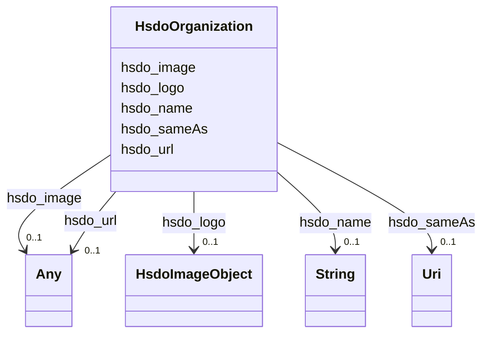

# Class: Organization (hsdo_Organization)


_An organization such as a school, NGO, corporation, club, etc._


URI: [hsdo:Organization](http://schema.org/Organization)





<!-- no inheritance hierarchy -->


## Slots

| Name | Cardinality and Range | Description | Inheritance |
| ---  | --- | --- | --- |
| [hsdo_image](../slots/hsdo_image.md) | 0..1 <br/> [xsd:anyURI](xsd:anyURI)&nbsp;or&nbsp;<br />[xsd:string](xsd:string)&nbsp;or&nbsp;<br />[HsdoImageObject](../classes/HsdoImageObject.md) | No slot (predicate) description specified <br/> 1 occurrences with subject type http___geosciences.ca_def_groundwater#GW_HydrogeoUnit and object type string.<br/>1 occurrences with subject type hsdo_Organization and object type hsdo_ImageObject.<br/>2 occurrences with subject type hsdo_NewsArticle and object type uri. | direct |
| [hsdo_name](../slots/hsdo_name.md) | 0..1 <br/> [xsd:string](xsd:string) | No slot (predicate) description specified <br/> 1 occurrences with subject type rdfs_Resource and object type string.<br/>1 occurrences with subject type http___geosciences.ca_def_groundwater#GW_HydrogeoUnit and object type string.<br/>1 occurrences with subject type https___www.opengis.net_def_appschema_hy_features_hyf_HY_Catchment and object type string.<br/>1 occurrences with subject type https___www.opengis.net_def_appschema_hy_features_hyf_HY_HydrometricNetwork and object type string.<br/>2 occurrences with subject type hsdo_Person and object type string.<br/>3 occurrences with subject type hsdo_Organization and object type string.<br/>48677 occurrences with subject type hsdo_WebPage and object type string.<br/>3 occurrences with subject type hsdo_ListItem and object type string.<br/>1 occurrences with subject type hsdo_WebSite and object type string. | direct |
| [hsdo_logo](../slots/hsdo_logo.md) | 0..1 <br/> [HsdoImageObject](../classes/HsdoImageObject.md) | No slot (predicate) description specified <br/> 5 occurrences with subject type hsdo_Organization and object type hsdo_ImageObject. | direct |
| [hsdo_url](../slots/hsdo_url.md) | 0..1 <br/> [xsd:anyURI](xsd:anyURI)&nbsp;or&nbsp;<br />[HsdoWebPage](../classes/HsdoWebPage.md) | No slot (predicate) description specified <br/> 5 occurrences with subject type hsdo_ImageObject and object type uri.<br/>4 occurrences with subject type hsdo_WebPage and object type hsdo_WebPage.<br/>1 occurrences with subject type hsdo_Organization and object type hsdo_WebPage.<br/>1 occurrences with subject type hsdo_WebSite and object type hsdo_WebPage.<br/>1 occurrences with subject type hsdo_WebPage and object type uri. | direct |
| [hsdo_sameAs](../slots/hsdo_sameAs.md) | 0..1 <br/> [xsd:anyURI](xsd:anyURI) | No slot (predicate) description specified <br/> 3 occurrences with subject type hsdo_Organization and object type uri. | direct |


## Usages

| used by | used in | type | used |
| ---  | --- | --- | --- |
| [HsdoNewsArticle](../classes/HsdoNewsArticle.md) | [hsdo_publisher](../slots/hsdo_publisher.md) | range | [HsdoOrganization](../classes/HsdoOrganization.md) |
| [HsdoWebSite](../classes/HsdoWebSite.md) | [hsdo_publisher](../slots/hsdo_publisher.md) | range | [HsdoOrganization](../classes/HsdoOrganization.md) |


## Identifier and Mapping Information


### Schema Source


* from schema: geoconnex


## Mappings

| Mapping Type | Mapped Value |
| ---  | ---  |
| self | hsdo:Organization |
| native | geoconnex/:HsdoOrganization |


## LinkML Source

<!-- TODO: investigate https://stackoverflow.com/questions/37606292/how-to-create-tabbed-code-blocks-in-mkdocs-or-sphinx -->

### Direct

<details>
```yaml
name: hsdo_Organization
conforms_to: No schema conformance document specified
description: An organization such as a school, NGO, corporation, club, etc.
title: Organization
notes:
- Class with 3 occurrences.
from_schema: geoconnex
rank: 1000
slots:
- hsdo_image
- hsdo_name
- hsdo_logo
- hsdo_url
- hsdo_sameAs
class_uri: hsdo:Organization

```
</details>

### Induced

<details>
```yaml
name: hsdo_Organization
conforms_to: No schema conformance document specified
description: An organization such as a school, NGO, corporation, club, etc.
title: Organization
notes:
- Class with 3 occurrences.
from_schema: geoconnex
rank: 1000
attributes:
  hsdo_image:
    name: hsdo_image
    description: No slot (predicate) description specified
    comments:
    - 1 occurrences with subject type http___geosciences.ca_def_groundwater#GW_HydrogeoUnit
      and object type string.
    - 1 occurrences with subject type hsdo_Organization and object type hsdo_ImageObject.
    - 2 occurrences with subject type hsdo_NewsArticle and object type uri.
    examples:
    - description: http___geosciences.ca_def_groundwater#GW_HydrogeoUnit → string
      object:
        example_object: http://gin.gw-info.net/service/ngwds//en/wms/ngwd-wms/inset?REQUEST=GetMap&SERVICE=WMS&VERSION=1.1.1&LAYERS=area&STYLES=&FORMAT=image/png&BGCOLOR=0xFFFFFF&TRANSPARENT=TRUE&SRS=EPSG:4326&BBOX=-73.6883387829505,44.9741147159004,-72.8050177950318,45.6366054568393&WIDTH=400&HEIGHT=300&TABLE=gw_data.hydrogeological_units&FIELD=id&ID=1
        example_predicate: hsdo:image
        example_subject: https://geoconnex.ca/id/hydrogeounits/Richelieu1
    - description: hsdo_Organization → hsdo_ImageObject
      object:
        example_object: https://internetofwater.org/#organizationLogo
        example_predicate: hsdo:image
        example_subject: https://internetofwater.org/#organization
    - description: hsdo_NewsArticle → uri
      object:
        example_object: https://cdn.arcgis.com/sharing/rest/content/items/0ecb1aaf143b4e1981dbe30f38fceec5/resources/H3VVK2S0MqXGFbHoqFWxE.png?w=400
        example_predicate: hsdo:image
        example_subject: https://gleaner.io/xid/genid/cktr9ekip8ta6ev27pkg
    from_schema: geoconnex
    rank: 1000
    slot_uri: hsdo:image
    alias: hsdo_image
    owner: hsdo_Organization
    domain_of:
    - hsdo_NewsArticle
    - hsdo_Organization
    - http___geosciences.ca_def_groundwater#GW_HydrogeoUnit
    range: Any
    any_of:
    - range: uri
    - range: string
    - range: hsdo_ImageObject
  hsdo_name:
    name: hsdo_name
    description: No slot (predicate) description specified
    comments:
    - 1 occurrences with subject type rdfs_Resource and object type string.
    - 1 occurrences with subject type http___geosciences.ca_def_groundwater#GW_HydrogeoUnit
      and object type string.
    - 1 occurrences with subject type https___www.opengis.net_def_appschema_hy_features_hyf_HY_Catchment
      and object type string.
    - 1 occurrences with subject type https___www.opengis.net_def_appschema_hy_features_hyf_HY_HydrometricNetwork
      and object type string.
    - 2 occurrences with subject type hsdo_Person and object type string.
    - 3 occurrences with subject type hsdo_Organization and object type string.
    - 48677 occurrences with subject type hsdo_WebPage and object type string.
    - 3 occurrences with subject type hsdo_ListItem and object type string.
    - 1 occurrences with subject type hsdo_WebSite and object type string.
    examples:
    - description: rdfs_Resource → string
      object:
        example_object: 'Watershed : Little River - Riviere Richelieu'
        example_predicate: hsdo:name
        example_subject: https://geoconnex.ca/id/catchment/02OJ*CA
    - description: http___geosciences.ca_def_groundwater#GW_HydrogeoUnit → string
      object:
        example_object: 'Hydrogeologic unit : Southern St Lawrence Platform'
        example_predicate: hsdo:name
        example_subject: https://geoconnex.ca/id/hydrogeounits/Richelieu1
    - description: https___www.opengis.net_def_appschema_hy_features_hyf_HY_Catchment
        → string
      object:
        example_object: Waunakee Marsh-Sixmile Creek
        example_predicate: hsdo:name
        example_subject: https://geoconnex.us/SELFIE/usgs/huc/huc12obs/070900020601
    - description: https___www.opengis.net_def_appschema_hy_features_hyf_HY_HydrometricNetwork
        → string
      object:
        example_object: Waunakee Marsh-Sixmile Creek Monitoring Network
        example_predicate: hsdo:name
        example_subject: https://geoconnex.us/SELFIE/usgs/hydrometricnetwork/huc12obs/070900020601
    - description: hsdo_Person → string
      object:
        example_object: Kyle Onda
        example_predicate: hsdo:name
        example_subject: https://gleaner.io/xid/genid/cktr9ekip8ta6ev27pl0
    - description: hsdo_Organization → string
      object:
        example_object: Esri
        example_predicate: hsdo:name
        example_subject: https://gleaner.io/xid/genid/cktr9ekip8ta6ev27plg
    - description: hsdo_WebPage → string
      object:
        example_object: Home
        example_predicate: hsdo:name
        example_subject: https://internetofwater.org/
    - description: hsdo_ListItem → string
      object:
        example_object: Home
        example_predicate: hsdo:name
        example_subject: https://internetofwater.org/#listItem
    - description: hsdo_WebSite → string
      object:
        example_object: Internet of Water
        example_predicate: hsdo:name
        example_subject: https://internetofwater.org/#website
    from_schema: geoconnex
    rank: 1000
    slot_uri: hsdo:name
    alias: hsdo_name
    owner: hsdo_Organization
    domain_of:
    - hsdo_ListItem
    - hsdo_Organization
    - hsdo_Person
    - hsdo_WebPage
    - hsdo_WebSite
    - http___geosciences.ca_def_groundwater#GW_HydrogeoUnit
    - https___www.opengis.net_def_appschema_hy_features_hyf_HY_Catchment
    - https___www.opengis.net_def_appschema_hy_features_hyf_HY_HydrometricNetwork
    - rdfs_Resource
    range: string
  hsdo_logo:
    name: hsdo_logo
    description: No slot (predicate) description specified
    comments:
    - 5 occurrences with subject type hsdo_Organization and object type hsdo_ImageObject.
    examples:
    - description: hsdo_Organization → hsdo_ImageObject
      object:
        example_object: https://internetofwater.org/who-we-are/#organizationLogo
        example_predicate: hsdo:logo
        example_subject: https://internetofwater.org/#organization
    from_schema: geoconnex
    rank: 1000
    slot_uri: hsdo:logo
    alias: hsdo_logo
    owner: hsdo_Organization
    domain_of:
    - hsdo_Organization
    range: hsdo_ImageObject
  hsdo_url:
    name: hsdo_url
    description: No slot (predicate) description specified
    comments:
    - 5 occurrences with subject type hsdo_ImageObject and object type uri.
    - 4 occurrences with subject type hsdo_WebPage and object type hsdo_WebPage.
    - 1 occurrences with subject type hsdo_Organization and object type hsdo_WebPage.
    - 1 occurrences with subject type hsdo_WebSite and object type hsdo_WebPage.
    - 1 occurrences with subject type hsdo_WebPage and object type uri.
    examples:
    - description: hsdo_ImageObject → uri
      object:
        example_object: https://storymaps.arcgis.com/static/images/logo.png
        example_predicate: hsdo:url
        example_subject: https://gleaner.io/xid/genid/cktr9ekip8ta6ev27pm0
    - description: hsdo_WebPage → hsdo_WebPage
      object:
        example_object: https://internetofwater.org/internet-of-water-principles/
        example_predicate: hsdo:url
        example_subject: https://internetofwater.org/internet-of-water-principles/#webpage
    - description: hsdo_Organization → hsdo_WebPage
      object:
        example_object: https://internetofwater.org/
        example_predicate: hsdo:url
        example_subject: https://internetofwater.org/#organization
    - description: hsdo_WebSite → hsdo_WebPage
      object:
        example_object: https://internetofwater.org/
        example_predicate: hsdo:url
        example_subject: https://internetofwater.org/#website
    - description: hsdo_WebPage → uri
      object:
        example_object: https://internetofwater.org/who-we-are/
        example_predicate: hsdo:url
        example_subject: https://internetofwater.org/who-we-are/#webpage
    from_schema: geoconnex
    rank: 1000
    slot_uri: hsdo:url
    alias: hsdo_url
    owner: hsdo_Organization
    domain_of:
    - hsdo_ImageObject
    - hsdo_Organization
    - hsdo_WebPage
    - hsdo_WebSite
    range: Any
    any_of:
    - range: uri
    - range: hsdo_WebPage
  hsdo_sameAs:
    name: hsdo_sameAs
    description: No slot (predicate) description specified
    comments:
    - 3 occurrences with subject type hsdo_Organization and object type uri.
    examples:
    - description: hsdo_Organization → uri
      object:
        example_object: https://twitter.com/internetofh2o
        example_predicate: hsdo:sameAs
        example_subject: https://internetofwater.org/#organization
    from_schema: geoconnex
    rank: 1000
    slot_uri: hsdo:sameAs
    alias: hsdo_sameAs
    owner: hsdo_Organization
    domain_of:
    - hsdo_Organization
    range: uri
class_uri: hsdo:Organization

```
</details>