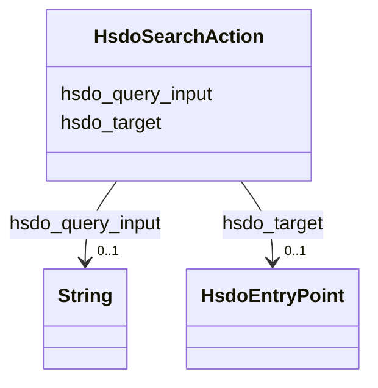

# Class: SearchAction (hsdo_SearchAction)


_The act of searching for an object.\n\nRelated actions:\n\n* [[FindAction]]: SearchAction generally leads to a FindAction, but not necessarily._


URI: [hsdo:SearchAction](http://schema.org/SearchAction)





<!-- no inheritance hierarchy -->


## Slots

| Name | Cardinality and Range | Description | Inheritance |
| ---  | --- | --- | --- |
| [hsdo_target](../slots/hsdo_target.md) | 0..1 <br/> [HsdoEntryPoint](../classes/HsdoEntryPoint.md) | No slot (predicate) description specified <br/> 1 occurrences with subject type hsdo_SearchAction and object type hsdo_EntryPoint. | direct |
| [hsdo_query_input](../slots/hsdo_query_input.md) | 0..1 <br/> [xsd:string](xsd:string) | No slot (predicate) description specified <br/> 1 occurrences with subject type hsdo_SearchAction and object type string. | direct |


## Usages

| used by | used in | type | used |
| ---  | --- | --- | --- |
| [HsdoWebSite](../classes/HsdoWebSite.md) | [hsdo_potentialAction](../slots/hsdo_potentialAction.md) | range | [HsdoSearchAction](../classes/HsdoSearchAction.md) |


## Identifier and Mapping Information


### Schema Source


* from schema: geoconnex


## Mappings

| Mapping Type | Mapped Value |
| ---  | ---  |
| self | hsdo:SearchAction |
| native | geoconnex/:HsdoSearchAction |


## LinkML Source

<!-- TODO: investigate https://stackoverflow.com/questions/37606292/how-to-create-tabbed-code-blocks-in-mkdocs-or-sphinx -->

### Direct

<details>
```yaml
name: hsdo_SearchAction
conforms_to: No schema conformance document specified
description: 'The act of searching for an object.\n\nRelated actions:\n\n* [[FindAction]]:
  SearchAction generally leads to a FindAction, but not necessarily.'
title: SearchAction
notes:
- Class with 1 occurrences.
from_schema: geoconnex
rank: 1000
slots:
- hsdo_target
- hsdo_query-input
class_uri: hsdo:SearchAction

```
</details>

### Induced

<details>
```yaml
name: hsdo_SearchAction
conforms_to: No schema conformance document specified
description: 'The act of searching for an object.\n\nRelated actions:\n\n* [[FindAction]]:
  SearchAction generally leads to a FindAction, but not necessarily.'
title: SearchAction
notes:
- Class with 1 occurrences.
from_schema: geoconnex
rank: 1000
attributes:
  hsdo_target:
    name: hsdo_target
    description: No slot (predicate) description specified
    comments:
    - 1 occurrences with subject type hsdo_SearchAction and object type hsdo_EntryPoint.
    examples:
    - description: hsdo_SearchAction → hsdo_EntryPoint
      object:
        example_object: https://gleaner.io/xid/genid/cktr9ekip8ta6ev27pk0
        example_predicate: hsdo:target
        example_subject: https://gleaner.io/xid/genid/cktr9ekip8ta6ev27pjg
    from_schema: geoconnex
    rank: 1000
    slot_uri: hsdo:target
    alias: hsdo_target
    owner: hsdo_SearchAction
    domain_of:
    - hsdo_SearchAction
    range: hsdo_EntryPoint
  hsdo_query-input:
    name: hsdo_query-input
    description: No slot (predicate) description specified
    comments:
    - 1 occurrences with subject type hsdo_SearchAction and object type string.
    examples:
    - description: hsdo_SearchAction → string
      object:
        example_object: required name=search_term_string
        example_predicate: hsdo:query-input
        example_subject: https://gleaner.io/xid/genid/cktr9ekip8ta6ev27pjg
    from_schema: geoconnex
    rank: 1000
    slot_uri: hsdo:query-input
    alias: hsdo_query_input
    owner: hsdo_SearchAction
    domain_of:
    - hsdo_SearchAction
    range: string
class_uri: hsdo:SearchAction

```
</details>