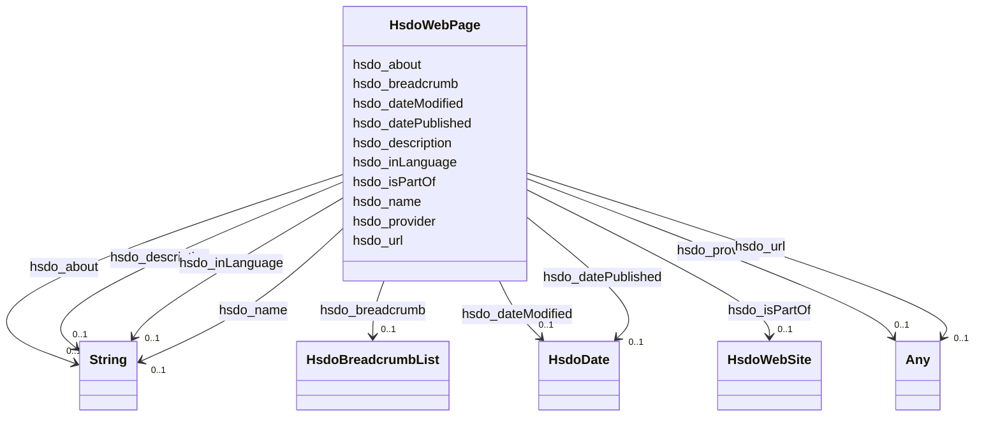

# Class: WebPage (hsdo_WebPage)


_A web page. Every web page is implicitly assumed to be declared to be of type WebPage, so the various properties about that webpage, such as <code>breadcrumb</code> may be used. We recommend explicit declaration if these properties are specified, but if they are found outside of an itemscope, they will be assumed to be about the page._


URI: [hsdo:WebPage](http://schema.org/WebPage)





<!-- no inheritance hierarchy -->


## Slots

| Name | Cardinality and Range | Description | Inheritance |
| ---  | --- | --- | --- |
| [hsdo_breadcrumb](../slots/hsdo_breadcrumb.md) | 0..1 <br/> [HsdoBreadcrumbList](../classes/HsdoBreadcrumbList.md) | No slot (predicate) description specified <br/> 3 occurrences with subject type hsdo_WebPage and object type hsdo_BreadcrumbList. | direct |
| [hsdo_datePublished](../slots/hsdo_datePublished.md) | 0..1 <br/> [HsdoDate](../classes/HsdoDate.md) | No slot (predicate) description specified <br/> 2 occurrences with subject type hsdo_NewsArticle and object type hsdo_Date.<br/>3 occurrences with subject type hsdo_WebPage and object type hsdo_Date. | direct |
| [hsdo_about](../slots/hsdo_about.md) | 0..1 <br/> [xsd:string](xsd:string) | No slot (predicate) description specified <br/> 48672 occurrences with subject type hsdo_WebPage and object type string. | direct |
| [hsdo_provider](../slots/hsdo_provider.md) | 0..1 <br/> [xsd:anyURI](xsd:anyURI)&nbsp;or&nbsp;<br />[xsd:string](xsd:string) | No slot (predicate) description specified <br/> 3194 occurrences with untyped subjects and object type uri.<br/>1 occurrences with subject type http___rdfs.org_ns_void#Dataset and object type uri.<br/>2 occurrences with subject type rdfs_Resource and object type uri.<br/>48672 occurrences with subject type hsdo_WebPage and object type string. | direct |
| [hsdo_name](../slots/hsdo_name.md) | 0..1 <br/> [xsd:string](xsd:string) | No slot (predicate) description specified <br/> 1 occurrences with subject type rdfs_Resource and object type string.<br/>1 occurrences with subject type http___geosciences.ca_def_groundwater#GW_HydrogeoUnit and object type string.<br/>1 occurrences with subject type https___www.opengis.net_def_appschema_hy_features_hyf_HY_Catchment and object type string.<br/>1 occurrences with subject type https___www.opengis.net_def_appschema_hy_features_hyf_HY_HydrometricNetwork and object type string.<br/>2 occurrences with subject type hsdo_Person and object type string.<br/>3 occurrences with subject type hsdo_Organization and object type string.<br/>48677 occurrences with subject type hsdo_WebPage and object type string.<br/>3 occurrences with subject type hsdo_ListItem and object type string.<br/>1 occurrences with subject type hsdo_WebSite and object type string. | direct |
| [hsdo_description](../slots/hsdo_description.md) | 0..1 <br/> [xsd:string](xsd:string) | No slot (predicate) description specified <br/> 1 occurrences with subject type http___geosciences.ca_def_groundwater#GW_HydrogeoUnit and object type string.<br/>1 occurrences with subject type https___www.opengis.net_def_appschema_hy_features_hyf_HY_Catchment and object type string.<br/>1 occurrences with subject type https___www.opengis.net_def_appschema_hy_features_hyf_HY_HydrometricNetwork and object type string.<br/>48677 occurrences with subject type hsdo_WebPage and object type string.<br/>1 occurrences with subject type hsdo_WebSite and object type string.<br/>17 occurrences with subject type hsdo_error and object type string.<br/>2 occurrences with subject type hsdo_NewsArticle and object type string. | direct |
| [hsdo_inLanguage](../slots/hsdo_inLanguage.md) | 0..1 <br/> [xsd:string](xsd:string) | No slot (predicate) description specified <br/> 1 occurrences with subject type hsdo_WebSite and object type string.<br/>3 occurrences with subject type hsdo_WebPage and object type string. | direct |
| [hsdo_isPartOf](../slots/hsdo_isPartOf.md) | 0..1 <br/> [HsdoWebSite](../classes/HsdoWebSite.md) | No slot (predicate) description specified <br/> 3 occurrences with subject type hsdo_WebPage and object type hsdo_WebSite. | direct |
| [hsdo_url](../slots/hsdo_url.md) | 0..1 <br/> [xsd:anyURI](xsd:anyURI)&nbsp;or&nbsp;<br />[HsdoWebPage](../classes/HsdoWebPage.md) | No slot (predicate) description specified <br/> 5 occurrences with subject type hsdo_ImageObject and object type uri.<br/>4 occurrences with subject type hsdo_WebPage and object type hsdo_WebPage.<br/>1 occurrences with subject type hsdo_Organization and object type hsdo_WebPage.<br/>1 occurrences with subject type hsdo_WebSite and object type hsdo_WebPage.<br/>1 occurrences with subject type hsdo_WebPage and object type uri. | direct |
| [hsdo_dateModified](../slots/hsdo_dateModified.md) | 0..1 <br/> [HsdoDate](../classes/HsdoDate.md) | No slot (predicate) description specified <br/> 2 occurrences with subject type hsdo_NewsArticle and object type hsdo_Date.<br/>3 occurrences with subject type hsdo_WebPage and object type hsdo_Date. | direct |


## Usages

| used by | used in | type | used |
| ---  | --- | --- | --- |
| [HsdoImageObject](../classes/HsdoImageObject.md) | [hsdo_url](../slots/hsdo_url.md) | any_of[range] | [HsdoWebPage](../classes/HsdoWebPage.md) |
| [HsdoListItem](../classes/HsdoListItem.md) | [hsdo_item](../slots/hsdo_item.md) | any_of[range] | [HsdoWebPage](../classes/HsdoWebPage.md) |
| [HsdoNewsArticle](../classes/HsdoNewsArticle.md) | [hsdo_mainEntityOfPage](../slots/hsdo_mainEntityOfPage.md) | range | [HsdoWebPage](../classes/HsdoWebPage.md) |
| [HsdoOrganization](../classes/HsdoOrganization.md) | [hsdo_url](../slots/hsdo_url.md) | any_of[range] | [HsdoWebPage](../classes/HsdoWebPage.md) |
| [HsdoWebPage](../classes/HsdoWebPage.md) | [hsdo_url](../slots/hsdo_url.md) | any_of[range] | [HsdoWebPage](../classes/HsdoWebPage.md) |
| [HsdoWebSite](../classes/HsdoWebSite.md) | [hsdo_url](../slots/hsdo_url.md) | any_of[range] | [HsdoWebPage](../classes/HsdoWebPage.md) |


## Identifier and Mapping Information


### Schema Source


* from schema: geoconnex


## Mappings

| Mapping Type | Mapped Value |
| ---  | ---  |
| self | hsdo:WebPage |
| native | geoconnex/:HsdoWebPage |


## LinkML Source

<!-- TODO: investigate https://stackoverflow.com/questions/37606292/how-to-create-tabbed-code-blocks-in-mkdocs-or-sphinx -->

### Direct

<details>
```yaml
name: hsdo_WebPage
conforms_to: No schema conformance document specified
description: A web page. Every web page is implicitly assumed to be declared to be
  of type WebPage, so the various properties about that webpage, such as <code>breadcrumb</code>
  may be used. We recommend explicit declaration if these properties are specified,
  but if they are found outside of an itemscope, they will be assumed to be about
  the page.
title: WebPage
notes:
- Class with 48678 occurrences.
from_schema: geoconnex
rank: 1000
slots:
- hsdo_breadcrumb
- hsdo_datePublished
- hsdo_about
- hsdo_provider
- hsdo_name
- hsdo_description
- hsdo_inLanguage
- hsdo_isPartOf
- hsdo_url
- hsdo_dateModified
class_uri: hsdo:WebPage

```
</details>

### Induced

<details>
```yaml
name: hsdo_WebPage
conforms_to: No schema conformance document specified
description: A web page. Every web page is implicitly assumed to be declared to be
  of type WebPage, so the various properties about that webpage, such as <code>breadcrumb</code>
  may be used. We recommend explicit declaration if these properties are specified,
  but if they are found outside of an itemscope, they will be assumed to be about
  the page.
title: WebPage
notes:
- Class with 48678 occurrences.
from_schema: geoconnex
rank: 1000
attributes:
  hsdo_breadcrumb:
    name: hsdo_breadcrumb
    description: No slot (predicate) description specified
    comments:
    - 3 occurrences with subject type hsdo_WebPage and object type hsdo_BreadcrumbList.
    examples:
    - description: hsdo_WebPage → hsdo_BreadcrumbList
      object:
        example_object: https://internetofwater.org/who-we-are/#breadcrumblist
        example_predicate: hsdo:breadcrumb
        example_subject: https://internetofwater.org/who-we-are/#webpage
    from_schema: geoconnex
    rank: 1000
    slot_uri: hsdo:breadcrumb
    alias: hsdo_breadcrumb
    owner: hsdo_WebPage
    domain_of:
    - hsdo_WebPage
    range: hsdo_BreadcrumbList
  hsdo_datePublished:
    name: hsdo_datePublished
    description: No slot (predicate) description specified
    comments:
    - 2 occurrences with subject type hsdo_NewsArticle and object type hsdo_Date.
    - 3 occurrences with subject type hsdo_WebPage and object type hsdo_Date.
    examples:
    - description: hsdo_NewsArticle → hsdo_Date
      object:
        example_object: '2022-04-21T03:30:52.000Z'
        example_predicate: hsdo:datePublished
        example_subject: https://gleaner.io/xid/genid/cktr9ekip8ta6ev27pkg
    - description: hsdo_WebPage → hsdo_Date
      object:
        example_object: '2022-03-30T20:11:43-04:00'
        example_predicate: hsdo:datePublished
        example_subject: https://internetofwater.org/#webpage
    from_schema: geoconnex
    rank: 1000
    slot_uri: hsdo:datePublished
    alias: hsdo_datePublished
    owner: hsdo_WebPage
    domain_of:
    - hsdo_NewsArticle
    - hsdo_WebPage
    range: hsdo_Date
  hsdo_about:
    name: hsdo_about
    description: No slot (predicate) description specified
    comments:
    - 48672 occurrences with subject type hsdo_WebPage and object type string.
    examples:
    - description: hsdo_WebPage → string
      object:
        example_object: https://geoconnex.us/nhdplusv2/huc12/010100020101
        example_predicate: hsdo:about
        example_subject: https://geoconnex.us/epa/hmw/010100020101
    from_schema: geoconnex
    rank: 1000
    slot_uri: hsdo:about
    alias: hsdo_about
    owner: hsdo_WebPage
    domain_of:
    - hsdo_WebPage
    range: string
  hsdo_provider:
    name: hsdo_provider
    description: No slot (predicate) description specified
    comments:
    - 3194 occurrences with untyped subjects and object type uri.
    - 1 occurrences with subject type http___rdfs.org_ns_void#Dataset and object type
      uri.
    - 2 occurrences with subject type rdfs_Resource and object type uri.
    - 48672 occurrences with subject type hsdo_WebPage and object type string.
    examples:
    - description: None → uri
      object:
        example_object: https://labs.waterdata.usgs.gov
        example_predicate: hsdo:provider
        example_subject: http://water.usgs.gov/ogw/aquiferbasics/nycarbon.html
    - description: http___rdfs.org_ns_void#Dataset → uri
      object:
        example_object: https://labs.waterdata.usgs.gov
        example_predicate: hsdo:provider
        example_subject: https://info.geoconnex.us/chyld-pilot/data/node/all
    - description: rdfs_Resource → uri
      object:
        example_object: https://labs.waterdata.usgs.gov
        example_predicate: hsdo:provider
        example_subject: https://info.geoconnex.us/chyld-pilot/data/node/connect
    - description: hsdo_WebPage → string
      object:
        example_object: https://epa.gov
        example_predicate: hsdo:provider
        example_subject: https://geoconnex.us/epa/hmw/010100020101
    from_schema: geoconnex
    rank: 1000
    slot_uri: hsdo:provider
    alias: hsdo_provider
    owner: hsdo_WebPage
    domain_of:
    - hsdo_WebPage
    - http___rdfs.org_ns_void#Dataset
    - rdfs_Resource
    range: Any
    any_of:
    - range: uri
    - range: string
  hsdo_name:
    name: hsdo_name
    description: No slot (predicate) description specified
    comments:
    - 1 occurrences with subject type rdfs_Resource and object type string.
    - 1 occurrences with subject type http___geosciences.ca_def_groundwater#GW_HydrogeoUnit
      and object type string.
    - 1 occurrences with subject type https___www.opengis.net_def_appschema_hy_features_hyf_HY_Catchment
      and object type string.
    - 1 occurrences with subject type https___www.opengis.net_def_appschema_hy_features_hyf_HY_HydrometricNetwork
      and object type string.
    - 2 occurrences with subject type hsdo_Person and object type string.
    - 3 occurrences with subject type hsdo_Organization and object type string.
    - 48677 occurrences with subject type hsdo_WebPage and object type string.
    - 3 occurrences with subject type hsdo_ListItem and object type string.
    - 1 occurrences with subject type hsdo_WebSite and object type string.
    examples:
    - description: rdfs_Resource → string
      object:
        example_object: 'Watershed : Little River - Riviere Richelieu'
        example_predicate: hsdo:name
        example_subject: https://geoconnex.ca/id/catchment/02OJ*CA
    - description: http___geosciences.ca_def_groundwater#GW_HydrogeoUnit → string
      object:
        example_object: 'Hydrogeologic unit : Southern St Lawrence Platform'
        example_predicate: hsdo:name
        example_subject: https://geoconnex.ca/id/hydrogeounits/Richelieu1
    - description: https___www.opengis.net_def_appschema_hy_features_hyf_HY_Catchment
        → string
      object:
        example_object: Waunakee Marsh-Sixmile Creek
        example_predicate: hsdo:name
        example_subject: https://geoconnex.us/SELFIE/usgs/huc/huc12obs/070900020601
    - description: https___www.opengis.net_def_appschema_hy_features_hyf_HY_HydrometricNetwork
        → string
      object:
        example_object: Waunakee Marsh-Sixmile Creek Monitoring Network
        example_predicate: hsdo:name
        example_subject: https://geoconnex.us/SELFIE/usgs/hydrometricnetwork/huc12obs/070900020601
    - description: hsdo_Person → string
      object:
        example_object: Kyle Onda
        example_predicate: hsdo:name
        example_subject: https://gleaner.io/xid/genid/cktr9ekip8ta6ev27pl0
    - description: hsdo_Organization → string
      object:
        example_object: Esri
        example_predicate: hsdo:name
        example_subject: https://gleaner.io/xid/genid/cktr9ekip8ta6ev27plg
    - description: hsdo_WebPage → string
      object:
        example_object: Home
        example_predicate: hsdo:name
        example_subject: https://internetofwater.org/
    - description: hsdo_ListItem → string
      object:
        example_object: Home
        example_predicate: hsdo:name
        example_subject: https://internetofwater.org/#listItem
    - description: hsdo_WebSite → string
      object:
        example_object: Internet of Water
        example_predicate: hsdo:name
        example_subject: https://internetofwater.org/#website
    from_schema: geoconnex
    rank: 1000
    slot_uri: hsdo:name
    alias: hsdo_name
    owner: hsdo_WebPage
    domain_of:
    - hsdo_ListItem
    - hsdo_Organization
    - hsdo_Person
    - hsdo_WebPage
    - hsdo_WebSite
    - http___geosciences.ca_def_groundwater#GW_HydrogeoUnit
    - https___www.opengis.net_def_appschema_hy_features_hyf_HY_Catchment
    - https___www.opengis.net_def_appschema_hy_features_hyf_HY_HydrometricNetwork
    - rdfs_Resource
    range: string
  hsdo_description:
    name: hsdo_description
    description: No slot (predicate) description specified
    comments:
    - 1 occurrences with subject type http___geosciences.ca_def_groundwater#GW_HydrogeoUnit
      and object type string.
    - 1 occurrences with subject type https___www.opengis.net_def_appschema_hy_features_hyf_HY_Catchment
      and object type string.
    - 1 occurrences with subject type https___www.opengis.net_def_appschema_hy_features_hyf_HY_HydrometricNetwork
      and object type string.
    - 48677 occurrences with subject type hsdo_WebPage and object type string.
    - 1 occurrences with subject type hsdo_WebSite and object type string.
    - 17 occurrences with subject type hsdo_error and object type string.
    - 2 occurrences with subject type hsdo_NewsArticle and object type string.
    examples:
    - description: http___geosciences.ca_def_groundwater#GW_HydrogeoUnit → string
      object:
        example_object: '

          In the context of the southern area of the St. Lawrence Platform of (south
          Lowlands), the clay unit is generally not continuous or thick. The bedrock
          is rather covered by a till unit of at least 10 m thick which may allow
          significant bedrock aquifer recharge rates. This limited sedimentary cover
          suggests that there would be links between the bedrock aquifer and streams,
          particularly along some sections of the Richelieu River, which constitute
          discharge areas. The flow is oriented east-west, from the recharge areas
          to Richelieu River or others discharge areas. The surficial permeable sediments
          with significant thickness have small spatial extension, thus that the aquifer
          potential is mainly based on fractured bedrock aquifer. In the unit, there
          is a significant use of groundwater as water supply. The predominant semi-confined
          conditions involve a moderate vulnerability of the bedrock aquifer. Groundwater
          exceeds frequently some aesthetic criteria as Fe, Mn, S, Na, and F in the
          central area of the hydrogeological unit.

          '
        example_predicate: hsdo:description
        example_subject: https://geoconnex.ca/id/hydrogeounits/Richelieu1
    - description: https___www.opengis.net_def_appschema_hy_features_hyf_HY_Catchment
        → string
      object:
        example_object: USGS Watershed Boundary Dataset Twelve Digit Hydrologic Unit
          Code Watershed
        example_predicate: hsdo:description
        example_subject: https://geoconnex.us/SELFIE/usgs/huc/huc12obs/070900020601
    - description: https___www.opengis.net_def_appschema_hy_features_hyf_HY_HydrometricNetwork
        → string
      object:
        example_object: Monitoring locations in the Waunakee Marsh-Sixmile Creek watershed.
        example_predicate: hsdo:description
        example_subject: https://geoconnex.us/SELFIE/usgs/hydrometricnetwork/huc12obs/070900020601
    - description: hsdo_WebPage → string
      object:
        example_object: The Internet of Water Coalition works with partners to build
          modern data infrastructure & create a community of people using water data
          to make better decisions
        example_predicate: hsdo:description
        example_subject: https://internetofwater.org/
    - description: hsdo_WebSite → string
      object:
        example_object: Better Water Data for Better Water Management
        example_predicate: hsdo:description
        example_subject: https://internetofwater.org/#website
    - description: hsdo_error → string
      object:
        example_object: 'Something bad happened. Contact us with Reference Number:
          115163272'
        example_predicate: hsdo:description
        example_subject: https://gleaner.io/xid/genid/cksk7tsip8t6t2qvs9a0
    - description: hsdo_NewsArticle → string
      object:
        example_object: 'Begin with a point of interest. For example:lon: -117.12lat:
          46.43'
        example_predicate: hsdo:description
        example_subject: https://gleaner.io/xid/genid/cktr9ekip8ta6ev27pkg
    from_schema: geoconnex
    rank: 1000
    slot_uri: hsdo:description
    alias: hsdo_description
    owner: hsdo_WebPage
    domain_of:
    - hsdo_NewsArticle
    - hsdo_WebPage
    - hsdo_WebSite
    - hsdo_error
    - http___geosciences.ca_def_groundwater#GW_HydrogeoUnit
    - https___www.opengis.net_def_appschema_hy_features_hyf_HY_Catchment
    - https___www.opengis.net_def_appschema_hy_features_hyf_HY_HydrometricNetwork
    range: string
  hsdo_inLanguage:
    name: hsdo_inLanguage
    description: No slot (predicate) description specified
    comments:
    - 1 occurrences with subject type hsdo_WebSite and object type string.
    - 3 occurrences with subject type hsdo_WebPage and object type string.
    examples:
    - description: hsdo_WebSite → string
      object:
        example_object: en-US
        example_predicate: hsdo:inLanguage
        example_subject: https://internetofwater.org/#website
    - description: hsdo_WebPage → string
      object:
        example_object: en-US
        example_predicate: hsdo:inLanguage
        example_subject: https://internetofwater.org/#webpage
    from_schema: geoconnex
    rank: 1000
    slot_uri: hsdo:inLanguage
    alias: hsdo_inLanguage
    owner: hsdo_WebPage
    domain_of:
    - hsdo_WebPage
    - hsdo_WebSite
    range: string
  hsdo_isPartOf:
    name: hsdo_isPartOf
    description: No slot (predicate) description specified
    comments:
    - 3 occurrences with subject type hsdo_WebPage and object type hsdo_WebSite.
    examples:
    - description: hsdo_WebPage → hsdo_WebSite
      object:
        example_object: https://internetofwater.org/#website
        example_predicate: hsdo:isPartOf
        example_subject: https://internetofwater.org/who-we-are/#webpage
    from_schema: geoconnex
    rank: 1000
    slot_uri: hsdo:isPartOf
    alias: hsdo_isPartOf
    owner: hsdo_WebPage
    domain_of:
    - hsdo_WebPage
    range: hsdo_WebSite
  hsdo_url:
    name: hsdo_url
    description: No slot (predicate) description specified
    comments:
    - 5 occurrences with subject type hsdo_ImageObject and object type uri.
    - 4 occurrences with subject type hsdo_WebPage and object type hsdo_WebPage.
    - 1 occurrences with subject type hsdo_Organization and object type hsdo_WebPage.
    - 1 occurrences with subject type hsdo_WebSite and object type hsdo_WebPage.
    - 1 occurrences with subject type hsdo_WebPage and object type uri.
    examples:
    - description: hsdo_ImageObject → uri
      object:
        example_object: https://storymaps.arcgis.com/static/images/logo.png
        example_predicate: hsdo:url
        example_subject: https://gleaner.io/xid/genid/cktr9ekip8ta6ev27pm0
    - description: hsdo_WebPage → hsdo_WebPage
      object:
        example_object: https://internetofwater.org/internet-of-water-principles/
        example_predicate: hsdo:url
        example_subject: https://internetofwater.org/internet-of-water-principles/#webpage
    - description: hsdo_Organization → hsdo_WebPage
      object:
        example_object: https://internetofwater.org/
        example_predicate: hsdo:url
        example_subject: https://internetofwater.org/#organization
    - description: hsdo_WebSite → hsdo_WebPage
      object:
        example_object: https://internetofwater.org/
        example_predicate: hsdo:url
        example_subject: https://internetofwater.org/#website
    - description: hsdo_WebPage → uri
      object:
        example_object: https://internetofwater.org/who-we-are/
        example_predicate: hsdo:url
        example_subject: https://internetofwater.org/who-we-are/#webpage
    from_schema: geoconnex
    rank: 1000
    slot_uri: hsdo:url
    alias: hsdo_url
    owner: hsdo_WebPage
    domain_of:
    - hsdo_ImageObject
    - hsdo_Organization
    - hsdo_WebPage
    - hsdo_WebSite
    range: Any
    any_of:
    - range: uri
    - range: hsdo_WebPage
  hsdo_dateModified:
    name: hsdo_dateModified
    description: No slot (predicate) description specified
    comments:
    - 2 occurrences with subject type hsdo_NewsArticle and object type hsdo_Date.
    - 3 occurrences with subject type hsdo_WebPage and object type hsdo_Date.
    examples:
    - description: hsdo_NewsArticle → hsdo_Date
      object:
        example_object: '2022-04-21T16:08:00.395Z'
        example_predicate: hsdo:dateModified
        example_subject: https://gleaner.io/xid/genid/cktr9ekip8ta6ev27pkg
    - description: hsdo_WebPage → hsdo_Date
      object:
        example_object: '2023-07-18T14:52:28-04:00'
        example_predicate: hsdo:dateModified
        example_subject: https://internetofwater.org/#webpage
    from_schema: geoconnex
    rank: 1000
    slot_uri: hsdo:dateModified
    alias: hsdo_dateModified
    owner: hsdo_WebPage
    domain_of:
    - hsdo_NewsArticle
    - hsdo_WebPage
    range: hsdo_Date
class_uri: hsdo:WebPage

```
</details>