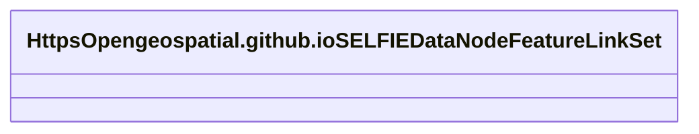

# Class: No class name specified (https___opengeospatial.github.io_SELFIE_DataNode_FeatureLinkSet)


_No class (type) description specified_


URI: [https://opengeospatial.github.io/SELFIE/DataNode_FeatureLinkSet](https://opengeospatial.github.io/SELFIE/DataNode_FeatureLinkSet)





<!-- no inheritance hierarchy -->


## Slots

| Name | Cardinality and Range | Description | Inheritance |
| ---  | --- | --- | --- |


## Examples

| Value |
| --- |
| https://info.geoconnex.us/chyld-pilot/data/node/cross |


## Identifier and Mapping Information


### Schema Source


* from schema: geoconnex


## Mappings

| Mapping Type | Mapped Value |
| ---  | ---  |
| self | https://opengeospatial.github.io/SELFIE/DataNode_FeatureLinkSet |
| native | geoconnex/:HttpsOpengeospatial.github.ioSELFIEDataNodeFeatureLinkSet |


## LinkML Source

<!-- TODO: investigate https://stackoverflow.com/questions/37606292/how-to-create-tabbed-code-blocks-in-mkdocs-or-sphinx -->

### Direct

<details>
```yaml
name: https___opengeospatial.github.io_SELFIE_DataNode_FeatureLinkSet
conforms_to: No schema conformance document specified
description: No class (type) description specified
title: No class name specified
notes:
- Class with 1 occurrences.
examples:
- value: https://info.geoconnex.us/chyld-pilot/data/node/cross
from_schema: geoconnex
rank: 1000
class_uri: https://opengeospatial.github.io/SELFIE/DataNode_FeatureLinkSet

```
</details>

### Induced

<details>
```yaml
name: https___opengeospatial.github.io_SELFIE_DataNode_FeatureLinkSet
conforms_to: No schema conformance document specified
description: No class (type) description specified
title: No class name specified
notes:
- Class with 1 occurrences.
examples:
- value: https://info.geoconnex.us/chyld-pilot/data/node/cross
from_schema: geoconnex
rank: 1000
class_uri: https://opengeospatial.github.io/SELFIE/DataNode_FeatureLinkSet

```
</details>