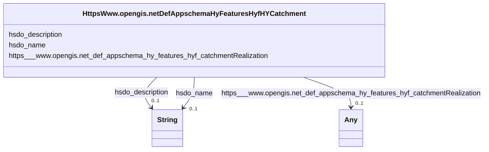

# Class: No class (type) name specified (https___www.opengis.net_def_appschema_hy_features_hyf_HY_Catchment)


_No class (type) description specified_


URI: [https://www.opengis.net/def/appschema/hy_features/hyf/HY_Catchment](https://www.opengis.net/def/appschema/hy_features/hyf/HY_Catchment)





<!-- no inheritance hierarchy -->


## Slots

| Name | Cardinality and Range | Description | Inheritance |
| ---  | --- | --- | --- |
| [hsdo_description](../slots/hsdo_description.md) | 0..1 <br/> [xsd:string](xsd:string) | No slot (predicate) description specified <br/> 1 occurrences with subject type http___geosciences.ca_def_groundwater#GW_HydrogeoUnit and object type string.<br/>1 occurrences with subject type https___www.opengis.net_def_appschema_hy_features_hyf_HY_Catchment and object type string.<br/>1 occurrences with subject type https___www.opengis.net_def_appschema_hy_features_hyf_HY_HydrometricNetwork and object type string.<br/>48677 occurrences with subject type hsdo_WebPage and object type string.<br/>1 occurrences with subject type hsdo_WebSite and object type string.<br/>17 occurrences with subject type hsdo_error and object type string.<br/>2 occurrences with subject type hsdo_NewsArticle and object type string. | direct |
| [https___www.opengis.net_def_appschema_hy_features_hyf_catchmentRealization](../slots/https___www.opengis.net_def_appschema_hy_features_hyf_catchmentRealization.md) | 0..1 <br/> [HttpsWww.opengis.netDefAppschemaHyFeaturesHyfHYHydrometricNetwork](../classes/HttpsWww.opengis.netDefAppschemaHyFeaturesHyfHYHydrometricNetwork.md)&nbsp;or&nbsp;<br />[HttpsWww.opengis.netDefAppschemaHyFeaturesHyfHYCatchmentDivide](../classes/HttpsWww.opengis.netDefAppschemaHyFeaturesHyfHYCatchmentDivide.md)&nbsp;or&nbsp;<br />[HttpsWww.opengis.netDefAppschemaHyFeaturesHyfHYHydrographicNetwork](../classes/HttpsWww.opengis.netDefAppschemaHyFeaturesHyfHYHydrographicNetwork.md) | No slot (predicate) description specified <br/> 1 occurrences with subject type https___www.opengis.net_def_appschema_hy_features_hyf_HY_Catchment and object type https___www.opengis.net_def_appschema_hy_features_hyf_HY_CatchmentDivide.<br/>1 occurrences with subject type https___www.opengis.net_def_appschema_hy_features_hyf_HY_Catchment and object type https___www.opengis.net_def_appschema_hy_features_hyf_HY_HydrometricNetwork.<br/>1 occurrences with subject type https___www.opengis.net_def_appschema_hy_features_hyf_HY_Catchment and object type https___www.opengis.net_def_appschema_hy_features_hyf_HY_HydrographicNetwork. | direct |
| [hsdo_name](../slots/hsdo_name.md) | 0..1 <br/> [xsd:string](xsd:string) | No slot (predicate) description specified <br/> 1 occurrences with subject type rdfs_Resource and object type string.<br/>1 occurrences with subject type http___geosciences.ca_def_groundwater#GW_HydrogeoUnit and object type string.<br/>1 occurrences with subject type https___www.opengis.net_def_appschema_hy_features_hyf_HY_Catchment and object type string.<br/>1 occurrences with subject type https___www.opengis.net_def_appschema_hy_features_hyf_HY_HydrometricNetwork and object type string.<br/>2 occurrences with subject type hsdo_Person and object type string.<br/>3 occurrences with subject type hsdo_Organization and object type string.<br/>48677 occurrences with subject type hsdo_WebPage and object type string.<br/>3 occurrences with subject type hsdo_ListItem and object type string.<br/>1 occurrences with subject type hsdo_WebSite and object type string. | direct |


## Usages

| used by | used in | type | used |
| ---  | --- | --- | --- |
| [HttpsWww.opengis.netDefAppschemaHyFeaturesHyfHYHydrometricNetwork](../classes/HttpsWww.opengis.netDefAppschemaHyFeaturesHyfHYHydrometricNetwork.md) | [https___www.opengis.net_def_appschema_hy_features_hyf_realizedCatchment](../slots/https___www.opengis.net_def_appschema_hy_features_hyf_realizedCatchment.md) | range | [HttpsWww.opengis.netDefAppschemaHyFeaturesHyfHYCatchment](../classes/HttpsWww.opengis.netDefAppschemaHyFeaturesHyfHYCatchment.md) |


## Identifier and Mapping Information


### Schema Source


* from schema: geoconnex


## Mappings

| Mapping Type | Mapped Value |
| ---  | ---  |
| self | https://www.opengis.net/def/appschema/hy_features/hyf/HY_Catchment |
| native | geoconnex/:HttpsWww.opengis.netDefAppschemaHyFeaturesHyfHYCatchment |


## LinkML Source

<!-- TODO: investigate https://stackoverflow.com/questions/37606292/how-to-create-tabbed-code-blocks-in-mkdocs-or-sphinx -->

### Direct

<details>
```yaml
name: https___www.opengis.net_def_appschema_hy_features_hyf_HY_Catchment
conforms_to: No schema conformance document specified
description: No class (type) description specified
title: No class (type) name specified
notes:
- Class with 1 occurrences.
from_schema: geoconnex
rank: 1000
slots:
- hsdo_description
- https___www.opengis.net_def_appschema_hy_features_hyf_catchmentRealization
- hsdo_name
class_uri: https://www.opengis.net/def/appschema/hy_features/hyf/HY_Catchment

```
</details>

### Induced

<details>
```yaml
name: https___www.opengis.net_def_appschema_hy_features_hyf_HY_Catchment
conforms_to: No schema conformance document specified
description: No class (type) description specified
title: No class (type) name specified
notes:
- Class with 1 occurrences.
from_schema: geoconnex
rank: 1000
attributes:
  hsdo_description:
    name: hsdo_description
    description: No slot (predicate) description specified
    comments:
    - 1 occurrences with subject type http___geosciences.ca_def_groundwater#GW_HydrogeoUnit
      and object type string.
    - 1 occurrences with subject type https___www.opengis.net_def_appschema_hy_features_hyf_HY_Catchment
      and object type string.
    - 1 occurrences with subject type https___www.opengis.net_def_appschema_hy_features_hyf_HY_HydrometricNetwork
      and object type string.
    - 48677 occurrences with subject type hsdo_WebPage and object type string.
    - 1 occurrences with subject type hsdo_WebSite and object type string.
    - 17 occurrences with subject type hsdo_error and object type string.
    - 2 occurrences with subject type hsdo_NewsArticle and object type string.
    examples:
    - description: http___geosciences.ca_def_groundwater#GW_HydrogeoUnit → string
      object:
        example_object: '

          In the context of the southern area of the St. Lawrence Platform of (south
          Lowlands), the clay unit is generally not continuous or thick. The bedrock
          is rather covered by a till unit of at least 10 m thick which may allow
          significant bedrock aquifer recharge rates. This limited sedimentary cover
          suggests that there would be links between the bedrock aquifer and streams,
          particularly along some sections of the Richelieu River, which constitute
          discharge areas. The flow is oriented east-west, from the recharge areas
          to Richelieu River or others discharge areas. The surficial permeable sediments
          with significant thickness have small spatial extension, thus that the aquifer
          potential is mainly based on fractured bedrock aquifer. In the unit, there
          is a significant use of groundwater as water supply. The predominant semi-confined
          conditions involve a moderate vulnerability of the bedrock aquifer. Groundwater
          exceeds frequently some aesthetic criteria as Fe, Mn, S, Na, and F in the
          central area of the hydrogeological unit.

          '
        example_predicate: hsdo:description
        example_subject: https://geoconnex.ca/id/hydrogeounits/Richelieu1
    - description: https___www.opengis.net_def_appschema_hy_features_hyf_HY_Catchment
        → string
      object:
        example_object: USGS Watershed Boundary Dataset Twelve Digit Hydrologic Unit
          Code Watershed
        example_predicate: hsdo:description
        example_subject: https://geoconnex.us/SELFIE/usgs/huc/huc12obs/070900020601
    - description: https___www.opengis.net_def_appschema_hy_features_hyf_HY_HydrometricNetwork
        → string
      object:
        example_object: Monitoring locations in the Waunakee Marsh-Sixmile Creek watershed.
        example_predicate: hsdo:description
        example_subject: https://geoconnex.us/SELFIE/usgs/hydrometricnetwork/huc12obs/070900020601
    - description: hsdo_WebPage → string
      object:
        example_object: The Internet of Water Coalition works with partners to build
          modern data infrastructure & create a community of people using water data
          to make better decisions
        example_predicate: hsdo:description
        example_subject: https://internetofwater.org/
    - description: hsdo_WebSite → string
      object:
        example_object: Better Water Data for Better Water Management
        example_predicate: hsdo:description
        example_subject: https://internetofwater.org/#website
    - description: hsdo_error → string
      object:
        example_object: 'Something bad happened. Contact us with Reference Number:
          115163272'
        example_predicate: hsdo:description
        example_subject: https://gleaner.io/xid/genid/cksk7tsip8t6t2qvs9a0
    - description: hsdo_NewsArticle → string
      object:
        example_object: 'Begin with a point of interest. For example:lon: -117.12lat:
          46.43'
        example_predicate: hsdo:description
        example_subject: https://gleaner.io/xid/genid/cktr9ekip8ta6ev27pkg
    from_schema: geoconnex
    rank: 1000
    slot_uri: hsdo:description
    alias: hsdo_description
    owner: https___www.opengis.net_def_appschema_hy_features_hyf_HY_Catchment
    domain_of:
    - hsdo_NewsArticle
    - hsdo_WebPage
    - hsdo_WebSite
    - hsdo_error
    - http___geosciences.ca_def_groundwater#GW_HydrogeoUnit
    - https___www.opengis.net_def_appschema_hy_features_hyf_HY_Catchment
    - https___www.opengis.net_def_appschema_hy_features_hyf_HY_HydrometricNetwork
    range: string
  https___www.opengis.net_def_appschema_hy_features_hyf_catchmentRealization:
    name: https___www.opengis.net_def_appschema_hy_features_hyf_catchmentRealization
    description: No slot (predicate) description specified
    comments:
    - 1 occurrences with subject type https___www.opengis.net_def_appschema_hy_features_hyf_HY_Catchment
      and object type https___www.opengis.net_def_appschema_hy_features_hyf_HY_CatchmentDivide.
    - 1 occurrences with subject type https___www.opengis.net_def_appschema_hy_features_hyf_HY_Catchment
      and object type https___www.opengis.net_def_appschema_hy_features_hyf_HY_HydrometricNetwork.
    - 1 occurrences with subject type https___www.opengis.net_def_appschema_hy_features_hyf_HY_Catchment
      and object type https___www.opengis.net_def_appschema_hy_features_hyf_HY_HydrographicNetwork.
    examples:
    - description: https___www.opengis.net_def_appschema_hy_features_hyf_HY_Catchment
        → https___www.opengis.net_def_appschema_hy_features_hyf_HY_CatchmentDivide
      object:
        example_object: https://geoconnex.us/SELFIE/usgs/hucboundary/huc12obs/070900020601
        example_predicate: https://www.opengis.net/def/appschema/hy_features/hyf/catchmentRealization
        example_subject: https://geoconnex.us/SELFIE/usgs/huc/huc12obs/070900020601
    - description: https___www.opengis.net_def_appschema_hy_features_hyf_HY_Catchment
        → https___www.opengis.net_def_appschema_hy_features_hyf_HY_HydrometricNetwork
      object:
        example_object: https://geoconnex.us/SELFIE/usgs/hydrometricnetwork/huc12obs/070900020601
        example_predicate: https://www.opengis.net/def/appschema/hy_features/hyf/catchmentRealization
        example_subject: https://geoconnex.us/SELFIE/usgs/huc/huc12obs/070900020601
    - description: https___www.opengis.net_def_appschema_hy_features_hyf_HY_Catchment
        → https___www.opengis.net_def_appschema_hy_features_hyf_HY_HydrographicNetwork
      object:
        example_object: https://geoconnex.us/SELFIE/usgs/nhdplusflowline/huc12obs/070900020601
        example_predicate: https://www.opengis.net/def/appschema/hy_features/hyf/catchmentRealization
        example_subject: https://geoconnex.us/SELFIE/usgs/huc/huc12obs/070900020601
    from_schema: geoconnex
    rank: 1000
    slot_uri: https://www.opengis.net/def/appschema/hy_features/hyf/catchmentRealization
    alias: https___www.opengis.net_def_appschema_hy_features_hyf_catchmentRealization
    owner: https___www.opengis.net_def_appschema_hy_features_hyf_HY_Catchment
    domain_of:
    - https___www.opengis.net_def_appschema_hy_features_hyf_HY_Catchment
    range: Any
    any_of:
    - range: https___www.opengis.net_def_appschema_hy_features_hyf_HY_HydrometricNetwork
    - range: https___www.opengis.net_def_appschema_hy_features_hyf_HY_CatchmentDivide
    - range: https___www.opengis.net_def_appschema_hy_features_hyf_HY_HydrographicNetwork
  hsdo_name:
    name: hsdo_name
    description: No slot (predicate) description specified
    comments:
    - 1 occurrences with subject type rdfs_Resource and object type string.
    - 1 occurrences with subject type http___geosciences.ca_def_groundwater#GW_HydrogeoUnit
      and object type string.
    - 1 occurrences with subject type https___www.opengis.net_def_appschema_hy_features_hyf_HY_Catchment
      and object type string.
    - 1 occurrences with subject type https___www.opengis.net_def_appschema_hy_features_hyf_HY_HydrometricNetwork
      and object type string.
    - 2 occurrences with subject type hsdo_Person and object type string.
    - 3 occurrences with subject type hsdo_Organization and object type string.
    - 48677 occurrences with subject type hsdo_WebPage and object type string.
    - 3 occurrences with subject type hsdo_ListItem and object type string.
    - 1 occurrences with subject type hsdo_WebSite and object type string.
    examples:
    - description: rdfs_Resource → string
      object:
        example_object: 'Watershed : Little River - Riviere Richelieu'
        example_predicate: hsdo:name
        example_subject: https://geoconnex.ca/id/catchment/02OJ*CA
    - description: http___geosciences.ca_def_groundwater#GW_HydrogeoUnit → string
      object:
        example_object: 'Hydrogeologic unit : Southern St Lawrence Platform'
        example_predicate: hsdo:name
        example_subject: https://geoconnex.ca/id/hydrogeounits/Richelieu1
    - description: https___www.opengis.net_def_appschema_hy_features_hyf_HY_Catchment
        → string
      object:
        example_object: Waunakee Marsh-Sixmile Creek
        example_predicate: hsdo:name
        example_subject: https://geoconnex.us/SELFIE/usgs/huc/huc12obs/070900020601
    - description: https___www.opengis.net_def_appschema_hy_features_hyf_HY_HydrometricNetwork
        → string
      object:
        example_object: Waunakee Marsh-Sixmile Creek Monitoring Network
        example_predicate: hsdo:name
        example_subject: https://geoconnex.us/SELFIE/usgs/hydrometricnetwork/huc12obs/070900020601
    - description: hsdo_Person → string
      object:
        example_object: Kyle Onda
        example_predicate: hsdo:name
        example_subject: https://gleaner.io/xid/genid/cktr9ekip8ta6ev27pl0
    - description: hsdo_Organization → string
      object:
        example_object: Esri
        example_predicate: hsdo:name
        example_subject: https://gleaner.io/xid/genid/cktr9ekip8ta6ev27plg
    - description: hsdo_WebPage → string
      object:
        example_object: Home
        example_predicate: hsdo:name
        example_subject: https://internetofwater.org/
    - description: hsdo_ListItem → string
      object:
        example_object: Home
        example_predicate: hsdo:name
        example_subject: https://internetofwater.org/#listItem
    - description: hsdo_WebSite → string
      object:
        example_object: Internet of Water
        example_predicate: hsdo:name
        example_subject: https://internetofwater.org/#website
    from_schema: geoconnex
    rank: 1000
    slot_uri: hsdo:name
    alias: hsdo_name
    owner: https___www.opengis.net_def_appschema_hy_features_hyf_HY_Catchment
    domain_of:
    - hsdo_ListItem
    - hsdo_Organization
    - hsdo_Person
    - hsdo_WebPage
    - hsdo_WebSite
    - http___geosciences.ca_def_groundwater#GW_HydrogeoUnit
    - https___www.opengis.net_def_appschema_hy_features_hyf_HY_Catchment
    - https___www.opengis.net_def_appschema_hy_features_hyf_HY_HydrometricNetwork
    - rdfs_Resource
    range: string
class_uri: https://www.opengis.net/def/appschema/hy_features/hyf/HY_Catchment

```
</details>