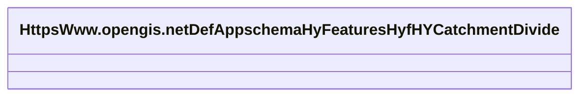

# Class: No class name specified (https___www.opengis.net_def_appschema_hy_features_hyf_HY_CatchmentDivide)


_No class (type) description specified_


URI: [https://www.opengis.net/def/appschema/hy_features/hyf/HY_CatchmentDivide](https://www.opengis.net/def/appschema/hy_features/hyf/HY_CatchmentDivide)





<!-- no inheritance hierarchy -->


## Slots

| Name | Cardinality and Range | Description | Inheritance |
| ---  | --- | --- | --- |


## Usages

| used by | used in | type | used |
| ---  | --- | --- | --- |
| [HttpsWww.opengis.netDefAppschemaHyFeaturesHyfHYCatchment](../classes/HttpsWww.opengis.netDefAppschemaHyFeaturesHyfHYCatchment.md) | [https___www.opengis.net_def_appschema_hy_features_hyf_catchmentRealization](../slots/https___www.opengis.net_def_appschema_hy_features_hyf_catchmentRealization.md) | any_of[range] | [HttpsWww.opengis.netDefAppschemaHyFeaturesHyfHYCatchmentDivide](../classes/HttpsWww.opengis.netDefAppschemaHyFeaturesHyfHYCatchmentDivide.md) |


## Examples

| Value |
| --- |
| https://geoconnex.us/SELFIE/usgs/hucboundary/huc12obs/070900020601 |


## Identifier and Mapping Information


### Schema Source


* from schema: geoconnex


## Mappings

| Mapping Type | Mapped Value |
| ---  | ---  |
| self | https://www.opengis.net/def/appschema/hy_features/hyf/HY_CatchmentDivide |
| native | geoconnex/:HttpsWww.opengis.netDefAppschemaHyFeaturesHyfHYCatchmentDivide |


## LinkML Source

<!-- TODO: investigate https://stackoverflow.com/questions/37606292/how-to-create-tabbed-code-blocks-in-mkdocs-or-sphinx -->

### Direct

<details>
```yaml
name: https___www.opengis.net_def_appschema_hy_features_hyf_HY_CatchmentDivide
conforms_to: No schema conformance document specified
description: No class (type) description specified
title: No class name specified
notes:
- Class with 1 occurrences.
examples:
- value: https://geoconnex.us/SELFIE/usgs/hucboundary/huc12obs/070900020601
from_schema: geoconnex
rank: 1000
class_uri: https://www.opengis.net/def/appschema/hy_features/hyf/HY_CatchmentDivide

```
</details>

### Induced

<details>
```yaml
name: https___www.opengis.net_def_appschema_hy_features_hyf_HY_CatchmentDivide
conforms_to: No schema conformance document specified
description: No class (type) description specified
title: No class name specified
notes:
- Class with 1 occurrences.
examples:
- value: https://geoconnex.us/SELFIE/usgs/hucboundary/huc12obs/070900020601
from_schema: geoconnex
rank: 1000
class_uri: https://www.opengis.net/def/appschema/hy_features/hyf/HY_CatchmentDivide

```
</details>