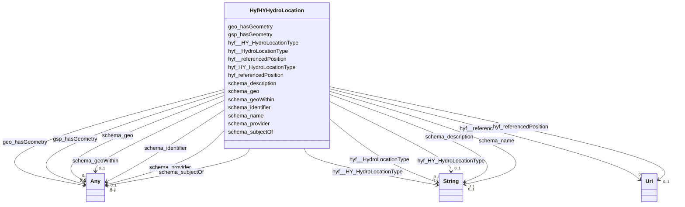

# Class: No class (type) name specified (hyf__HY_HydroLocation)


_No class (type) description specified_


URI: [hyf:/HY_HydroLocation](https://www.opengis.net/def/schema/hy_features/hyf/HY_HydroLocation)





<!-- no inheritance hierarchy -->


## Slots

| Name | Cardinality and Range | Description | Inheritance |
| ---  | --- | --- | --- |
| [geo_hasGeometry](../slots/geo_hasGeometry.md) | 0..1 <br/> [Sf#LineString](../classes/Sf#LineString.md)&nbsp;or&nbsp;<br />[Sf#Point](../classes/Sf#Point.md)&nbsp;or&nbsp;<br />[Sf#GeometryCollection](../classes/Sf#GeometryCollection.md)&nbsp;or&nbsp;<br />[Sf#MultiPolygon](../classes/Sf#MultiPolygon.md)&nbsp;or&nbsp;<br />[Sf#Polygon](../classes/Sf#Polygon.md) | No slot (predicate) description specified <br/> 319697 occurrences with subject type schema_Place and object type sf_#MultiPolygon.<br/>101786 occurrences with subject type schema_Place and object type sf_#LineString.<br/>32790 occurrences with subject type schema_Place and object type sf_#Polygon.<br/>200617 occurrences with subject type schema_Place and object type sf_#Point.<br/>387017 occurrences with subject type hyf__HY_HydroLocation and object type sf_#Point.<br/>10247 occurrences with subject type http___www.opengeospatial.org_standards_waterml2_hy_features_HY_HydroLocation and object type sf_#Point.<br/>5 occurrences with subject type schema_Place and object type sf_#GeometryCollection. | direct |
| [schema_name](../slots/schema_name.md) | 0..1 <br/> [xsd:string](xsd:string) | No slot (predicate) description specified <br/> 28216 occurrences with subject type schema_Dataset and object type string.<br/>56432 occurrences with subject type schema_DataDownload and object type string.<br/>41703 occurrences with subject type schema_GovernmentOrganization and object type string.<br/>28216 occurrences with subject type schema_PropertyValue and object type string.<br/>45727 occurrences with untyped subjects and object type string.<br/>243268 occurrences with subject type schema_Place and object type string.<br/>201357 occurrences with subject type hyf__HY_HydroLocation and object type string.<br/>2741 occurrences with subject type http___www.opengeospatial.org_standards_waterml2_hy_features_HY_HydroLocation and object type string.<br/>247 occurrences with subject type schema_Organization and object type string.<br/>165029 occurrences with subject type schema_CreativeWork and object type string. | direct |
| [schema_geo](../slots/schema_geo.md) | 0..1 <br/> [SchemaGeoShape](../classes/SchemaGeoShape.md)&nbsp;or&nbsp;<br />[xsd:anyURI](xsd:anyURI)&nbsp;or&nbsp;<br />[SchemaGeoCoordinates](../classes/SchemaGeoCoordinates.md) | No slot (predicate) description specified <br/> 427661 occurrences with subject type schema_Place and object type schema_GeoShape.<br/>1944 occurrences with subject type schema_Place and object type uri.<br/>6 occurrences with untyped subjects and object type schema:GeoCoordinates.<br/>200804 occurrences with subject type schema_Place and object type schema_GeoCoordinates.<br/>10247 occurrences with subject type http___www.opengeospatial.org_standards_waterml2_hy_features_HY_HydroLocation and object type schema_GeoCoordinates.<br/>385003 occurrences with subject type hyf__HY_HydroLocation and object type schema_GeoCoordinates. | direct |
| [hyf_referencedPosition](../slots/hyf_referencedPosition.md) | 0..1 <br/> [xsd:anyURI](xsd:anyURI) | No slot (predicate) description specified <br/> 10 occurrences with subject type hyf__HY_HydroLocation and object type uri. | direct |
| [schema_provider](../slots/schema_provider.md) | 0..1 <br/> [xsd:anyURI](xsd:anyURI)&nbsp;or&nbsp;<br />[SchemaGovernmentOrganization](../classes/SchemaGovernmentOrganization.md)&nbsp;or&nbsp;<br />[schema_url](../slots/schema_url.md) | No slot (predicate) description specified <br/> 28216 occurrences with subject type schema_Dataset and object type schema_GovernmentOrganization.<br/>1 occurrences with subject type http___rdfs.org_ns_void#Dataset and object type uri.<br/>2 occurrences with subject type rdfs_Resource and object type uri.<br/>98534 occurrences with subject type schema_Place and object type schema_url.<br/>185872 occurrences with subject type hyf__HY_HydroLocation and object type uri.<br/>13487 occurrences with subject type hyf__HY_HydroLocation and object type schema_GovernmentOrganization. | direct |
| [hyf__HY_HydroLocationType](../slots/hyf__HY_HydroLocationType.md) | 0..1 <br/> [xsd:string](xsd:string) | No slot (predicate) description specified <br/> 187886 occurrences with subject type hyf__HY_HydroLocation and object type string. | direct |
| [schema_description](../slots/schema_description.md) | 0..1 <br/> [xsd:string](xsd:string) | No slot (predicate) description specified <br/> 28216 occurrences with subject type schema_Dataset and object type string.<br/>28217 occurrences with subject type schema_PropertyValue and object type string.<br/>17510 occurrences with untyped subjects and object type string.<br/>187886 occurrences with subject type hyf__HY_HydroLocation and object type string.<br/>107289 occurrences with subject type schema_Place and object type string. | direct |
| [schema_identifier](../slots/schema_identifier.md) | 0..1 <br/> [xsd:string](xsd:string)&nbsp;or&nbsp;<br />[SchemaPropertyValue](../classes/SchemaPropertyValue.md) | No slot (predicate) description specified <br/> 40988 occurrences with subject type http___www.opengeospatial.org_standards_waterml2_hy_features_HY_HydroLocation and object type schema_PropertyValue.<br/>247 occurrences with subject type schema_Organization and object type schema_PropertyValue.<br/>165029 occurrences with subject type schema_CreativeWork and object type string.<br/>13487 occurrences with subject type hyf__HY_HydroLocation and object type schema_PropertyValue. | direct |
| [schema_geoWithin](../slots/schema_geoWithin.md) | 0..1 <br/> [xsd:anyURI](xsd:anyURI)&nbsp;or&nbsp;<br />[xsd:string](xsd:string)&nbsp;or&nbsp;<br />[SchemaPlace](../classes/SchemaPlace.md) | No slot (predicate) description specified <br/> 53554 occurrences with subject type schema_Place and object type schema_Place.<br/>2536 occurrences with subject type schema_Place and object type uri.<br/>2014 occurrences with subject type hyf__HY_HydroLocation and object type string.<br/>3416 occurrences with subject type http___www.opengeospatial.org_standards_waterml2_hy_features_HY_HydroLocation and object type schema_Place.<br/>3075 occurrences with subject type http___www.opengeospatial.org_standards_waterml2_hy_features_HY_HydroLocation and object type uri. | direct |
| [hyf__referencedPosition](../slots/hyf__referencedPosition.md) | 0..1 <br/> [xsd:anyURI](xsd:anyURI) | No slot (predicate) description specified <br/> 481919 occurrences with subject type hyf__HY_HydroLocation and object type uri. | direct |
| [hyf_HY_HydroLocationType](../slots/hyf_HY_HydroLocationType.md) | 0..1 <br/> [xsd:string](xsd:string) | No slot (predicate) description specified <br/> 42 occurrences with subject type hyf__HY_HydroLocation and object type string.<br/>1617371 occurrences with subject type http___www.opengeospatial.org_standards_waterml2_hy_features_HY_HydroLocation and object type string. | direct |
| [schema_subjectOf](../slots/schema_subjectOf.md) | 0..1 <br/> [SchemaDataset](../classes/SchemaDataset.md)&nbsp;or&nbsp;<br />[xsd:anyURI](xsd:anyURI) | No slot (predicate) description specified <br/> 78891 occurrences with subject type schema_Place and object type uri.<br/>8804 occurrences with subject type http___www.opengeospatial.org_standards_waterml2_hy_features_HY_HydroLocation and object type uri.<br/>185645 occurrences with subject type hyf__HY_HydroLocation and object type uri.<br/>28216 occurrences with subject type hyf__HY_HydroLocation and object type schema_Dataset. | direct |
| [hyf__HydroLocationType](../slots/hyf__HydroLocationType.md) | 0..1 <br/> [xsd:string](xsd:string) | No slot (predicate) description specified <br/> 13471 occurrences with subject type hyf__HY_HydroLocation and object type string. | direct |
| [gsp_hasGeometry](../slots/gsp_hasGeometry.md) | 0..1 <br/> [Sf#Point](../classes/Sf#Point.md)&nbsp;or&nbsp;<br />[Sf#Polygon](../classes/Sf#Polygon.md)&nbsp;or&nbsp;<br />[Sf#MultiPolygon](../classes/Sf#MultiPolygon.md) | No slot (predicate) description specified <br/> 187 occurrences with subject type schema_Place and object type sf_#Point.<br/>77 occurrences with subject type hyf__HY_HydroLocation and object type sf_#Point.<br/>353 occurrences with subject type schema_Place and object type sf_#MultiPolygon.<br/>171 occurrences with subject type schema_Place and object type sf_#Polygon. | direct |


## Identifier and Mapping Information


### Schema Source


* from schema: geoconnex


## Mappings

| Mapping Type | Mapped Value |
| ---  | ---  |
| self | hyf:/HY_HydroLocation |
| native | geoconnex/:HyfHYHydroLocation |


## LinkML Source

<!-- TODO: investigate https://stackoverflow.com/questions/37606292/how-to-create-tabbed-code-blocks-in-mkdocs-or-sphinx -->

### Direct

<details>
```yaml
name: hyf__HY_HydroLocation
conforms_to: No schema conformance document specified
description: No class (type) description specified
title: No class (type) name specified
notes:
- Class with 201357 occurrences.
from_schema: geoconnex
rank: 1000
slots:
- geo_hasGeometry
- schema_name
- schema_geo
- hyf_referencedPosition
- schema_provider
- hyf__HY_HydroLocationType
- schema_description
- schema_identifier
- schema_geoWithin
- hyf__referencedPosition
- hyf_HY_HydroLocationType
- schema_subjectOf
- hyf__HydroLocationType
- gsp_hasGeometry
class_uri: hyf:/HY_HydroLocation

```
</details>

### Induced

<details>
```yaml
name: hyf__HY_HydroLocation
conforms_to: No schema conformance document specified
description: No class (type) description specified
title: No class (type) name specified
notes:
- Class with 201357 occurrences.
from_schema: geoconnex
rank: 1000
attributes:
  geo_hasGeometry:
    name: geo_hasGeometry
    description: No slot (predicate) description specified
    comments:
    - 319697 occurrences with subject type schema_Place and object type sf_#MultiPolygon.
    - 101786 occurrences with subject type schema_Place and object type sf_#LineString.
    - 32790 occurrences with subject type schema_Place and object type sf_#Polygon.
    - 200617 occurrences with subject type schema_Place and object type sf_#Point.
    - 387017 occurrences with subject type hyf__HY_HydroLocation and object type sf_#Point.
    - 10247 occurrences with subject type http___www.opengeospatial.org_standards_waterml2_hy_features_HY_HydroLocation
      and object type sf_#Point.
    - 5 occurrences with subject type schema_Place and object type sf_#GeometryCollection.
    examples:
    - description: schema_Place → sf_#MultiPolygon
      object:
        example_object: https://gleaner.io/xid/genid/crht3s93cv0c73e1d15g
        example_predicate: geo:hasGeometry
        example_subject: https://geoconnex.us/ref/ua10/98263
    - description: schema_Place → sf_#LineString
      object:
        example_object: https://gleaner.io/xid/genid/cks4khsip8tc7lvlbq90
        example_predicate: geo:hasGeometry
        example_subject: https://geoconnex.us/ref/mainstems/99895
    - description: schema_Place → sf_#Polygon
      object:
        example_object: _:b783557
        example_predicate: geo:hasGeometry
        example_subject: https://geoconnex.us/ref/pws/WY5680103
    - description: schema_Place → sf_#Point
      object:
        example_object: _:b842331
        example_predicate: geo:hasGeometry
        example_subject: https://sta.geoconnex.dev/collections/WQIE-WQP/Datastreams/items/'007ab627-00bf-f48c-a27c-d1af60f4e3c6'
    - description: hyf__HY_HydroLocation → sf_#Point
      object:
        example_object: _:b850485
        example_predicate: geo:hasGeometry
        example_subject: https://sta.geoconnex.dev/collections/USGS/Things/items/'USNWS-390855089210900'
    - description: http___www.opengeospatial.org_standards_waterml2_hy_features_HY_HydroLocation
        → sf_#Point
      object:
        example_object: https://gleaner.io/xid/genid/ckh8pd4ip8t5ksin2050
        example_predicate: geo:hasGeometry
        example_subject: https://geoconnex.us/ornl/hydrosource/dams/999
    - description: schema_Place → sf_#GeometryCollection
      object:
        example_object: _:b163095
        example_predicate: geo:hasGeometry
        example_subject: https://geoconnex.us/ref/pws/SC0720003
    from_schema: geoconnex
    rank: 1000
    slot_uri: geo:hasGeometry
    alias: geo_hasGeometry
    owner: hyf__HY_HydroLocation
    domain_of:
    - http___www.opengeospatial.org_standards_waterml2_hy_features_HY_HydroLocation
    - hyf__HY_HydroLocation
    - schema_Place
    range: Any
    any_of:
    - range: sf_#LineString
    - range: sf_#Point
    - range: sf_#GeometryCollection
    - range: sf_#MultiPolygon
    - range: sf_#Polygon
  schema_name:
    name: schema_name
    description: No slot (predicate) description specified
    comments:
    - 28216 occurrences with subject type schema_Dataset and object type string.
    - 56432 occurrences with subject type schema_DataDownload and object type string.
    - 41703 occurrences with subject type schema_GovernmentOrganization and object
      type string.
    - 28216 occurrences with subject type schema_PropertyValue and object type string.
    - 45727 occurrences with untyped subjects and object type string.
    - 243268 occurrences with subject type schema_Place and object type string.
    - 201357 occurrences with subject type hyf__HY_HydroLocation and object type string.
    - 2741 occurrences with subject type http___www.opengeospatial.org_standards_waterml2_hy_features_HY_HydroLocation
      and object type string.
    - 247 occurrences with subject type schema_Organization and object type string.
    - 165029 occurrences with subject type schema_CreativeWork and object type string.
    examples:
    - description: schema_Dataset → string
      object:
        example_object: USGS-293229091230800
        example_predicate: schema:name
        example_subject: _:b1000000
    - description: schema_DataDownload → string
      object:
        example_object: USGS SensorThings API
        example_predicate: schema:name
        example_subject: _:b1000004
    - description: schema_GovernmentOrganization → string
      object:
        example_object: U.S. Geological Survey Water Data for the Nation
        example_predicate: schema:name
        example_subject: _:b1000006
    - description: schema_PropertyValue → string
      object:
        example_object: Gage height
        example_predicate: schema:name
        example_subject: _:b1000007
    - description: None → string
      object:
        example_object: Mancos River at Anitas Flat Below Mancos CO
        example_predicate: schema:name
        example_subject: _:b1548067
    - description: schema_Place → string
      object:
        example_object: New England Region
        example_predicate: schema:name
        example_subject: https://geoconnex.us/ref/hu02/01
    - description: hyf__HY_HydroLocation → string
      object:
        example_object: BIG CREEK
        example_predicate: schema:name
        example_subject: https://geoconnex.us/iow/demo/AL00017
    - description: http___www.opengeospatial.org_standards_waterml2_hy_features_HY_HydroLocation
        → string
      object:
        example_object: ALCOVA
        example_predicate: schema:name
        example_subject: https://geoconnex.us/ornl/hydrosource/dams/1
    - description: schema_Organization → string
      object:
        example_object: CUAHSI_CUAHSI_HIS_CRWA_ids__0
        example_predicate: schema:name
        example_subject: https://gleaner.io/id/org/CUAHSI_CUAHSI_HIS_CRWA_ids__0
    - description: schema_CreativeWork → string
      object:
        example_object: HUC12 Pour Points
        example_predicate: schema:name
        example_subject: https://gleaner.io/xid/genid/cksjodsip8t6t2qulttg
    from_schema: geoconnex
    rank: 1000
    slot_uri: schema:name
    alias: schema_name
    owner: hyf__HY_HydroLocation
    domain_of:
    - http___www.opengeospatial.org_standards_waterml2_hy_features_HY_HydroLocation
    - hyf__HY_HydroLocation
    - schema_CreativeWork
    - schema_DataDownload
    - schema_Dataset
    - schema_GovernmentOrganization
    - schema_Organization
    - schema_Place
    - schema_PropertyValue
    range: string
  schema_geo:
    name: schema_geo
    description: No slot (predicate) description specified
    comments:
    - 427661 occurrences with subject type schema_Place and object type schema_GeoShape.
    - 1944 occurrences with subject type schema_Place and object type uri.
    - 6 occurrences with untyped subjects and object type schema:GeoCoordinates.
    - 200804 occurrences with subject type schema_Place and object type schema_GeoCoordinates.
    - 10247 occurrences with subject type http___www.opengeospatial.org_standards_waterml2_hy_features_HY_HydroLocation
      and object type schema_GeoCoordinates.
    - 385003 occurrences with subject type hyf__HY_HydroLocation and object type schema_GeoCoordinates.
    examples:
    - description: schema_Place → schema_GeoShape
      object:
        example_object: https://gleaner.io/xid/genid/crht3s93cv0c73e1d160
        example_predicate: schema:geo
        example_subject: https://geoconnex.us/ref/ua10/98263
    - description: schema_Place → uri
      object:
        example_object: _:b1546204
        example_predicate: schema:geo
        example_subject: https://geoconnex.us/ref/hu02/01
    - description: None → schema_GeoCoordinates
      object:
        example_object: https://gleaner.io/xid/genid/cl2fdb4ip8tadg8qd0u0
        example_predicate: schema:geo
        example_subject: https://gleaner.io/xid/genid/cl2fdb4ip8tadg8qd0ug
    - description: schema_Place → schema_GeoCoordinates
      object:
        example_object: _:b842332
        example_predicate: schema:geo
        example_subject: https://sta.geoconnex.dev/collections/WQIE-WQP/Datastreams/items/'007ab627-00bf-f48c-a27c-d1af60f4e3c6'
    - description: http___www.opengeospatial.org_standards_waterml2_hy_features_HY_HydroLocation
        → schema_GeoCoordinates
      object:
        example_object: https://gleaner.io/xid/genid/ckh8pd4ip8t5ksin205g
        example_predicate: schema:geo
        example_subject: https://geoconnex.us/ornl/hydrosource/dams/999
    - description: hyf__HY_HydroLocation → schema_GeoCoordinates
      object:
        example_object: _:b850486
        example_predicate: schema:geo
        example_subject: https://sta.geoconnex.dev/collections/USGS/Things/items/'USNWS-390855089210900'
    from_schema: geoconnex
    rank: 1000
    slot_uri: schema:geo
    alias: schema_geo
    owner: hyf__HY_HydroLocation
    domain_of:
    - http___www.opengeospatial.org_standards_waterml2_hy_features_HY_HydroLocation
    - hyf__HY_HydroLocation
    - schema_Place
    range: Any
    any_of:
    - range: schema_GeoShape
    - range: uri
    - range: schema_GeoCoordinates
  hyf_referencedPosition:
    name: hyf_referencedPosition
    description: No slot (predicate) description specified
    comments:
    - 10 occurrences with subject type hyf__HY_HydroLocation and object type uri.
    examples:
    - description: hyf__HY_HydroLocation → uri
      object:
        example_object: _:b1064787
        example_predicate: hyf:referencedPosition
        example_subject: https://geoconnex.us/ref/gages/1030898
    from_schema: geoconnex
    rank: 1000
    slot_uri: hyf:referencedPosition
    alias: hyf_referencedPosition
    owner: hyf__HY_HydroLocation
    domain_of:
    - hyf__HY_HydroLocation
    range: uri
  schema_provider:
    name: schema_provider
    description: No slot (predicate) description specified
    comments:
    - 28216 occurrences with subject type schema_Dataset and object type schema_GovernmentOrganization.
    - 1 occurrences with subject type http___rdfs.org_ns_void#Dataset and object type
      uri.
    - 2 occurrences with subject type rdfs_Resource and object type uri.
    - 98534 occurrences with subject type schema_Place and object type schema_url.
    - 185872 occurrences with subject type hyf__HY_HydroLocation and object type uri.
    - 13487 occurrences with subject type hyf__HY_HydroLocation and object type schema_GovernmentOrganization.
    examples:
    - description: schema_Dataset → schema_GovernmentOrganization
      object:
        example_object: https://gleaner.io/xid/genid/cri6355vd7os738ck6h0
        example_predicate: schema:provider
        example_subject: https://gleaner.io/xid/genid/cri6355vd7os738ck6jg
    - description: http___rdfs.org_ns_void#Dataset → uri
      object:
        example_object: https://labs.waterdata.usgs.gov
        example_predicate: schema:provider
        example_subject: https://info.geoconnex.us/chyld-pilot/data/node/all
    - description: rdfs_Resource → uri
      object:
        example_object: https://labs.waterdata.usgs.gov
        example_predicate: schema:provider
        example_subject: https://info.geoconnex.us/chyld-pilot/data/node/connect
    - description: schema_Place → schema_url
      object:
        example_object: https://nid.usace.army.mil
        example_predicate: schema:provider
        example_subject: https://geoconnex.us/ref/dams/1000001
    - description: hyf__HY_HydroLocation → uri
      object:
        example_object: https://waterdata.usgs.gov
        example_predicate: schema:provider
        example_subject: https://geoconnex.us/ref/gages/1000001
    - description: hyf__HY_HydroLocation → schema_GovernmentOrganization
      object:
        example_object: _:b850488
        example_predicate: schema:provider
        example_subject: https://sta.geoconnex.dev/collections/USGS/Things/items/'USNWS-390855089210900'
    from_schema: geoconnex
    rank: 1000
    slot_uri: schema:provider
    alias: schema_provider
    owner: hyf__HY_HydroLocation
    domain_of:
    - http___rdfs.org_ns_void#Dataset
    - hyf__HY_HydroLocation
    - rdfs_Resource
    - schema_Dataset
    - schema_Place
    range: Any
    any_of:
    - range: uri
    - range: schema_GovernmentOrganization
    - range: schema_url
  hyf__HY_HydroLocationType:
    name: hyf__HY_HydroLocationType
    description: No slot (predicate) description specified
    comments:
    - 187886 occurrences with subject type hyf__HY_HydroLocation and object type string.
    examples:
    - description: hyf__HY_HydroLocation → string
      object:
        example_object: hydrometricStation
        example_predicate: hyf:/HY_HydroLocationType
        example_subject: https://geoconnex.us/iow/demo/AL00017
    from_schema: geoconnex
    rank: 1000
    slot_uri: hyf:/HY_HydroLocationType
    alias: hyf__HY_HydroLocationType
    owner: hyf__HY_HydroLocation
    domain_of:
    - hyf__HY_HydroLocation
    range: string
  schema_description:
    name: schema_description
    description: No slot (predicate) description specified
    comments:
    - 28216 occurrences with subject type schema_Dataset and object type string.
    - 28217 occurrences with subject type schema_PropertyValue and object type string.
    - 17510 occurrences with untyped subjects and object type string.
    - 187886 occurrences with subject type hyf__HY_HydroLocation and object type string.
    - 107289 occurrences with subject type schema_Place and object type string.
    examples:
    - description: schema_Dataset → string
      object:
        example_object: Temperature, water / USGS-293229091230800-40caf7117fe1485c9263289eb6b6205d
        example_predicate: schema:description
        example_subject: _:b1000000
    - description: schema_PropertyValue → string
      object:
        example_object: Gage height in ft
        example_predicate: schema:description
        example_subject: _:b1000007
    - description: None → string
      object:
        example_object: Location of well where measurements are made
        example_predicate: schema:description
        example_subject: https://gleaner.io/xid/genid/ckt9vv4ip8t5kr9ueha0
    - description: hyf__HY_HydroLocation → string
      object:
        example_object: Monitoring Location at BIG CREEK
        example_predicate: schema:description
        example_subject: https://geoconnex.us/iow/demo/AL00017
    - description: schema_Place → string
      object:
        example_object: Well drilled or set into subsurface for the purposes of pumping
          water or monitoring groundwater
        example_predicate: schema:description
        example_subject: https://geoconnex.us/nmwdi/st/locations/1
    from_schema: geoconnex
    rank: 1000
    slot_uri: schema:description
    alias: schema_description
    owner: hyf__HY_HydroLocation
    domain_of:
    - hyf__HY_HydroLocation
    - schema_Dataset
    - schema_Place
    - schema_PropertyValue
    range: string
  schema_identifier:
    name: schema_identifier
    description: No slot (predicate) description specified
    comments:
    - 40988 occurrences with subject type http___www.opengeospatial.org_standards_waterml2_hy_features_HY_HydroLocation
      and object type schema_PropertyValue.
    - 247 occurrences with subject type schema_Organization and object type schema_PropertyValue.
    - 165029 occurrences with subject type schema_CreativeWork and object type string.
    - 13487 occurrences with subject type hyf__HY_HydroLocation and object type schema_PropertyValue.
    examples:
    - description: http___www.opengeospatial.org_standards_waterml2_hy_features_HY_HydroLocation
        → schema_PropertyValue
      object:
        example_object: https://gleaner.io/xid/genid/ckh8pd4ip8t5ksin207g
        example_predicate: schema:identifier
        example_subject: https://geoconnex.us/ornl/hydrosource/dams/999
    - description: schema_Organization → schema_PropertyValue
      object:
        example_object: https://gleaner.io/genid/geoconnex
        example_predicate: schema:identifier
        example_subject: https://gleaner.io/id/org/wade_wade__9
    - description: schema_CreativeWork → string
      object:
        example_object: huc12pp
        example_predicate: schema:identifier
        example_subject: https://gleaner.io/xid/genid/cksjodsip8t6t2qulttg
    - description: hyf__HY_HydroLocation → schema_PropertyValue
      object:
        example_object: _:b850487
        example_predicate: schema:identifier
        example_subject: https://sta.geoconnex.dev/collections/USGS/Things/items/'USNWS-390855089210900'
    from_schema: geoconnex
    rank: 1000
    slot_uri: schema:identifier
    alias: schema_identifier
    owner: hyf__HY_HydroLocation
    domain_of:
    - http___www.opengeospatial.org_standards_waterml2_hy_features_HY_HydroLocation
    - hyf__HY_HydroLocation
    - schema_CreativeWork
    - schema_Organization
    range: Any
    any_of:
    - range: string
    - range: schema_PropertyValue
  schema_geoWithin:
    name: schema_geoWithin
    description: No slot (predicate) description specified
    comments:
    - 53554 occurrences with subject type schema_Place and object type schema_Place.
    - 2536 occurrences with subject type schema_Place and object type uri.
    - 2014 occurrences with subject type hyf__HY_HydroLocation and object type string.
    - 3416 occurrences with subject type http___www.opengeospatial.org_standards_waterml2_hy_features_HY_HydroLocation
      and object type schema_Place.
    - 3075 occurrences with subject type http___www.opengeospatial.org_standards_waterml2_hy_features_HY_HydroLocation
      and object type uri.
    examples:
    - description: schema_Place → schema_Place
      object:
        example_object: https://geoconnex.us/ref/states/56
        example_predicate: schema:geoWithin
        example_subject: https://geoconnex.us/ref/pws/WY5680122
    - description: schema_Place → uri
      object:
        example_object: https://geoconnex.us/nhdplusv2/huc12/150301020203
        example_predicate: schema:geoWithin
        example_subject: https://geoconnex.us/ca-gage-assessment/gages/09423350
    - description: hyf__HY_HydroLocation → string
      object:
        example_object: https://geoconnex.us/ref/hu08/03170008
        example_predicate: schema:geoWithin
        example_subject: https://geoconnex.us/iow/demo/AL00017
    - description: http___www.opengeospatial.org_standards_waterml2_hy_features_HY_HydroLocation
        → schema_Place
      object:
        example_object: https://geoconnex.us/ref/states/53
        example_predicate: schema:geoWithin
        example_subject: https://geoconnex.us/ornl/hydrosource/dams/999
    - description: http___www.opengeospatial.org_standards_waterml2_hy_features_HY_HydroLocation
        → uri
      object:
        example_object: https://geoconnex.us/nhdplusv2/huc12/102000000000
        example_predicate: schema:geoWithin
        example_subject: https://geoconnex.us/ornl/hydrosource/dams/1
    from_schema: geoconnex
    rank: 1000
    slot_uri: schema:geoWithin
    alias: schema_geoWithin
    owner: hyf__HY_HydroLocation
    domain_of:
    - http___www.opengeospatial.org_standards_waterml2_hy_features_HY_HydroLocation
    - hyf__HY_HydroLocation
    - schema_Place
    range: Any
    any_of:
    - range: uri
    - range: string
    - range: schema_Place
  hyf__referencedPosition:
    name: hyf__referencedPosition
    description: No slot (predicate) description specified
    comments:
    - 481919 occurrences with subject type hyf__HY_HydroLocation and object type uri.
    examples:
    - description: hyf__HY_HydroLocation → uri
      object:
        example_object: https://gleaner.io/xid/genid/cktus4kip8t1e5gibka0
        example_predicate: hyf:/referencedPosition
        example_subject: https://geoconnex.us/iow/demo/AL00017
    from_schema: geoconnex
    rank: 1000
    slot_uri: hyf:/referencedPosition
    alias: hyf__referencedPosition
    owner: hyf__HY_HydroLocation
    domain_of:
    - hyf__HY_HydroLocation
    range: uri
  hyf_HY_HydroLocationType:
    name: hyf_HY_HydroLocationType
    description: No slot (predicate) description specified
    comments:
    - 42 occurrences with subject type hyf__HY_HydroLocation and object type string.
    - 1617371 occurrences with subject type http___www.opengeospatial.org_standards_waterml2_hy_features_HY_HydroLocation
      and object type string.
    examples:
    - description: hyf__HY_HydroLocation → string
      object:
        example_object: hydrometricStation
        example_predicate: hyf:HY_HydroLocationType
        example_subject: https://geoconnex.us/ref/gages/1000482
    - description: http___www.opengeospatial.org_standards_waterml2_hy_features_HY_HydroLocation
        → string
      object:
        example_object: hydrometricStation
        example_predicate: hyf:HY_HydroLocationType
        example_subject: https://waterdata.usgs.gov/monitoring-location/00000000/
    from_schema: geoconnex
    rank: 1000
    slot_uri: hyf:HY_HydroLocationType
    alias: hyf_HY_HydroLocationType
    owner: hyf__HY_HydroLocation
    domain_of:
    - http___www.opengeospatial.org_standards_waterml2_hy_features_HY_HydroLocation
    - hyf__HY_HydroLocation
    range: string
  schema_subjectOf:
    name: schema_subjectOf
    description: No slot (predicate) description specified
    comments:
    - 78891 occurrences with subject type schema_Place and object type uri.
    - 8804 occurrences with subject type http___www.opengeospatial.org_standards_waterml2_hy_features_HY_HydroLocation
      and object type uri.
    - 185645 occurrences with subject type hyf__HY_HydroLocation and object type uri.
    - 28216 occurrences with subject type hyf__HY_HydroLocation and object type schema_Dataset.
    examples:
    - description: schema_Place → uri
      object:
        example_object: https://geonames.usgs.gov/apex/f?p=gnispq:3:::NO::P3_FID:2730131
        example_predicate: schema:subjectOf
        example_subject: https://geoconnex.us/ref/hu02/01
    - description: http___www.opengeospatial.org_standards_waterml2_hy_features_HY_HydroLocation
        → uri
      object:
        example_object: https://hydrosource.ornl.gov/dataset/existing-hydropower-assets-eha-capacity-factor-plant-database-2005-2019
        example_predicate: schema:subjectOf
        example_subject: https://geoconnex.us/ornl/hydrosource/dams/1
    - description: hyf__HY_HydroLocation → uri
      object:
        example_object: _:b1159177
        example_predicate: schema:subjectOf
        example_subject: https://geoconnex.us/ref/gages/1000001
    - description: hyf__HY_HydroLocation → schema_Dataset
      object:
        example_object: _:b939199
        example_predicate: schema:subjectOf
        example_subject: https://sta.geoconnex.dev/collections/USGS/Things/items/'USGS-625632151172901'
    from_schema: geoconnex
    rank: 1000
    slot_uri: schema:subjectOf
    alias: schema_subjectOf
    owner: hyf__HY_HydroLocation
    domain_of:
    - http___www.opengeospatial.org_standards_waterml2_hy_features_HY_HydroLocation
    - hyf__HY_HydroLocation
    - schema_Place
    range: Any
    any_of:
    - range: schema_Dataset
    - range: uri
  hyf__HydroLocationType:
    name: hyf__HydroLocationType
    description: No slot (predicate) description specified
    comments:
    - 13471 occurrences with subject type hyf__HY_HydroLocation and object type string.
    examples:
    - description: hyf__HY_HydroLocation → string
      object:
        example_object: Well
        example_predicate: hyf:/HydroLocationType
        example_subject: https://sta.geoconnex.dev/collections/USGS/Things/items/'AR008-334933091153501'
    from_schema: geoconnex
    rank: 1000
    slot_uri: hyf:/HydroLocationType
    alias: hyf__HydroLocationType
    owner: hyf__HY_HydroLocation
    domain_of:
    - hyf__HY_HydroLocation
    range: string
  gsp_hasGeometry:
    name: gsp_hasGeometry
    description: No slot (predicate) description specified
    comments:
    - 187 occurrences with subject type schema_Place and object type sf_#Point.
    - 77 occurrences with subject type hyf__HY_HydroLocation and object type sf_#Point.
    - 353 occurrences with subject type schema_Place and object type sf_#MultiPolygon.
    - 171 occurrences with subject type schema_Place and object type sf_#Polygon.
    examples:
    - description: schema_Place → sf_#Point
      object:
        example_object: https://gleaner.io/xid/genid/cl2fibsip8tadg8qd2i0
        example_predicate: gsp:hasGeometry
        example_subject: https://geoconnex.us/ref/dams/1096875
    - description: hyf__HY_HydroLocation → sf_#Point
      object:
        example_object: https://gleaner.io/xid/genid/cl2gf1kip8tadg8qd86g
        example_predicate: gsp:hasGeometry
        example_subject: https://geoconnex.us/ref/gages/1168507
    - description: schema_Place → sf_#MultiPolygon
      object:
        example_object: https://gleaner.io/xid/genid/cl2f8u4ip8tadg8qcvtg
        example_predicate: gsp:hasGeometry
        example_subject: https://geoconnex.us/ref/pws/WI8260121
    - description: schema_Place → sf_#Polygon
      object:
        example_object: https://gleaner.io/xid/genid/cl2gam4ip8tadg8qd740
        example_predicate: gsp:hasGeometry
        example_subject: https://geoconnex.us/ref/pws/WV3303609
    from_schema: geoconnex
    rank: 1000
    slot_uri: gsp:hasGeometry
    alias: gsp_hasGeometry
    owner: hyf__HY_HydroLocation
    domain_of:
    - hyf__HY_HydroLocation
    - schema_Place
    range: Any
    any_of:
    - range: sf_#Point
    - range: sf_#Polygon
    - range: sf_#MultiPolygon
class_uri: hyf:/HY_HydroLocation

```
</details>