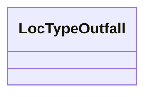

# Class: No class name specified (locType_Outfall)


_No class (type) description specified_


URI: [locType:Outfall](locType:Outfall)





<!-- no inheritance hierarchy -->


## Slots

| Name | Cardinality and Range | Description | Inheritance |
| ---  | --- | --- | --- |


## Examples

| Value |
| --- |
| https://sta.geoconnex.dev/collections/USGS/Things/items/'USGS-02294759' |


## Identifier and Mapping Information


### Schema Source


* from schema: geoconnex


## Mappings

| Mapping Type | Mapped Value |
| ---  | ---  |
| self | locType:Outfall |
| native | geoconnex/:LocTypeOutfall |


## LinkML Source

<!-- TODO: investigate https://stackoverflow.com/questions/37606292/how-to-create-tabbed-code-blocks-in-mkdocs-or-sphinx -->

### Direct

<details>
```yaml
name: locType_Outfall
conforms_to: No schema conformance document specified
description: No class (type) description specified
title: No class name specified
notes:
- Class with 2 occurrences.
examples:
- value: https://sta.geoconnex.dev/collections/USGS/Things/items/'USGS-02294759'
from_schema: geoconnex
rank: 1000
class_uri: locType:Outfall

```
</details>

### Induced

<details>
```yaml
name: locType_Outfall
conforms_to: No schema conformance document specified
description: No class (type) description specified
title: No class name specified
notes:
- Class with 2 occurrences.
examples:
- value: https://sta.geoconnex.dev/collections/USGS/Things/items/'USGS-02294759'
from_schema: geoconnex
rank: 1000
class_uri: locType:Outfall

```
</details>