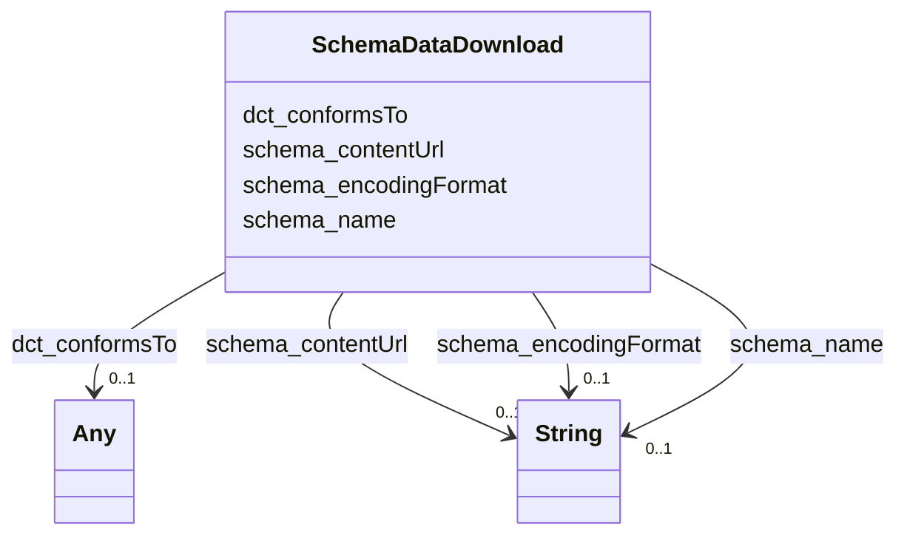

# Class: DataDownload (schema_DataDownload)


_All or part of a [[Dataset]] in downloadable form. _


URI: [schema:DataDownload](https://schema.org/DataDownload)





<!-- no inheritance hierarchy -->


## Slots

| Name | Cardinality and Range | Description | Inheritance |
| ---  | --- | --- | --- |
| [schema_encodingFormat](../slots/schema_encodingFormat.md) | 0..1 <br/> [xsd:string](xsd:string) | No slot (predicate) description specified <br/> 56432 occurrences with subject type schema_DataDownload and object type string. | direct |
| [schema_name](../slots/schema_name.md) | 0..1 <br/> [xsd:string](xsd:string) | No slot (predicate) description specified <br/> 28216 occurrences with subject type schema_Dataset and object type string.<br/>56432 occurrences with subject type schema_DataDownload and object type string.<br/>41703 occurrences with subject type schema_GovernmentOrganization and object type string.<br/>28216 occurrences with subject type schema_PropertyValue and object type string.<br/>45727 occurrences with untyped subjects and object type string.<br/>243268 occurrences with subject type schema_Place and object type string.<br/>201357 occurrences with subject type hyf__HY_HydroLocation and object type string.<br/>2741 occurrences with subject type http___www.opengeospatial.org_standards_waterml2_hy_features_HY_HydroLocation and object type string.<br/>247 occurrences with subject type schema_Organization and object type string.<br/>165029 occurrences with subject type schema_CreativeWork and object type string. | direct |
| [dct_conformsTo](../slots/dct_conformsTo.md) | 0..1 <br/> [xsd:anyURI](xsd:anyURI)&nbsp;or&nbsp;<br />[xsd:string](xsd:string) | No slot (predicate) description specified <br/> 56432 occurrences with subject type schema_DataDownload and object type string.<br/>3194 occurrences with untyped subjects and object type uri.<br/>2 occurrences with subject type http___rdfs.org_ns_void#Dataset and object type uri.<br/>4 occurrences with subject type rdfs_Resource and object type uri. | direct |
| [schema_contentUrl](../slots/schema_contentUrl.md) | 0..1 <br/> [xsd:string](xsd:string) | No slot (predicate) description specified <br/> 56432 occurrences with subject type schema_DataDownload and object type string. | direct |


## Usages

| used by | used in | type | used |
| ---  | --- | --- | --- |
| [SchemaDataset](../classes/SchemaDataset.md) | [schema_distribution](../slots/schema_distribution.md) | range | [SchemaDataDownload](../classes/SchemaDataDownload.md) |


## Identifier and Mapping Information


### Schema Source


* from schema: geoconnex


## Mappings

| Mapping Type | Mapped Value |
| ---  | ---  |
| self | schema:DataDownload |
| native | geoconnex/:SchemaDataDownload |


## LinkML Source

<!-- TODO: investigate https://stackoverflow.com/questions/37606292/how-to-create-tabbed-code-blocks-in-mkdocs-or-sphinx -->

### Direct

<details>
```yaml
name: schema_DataDownload
conforms_to: No schema conformance document specified
description: 'All or part of a [[Dataset]] in downloadable form. '
title: DataDownload
notes:
- Class with 56432 occurrences.
from_schema: geoconnex
rank: 1000
slots:
- schema_encodingFormat
- schema_name
- dct_conformsTo
- schema_contentUrl
class_uri: schema:DataDownload

```
</details>

### Induced

<details>
```yaml
name: schema_DataDownload
conforms_to: No schema conformance document specified
description: 'All or part of a [[Dataset]] in downloadable form. '
title: DataDownload
notes:
- Class with 56432 occurrences.
from_schema: geoconnex
rank: 1000
attributes:
  schema_encodingFormat:
    name: schema_encodingFormat
    description: No slot (predicate) description specified
    comments:
    - 56432 occurrences with subject type schema_DataDownload and object type string.
    examples:
    - description: schema_DataDownload → string
      object:
        example_object: application/json
        example_predicate: schema:encodingFormat
        example_subject: _:b1000004
    from_schema: geoconnex
    rank: 1000
    slot_uri: schema:encodingFormat
    alias: schema_encodingFormat
    owner: schema_DataDownload
    domain_of:
    - schema_DataDownload
    range: string
  schema_name:
    name: schema_name
    description: No slot (predicate) description specified
    comments:
    - 28216 occurrences with subject type schema_Dataset and object type string.
    - 56432 occurrences with subject type schema_DataDownload and object type string.
    - 41703 occurrences with subject type schema_GovernmentOrganization and object
      type string.
    - 28216 occurrences with subject type schema_PropertyValue and object type string.
    - 45727 occurrences with untyped subjects and object type string.
    - 243268 occurrences with subject type schema_Place and object type string.
    - 201357 occurrences with subject type hyf__HY_HydroLocation and object type string.
    - 2741 occurrences with subject type http___www.opengeospatial.org_standards_waterml2_hy_features_HY_HydroLocation
      and object type string.
    - 247 occurrences with subject type schema_Organization and object type string.
    - 165029 occurrences with subject type schema_CreativeWork and object type string.
    examples:
    - description: schema_Dataset → string
      object:
        example_object: USGS-293229091230800
        example_predicate: schema:name
        example_subject: _:b1000000
    - description: schema_DataDownload → string
      object:
        example_object: USGS SensorThings API
        example_predicate: schema:name
        example_subject: _:b1000004
    - description: schema_GovernmentOrganization → string
      object:
        example_object: U.S. Geological Survey Water Data for the Nation
        example_predicate: schema:name
        example_subject: _:b1000006
    - description: schema_PropertyValue → string
      object:
        example_object: Gage height
        example_predicate: schema:name
        example_subject: _:b1000007
    - description: None → string
      object:
        example_object: Mancos River at Anitas Flat Below Mancos CO
        example_predicate: schema:name
        example_subject: _:b1548067
    - description: schema_Place → string
      object:
        example_object: New England Region
        example_predicate: schema:name
        example_subject: https://geoconnex.us/ref/hu02/01
    - description: hyf__HY_HydroLocation → string
      object:
        example_object: BIG CREEK
        example_predicate: schema:name
        example_subject: https://geoconnex.us/iow/demo/AL00017
    - description: http___www.opengeospatial.org_standards_waterml2_hy_features_HY_HydroLocation
        → string
      object:
        example_object: ALCOVA
        example_predicate: schema:name
        example_subject: https://geoconnex.us/ornl/hydrosource/dams/1
    - description: schema_Organization → string
      object:
        example_object: CUAHSI_CUAHSI_HIS_CRWA_ids__0
        example_predicate: schema:name
        example_subject: https://gleaner.io/id/org/CUAHSI_CUAHSI_HIS_CRWA_ids__0
    - description: schema_CreativeWork → string
      object:
        example_object: HUC12 Pour Points
        example_predicate: schema:name
        example_subject: https://gleaner.io/xid/genid/cksjodsip8t6t2qulttg
    from_schema: geoconnex
    rank: 1000
    slot_uri: schema:name
    alias: schema_name
    owner: schema_DataDownload
    domain_of:
    - http___www.opengeospatial.org_standards_waterml2_hy_features_HY_HydroLocation
    - hyf__HY_HydroLocation
    - schema_CreativeWork
    - schema_DataDownload
    - schema_Dataset
    - schema_GovernmentOrganization
    - schema_Organization
    - schema_Place
    - schema_PropertyValue
    range: string
  dct_conformsTo:
    name: dct_conformsTo
    description: No slot (predicate) description specified
    comments:
    - 56432 occurrences with subject type schema_DataDownload and object type string.
    - 3194 occurrences with untyped subjects and object type uri.
    - 2 occurrences with subject type http___rdfs.org_ns_void#Dataset and object type
      uri.
    - 4 occurrences with subject type rdfs_Resource and object type uri.
    examples:
    - description: schema_DataDownload → string
      object:
        example_object: https://labs.waterdata.usgs.gov/docs/sensorthings/index.html
        example_predicate: dct:conformsTo
        example_subject: _:b1000004
    - description: None → uri
      object:
        example_object: https://github.com/NRCan/GSIP
        example_predicate: dct:conformsTo
        example_subject: http://water.usgs.gov/ogw/aquiferbasics/nycarbon.html
    - description: http___rdfs.org_ns_void#Dataset → uri
      object:
        example_object: https://github.com/NRCan/GSIP
        example_predicate: dct:conformsTo
        example_subject: https://info.geoconnex.us/chyld-pilot/data/node/all
    - description: rdfs_Resource → uri
      object:
        example_object: https://github.com/NRCan/GSIP
        example_predicate: dct:conformsTo
        example_subject: https://info.geoconnex.us/chyld-pilot/data/node/connect
    from_schema: geoconnex
    rank: 1000
    slot_uri: dct:conformsTo
    alias: dct_conformsTo
    owner: schema_DataDownload
    domain_of:
    - http___rdfs.org_ns_void#Dataset
    - rdfs_Resource
    - schema_DataDownload
    range: Any
    any_of:
    - range: uri
    - range: string
  schema_contentUrl:
    name: schema_contentUrl
    description: No slot (predicate) description specified
    comments:
    - 56432 occurrences with subject type schema_DataDownload and object type string.
    examples:
    - description: schema_DataDownload → string
      object:
        example_object: https://labs.waterdata.usgs.gov/sta/v1.1/Datastreams('b9c7e441fc154190b69f5dee407b533b')?$expand=Thing,Observations
        example_predicate: schema:contentUrl
        example_subject: _:b1000004
    from_schema: geoconnex
    rank: 1000
    slot_uri: schema:contentUrl
    alias: schema_contentUrl
    owner: schema_DataDownload
    domain_of:
    - schema_DataDownload
    range: string
class_uri: schema:DataDownload

```
</details>