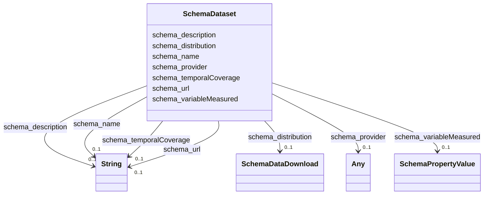

# Class: Dataset (schema_Dataset)


_A body of structured information describing some topic(s) of interest._


URI: [schema:Dataset](https://schema.org/Dataset)





<!-- no inheritance hierarchy -->


## Slots

| Name | Cardinality and Range | Description | Inheritance |
| ---  | --- | --- | --- |
| [schema_name](../slots/schema_name.md) | 0..1 <br/> [xsd:string](xsd:string) | No slot (predicate) description specified <br/> 28216 occurrences with subject type schema_Dataset and object type string.<br/>56432 occurrences with subject type schema_DataDownload and object type string.<br/>41703 occurrences with subject type schema_GovernmentOrganization and object type string.<br/>28216 occurrences with subject type schema_PropertyValue and object type string.<br/>45727 occurrences with untyped subjects and object type string.<br/>243268 occurrences with subject type schema_Place and object type string.<br/>201357 occurrences with subject type hyf__HY_HydroLocation and object type string.<br/>2741 occurrences with subject type http___www.opengeospatial.org_standards_waterml2_hy_features_HY_HydroLocation and object type string.<br/>247 occurrences with subject type schema_Organization and object type string.<br/>165029 occurrences with subject type schema_CreativeWork and object type string. | direct |
| [schema_variableMeasured](../slots/schema_variableMeasured.md) | 0..1 <br/> [SchemaPropertyValue](../classes/SchemaPropertyValue.md) | No slot (predicate) description specified <br/> 28216 occurrences with subject type schema_Dataset and object type schema_PropertyValue. | direct |
| [schema_provider](../slots/schema_provider.md) | 0..1 <br/> [xsd:anyURI](xsd:anyURI)&nbsp;or&nbsp;<br />[SchemaGovernmentOrganization](../classes/SchemaGovernmentOrganization.md)&nbsp;or&nbsp;<br />[schema_url](../slots/schema_url.md) | No slot (predicate) description specified <br/> 28216 occurrences with subject type schema_Dataset and object type schema_GovernmentOrganization.<br/>1 occurrences with subject type http___rdfs.org_ns_void#Dataset and object type uri.<br/>2 occurrences with subject type rdfs_Resource and object type uri.<br/>98534 occurrences with subject type schema_Place and object type schema_url.<br/>185872 occurrences with subject type hyf__HY_HydroLocation and object type uri.<br/>13487 occurrences with subject type hyf__HY_HydroLocation and object type schema_GovernmentOrganization. | direct |
| [schema_temporalCoverage](../slots/schema_temporalCoverage.md) | 0..1 <br/> [xsd:string](xsd:string) | No slot (predicate) description specified <br/> 28169 occurrences with subject type schema_Dataset and object type string. | direct |
| [schema_url](../slots/schema_url.md) | 0..1 <br/> [xsd:string](xsd:string) | No slot (predicate) description specified <br/> 28216 occurrences with subject type schema_Dataset and object type string.<br/>41703 occurrences with subject type schema_GovernmentOrganization and object type string.<br/>28217 occurrences with subject type schema_PropertyValue and object type string.<br/>185722 occurrences with untyped subjects and object type string.<br/>2535 occurrences with subject type schema_Place and object type string.<br/>247 occurrences with subject type schema_Organization and object type string. | direct |
| [schema_description](../slots/schema_description.md) | 0..1 <br/> [xsd:string](xsd:string) | No slot (predicate) description specified <br/> 28216 occurrences with subject type schema_Dataset and object type string.<br/>28217 occurrences with subject type schema_PropertyValue and object type string.<br/>17510 occurrences with untyped subjects and object type string.<br/>187886 occurrences with subject type hyf__HY_HydroLocation and object type string.<br/>107289 occurrences with subject type schema_Place and object type string. | direct |
| [schema_distribution](../slots/schema_distribution.md) | 0..1 <br/> [SchemaDataDownload](../classes/SchemaDataDownload.md) | No slot (predicate) description specified <br/> 56432 occurrences with subject type schema_Dataset and object type schema_DataDownload. | direct |


## Usages

| used by | used in | type | used |
| ---  | --- | --- | --- |
| [HttpWww.opengeospatial.orgStandardsWaterml2HyFeaturesHYHydroLocation](../classes/HttpWww.opengeospatial.orgStandardsWaterml2HyFeaturesHYHydroLocation.md) | [schema_subjectOf](../slots/schema_subjectOf.md) | any_of[range] | [SchemaDataset](../classes/SchemaDataset.md) |
| [HyfHYHydroLocation](../classes/HyfHYHydroLocation.md) | [schema_subjectOf](../slots/schema_subjectOf.md) | any_of[range] | [SchemaDataset](../classes/SchemaDataset.md) |
| [SchemaPlace](../classes/SchemaPlace.md) | [schema_subjectOf](../slots/schema_subjectOf.md) | any_of[range] | [SchemaDataset](../classes/SchemaDataset.md) |


## Examples

| Value |
| --- |
| _:b1000000 |


## Identifier and Mapping Information


### Schema Source


* from schema: geoconnex


## Mappings

| Mapping Type | Mapped Value |
| ---  | ---  |
| self | schema:Dataset |
| native | geoconnex/:SchemaDataset |


## LinkML Source

<!-- TODO: investigate https://stackoverflow.com/questions/37606292/how-to-create-tabbed-code-blocks-in-mkdocs-or-sphinx -->

### Direct

<details>
```yaml
name: schema_Dataset
conforms_to: No schema conformance document specified
description: A body of structured information describing some topic(s) of interest.
title: Dataset
notes:
- Class with 28220 occurrences.
examples:
- value: _:b1000000
from_schema: geoconnex
rank: 1000
slots:
- schema_name
- schema_variableMeasured
- schema_provider
- schema_temporalCoverage
- schema_url
- schema_description
- schema_distribution
class_uri: schema:Dataset

```
</details>

### Induced

<details>
```yaml
name: schema_Dataset
conforms_to: No schema conformance document specified
description: A body of structured information describing some topic(s) of interest.
title: Dataset
notes:
- Class with 28220 occurrences.
examples:
- value: _:b1000000
from_schema: geoconnex
rank: 1000
attributes:
  schema_name:
    name: schema_name
    description: No slot (predicate) description specified
    comments:
    - 28216 occurrences with subject type schema_Dataset and object type string.
    - 56432 occurrences with subject type schema_DataDownload and object type string.
    - 41703 occurrences with subject type schema_GovernmentOrganization and object
      type string.
    - 28216 occurrences with subject type schema_PropertyValue and object type string.
    - 45727 occurrences with untyped subjects and object type string.
    - 243268 occurrences with subject type schema_Place and object type string.
    - 201357 occurrences with subject type hyf__HY_HydroLocation and object type string.
    - 2741 occurrences with subject type http___www.opengeospatial.org_standards_waterml2_hy_features_HY_HydroLocation
      and object type string.
    - 247 occurrences with subject type schema_Organization and object type string.
    - 165029 occurrences with subject type schema_CreativeWork and object type string.
    examples:
    - description: schema_Dataset → string
      object:
        example_object: USGS-293229091230800
        example_predicate: schema:name
        example_subject: _:b1000000
    - description: schema_DataDownload → string
      object:
        example_object: USGS SensorThings API
        example_predicate: schema:name
        example_subject: _:b1000004
    - description: schema_GovernmentOrganization → string
      object:
        example_object: U.S. Geological Survey Water Data for the Nation
        example_predicate: schema:name
        example_subject: _:b1000006
    - description: schema_PropertyValue → string
      object:
        example_object: Gage height
        example_predicate: schema:name
        example_subject: _:b1000007
    - description: None → string
      object:
        example_object: Mancos River at Anitas Flat Below Mancos CO
        example_predicate: schema:name
        example_subject: _:b1548067
    - description: schema_Place → string
      object:
        example_object: New England Region
        example_predicate: schema:name
        example_subject: https://geoconnex.us/ref/hu02/01
    - description: hyf__HY_HydroLocation → string
      object:
        example_object: BIG CREEK
        example_predicate: schema:name
        example_subject: https://geoconnex.us/iow/demo/AL00017
    - description: http___www.opengeospatial.org_standards_waterml2_hy_features_HY_HydroLocation
        → string
      object:
        example_object: ALCOVA
        example_predicate: schema:name
        example_subject: https://geoconnex.us/ornl/hydrosource/dams/1
    - description: schema_Organization → string
      object:
        example_object: CUAHSI_CUAHSI_HIS_CRWA_ids__0
        example_predicate: schema:name
        example_subject: https://gleaner.io/id/org/CUAHSI_CUAHSI_HIS_CRWA_ids__0
    - description: schema_CreativeWork → string
      object:
        example_object: HUC12 Pour Points
        example_predicate: schema:name
        example_subject: https://gleaner.io/xid/genid/cksjodsip8t6t2qulttg
    from_schema: geoconnex
    rank: 1000
    slot_uri: schema:name
    alias: schema_name
    owner: schema_Dataset
    domain_of:
    - http___www.opengeospatial.org_standards_waterml2_hy_features_HY_HydroLocation
    - hyf__HY_HydroLocation
    - schema_CreativeWork
    - schema_DataDownload
    - schema_Dataset
    - schema_GovernmentOrganization
    - schema_Organization
    - schema_Place
    - schema_PropertyValue
    range: string
  schema_variableMeasured:
    name: schema_variableMeasured
    description: No slot (predicate) description specified
    comments:
    - 28216 occurrences with subject type schema_Dataset and object type schema_PropertyValue.
    examples:
    - description: schema_Dataset → schema_PropertyValue
      object:
        example_object: https://gleaner.io/xid/genid/cri6355vd7os738ck6hg
        example_predicate: schema:variableMeasured
        example_subject: https://gleaner.io/xid/genid/cri6355vd7os738ck6jg
    from_schema: geoconnex
    rank: 1000
    slot_uri: schema:variableMeasured
    alias: schema_variableMeasured
    owner: schema_Dataset
    domain_of:
    - schema_Dataset
    range: schema_PropertyValue
  schema_provider:
    name: schema_provider
    description: No slot (predicate) description specified
    comments:
    - 28216 occurrences with subject type schema_Dataset and object type schema_GovernmentOrganization.
    - 1 occurrences with subject type http___rdfs.org_ns_void#Dataset and object type
      uri.
    - 2 occurrences with subject type rdfs_Resource and object type uri.
    - 98534 occurrences with subject type schema_Place and object type schema_url.
    - 185872 occurrences with subject type hyf__HY_HydroLocation and object type uri.
    - 13487 occurrences with subject type hyf__HY_HydroLocation and object type schema_GovernmentOrganization.
    examples:
    - description: schema_Dataset → schema_GovernmentOrganization
      object:
        example_object: https://gleaner.io/xid/genid/cri6355vd7os738ck6h0
        example_predicate: schema:provider
        example_subject: https://gleaner.io/xid/genid/cri6355vd7os738ck6jg
    - description: http___rdfs.org_ns_void#Dataset → uri
      object:
        example_object: https://labs.waterdata.usgs.gov
        example_predicate: schema:provider
        example_subject: https://info.geoconnex.us/chyld-pilot/data/node/all
    - description: rdfs_Resource → uri
      object:
        example_object: https://labs.waterdata.usgs.gov
        example_predicate: schema:provider
        example_subject: https://info.geoconnex.us/chyld-pilot/data/node/connect
    - description: schema_Place → schema_url
      object:
        example_object: https://nid.usace.army.mil
        example_predicate: schema:provider
        example_subject: https://geoconnex.us/ref/dams/1000001
    - description: hyf__HY_HydroLocation → uri
      object:
        example_object: https://waterdata.usgs.gov
        example_predicate: schema:provider
        example_subject: https://geoconnex.us/ref/gages/1000001
    - description: hyf__HY_HydroLocation → schema_GovernmentOrganization
      object:
        example_object: _:b850488
        example_predicate: schema:provider
        example_subject: https://sta.geoconnex.dev/collections/USGS/Things/items/'USNWS-390855089210900'
    from_schema: geoconnex
    rank: 1000
    slot_uri: schema:provider
    alias: schema_provider
    owner: schema_Dataset
    domain_of:
    - http___rdfs.org_ns_void#Dataset
    - hyf__HY_HydroLocation
    - rdfs_Resource
    - schema_Dataset
    - schema_Place
    range: Any
    any_of:
    - range: uri
    - range: schema_GovernmentOrganization
    - range: schema_url
  schema_temporalCoverage:
    name: schema_temporalCoverage
    description: No slot (predicate) description specified
    comments:
    - 28169 occurrences with subject type schema_Dataset and object type string.
    examples:
    - description: schema_Dataset → string
      object:
        example_object: 2024-08-30T10:00:00Z/2024-09-09T18:00:00Z
        example_predicate: schema:temporalCoverage
        example_subject: _:b1000000
    from_schema: geoconnex
    rank: 1000
    slot_uri: schema:temporalCoverage
    alias: schema_temporalCoverage
    owner: schema_Dataset
    domain_of:
    - schema_Dataset
    range: string
  schema_url:
    name: schema_url
    description: No slot (predicate) description specified
    comments:
    - 28216 occurrences with subject type schema_Dataset and object type string.
    - 41703 occurrences with subject type schema_GovernmentOrganization and object
      type string.
    - 28217 occurrences with subject type schema_PropertyValue and object type string.
    - 185722 occurrences with untyped subjects and object type string.
    - 2535 occurrences with subject type schema_Place and object type string.
    - 247 occurrences with subject type schema_Organization and object type string.
    examples:
    - description: schema_Dataset → string
      object:
        example_object: https://waterdata.usgs.gov/monitoring-location/293229091230800/#parameterCode=00010
        example_predicate: schema:url
        example_subject: _:b1000000
    - description: schema_GovernmentOrganization → string
      object:
        example_object: https://waterdata.usgs.gov
        example_predicate: schema:url
        example_subject: _:b1000006
    - description: schema_PropertyValue → string
      object:
        example_object: https://en.wikipedia.org/w/index.php?search=Gage height
        example_predicate: schema:url
        example_subject: _:b1000007
    - description: None → string
      object:
        example_object: https://waterdata.usgs.gov/monitoring-location/14206920
        example_predicate: schema:url
        example_subject: _:b1064837
    - description: schema_Place → string
      object:
        example_object: https://waterdata.usgs.gov
        example_predicate: schema:url
        example_subject: https://geoconnex.us/ca-gage-assessment/gages/09423350
    - description: schema_Organization → string
      object:
        example_object: https://geoconnex.us/sitemap/CUAHSI/CUAHSI_HIS_CRWA_ids__0.xml
        example_predicate: schema:url
        example_subject: https://gleaner.io/id/org/CUAHSI_CUAHSI_HIS_CRWA_ids__0
    from_schema: geoconnex
    rank: 1000
    slot_uri: schema:url
    alias: schema_url
    owner: schema_Dataset
    domain_of:
    - schema_Dataset
    - schema_GovernmentOrganization
    - schema_Organization
    - schema_Place
    - schema_PropertyValue
    range: string
  schema_description:
    name: schema_description
    description: No slot (predicate) description specified
    comments:
    - 28216 occurrences with subject type schema_Dataset and object type string.
    - 28217 occurrences with subject type schema_PropertyValue and object type string.
    - 17510 occurrences with untyped subjects and object type string.
    - 187886 occurrences with subject type hyf__HY_HydroLocation and object type string.
    - 107289 occurrences with subject type schema_Place and object type string.
    examples:
    - description: schema_Dataset → string
      object:
        example_object: Temperature, water / USGS-293229091230800-40caf7117fe1485c9263289eb6b6205d
        example_predicate: schema:description
        example_subject: _:b1000000
    - description: schema_PropertyValue → string
      object:
        example_object: Gage height in ft
        example_predicate: schema:description
        example_subject: _:b1000007
    - description: None → string
      object:
        example_object: Location of well where measurements are made
        example_predicate: schema:description
        example_subject: https://gleaner.io/xid/genid/ckt9vv4ip8t5kr9ueha0
    - description: hyf__HY_HydroLocation → string
      object:
        example_object: Monitoring Location at BIG CREEK
        example_predicate: schema:description
        example_subject: https://geoconnex.us/iow/demo/AL00017
    - description: schema_Place → string
      object:
        example_object: Well drilled or set into subsurface for the purposes of pumping
          water or monitoring groundwater
        example_predicate: schema:description
        example_subject: https://geoconnex.us/nmwdi/st/locations/1
    from_schema: geoconnex
    rank: 1000
    slot_uri: schema:description
    alias: schema_description
    owner: schema_Dataset
    domain_of:
    - hyf__HY_HydroLocation
    - schema_Dataset
    - schema_Place
    - schema_PropertyValue
    range: string
  schema_distribution:
    name: schema_distribution
    description: No slot (predicate) description specified
    comments:
    - 56432 occurrences with subject type schema_Dataset and object type schema_DataDownload.
    examples:
    - description: schema_Dataset → schema_DataDownload
      object:
        example_object: https://gleaner.io/xid/genid/cri6355vd7os738ck6gg
        example_predicate: schema:distribution
        example_subject: https://gleaner.io/xid/genid/cri6355vd7os738ck6jg
    from_schema: geoconnex
    rank: 1000
    slot_uri: schema:distribution
    alias: schema_distribution
    owner: schema_Dataset
    domain_of:
    - schema_Dataset
    range: schema_DataDownload
class_uri: schema:Dataset

```
</details>