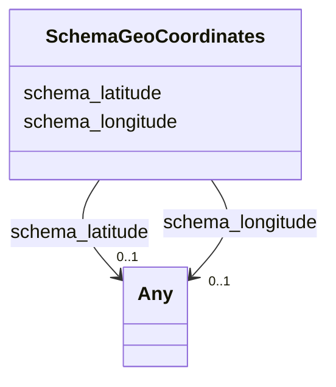

# Class: GeoCoordinates (schema_GeoCoordinates)


_The geographic coordinates of a place or event._


URI: [schema:GeoCoordinates](https://schema.org/GeoCoordinates)





<!-- no inheritance hierarchy -->


## Slots

| Name | Cardinality and Range | Description | Inheritance |
| ---  | --- | --- | --- |
| [schema_longitude](../slots/schema_longitude.md) | 0..1 <br/> [xsd:integer](xsd:integer)&nbsp;or&nbsp;<br />[xsd:double](xsd:double) | No slot (predicate) description specified <br/> 761097 occurrences with subject type schema_GeoCoordinates and object type double.<br/>69 occurrences with subject type schema_GeoCoordinates and object type integer. | direct |
| [schema_latitude](../slots/schema_latitude.md) | 0..1 <br/> [xsd:integer](xsd:integer)&nbsp;or&nbsp;<br />[xsd:double](xsd:double) | No slot (predicate) description specified <br/> 761101 occurrences with subject type schema_GeoCoordinates and object type double.<br/>65 occurrences with subject type schema_GeoCoordinates and object type integer. | direct |


## Usages

| used by | used in | type | used |
| ---  | --- | --- | --- |
| [HttpWww.opengeospatial.orgStandardsWaterml2HyFeaturesHYHydroLocation](../classes/HttpWww.opengeospatial.orgStandardsWaterml2HyFeaturesHYHydroLocation.md) | [schema_geo](../slots/schema_geo.md) | any_of[range] | [SchemaGeoCoordinates](../classes/SchemaGeoCoordinates.md) |
| [HyfHYHydroLocation](../classes/HyfHYHydroLocation.md) | [schema_geo](../slots/schema_geo.md) | any_of[range] | [SchemaGeoCoordinates](../classes/SchemaGeoCoordinates.md) |
| [SchemaPlace](../classes/SchemaPlace.md) | [schema_geo](../slots/schema_geo.md) | any_of[range] | [SchemaGeoCoordinates](../classes/SchemaGeoCoordinates.md) |


## Examples

| Value |
| --- |
| _:b0 |


## Identifier and Mapping Information


### Schema Source


* from schema: geoconnex


## Mappings

| Mapping Type | Mapped Value |
| ---  | ---  |
| self | schema:GeoCoordinates |
| native | geoconnex/:SchemaGeoCoordinates |


## LinkML Source

<!-- TODO: investigate https://stackoverflow.com/questions/37606292/how-to-create-tabbed-code-blocks-in-mkdocs-or-sphinx -->

### Direct

<details>
```yaml
name: schema_GeoCoordinates
conforms_to: No schema conformance document specified
description: The geographic coordinates of a place or event.
title: GeoCoordinates
notes:
- Class with 761166 occurrences.
examples:
- value: _:b0
from_schema: geoconnex
rank: 1000
slots:
- schema_longitude
- schema_latitude
class_uri: schema:GeoCoordinates

```
</details>

### Induced

<details>
```yaml
name: schema_GeoCoordinates
conforms_to: No schema conformance document specified
description: The geographic coordinates of a place or event.
title: GeoCoordinates
notes:
- Class with 761166 occurrences.
examples:
- value: _:b0
from_schema: geoconnex
rank: 1000
attributes:
  schema_longitude:
    name: schema_longitude
    description: No slot (predicate) description specified
    comments:
    - 761097 occurrences with subject type schema_GeoCoordinates and object type double.
    - 69 occurrences with subject type schema_GeoCoordinates and object type integer.
    examples:
    - description: schema_GeoCoordinates → double
      object:
        example_object: '-122.7634309999998'
        example_predicate: schema:longitude
        example_subject: _:b0
    - description: schema_GeoCoordinates → integer
      object:
        example_object: '-79'
        example_predicate: schema:longitude
        example_subject: _:b122821
    from_schema: geoconnex
    rank: 1000
    slot_uri: schema:longitude
    alias: schema_longitude
    owner: schema_GeoCoordinates
    domain_of:
    - schema_GeoCoordinates
    range: Any
    any_of:
    - range: integer
    - range: double
  schema_latitude:
    name: schema_latitude
    description: No slot (predicate) description specified
    comments:
    - 761101 occurrences with subject type schema_GeoCoordinates and object type double.
    - 65 occurrences with subject type schema_GeoCoordinates and object type integer.
    examples:
    - description: schema_GeoCoordinates → double
      object:
        example_object: '45.47261797'
        example_predicate: schema:latitude
        example_subject: _:b0
    - description: schema_GeoCoordinates → integer
      object:
        example_object: '49'
        example_predicate: schema:latitude
        example_subject: _:b1029348
    from_schema: geoconnex
    rank: 1000
    slot_uri: schema:latitude
    alias: schema_latitude
    owner: schema_GeoCoordinates
    domain_of:
    - schema_GeoCoordinates
    range: Any
    any_of:
    - range: integer
    - range: double
class_uri: schema:GeoCoordinates

```
</details>