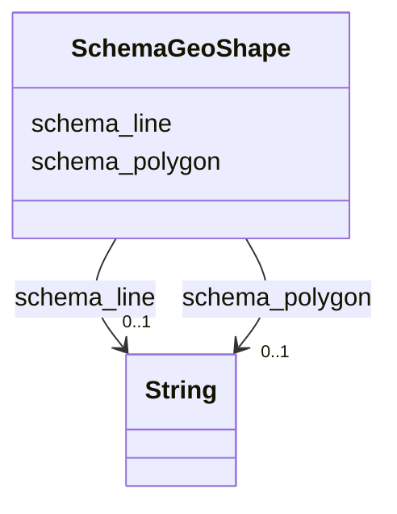

# Class: GeoShape (schema_GeoShape)


_The geographic shape of a place. A GeoShape can be described using several properties whose values are based on latitude/longitude pairs. Either whitespace or commas can be used to separate latitude and longitude; whitespace should be used when writing a list of several such points._


URI: [schema:GeoShape](https://schema.org/GeoShape)





<!-- no inheritance hierarchy -->


## Slots

| Name | Cardinality and Range | Description | Inheritance |
| ---  | --- | --- | --- |
| [schema_polygon](../slots/schema_polygon.md) | 0..1 <br/> [xsd:string](xsd:string) | No slot (predicate) description specified <br/> 325888 occurrences with subject type schema_GeoShape and object type string. | direct |
| [schema_line](../slots/schema_line.md) | 0..1 <br/> [xsd:string](xsd:string) | No slot (predicate) description specified <br/> 101773 occurrences with subject type schema_GeoShape and object type string. | direct |


## Usages

| used by | used in | type | used |
| ---  | --- | --- | --- |
| [HttpWww.opengeospatial.orgStandardsWaterml2HyFeaturesHYHydroLocation](../classes/HttpWww.opengeospatial.orgStandardsWaterml2HyFeaturesHYHydroLocation.md) | [schema_geo](../slots/schema_geo.md) | any_of[range] | [SchemaGeoShape](../classes/SchemaGeoShape.md) |
| [HyfHYHydroLocation](../classes/HyfHYHydroLocation.md) | [schema_geo](../slots/schema_geo.md) | any_of[range] | [SchemaGeoShape](../classes/SchemaGeoShape.md) |
| [SchemaPlace](../classes/SchemaPlace.md) | [schema_geo](../slots/schema_geo.md) | any_of[range] | [SchemaGeoShape](../classes/SchemaGeoShape.md) |


## Examples

| Value |
| --- |
| _:b1050697 |


## Identifier and Mapping Information


### Schema Source


* from schema: geoconnex


## Mappings

| Mapping Type | Mapped Value |
| ---  | ---  |
| self | schema:GeoShape |
| native | geoconnex/:SchemaGeoShape |


## LinkML Source

<!-- TODO: investigate https://stackoverflow.com/questions/37606292/how-to-create-tabbed-code-blocks-in-mkdocs-or-sphinx -->

### Direct

<details>
```yaml
name: schema_GeoShape
conforms_to: No schema conformance document specified
description: The geographic shape of a place. A GeoShape can be described using several
  properties whose values are based on latitude/longitude pairs. Either whitespace
  or commas can be used to separate latitude and longitude; whitespace should be used
  when writing a list of several such points.
title: GeoShape
notes:
- Class with 427818 occurrences.
examples:
- value: _:b1050697
from_schema: geoconnex
rank: 1000
slots:
- schema_polygon
- schema_line
class_uri: schema:GeoShape

```
</details>

### Induced

<details>
```yaml
name: schema_GeoShape
conforms_to: No schema conformance document specified
description: The geographic shape of a place. A GeoShape can be described using several
  properties whose values are based on latitude/longitude pairs. Either whitespace
  or commas can be used to separate latitude and longitude; whitespace should be used
  when writing a list of several such points.
title: GeoShape
notes:
- Class with 427818 occurrences.
examples:
- value: _:b1050697
from_schema: geoconnex
rank: 1000
attributes:
  schema_polygon:
    name: schema_polygon
    description: No slot (predicate) description specified
    comments:
    - 325888 occurrences with subject type schema_GeoShape and object type string.
    examples:
    - description: schema_GeoShape → string
      object:
        example_object: -73.43773999999999,44.045006 -73.431991,44.063449999999996
          -73.430207,44.071715999999995 -73.429239,44.079414 -73.4205590906893,44.0928557666786
          -73.416319,44.099422 -73.4131113305903,44.1079262028884 -73.4117592677759,44.111510804361394
          -73.411316,44.112686 -73.411722,44.11754 -73.41375099999999,44.126068 -73.41578,44.131523
          -73.415761,44.132826 -73.41172,44.137825 -73.408118,44.139373 -73.403268,44.144295
          -73.40238099999999,44.145855999999995 -73.40047738748069,44.1524185083939
          -73.39963399999999,44.155325999999995 -73.39872799999999,44.162248 -73.395532,44.166122
          -73.395399,44.166903 -73.396664,44.168831 -73.397385,44.171596 -73.396892,44.173846
          -73.395862,44.175785 -73.390383,44.179486 -73.389658,44.181249 -73.3903779438358,44.18615930569089
          -73.390805,44.189071999999996 -73.39058299999999,44.190886 -73.388502,44.192318
          -73.38532599999999,44.192597 -73.38398699999999,44.193158 -73.382252,44.197178
          -73.377693,44.199453 -73.375289,44.199867999999995 -73.372405,44.202165
          -73.370678,44.204546 -73.36201299999999,44.208545 -73.361476,44.210373999999995
          -73.357908,44.216193 -73.355276,44.219553999999995 -73.355252,44.22287 -73.354747,44.223599
          -73.35080599999999,44.225943 -73.34988899999999,44.230356 -73.3455355109189,44.232754814427004
          -73.34231199999999,44.234531 -73.34322999999999,44.238049 -73.336778,44.239557
          -73.334042,44.240970999999995 -73.3305,44.244254 -73.32932199999999,44.244504
          -73.324681,44.243614 -73.323596,44.243897 -73.319802,44.249547 -73.3166377049938,44.257718116061895
          -73.31661799999999,44.257768999999996 -73.3134220405831,44.2641991074088
          -73.31285199999999,44.265346 -73.311025,44.27424 -73.312299,44.280024999999995
          -73.31683799999999,44.287683 -73.322267,44.301522999999996 -73.324229,44.310023
          -73.324545,44.319247 -73.32384550990301,44.3253266526594 -73.323835,44.325418
          -73.32399699999999,44.333842 -73.325127,44.338533999999996 -73.32695510159479,44.3433650565242
          -73.32733499999999,44.344369 -73.334637,44.356877 -73.33493899999999,44.364441
          -73.333575,44.372288 -73.33036899999999,44.375986999999995 -73.320954,44.382669
          -73.31702899999999,44.385978 -73.315016,44.388512999999996 -73.312418,44.394709999999996
          -73.310491,44.402601 -73.296031,44.428339 -73.293855,44.437556 -73.29380572883369,44.4381674103822
          -73.293613,44.440559 -73.295216,44.445884 -73.300114,44.454710999999996
          -73.29872499999999,44.463957 -73.29893899999999,44.471303999999996 -73.2993423188855,44.4735840733609
          -73.299885,44.476652 -73.304418,44.485738999999995 -73.304921,44.492208999999995
          -73.306707,44.500333999999995 -73.312871,44.507245999999995 -73.319265,44.511959999999995
          -73.320836,44.513631 -73.321416,44.516453999999996 -73.321111,44.519856999999995
          -73.3211898546784,44.5203251296318 -73.322026,44.525289 -73.32393499999999,44.52712
          -73.328512,44.528478 -73.329458,44.529202999999995 -73.33058799999999,44.531034
          -73.330893,44.534268999999995 -73.331595,44.535924 -73.338995,44.543302
          -73.33930000000001,44.544477 -73.33863,44.546844 -73.338751,44.548046 -73.34293199999999,44.551907
          -73.350027,44.555392 -73.355186,44.556917999999996 -73.356788,44.557918
          -73.35840562140748,44.56018659147689 -73.36008799999999,44.562546 -73.3614860172538,44.563518406880696
          -73.36160725692869,44.5636027365224 -73.36727499999999,44.567544999999996
          -73.374389,44.575455 -73.375666,44.582038 -73.377794,44.585128 -73.38184799999999,44.589316
          -73.38163999999999,44.590582999999995 -73.37789699999999,44.593848 -73.376806,44.595455
          -73.37633199999999,44.597218 -73.37684899999999,44.599598 -73.380726,44.605239
          -73.382932,44.612184 -73.38982,44.61721 -73.390231,44.618353 -73.389966,44.61962
          -73.387346,44.623672 -73.38649699999999,44.626923999999995 -73.385899,44.631043999999996
          -73.3864312296218,44.6329290148338 -73.387169,44.635542 -73.386783,44.636368999999995
          -73.37974799999999,44.64036 -73.37856099999999,44.641475 -73.383157,44.645764
          -73.384483,44.646682999999996 -73.383974,44.647605 -73.380906,44.648871
          -73.377973,44.652918 -73.378014,44.653846 -73.378968,44.65518 -73.379074,44.656772
          -73.377209,44.658142 -73.375931,44.660315 -73.374134,44.66234 -73.373063,44.662713
          -73.37058999999999,44.662518 -73.369669,44.663478 -73.370065,44.666070999999995
          -73.37272,44.668738999999995 -73.37101,44.672762999999996 -73.371800465581,44.675131137091
          -73.37198,44.675669 -73.3719437459439,44.676009576424704 -73.371843,44.676956
          -73.371089,44.67753 -73.3704090158919,44.6777022743243 -73.367209,44.678512999999995
          -73.367414,44.681292 -73.36968499999999,44.683758 -73.370142,44.684853 -73.365297,44.687546
          -73.361308,44.694523 -73.361323,44.695369 -73.364661,44.696394 -73.365977,44.697559
          -73.36578375018149,44.6988278681129 -73.36556,44.700297 -73.365068,44.725646
          -73.365561,44.741786 -73.36379099999999,44.745253999999996 -73.357671,44.751017999999995
          -73.354361,44.755296 -73.35391933709289,44.7563052702748 -73.3520072158159,44.76067477275169
          -73.348694,44.768246 -73.347072,44.772988 -73.34425399999999,44.776281999999995
          -73.335713,44.782086 -73.333771,44.785191999999995 -73.333154,44.788759
          -73.333933,44.7992 -73.33443,44.802188 -73.335443,44.804601999999996 -73.3411277344487,44.8091445485274
          -73.3502,44.816393999999995 -73.353472,44.820386 -73.354945,44.8215 -73.35808,44.82331
          -73.365678,44.826451 -73.3680566215151,44.8280601203749 -73.369647,44.829136
          -73.371329,44.830742 -73.375345,44.836307 -73.378717,44.837357999999995
          -73.379452,44.83801 -73.381359,44.845020999999996 -73.38139699999999,44.848805
          -73.37982199999999,44.857037 -73.375709,44.860745 -73.371967,44.862414 -73.369103,44.866679999999995
          -73.36645899999999,44.87504 -73.3630566734973,44.88824955275489 -73.362229,44.891462999999995
          -73.360327,44.897236 -73.35808,44.901325 -73.356218,44.904492 -73.353657,44.907346
          -73.347837,44.911308999999996 -73.3427866086322,44.913802307163195 -73.341106,44.914632
          -73.3395342002786,44.9168851346264 -73.338979,44.917680999999995 -73.338482,44.924112
          -73.339603,44.943369999999994 -73.33790599999999,44.960541 -73.33824299999999,44.964749999999995
          -73.338734,44.965886 -73.34474,44.970468 -73.350218,44.976222 -73.352886,44.980644
          -73.3537167558164,44.982960087586 -73.354112,44.984061999999994 -73.35463299999999,44.987352
          -73.35342899999999,44.990165 -73.35335542032409,44.990258966762894 -73.350188,44.994304
          -73.34822388923259,44.9989017541974 -73.343124,45.010839999999995 -73.24932299999999,45.012181
          -73.241061,45.012752 -73.19192810038889,45.013620678054096 -73.17015001270079,45.014005718362796
          -73.085972,45.015494 -73.084969,45.014751 -73.06509799999999,45.014786 -73.059685,45.015868999999995
          -73.052438,45.015721 -73.0484187665616,45.014797528546104 -73.048386,45.01479
          -73.01553899999999,45.015071999999996 -73.014766,45.01498 -72.9933415770739,45.0145756012365
          -72.96803899999999,45.014098 -72.93643999999999,45.014267 -72.936365,45.014655999999995
          -72.930599,45.015152 -72.84563299999999,45.016659 -72.832617984451,45.0165092817009
          -72.777306,45.015873 -72.7026243478423,45.0155714648904 -72.67477,45.015459
          -72.58988,45.013237 -72.58675199999999,45.012881 -72.5864405737639,45.0127858873993
          -72.582371,45.011542999999996 -72.55591199999999,45.008303999999995 -72.5543599324424,45.0082745618354
          -72.53250299999999,45.00786 -72.481033,45.008869999999995 -72.448865,45.008537
          -72.4334865474051,45.007907209900594 -72.41812534840041,45.0072781263835
          -72.401298,45.006589 -72.4008446713155,45.0065807099715 -72.34858299999999,45.005624999999995
          -72.3292432299146,45.0047195311487 -72.310073,45.003822 -72.291866,45.004495999999996
          -72.27086899999999,45.004186 -72.2467252808235,45.0046233140874 -72.160506,45.006184999999995
          -72.14193439472501,45.0059952365218 -72.1099216818884,45.0056681326638 -72.10305799999999,45.005598
          -72.08828927842781,45.0058217553171 -72.0877029338662,45.005830638801896
          -72.05216899999999,45.006369 -72.02973899999999,45.006782 -72.023292,45.006792
          -71.986705,45.007872 -71.94720099999999,45.008359 -71.915009,45.007791 -71.8976565406717,45.0082197635741
          -71.76745199999999,45.011437 -71.69811499583528,45.0114204811383 -71.691898,45.011419
          -71.60983999999999,45.012709 -71.56056199999999,45.012555 -71.5566680513307,45.0126069856617
          -71.51880278616339,45.0131125010221 -71.501088,45.013349 -71.4650499613568,45.0136330980792
          -71.46455499999999,45.013636999999996 -71.466247,45.011959 -71.473269,45.010585999999996
          -71.476168,45.009054 -71.477907,45.007453 -71.47961099999999,45.002905 -71.487565,45.000935999999996
          -71.4883441974445,45.001168801755 -71.497412,45.003878 -71.501055,45.006741999999996
          -71.50500000000001,45.008151 -71.507767,45.00817 -71.5137610647859,45.004479120879395
          -71.514609,45.003957 -71.520022,45.002291 -71.525016,45.001881 -71.5295860741706,44.9998773714228
          -71.530091,44.999655999999995 -71.536298,44.994158999999996 -71.53683099999999,44.992771
          -71.53371299999999,44.991963 -71.532749,44.991066 -71.535134,44.989435 -71.537964,44.989025999999996
          -71.538592,44.988181999999995 -71.538417,44.987342 -71.53981526118909,44.9860761185684
          -71.54112099999999,44.984894 -71.54086,44.983788 -71.537784,44.984297999999995
          -71.53305508443529,44.9779649726011 -71.531605,44.976023 -71.527163,44.973667999999996
          -71.52309199999999,44.966314999999994 -71.521716,44.965674 -71.523563,44.964607
          -71.523376,44.96396 -71.52021599999999,44.963487 -71.518864,44.963626 -71.517674,44.964383
          -71.516223,44.964569 -71.514843,44.958740999999996 -71.516814,44.947587999999996
          -71.515498,44.94352 -71.5156746133565,44.9427889409979 -71.516144,44.940846
          -71.516949,44.939704 -71.518777,44.938798999999996 -71.521333,44.938798999999996
          -71.521844,44.938148 -71.51918599999999,44.936265999999996 -71.516305,44.935175
          -71.51518899999999,44.927316999999995 -71.509207,44.923429 -71.504483,44.919062
          -71.500788,44.914535 -71.500552,44.913089 -71.500548,44.911955999999996
          -71.499945,44.911173999999995 -71.498926,44.910917 -71.49532599999999,44.911794
          -71.49440299999999,44.911837 -71.493363,44.911612 -71.4932689478126,44.9112043289529
          -71.493082,44.910394 -71.494716,44.910101999999995 -71.4958111729931,44.909088480950196
          -71.496017,44.908898 -71.49595099999999,44.90736 -71.494835,44.905919 -71.49490999999999,44.904298999999995
          -71.495378,44.903621 -71.49579299999999,44.903728 -71.49660899999999,44.903603
          -71.497841,44.904342 -71.499528,44.904773999999996 -71.501088,44.904433
          -71.502473,44.902719999999995 -71.5049632727175,44.9006947611892 -71.508642,44.897703
          -71.51387,44.894648 -71.51435,44.893964 -71.51409,44.893149 -71.511712,44.891571
          -71.512292,44.890246 -71.522393,44.880811 -71.52663799999999,44.879098 -71.528342,44.877818999999995
          -71.52888899999999,44.876928 -71.52915399999999,44.873559 -71.534588,44.869698
          -71.540116,44.868624999999994 -71.545901,44.866133999999995 -71.549533,44.862592
          -71.550176,44.861609 -71.550304,44.859552 -71.548377,44.857015999999994
          -71.548345,44.855529999999995 -71.553656,44.852123 -71.5556,44.850547 -71.556805,44.848808
          -71.55675,44.846861999999994 -71.555036,44.845732999999996 -71.55265399999999,44.842048999999996
          -71.552005,44.839208 -71.552218,44.837775 -71.55371199999999,44.836065 -71.557672,44.834421
          -71.5620395026257,44.8250943239086 -71.56225599999999,44.824632 -71.563701,44.823901
          -71.56475999999999,44.823901 -71.565146,44.824678 -71.56790699999999,44.823831999999996
          -71.574314,44.818079 -71.5755,44.816058 -71.575139,44.813565 -71.572864,44.810382999999995
          -71.569216,44.808813 -71.569098,44.807044 -71.570402,44.805276 -71.573129,44.797947
          -71.57170599999999,44.79483 -71.573247,44.791882 -71.578938,44.786069999999995
          -71.580005,44.78548 -71.584392,44.785733 -71.59296599999999,44.782776 -71.596949,44.778987
          -71.59667999999999,44.777415999999995 -71.595913,44.776272 -71.596035,44.775422
          -71.601471,44.772067 -71.60222941446689,44.771022732752094 -71.604615,44.767738
          -71.608234,44.765657999999995 -71.611767,44.764345 -71.614267,44.760622
          -71.614238,44.758663999999996 -71.617941,44.755883 -71.623924,44.755134999999996
          -71.631255,44.753253 -71.631883,44.752463 -71.631967,44.750333 -71.631109,44.748689
          -71.63100933975659,44.74865423755789 -71.626909,44.747223999999996 -71.62518,44.743978
          -71.625059,44.737099 -71.625638,44.735065 -71.62561099999999,44.730312 -71.624922,44.729032
          -71.623266,44.727795 -71.622593,44.727773 -71.619067,44.729282999999995
          -71.617656,44.728918 -71.617431,44.728049999999996 -71.618516,44.723912999999996
          -71.618355,44.722609999999996 -71.613094,44.718933 -71.604912,44.708149999999996
          -71.59975,44.705318 -71.599205,44.703877999999996 -71.60077199999999,44.700815
          -71.60077199999999,44.699901 -71.600162,44.698919 -71.59865599999999,44.698004999999995
          -71.59413599999999,44.696932 -71.59436,44.695996 -71.596858,44.694921 -71.59804199999999,44.692817999999995
          -71.596437,44.687059 -71.594224,44.683814999999996 -71.59467099999999,44.681643
          -71.5964,44.679677 -71.596304,44.679083 -71.590024,44.675543 -71.58736499999999,44.674926
          -71.58300899999999,44.674836 -71.581983,44.673533 -71.582527,44.672253 -71.58447799999999,44.670210999999995
          -71.585645,44.669277 -71.585645,44.667643999999996 -71.584574,44.665351
          -71.585246,44.663523 -71.5863363315125,44.661548615909894 -71.586578,44.661111
          -71.586578,44.659478 -71.584848,44.657816 -71.582965,44.656621 -71.576013,44.655691
          -71.57571,44.654574 -71.576312,44.653179 -71.576079,44.652012 -71.57514499999999,44.650611999999995
          -71.572163,44.650372999999995 -71.570235,44.650483 -71.568677,44.651537
          -71.567645,44.65356 -71.566144,44.653863 -71.56441099999999,44.652826999999995
          -71.56177199999999,44.650224 -71.558571,44.644372999999995 -71.55805008432729,44.6419051022624
          -71.558026,44.641791 -71.558859,44.640122 -71.562636,44.639505 -71.562636,44.637266
          -71.562124,44.636579999999995 -71.555791,44.632047 -71.55214,44.630081999999994
          -71.54951,44.630902999999996 -71.547226,44.630354999999994 -71.546931,44.62855
          -71.551722,44.627598 -71.555652,44.629791 -71.55735,44.628448 -71.556467,44.627221
          -71.552478,44.626535999999994 -71.54938899999999,44.625544 -71.54722,44.625096
          -71.54597799999999,44.623118 -71.546902,44.621852 -71.550636,44.622924999999995
          -71.553981,44.625119 -71.55506199999999,44.624185 -71.55580499999999,44.621769
          -71.55655999999999,44.616988 -71.55392599999999,44.610689 -71.55316599999999,44.606151
          -71.554236,44.604406999999995 -71.555852,44.603263 -71.559004,44.603074
          -71.56183399999999,44.602717 -71.561483,44.600778999999996 -71.560037,44.599998
          -71.55685799999999,44.599748999999996 -71.55156199999999,44.601227 -71.550331,44.600896
          -71.550634,44.599591 -71.553525,44.598332 -71.553784,44.595175 -71.554872,44.593778
          -71.55344699999999,44.593450999999995 -71.54968699999999,44.595223999999995
          -71.547901,44.596846 -71.546087,44.597376999999994 -71.54505499999999,44.596773
          -71.544871,44.595299 -71.54545399999999,44.593616999999995 -71.54684,44.592411999999996
          -71.54715399999999,44.591581 -71.545777,44.590891 -71.544086,44.591547 -71.539633,44.594313
          -71.537898,44.594249 -71.537335,44.593334 -71.537638,44.591798999999995
          -71.539683,44.589864 -71.539705,44.588525 -71.537775,44.587682 -71.535568,44.588226
          -71.5347505546469,44.5882403551379 -71.534543,44.588243999999996 -71.534632,44.587407
          -71.536801,44.585052 -71.537156,44.583137 -71.538945,44.581316 -71.543686,44.578627
          -71.54560099999999,44.577601 -71.54794199999999,44.57734 -71.550264,44.578252
          -71.552495,44.580838 -71.55427999999999,44.580998 -71.55442,44.579519 -71.553755,44.578406
          -71.55330000000001,44.576924 -71.548952,44.573084 -71.548728,44.571873 -71.549655,44.570707999999996
          -71.55167,44.569657 -71.552629,44.569542999999996 -71.556497,44.570777 -71.5575390287018,44.570546693995404
          -71.55797199999999,44.570451 -71.55898499999999,44.568779 -71.558565,44.565571999999996
          -71.559846,44.564119 -71.56339899999999,44.563218 -71.569599,44.562777 -71.575519,44.564775
          -71.59017,44.565694 -71.592091,44.565118 -71.593923,44.563812999999996 -71.596137,44.560897999999995
          -71.597797,44.557172 -71.59811599999999,44.555412 -71.59680399999999,44.553424
          -71.588076,44.54785 -71.575193,44.540859 -71.573083,44.53798 -71.573019,44.536311999999995
          -71.574456,44.53366 -71.57688399999999,44.530322999999996 -71.582505,44.524403
          -71.585731,44.522664999999996 -71.587104,44.522436 -71.592855,44.523005999999995
          -71.594259,44.521679999999996 -71.593971,44.519738 -71.592117,44.517773
          -71.58690899999999,44.514666 -71.58595,44.513431999999995 -71.584959,44.510141
          -71.58323299999999,44.508268 -71.577771,44.504886 -71.577068,44.504041 -71.577643,44.502691999999996
          -71.57876,44.501915 -71.57997399999999,44.501777999999995 -71.58386999999999,44.503217
          -71.586648,44.502873 -71.585881,44.500057 -71.586972,44.498526 -71.58962199999999,44.498525
          -71.589623,44.499371 -71.590256,44.500057 -71.591917,44.500975 -71.594303,44.500749
          -71.595027,44.498669 -71.595484,44.494423999999995 -71.5969748791527,44.490717330047296
          -71.597917,44.488375 -71.59948,44.486455 -71.60646387775608,44.484996333224395
          -71.609568,44.484348 -71.615923,44.485943999999996 -71.617614,44.485715
          -71.61985,44.483011 -71.624068,44.475071 -71.630017,44.473546999999996 -71.63541699999999,44.476225
          -71.63316999999999,44.478913999999996 -71.62677,44.480641999999996 -71.625019,44.481784
          -71.625676,44.483201 -71.62765499999999,44.484207 -71.631007,44.484322999999996
          -71.632795,44.483889999999995 -71.63931199999999,44.477835999999996 -71.64311099999999,44.476648999999995
          -71.64589,44.475141 -71.647693,44.473124999999996 -71.648178,44.472023 -71.647864,44.469975999999996
          -71.646551,44.468869 -71.640847,44.465934999999995 -71.640404,44.464186
          -71.642851,44.461734 -71.645068,44.460544999999996 -71.65232,44.461116999999994
          -71.653348,44.460499 -71.657313,44.454003 -71.659021,44.444932 -71.6611295214555,44.4414498244812
          -71.66183,44.440293 -71.664191,44.438351 -71.668944,44.436523 -71.677384,44.435702
          -71.67926299999999,44.435018 -71.679282,44.434337 -71.677427,44.431484 -71.67599299999999,44.428712
          -71.67696699999999,44.426848 -71.67806,44.426552 -71.680331,44.427713999999995
          -71.682701,44.42734 -71.683943,44.423978 -71.688813,44.421741 -71.699434,44.416069
          -71.708041,44.411977 -71.715087,44.410489999999996 -71.726199,44.411384999999996
          -71.73152,44.411015 -71.735923,44.410061999999996 -71.737836,44.408921 -71.7385426541962,44.40819468827701
          -71.739921,44.406777999999996 -71.742308,44.402366 -71.743104,44.401657
          -71.74501099999999,44.401359 -71.749533,44.401955 -71.75434,44.405577 -71.756091,44.406400999999995
          -71.761966,44.407027 -71.764977,44.406586999999995 -71.76568897743229,44.406307687658
          -71.767888,44.405445 -71.772801,44.403096999999995 -71.775399,44.401126
          -71.77861299999999,44.399798999999994 -71.790688,44.400259999999996 -71.79392399999999,44.399271
          -71.802353,44.39338 -71.803488,44.39189 -71.803489,44.390384 -71.799899,44.385951
          -71.800316,44.384276 -71.803461,44.383334999999995 -71.80882799999999,44.383862
          -71.81313,44.382801 -71.814388,44.381932 -71.815773,44.375464 -71.815251,44.374593999999995
          -71.812424,44.372532 -71.812235,44.371491999999996 -71.812832,44.370447999999996
          -71.81549,44.368835999999995 -71.81615699999999,44.367559 -71.81499099999999,44.363686
          -71.812473,44.358477 -71.812206,44.357355999999996 -71.812902,44.355547
          -71.814351,44.354541 -71.818838,44.352939 -71.826246,44.352005999999996
          -71.833261,44.350136 -71.83771955183909,44.3477442357108 -71.844319,44.344204
          -71.845015554429,44.3439247578766 -71.852628,44.340872999999995 -71.861941,44.340109
          -71.86990999999999,44.336962 -71.872472,44.336628 -71.875863,44.33737 -71.881895,44.340209
          -71.902332,44.347499 -71.906909,44.348284 -71.917434,44.346534999999996
          -71.925088,44.342023999999995 -71.92911,44.337576999999996 -71.935395,44.33577
          -71.939049,44.335843999999994 -71.945163,44.337744 -71.958119,44.337544
          -71.963133,44.336555999999995 -71.98111999999999,44.3375 -71.984617,44.336242999999996
          -71.9846456807074,44.336165806344404 -71.98648399999999,44.331218 -71.988306,44.329768
          -72.002314,44.324870999999995 -72.00997699999999,44.321951 -72.014543,44.321031999999995
          -72.01912999999999,44.320383 -72.02578299999999,44.322054 -72.029061,44.322398
          -72.033136,44.320364999999995 -72.033806,44.317349 -72.032341,44.315751999999996
          -72.03231699999999,44.306677 -72.032541,44.303751999999996 -72.03346499999999,44.301877999999995
          -72.03473828959729,44.300433628855096 -72.03703,44.297833999999995 -72.03900399999999,44.296462999999996
          -72.046302,44.291982999999995 -72.053160162457,44.290541939917595 -72.053355,44.290501
          -72.05742546697209,44.2873617674628 -72.05888,44.28624 -72.065434,44.277235
          -72.067774,44.270976 -72.066464,44.268330999999996 -72.064544,44.267997
          -72.060846,44.269971999999996 -72.05874,44.270005 -72.058475,44.267886 -72.05896899999999,44.265910999999996
          -72.059832,44.264984 -72.060378,44.264950999999996 -72.061174,44.263377
          -72.059782,44.256018 -72.0596563886779,44.2558208214537 -72.05399,44.246925999999995
          -72.050112,44.244046 -72.04845999999999,44.241212 -72.047889,44.238493 -72.050656,44.233581
          -72.05358199999999,44.22604 -72.0539,44.222702999999996 -72.052662,44.218841
          -72.052942903517,44.2178743180194 -72.05323299999999,44.216876 -72.058605,44.208214999999996
          -72.058066,44.206067 -72.058987,44.202113999999995 -72.060067,44.200446
          -72.06356099999999,44.198457 -72.064577,44.196949 -72.066166,44.189772999999995
          -72.06133799999999,44.184951 -72.057496,44.179444 -72.053021,44.167902999999995
          -72.051523,44.166219 -72.048969,44.165039 -72.04759299999999,44.161801 -72.046568,44.161403
          -72.04511099999999,44.161749 -72.04235899999999,44.161701 -72.04238699999999,44.160817
          -72.044004,44.158155 -72.043505,44.156918 -72.0428854667783,44.1567322502707
          -72.04238099999999,44.156580999999996 -72.040167,44.157022999999995 -72.038551,44.156062999999996
          -72.0392364571389,44.1555783964795 -72.039554070468,44.1553538506564 -72.041073,44.15428
          -72.0412307553708,44.1540860622046 -72.04270799999999,44.15227 -72.042867,44.151288
          -72.0423453671872,44.142954266724395 -72.041983,44.137164999999996 -72.037859,44.133782
          -72.03424199999999,44.132524 -72.033703,44.131541 -72.037506,44.124708 -72.038839,44.124628
          -72.040728,44.125668 -72.04194799999999,44.125653 -72.04643,44.123911 -72.052342,44.119890999999996
          -72.05257939423869,44.11910300986509 -72.054675,44.112147 -72.054831,44.110136999999995
          -72.053061781616,44.1035756650995 -72.052391,44.101088 -72.050997,44.098848
          -72.048334,44.096905 -72.04490899999999,44.096402 -72.044023,44.09703 -72.043495,44.098005
          -72.043475,44.100631 -72.041338,44.102987 -72.03925,44.103947 -72.03569,44.103151
          -72.03197999999999,44.101665 -72.030479,44.100224 -72.030176,44.099348 -72.03013299999999,44.098304999999996
          -72.031305,44.092239 -72.03172599999999,44.091272 -72.033677,44.089585 -72.036153,44.088515
          -72.040212,44.088178 -72.04337699999999,44.088209 -72.044131,44.087635 -72.043949,44.086690999999995
          -72.041122,44.085248 -72.037243,44.083673 -72.031925,44.082139999999995
          -72.030182,44.079682999999996 -72.03041094993131,44.079339308261694 -72.03103999999999,44.078395
          -72.032729,44.077388 -72.033973,44.077002 -72.036163,44.07664 -72.03851,44.076862999999996
          -72.04006799999999,44.078016999999996 -72.041247,44.079128999999995 -72.04317499999999,44.079466
          -72.046369,44.078230999999995 -72.051141,44.077256 -72.052494,44.076716
          -72.05225999999999,44.075469 -72.05062099999999,44.074394 -72.048475,44.072479
          -72.047602,44.070479 -72.048289,44.069136 -72.053482,44.06473 -72.056341,44.059582
          -72.05717299999999,44.058645999999996 -72.058863,44.057921 -72.065415,44.058344
          -72.067612,44.058034 -72.0676267982814,44.0580030467677 -72.06915,44.054817
          -72.068405,44.054021 -72.062713,44.051618 -72.06215,44.049931 -72.066422,44.049299
          -72.07488099999999,44.045891999999995 -72.077372,44.044591 -72.07898899999999,44.042885999999996
          -72.079595,44.041429 -72.079397,44.039531 -72.075486,44.034614 -72.07500399999999,44.032789
          -72.075648,44.031653999999996 -72.0793090203006,44.0300626181306 -72.07964236374369,44.029917719531795
          -72.079996,44.029764 -72.081357,44.028529 -72.081864,44.026952 -72.081673,44.023638
          -72.082432,44.022154 -72.08487099999999,44.021308 -72.09047799999999,44.024299
          -72.09203,44.024459 -72.094056,44.023179 -72.0951,44.021831 -72.095669,44.019683
          -72.095193,44.016666 -72.090504,44.012736 -72.089807,44.011274 -72.090059,44.009903
          -72.09123,44.009125 -72.093257,44.009375999999996 -72.093384,44.01045 -72.095247,44.01358
          -72.098897,44.015477 -72.102475,44.014882 -72.10529199999999,44.012662999999996
          -72.104941,44.009395 -72.10357599999999,44.004231 -72.103765,44.002837 -72.109019,44.000535
          -72.116985,43.994479999999996 -72.116706,43.991954 -72.112813,43.98802 -72.111756,43.984943
          -72.112307558332,43.9779628564771 -72.11249,43.975654 -72.113078,43.972789999999996
          -72.114702,43.969477999999995 -72.11472599999999,43.968332 -72.114273,43.967513
          -72.110945,43.966958999999996 -72.10704199999999,43.969513 -72.104972,43.96995
          -72.096161,43.968132 -72.091104,43.966443 -72.090214,43.965813999999995
          -72.090357,43.965409 -72.098563,43.963833 -72.100543,43.962478 -72.100894,43.960851
          -72.098955,43.958878999999996 -72.098689,43.95766 -72.098927666233,43.9573633743469
          -72.098950209255,43.9573353568157 -72.104421,43.950536 -72.105875,43.949369999999995
          -72.110872,43.947654 -72.115268,43.947629 -72.117839,43.946828 -72.118698,43.94536
          -72.118985,43.943225 -72.116766,43.935278 -72.116767,43.933923 -72.11801299999999,43.923292
          -72.11919,43.920952 -72.12100199999999,43.918956 -72.1315019408189,43.912311616621004
          -72.135117,43.910024 -72.14504099999999,43.905288 -72.151324,43.901703999999995
          -72.15572399999999,43.89712 -72.158585,43.892762 -72.159216,43.888313 -72.160819,43.887223
          -72.16722399999999,43.886112999999995 -72.1695101716048,43.8862990050862
          -72.170604,43.886388 -72.17164799999999,43.885360999999996 -72.17278499999999,43.883716
          -72.173576,43.87967 -72.171904,43.876149 -72.16978,43.873425 -72.1693273369057,43.8725850977742
          -72.1686464134551,43.87132166559049 -72.167476,43.86915 -72.174774,43.866386
          -72.179386,43.866181 -72.18295599999999,43.865334999999995 -72.184788,43.863392999999995
          -72.187916,43.856125999999996 -72.18737899999999,43.853612 -72.182864,43.845109
          -72.182203,43.834032 -72.183337,43.830698999999996 -72.186238,43.826930999999995
          -72.188255,43.822888 -72.18857,43.821152999999995 -72.186424,43.815857 -72.184184,43.812523999999996
          -72.18405243402529,43.8118519467781 -72.18333299999999,43.808177 -72.18484699999999,43.804697999999995
          -72.190754,43.800807 -72.193184,43.794697 -72.19555199999999,43.791492 -72.197036,43.790006
          -72.20407,43.786097 -72.20530000000001,43.784473999999996 -72.20552099999999,43.782278999999996
          -72.20476,43.771263 -72.20501509606571,43.771080158171294 -72.20520479908029,43.7709441872538
          -72.207535,43.769273999999996 -72.210815,43.767696 -72.21649099999999,43.766507
          -72.218099,43.765729 -72.22011599999999,43.763625999999995 -72.22206899999999,43.759831
          -72.22364499999999,43.757842 -72.23271299999999,43.748286 -72.245068,43.743092999999995
          -72.261996713104,43.7352055279458 -72.264245,43.734158 -72.27118,43.734138
          -72.276072,43.727053999999995 -72.279855,43.724633 -72.2825226819785,43.722330170688004
          -72.28480499999999,43.72036 -72.28694999999999,43.717251999999995 -72.292215,43.711332999999996
          -72.294894,43.709002999999996 -72.29971499999999,43.706558 -72.3012322181539,43.7047096124013
          -72.30286699999999,43.702718 -72.305326,43.695769999999996 -72.3055042006241,43.6925066689756
          -72.3055044139206,43.6925027629444 -72.30599609379449,43.6834987866939 -72.30602,43.683060999999995
          -72.304351,43.681141 -72.30309199999999,43.678078 -72.30340799999999,43.674054999999996
          -72.304322,43.669506999999996 -72.305771,43.666534999999996 -72.30912082567379,43.662034869296996
          -72.310841,43.659724 -72.312887,43.658443999999996 -72.31402,43.656158 -72.31505899999999,43.649415
          -72.31474763927889,43.648671222759 -72.313863,43.646558 -72.314083,43.64281
          -72.315247,43.641163999999996 -72.32251699999999,43.638901 -72.327395,43.636773999999996
          -72.329126,43.635563 -72.3294982115324,43.634925221812395 -72.3295020171192,43.6349187010035
          -72.32965999999999,43.634648 -72.329471,43.632843 -72.327362,43.631174 -72.327236,43.630534
          -72.328966,43.626991 -72.33236,43.62507 -72.334401,43.61925 -72.334745,43.614519
          -72.3327,43.610313 -72.329522,43.608393 -72.328232,43.606839 -72.3281646788123,43.606345073825395
          -72.327665,43.602678999999995 -72.328514,43.600805 -72.32961999999999,43.600201
          -72.3296772840816,43.6001836405589 -72.332382,43.599364 -72.34617918692359,43.590211488519294
          -72.349926,43.587725999999996 -72.363916,43.583652 -72.36409226909839,43.5835709851147
          -72.373126,43.579419 -72.37944,43.574069 -72.38262499999999,43.564127 -72.382783,43.562459
          -72.381187,43.554915 -72.380383,43.54088 -72.38331,43.53519 -72.38909699999999,43.528265999999995
          -72.39070000000001,43.527260999999996 -72.394218,43.5274 -72.395949,43.52388
          -72.395825,43.520559999999996 -72.3961193114597,43.519794123758096 -72.3963960118214,43.51907407624989
          -72.398563,43.513435 -72.398376,43.510829 -72.396305,43.508061999999995
          -72.389556,43.503899 -72.384773,43.500259 -72.380894,43.493393999999995
          -72.38036199999999,43.491634 -72.380428,43.488524999999996 -72.3804628390609,43.488298102209
          -72.381723,43.480090999999994 -72.3821709999838,43.478598517969196 -72.38295099999999,43.476
          -72.384491,43.474194999999995 -72.3847195355301,43.4740190909885 -72.3904664495947,43.4695955601201
          -72.391526,43.468779999999995 -72.3925,43.467363999999996 -72.392628,43.465078
          -72.39056699999999,43.451225 -72.391196,43.449304999999995 -72.393992,43.444666
          -72.395659,43.438541 -72.395916,43.430974 -72.3964397283084,43.428943519810396
          -72.3964568073635,43.4288773047854 -72.39997199999999,43.415248999999996
          -72.400131,43.410996999999995 -72.40154226970819,43.4036867763106 -72.401624713554,43.403259726150395
          -72.40381099999999,43.391935 -72.405253,43.389992 -72.4111097043962,43.3857742240205
          -72.41315399999999,43.384302 -72.415381,43.380210999999996 -72.415978,43.376531
          -72.415099,43.365896 -72.414692,43.364273 -72.413377,43.362741 -72.403949,43.358098
          -72.400441,43.357685 -72.39217,43.357865 -72.390103,43.356926 -72.390286366897,43.3564901389057
          -72.39092,43.354983999999995 -72.395403,43.350414 -72.399289,43.347581 -72.400981,43.345774999999996
          -72.4066245346759,43.3378028767861 -72.4066991286665,43.3376975044409 -72.409037,43.334395
          -72.410353,43.331675 -72.410197,43.330394999999996 -72.40869599999999,43.327673999999995
          -72.402532,43.32038 -72.39761899999999,43.317063999999995 -72.395805,43.314617
          -72.395462,43.312993999999996 -72.40166599999999,43.303394999999995 -72.407842,43.282892
          -72.41544999999999,43.271374 -72.421583,43.263442 -72.4276791218808,43.261225350314795
          -72.4277110610837,43.2612137366979 -72.435221,43.258483 -72.43637799999999,43.257453999999996
          -72.438693,43.252905 -72.438937,43.24424 -72.43665399999999,43.238319 -72.43421599999999,43.234958
          -72.433688684948,43.233440482434794 -72.433684,43.233427 -72.4337736887345,43.2330834990285
          -72.434466,43.230432 -72.4351048789197,43.2293973766461 -72.43765599999999,43.225266
          -72.4405,43.219049 -72.440563,43.215253999999995 -72.438594,43.209013 -72.437719,43.202749999999995
          -72.438969,43.201035 -72.45027999999999,43.192485 -72.449435,43.18917 -72.443749,43.182221
          -72.443405,43.179728999999995 -72.444904,43.177969 -72.451430916722,43.172977426992006
          -72.452556,43.172117 -72.45186799999999,43.170173999999996 -72.4521,43.161414
          -72.45209374428919,43.1613424195726 -72.45155299999999,43.155155 -72.451802,43.153486
          -72.452801,43.151976999999995 -72.456537,43.149528 -72.45714,43.148492999999995
          -72.45689,43.146558 -72.45198599999999,43.138923999999996 -72.448303,43.137187
          -72.444214,43.13737 -72.441904,43.136615 -72.440905,43.135793 -72.4408723976523,43.1353764789024
          -72.440624,43.132203 -72.44078,43.131471999999995 -72.442746,43.131152 -72.442933,43.130192
          -72.440967,43.127607999999995 -72.4382747298633,43.1253459793545 -72.4379502256946,43.1250733339319
          -72.435936,43.123380999999995 -72.43297199999999,43.119654999999995 -72.432661,43.114076999999995
          -72.433129,43.112637 -72.434845,43.109916999999996 -72.440587,43.106145
          -72.442427,43.103629999999995 -72.443051,43.100840999999996 -72.43921399999999,43.094851999999996
          -72.435191,43.086622 -72.43527685350371,43.0845024486999 -72.435316,43.083535999999995
          -72.43619,43.08173 -72.43987,43.077042999999996 -72.445202,43.071352 -72.45070367373658,43.0668010256691
          -72.45470999999999,43.063486999999995 -72.4614656337149,43.058972110977
          -72.46381199999999,43.057404 -72.46649099999999,43.054728999999995 -72.46736299999999,43.052648
          -72.466832,43.049197 -72.465896,43.047505 -72.462248,43.044214 -72.460252,43.040670999999996
          -72.460905,43.035961 -72.46298999999999,43.028531 -72.462397,43.02556 -72.45965329790401,43.020577908403496
          -72.4596285332852,43.0205329401107 -72.458998,43.019388 -72.45703499999999,43.017285
          -72.452984,43.015730999999995 -72.44463499999999,43.010566 -72.44382499999999,43.008964999999996
          -72.44376199999999,43.006245 -72.444977,43.004416 -72.448714,43.001169 -72.451797,43.000577
          -72.456936,43.001306 -72.459951,43.00008 -72.46294,42.996942999999995 -72.464714,42.993581999999996
          -72.465335,42.989557999999995 -72.46402599999999,42.986107 -72.461597,42.984049
          -72.461627,42.982906 -72.465985,42.97847 -72.473827,42.972045 -72.476722,42.971745999999996
          -72.47924499999999,42.973597 -72.481706,42.973985 -72.48687199999999,42.971789
          -72.492597,42.967648 -72.504226,42.965815 -72.50790099999999,42.964171 -72.518422,42.96317
          -72.52090355742808,42.9616870873404 -72.532186,42.954944999999995 -72.534117,42.952132999999996
          -72.534554,42.949894 -72.533901,42.948591 -72.53169299999999,42.946509999999996
          -72.529763,42.94612 -72.52855,42.945319999999995 -72.52743099999999,42.943148
          -72.526624,42.939901 -72.526346,42.935717 -72.5264981448316,42.9342719279843
          -72.527097,42.928584 -72.524242,42.918501 -72.52443,42.915575 -72.525271,42.914363
          -72.529191,42.912718999999996 -72.53021799999999,42.911576 -72.531588,42.907163999999995
          -72.531469,42.89795 -72.5327503134955,42.8961142343344 -72.532777,42.896076
          -72.53728699999999,42.89187 -72.540708,42.889379 -72.546491,42.887139999999995
          -72.552025,42.885631 -72.55283399999999,42.884968 -72.555415,42.875428 -72.555131,42.871058
          -72.556214,42.866949999999996 -72.5561773621851,42.8666992824039 -72.556112,42.866251999999996
          -72.555132,42.865731 -72.554232,42.860037999999996 -72.55505703060089,42.8581173068696
          -72.556270395012,42.855292562325296 -72.55724699999999,42.853018999999996
          -72.5565766339102,42.851911957334 -72.5562927331913,42.8514431236422 -72.553426,42.846709
          -72.54854999999999,42.842020999999995 -72.54740199999999,42.837587 -72.54724399999999,42.834192
          -72.5460500906424,42.827814628936004 -72.545669,42.825779 -72.5453691000602,42.824001356495195
          -72.54477299999999,42.820468 -72.543815,42.819001 -72.542616,42.816702 -72.54146,42.808948
          -72.53960000000001,42.804832 -72.52593030815831,42.7957079342932 -72.518354,42.790651
          -72.515838,42.78856 -72.5117530563525,42.7841216667994 -72.511746,42.784113999999995
          -72.508858,42.779919 -72.508048,42.776885 -72.508372,42.774609999999996
          -72.510154,42.773221 -72.514836,42.771436 -72.516731,42.76867 -72.516082,42.765949
          -72.513105,42.763822 -72.510871,42.763752 -72.50798499999999,42.764413999999995
          -72.50068999999999,42.767657 -72.49924899999999,42.769054 -72.498786,42.771981
          -72.49794899999999,42.772918 -72.49534299999999,42.773286 -72.49112199999999,42.772465
          -72.48776699999999,42.76938 -72.4864,42.76698 -72.484878,42.76554 -72.479354,42.763118999999996
          -72.477615,42.761244999999995 -72.475938,42.757701999999995 -72.474723,42.750729
          -72.47307099999999,42.745916 -72.467827,42.741209 -72.461001,42.733208999999995
          -72.458488,42.729093999999996 -72.458519,42.726853 -72.5167111827822,42.72846766982919
          -72.5658714470635,42.729831729256695 -72.56997432339,42.7299455725652 -72.5986203239781,42.7307404187227
          -72.61635348546801,42.7312324642083 -72.6746848221827,42.7328509951687 -72.68617347799702,42.733169773139096
          -72.7792570809693,42.7357525819999 -72.7910764312897,42.7360805358152 -72.809113,42.736581
          -72.8576585835063,42.7376146287765 -72.8643005207143,42.7377560483853 -72.8827924320332,42.7381497767183
          -72.9270767035988,42.7390926739734 -72.930260821819,42.739160469970095 -73.01864535458401,42.741042346546
          -73.022903,42.741133 -73.0230149955487,42.7411352241426 -73.0484428838831,42.7416402017889
          -73.0899016073198,42.7424635390755 -73.1424934176269,42.7435079706162 -73.16364208605779,42.7439279663574
          -73.21317027401109,42.744911556793795 -73.264957,42.74594 -73.276421,42.746019
          -73.290944,42.801919999999996 -73.2893047875288,42.8040968400041 -73.286337,42.808037999999996
          -73.285238923874,42.8105108996947 -73.28375,42.813863999999995 -73.287063,42.820139999999995
          -73.285388,42.834092999999996 -73.284311,42.834953999999996 -73.278673,42.83341
          -73.2784875592411,42.8375362992698 -73.2784862199926,42.837566099299195
          -73.275804,42.897248999999995 -73.27464979158489,42.934439009859396 -73.27446599999999,42.940360999999996
          -73.274393,42.942482 -73.274294,42.943652 -73.27334370780089,42.9630769914709
          -73.27067815325411,43.017563784469495 -73.2700347484158,43.0307156692348
          -73.26978,43.035923 -73.266206375905,43.0871568404487 -73.265574,43.096222999999995
          -73.2650637774847,43.1061707762313 -73.2641800346799,43.1234010540115 -73.2618094807796,43.169619594035595
          -73.26079290646149,43.1894396794612 -73.25938653218309,43.2168596701502
          -73.258718,43.229893999999994 -73.2586680648889,43.230552806826 -73.25649299999999,43.259249
          -73.2557857927449,43.2790535000319 -73.2545139435998,43.3146701262092 -73.25315693018149,43.3526716768029
          -73.2531453878036,43.3529949074009 -73.253084,43.354714 -73.252832,43.363493
          -73.252674,43.370284999999996 -73.25258199999999,43.370996999999996 -73.25144591225339,43.3980190956824
          -73.2511034124067,43.4061655294903 -73.25099646554641,43.408709283967696
          -73.2505637947612,43.419000453282194 -73.2497655837699,43.4379860763965
          -73.2487638638259,43.4618122044894 -73.248401,43.470442999999996 -73.24775540816779,43.4918708674104
          -73.2471365508732,43.5124113875836 -73.2470702429082,43.5146122182187 -73.247061,43.514919
          -73.24672,43.518875 -73.247631,43.519239999999996 -73.247698,43.523173 -73.246821,43.52578
          -73.243366,43.527726 -73.241891,43.529418 -73.24139,43.532345 -73.24158899999999,43.534973
          -73.242042,43.534925 -73.2455893651413,43.540336234961295 -73.246585,43.541855
          -73.247812,43.542814 -73.250132,43.543428999999996 -73.250408,43.550425
          -73.24842,43.552577 -73.24864099999999,43.553857 -73.252602,43.556850999999995
          -73.258631,43.564949 -73.264099,43.568884 -73.26938,43.571973 -73.279726,43.574241
          -73.280952,43.575407 -73.281296,43.577579 -73.28491199999999,43.579271999999996
          -73.2898626413657,43.57883916331289 -73.293536,43.578517999999995 -73.29462099999999,43.57897
          -73.295344,43.580234999999995 -73.29444,43.582494 -73.292113,43.584509 -73.29236399999999,43.585104
          -73.29692399999999,43.587323 -73.29324199999999,43.592558 -73.292801,43.593861
          -73.2925027173177,43.5960017633574 -73.292202,43.59816 -73.292232,43.60255
          -73.293741,43.605202999999996 -73.29802,43.610028 -73.300285,43.610806 -73.3020153835993,43.623905129446996
          -73.302076,43.624364 -73.30255199999999,43.625707999999996 -73.304125,43.627057
          -73.306234,43.628018 -73.307682,43.627492 -73.31060599999999,43.624114 -73.312809,43.624601999999996
          -73.317566,43.627355 -73.323893,43.627629 -73.327702,43.625913 -73.32813999187539,43.625917749273
          -73.342181,43.62607 -73.347621,43.622509 -73.358593,43.625065 -73.35911,43.624598
          -73.365562,43.623439999999995 -73.367167,43.623622 -73.368899,43.62471 -73.371889,43.624489
          -73.372486,43.622751 -73.36986999999999,43.619710999999995 -73.369933,43.619093
          -73.374557,43.614677 -73.376036,43.612595999999996 -73.37237499999999,43.606013999999995
          -73.372469,43.604848 -73.373443,43.603291999999996 -73.37739499999999,43.600421
          -73.377748,43.599655999999996 -73.377213,43.598572 -73.380271,43.597905
          -73.38072199999999,43.598154 -73.38135,43.598504999999996 -73.38349,43.597366
          -73.38344599999999,43.596778 -73.382449,43.594159 -73.381715,43.592963 -73.382414,43.591577
          -73.38409,43.591415 -73.386282,43.591252 -73.387039,43.589462999999995 -73.386253,43.588411
          -73.38432,43.587334 -73.38293,43.587075999999996 -73.382425,43.586062 -73.383426,43.584727
          -73.385251,43.583262999999995 -73.384496,43.581553 -73.382549,43.579193
          -73.383369,43.576769999999996 -73.384188,43.575511999999996 -73.38612599999999,43.574799
          -73.38798,43.574697 -73.389741,43.574683 -73.391427,43.573609999999995 -73.391931,43.572722999999996
          -73.391344,43.570851 -73.3918367638903,43.570102254868004 -73.39196,43.569914999999995
          -73.395169,43.569618999999996 -73.39576699999999,43.568087 -73.398125,43.568065
          -73.400295,43.568889 -73.40562899999999,43.571179 -73.416964,43.577729999999995
          -73.420378,43.581489 -73.42666299999999,43.582974 -73.4266999562967,43.58299310563739
          -73.428636,43.583994 -73.430947,43.587036 -73.431229,43.588285 -73.430325,43.590531999999996
          -73.424977,43.598774999999996 -73.421616,43.603023 -73.42215399999999,43.606511
          -73.42381499999999,43.610989 -73.42370799999999,43.612356 -73.417827,43.620585999999996
          -73.41766799999999,43.621687 -73.418319,43.623325 -73.42791,43.634428 -73.428583,43.636542999999996
          -73.426463,43.642598 -73.425217,43.64429 -73.42353899999999,43.645675999999995
          -73.418763,43.64788 -73.41551299999999,43.652449999999995 -73.414546,43.658209
          -73.408061,43.669438 -73.407776,43.672519 -73.40739952321769,43.6734287329369
          -73.40412599999999,43.681339 -73.403474,43.684694 -73.405243,43.688367 -73.40473899999999,43.690213
          -73.402078,43.693106 -73.398332,43.694624999999995 -73.395517,43.696830999999996
          -73.393723,43.699200000000005 -73.3935750235143,43.699527722367 -73.39179,43.703481
          -73.38588299999999,43.711335999999996 -73.382965,43.714058 -73.37775599999999,43.717712
          -73.370612,43.725328999999995 -73.369916,43.728789 -73.370724,43.735571
          -73.37028699999999,43.742269 -73.369725,43.744274 -73.3629511574321,43.7531814596909
          -73.354597,43.764167 -73.350707,43.770463 -73.350593,43.771938999999996
          -73.35475799999999,43.776720999999995 -73.35554499999999,43.778468 -73.357547,43.785933
          -73.362498,43.790211 -73.368184,43.793346 -73.376361,43.798766 -73.37723199999999,43.800565
          -73.37827,43.805994999999996 -73.379279,43.808391 -73.3793298267232,43.808476322237
          -73.380804,43.810950999999996 -73.383259,43.81331 -73.39030199999999,43.817371
          -73.39249199999999,43.820778999999995 -73.39275099999999,43.822196 -73.390194,43.829364
          -73.388389,43.832404 -73.38186499999999,43.837315 -73.376598,43.839357 -73.373688,43.84261
          -73.3735534635918,43.842864601516396 -73.372247,43.845337 -73.372462,43.846266
          -73.373742,43.847693 -73.38098699999999,43.852633 -73.3818552426673,43.8545801920065
          -73.382046,43.855008 -73.381501,43.859235 -73.379334,43.864647999999995
          -73.37415,43.874162999999996 -73.374051,43.875563 -73.376312,43.880292 -73.38349099999999,43.890951
          -73.395878,43.903044 -73.397256,43.905668 -73.400926,43.917048 -73.404537867979,43.9238515171629
          -73.407742,43.929887 -73.40858899999999,43.932933 -73.405525,43.948813 -73.406823,43.967317
          -73.411248,43.975595999999996 -73.412613,43.97998 -73.412581,43.98272 -73.41122399999999,43.986202
          -73.405977,44.011485 -73.405999,44.016228999999996 -73.40738403594659,44.0202750561591
          -73.40773899999999,44.021311999999995 -73.410776,44.026944 -73.41436399999999,44.029526
          -73.42016,44.032004 -73.42312,44.032759 -73.4274431933012,44.0371550311584
          -73.427987,44.037707999999995 -73.43077199999999,44.038745999999996 -73.43688,44.042578
          -73.43773999999999,44.045006
        example_predicate: schema:polygon
        example_subject: _:b1050697
    from_schema: geoconnex
    rank: 1000
    slot_uri: schema:polygon
    alias: schema_polygon
    owner: schema_GeoShape
    domain_of:
    - schema_GeoShape
    range: string
  schema_line:
    name: schema_line
    description: No slot (predicate) description specified
    comments:
    - 101773 occurrences with subject type schema_GeoShape and object type string.
    examples:
    - description: schema_GeoShape → string
      object:
        example_object: -75.96295592586362,42.87578660011494 -75.95922932586944,42.87942606677599
          -75.95849412587044,42.88763766676319 -75.95501832587598,42.8936098000872
          -75.95536872587536,42.89973920007778 -75.9529449925458,42.90189086674117
          -75.95341719254515,42.9062132667344 -75.9564993258736,42.90753766673236
          -75.95966379253542,42.92315666670818 -75.9668453925243,42.93858940001739
          -75.97067912585163,42.94162800001277 -75.97706459250831,42.94370366667613
          -75.98268332583297,42.95197779999662 -75.98150592583488,42.95529539999153
          -75.98354672583167,42.96460199997717 -75.97782559250724,42.96993659996876
          -75.98016739250357,42.97327359996366 -75.97893052583883,42.97839799995563
          -75.9809625258357,42.9825357999493 -75.99118852581984,42.98668813327605
          -75.9901739258214,42.99373353326522 -75.98750032582547,42.99686973326041
          -75.98837752582413,42.99933893325647
        example_predicate: schema:line
        example_subject: _:b114749
    from_schema: geoconnex
    rank: 1000
    slot_uri: schema:line
    alias: schema_line
    owner: schema_GeoShape
    domain_of:
    - schema_GeoShape
    range: string
class_uri: schema:GeoShape

```
</details>