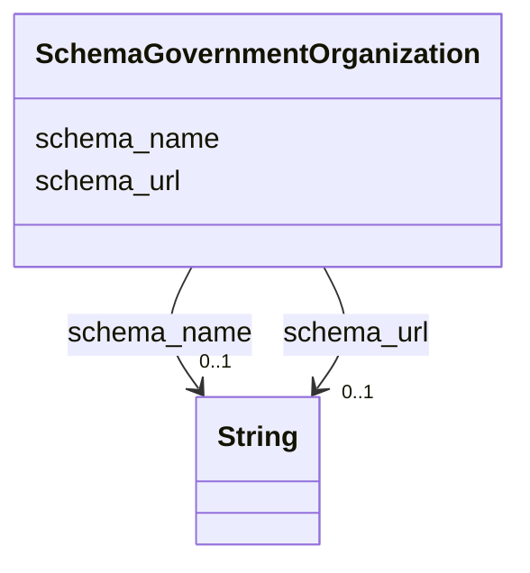

# Class: GovernmentOrganization (schema_GovernmentOrganization)


_A governmental organization or agency._


URI: [schema:GovernmentOrganization](https://schema.org/GovernmentOrganization)





<!-- no inheritance hierarchy -->


## Slots

| Name | Cardinality and Range | Description | Inheritance |
| ---  | --- | --- | --- |
| [schema_name](../slots/schema_name.md) | 0..1 <br/> [xsd:string](xsd:string) | No slot (predicate) description specified <br/> 28216 occurrences with subject type schema_Dataset and object type string.<br/>56432 occurrences with subject type schema_DataDownload and object type string.<br/>41703 occurrences with subject type schema_GovernmentOrganization and object type string.<br/>28216 occurrences with subject type schema_PropertyValue and object type string.<br/>45727 occurrences with untyped subjects and object type string.<br/>243268 occurrences with subject type schema_Place and object type string.<br/>201357 occurrences with subject type hyf__HY_HydroLocation and object type string.<br/>2741 occurrences with subject type http___www.opengeospatial.org_standards_waterml2_hy_features_HY_HydroLocation and object type string.<br/>247 occurrences with subject type schema_Organization and object type string.<br/>165029 occurrences with subject type schema_CreativeWork and object type string. | direct |
| [schema_url](../slots/schema_url.md) | 0..1 <br/> [xsd:string](xsd:string) | No slot (predicate) description specified <br/> 28216 occurrences with subject type schema_Dataset and object type string.<br/>41703 occurrences with subject type schema_GovernmentOrganization and object type string.<br/>28217 occurrences with subject type schema_PropertyValue and object type string.<br/>185722 occurrences with untyped subjects and object type string.<br/>2535 occurrences with subject type schema_Place and object type string.<br/>247 occurrences with subject type schema_Organization and object type string. | direct |


## Usages

| used by | used in | type | used |
| ---  | --- | --- | --- |
| [HttpRdfs.orgNsVoid#Dataset](../classes/HttpRdfs.orgNsVoid#Dataset.md) | [schema_provider](../slots/schema_provider.md) | any_of[range] | [SchemaGovernmentOrganization](../classes/SchemaGovernmentOrganization.md) |
| [HyfHYHydroLocation](../classes/HyfHYHydroLocation.md) | [schema_provider](../slots/schema_provider.md) | any_of[range] | [SchemaGovernmentOrganization](../classes/SchemaGovernmentOrganization.md) |
| [RdfsResource](../classes/RdfsResource.md) | [schema_provider](../slots/schema_provider.md) | any_of[range] | [SchemaGovernmentOrganization](../classes/SchemaGovernmentOrganization.md) |
| [SchemaDataset](../classes/SchemaDataset.md) | [schema_provider](../slots/schema_provider.md) | any_of[range] | [SchemaGovernmentOrganization](../classes/SchemaGovernmentOrganization.md) |
| [SchemaPlace](../classes/SchemaPlace.md) | [schema_provider](../slots/schema_provider.md) | any_of[range] | [SchemaGovernmentOrganization](../classes/SchemaGovernmentOrganization.md) |


## Examples

| Value |
| --- |
| _:b1000006 |


## Identifier and Mapping Information


### Schema Source


* from schema: geoconnex


## Mappings

| Mapping Type | Mapped Value |
| ---  | ---  |
| self | schema:GovernmentOrganization |
| native | geoconnex/:SchemaGovernmentOrganization |


## LinkML Source

<!-- TODO: investigate https://stackoverflow.com/questions/37606292/how-to-create-tabbed-code-blocks-in-mkdocs-or-sphinx -->

### Direct

<details>
```yaml
name: schema_GovernmentOrganization
conforms_to: No schema conformance document specified
description: A governmental organization or agency.
title: GovernmentOrganization
notes:
- Class with 41703 occurrences.
examples:
- value: _:b1000006
from_schema: geoconnex
rank: 1000
slots:
- schema_name
- schema_url
class_uri: schema:GovernmentOrganization

```
</details>

### Induced

<details>
```yaml
name: schema_GovernmentOrganization
conforms_to: No schema conformance document specified
description: A governmental organization or agency.
title: GovernmentOrganization
notes:
- Class with 41703 occurrences.
examples:
- value: _:b1000006
from_schema: geoconnex
rank: 1000
attributes:
  schema_name:
    name: schema_name
    description: No slot (predicate) description specified
    comments:
    - 28216 occurrences with subject type schema_Dataset and object type string.
    - 56432 occurrences with subject type schema_DataDownload and object type string.
    - 41703 occurrences with subject type schema_GovernmentOrganization and object
      type string.
    - 28216 occurrences with subject type schema_PropertyValue and object type string.
    - 45727 occurrences with untyped subjects and object type string.
    - 243268 occurrences with subject type schema_Place and object type string.
    - 201357 occurrences with subject type hyf__HY_HydroLocation and object type string.
    - 2741 occurrences with subject type http___www.opengeospatial.org_standards_waterml2_hy_features_HY_HydroLocation
      and object type string.
    - 247 occurrences with subject type schema_Organization and object type string.
    - 165029 occurrences with subject type schema_CreativeWork and object type string.
    examples:
    - description: schema_Dataset → string
      object:
        example_object: USGS-293229091230800
        example_predicate: schema:name
        example_subject: _:b1000000
    - description: schema_DataDownload → string
      object:
        example_object: USGS SensorThings API
        example_predicate: schema:name
        example_subject: _:b1000004
    - description: schema_GovernmentOrganization → string
      object:
        example_object: U.S. Geological Survey Water Data for the Nation
        example_predicate: schema:name
        example_subject: _:b1000006
    - description: schema_PropertyValue → string
      object:
        example_object: Gage height
        example_predicate: schema:name
        example_subject: _:b1000007
    - description: None → string
      object:
        example_object: Mancos River at Anitas Flat Below Mancos CO
        example_predicate: schema:name
        example_subject: _:b1548067
    - description: schema_Place → string
      object:
        example_object: New England Region
        example_predicate: schema:name
        example_subject: https://geoconnex.us/ref/hu02/01
    - description: hyf__HY_HydroLocation → string
      object:
        example_object: BIG CREEK
        example_predicate: schema:name
        example_subject: https://geoconnex.us/iow/demo/AL00017
    - description: http___www.opengeospatial.org_standards_waterml2_hy_features_HY_HydroLocation
        → string
      object:
        example_object: ALCOVA
        example_predicate: schema:name
        example_subject: https://geoconnex.us/ornl/hydrosource/dams/1
    - description: schema_Organization → string
      object:
        example_object: CUAHSI_CUAHSI_HIS_CRWA_ids__0
        example_predicate: schema:name
        example_subject: https://gleaner.io/id/org/CUAHSI_CUAHSI_HIS_CRWA_ids__0
    - description: schema_CreativeWork → string
      object:
        example_object: HUC12 Pour Points
        example_predicate: schema:name
        example_subject: https://gleaner.io/xid/genid/cksjodsip8t6t2qulttg
    from_schema: geoconnex
    rank: 1000
    slot_uri: schema:name
    alias: schema_name
    owner: schema_GovernmentOrganization
    domain_of:
    - http___www.opengeospatial.org_standards_waterml2_hy_features_HY_HydroLocation
    - hyf__HY_HydroLocation
    - schema_CreativeWork
    - schema_DataDownload
    - schema_Dataset
    - schema_GovernmentOrganization
    - schema_Organization
    - schema_Place
    - schema_PropertyValue
    range: string
  schema_url:
    name: schema_url
    description: No slot (predicate) description specified
    comments:
    - 28216 occurrences with subject type schema_Dataset and object type string.
    - 41703 occurrences with subject type schema_GovernmentOrganization and object
      type string.
    - 28217 occurrences with subject type schema_PropertyValue and object type string.
    - 185722 occurrences with untyped subjects and object type string.
    - 2535 occurrences with subject type schema_Place and object type string.
    - 247 occurrences with subject type schema_Organization and object type string.
    examples:
    - description: schema_Dataset → string
      object:
        example_object: https://waterdata.usgs.gov/monitoring-location/293229091230800/#parameterCode=00010
        example_predicate: schema:url
        example_subject: _:b1000000
    - description: schema_GovernmentOrganization → string
      object:
        example_object: https://waterdata.usgs.gov
        example_predicate: schema:url
        example_subject: _:b1000006
    - description: schema_PropertyValue → string
      object:
        example_object: https://en.wikipedia.org/w/index.php?search=Gage height
        example_predicate: schema:url
        example_subject: _:b1000007
    - description: None → string
      object:
        example_object: https://waterdata.usgs.gov/monitoring-location/14206920
        example_predicate: schema:url
        example_subject: _:b1064837
    - description: schema_Place → string
      object:
        example_object: https://waterdata.usgs.gov
        example_predicate: schema:url
        example_subject: https://geoconnex.us/ca-gage-assessment/gages/09423350
    - description: schema_Organization → string
      object:
        example_object: https://geoconnex.us/sitemap/CUAHSI/CUAHSI_HIS_CRWA_ids__0.xml
        example_predicate: schema:url
        example_subject: https://gleaner.io/id/org/CUAHSI_CUAHSI_HIS_CRWA_ids__0
    from_schema: geoconnex
    rank: 1000
    slot_uri: schema:url
    alias: schema_url
    owner: schema_GovernmentOrganization
    domain_of:
    - schema_Dataset
    - schema_GovernmentOrganization
    - schema_Organization
    - schema_Place
    - schema_PropertyValue
    range: string
class_uri: schema:GovernmentOrganization

```
</details>