# Class: Place (schema_Place)


_Entities that have a somewhat fixed, physical extension._


URI: [schema:Place](https://schema.org/Place)

```mermaid
 classDiagram
    class SchemaPlace
    click SchemaPlace href "../SchemaPlace"
      SchemaPlace : badwdt_P2043
        
          
    
    
    SchemaPlace --> "0..1" Any : badwdt_P2043
    click Any href "../Any"

        
      SchemaPlace : badwdt_P2053
        
          
    
    
    SchemaPlace --> "0..1" Any : badwdt_P2053
    click Any href "../Any"

        
      SchemaPlace : badwdt_P403
        
          
    
    
    SchemaPlace --> "0..1" Uri : badwdt_P403
    click Uri href "../Uri"

        
      SchemaPlace : badwdt_P885
        
          
    
    
    SchemaPlace --> "0..1" Uri : badwdt_P885
    click Uri href "../Uri"

        
      SchemaPlace : geo_hasGeometry
        
          
    
    
    SchemaPlace --> "0..1" Any : geo_hasGeometry
    click Any href "../Any"

        
      SchemaPlace : gsp_hasGeometry
        
          
    
    
    SchemaPlace --> "0..1" Any : gsp_hasGeometry
    click Any href "../Any"

        
      SchemaPlace : http___www.opengeospatial.org_standards_waterml2_hy_features_flowpath
        
          
    
    
    SchemaPlace --> "0..1" Uri : http___www.opengeospatial.org_standards_waterml2_hy_features_flowpath
    click Uri href "../Uri"

        
      SchemaPlace : hyf__containingCatchment
        
          
    
    
    SchemaPlace --> "0..1" Any : hyf__containingCatchment
    click Any href "../Any"

        
      SchemaPlace : hyf_downstreamWaterbody
        
          
    
    
    SchemaPlace --> "0..1" SchemaPlace : hyf_downstreamWaterbody
    click SchemaPlace href "../SchemaPlace"

        
      SchemaPlace : hyf_encompassingCatchment
        
          
    
    
    SchemaPlace --> "0..1" SchemaPlace : hyf_encompassingCatchment
    click SchemaPlace href "../SchemaPlace"

        
      SchemaPlace : schema_about
        
          
    
    
    SchemaPlace --> "0..1" Uri : schema_about
    click Uri href "../Uri"

        
      SchemaPlace : schema_description
        
          
    
    
    SchemaPlace --> "0..1" String : schema_description
    click String href "../String"

        
      SchemaPlace : schema_geo
        
          
    
    
    SchemaPlace --> "0..1" Any : schema_geo
    click Any href "../Any"

        
      SchemaPlace : schema_geoIntersects
        
          
    
    
    SchemaPlace --> "0..1" String : schema_geoIntersects
    click String href "../String"

        
      SchemaPlace : schema_geoWithin
        
          
    
    
    SchemaPlace --> "0..1" Any : schema_geoWithin
    click Any href "../Any"

        
      SchemaPlace : schema_isBasedOn
        
          
    
    
    SchemaPlace --> "0..1" Uri : schema_isBasedOn
    click Uri href "../Uri"

        
      SchemaPlace : schema_location
        
          
    
    
    SchemaPlace --> "0..1" Uri : schema_location
    click Uri href "../Uri"

        
      SchemaPlace : schema_name
        
          
    
    
    SchemaPlace --> "0..1" String : schema_name
    click String href "../String"

        
      SchemaPlace : schema_provider
        
          
    
    
    SchemaPlace --> "0..1" Any : schema_provider
    click Any href "../Any"

        
      SchemaPlace : schema_sameAs
        
          
    
    
    SchemaPlace --> "0..1" SchemaPlace : schema_sameAs
    click SchemaPlace href "../SchemaPlace"

        
      SchemaPlace : schema_subjectOf
        
          
    
    
    SchemaPlace --> "0..1" Any : schema_subjectOf
    click Any href "../Any"

        
      SchemaPlace : schema_supersededBy
        
          
    
    
    SchemaPlace --> "0..1" Any : schema_supersededBy
    click Any href "../Any"

        
      SchemaPlace : schema_url
        
          
    
    
    SchemaPlace --> "0..1" String : schema_url
    click String href "../String"

        
      SchemaPlace : sosa_hasFeatureOfInterest
        
          
    
    
    SchemaPlace --> "0..1" Any : sosa_hasFeatureOfInterest
    click Any href "../Any"

        
      SchemaPlace : sosa_ObservationCollection
        
          
    
    
    SchemaPlace --> "0..1" String : sosa_ObservationCollection
    click String href "../String"

        
      
```





<!-- no inheritance hierarchy -->


## Slots

| Name | Cardinality and Range | Description | Inheritance |
| ---  | --- | --- | --- |
| [schema_geo](../slots/schema_geo.md) | 0..1 <br/> [SchemaGeoShape](../classes/SchemaGeoShape.md)&nbsp;or&nbsp;<br />[xsd:anyURI](xsd:anyURI)&nbsp;or&nbsp;<br />[SchemaGeoCoordinates](../classes/SchemaGeoCoordinates.md) | No slot (predicate) description specified <br/> 427661 occurrences with subject type schema_Place and object type schema_GeoShape.<br/>1944 occurrences with subject type schema_Place and object type uri.<br/>6 occurrences with untyped subjects and object type schema:GeoCoordinates.<br/>200804 occurrences with subject type schema_Place and object type schema_GeoCoordinates.<br/>10247 occurrences with subject type http___www.opengeospatial.org_standards_waterml2_hy_features_HY_HydroLocation and object type schema_GeoCoordinates.<br/>385003 occurrences with subject type hyf__HY_HydroLocation and object type schema_GeoCoordinates. | direct |
| [schema_name](../slots/schema_name.md) | 0..1 <br/> [xsd:string](xsd:string) | No slot (predicate) description specified <br/> 28216 occurrences with subject type schema_Dataset and object type string.<br/>56432 occurrences with subject type schema_DataDownload and object type string.<br/>41703 occurrences with subject type schema_GovernmentOrganization and object type string.<br/>28216 occurrences with subject type schema_PropertyValue and object type string.<br/>45727 occurrences with untyped subjects and object type string.<br/>243268 occurrences with subject type schema_Place and object type string.<br/>201357 occurrences with subject type hyf__HY_HydroLocation and object type string.<br/>2741 occurrences with subject type http___www.opengeospatial.org_standards_waterml2_hy_features_HY_HydroLocation and object type string.<br/>247 occurrences with subject type schema_Organization and object type string.<br/>165029 occurrences with subject type schema_CreativeWork and object type string. | direct |
| [schema_url](../slots/schema_url.md) | 0..1 <br/> [xsd:string](xsd:string) | No slot (predicate) description specified <br/> 28216 occurrences with subject type schema_Dataset and object type string.<br/>41703 occurrences with subject type schema_GovernmentOrganization and object type string.<br/>28217 occurrences with subject type schema_PropertyValue and object type string.<br/>185722 occurrences with untyped subjects and object type string.<br/>2535 occurrences with subject type schema_Place and object type string.<br/>247 occurrences with subject type schema_Organization and object type string. | direct |
| [schema_sameAs](../slots/schema_sameAs.md) | 0..1 <br/> [SchemaPlace](../classes/SchemaPlace.md) | No slot (predicate) description specified <br/> 118 occurrences with subject type schema_Place and object type schema_Place. | direct |
| [geo_hasGeometry](../slots/geo_hasGeometry.md) | 0..1 <br/> [Sf#LineString](../classes/Sf#LineString.md)&nbsp;or&nbsp;<br />[Sf#Point](../classes/Sf#Point.md)&nbsp;or&nbsp;<br />[Sf#GeometryCollection](../classes/Sf#GeometryCollection.md)&nbsp;or&nbsp;<br />[Sf#MultiPolygon](../classes/Sf#MultiPolygon.md)&nbsp;or&nbsp;<br />[Sf#Polygon](../classes/Sf#Polygon.md) | No slot (predicate) description specified <br/> 319697 occurrences with subject type schema_Place and object type sf_#MultiPolygon.<br/>101786 occurrences with subject type schema_Place and object type sf_#LineString.<br/>32790 occurrences with subject type schema_Place and object type sf_#Polygon.<br/>200617 occurrences with subject type schema_Place and object type sf_#Point.<br/>387017 occurrences with subject type hyf__HY_HydroLocation and object type sf_#Point.<br/>10247 occurrences with subject type http___www.opengeospatial.org_standards_waterml2_hy_features_HY_HydroLocation and object type sf_#Point.<br/>5 occurrences with subject type schema_Place and object type sf_#GeometryCollection. | direct |
| [hyf_encompassingCatchment](../slots/hyf_encompassingCatchment.md) | 0..1 <br/> [SchemaPlace](../classes/SchemaPlace.md) | No slot (predicate) description specified <br/> 87699 occurrences with subject type schema_Place and object type schema_Place. | direct |
| [badwdt_P403](../slots/badwdt_P403.md) | 0..1 <br/> [xsd:anyURI](xsd:anyURI) | No slot (predicate) description specified <br/> 63891 occurrences with subject type schema_Place and object type uri. | direct |
| [badwdt_P2053](../slots/badwdt_P2053.md) | 0..1 <br/> [xsd:integer](xsd:integer)&nbsp;or&nbsp;<br />[xsd:double](xsd:double) | No slot (predicate) description specified <br/> 30375 occurrences with subject type schema_Place and object type double.<br/>3476 occurrences with subject type schema_Place and object type integer. | direct |
| [schema_about](../slots/schema_about.md) | 0..1 <br/> [xsd:anyURI](xsd:anyURI) | No slot (predicate) description specified <br/> 2536 occurrences with subject type schema_Place and object type uri. | direct |
| [sosa_hasFeatureOfInterest](../slots/sosa_hasFeatureOfInterest.md) | 0..1 <br/> [xsd:anyURI](xsd:anyURI)&nbsp;or&nbsp;<br />[xsd:string](xsd:string) | No slot (predicate) description specified <br/> 1 occurrences with subject type schema_Place and object type uri.<br/>1 occurrences with subject type schema_Place and object type string. | direct |
| [schema_subjectOf](../slots/schema_subjectOf.md) | 0..1 <br/> [SchemaDataset](../classes/SchemaDataset.md)&nbsp;or&nbsp;<br />[xsd:anyURI](xsd:anyURI) | No slot (predicate) description specified <br/> 78891 occurrences with subject type schema_Place and object type uri.<br/>8804 occurrences with subject type http___www.opengeospatial.org_standards_waterml2_hy_features_HY_HydroLocation and object type uri.<br/>185645 occurrences with subject type hyf__HY_HydroLocation and object type uri.<br/>28216 occurrences with subject type hyf__HY_HydroLocation and object type schema_Dataset. | direct |
| [http___www.opengeospatial.org_standards_waterml2_hy_features_flowpath](../slots/http___www.opengeospatial.org_standards_waterml2_hy_features_flowpath.md) | 0..1 <br/> [xsd:anyURI](xsd:anyURI) | No slot (predicate) description specified <br/> 2536 occurrences with subject type schema_Place and object type uri.<br/>3416 occurrences with subject type http___www.opengeospatial.org_standards_waterml2_hy_features_HY_HydroLocation and object type uri. | direct |
| [schema_description](../slots/schema_description.md) | 0..1 <br/> [xsd:string](xsd:string) | No slot (predicate) description specified <br/> 28216 occurrences with subject type schema_Dataset and object type string.<br/>28217 occurrences with subject type schema_PropertyValue and object type string.<br/>17510 occurrences with untyped subjects and object type string.<br/>187886 occurrences with subject type hyf__HY_HydroLocation and object type string.<br/>107289 occurrences with subject type schema_Place and object type string. | direct |
| [schema_geoIntersects](../slots/schema_geoIntersects.md) | 0..1 <br/> [xsd:string](xsd:string) | No slot (predicate) description specified <br/> 45668 occurrences with subject type schema_Place and object type string. | direct |
| [hyf_downstreamWaterbody](../slots/hyf_downstreamWaterbody.md) | 0..1 <br/> [SchemaPlace](../classes/SchemaPlace.md) | No slot (predicate) description specified <br/> 31952 occurrences with subject type schema_Place and object type schema_Place. | direct |
| [schema_geoWithin](../slots/schema_geoWithin.md) | 0..1 <br/> [xsd:anyURI](xsd:anyURI)&nbsp;or&nbsp;<br />[xsd:string](xsd:string)&nbsp;or&nbsp;<br />[SchemaPlace](../classes/SchemaPlace.md) | No slot (predicate) description specified <br/> 53554 occurrences with subject type schema_Place and object type schema_Place.<br/>2536 occurrences with subject type schema_Place and object type uri.<br/>2014 occurrences with subject type hyf__HY_HydroLocation and object type string.<br/>3416 occurrences with subject type http___www.opengeospatial.org_standards_waterml2_hy_features_HY_HydroLocation and object type schema_Place.<br/>3075 occurrences with subject type http___www.opengeospatial.org_standards_waterml2_hy_features_HY_HydroLocation and object type uri. | direct |
| [schema_location](../slots/schema_location.md) | 0..1 <br/> [xsd:anyURI](xsd:anyURI) | No slot (predicate) description specified <br/> 17510 occurrences with subject type schema_Place and object type uri. | direct |
| [schema_supersededBy](../slots/schema_supersededBy.md) | 0..1 <br/> [xsd:anyURI](xsd:anyURI)&nbsp;or&nbsp;<br />[SchemaPlace](../classes/SchemaPlace.md) | No slot (predicate) description specified <br/> 214 occurrences with subject type schema_Place and object type schema_Place.<br/>18 occurrences with subject type schema_Place and object type uri. | direct |
| [badwdt_P885](../slots/badwdt_P885.md) | 0..1 <br/> [xsd:anyURI](xsd:anyURI) | No slot (predicate) description specified <br/> 63522 occurrences with subject type schema_Place and object type uri. | direct |
| [gsp_hasGeometry](../slots/gsp_hasGeometry.md) | 0..1 <br/> [Sf#Point](../classes/Sf#Point.md)&nbsp;or&nbsp;<br />[Sf#Polygon](../classes/Sf#Polygon.md)&nbsp;or&nbsp;<br />[Sf#MultiPolygon](../classes/Sf#MultiPolygon.md) | No slot (predicate) description specified <br/> 187 occurrences with subject type schema_Place and object type sf_#Point.<br/>77 occurrences with subject type hyf__HY_HydroLocation and object type sf_#Point.<br/>353 occurrences with subject type schema_Place and object type sf_#MultiPolygon.<br/>171 occurrences with subject type schema_Place and object type sf_#Polygon. | direct |
| [sosa_ObservationCollection](../slots/sosa_ObservationCollection.md) | 0..1 <br/> [xsd:string](xsd:string) | No slot (predicate) description specified <br/> 6788 occurrences with subject type schema_Place and object type string. | direct |
| [schema_provider](../slots/schema_provider.md) | 0..1 <br/> [xsd:anyURI](xsd:anyURI)&nbsp;or&nbsp;<br />[SchemaGovernmentOrganization](../classes/SchemaGovernmentOrganization.md)&nbsp;or&nbsp;<br />[schema_url](../slots/schema_url.md) | No slot (predicate) description specified <br/> 28216 occurrences with subject type schema_Dataset and object type schema_GovernmentOrganization.<br/>1 occurrences with subject type http___rdfs.org_ns_void#Dataset and object type uri.<br/>2 occurrences with subject type rdfs_Resource and object type uri.<br/>98534 occurrences with subject type schema_Place and object type schema_url.<br/>185872 occurrences with subject type hyf__HY_HydroLocation and object type uri.<br/>13487 occurrences with subject type hyf__HY_HydroLocation and object type schema_GovernmentOrganization. | direct |
| [badwdt_P2043](../slots/badwdt_P2043.md) | 0..1 <br/> [xsd:integer](xsd:integer)&nbsp;or&nbsp;<br />[xsd:string](xsd:string)&nbsp;or&nbsp;<br />[xsd:double](xsd:double) | No slot (predicate) description specified <br/> 34082 occurrences with subject type schema_Place and object type string.<br/>3458 occurrences with subject type schema_Place and object type integer.<br/>30393 occurrences with subject type schema_Place and object type double. | direct |
| [schema_isBasedOn](../slots/schema_isBasedOn.md) | 0..1 <br/> [xsd:anyURI](xsd:anyURI) | No slot (predicate) description specified <br/> 85031 occurrences with subject type schema_Place and object type uri. | direct |
| [hyf__containingCatchment](../slots/hyf__containingCatchment.md) | 0..1 <br/> [xsd:anyURI](xsd:anyURI)&nbsp;or&nbsp;<br />[SchemaPlace](../classes/SchemaPlace.md) | No slot (predicate) description specified <br/> 83018 occurrences with subject type schema_Place and object type schema_Place.<br/>9 occurrences with subject type schema_Place and object type uri. | direct |


## Usages

| used by | used in | type | used |
| ---  | --- | --- | --- |
| [HttpWww.opengeospatial.orgStandardsWaterml2HyFeaturesHYHydroLocation](../classes/HttpWww.opengeospatial.orgStandardsWaterml2HyFeaturesHYHydroLocation.md) | [schema_geoWithin](../slots/schema_geoWithin.md) | any_of[range] | [SchemaPlace](../classes/SchemaPlace.md) |
| [HyfHYHydroLocation](../classes/HyfHYHydroLocation.md) | [schema_geoWithin](../slots/schema_geoWithin.md) | any_of[range] | [SchemaPlace](../classes/SchemaPlace.md) |
| [SchemaPlace](../classes/SchemaPlace.md) | [schema_sameAs](../slots/schema_sameAs.md) | range | [SchemaPlace](../classes/SchemaPlace.md) |
| [SchemaPlace](../classes/SchemaPlace.md) | [hyf_encompassingCatchment](../slots/hyf_encompassingCatchment.md) | range | [SchemaPlace](../classes/SchemaPlace.md) |
| [SchemaPlace](../classes/SchemaPlace.md) | [hyf_downstreamWaterbody](../slots/hyf_downstreamWaterbody.md) | range | [SchemaPlace](../classes/SchemaPlace.md) |
| [SchemaPlace](../classes/SchemaPlace.md) | [schema_geoWithin](../slots/schema_geoWithin.md) | any_of[range] | [SchemaPlace](../classes/SchemaPlace.md) |
| [SchemaPlace](../classes/SchemaPlace.md) | [schema_supersededBy](../slots/schema_supersededBy.md) | any_of[range] | [SchemaPlace](../classes/SchemaPlace.md) |
| [SchemaPlace](../classes/SchemaPlace.md) | [hyf__containingCatchment](../slots/hyf__containingCatchment.md) | any_of[range] | [SchemaPlace](../classes/SchemaPlace.md) |


## Identifier and Mapping Information


### Schema Source


* from schema: geoconnex


## Mappings

| Mapping Type | Mapped Value |
| ---  | ---  |
| self | schema:Place |
| native | geoconnex/:SchemaPlace |


## LinkML Source

<!-- TODO: investigate https://stackoverflow.com/questions/37606292/how-to-create-tabbed-code-blocks-in-mkdocs-or-sphinx -->

### Direct

<details>
```yaml
name: schema_Place
conforms_to: No schema conformance document specified
description: Entities that have a somewhat fixed, physical extension.
title: Place
notes:
- Class with 253321 occurrences.
from_schema: geoconnex
rank: 1000
slots:
- schema_geo
- schema_name
- schema_url
- schema_sameAs
- geo_hasGeometry
- hyf_encompassingCatchment
- badwdt_P403
- badwdt_P2053
- schema_about
- sosa_hasFeatureOfInterest
- schema_subjectOf
- http___www.opengeospatial.org_standards_waterml2_hy_features_flowpath
- schema_description
- schema_geoIntersects
- hyf_downstreamWaterbody
- schema_geoWithin
- schema_location
- schema_supersededBy
- badwdt_P885
- gsp_hasGeometry
- sosa_ObservationCollection
- schema_provider
- badwdt_P2043
- schema_isBasedOn
- hyf__containingCatchment
class_uri: schema:Place

```
</details>

### Induced

<details>
```yaml
name: schema_Place
conforms_to: No schema conformance document specified
description: Entities that have a somewhat fixed, physical extension.
title: Place
notes:
- Class with 253321 occurrences.
from_schema: geoconnex
rank: 1000
attributes:
  schema_geo:
    name: schema_geo
    description: No slot (predicate) description specified
    comments:
    - 427661 occurrences with subject type schema_Place and object type schema_GeoShape.
    - 1944 occurrences with subject type schema_Place and object type uri.
    - 6 occurrences with untyped subjects and object type schema:GeoCoordinates.
    - 200804 occurrences with subject type schema_Place and object type schema_GeoCoordinates.
    - 10247 occurrences with subject type http___www.opengeospatial.org_standards_waterml2_hy_features_HY_HydroLocation
      and object type schema_GeoCoordinates.
    - 385003 occurrences with subject type hyf__HY_HydroLocation and object type schema_GeoCoordinates.
    examples:
    - description: schema_Place → schema_GeoShape
      object:
        example_object: https://gleaner.io/xid/genid/crht3s93cv0c73e1d160
        example_predicate: schema:geo
        example_subject: https://geoconnex.us/ref/ua10/98263
    - description: schema_Place → uri
      object:
        example_object: _:b1546204
        example_predicate: schema:geo
        example_subject: https://geoconnex.us/ref/hu02/01
    - description: None → schema_GeoCoordinates
      object:
        example_object: https://gleaner.io/xid/genid/cl2fdb4ip8tadg8qd0u0
        example_predicate: schema:geo
        example_subject: https://gleaner.io/xid/genid/cl2fdb4ip8tadg8qd0ug
    - description: schema_Place → schema_GeoCoordinates
      object:
        example_object: _:b842332
        example_predicate: schema:geo
        example_subject: https://sta.geoconnex.dev/collections/WQIE-WQP/Datastreams/items/'007ab627-00bf-f48c-a27c-d1af60f4e3c6'
    - description: http___www.opengeospatial.org_standards_waterml2_hy_features_HY_HydroLocation
        → schema_GeoCoordinates
      object:
        example_object: https://gleaner.io/xid/genid/ckh8pd4ip8t5ksin205g
        example_predicate: schema:geo
        example_subject: https://geoconnex.us/ornl/hydrosource/dams/999
    - description: hyf__HY_HydroLocation → schema_GeoCoordinates
      object:
        example_object: _:b850486
        example_predicate: schema:geo
        example_subject: https://sta.geoconnex.dev/collections/USGS/Things/items/'USNWS-390855089210900'
    from_schema: geoconnex
    rank: 1000
    slot_uri: schema:geo
    alias: schema_geo
    owner: schema_Place
    domain_of:
    - http___www.opengeospatial.org_standards_waterml2_hy_features_HY_HydroLocation
    - hyf__HY_HydroLocation
    - schema_Place
    range: Any
    any_of:
    - range: schema_GeoShape
    - range: uri
    - range: schema_GeoCoordinates
  schema_name:
    name: schema_name
    description: No slot (predicate) description specified
    comments:
    - 28216 occurrences with subject type schema_Dataset and object type string.
    - 56432 occurrences with subject type schema_DataDownload and object type string.
    - 41703 occurrences with subject type schema_GovernmentOrganization and object
      type string.
    - 28216 occurrences with subject type schema_PropertyValue and object type string.
    - 45727 occurrences with untyped subjects and object type string.
    - 243268 occurrences with subject type schema_Place and object type string.
    - 201357 occurrences with subject type hyf__HY_HydroLocation and object type string.
    - 2741 occurrences with subject type http___www.opengeospatial.org_standards_waterml2_hy_features_HY_HydroLocation
      and object type string.
    - 247 occurrences with subject type schema_Organization and object type string.
    - 165029 occurrences with subject type schema_CreativeWork and object type string.
    examples:
    - description: schema_Dataset → string
      object:
        example_object: USGS-293229091230800
        example_predicate: schema:name
        example_subject: _:b1000000
    - description: schema_DataDownload → string
      object:
        example_object: USGS SensorThings API
        example_predicate: schema:name
        example_subject: _:b1000004
    - description: schema_GovernmentOrganization → string
      object:
        example_object: U.S. Geological Survey Water Data for the Nation
        example_predicate: schema:name
        example_subject: _:b1000006
    - description: schema_PropertyValue → string
      object:
        example_object: Gage height
        example_predicate: schema:name
        example_subject: _:b1000007
    - description: None → string
      object:
        example_object: Mancos River at Anitas Flat Below Mancos CO
        example_predicate: schema:name
        example_subject: _:b1548067
    - description: schema_Place → string
      object:
        example_object: New England Region
        example_predicate: schema:name
        example_subject: https://geoconnex.us/ref/hu02/01
    - description: hyf__HY_HydroLocation → string
      object:
        example_object: BIG CREEK
        example_predicate: schema:name
        example_subject: https://geoconnex.us/iow/demo/AL00017
    - description: http___www.opengeospatial.org_standards_waterml2_hy_features_HY_HydroLocation
        → string
      object:
        example_object: ALCOVA
        example_predicate: schema:name
        example_subject: https://geoconnex.us/ornl/hydrosource/dams/1
    - description: schema_Organization → string
      object:
        example_object: CUAHSI_CUAHSI_HIS_CRWA_ids__0
        example_predicate: schema:name
        example_subject: https://gleaner.io/id/org/CUAHSI_CUAHSI_HIS_CRWA_ids__0
    - description: schema_CreativeWork → string
      object:
        example_object: HUC12 Pour Points
        example_predicate: schema:name
        example_subject: https://gleaner.io/xid/genid/cksjodsip8t6t2qulttg
    from_schema: geoconnex
    rank: 1000
    slot_uri: schema:name
    alias: schema_name
    owner: schema_Place
    domain_of:
    - http___www.opengeospatial.org_standards_waterml2_hy_features_HY_HydroLocation
    - hyf__HY_HydroLocation
    - schema_CreativeWork
    - schema_DataDownload
    - schema_Dataset
    - schema_GovernmentOrganization
    - schema_Organization
    - schema_Place
    - schema_PropertyValue
    range: string
  schema_url:
    name: schema_url
    description: No slot (predicate) description specified
    comments:
    - 28216 occurrences with subject type schema_Dataset and object type string.
    - 41703 occurrences with subject type schema_GovernmentOrganization and object
      type string.
    - 28217 occurrences with subject type schema_PropertyValue and object type string.
    - 185722 occurrences with untyped subjects and object type string.
    - 2535 occurrences with subject type schema_Place and object type string.
    - 247 occurrences with subject type schema_Organization and object type string.
    examples:
    - description: schema_Dataset → string
      object:
        example_object: https://waterdata.usgs.gov/monitoring-location/293229091230800/#parameterCode=00010
        example_predicate: schema:url
        example_subject: _:b1000000
    - description: schema_GovernmentOrganization → string
      object:
        example_object: https://waterdata.usgs.gov
        example_predicate: schema:url
        example_subject: _:b1000006
    - description: schema_PropertyValue → string
      object:
        example_object: https://en.wikipedia.org/w/index.php?search=Gage height
        example_predicate: schema:url
        example_subject: _:b1000007
    - description: None → string
      object:
        example_object: https://waterdata.usgs.gov/monitoring-location/14206920
        example_predicate: schema:url
        example_subject: _:b1064837
    - description: schema_Place → string
      object:
        example_object: https://waterdata.usgs.gov
        example_predicate: schema:url
        example_subject: https://geoconnex.us/ca-gage-assessment/gages/09423350
    - description: schema_Organization → string
      object:
        example_object: https://geoconnex.us/sitemap/CUAHSI/CUAHSI_HIS_CRWA_ids__0.xml
        example_predicate: schema:url
        example_subject: https://gleaner.io/id/org/CUAHSI_CUAHSI_HIS_CRWA_ids__0
    from_schema: geoconnex
    rank: 1000
    slot_uri: schema:url
    alias: schema_url
    owner: schema_Place
    domain_of:
    - schema_Dataset
    - schema_GovernmentOrganization
    - schema_Organization
    - schema_Place
    - schema_PropertyValue
    range: string
  schema_sameAs:
    name: schema_sameAs
    description: No slot (predicate) description specified
    comments:
    - 118 occurrences with subject type schema_Place and object type schema_Place.
    examples:
    - description: schema_Place → schema_Place
      object:
        example_object: https://geoconnex.us/ref/nat_aq/N9999OTHER
        example_predicate: schema:sameAs
        example_subject: https://geoconnex.us/ref/principal_aq/999
    from_schema: geoconnex
    rank: 1000
    slot_uri: schema:sameAs
    alias: schema_sameAs
    owner: schema_Place
    domain_of:
    - schema_Place
    range: schema_Place
  geo_hasGeometry:
    name: geo_hasGeometry
    description: No slot (predicate) description specified
    comments:
    - 319697 occurrences with subject type schema_Place and object type sf_#MultiPolygon.
    - 101786 occurrences with subject type schema_Place and object type sf_#LineString.
    - 32790 occurrences with subject type schema_Place and object type sf_#Polygon.
    - 200617 occurrences with subject type schema_Place and object type sf_#Point.
    - 387017 occurrences with subject type hyf__HY_HydroLocation and object type sf_#Point.
    - 10247 occurrences with subject type http___www.opengeospatial.org_standards_waterml2_hy_features_HY_HydroLocation
      and object type sf_#Point.
    - 5 occurrences with subject type schema_Place and object type sf_#GeometryCollection.
    examples:
    - description: schema_Place → sf_#MultiPolygon
      object:
        example_object: https://gleaner.io/xid/genid/crht3s93cv0c73e1d15g
        example_predicate: geo:hasGeometry
        example_subject: https://geoconnex.us/ref/ua10/98263
    - description: schema_Place → sf_#LineString
      object:
        example_object: https://gleaner.io/xid/genid/cks4khsip8tc7lvlbq90
        example_predicate: geo:hasGeometry
        example_subject: https://geoconnex.us/ref/mainstems/99895
    - description: schema_Place → sf_#Polygon
      object:
        example_object: _:b783557
        example_predicate: geo:hasGeometry
        example_subject: https://geoconnex.us/ref/pws/WY5680103
    - description: schema_Place → sf_#Point
      object:
        example_object: _:b842331
        example_predicate: geo:hasGeometry
        example_subject: https://sta.geoconnex.dev/collections/WQIE-WQP/Datastreams/items/'007ab627-00bf-f48c-a27c-d1af60f4e3c6'
    - description: hyf__HY_HydroLocation → sf_#Point
      object:
        example_object: _:b850485
        example_predicate: geo:hasGeometry
        example_subject: https://sta.geoconnex.dev/collections/USGS/Things/items/'USNWS-390855089210900'
    - description: http___www.opengeospatial.org_standards_waterml2_hy_features_HY_HydroLocation
        → sf_#Point
      object:
        example_object: https://gleaner.io/xid/genid/ckh8pd4ip8t5ksin2050
        example_predicate: geo:hasGeometry
        example_subject: https://geoconnex.us/ornl/hydrosource/dams/999
    - description: schema_Place → sf_#GeometryCollection
      object:
        example_object: _:b163095
        example_predicate: geo:hasGeometry
        example_subject: https://geoconnex.us/ref/pws/SC0720003
    from_schema: geoconnex
    rank: 1000
    slot_uri: geo:hasGeometry
    alias: geo_hasGeometry
    owner: schema_Place
    domain_of:
    - http___www.opengeospatial.org_standards_waterml2_hy_features_HY_HydroLocation
    - hyf__HY_HydroLocation
    - schema_Place
    range: Any
    any_of:
    - range: sf_#LineString
    - range: sf_#Point
    - range: sf_#GeometryCollection
    - range: sf_#MultiPolygon
    - range: sf_#Polygon
  hyf_encompassingCatchment:
    name: hyf_encompassingCatchment
    description: No slot (predicate) description specified
    comments:
    - 87699 occurrences with subject type schema_Place and object type schema_Place.
    examples:
    - description: schema_Place → schema_Place
      object:
        example_object: https://geoconnex.us/ref/mainstems/44303
        example_predicate: hyf:encompassingCatchment
        example_subject: https://geoconnex.us/ref/mainstems/99895
    from_schema: geoconnex
    rank: 1000
    slot_uri: hyf:encompassingCatchment
    alias: hyf_encompassingCatchment
    owner: schema_Place
    domain_of:
    - schema_Place
    range: schema_Place
  badwdt_P403:
    name: badwdt_P403
    description: No slot (predicate) description specified
    comments:
    - 63891 occurrences with subject type schema_Place and object type uri.
    examples:
    - description: schema_Place → uri
      object:
        example_object: https://geoconnex.us/nhdplusv2/comid/15048261
        example_predicate: badwdt:P403
        example_subject: https://geoconnex.us/ref/mainstems/1
    from_schema: geoconnex
    rank: 1000
    slot_uri: badwdt:P403
    alias: badwdt_P403
    owner: schema_Place
    domain_of:
    - schema_Place
    range: uri
  badwdt_P2053:
    name: badwdt_P2053
    description: No slot (predicate) description specified
    comments:
    - 30375 occurrences with subject type schema_Place and object type double.
    - 3476 occurrences with subject type schema_Place and object type integer.
    examples:
    - description: schema_Place → double
      object:
        example_object: '66999.6'
        example_predicate: badwdt:P2053
        example_subject: https://geoconnex.us/ref/mainstems/1
    - description: schema_Place → integer
      object:
        example_object: '112'
        example_predicate: badwdt:P2053
        example_subject: https://geoconnex.us/ref/mainstems/101400
    from_schema: geoconnex
    rank: 1000
    slot_uri: badwdt:P2053
    alias: badwdt_P2053
    owner: schema_Place
    domain_of:
    - schema_Place
    range: Any
    any_of:
    - range: integer
    - range: double
  schema_about:
    name: schema_about
    description: No slot (predicate) description specified
    comments:
    - 2536 occurrences with subject type schema_Place and object type uri.
    examples:
    - description: schema_Place → uri
      object:
        example_object: https://geoconnex.us/usgs/monitoring-location/09423350
        example_predicate: schema:about
        example_subject: https://geoconnex.us/ca-gage-assessment/gages/09423350
    from_schema: geoconnex
    rank: 1000
    slot_uri: schema:about
    alias: schema_about
    owner: schema_Place
    domain_of:
    - schema_Place
    range: uri
  sosa_hasFeatureOfInterest:
    name: sosa_hasFeatureOfInterest
    description: No slot (predicate) description specified
    comments:
    - 1 occurrences with subject type schema_Place and object type uri.
    - 1 occurrences with subject type schema_Place and object type string.
    examples:
    - description: schema_Place → uri
      object:
        example_object: _:b1548067
        example_predicate: sosa:hasFeatureOfInterest
        example_subject: https://sta.geoconnex.dev/collections/WQIE-WQP/Datastreams/items/'007ab627-00bf-f48c-a27c-d1af60f4e3c6'
    - description: schema_Place → string
      object:
        example_object: https://sta.geoconnex.dev/collections/WQIE-WQP/Things/items/'11NPSWRD_WQX-MEVE_3P_MAN01'
        example_predicate: sosa:hasFeatureOfInterest
        example_subject: https://sta.geoconnex.dev/collections/WQIE-WQP/Datastreams/items/'007ab627-00bf-f48c-a27c-d1af60f4e3c6'
    from_schema: geoconnex
    rank: 1000
    slot_uri: sosa:hasFeatureOfInterest
    alias: sosa_hasFeatureOfInterest
    owner: schema_Place
    domain_of:
    - schema_Place
    range: Any
    any_of:
    - range: uri
    - range: string
  schema_subjectOf:
    name: schema_subjectOf
    description: No slot (predicate) description specified
    comments:
    - 78891 occurrences with subject type schema_Place and object type uri.
    - 8804 occurrences with subject type http___www.opengeospatial.org_standards_waterml2_hy_features_HY_HydroLocation
      and object type uri.
    - 185645 occurrences with subject type hyf__HY_HydroLocation and object type uri.
    - 28216 occurrences with subject type hyf__HY_HydroLocation and object type schema_Dataset.
    examples:
    - description: schema_Place → uri
      object:
        example_object: https://geonames.usgs.gov/apex/f?p=gnispq:3:::NO::P3_FID:2730131
        example_predicate: schema:subjectOf
        example_subject: https://geoconnex.us/ref/hu02/01
    - description: http___www.opengeospatial.org_standards_waterml2_hy_features_HY_HydroLocation
        → uri
      object:
        example_object: https://hydrosource.ornl.gov/dataset/existing-hydropower-assets-eha-capacity-factor-plant-database-2005-2019
        example_predicate: schema:subjectOf
        example_subject: https://geoconnex.us/ornl/hydrosource/dams/1
    - description: hyf__HY_HydroLocation → uri
      object:
        example_object: _:b1159177
        example_predicate: schema:subjectOf
        example_subject: https://geoconnex.us/ref/gages/1000001
    - description: hyf__HY_HydroLocation → schema_Dataset
      object:
        example_object: _:b939199
        example_predicate: schema:subjectOf
        example_subject: https://sta.geoconnex.dev/collections/USGS/Things/items/'USGS-625632151172901'
    from_schema: geoconnex
    rank: 1000
    slot_uri: schema:subjectOf
    alias: schema_subjectOf
    owner: schema_Place
    domain_of:
    - http___www.opengeospatial.org_standards_waterml2_hy_features_HY_HydroLocation
    - hyf__HY_HydroLocation
    - schema_Place
    range: Any
    any_of:
    - range: schema_Dataset
    - range: uri
  http___www.opengeospatial.org_standards_waterml2_hy_features_flowpath:
    name: http___www.opengeospatial.org_standards_waterml2_hy_features_flowpath
    description: No slot (predicate) description specified
    comments:
    - 2536 occurrences with subject type schema_Place and object type uri.
    - 3416 occurrences with subject type http___www.opengeospatial.org_standards_waterml2_hy_features_HY_HydroLocation
      and object type uri.
    examples:
    - description: schema_Place → uri
      object:
        example_object: https://geoconnex.us/nhdplusv2/comid/10017314
        example_predicate: http://www.opengeospatial.org/standards/waterml2/hy_features/flowpath
        example_subject: https://geoconnex.us/ca-gage-assessment/gages/09423350
    - description: http___www.opengeospatial.org_standards_waterml2_hy_features_HY_HydroLocation
        → uri
      object:
        example_object: https://geoconnex.us/nhdplusv2/comid/NA
        example_predicate: http://www.opengeospatial.org/standards/waterml2/hy_features/flowpath
        example_subject: https://geoconnex.us/ornl/hydrosource/dams/1
    from_schema: geoconnex
    rank: 1000
    slot_uri: http://www.opengeospatial.org/standards/waterml2/hy_features/flowpath
    alias: http___www.opengeospatial.org_standards_waterml2_hy_features_flowpath
    owner: schema_Place
    domain_of:
    - http___www.opengeospatial.org_standards_waterml2_hy_features_HY_HydroLocation
    - schema_Place
    range: uri
  schema_description:
    name: schema_description
    description: No slot (predicate) description specified
    comments:
    - 28216 occurrences with subject type schema_Dataset and object type string.
    - 28217 occurrences with subject type schema_PropertyValue and object type string.
    - 17510 occurrences with untyped subjects and object type string.
    - 187886 occurrences with subject type hyf__HY_HydroLocation and object type string.
    - 107289 occurrences with subject type schema_Place and object type string.
    examples:
    - description: schema_Dataset → string
      object:
        example_object: Temperature, water / USGS-293229091230800-40caf7117fe1485c9263289eb6b6205d
        example_predicate: schema:description
        example_subject: _:b1000000
    - description: schema_PropertyValue → string
      object:
        example_object: Gage height in ft
        example_predicate: schema:description
        example_subject: _:b1000007
    - description: None → string
      object:
        example_object: Location of well where measurements are made
        example_predicate: schema:description
        example_subject: https://gleaner.io/xid/genid/ckt9vv4ip8t5kr9ueha0
    - description: hyf__HY_HydroLocation → string
      object:
        example_object: Monitoring Location at BIG CREEK
        example_predicate: schema:description
        example_subject: https://geoconnex.us/iow/demo/AL00017
    - description: schema_Place → string
      object:
        example_object: Well drilled or set into subsurface for the purposes of pumping
          water or monitoring groundwater
        example_predicate: schema:description
        example_subject: https://geoconnex.us/nmwdi/st/locations/1
    from_schema: geoconnex
    rank: 1000
    slot_uri: schema:description
    alias: schema_description
    owner: schema_Place
    domain_of:
    - hyf__HY_HydroLocation
    - schema_Dataset
    - schema_Place
    - schema_PropertyValue
    range: string
  schema_geoIntersects:
    name: schema_geoIntersects
    description: No slot (predicate) description specified
    comments:
    - 45668 occurrences with subject type schema_Place and object type string.
    examples:
    - description: schema_Place → string
      object:
        example_object: https://geoconnex.us/ref/places/
        example_predicate: schema:geoIntersects
        example_subject: https://geoconnex.us/ref/pws/010106001
    from_schema: geoconnex
    rank: 1000
    slot_uri: schema:geoIntersects
    alias: schema_geoIntersects
    owner: schema_Place
    domain_of:
    - schema_Place
    range: string
  hyf_downstreamWaterbody:
    name: hyf_downstreamWaterbody
    description: No slot (predicate) description specified
    comments:
    - 31952 occurrences with subject type schema_Place and object type schema_Place.
    examples:
    - description: schema_Place → schema_Place
      object:
        example_object: https://geoconnex.us/ref/mainstems/44303
        example_predicate: hyf:downstreamWaterbody
        example_subject: https://geoconnex.us/ref/mainstems/99895
    from_schema: geoconnex
    rank: 1000
    slot_uri: hyf:downstreamWaterbody
    alias: hyf_downstreamWaterbody
    owner: schema_Place
    domain_of:
    - schema_Place
    range: schema_Place
  schema_geoWithin:
    name: schema_geoWithin
    description: No slot (predicate) description specified
    comments:
    - 53554 occurrences with subject type schema_Place and object type schema_Place.
    - 2536 occurrences with subject type schema_Place and object type uri.
    - 2014 occurrences with subject type hyf__HY_HydroLocation and object type string.
    - 3416 occurrences with subject type http___www.opengeospatial.org_standards_waterml2_hy_features_HY_HydroLocation
      and object type schema_Place.
    - 3075 occurrences with subject type http___www.opengeospatial.org_standards_waterml2_hy_features_HY_HydroLocation
      and object type uri.
    examples:
    - description: schema_Place → schema_Place
      object:
        example_object: https://geoconnex.us/ref/states/56
        example_predicate: schema:geoWithin
        example_subject: https://geoconnex.us/ref/pws/WY5680122
    - description: schema_Place → uri
      object:
        example_object: https://geoconnex.us/nhdplusv2/huc12/150301020203
        example_predicate: schema:geoWithin
        example_subject: https://geoconnex.us/ca-gage-assessment/gages/09423350
    - description: hyf__HY_HydroLocation → string
      object:
        example_object: https://geoconnex.us/ref/hu08/03170008
        example_predicate: schema:geoWithin
        example_subject: https://geoconnex.us/iow/demo/AL00017
    - description: http___www.opengeospatial.org_standards_waterml2_hy_features_HY_HydroLocation
        → schema_Place
      object:
        example_object: https://geoconnex.us/ref/states/53
        example_predicate: schema:geoWithin
        example_subject: https://geoconnex.us/ornl/hydrosource/dams/999
    - description: http___www.opengeospatial.org_standards_waterml2_hy_features_HY_HydroLocation
        → uri
      object:
        example_object: https://geoconnex.us/nhdplusv2/huc12/102000000000
        example_predicate: schema:geoWithin
        example_subject: https://geoconnex.us/ornl/hydrosource/dams/1
    from_schema: geoconnex
    rank: 1000
    slot_uri: schema:geoWithin
    alias: schema_geoWithin
    owner: schema_Place
    domain_of:
    - http___www.opengeospatial.org_standards_waterml2_hy_features_HY_HydroLocation
    - hyf__HY_HydroLocation
    - schema_Place
    range: Any
    any_of:
    - range: uri
    - range: string
    - range: schema_Place
  schema_location:
    name: schema_location
    description: No slot (predicate) description specified
    comments:
    - 17510 occurrences with subject type schema_Place and object type uri.
    examples:
    - description: schema_Place → uri
      object:
        example_object: https://gleaner.io/xid/genid/ckta2rsip8t5kr9uj7b0
        example_predicate: schema:location
        example_subject: https://geoconnex.us/nmwdi/st/locations/1
    from_schema: geoconnex
    rank: 1000
    slot_uri: schema:location
    alias: schema_location
    owner: schema_Place
    domain_of:
    - schema_Place
    range: uri
  schema_supersededBy:
    name: schema_supersededBy
    description: No slot (predicate) description specified
    comments:
    - 214 occurrences with subject type schema_Place and object type schema_Place.
    - 18 occurrences with subject type schema_Place and object type uri.
    examples:
    - description: schema_Place → schema_Place
      object:
        example_object: https://geoconnex.us/ref/mainstems/147890
        example_predicate: schema:supersededBy
        example_subject: https://geoconnex.us/ref/mainstems/8769
    - description: schema_Place → uri
      object:
        example_object: https://geoconnex.us/ref/mainstems/2547826
        example_predicate: schema:supersededBy
        example_subject: https://geoconnex.us/ref/mainstems/1439819
    from_schema: geoconnex
    rank: 1000
    slot_uri: schema:supersededBy
    alias: schema_supersededBy
    owner: schema_Place
    domain_of:
    - schema_Place
    range: Any
    any_of:
    - range: uri
    - range: schema_Place
  badwdt_P885:
    name: badwdt_P885
    description: No slot (predicate) description specified
    comments:
    - 63522 occurrences with subject type schema_Place and object type uri.
    examples:
    - description: schema_Place → uri
      object:
        example_object: https://geoconnex.us/nhdplusv2/comid/7930531
        example_predicate: badwdt:P885
        example_subject: https://geoconnex.us/ref/mainstems/1
    from_schema: geoconnex
    rank: 1000
    slot_uri: badwdt:P885
    alias: badwdt_P885
    owner: schema_Place
    domain_of:
    - schema_Place
    range: uri
  gsp_hasGeometry:
    name: gsp_hasGeometry
    description: No slot (predicate) description specified
    comments:
    - 187 occurrences with subject type schema_Place and object type sf_#Point.
    - 77 occurrences with subject type hyf__HY_HydroLocation and object type sf_#Point.
    - 353 occurrences with subject type schema_Place and object type sf_#MultiPolygon.
    - 171 occurrences with subject type schema_Place and object type sf_#Polygon.
    examples:
    - description: schema_Place → sf_#Point
      object:
        example_object: https://gleaner.io/xid/genid/cl2fibsip8tadg8qd2i0
        example_predicate: gsp:hasGeometry
        example_subject: https://geoconnex.us/ref/dams/1096875
    - description: hyf__HY_HydroLocation → sf_#Point
      object:
        example_object: https://gleaner.io/xid/genid/cl2gf1kip8tadg8qd86g
        example_predicate: gsp:hasGeometry
        example_subject: https://geoconnex.us/ref/gages/1168507
    - description: schema_Place → sf_#MultiPolygon
      object:
        example_object: https://gleaner.io/xid/genid/cl2f8u4ip8tadg8qcvtg
        example_predicate: gsp:hasGeometry
        example_subject: https://geoconnex.us/ref/pws/WI8260121
    - description: schema_Place → sf_#Polygon
      object:
        example_object: https://gleaner.io/xid/genid/cl2gam4ip8tadg8qd740
        example_predicate: gsp:hasGeometry
        example_subject: https://geoconnex.us/ref/pws/WV3303609
    from_schema: geoconnex
    rank: 1000
    slot_uri: gsp:hasGeometry
    alias: gsp_hasGeometry
    owner: schema_Place
    domain_of:
    - hyf__HY_HydroLocation
    - schema_Place
    range: Any
    any_of:
    - range: sf_#Point
    - range: sf_#Polygon
    - range: sf_#MultiPolygon
  sosa_ObservationCollection:
    name: sosa_ObservationCollection
    description: No slot (predicate) description specified
    comments:
    - 6788 occurrences with subject type schema_Place and object type string.
    examples:
    - description: schema_Place → string
      object:
        example_object: https://locations.newmexicowaterdata.org/collections/Datastreams/items/18517
        example_predicate: sosa:ObservationCollection
        example_subject: https://geoconnex.us/nmwdi/st/locations/1
    from_schema: geoconnex
    rank: 1000
    slot_uri: sosa:ObservationCollection
    alias: sosa_ObservationCollection
    owner: schema_Place
    domain_of:
    - schema_Place
    range: string
  schema_provider:
    name: schema_provider
    description: No slot (predicate) description specified
    comments:
    - 28216 occurrences with subject type schema_Dataset and object type schema_GovernmentOrganization.
    - 1 occurrences with subject type http___rdfs.org_ns_void#Dataset and object type
      uri.
    - 2 occurrences with subject type rdfs_Resource and object type uri.
    - 98534 occurrences with subject type schema_Place and object type schema_url.
    - 185872 occurrences with subject type hyf__HY_HydroLocation and object type uri.
    - 13487 occurrences with subject type hyf__HY_HydroLocation and object type schema_GovernmentOrganization.
    examples:
    - description: schema_Dataset → schema_GovernmentOrganization
      object:
        example_object: https://gleaner.io/xid/genid/cri6355vd7os738ck6h0
        example_predicate: schema:provider
        example_subject: https://gleaner.io/xid/genid/cri6355vd7os738ck6jg
    - description: http___rdfs.org_ns_void#Dataset → uri
      object:
        example_object: https://labs.waterdata.usgs.gov
        example_predicate: schema:provider
        example_subject: https://info.geoconnex.us/chyld-pilot/data/node/all
    - description: rdfs_Resource → uri
      object:
        example_object: https://labs.waterdata.usgs.gov
        example_predicate: schema:provider
        example_subject: https://info.geoconnex.us/chyld-pilot/data/node/connect
    - description: schema_Place → schema_url
      object:
        example_object: https://nid.usace.army.mil
        example_predicate: schema:provider
        example_subject: https://geoconnex.us/ref/dams/1000001
    - description: hyf__HY_HydroLocation → uri
      object:
        example_object: https://waterdata.usgs.gov
        example_predicate: schema:provider
        example_subject: https://geoconnex.us/ref/gages/1000001
    - description: hyf__HY_HydroLocation → schema_GovernmentOrganization
      object:
        example_object: _:b850488
        example_predicate: schema:provider
        example_subject: https://sta.geoconnex.dev/collections/USGS/Things/items/'USNWS-390855089210900'
    from_schema: geoconnex
    rank: 1000
    slot_uri: schema:provider
    alias: schema_provider
    owner: schema_Place
    domain_of:
    - http___rdfs.org_ns_void#Dataset
    - hyf__HY_HydroLocation
    - rdfs_Resource
    - schema_Dataset
    - schema_Place
    range: Any
    any_of:
    - range: uri
    - range: schema_GovernmentOrganization
    - range: schema_url
  badwdt_P2043:
    name: badwdt_P2043
    description: No slot (predicate) description specified
    comments:
    - 34082 occurrences with subject type schema_Place and object type string.
    - 3458 occurrences with subject type schema_Place and object type integer.
    - 30393 occurrences with subject type schema_Place and object type double.
    examples:
    - description: schema_Place → string
      object:
        example_object: '877.7'
        example_predicate: badwdt:P2043
        example_subject: https://geoconnex.us/ref/mainstems/1
    - description: schema_Place → integer
      object:
        example_object: '878'
        example_predicate: badwdt:P2043
        example_subject: https://geoconnex.us/ref/mainstems/1
    - description: schema_Place → double
      object:
        example_object: '19.3'
        example_predicate: badwdt:P2043
        example_subject: https://geoconnex.us/ref/mainstems/10035
    from_schema: geoconnex
    rank: 1000
    slot_uri: badwdt:P2043
    alias: badwdt_P2043
    owner: schema_Place
    domain_of:
    - schema_Place
    range: Any
    any_of:
    - range: integer
    - range: string
    - range: double
  schema_isBasedOn:
    name: schema_isBasedOn
    description: No slot (predicate) description specified
    comments:
    - 85031 occurrences with subject type schema_Place and object type uri.
    examples:
    - description: schema_Place → uri
      object:
        example_object: https://www.hydroshare.org/resource/9ebc0a0b43b843b9835830ffffdd971e/data/contents/temm.gpkg
        example_predicate: schema:isBasedOn
        example_subject: https://geoconnex.us/ref/pws/010106001
    from_schema: geoconnex
    rank: 1000
    slot_uri: schema:isBasedOn
    alias: schema_isBasedOn
    owner: schema_Place
    domain_of:
    - schema_Place
    range: uri
  hyf__containingCatchment:
    name: hyf__containingCatchment
    description: No slot (predicate) description specified
    comments:
    - 83018 occurrences with subject type schema_Place and object type schema_Place.
    - 9 occurrences with subject type schema_Place and object type uri.
    examples:
    - description: schema_Place → schema_Place
      object:
        example_object: https://geoconnex.us/ref/hu06/220300
        example_predicate: hyf:/containingCatchment
        example_subject: https://geoconnex.us/ref/hu10/2203000000
    - description: schema_Place → uri
      object:
        example_object: https://geoconnex.us/ref/hu08/21010006
        example_predicate: hyf:/containingCatchment
        example_subject: https://geoconnex.us/ref/hu10/2101000601
    from_schema: geoconnex
    rank: 1000
    slot_uri: hyf:/containingCatchment
    alias: hyf__containingCatchment
    owner: schema_Place
    domain_of:
    - schema_Place
    range: Any
    any_of:
    - range: uri
    - range: schema_Place
class_uri: schema:Place

```
</details>