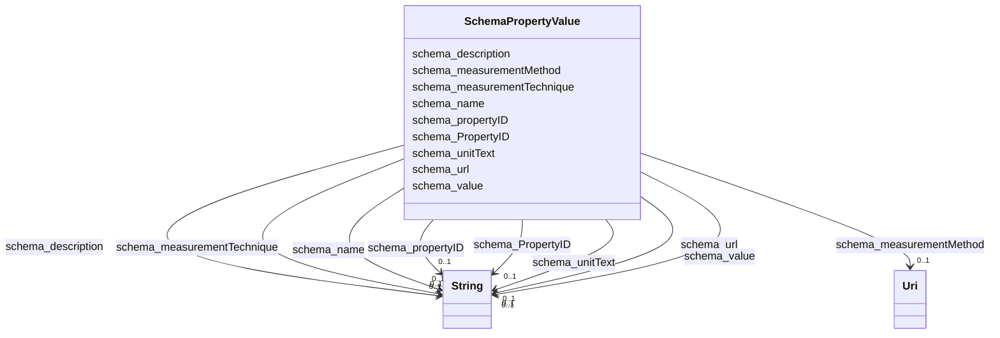

# Class: PropertyValue (schema_PropertyValue)


_A property-value pair, e.g. representing a feature of a product or place. Use the 'name' property for the name of the property. If there is an additional human-readable version of the value, put that into the 'description' property.\n\n Always use specific schema.org properties when a) they exist and b) you can populate them. Using PropertyValue as a substitute will typically not trigger the same effect as using the original, specific property._

_    _


URI: [schema:PropertyValue](https://schema.org/PropertyValue)





<!-- no inheritance hierarchy -->


## Slots

| Name | Cardinality and Range | Description | Inheritance |
| ---  | --- | --- | --- |
| [schema_name](../slots/schema_name.md) | 0..1 <br/> [xsd:string](xsd:string) | No slot (predicate) description specified <br/> 28216 occurrences with subject type schema_Dataset and object type string.<br/>56432 occurrences with subject type schema_DataDownload and object type string.<br/>41703 occurrences with subject type schema_GovernmentOrganization and object type string.<br/>28216 occurrences with subject type schema_PropertyValue and object type string.<br/>45727 occurrences with untyped subjects and object type string.<br/>243268 occurrences with subject type schema_Place and object type string.<br/>201357 occurrences with subject type hyf__HY_HydroLocation and object type string.<br/>2741 occurrences with subject type http___www.opengeospatial.org_standards_waterml2_hy_features_HY_HydroLocation and object type string.<br/>247 occurrences with subject type schema_Organization and object type string.<br/>165029 occurrences with subject type schema_CreativeWork and object type string. | direct |
| [schema_measurementTechnique](../slots/schema_measurementTechnique.md) | 0..1 <br/> [xsd:string](xsd:string) | No slot (predicate) description specified <br/> 28216 occurrences with subject type schema_PropertyValue and object type string. | direct |
| [schema_propertyID](../slots/schema_propertyID.md) | 0..1 <br/> [xsd:string](xsd:string) | No slot (predicate) description specified <br/> 41704 occurrences with subject type schema_PropertyValue and object type string. | direct |
| [schema_url](../slots/schema_url.md) | 0..1 <br/> [xsd:string](xsd:string) | No slot (predicate) description specified <br/> 28216 occurrences with subject type schema_Dataset and object type string.<br/>41703 occurrences with subject type schema_GovernmentOrganization and object type string.<br/>28217 occurrences with subject type schema_PropertyValue and object type string.<br/>185722 occurrences with untyped subjects and object type string.<br/>2535 occurrences with subject type schema_Place and object type string.<br/>247 occurrences with subject type schema_Organization and object type string. | direct |
| [schema_description](../slots/schema_description.md) | 0..1 <br/> [xsd:string](xsd:string) | No slot (predicate) description specified <br/> 28216 occurrences with subject type schema_Dataset and object type string.<br/>28217 occurrences with subject type schema_PropertyValue and object type string.<br/>17510 occurrences with untyped subjects and object type string.<br/>187886 occurrences with subject type hyf__HY_HydroLocation and object type string.<br/>107289 occurrences with subject type schema_Place and object type string. | direct |
| [schema_measurementMethod](../slots/schema_measurementMethod.md) | 0..1 <br/> [xsd:anyURI](xsd:anyURI) | No slot (predicate) description specified <br/> 28216 occurrences with subject type schema_PropertyValue and object type uri. | direct |
| [schema_unitText](../slots/schema_unitText.md) | 0..1 <br/> [xsd:string](xsd:string) | No slot (predicate) description specified <br/> 28216 occurrences with subject type schema_PropertyValue and object type string. | direct |
| [schema_PropertyID](../slots/schema_PropertyID.md) | 0..1 <br/> [xsd:string](xsd:string) | No slot (predicate) description specified <br/> 40988 occurrences with subject type schema_PropertyValue and object type string. | direct |
| [schema_value](../slots/schema_value.md) | 0..1 <br/> [xsd:string](xsd:string) | No slot (predicate) description specified <br/> 44093 occurrences with subject type schema_PropertyValue and object type string. | direct |


## Usages

| used by | used in | type | used |
| ---  | --- | --- | --- |
| [HttpWww.opengeospatial.orgStandardsWaterml2HyFeaturesHYHydroLocation](../classes/HttpWww.opengeospatial.orgStandardsWaterml2HyFeaturesHYHydroLocation.md) | [schema_identifier](../slots/schema_identifier.md) | any_of[range] | [SchemaPropertyValue](../classes/SchemaPropertyValue.md) |
| [HyfHYHydroLocation](../classes/HyfHYHydroLocation.md) | [schema_identifier](../slots/schema_identifier.md) | any_of[range] | [SchemaPropertyValue](../classes/SchemaPropertyValue.md) |
| [SchemaCreativeWork](../classes/SchemaCreativeWork.md) | [schema_identifier](../slots/schema_identifier.md) | any_of[range] | [SchemaPropertyValue](../classes/SchemaPropertyValue.md) |
| [SchemaDataset](../classes/SchemaDataset.md) | [schema_variableMeasured](../slots/schema_variableMeasured.md) | range | [SchemaPropertyValue](../classes/SchemaPropertyValue.md) |
| [SchemaOrganization](../classes/SchemaOrganization.md) | [schema_identifier](../slots/schema_identifier.md) | any_of[range] | [SchemaPropertyValue](../classes/SchemaPropertyValue.md) |


## Examples

| Value |
| --- |
| _:b1000007 |


## Identifier and Mapping Information


### Schema Source


* from schema: geoconnex


## Mappings

| Mapping Type | Mapped Value |
| ---  | ---  |
| self | schema:PropertyValue |
| native | geoconnex/:SchemaPropertyValue |


## LinkML Source

<!-- TODO: investigate https://stackoverflow.com/questions/37606292/how-to-create-tabbed-code-blocks-in-mkdocs-or-sphinx -->

### Direct

<details>
```yaml
name: schema_PropertyValue
conforms_to: No schema conformance document specified
description: "A property-value pair, e.g. representing a feature of a product or place.\
  \ Use the 'name' property for the name of the property. If there is an additional\
  \ human-readable version of the value, put that into the 'description' property.\\\
  n\\n Always use specific schema.org properties when a) they exist and b) you can\
  \ populate them. Using PropertyValue as a substitute will typically not trigger\
  \ the same effect as using the original, specific property.\n    "
title: PropertyValue
notes:
- Class with 82692 occurrences.
examples:
- value: _:b1000007
from_schema: geoconnex
rank: 1000
slots:
- schema_name
- schema_measurementTechnique
- schema_propertyID
- schema_url
- schema_description
- schema_measurementMethod
- schema_unitText
- schema_PropertyID
- schema_value
class_uri: schema:PropertyValue

```
</details>

### Induced

<details>
```yaml
name: schema_PropertyValue
conforms_to: No schema conformance document specified
description: "A property-value pair, e.g. representing a feature of a product or place.\
  \ Use the 'name' property for the name of the property. If there is an additional\
  \ human-readable version of the value, put that into the 'description' property.\\\
  n\\n Always use specific schema.org properties when a) they exist and b) you can\
  \ populate them. Using PropertyValue as a substitute will typically not trigger\
  \ the same effect as using the original, specific property.\n    "
title: PropertyValue
notes:
- Class with 82692 occurrences.
examples:
- value: _:b1000007
from_schema: geoconnex
rank: 1000
attributes:
  schema_name:
    name: schema_name
    description: No slot (predicate) description specified
    comments:
    - 28216 occurrences with subject type schema_Dataset and object type string.
    - 56432 occurrences with subject type schema_DataDownload and object type string.
    - 41703 occurrences with subject type schema_GovernmentOrganization and object
      type string.
    - 28216 occurrences with subject type schema_PropertyValue and object type string.
    - 45727 occurrences with untyped subjects and object type string.
    - 243268 occurrences with subject type schema_Place and object type string.
    - 201357 occurrences with subject type hyf__HY_HydroLocation and object type string.
    - 2741 occurrences with subject type http___www.opengeospatial.org_standards_waterml2_hy_features_HY_HydroLocation
      and object type string.
    - 247 occurrences with subject type schema_Organization and object type string.
    - 165029 occurrences with subject type schema_CreativeWork and object type string.
    examples:
    - description: schema_Dataset → string
      object:
        example_object: USGS-293229091230800
        example_predicate: schema:name
        example_subject: _:b1000000
    - description: schema_DataDownload → string
      object:
        example_object: USGS SensorThings API
        example_predicate: schema:name
        example_subject: _:b1000004
    - description: schema_GovernmentOrganization → string
      object:
        example_object: U.S. Geological Survey Water Data for the Nation
        example_predicate: schema:name
        example_subject: _:b1000006
    - description: schema_PropertyValue → string
      object:
        example_object: Gage height
        example_predicate: schema:name
        example_subject: _:b1000007
    - description: None → string
      object:
        example_object: Mancos River at Anitas Flat Below Mancos CO
        example_predicate: schema:name
        example_subject: _:b1548067
    - description: schema_Place → string
      object:
        example_object: New England Region
        example_predicate: schema:name
        example_subject: https://geoconnex.us/ref/hu02/01
    - description: hyf__HY_HydroLocation → string
      object:
        example_object: BIG CREEK
        example_predicate: schema:name
        example_subject: https://geoconnex.us/iow/demo/AL00017
    - description: http___www.opengeospatial.org_standards_waterml2_hy_features_HY_HydroLocation
        → string
      object:
        example_object: ALCOVA
        example_predicate: schema:name
        example_subject: https://geoconnex.us/ornl/hydrosource/dams/1
    - description: schema_Organization → string
      object:
        example_object: CUAHSI_CUAHSI_HIS_CRWA_ids__0
        example_predicate: schema:name
        example_subject: https://gleaner.io/id/org/CUAHSI_CUAHSI_HIS_CRWA_ids__0
    - description: schema_CreativeWork → string
      object:
        example_object: HUC12 Pour Points
        example_predicate: schema:name
        example_subject: https://gleaner.io/xid/genid/cksjodsip8t6t2qulttg
    from_schema: geoconnex
    rank: 1000
    slot_uri: schema:name
    alias: schema_name
    owner: schema_PropertyValue
    domain_of:
    - http___www.opengeospatial.org_standards_waterml2_hy_features_HY_HydroLocation
    - hyf__HY_HydroLocation
    - schema_CreativeWork
    - schema_DataDownload
    - schema_Dataset
    - schema_GovernmentOrganization
    - schema_Organization
    - schema_Place
    - schema_PropertyValue
    range: string
  schema_measurementTechnique:
    name: schema_measurementTechnique
    description: No slot (predicate) description specified
    comments:
    - 28216 occurrences with subject type schema_PropertyValue and object type string.
    examples:
    - description: schema_PropertyValue → string
      object:
        example_object: observation
        example_predicate: schema:measurementTechnique
        example_subject: _:b1000007
    from_schema: geoconnex
    rank: 1000
    slot_uri: schema:measurementTechnique
    alias: schema_measurementTechnique
    owner: schema_PropertyValue
    domain_of:
    - schema_PropertyValue
    range: string
  schema_propertyID:
    name: schema_propertyID
    description: No slot (predicate) description specified
    comments:
    - 41704 occurrences with subject type schema_PropertyValue and object type string.
    examples:
    - description: schema_PropertyValue → string
      object:
        example_object: https://www.wikidata.org/w/index.php?search=Gage height
        example_predicate: schema:propertyID
        example_subject: _:b1000007
    from_schema: geoconnex
    rank: 1000
    slot_uri: schema:propertyID
    alias: schema_propertyID
    owner: schema_PropertyValue
    domain_of:
    - schema_PropertyValue
    range: string
  schema_url:
    name: schema_url
    description: No slot (predicate) description specified
    comments:
    - 28216 occurrences with subject type schema_Dataset and object type string.
    - 41703 occurrences with subject type schema_GovernmentOrganization and object
      type string.
    - 28217 occurrences with subject type schema_PropertyValue and object type string.
    - 185722 occurrences with untyped subjects and object type string.
    - 2535 occurrences with subject type schema_Place and object type string.
    - 247 occurrences with subject type schema_Organization and object type string.
    examples:
    - description: schema_Dataset → string
      object:
        example_object: https://waterdata.usgs.gov/monitoring-location/293229091230800/#parameterCode=00010
        example_predicate: schema:url
        example_subject: _:b1000000
    - description: schema_GovernmentOrganization → string
      object:
        example_object: https://waterdata.usgs.gov
        example_predicate: schema:url
        example_subject: _:b1000006
    - description: schema_PropertyValue → string
      object:
        example_object: https://en.wikipedia.org/w/index.php?search=Gage height
        example_predicate: schema:url
        example_subject: _:b1000007
    - description: None → string
      object:
        example_object: https://waterdata.usgs.gov/monitoring-location/14206920
        example_predicate: schema:url
        example_subject: _:b1064837
    - description: schema_Place → string
      object:
        example_object: https://waterdata.usgs.gov
        example_predicate: schema:url
        example_subject: https://geoconnex.us/ca-gage-assessment/gages/09423350
    - description: schema_Organization → string
      object:
        example_object: https://geoconnex.us/sitemap/CUAHSI/CUAHSI_HIS_CRWA_ids__0.xml
        example_predicate: schema:url
        example_subject: https://gleaner.io/id/org/CUAHSI_CUAHSI_HIS_CRWA_ids__0
    from_schema: geoconnex
    rank: 1000
    slot_uri: schema:url
    alias: schema_url
    owner: schema_PropertyValue
    domain_of:
    - schema_Dataset
    - schema_GovernmentOrganization
    - schema_Organization
    - schema_Place
    - schema_PropertyValue
    range: string
  schema_description:
    name: schema_description
    description: No slot (predicate) description specified
    comments:
    - 28216 occurrences with subject type schema_Dataset and object type string.
    - 28217 occurrences with subject type schema_PropertyValue and object type string.
    - 17510 occurrences with untyped subjects and object type string.
    - 187886 occurrences with subject type hyf__HY_HydroLocation and object type string.
    - 107289 occurrences with subject type schema_Place and object type string.
    examples:
    - description: schema_Dataset → string
      object:
        example_object: Temperature, water / USGS-293229091230800-40caf7117fe1485c9263289eb6b6205d
        example_predicate: schema:description
        example_subject: _:b1000000
    - description: schema_PropertyValue → string
      object:
        example_object: Gage height in ft
        example_predicate: schema:description
        example_subject: _:b1000007
    - description: None → string
      object:
        example_object: Location of well where measurements are made
        example_predicate: schema:description
        example_subject: https://gleaner.io/xid/genid/ckt9vv4ip8t5kr9ueha0
    - description: hyf__HY_HydroLocation → string
      object:
        example_object: Monitoring Location at BIG CREEK
        example_predicate: schema:description
        example_subject: https://geoconnex.us/iow/demo/AL00017
    - description: schema_Place → string
      object:
        example_object: Well drilled or set into subsurface for the purposes of pumping
          water or monitoring groundwater
        example_predicate: schema:description
        example_subject: https://geoconnex.us/nmwdi/st/locations/1
    from_schema: geoconnex
    rank: 1000
    slot_uri: schema:description
    alias: schema_description
    owner: schema_PropertyValue
    domain_of:
    - hyf__HY_HydroLocation
    - schema_Dataset
    - schema_Place
    - schema_PropertyValue
    range: string
  schema_measurementMethod:
    name: schema_measurementMethod
    description: No slot (predicate) description specified
    comments:
    - 28216 occurrences with subject type schema_PropertyValue and object type uri.
    examples:
    - description: schema_PropertyValue → uri
      object:
        example_object: _:b1570585
        example_predicate: schema:measurementMethod
        example_subject: _:b1000007
    from_schema: geoconnex
    rank: 1000
    slot_uri: schema:measurementMethod
    alias: schema_measurementMethod
    owner: schema_PropertyValue
    domain_of:
    - schema_PropertyValue
    range: uri
  schema_unitText:
    name: schema_unitText
    description: No slot (predicate) description specified
    comments:
    - 28216 occurrences with subject type schema_PropertyValue and object type string.
    examples:
    - description: schema_PropertyValue → string
      object:
        example_object: ft
        example_predicate: schema:unitText
        example_subject: _:b1000007
    from_schema: geoconnex
    rank: 1000
    slot_uri: schema:unitText
    alias: schema_unitText
    owner: schema_PropertyValue
    domain_of:
    - schema_PropertyValue
    range: string
  schema_PropertyID:
    name: schema_PropertyID
    description: No slot (predicate) description specified
    comments:
    - 40988 occurrences with subject type schema_PropertyValue and object type string.
    examples:
    - description: schema_PropertyValue → string
      object:
        example_object: hilarriid
        example_predicate: schema:PropertyID
        example_subject: _:b120265
    from_schema: geoconnex
    rank: 1000
    slot_uri: schema:PropertyID
    alias: schema_PropertyID
    owner: schema_PropertyValue
    domain_of:
    - schema_PropertyValue
    range: string
  schema_value:
    name: schema_value
    description: No slot (predicate) description specified
    comments:
    - 44093 occurrences with subject type schema_PropertyValue and object type string.
    examples:
    - description: schema_PropertyValue → string
      object:
        example_object: 02291001
        example_predicate: schema:value
        example_subject: _:b1000020
    from_schema: geoconnex
    rank: 1000
    slot_uri: schema:value
    alias: schema_value
    owner: schema_PropertyValue
    domain_of:
    - schema_PropertyValue
    range: string
class_uri: schema:PropertyValue

```
</details>