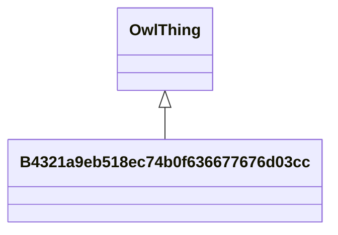

# Class: B4321a9eb518ec74b0f636677676d03cc


URI: [_:B4321a9eb518ec74b0f636677676d03cc](_:B4321a9eb518ec74b0f636677676d03cc)





## Inheritance
* [OwlThing](../classes/OwlThing.md)
    * **B4321a9eb518ec74b0f636677676d03cc**


## Slots

| Name | Cardinality and Range | Description | Inheritance | Occurrences |
| ---  | --- | --- | --- | --- |


## LinkML Source

<!-- TODO: investigate https://stackoverflow.com/questions/37606292/how-to-create-tabbed-code-blocks-in-mkdocs-or-sphinx -->

### Direct

<details>

```yaml
name: __B4321a9eb518ec74b0f636677676d03cc
from_schema: okns:hydrology-kg
exact_mappings:
- _:B4321a9eb518ec74b0f636677676d03cc
rank: 1000
is_a: owl_Thing
class_uri: _:B4321a9eb518ec74b0f636677676d03cc

```
</details>

### Induced

<details>

```yaml
name: __B4321a9eb518ec74b0f636677676d03cc
from_schema: okns:hydrology-kg
exact_mappings:
- _:B4321a9eb518ec74b0f636677676d03cc
rank: 1000
is_a: owl_Thing
class_uri: _:B4321a9eb518ec74b0f636677676d03cc

```
</details>