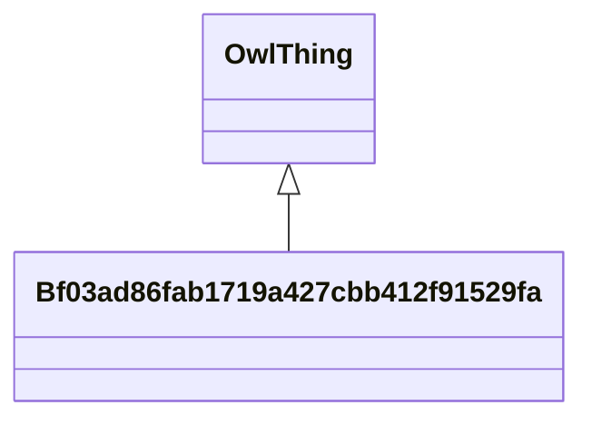

# Class: Bf03ad86fab1719a427cbb412f91529fa


URI: [_:Bf03ad86fab1719a427cbb412f91529fa](_:Bf03ad86fab1719a427cbb412f91529fa)





## Inheritance
* [OwlThing](../classes/OwlThing.md)
    * **Bf03ad86fab1719a427cbb412f91529fa**


## Slots

| Name | Cardinality and Range | Description | Inheritance | Occurrences |
| ---  | --- | --- | --- | --- |


## Usages

| used by | used in | type | used |
| ---  | --- | --- | --- |
| [HyfHYElementaryFlowPath](../classes/HyfHYElementaryFlowPath.md) | [hyf__downstreamFlowPathTC](../slots/hyf__downstreamFlowPathTC.md) | any_of[range] | [Bf03ad86fab1719a427cbb412f91529fa](../classes/Bf03ad86fab1719a427cbb412f91529fa.md) |
| [HyfHYElementaryFlowPath](../classes/HyfHYElementaryFlowPath.md) | [hyf__downstreamFlowPath](../slots/hyf__downstreamFlowPath.md) | any_of[range] | [Bf03ad86fab1719a427cbb412f91529fa](../classes/Bf03ad86fab1719a427cbb412f91529fa.md) |


## LinkML Source

<!-- TODO: investigate https://stackoverflow.com/questions/37606292/how-to-create-tabbed-code-blocks-in-mkdocs-or-sphinx -->

### Direct

<details>

```yaml
name: __Bf03ad86fab1719a427cbb412f91529fa
from_schema: okns:hydrology-kg
exact_mappings:
- _:Bf03ad86fab1719a427cbb412f91529fa
rank: 1000
is_a: owl_Thing
class_uri: _:Bf03ad86fab1719a427cbb412f91529fa

```
</details>

### Induced

<details>

```yaml
name: __Bf03ad86fab1719a427cbb412f91529fa
from_schema: okns:hydrology-kg
exact_mappings:
- _:Bf03ad86fab1719a427cbb412f91529fa
rank: 1000
is_a: owl_Thing
class_uri: _:Bf03ad86fab1719a427cbb412f91529fa

```
</details>