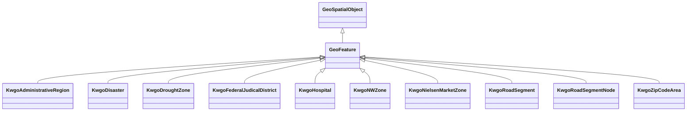

# Class: GeoFeature


_A discrete spatial phenomenon in a universe of discourse._


This class occurs 72985 times.


URI: [geo:Feature](http://www.opengis.net/ont/geosparql#Feature)





## Inheritance
* [GeoSpatialObject](../classes/GeoSpatialObject.md)
    * **GeoFeature**
        * [KwgoAdministrativeRegion](../classes/KwgoAdministrativeRegion.md)
        * [KwgoDisaster](../classes/KwgoDisaster.md)
        * [KwgoDroughtZone](../classes/KwgoDroughtZone.md)
        * [KwgoFederalJudicalDistrict](../classes/KwgoFederalJudicalDistrict.md)
        * [KwgoHospital](../classes/KwgoHospital.md)
        * [KwgoNWZone](../classes/KwgoNWZone.md)
        * [KwgoNielsenMarketZone](../classes/KwgoNielsenMarketZone.md)
        * [KwgoRoadSegment](../classes/KwgoRoadSegment.md)
        * [KwgoRoadSegmentNode](../classes/KwgoRoadSegmentNode.md)
        * [KwgoZipCodeArea](../classes/KwgoZipCodeArea.md)


## Slots

| Name | Cardinality and Range | Description | Inheritance | Occurrences |
| ---  | --- | --- | --- | --- |


## Usages

| used by | used in | type | used |
| ---  | --- | --- | --- |
| [B805a9e7d30eaabcb686b8ce670ed1e95](../classes/B805a9e7d30eaabcb686b8ce670ed1e95.md) | [hyf_downstreamFlowPathTC](../slots/hyf_downstreamFlowPathTC.md) | any_of[range] | [GeoFeature](../classes/GeoFeature.md) |
| [B805a9e7d30eaabcb686b8ce670ed1e95](../classes/B805a9e7d30eaabcb686b8ce670ed1e95.md) | [geo_hasGeometry](../slots/geo_hasGeometry.md) | domain | [GeoFeature](../classes/GeoFeature.md) |
| [B805a9e7d30eaabcb686b8ce670ed1e95](../classes/B805a9e7d30eaabcb686b8ce670ed1e95.md) | [hyf_downstreamFlowPath](../slots/hyf_downstreamFlowPath.md) | any_of[range] | [GeoFeature](../classes/GeoFeature.md) |
| [B805a9e7d30eaabcb686b8ce670ed1e95](../classes/B805a9e7d30eaabcb686b8ce670ed1e95.md) | [geo_defaultGeometry](../slots/geo_defaultGeometry.md) | domain | [GeoFeature](../classes/GeoFeature.md) |
| [B805a9e7d30eaabcb686b8ce670ed1e95](../classes/B805a9e7d30eaabcb686b8ce670ed1e95.md) | [spatial_spatiallyRelatedTo](../slots/spatial_spatiallyRelatedTo.md) | any_of[range] | [GeoFeature](../classes/GeoFeature.md) |
| [B805a9e7d30eaabcb686b8ce670ed1e95](../classes/B805a9e7d30eaabcb686b8ce670ed1e95.md) | [spatial_connectedTo](../slots/spatial_connectedTo.md) | any_of[range] | [GeoFeature](../classes/GeoFeature.md) |
| [HttpGwml2.orgDefGwml2#GWAquifer](../classes/HttpGwml2.orgDefGwml2#GWAquifer.md) | [geo_defaultGeometry](../slots/geo_defaultGeometry.md) | domain | [GeoFeature](../classes/GeoFeature.md) |
| [HttpGwml2.orgDefGwml2#GWAquifer](../classes/HttpGwml2.orgDefGwml2#GWAquifer.md) | [spatial_spatiallyRelatedTo](../slots/spatial_spatiallyRelatedTo.md) | any_of[range] | [GeoFeature](../classes/GeoFeature.md) |
| [HttpGwml2.orgDefGwml2#GWAquifer](../classes/HttpGwml2.orgDefGwml2#GWAquifer.md) | [spatial_connectedTo](../slots/spatial_connectedTo.md) | any_of[range] | [GeoFeature](../classes/GeoFeature.md) |
| [HttpGwml2.orgDefGwml2#GWAquifer](../classes/HttpGwml2.orgDefGwml2#GWAquifer.md) | [geo_hasGeometry](../slots/geo_hasGeometry.md) | domain | [GeoFeature](../classes/GeoFeature.md) |
| [HttpGwml2.orgDefGwml2#GWAquiferSystem](../classes/HttpGwml2.orgDefGwml2#GWAquiferSystem.md) | [geo_defaultGeometry](../slots/geo_defaultGeometry.md) | domain | [GeoFeature](../classes/GeoFeature.md) |
| [HttpGwml2.orgDefGwml2#GWAquiferSystem](../classes/HttpGwml2.orgDefGwml2#GWAquiferSystem.md) | [spatial_spatiallyRelatedTo](../slots/spatial_spatiallyRelatedTo.md) | any_of[range] | [GeoFeature](../classes/GeoFeature.md) |
| [HttpGwml2.orgDefGwml2#GWAquiferSystem](../classes/HttpGwml2.orgDefGwml2#GWAquiferSystem.md) | [spatial_connectedTo](../slots/spatial_connectedTo.md) | any_of[range] | [GeoFeature](../classes/GeoFeature.md) |
| [HttpGwml2.orgDefGwml2#GWAquiferSystem](../classes/HttpGwml2.orgDefGwml2#GWAquiferSystem.md) | [geo_hasGeometry](../slots/geo_hasGeometry.md) | domain | [GeoFeature](../classes/GeoFeature.md) |
| [HyfHYElementaryFlowPath](../classes/HyfHYElementaryFlowPath.md) | [hyf_downstreamFlowPathTC](../slots/hyf_downstreamFlowPathTC.md) | any_of[range] | [GeoFeature](../classes/GeoFeature.md) |
| [HyfHYElementaryFlowPath](../classes/HyfHYElementaryFlowPath.md) | [geo_hasGeometry](../slots/geo_hasGeometry.md) | domain | [GeoFeature](../classes/GeoFeature.md) |
| [HyfHYElementaryFlowPath](../classes/HyfHYElementaryFlowPath.md) | [hyf_downstreamFlowPath](../slots/hyf_downstreamFlowPath.md) | any_of[range] | [GeoFeature](../classes/GeoFeature.md) |
| [HyfHYElementaryFlowPath](../classes/HyfHYElementaryFlowPath.md) | [geo_defaultGeometry](../slots/geo_defaultGeometry.md) | domain | [GeoFeature](../classes/GeoFeature.md) |
| [HyfHYElementaryFlowPath](../classes/HyfHYElementaryFlowPath.md) | [spatial_spatiallyRelatedTo](../slots/spatial_spatiallyRelatedTo.md) | any_of[range] | [GeoFeature](../classes/GeoFeature.md) |
| [HyfHYElementaryFlowPath](../classes/HyfHYElementaryFlowPath.md) | [spatial_connectedTo](../slots/spatial_connectedTo.md) | any_of[range] | [GeoFeature](../classes/GeoFeature.md) |
| [IlIsgsISGS-Well](../classes/IlIsgsISGS-Well.md) | [geo_hasGeometry](../slots/geo_hasGeometry.md) | domain | [GeoFeature](../classes/GeoFeature.md) |
| [KwgoS2CellLevel13](../classes/KwgoS2CellLevel13.md) | [spatial_spatiallyRelatedTo](../slots/spatial_spatiallyRelatedTo.md) | any_of[range] | [GeoFeature](../classes/GeoFeature.md) |
| [KwgoS2CellLevel13](../classes/KwgoS2CellLevel13.md) | [spatial_connectedTo](../slots/spatial_connectedTo.md) | any_of[range] | [GeoFeature](../classes/GeoFeature.md) |
| [MeMgsMGS-Well](../classes/MeMgsMGS-Well.md) | [geo_hasDefaultGeometry](../slots/geo_hasDefaultGeometry.md) | domain | [GeoFeature](../classes/GeoFeature.md) |
| [MeMgsMGS-Well](../classes/MeMgsMGS-Well.md) | [spatial_spatiallyRelatedTo](../slots/spatial_spatiallyRelatedTo.md) | any_of[range] | [GeoFeature](../classes/GeoFeature.md) |
| [MeMgsMGS-Well](../classes/MeMgsMGS-Well.md) | [spatial_connectedTo](../slots/spatial_connectedTo.md) | any_of[range] | [GeoFeature](../classes/GeoFeature.md) |
| [MeMgsMGS-Well](../classes/MeMgsMGS-Well.md) | [geo_hasGeometry](../slots/geo_hasGeometry.md) | domain | [GeoFeature](../classes/GeoFeature.md) |
| [UsSdwisPWS-ServiceArea](../classes/UsSdwisPWS-ServiceArea.md) | [geo_hasDefaultGeometry](../slots/geo_hasDefaultGeometry.md) | domain | [GeoFeature](../classes/GeoFeature.md) |
| [UsSdwisPWS-ServiceArea](../classes/UsSdwisPWS-ServiceArea.md) | [spatial_spatiallyRelatedTo](../slots/spatial_spatiallyRelatedTo.md) | any_of[range] | [GeoFeature](../classes/GeoFeature.md) |
| [UsSdwisPWS-ServiceArea](../classes/UsSdwisPWS-ServiceArea.md) | [spatial_connectedTo](../slots/spatial_connectedTo.md) | any_of[range] | [GeoFeature](../classes/GeoFeature.md) |
| [UsSdwisPWS-ServiceArea](../classes/UsSdwisPWS-ServiceArea.md) | [geo_hasGeometry](../slots/geo_hasGeometry.md) | domain | [GeoFeature](../classes/GeoFeature.md) |
| [UsSdwisPublicWaterSystem-CWS](../classes/UsSdwisPublicWaterSystem-CWS.md) | [spatial_spatiallyRelatedTo](../slots/spatial_spatiallyRelatedTo.md) | any_of[range] | [GeoFeature](../classes/GeoFeature.md) |
| [UsSdwisPublicWaterSystem-CWS](../classes/UsSdwisPublicWaterSystem-CWS.md) | [spatial_connectedTo](../slots/spatial_connectedTo.md) | any_of[range] | [GeoFeature](../classes/GeoFeature.md) |
| [UsSdwisPublicWaterSystem-CWS](../classes/UsSdwisPublicWaterSystem-CWS.md) | [us_sdwis_serviceArea](../slots/us_sdwis_serviceArea.md) | any_of[range] | [GeoFeature](../classes/GeoFeature.md) |
| [UsSdwisPublicWaterSystem-GW](../classes/UsSdwisPublicWaterSystem-GW.md) | [spatial_spatiallyRelatedTo](../slots/spatial_spatiallyRelatedTo.md) | any_of[range] | [GeoFeature](../classes/GeoFeature.md) |
| [UsSdwisPublicWaterSystem-GW](../classes/UsSdwisPublicWaterSystem-GW.md) | [spatial_connectedTo](../slots/spatial_connectedTo.md) | any_of[range] | [GeoFeature](../classes/GeoFeature.md) |
| [UsSdwisPublicWaterSystem-GW](../classes/UsSdwisPublicWaterSystem-GW.md) | [us_sdwis_serviceArea](../slots/us_sdwis_serviceArea.md) | any_of[range] | [GeoFeature](../classes/GeoFeature.md) |
| [UsSdwisPublicWaterSystem-NTNCWS](../classes/UsSdwisPublicWaterSystem-NTNCWS.md) | [spatial_spatiallyRelatedTo](../slots/spatial_spatiallyRelatedTo.md) | any_of[range] | [GeoFeature](../classes/GeoFeature.md) |
| [UsSdwisPublicWaterSystem-NTNCWS](../classes/UsSdwisPublicWaterSystem-NTNCWS.md) | [spatial_connectedTo](../slots/spatial_connectedTo.md) | any_of[range] | [GeoFeature](../classes/GeoFeature.md) |
| [UsSdwisPublicWaterSystem-NTNCWS](../classes/UsSdwisPublicWaterSystem-NTNCWS.md) | [us_sdwis_serviceArea](../slots/us_sdwis_serviceArea.md) | any_of[range] | [GeoFeature](../classes/GeoFeature.md) |
| [UsSdwisPublicWaterSystem-SW](../classes/UsSdwisPublicWaterSystem-SW.md) | [spatial_spatiallyRelatedTo](../slots/spatial_spatiallyRelatedTo.md) | any_of[range] | [GeoFeature](../classes/GeoFeature.md) |
| [UsSdwisPublicWaterSystem-SW](../classes/UsSdwisPublicWaterSystem-SW.md) | [spatial_connectedTo](../slots/spatial_connectedTo.md) | any_of[range] | [GeoFeature](../classes/GeoFeature.md) |
| [UsSdwisPublicWaterSystem-SW](../classes/UsSdwisPublicWaterSystem-SW.md) | [us_sdwis_serviceArea](../slots/us_sdwis_serviceArea.md) | any_of[range] | [GeoFeature](../classes/GeoFeature.md) |
| [UsSdwisPublicWaterSystem-TNCWS](../classes/UsSdwisPublicWaterSystem-TNCWS.md) | [spatial_spatiallyRelatedTo](../slots/spatial_spatiallyRelatedTo.md) | any_of[range] | [GeoFeature](../classes/GeoFeature.md) |
| [UsSdwisPublicWaterSystem-TNCWS](../classes/UsSdwisPublicWaterSystem-TNCWS.md) | [spatial_connectedTo](../slots/spatial_connectedTo.md) | any_of[range] | [GeoFeature](../classes/GeoFeature.md) |
| [UsSdwisPublicWaterSystem-TNCWS](../classes/UsSdwisPublicWaterSystem-TNCWS.md) | [us_sdwis_serviceArea](../slots/us_sdwis_serviceArea.md) | any_of[range] | [GeoFeature](../classes/GeoFeature.md) |


## Comments

* source: http://www.opengis.net/spec/geosparql/1.0/req/core/feature-class
* source: http://www.opengis.net/ont/geosparql#
* source: http://www.opengis.net/spec/geosparql/1.1/req/core/feature-class
* description: A discrete spatial phenomenon in a universe of discourse.


## LinkML Source

<!-- TODO: investigate https://stackoverflow.com/questions/37606292/how-to-create-tabbed-code-blocks-in-mkdocs-or-sphinx -->

### Direct

<details>

```yaml
name: geo_Feature
description: A discrete spatial phenomenon in a universe of discourse.
notes:
- A Feature represents a uniquely identifiable phenomenon, for example a river or
  an apple. While such phenomena (and therefore the Features used to represent them)
  are bounded, their boundaries may be crisp (e.g., the declared boundaries of a state),
  vague (e.g., the delineation of a valley versus its neighboring mountains), and
  change with time (e.g., a storm front). While discrete in nature, Features may be
  created from continuous observations, such as an isochrone that determines the region
  that can be reached by ambulance within 5 minutes.
comments:
- 'source: http://www.opengis.net/spec/geosparql/1.0/req/core/feature-class'
- 'source: http://www.opengis.net/ont/geosparql#'
- 'source: http://www.opengis.net/spec/geosparql/1.1/req/core/feature-class'
- 'description: A discrete spatial phenomenon in a universe of discourse.'
from_schema: okns:geo
source: http://www.opengis.net/ont/geosparql#
is_a: geo_SpatialObject
class_uri: geo:Feature

```
</details>

### Induced

<details>

```yaml
name: geo_Feature
description: A discrete spatial phenomenon in a universe of discourse.
notes:
- A Feature represents a uniquely identifiable phenomenon, for example a river or
  an apple. While such phenomena (and therefore the Features used to represent them)
  are bounded, their boundaries may be crisp (e.g., the declared boundaries of a state),
  vague (e.g., the delineation of a valley versus its neighboring mountains), and
  change with time (e.g., a storm front). While discrete in nature, Features may be
  created from continuous observations, such as an isochrone that determines the region
  that can be reached by ambulance within 5 minutes.
comments:
- 'source: http://www.opengis.net/spec/geosparql/1.0/req/core/feature-class'
- 'source: http://www.opengis.net/ont/geosparql#'
- 'source: http://www.opengis.net/spec/geosparql/1.1/req/core/feature-class'
- 'description: A discrete spatial phenomenon in a universe of discourse.'
from_schema: okns:geo
source: http://www.opengis.net/ont/geosparql#
is_a: geo_SpatialObject
class_uri: geo:Feature

```
</details>