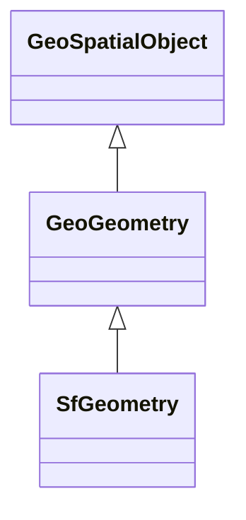

# Class: GeoGeometry


_A coherent set of direct positions in space. The positions are held within a Spatial Reference System (SRS)._


This class occurs 590536 times.


URI: [geo:Geometry](http://www.opengis.net/ont/geosparql#Geometry)





## Inheritance
* [GeoSpatialObject](../classes/GeoSpatialObject.md)
    * **GeoGeometry**
        * [SfGeometry](../classes/SfGeometry.md)


## Slots

| Name | Cardinality and Range | Description | Inheritance | Occurrences |
| ---  | --- | --- | --- | --- |


## Usages

| used by | used in | type | used |
| ---  | --- | --- | --- |
| [B805a9e7d30eaabcb686b8ce670ed1e95](../classes/B805a9e7d30eaabcb686b8ce670ed1e95.md) | [geo_hasGeometry](../slots/geo_hasGeometry.md) | range | [GeoGeometry](../classes/GeoGeometry.md) |
| [B805a9e7d30eaabcb686b8ce670ed1e95](../classes/B805a9e7d30eaabcb686b8ce670ed1e95.md) | [geo_defaultGeometry](../slots/geo_defaultGeometry.md) | range | [GeoGeometry](../classes/GeoGeometry.md) |
| [HttpGwml2.orgDefGwml2#GWAquifer](../classes/HttpGwml2.orgDefGwml2#GWAquifer.md) | [geo_defaultGeometry](../slots/geo_defaultGeometry.md) | range | [GeoGeometry](../classes/GeoGeometry.md) |
| [HttpGwml2.orgDefGwml2#GWAquifer](../classes/HttpGwml2.orgDefGwml2#GWAquifer.md) | [geo_hasGeometry](../slots/geo_hasGeometry.md) | range | [GeoGeometry](../classes/GeoGeometry.md) |
| [HttpGwml2.orgDefGwml2#GWAquiferSystem](../classes/HttpGwml2.orgDefGwml2#GWAquiferSystem.md) | [geo_defaultGeometry](../slots/geo_defaultGeometry.md) | range | [GeoGeometry](../classes/GeoGeometry.md) |
| [HttpGwml2.orgDefGwml2#GWAquiferSystem](../classes/HttpGwml2.orgDefGwml2#GWAquiferSystem.md) | [geo_hasGeometry](../slots/geo_hasGeometry.md) | range | [GeoGeometry](../classes/GeoGeometry.md) |
| [HyfHYElementaryFlowPath](../classes/HyfHYElementaryFlowPath.md) | [geo_hasGeometry](../slots/geo_hasGeometry.md) | range | [GeoGeometry](../classes/GeoGeometry.md) |
| [HyfHYElementaryFlowPath](../classes/HyfHYElementaryFlowPath.md) | [geo_defaultGeometry](../slots/geo_defaultGeometry.md) | range | [GeoGeometry](../classes/GeoGeometry.md) |
| [IlIsgsISGS-Well](../classes/IlIsgsISGS-Well.md) | [geo_hasGeometry](../slots/geo_hasGeometry.md) | range | [GeoGeometry](../classes/GeoGeometry.md) |
| [MeMgsMGS-Well](../classes/MeMgsMGS-Well.md) | [geo_hasDefaultGeometry](../slots/geo_hasDefaultGeometry.md) | range | [GeoGeometry](../classes/GeoGeometry.md) |
| [MeMgsMGS-Well](../classes/MeMgsMGS-Well.md) | [geo_hasGeometry](../slots/geo_hasGeometry.md) | range | [GeoGeometry](../classes/GeoGeometry.md) |
| [UsSdwisPWS-ServiceArea](../classes/UsSdwisPWS-ServiceArea.md) | [geo_hasDefaultGeometry](../slots/geo_hasDefaultGeometry.md) | range | [GeoGeometry](../classes/GeoGeometry.md) |
| [UsSdwisPWS-ServiceArea](../classes/UsSdwisPWS-ServiceArea.md) | [geo_hasGeometry](../slots/geo_hasGeometry.md) | range | [GeoGeometry](../classes/GeoGeometry.md) |


## Comments

* source: http://www.opengis.net/ont/geosparql#
* source: http://www.opengis.net/spec/geosparql/1.0/req/geometry-extension/geometry-class
* source: http://www.opengis.net/spec/geosparql/1.1/req/geometry-extension/geometry-class
* description: A coherent set of direct positions in space. The positions are held within a Spatial Reference System (SRS).


## LinkML Source

<!-- TODO: investigate https://stackoverflow.com/questions/37606292/how-to-create-tabbed-code-blocks-in-mkdocs-or-sphinx -->

### Direct

<details>

```yaml
name: geo_Geometry
description: A coherent set of direct positions in space. The positions are held within
  a Spatial Reference System (SRS).
notes:
- Geometry can be used as a representation of the shape, extent or location of a Feature
  and may exist as a self-contained entity.
comments:
- 'source: http://www.opengis.net/ont/geosparql#'
- 'source: http://www.opengis.net/spec/geosparql/1.0/req/geometry-extension/geometry-class'
- 'source: http://www.opengis.net/spec/geosparql/1.1/req/geometry-extension/geometry-class'
- 'description: A coherent set of direct positions in space. The positions are held
  within a Spatial Reference System (SRS).'
from_schema: okns:geo
source: http://www.opengis.net/ont/geosparql#
is_a: geo_SpatialObject
class_uri: geo:Geometry

```
</details>

### Induced

<details>

```yaml
name: geo_Geometry
description: A coherent set of direct positions in space. The positions are held within
  a Spatial Reference System (SRS).
notes:
- Geometry can be used as a representation of the shape, extent or location of a Feature
  and may exist as a self-contained entity.
comments:
- 'source: http://www.opengis.net/ont/geosparql#'
- 'source: http://www.opengis.net/spec/geosparql/1.0/req/geometry-extension/geometry-class'
- 'source: http://www.opengis.net/spec/geosparql/1.1/req/geometry-extension/geometry-class'
- 'description: A coherent set of direct positions in space. The positions are held
  within a Spatial Reference System (SRS).'
from_schema: okns:geo
source: http://www.opengis.net/ont/geosparql#
is_a: geo_SpatialObject
class_uri: geo:Geometry

```
</details>