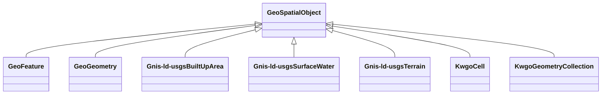

# Class: No class (entity type) name specified -- this class is noted as a superclass of another class in this graph but has not itself been defined. (geo_SpatialObject)


_Anything spatial (being or having a shape, position or an extent)._


This class occurs 12865 times.


URI: [geo:SpatialObject](http://www.opengis.net/ont/geosparql#SpatialObject)





## Inheritance
* **GeoSpatialObject**
    * [GeoFeature](../classes/GeoFeature.md)
    * [GeoGeometry](../classes/GeoGeometry.md)
    * [Gnis-ld-usgsBuiltUpArea](../classes/Gnis-ld-usgsBuiltUpArea.md)
    * [Gnis-ld-usgsSurfaceWater](../classes/Gnis-ld-usgsSurfaceWater.md)
    * [Gnis-ld-usgsTerrain](../classes/Gnis-ld-usgsTerrain.md)
    * [KwgoCell](../classes/KwgoCell.md)
    * [KwgoGeometryCollection](../classes/KwgoGeometryCollection.md)


## Slots

| Name | Cardinality and Range | Description | Inheritance | Occurrences |
| ---  | --- | --- | --- | --- |


## Usages

| used by | used in | type | used |
| ---  | --- | --- | --- |
| [HttpGwml2.orgDefGwml2#GWAquifer](../classes/HttpGwml2.orgDefGwml2#GWAquifer.md) | [spatial_connectedTo](../slots/spatial_connectedTo.md) | any_of[range] | [GeoSpatialObject](../classes/GeoSpatialObject.md) |
| [HttpGwml2.orgDefGwml2#GWAquifer](../classes/HttpGwml2.orgDefGwml2#GWAquifer.md) | [spatial_spatiallyRelatedTo](../slots/spatial_spatiallyRelatedTo.md) | any_of[range] | [GeoSpatialObject](../classes/GeoSpatialObject.md) |
| [HttpGwml2.orgDefGwml2#GWAquifer](../classes/HttpGwml2.orgDefGwml2#GWAquifer.md) | [http___gwml2.org_def_gwml2#gwAquiferSystem](../slots/http___gwml2.org_def_gwml2#gwAquiferSystem.md) | any_of[range] | [GeoSpatialObject](../classes/GeoSpatialObject.md) |
| [HttpGwml2.orgDefGwml2#GWAquiferSystem](../classes/HttpGwml2.orgDefGwml2#GWAquiferSystem.md) | [http___gwml2.org_def_gwml2#gwAquiferSystemPart](../slots/http___gwml2.org_def_gwml2#gwAquiferSystemPart.md) | any_of[range] | [GeoSpatialObject](../classes/GeoSpatialObject.md) |
| [HttpGwml2.orgDefGwml2#GWAquiferSystem](../classes/HttpGwml2.orgDefGwml2#GWAquiferSystem.md) | [spatial_connectedTo](../slots/spatial_connectedTo.md) | any_of[range] | [GeoSpatialObject](../classes/GeoSpatialObject.md) |
| [HttpGwml2.orgDefGwml2#GWAquiferSystem](../classes/HttpGwml2.orgDefGwml2#GWAquiferSystem.md) | [spatial_spatiallyRelatedTo](../slots/spatial_spatiallyRelatedTo.md) | any_of[range] | [GeoSpatialObject](../classes/GeoSpatialObject.md) |
| [HyfHYCanal](../classes/HyfHYCanal.md) | [spatial_connectedTo](../slots/spatial_connectedTo.md) | any_of[range] | [GeoSpatialObject](../classes/GeoSpatialObject.md) |
| [HyfHYCanal](../classes/HyfHYCanal.md) | [spatial_spatiallyRelatedTo](../slots/spatial_spatiallyRelatedTo.md) | any_of[range] | [GeoSpatialObject](../classes/GeoSpatialObject.md) |
| [HyfHYElementaryFlowPath](../classes/HyfHYElementaryFlowPath.md) | [spatial_connectedTo](../slots/spatial_connectedTo.md) | any_of[range] | [GeoSpatialObject](../classes/GeoSpatialObject.md) |
| [HyfHYElementaryFlowPath](../classes/HyfHYElementaryFlowPath.md) | [hyf__downstreamFlowPathTC](../slots/hyf__downstreamFlowPathTC.md) | any_of[range] | [GeoSpatialObject](../classes/GeoSpatialObject.md) |
| [HyfHYElementaryFlowPath](../classes/HyfHYElementaryFlowPath.md) | [hyf__downstreamFlowPath](../slots/hyf__downstreamFlowPath.md) | any_of[range] | [GeoSpatialObject](../classes/GeoSpatialObject.md) |
| [HyfHYElementaryFlowPath](../classes/HyfHYElementaryFlowPath.md) | [spatial_spatiallyRelatedTo](../slots/spatial_spatiallyRelatedTo.md) | any_of[range] | [GeoSpatialObject](../classes/GeoSpatialObject.md) |
| [HyfHYEstuary](../classes/HyfHYEstuary.md) | [spatial_connectedTo](../slots/spatial_connectedTo.md) | any_of[range] | [GeoSpatialObject](../classes/GeoSpatialObject.md) |
| [HyfHYEstuary](../classes/HyfHYEstuary.md) | [spatial_spatiallyRelatedTo](../slots/spatial_spatiallyRelatedTo.md) | any_of[range] | [GeoSpatialObject](../classes/GeoSpatialObject.md) |
| [HyfHYImpoundment](../classes/HyfHYImpoundment.md) | [spatial_connectedTo](../slots/spatial_connectedTo.md) | any_of[range] | [GeoSpatialObject](../classes/GeoSpatialObject.md) |
| [HyfHYImpoundment](../classes/HyfHYImpoundment.md) | [spatial_spatiallyRelatedTo](../slots/spatial_spatiallyRelatedTo.md) | any_of[range] | [GeoSpatialObject](../classes/GeoSpatialObject.md) |
| [HyfHYLagoon](../classes/HyfHYLagoon.md) | [spatial_connectedTo](../slots/spatial_connectedTo.md) | any_of[range] | [GeoSpatialObject](../classes/GeoSpatialObject.md) |
| [HyfHYLagoon](../classes/HyfHYLagoon.md) | [spatial_spatiallyRelatedTo](../slots/spatial_spatiallyRelatedTo.md) | any_of[range] | [GeoSpatialObject](../classes/GeoSpatialObject.md) |
| [HyfHYLake](../classes/HyfHYLake.md) | [spatial_connectedTo](../slots/spatial_connectedTo.md) | any_of[range] | [GeoSpatialObject](../classes/GeoSpatialObject.md) |
| [HyfHYLake](../classes/HyfHYLake.md) | [spatial_spatiallyRelatedTo](../slots/spatial_spatiallyRelatedTo.md) | any_of[range] | [GeoSpatialObject](../classes/GeoSpatialObject.md) |
| [HyfHYRiver](../classes/HyfHYRiver.md) | [spatial_connectedTo](../slots/spatial_connectedTo.md) | any_of[range] | [GeoSpatialObject](../classes/GeoSpatialObject.md) |
| [HyfHYRiver](../classes/HyfHYRiver.md) | [spatial_spatiallyRelatedTo](../slots/spatial_spatiallyRelatedTo.md) | any_of[range] | [GeoSpatialObject](../classes/GeoSpatialObject.md) |
| [HyfHYWaterBody](../classes/HyfHYWaterBody.md) | [spatial_connectedTo](../slots/spatial_connectedTo.md) | any_of[range] | [GeoSpatialObject](../classes/GeoSpatialObject.md) |
| [HyfHYWaterBody](../classes/HyfHYWaterBody.md) | [spatial_spatiallyRelatedTo](../slots/spatial_spatiallyRelatedTo.md) | any_of[range] | [GeoSpatialObject](../classes/GeoSpatialObject.md) |
| [KwgoS2CellLevel13](../classes/KwgoS2CellLevel13.md) | [spatial_connectedTo](../slots/spatial_connectedTo.md) | any_of[range] | [GeoSpatialObject](../classes/GeoSpatialObject.md) |
| [KwgoS2CellLevel13](../classes/KwgoS2CellLevel13.md) | [spatial_spatiallyRelatedTo](../slots/spatial_spatiallyRelatedTo.md) | any_of[range] | [GeoSpatialObject](../classes/GeoSpatialObject.md) |
| [MeMgsMGS-Well](../classes/MeMgsMGS-Well.md) | [spatial_connectedTo](../slots/spatial_connectedTo.md) | any_of[range] | [GeoSpatialObject](../classes/GeoSpatialObject.md) |
| [MeMgsMGS-Well](../classes/MeMgsMGS-Well.md) | [spatial_spatiallyRelatedTo](../slots/spatial_spatiallyRelatedTo.md) | any_of[range] | [GeoSpatialObject](../classes/GeoSpatialObject.md) |
| [UsSdwisPWS-ServiceArea](../classes/UsSdwisPWS-ServiceArea.md) | [spatial_connectedTo](../slots/spatial_connectedTo.md) | any_of[range] | [GeoSpatialObject](../classes/GeoSpatialObject.md) |
| [UsSdwisPWS-ServiceArea](../classes/UsSdwisPWS-ServiceArea.md) | [spatial_spatiallyRelatedTo](../slots/spatial_spatiallyRelatedTo.md) | any_of[range] | [GeoSpatialObject](../classes/GeoSpatialObject.md) |
| [UsSdwisPublicWaterSystem-CWS](../classes/UsSdwisPublicWaterSystem-CWS.md) | [us_sdwis_serviceArea](../slots/us_sdwis_serviceArea.md) | any_of[range] | [GeoSpatialObject](../classes/GeoSpatialObject.md) |
| [UsSdwisPublicWaterSystem-CWS](../classes/UsSdwisPublicWaterSystem-CWS.md) | [spatial_connectedTo](../slots/spatial_connectedTo.md) | any_of[range] | [GeoSpatialObject](../classes/GeoSpatialObject.md) |
| [UsSdwisPublicWaterSystem-CWS](../classes/UsSdwisPublicWaterSystem-CWS.md) | [spatial_spatiallyRelatedTo](../slots/spatial_spatiallyRelatedTo.md) | any_of[range] | [GeoSpatialObject](../classes/GeoSpatialObject.md) |
| [UsSdwisPublicWaterSystem-GW](../classes/UsSdwisPublicWaterSystem-GW.md) | [spatial_connectedTo](../slots/spatial_connectedTo.md) | any_of[range] | [GeoSpatialObject](../classes/GeoSpatialObject.md) |
| [UsSdwisPublicWaterSystem-GW](../classes/UsSdwisPublicWaterSystem-GW.md) | [us_sdwis_serviceArea](../slots/us_sdwis_serviceArea.md) | any_of[range] | [GeoSpatialObject](../classes/GeoSpatialObject.md) |
| [UsSdwisPublicWaterSystem-GW](../classes/UsSdwisPublicWaterSystem-GW.md) | [spatial_spatiallyRelatedTo](../slots/spatial_spatiallyRelatedTo.md) | any_of[range] | [GeoSpatialObject](../classes/GeoSpatialObject.md) |
| [UsSdwisPublicWaterSystem-NTNCWS](../classes/UsSdwisPublicWaterSystem-NTNCWS.md) | [spatial_connectedTo](../slots/spatial_connectedTo.md) | any_of[range] | [GeoSpatialObject](../classes/GeoSpatialObject.md) |
| [UsSdwisPublicWaterSystem-NTNCWS](../classes/UsSdwisPublicWaterSystem-NTNCWS.md) | [us_sdwis_serviceArea](../slots/us_sdwis_serviceArea.md) | any_of[range] | [GeoSpatialObject](../classes/GeoSpatialObject.md) |
| [UsSdwisPublicWaterSystem-NTNCWS](../classes/UsSdwisPublicWaterSystem-NTNCWS.md) | [spatial_spatiallyRelatedTo](../slots/spatial_spatiallyRelatedTo.md) | any_of[range] | [GeoSpatialObject](../classes/GeoSpatialObject.md) |
| [UsSdwisPublicWaterSystem-SW](../classes/UsSdwisPublicWaterSystem-SW.md) | [spatial_connectedTo](../slots/spatial_connectedTo.md) | any_of[range] | [GeoSpatialObject](../classes/GeoSpatialObject.md) |
| [UsSdwisPublicWaterSystem-SW](../classes/UsSdwisPublicWaterSystem-SW.md) | [us_sdwis_serviceArea](../slots/us_sdwis_serviceArea.md) | any_of[range] | [GeoSpatialObject](../classes/GeoSpatialObject.md) |
| [UsSdwisPublicWaterSystem-SW](../classes/UsSdwisPublicWaterSystem-SW.md) | [spatial_spatiallyRelatedTo](../slots/spatial_spatiallyRelatedTo.md) | any_of[range] | [GeoSpatialObject](../classes/GeoSpatialObject.md) |
| [UsSdwisPublicWaterSystem-TNCWS](../classes/UsSdwisPublicWaterSystem-TNCWS.md) | [spatial_connectedTo](../slots/spatial_connectedTo.md) | any_of[range] | [GeoSpatialObject](../classes/GeoSpatialObject.md) |
| [UsSdwisPublicWaterSystem-TNCWS](../classes/UsSdwisPublicWaterSystem-TNCWS.md) | [us_sdwis_serviceArea](../slots/us_sdwis_serviceArea.md) | any_of[range] | [GeoSpatialObject](../classes/GeoSpatialObject.md) |
| [UsSdwisPublicWaterSystem-TNCWS](../classes/UsSdwisPublicWaterSystem-TNCWS.md) | [spatial_spatiallyRelatedTo](../slots/spatial_spatiallyRelatedTo.md) | any_of[range] | [GeoSpatialObject](../classes/GeoSpatialObject.md) |


## Comments

* source: http://www.opengis.net/spec/geosparql/1.0/req/core/spatial-object-class
* source: http://www.opengis.net/spec/geosparql/1.1/req/core/spatial-object-class
* source: http://www.opengis.net/ont/geosparql#
* source: http://www.opengis.net/spec/geosparql/1.0/req/core/spatial-object-class
* source: http://www.opengis.net/spec/geosparql/1.1/req/core/spatial-object-class
* description: Anything spatial (being or having a shape, position or an extent).


## LinkML Source

<!-- TODO: investigate https://stackoverflow.com/questions/37606292/how-to-create-tabbed-code-blocks-in-mkdocs-or-sphinx -->

### Direct

<details>

```yaml
name: geo_SpatialObject
description: Anything spatial (being or having a shape, position or an extent).
title: No class (entity type) name specified -- this class is noted as a superclass
  of another class in this graph but has not itself been defined.
notes:
- Subclasses of this class are expected to be used for instance data.
comments:
- 'source: http://www.opengis.net/spec/geosparql/1.0/req/core/spatial-object-class'
- 'source: http://www.opengis.net/spec/geosparql/1.1/req/core/spatial-object-class'
- 'source: http://www.opengis.net/ont/geosparql#'
- 'source: http://www.opengis.net/spec/geosparql/1.0/req/core/spatial-object-class'
- 'source: http://www.opengis.net/spec/geosparql/1.1/req/core/spatial-object-class'
- 'description: Anything spatial (being or having a shape, position or an extent).'
from_schema: okns:geo
source: http://www.opengis.net/ont/geosparql#
class_uri: geo:SpatialObject

```
</details>

### Induced

<details>

```yaml
name: geo_SpatialObject
description: Anything spatial (being or having a shape, position or an extent).
title: No class (entity type) name specified -- this class is noted as a superclass
  of another class in this graph but has not itself been defined.
notes:
- Subclasses of this class are expected to be used for instance data.
comments:
- 'source: http://www.opengis.net/spec/geosparql/1.0/req/core/spatial-object-class'
- 'source: http://www.opengis.net/spec/geosparql/1.1/req/core/spatial-object-class'
- 'source: http://www.opengis.net/ont/geosparql#'
- 'source: http://www.opengis.net/spec/geosparql/1.0/req/core/spatial-object-class'
- 'source: http://www.opengis.net/spec/geosparql/1.1/req/core/spatial-object-class'
- 'description: Anything spatial (being or having a shape, position or an extent).'
from_schema: okns:geo
source: http://www.opengis.net/ont/geosparql#
class_uri: geo:SpatialObject

```
</details>