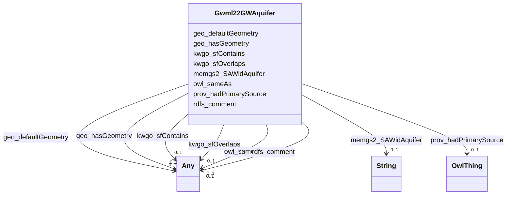

# Class: No class (type) name specified (gwml22_GW_Aquifer)


_No class (type) description specified_


This class occurs 1256 times.


URI: [gwml22:GW_Aquifer](http://www.opengis.net/gwml-main/2.2/GW_Aquifer)





<!-- no inheritance hierarchy -->


## Slots

| Name | Cardinality and Range | Description | Inheritance | Occurrences |
| ---  | --- | --- | --- | --- |
| [memgs2_SAWidAquifer](../slots/memgs2_SAWidAquifer.md) | 0..1 <br/> [xsd:string](http://www.w3.org/2001/XMLSchema#string) | No slot (predicate) description specified <br/>  | direct | 1256 |
| [owl_sameAs](../slots/owl_sameAs.md) | 0..1 <br/> [HyfHYWaterBody](../classes/HyfHYWaterBody.md)&nbsp;or&nbsp;<br />[KwgoS2CellLevel13](../classes/KwgoS2CellLevel13.md)&nbsp;or&nbsp;<br />[OwlThing](../classes/OwlThing.md)&nbsp;or&nbsp;<br />[xsd:anyURI](http://www.w3.org/2001/XMLSchema#anyURI)&nbsp;or&nbsp;<br />[Sf#LineString](../classes/Sf#LineString.md)&nbsp;or&nbsp;<br />[Sf#Polygon](../classes/Sf#Polygon.md)&nbsp;or&nbsp;<br />[Sf#MultiPolygon](../classes/Sf#MultiPolygon.md)&nbsp;or&nbsp;<br />[HyfHYWaterbody](../classes/HyfHYWaterbody.md)&nbsp;or&nbsp;<br />[RdfList](../classes/RdfList.md)&nbsp;or&nbsp;<br />[GeoFeature](../classes/GeoFeature.md)&nbsp;or&nbsp;<br />[GeoGeometry](../classes/GeoGeometry.md)&nbsp;or&nbsp;<br />[HyfHYFlowPath](../classes/HyfHYFlowPath.md)&nbsp;or&nbsp;<br />[SchemaPlace](../classes/SchemaPlace.md)&nbsp;or&nbsp;<br />[Gwml22GWAquifer](../classes/Gwml22GWAquifer.md)&nbsp;or&nbsp;<br />[RdfObjectProperty](../classes/RdfObjectProperty.md) | No slot (predicate) description specified <br/>  | direct | 2512 |
| [kwgo_sfOverlaps](../slots/kwgo_sfOverlaps.md) | 0..1 <br/> [HyfHYWaterBody](../classes/HyfHYWaterBody.md)&nbsp;or&nbsp;<br />[KwgoS2CellLevel13](../classes/KwgoS2CellLevel13.md)&nbsp;or&nbsp;<br />[OwlThing](../classes/OwlThing.md)&nbsp;or&nbsp;<br />[Gwml22GWAquifer](../classes/Gwml22GWAquifer.md) | No slot (predicate) description specified <br/>  | direct | 28434 |
| [prov_hadPrimarySource](../slots/prov_hadPrimarySource.md) | 0..1 <br/> [OwlThing](../classes/OwlThing.md) | No slot (predicate) description specified <br/>  | direct | 1256 |
| [geo_hasGeometry](../slots/geo_hasGeometry.md) | 0..1 <br/> [OwlThing](../classes/OwlThing.md)&nbsp;or&nbsp;<br />[Sf#LineString](../classes/Sf#LineString.md)&nbsp;or&nbsp;<br />[Sf#Polygon](../classes/Sf#Polygon.md)&nbsp;or&nbsp;<br />[Sf#MultiPolygon](../classes/Sf#MultiPolygon.md)&nbsp;or&nbsp;<br />[GeoGeometry](../classes/GeoGeometry.md) | No slot (predicate) description specified <br/>  | direct | 3768 |
| [kwgo_sfContains](../slots/kwgo_sfContains.md) | 0..1 <br/> [KwgoS2CellLevel13](../classes/KwgoS2CellLevel13.md)&nbsp;or&nbsp;<br />[OwlThing](../classes/OwlThing.md) | No slot (predicate) description specified <br/>  | direct | 790 |
| [rdfs_comment](../slots/rdfs_comment.md) | 0..1 <br/> [xsd:anyURI](http://www.w3.org/2001/XMLSchema#anyURI)&nbsp;or&nbsp;<br />[xsd:string](http://www.w3.org/2001/XMLSchema#string) | No slot (predicate) description specified <br/>  | direct | 1256 |
| [geo_defaultGeometry](../slots/geo_defaultGeometry.md) | 0..1 <br/> [OwlThing](../classes/OwlThing.md)&nbsp;or&nbsp;<br />[Sf#LineString](../classes/Sf#LineString.md)&nbsp;or&nbsp;<br />[Sf#Polygon](../classes/Sf#Polygon.md)&nbsp;or&nbsp;<br />[Sf#MultiPolygon](../classes/Sf#MultiPolygon.md)&nbsp;or&nbsp;<br />[GeoGeometry](../classes/GeoGeometry.md) | No slot (predicate) description specified <br/>  | direct | 3768 |


## Usages

| used by | used in | type | used |
| ---  | --- | --- | --- |
| [GeoFeature](../classes/GeoFeature.md) | [owl_sameAs](../slots/owl_sameAs.md) | any_of[range] | [Gwml22GWAquifer](../classes/Gwml22GWAquifer.md) |
| [GeoGeometry](../classes/GeoGeometry.md) | [owl_sameAs](../slots/owl_sameAs.md) | any_of[range] | [Gwml22GWAquifer](../classes/Gwml22GWAquifer.md) |
| [Gwml22GWAquifer](../classes/Gwml22GWAquifer.md) | [owl_sameAs](../slots/owl_sameAs.md) | any_of[range] | [Gwml22GWAquifer](../classes/Gwml22GWAquifer.md) |
| [Gwml22GWAquifer](../classes/Gwml22GWAquifer.md) | [kwgo_sfOverlaps](../slots/kwgo_sfOverlaps.md) | any_of[range] | [Gwml22GWAquifer](../classes/Gwml22GWAquifer.md) |
| [HyfHYFlowPath](../classes/HyfHYFlowPath.md) | [owl_sameAs](../slots/owl_sameAs.md) | any_of[range] | [Gwml22GWAquifer](../classes/Gwml22GWAquifer.md) |
| [HyfHYWaterBody](../classes/HyfHYWaterBody.md) | [owl_sameAs](../slots/owl_sameAs.md) | any_of[range] | [Gwml22GWAquifer](../classes/Gwml22GWAquifer.md) |
| [HyfHYWaterbody](../classes/HyfHYWaterbody.md) | [owl_sameAs](../slots/owl_sameAs.md) | any_of[range] | [Gwml22GWAquifer](../classes/Gwml22GWAquifer.md) |
| [KwgoS2CellLevel13](../classes/KwgoS2CellLevel13.md) | [kwgo_sfWithin](../slots/kwgo_sfWithin.md) | any_of[range] | [Gwml22GWAquifer](../classes/Gwml22GWAquifer.md) |
| [KwgoS2CellLevel13](../classes/KwgoS2CellLevel13.md) | [owl_sameAs](../slots/owl_sameAs.md) | any_of[range] | [Gwml22GWAquifer](../classes/Gwml22GWAquifer.md) |
| [KwgoS2CellLevel13](../classes/KwgoS2CellLevel13.md) | [kwgo_sfOverlaps](../slots/kwgo_sfOverlaps.md) | any_of[range] | [Gwml22GWAquifer](../classes/Gwml22GWAquifer.md) |
| [OwlNamedIndividual](../classes/OwlNamedIndividual.md) | [kwgo_sfWithin](../slots/kwgo_sfWithin.md) | any_of[range] | [Gwml22GWAquifer](../classes/Gwml22GWAquifer.md) |
| [OwlNamedIndividual](../classes/OwlNamedIndividual.md) | [owl_sameAs](../slots/owl_sameAs.md) | any_of[range] | [Gwml22GWAquifer](../classes/Gwml22GWAquifer.md) |
| [OwlNamedIndividual](../classes/OwlNamedIndividual.md) | [kwgo_sfOverlaps](../slots/kwgo_sfOverlaps.md) | any_of[range] | [Gwml22GWAquifer](../classes/Gwml22GWAquifer.md) |
| [OwlNothing](../classes/OwlNothing.md) | [kwgo_sfWithin](../slots/kwgo_sfWithin.md) | any_of[range] | [Gwml22GWAquifer](../classes/Gwml22GWAquifer.md) |
| [OwlNothing](../classes/OwlNothing.md) | [owl_sameAs](../slots/owl_sameAs.md) | any_of[range] | [Gwml22GWAquifer](../classes/Gwml22GWAquifer.md) |
| [OwlNothing](../classes/OwlNothing.md) | [kwgo_sfOverlaps](../slots/kwgo_sfOverlaps.md) | any_of[range] | [Gwml22GWAquifer](../classes/Gwml22GWAquifer.md) |
| [OwlThing](../classes/OwlThing.md) | [kwgo_sfWithin](../slots/kwgo_sfWithin.md) | any_of[range] | [Gwml22GWAquifer](../classes/Gwml22GWAquifer.md) |
| [OwlThing](../classes/OwlThing.md) | [owl_sameAs](../slots/owl_sameAs.md) | any_of[range] | [Gwml22GWAquifer](../classes/Gwml22GWAquifer.md) |
| [OwlThing](../classes/OwlThing.md) | [kwgo_sfOverlaps](../slots/kwgo_sfOverlaps.md) | any_of[range] | [Gwml22GWAquifer](../classes/Gwml22GWAquifer.md) |
| [RdfList](../classes/RdfList.md) | [owl_sameAs](../slots/owl_sameAs.md) | any_of[range] | [Gwml22GWAquifer](../classes/Gwml22GWAquifer.md) |
| [RdfObjectProperty](../classes/RdfObjectProperty.md) | [owl_sameAs](../slots/owl_sameAs.md) | any_of[range] | [Gwml22GWAquifer](../classes/Gwml22GWAquifer.md) |
| [SchemaPlace](../classes/SchemaPlace.md) | [owl_sameAs](../slots/owl_sameAs.md) | any_of[range] | [Gwml22GWAquifer](../classes/Gwml22GWAquifer.md) |
| [Sf#LineString](../classes/Sf#LineString.md) | [owl_sameAs](../slots/owl_sameAs.md) | any_of[range] | [Gwml22GWAquifer](../classes/Gwml22GWAquifer.md) |
| [Sf#MultiPolygon](../classes/Sf#MultiPolygon.md) | [owl_sameAs](../slots/owl_sameAs.md) | any_of[range] | [Gwml22GWAquifer](../classes/Gwml22GWAquifer.md) |
| [Sf#Polygon](../classes/Sf#Polygon.md) | [owl_sameAs](../slots/owl_sameAs.md) | any_of[range] | [Gwml22GWAquifer](../classes/Gwml22GWAquifer.md) |


## LinkML Source

<!-- TODO: investigate https://stackoverflow.com/questions/37606292/how-to-create-tabbed-code-blocks-in-mkdocs-or-sphinx -->

### Direct

<details>

```yaml
name: gwml22_GW_Aquifer
conforms_to: No schema conformance document specified
annotations:
  count:
    tag: count
    value: 1256
description: No class (type) description specified
title: No class (type) name specified
from_schema: hydrology-kg
rank: 1000
slots:
- memgs2_SAWidAquifer
- owl_sameAs
- kwgo_sfOverlaps
- prov_hadPrimarySource
- geo_hasGeometry
- kwgo_sfContains
- rdfs_comment
- geo_defaultGeometry
slot_usage:
  geo_defaultGeometry:
    name: geo_defaultGeometry
    annotations:
      geo_Geometry:
        tag: geo_Geometry
        value: 1256
      owl_Thing:
        tag: owl_Thing
        value: 1256
      sf_#MultiPolygon:
        tag: sf_#MultiPolygon
        value: 12
      sf_#Polygon:
        tag: sf_#Polygon
        value: 1244
  geo_hasGeometry:
    name: geo_hasGeometry
    annotations:
      geo_Geometry:
        tag: geo_Geometry
        value: 1256
      owl_Thing:
        tag: owl_Thing
        value: 1256
      sf_#MultiPolygon:
        tag: sf_#MultiPolygon
        value: 12
      sf_#Polygon:
        tag: sf_#Polygon
        value: 1244
  kwgo_sfContains:
    name: kwgo_sfContains
    annotations:
      kwgo_S2Cell_Level13:
        tag: kwgo_S2Cell_Level13
        value: 395
      owl_Thing:
        tag: owl_Thing
        value: 395
  kwgo_sfOverlaps:
    name: kwgo_sfOverlaps
    annotations:
      kwgo_S2Cell_Level13:
        tag: kwgo_S2Cell_Level13
        value: 14211
      owl_Thing:
        tag: owl_Thing
        value: 14223
  memgs2_SAWidAquifer:
    name: memgs2_SAWidAquifer
    annotations:
      string:
        tag: string
        value: 1256
  owl_sameAs:
    name: owl_sameAs
    annotations:
      gwml22_GW_Aquifer:
        tag: gwml22_GW_Aquifer
        value: 1256
      owl_Thing:
        tag: owl_Thing
        value: 1256
  prov_hadPrimarySource:
    name: prov_hadPrimarySource
    annotations:
      owl_Thing:
        tag: owl_Thing
        value: 1256
  rdfs_comment:
    name: rdfs_comment
    annotations:
      string:
        tag: string
        value: 1256
class_uri: gwml22:GW_Aquifer

```
</details>

### Induced

<details>

```yaml
name: gwml22_GW_Aquifer
conforms_to: No schema conformance document specified
annotations:
  count:
    tag: count
    value: 1256
description: No class (type) description specified
title: No class (type) name specified
from_schema: hydrology-kg
rank: 1000
slot_usage:
  geo_defaultGeometry:
    name: geo_defaultGeometry
    annotations:
      geo_Geometry:
        tag: geo_Geometry
        value: 1256
      owl_Thing:
        tag: owl_Thing
        value: 1256
      sf_#MultiPolygon:
        tag: sf_#MultiPolygon
        value: 12
      sf_#Polygon:
        tag: sf_#Polygon
        value: 1244
  geo_hasGeometry:
    name: geo_hasGeometry
    annotations:
      geo_Geometry:
        tag: geo_Geometry
        value: 1256
      owl_Thing:
        tag: owl_Thing
        value: 1256
      sf_#MultiPolygon:
        tag: sf_#MultiPolygon
        value: 12
      sf_#Polygon:
        tag: sf_#Polygon
        value: 1244
  kwgo_sfContains:
    name: kwgo_sfContains
    annotations:
      kwgo_S2Cell_Level13:
        tag: kwgo_S2Cell_Level13
        value: 395
      owl_Thing:
        tag: owl_Thing
        value: 395
  kwgo_sfOverlaps:
    name: kwgo_sfOverlaps
    annotations:
      kwgo_S2Cell_Level13:
        tag: kwgo_S2Cell_Level13
        value: 14211
      owl_Thing:
        tag: owl_Thing
        value: 14223
  memgs2_SAWidAquifer:
    name: memgs2_SAWidAquifer
    annotations:
      string:
        tag: string
        value: 1256
  owl_sameAs:
    name: owl_sameAs
    annotations:
      gwml22_GW_Aquifer:
        tag: gwml22_GW_Aquifer
        value: 1256
      owl_Thing:
        tag: owl_Thing
        value: 1256
  prov_hadPrimarySource:
    name: prov_hadPrimarySource
    annotations:
      owl_Thing:
        tag: owl_Thing
        value: 1256
  rdfs_comment:
    name: rdfs_comment
    annotations:
      string:
        tag: string
        value: 1256
attributes:
  memgs2_SAWidAquifer:
    name: memgs2_SAWidAquifer
    annotations:
      string:
        tag: string
        value: 1256
    description: No slot (predicate) description specified
    title: No slot (predicate) name specified
    examples:
    - object:
        example_object: '1'
        example_object_type: string
        example_predicate: memgs2:SAWidAquifer
        example_subject: http://sawgraph.spatialai.org/v1/me_mgs_data#d.MGS-Aquifer.0001
        example_subject_type: gwml22_GW_Aquifer
    - object:
        example_object: '1'
        example_object_type: string
        example_predicate: memgs2:SAWidAquifer
        example_subject: http://sawgraph.spatialai.org/v1/me_mgs_data#d.MGS-Aquifer.0001
        example_subject_type: owl_Thing
    from_schema: hydrology-kg
    rank: 1000
    slot_uri: memgs2:SAWidAquifer
    alias: memgs2_SAWidAquifer
    owner: gwml22_GW_Aquifer
    domain_of:
    - gwml22_GW_Aquifer
    - owl_Thing
    range: string
  owl_sameAs:
    name: owl_sameAs
    annotations:
      gwml22_GW_Aquifer:
        tag: gwml22_GW_Aquifer
        value: 1256
      owl_Thing:
        tag: owl_Thing
        value: 1256
    description: No slot (predicate) description specified
    title: No slot (predicate) name specified
    examples:
    - object:
        example_object: memgs2:MGS
        example_object_type: owl_Thing
        example_predicate: owl:sameAs
        example_subject: memgs2:MGS
        example_subject_type: owl_Thing
    - object:
        example_object: http://sawgraph.spatialai.org/v1/me_mgs_data#d.MGS-Aquifer.0001
        example_object_type: gwml22_GW_Aquifer
        example_predicate: owl:sameAs
        example_subject: http://sawgraph.spatialai.org/v1/me_mgs_data#d.MGS-Aquifer.0001
        example_subject_type: gwml22_GW_Aquifer
    - object:
        example_object: http://sawgraph.spatialai.org/v1/me_mgs_data#d.MGS-Aquifer.0001
        example_object_type: owl_Thing
        example_predicate: owl:sameAs
        example_subject: http://sawgraph.spatialai.org/v1/me_mgs_data#d.MGS-Aquifer.0001
        example_subject_type: gwml22_GW_Aquifer
    - object:
        example_object: http://sawgraph.spatialai.org/v1/me_mgs_data#d.MGS-Aquifer.0001
        example_object_type: gwml22_GW_Aquifer
        example_predicate: owl:sameAs
        example_subject: http://sawgraph.spatialai.org/v1/me_mgs_data#d.MGS-Aquifer.0001
        example_subject_type: owl_Thing
    - object:
        example_object: http://sawgraph.spatialai.org/v1/me_mgs_data#d.MGS-Aquifer.Geometry.0001
        example_object_type: sf_#Polygon
        example_predicate: owl:sameAs
        example_subject: http://sawgraph.spatialai.org/v1/me_mgs_data#d.MGS-Aquifer.Geometry.0001
        example_subject_type: owl_Thing
    - object:
        example_object: http://sawgraph.spatialai.org/v1/me_mgs_data#d.MGS-Aquifer.Geometry.0001
        example_object_type: geo_Geometry
        example_predicate: owl:sameAs
        example_subject: http://sawgraph.spatialai.org/v1/me_mgs_data#d.MGS-Aquifer.Geometry.0001
        example_subject_type: owl_Thing
    - object:
        example_object: http://sawgraph.spatialai.org/v1/me_mgs_data#d.MGS-Aquifer.Geometry.0001
        example_object_type: owl_Thing
        example_predicate: owl:sameAs
        example_subject: http://sawgraph.spatialai.org/v1/me_mgs_data#d.MGS-Aquifer.Geometry.0001
        example_subject_type: sf_#Polygon
    - object:
        example_object: http://sawgraph.spatialai.org/v1/me_mgs_data#d.MGS-Aquifer.Geometry.0001
        example_object_type: sf_#Polygon
        example_predicate: owl:sameAs
        example_subject: http://sawgraph.spatialai.org/v1/me_mgs_data#d.MGS-Aquifer.Geometry.0001
        example_subject_type: sf_#Polygon
    - object:
        example_object: http://sawgraph.spatialai.org/v1/me_mgs_data#d.MGS-Aquifer.Geometry.0001
        example_object_type: geo_Geometry
        example_predicate: owl:sameAs
        example_subject: http://sawgraph.spatialai.org/v1/me_mgs_data#d.MGS-Aquifer.Geometry.0001
        example_subject_type: sf_#Polygon
    - object:
        example_object: http://sawgraph.spatialai.org/v1/me_mgs_data#d.MGS-Aquifer.Geometry.0001
        example_object_type: owl_Thing
        example_predicate: owl:sameAs
        example_subject: http://sawgraph.spatialai.org/v1/me_mgs_data#d.MGS-Aquifer.Geometry.0001
        example_subject_type: geo_Geometry
    - object:
        example_object: http://sawgraph.spatialai.org/v1/me_mgs_data#d.MGS-Aquifer.Geometry.0001
        example_object_type: sf_#Polygon
        example_predicate: owl:sameAs
        example_subject: http://sawgraph.spatialai.org/v1/me_mgs_data#d.MGS-Aquifer.Geometry.0001
        example_subject_type: geo_Geometry
    - object:
        example_object: http://sawgraph.spatialai.org/v1/me_mgs_data#d.MGS-Aquifer.Geometry.0001
        example_object_type: geo_Geometry
        example_predicate: owl:sameAs
        example_subject: http://sawgraph.spatialai.org/v1/me_mgs_data#d.MGS-Aquifer.Geometry.0001
        example_subject_type: geo_Geometry
    - object:
        example_object: http://sawgraph.spatialai.org/v1/me_mgs_data#d.MGS-Aquifer.Geometry.0175
        example_object_type: owl_Thing
        example_predicate: owl:sameAs
        example_subject: http://sawgraph.spatialai.org/v1/me_mgs_data#d.MGS-Aquifer.Geometry.0175
        example_subject_type: sf_#MultiPolygon
    - object:
        example_object: http://sawgraph.spatialai.org/v1/me_mgs_data#d.MGS-Aquifer.Geometry.0175
        example_object_type: geo_Geometry
        example_predicate: owl:sameAs
        example_subject: http://sawgraph.spatialai.org/v1/me_mgs_data#d.MGS-Aquifer.Geometry.0175
        example_subject_type: sf_#MultiPolygon
    - object:
        example_object: http://sawgraph.spatialai.org/v1/me_mgs_data#d.MGS-Aquifer.Geometry.0175
        example_object_type: sf_#MultiPolygon
        example_predicate: owl:sameAs
        example_subject: http://sawgraph.spatialai.org/v1/me_mgs_data#d.MGS-Aquifer.Geometry.0175
        example_subject_type: sf_#MultiPolygon
    - object:
        example_object: http://sawgraph.spatialai.org/v1/me_mgs_data#d.MGS-Aquifer.Geometry.0175
        example_object_type: sf_#MultiPolygon
        example_predicate: owl:sameAs
        example_subject: http://sawgraph.spatialai.org/v1/me_mgs_data#d.MGS-Aquifer.Geometry.0175
        example_subject_type: owl_Thing
    - object:
        example_object: http://sawgraph.spatialai.org/v1/me_mgs_data#d.MGS-Aquifer.Geometry.0175
        example_object_type: sf_#MultiPolygon
        example_predicate: owl:sameAs
        example_subject: http://sawgraph.spatialai.org/v1/me_mgs_data#d.MGS-Aquifer.Geometry.0175
        example_subject_type: geo_Geometry
    - object:
        example_object: kwgr:s2.level13.5522341869704445952
        example_object_type: kwgo_S2Cell_Level13
        example_predicate: owl:sameAs
        example_subject: kwgr:s2.level13.5522341869704445952
        example_subject_type: kwgo_S2Cell_Level13
    - object:
        example_object: kwgr:s2.level13.5522341869704445952
        example_object_type: owl_Thing
        example_predicate: owl:sameAs
        example_subject: kwgr:s2.level13.5522341869704445952
        example_subject_type: kwgo_S2Cell_Level13
    - object:
        example_object: kwgr:s2.level13.5522341869704445952
        example_object_type: kwgo_S2Cell_Level13
        example_predicate: owl:sameAs
        example_subject: kwgr:s2.level13.5522341869704445952
        example_subject_type: owl_Thing
    - object:
        example_object: rdf:nil
        example_object_type: rdf_List
        example_predicate: owl:sameAs
        example_subject: rdf:nil
        example_subject_type: owl_Thing
    - object:
        example_object: rdf:nil
        example_object_type: owl_Thing
        example_predicate: owl:sameAs
        example_subject: rdf:nil
        example_subject_type: rdf_List
    - object:
        example_object: rdf:nil
        example_object_type: rdf_List
        example_predicate: owl:sameAs
        example_subject: rdf:nil
        example_subject_type: rdf_List
    - object:
        example_object: owl:topObjectProperty
        example_object_type: rdf_ObjectProperty
        example_predicate: owl:sameAs
        example_subject: owl:topObjectProperty
        example_subject_type: owl_Thing
    - object:
        example_object: owl:topObjectProperty
        example_object_type: owl_Thing
        example_predicate: owl:sameAs
        example_subject: owl:topObjectProperty
        example_subject_type: rdf_ObjectProperty
    - object:
        example_object: owl:topObjectProperty
        example_object_type: rdf_ObjectProperty
        example_predicate: owl:sameAs
        example_subject: owl:topObjectProperty
        example_subject_type: rdf_ObjectProperty
    - object:
        example_object: https://geoconnex.us/nhdplusv2/comid/1001
        example_object_type: hyf__HY_Waterbody
        example_predicate: owl:sameAs
        example_subject: https://geoconnex.us/nhdplusv2/comid/1001
        example_subject_type: hyf__HY_Waterbody
    - object:
        example_object: https://geoconnex.us/nhdplusv2/comid/1001
        example_object_type: schema_Place
        example_predicate: owl:sameAs
        example_subject: https://geoconnex.us/nhdplusv2/comid/1001
        example_subject_type: hyf__HY_Waterbody
    - object:
        example_object: https://geoconnex.us/nhdplusv2/comid/1001
        example_object_type: owl_Thing
        example_predicate: owl:sameAs
        example_subject: https://geoconnex.us/nhdplusv2/comid/1001
        example_subject_type: hyf__HY_Waterbody
    - object:
        example_object: https://geoconnex.us/nhdplusv2/comid/1001
        example_object_type: hyf__HY_FlowPath
        example_predicate: owl:sameAs
        example_subject: https://geoconnex.us/nhdplusv2/comid/1001
        example_subject_type: hyf__HY_Waterbody
    - object:
        example_object: https://geoconnex.us/nhdplusv2/comid/1001
        example_object_type: hyf__HY_Waterbody
        example_predicate: owl:sameAs
        example_subject: https://geoconnex.us/nhdplusv2/comid/1001
        example_subject_type: schema_Place
    - object:
        example_object: https://geoconnex.us/nhdplusv2/comid/1001
        example_object_type: schema_Place
        example_predicate: owl:sameAs
        example_subject: https://geoconnex.us/nhdplusv2/comid/1001
        example_subject_type: schema_Place
    - object:
        example_object: https://geoconnex.us/nhdplusv2/comid/1001
        example_object_type: owl_Thing
        example_predicate: owl:sameAs
        example_subject: https://geoconnex.us/nhdplusv2/comid/1001
        example_subject_type: schema_Place
    - object:
        example_object: https://geoconnex.us/nhdplusv2/comid/1001
        example_object_type: hyf__HY_FlowPath
        example_predicate: owl:sameAs
        example_subject: https://geoconnex.us/nhdplusv2/comid/1001
        example_subject_type: schema_Place
    - object:
        example_object: https://geoconnex.us/nhdplusv2/comid/1001
        example_object_type: hyf__HY_Waterbody
        example_predicate: owl:sameAs
        example_subject: https://geoconnex.us/nhdplusv2/comid/1001
        example_subject_type: owl_Thing
    - object:
        example_object: https://geoconnex.us/nhdplusv2/comid/1001
        example_object_type: schema_Place
        example_predicate: owl:sameAs
        example_subject: https://geoconnex.us/nhdplusv2/comid/1001
        example_subject_type: owl_Thing
    - object:
        example_object: https://geoconnex.us/nhdplusv2/comid/1001
        example_object_type: hyf__HY_FlowPath
        example_predicate: owl:sameAs
        example_subject: https://geoconnex.us/nhdplusv2/comid/1001
        example_subject_type: owl_Thing
    - object:
        example_object: https://geoconnex.us/nhdplusv2/comid/1001
        example_object_type: hyf__HY_Waterbody
        example_predicate: owl:sameAs
        example_subject: https://geoconnex.us/nhdplusv2/comid/1001
        example_subject_type: hyf__HY_FlowPath
    - object:
        example_object: https://geoconnex.us/nhdplusv2/comid/1001
        example_object_type: schema_Place
        example_predicate: owl:sameAs
        example_subject: https://geoconnex.us/nhdplusv2/comid/1001
        example_subject_type: hyf__HY_FlowPath
    - object:
        example_object: https://geoconnex.us/nhdplusv2/comid/1001
        example_object_type: owl_Thing
        example_predicate: owl:sameAs
        example_subject: https://geoconnex.us/nhdplusv2/comid/1001
        example_subject_type: hyf__HY_FlowPath
    - object:
        example_object: https://geoconnex.us/nhdplusv2/comid/1001
        example_object_type: hyf__HY_FlowPath
        example_predicate: owl:sameAs
        example_subject: https://geoconnex.us/nhdplusv2/comid/1001
        example_subject_type: hyf__HY_FlowPath
    - object:
        example_object: https://geoconnex.us/nhdplusv2/comid/1001.geometry
        example_object_type: sf_#LineString
        example_predicate: owl:sameAs
        example_subject: https://geoconnex.us/nhdplusv2/comid/1001.geometry
        example_subject_type: owl_Thing
    - object:
        example_object: https://geoconnex.us/nhdplusv2/comid/1001.geometry
        example_object_type: owl_Thing
        example_predicate: owl:sameAs
        example_subject: https://geoconnex.us/nhdplusv2/comid/1001.geometry
        example_subject_type: sf_#LineString
    - object:
        example_object: https://geoconnex.us/nhdplusv2/comid/1001.geometry
        example_object_type: sf_#LineString
        example_predicate: owl:sameAs
        example_subject: https://geoconnex.us/nhdplusv2/comid/1001.geometry
        example_subject_type: sf_#LineString
    - object:
        example_object: https://geoconnex.us/nhdplusv2/comid/1001.geometry
        example_object_type: geo_Geometry
        example_predicate: owl:sameAs
        example_subject: https://geoconnex.us/nhdplusv2/comid/1001.geometry
        example_subject_type: sf_#LineString
    - object:
        example_object: https://geoconnex.us/nhdplusv2/comid/1001.geometry
        example_object_type: sf_#LineString
        example_predicate: owl:sameAs
        example_subject: https://geoconnex.us/nhdplusv2/comid/1001.geometry
        example_subject_type: geo_Geometry
    - object:
        example_object: https://geoconnex.us/nhdplusv2/comid/1001.head
        example_object_type: geo_Feature
        example_predicate: owl:sameAs
        example_subject: https://geoconnex.us/nhdplusv2/comid/1001.head
        example_subject_type: geo_Feature
    - object:
        example_object: https://geoconnex.us/nhdplusv2/comid/1001.head
        example_object_type: owl_Thing
        example_predicate: owl:sameAs
        example_subject: https://geoconnex.us/nhdplusv2/comid/1001.head
        example_subject_type: geo_Feature
    - object:
        example_object: https://geoconnex.us/nhdplusv2/comid/1001.head
        example_object_type: geo_Feature
        example_predicate: owl:sameAs
        example_subject: https://geoconnex.us/nhdplusv2/comid/1001.head
        example_subject_type: owl_Thing
    - object:
        example_object: https://geoconnex.us/nhdplusv2/comid/10101972
        example_object_type: hyf__HY_WaterBody
        example_predicate: owl:sameAs
        example_subject: https://geoconnex.us/nhdplusv2/comid/10101972
        example_subject_type: hyf__HY_WaterBody
    - object:
        example_object: https://geoconnex.us/nhdplusv2/comid/10101972
        example_object_type: owl_Thing
        example_predicate: owl:sameAs
        example_subject: https://geoconnex.us/nhdplusv2/comid/10101972
        example_subject_type: hyf__HY_WaterBody
    - object:
        example_object: https://geoconnex.us/nhdplusv2/comid/10101972
        example_object_type: hyf__HY_WaterBody
        example_predicate: owl:sameAs
        example_subject: https://geoconnex.us/nhdplusv2/comid/10101972
        example_subject_type: owl_Thing
    from_schema: hydrology-kg
    rank: 1000
    domain: owl_sameAs
    slot_uri: owl:sameAs
    alias: owl_sameAs
    owner: gwml22_GW_Aquifer
    domain_of:
    - geo_Feature
    - geo_Geometry
    - gwml22_GW_Aquifer
    - hyf__HY_FlowPath
    - hyf__HY_WaterBody
    - hyf__HY_Waterbody
    - kwgo_S2Cell_Level13
    - owl_Thing
    - rdf_List
    - rdf_ObjectProperty
    - schema_Place
    - sf_#LineString
    - sf_#MultiPolygon
    - sf_#Polygon
    range: Any
    any_of:
    - range: hyf__HY_WaterBody
    - range: kwgo_S2Cell_Level13
    - range: owl_Thing
    - range: uri
    - range: sf_#LineString
    - range: sf_#Polygon
    - range: sf_#MultiPolygon
    - range: hyf__HY_Waterbody
    - range: rdf_List
    - range: geo_Feature
    - range: geo_Geometry
    - range: hyf__HY_FlowPath
    - range: schema_Place
    - range: gwml22_GW_Aquifer
    - range: rdf_ObjectProperty
  kwgo_sfOverlaps:
    name: kwgo_sfOverlaps
    annotations:
      kwgo_S2Cell_Level13:
        tag: kwgo_S2Cell_Level13
        value: 14211
      owl_Thing:
        tag: owl_Thing
        value: 14223
    description: No slot (predicate) description specified
    title: No slot (predicate) name specified
    examples:
    - object:
        example_object: kwgr:s2.level13.9935671970391654400
        example_object_type: kwgo_S2Cell_Level13
        example_predicate: kwgo:sfOverlaps
        example_subject: http://sawgraph.spatialai.org/v1/me_mgs_data#d.MGS-Aquifer.0001
        example_subject_type: gwml22_GW_Aquifer
    - object:
        example_object: kwgr:s2.level13.9935671970391654400
        example_object_type: owl_Thing
        example_predicate: kwgo:sfOverlaps
        example_subject: http://sawgraph.spatialai.org/v1/me_mgs_data#d.MGS-Aquifer.0001
        example_subject_type: gwml22_GW_Aquifer
    - object:
        example_object: kwgr:s2.level13.9935671970391654400
        example_object_type: kwgo_S2Cell_Level13
        example_predicate: kwgo:sfOverlaps
        example_subject: http://sawgraph.spatialai.org/v1/me_mgs_data#d.MGS-Aquifer.0001
        example_subject_type: owl_Thing
    - object:
        example_object: kwgr:s2.level13.9935671970391654400
        example_object_type: owl_Thing
        example_predicate: kwgo:sfOverlaps
        example_subject: http://sawgraph.spatialai.org/v1/me_mgs_data#d.MGS-Aquifer.0001
        example_subject_type: owl_Thing
    - object:
        example_object: http://sawgraph.spatialai.org/v1/me_mgs_data#d.MGS-Aquifer.1176
        example_object_type: gwml22_GW_Aquifer
        example_predicate: kwgo:sfOverlaps
        example_subject: kwgr:s2.level13.5522341904064184320
        example_subject_type: kwgo_S2Cell_Level13
    - object:
        example_object: http://sawgraph.spatialai.org/v1/me_mgs_data#d.MGS-Aquifer.1176
        example_object_type: owl_Thing
        example_predicate: kwgo:sfOverlaps
        example_subject: kwgr:s2.level13.5522341904064184320
        example_subject_type: kwgo_S2Cell_Level13
    - object:
        example_object: http://sawgraph.spatialai.org/v1/me_mgs_data#d.MGS-Aquifer.1176
        example_object_type: gwml22_GW_Aquifer
        example_predicate: kwgo:sfOverlaps
        example_subject: kwgr:s2.level13.5522341904064184320
        example_subject_type: owl_Thing
    - object:
        example_object: https://geoconnex.us/nhdplusv2/comid/802769
        example_object_type: hyf__HY_WaterBody
        example_predicate: kwgo:sfOverlaps
        example_subject: kwgr:s2.level13.5522342316381044736
        example_subject_type: kwgo_S2Cell_Level13
    - object:
        example_object: https://geoconnex.us/nhdplusv2/comid/802769
        example_object_type: hyf__HY_WaterBody
        example_predicate: kwgo:sfOverlaps
        example_subject: kwgr:s2.level13.5522342316381044736
        example_subject_type: owl_Thing
    from_schema: hydrology-kg
    rank: 1000
    slot_uri: kwgo:sfOverlaps
    alias: kwgo_sfOverlaps
    owner: gwml22_GW_Aquifer
    domain_of:
    - gwml22_GW_Aquifer
    - kwgo_S2Cell_Level13
    - owl_Thing
    range: Any
    any_of:
    - range: hyf__HY_WaterBody
    - range: kwgo_S2Cell_Level13
    - range: owl_Thing
    - range: gwml22_GW_Aquifer
  prov_hadPrimarySource:
    name: prov_hadPrimarySource
    annotations:
      owl_Thing:
        tag: owl_Thing
        value: 1256
    description: No slot (predicate) description specified
    title: No slot (predicate) name specified
    examples:
    - object:
        example_object: memgs2:MGS
        example_object_type: owl_Thing
        example_predicate: prov:hadPrimarySource
        example_subject: http://sawgraph.spatialai.org/v1/me_mgs_data#d.MGS-Aquifer.0001
        example_subject_type: gwml22_GW_Aquifer
    - object:
        example_object: memgs2:MGS
        example_object_type: owl_Thing
        example_predicate: prov:hadPrimarySource
        example_subject: http://sawgraph.spatialai.org/v1/me_mgs_data#d.MGS-Aquifer.0001
        example_subject_type: owl_Thing
    from_schema: hydrology-kg
    rank: 1000
    slot_uri: prov:hadPrimarySource
    alias: prov_hadPrimarySource
    owner: gwml22_GW_Aquifer
    domain_of:
    - gwml22_GW_Aquifer
    - owl_Thing
    range: owl_Thing
  geo_hasGeometry:
    name: geo_hasGeometry
    annotations:
      geo_Geometry:
        tag: geo_Geometry
        value: 1256
      owl_Thing:
        tag: owl_Thing
        value: 1256
      sf_#MultiPolygon:
        tag: sf_#MultiPolygon
        value: 12
      sf_#Polygon:
        tag: sf_#Polygon
        value: 1244
    description: No slot (predicate) description specified
    title: No slot (predicate) name specified
    examples:
    - object:
        example_object: http://sawgraph.spatialai.org/v1/me_mgs_data#d.MGS-Aquifer.Geometry.0001
        example_object_type: owl_Thing
        example_predicate: geo:hasGeometry
        example_subject: http://sawgraph.spatialai.org/v1/me_mgs_data#d.MGS-Aquifer.0001
        example_subject_type: gwml22_GW_Aquifer
    - object:
        example_object: http://sawgraph.spatialai.org/v1/me_mgs_data#d.MGS-Aquifer.Geometry.0001
        example_object_type: sf_#Polygon
        example_predicate: geo:hasGeometry
        example_subject: http://sawgraph.spatialai.org/v1/me_mgs_data#d.MGS-Aquifer.0001
        example_subject_type: gwml22_GW_Aquifer
    - object:
        example_object: http://sawgraph.spatialai.org/v1/me_mgs_data#d.MGS-Aquifer.Geometry.0001
        example_object_type: geo_Geometry
        example_predicate: geo:hasGeometry
        example_subject: http://sawgraph.spatialai.org/v1/me_mgs_data#d.MGS-Aquifer.0001
        example_subject_type: gwml22_GW_Aquifer
    - object:
        example_object: http://sawgraph.spatialai.org/v1/me_mgs_data#d.MGS-Aquifer.Geometry.0001
        example_object_type: owl_Thing
        example_predicate: geo:hasGeometry
        example_subject: http://sawgraph.spatialai.org/v1/me_mgs_data#d.MGS-Aquifer.0001
        example_subject_type: owl_Thing
    - object:
        example_object: http://sawgraph.spatialai.org/v1/me_mgs_data#d.MGS-Aquifer.Geometry.0001
        example_object_type: sf_#Polygon
        example_predicate: geo:hasGeometry
        example_subject: http://sawgraph.spatialai.org/v1/me_mgs_data#d.MGS-Aquifer.0001
        example_subject_type: owl_Thing
    - object:
        example_object: http://sawgraph.spatialai.org/v1/me_mgs_data#d.MGS-Aquifer.Geometry.0001
        example_object_type: geo_Geometry
        example_predicate: geo:hasGeometry
        example_subject: http://sawgraph.spatialai.org/v1/me_mgs_data#d.MGS-Aquifer.0001
        example_subject_type: owl_Thing
    - object:
        example_object: http://sawgraph.spatialai.org/v1/me_mgs_data#d.MGS-Aquifer.Geometry.0175
        example_object_type: sf_#MultiPolygon
        example_predicate: geo:hasGeometry
        example_subject: http://sawgraph.spatialai.org/v1/me_mgs_data#d.MGS-Aquifer.0175
        example_subject_type: gwml22_GW_Aquifer
    - object:
        example_object: http://sawgraph.spatialai.org/v1/me_mgs_data#d.MGS-Aquifer.Geometry.0175
        example_object_type: sf_#MultiPolygon
        example_predicate: geo:hasGeometry
        example_subject: http://sawgraph.spatialai.org/v1/me_mgs_data#d.MGS-Aquifer.0175
        example_subject_type: owl_Thing
    - object:
        example_object: https://geoconnex.us/nhdplusv2/comid/1001.geometry
        example_object_type: owl_Thing
        example_predicate: geo:hasGeometry
        example_subject: https://geoconnex.us/nhdplusv2/comid/1001
        example_subject_type: hyf__HY_Waterbody
    - object:
        example_object: https://geoconnex.us/nhdplusv2/comid/1001.geometry
        example_object_type: sf_#LineString
        example_predicate: geo:hasGeometry
        example_subject: https://geoconnex.us/nhdplusv2/comid/1001
        example_subject_type: hyf__HY_Waterbody
    - object:
        example_object: https://geoconnex.us/nhdplusv2/comid/1001.geometry
        example_object_type: geo_Geometry
        example_predicate: geo:hasGeometry
        example_subject: https://geoconnex.us/nhdplusv2/comid/1001
        example_subject_type: hyf__HY_Waterbody
    - object:
        example_object: https://geoconnex.us/nhdplusv2/comid/1001.geometry
        example_object_type: owl_Thing
        example_predicate: geo:hasGeometry
        example_subject: https://geoconnex.us/nhdplusv2/comid/1001
        example_subject_type: schema_Place
    - object:
        example_object: https://geoconnex.us/nhdplusv2/comid/1001.geometry
        example_object_type: sf_#LineString
        example_predicate: geo:hasGeometry
        example_subject: https://geoconnex.us/nhdplusv2/comid/1001
        example_subject_type: schema_Place
    - object:
        example_object: https://geoconnex.us/nhdplusv2/comid/1001.geometry
        example_object_type: geo_Geometry
        example_predicate: geo:hasGeometry
        example_subject: https://geoconnex.us/nhdplusv2/comid/1001
        example_subject_type: schema_Place
    - object:
        example_object: https://geoconnex.us/nhdplusv2/comid/1001.geometry
        example_object_type: sf_#LineString
        example_predicate: geo:hasGeometry
        example_subject: https://geoconnex.us/nhdplusv2/comid/1001
        example_subject_type: owl_Thing
    - object:
        example_object: https://geoconnex.us/nhdplusv2/comid/1001.geometry
        example_object_type: owl_Thing
        example_predicate: geo:hasGeometry
        example_subject: https://geoconnex.us/nhdplusv2/comid/1001
        example_subject_type: hyf__HY_FlowPath
    - object:
        example_object: https://geoconnex.us/nhdplusv2/comid/1001.geometry
        example_object_type: sf_#LineString
        example_predicate: geo:hasGeometry
        example_subject: https://geoconnex.us/nhdplusv2/comid/1001
        example_subject_type: hyf__HY_FlowPath
    - object:
        example_object: https://geoconnex.us/nhdplusv2/comid/1001.geometry
        example_object_type: geo_Geometry
        example_predicate: geo:hasGeometry
        example_subject: https://geoconnex.us/nhdplusv2/comid/1001
        example_subject_type: hyf__HY_FlowPath
    - object:
        example_object: https://geoconnex.us/nhdplusv2/comid/1001.head.geometry
        example_object_type: owl_Thing
        example_predicate: geo:hasGeometry
        example_subject: https://geoconnex.us/nhdplusv2/comid/1001.head
        example_subject_type: geo_Feature
    - object:
        example_object: https://geoconnex.us/nhdplusv2/comid/10101972/Geometry
        example_object_type: owl_Thing
        example_predicate: geo:hasGeometry
        example_subject: https://geoconnex.us/nhdplusv2/comid/10101972
        example_subject_type: hyf__HY_WaterBody
    - object:
        example_object: https://geoconnex.us/nhdplusv2/comid/10101972/Geometry
        example_object_type: geo_Geometry
        example_predicate: geo:hasGeometry
        example_subject: https://geoconnex.us/nhdplusv2/comid/10101972
        example_subject_type: hyf__HY_WaterBody
    - object:
        example_object: https://geoconnex.us/nhdplusv2/comid/10101972/Geometry
        example_object_type: sf_#MultiPolygon
        example_predicate: geo:hasGeometry
        example_subject: https://geoconnex.us/nhdplusv2/comid/10101972
        example_subject_type: hyf__HY_WaterBody
    from_schema: hydrology-kg
    rank: 1000
    slot_uri: geo:hasGeometry
    alias: geo_hasGeometry
    owner: gwml22_GW_Aquifer
    domain_of:
    - geo_Feature
    - gwml22_GW_Aquifer
    - hyf__HY_FlowPath
    - hyf__HY_WaterBody
    - hyf__HY_Waterbody
    - owl_Thing
    - schema_Place
    range: Any
    any_of:
    - range: owl_Thing
    - range: sf_#LineString
    - range: sf_#Polygon
    - range: sf_#MultiPolygon
    - range: geo_Geometry
  kwgo_sfContains:
    name: kwgo_sfContains
    annotations:
      kwgo_S2Cell_Level13:
        tag: kwgo_S2Cell_Level13
        value: 395
      owl_Thing:
        tag: owl_Thing
        value: 395
    description: No slot (predicate) description specified
    title: No slot (predicate) name specified
    examples:
    - object:
        example_object: kwgr:s2.level13.9935675406365491200
        example_object_type: kwgo_S2Cell_Level13
        example_predicate: kwgo:sfContains
        example_subject: http://sawgraph.spatialai.org/v1/me_mgs_data#d.MGS-Aquifer.0001
        example_subject_type: gwml22_GW_Aquifer
    - object:
        example_object: kwgr:s2.level13.9935675406365491200
        example_object_type: owl_Thing
        example_predicate: kwgo:sfContains
        example_subject: http://sawgraph.spatialai.org/v1/me_mgs_data#d.MGS-Aquifer.0001
        example_subject_type: gwml22_GW_Aquifer
    - object:
        example_object: kwgr:s2.level13.9935675406365491200
        example_object_type: kwgo_S2Cell_Level13
        example_predicate: kwgo:sfContains
        example_subject: http://sawgraph.spatialai.org/v1/me_mgs_data#d.MGS-Aquifer.0001
        example_subject_type: owl_Thing
    - object:
        example_object: kwgr:s2.level13.9935675406365491200
        example_object_type: owl_Thing
        example_predicate: kwgo:sfContains
        example_subject: http://sawgraph.spatialai.org/v1/me_mgs_data#d.MGS-Aquifer.0001
        example_subject_type: owl_Thing
    from_schema: hydrology-kg
    rank: 1000
    slot_uri: kwgo:sfContains
    alias: kwgo_sfContains
    owner: gwml22_GW_Aquifer
    domain_of:
    - gwml22_GW_Aquifer
    - owl_Thing
    range: Any
    any_of:
    - range: kwgo_S2Cell_Level13
    - range: owl_Thing
  rdfs_comment:
    name: rdfs_comment
    annotations:
      string:
        tag: string
        value: 1256
    description: No slot (predicate) description specified
    title: No slot (predicate) name specified
    examples:
    - object:
        example_object: 'Original MGS IDs: 9110 9363 9524'
        example_object_type: string
        example_predicate: rdfs:comment
        example_subject: http://sawgraph.spatialai.org/v1/me_mgs_data#d.MGS-Aquifer.0001
        example_subject_type: gwml22_GW_Aquifer
    - object:
        example_object: 'Original MGS IDs: 9110 9363 9524'
        example_object_type: string
        example_predicate: rdfs:comment
        example_subject: http://sawgraph.spatialai.org/v1/me_mgs_data#d.MGS-Aquifer.0001
        example_subject_type: owl_Thing
    - object:
        example_object: 'COMID: 10101972'
        example_object_type: string
        example_predicate: rdfs:comment
        example_subject: https://geoconnex.us/nhdplusv2/comid/10101972
        example_subject_type: hyf__HY_WaterBody
    from_schema: hydrology-kg
    rank: 1000
    slot_uri: rdfs:comment
    alias: rdfs_comment
    owner: gwml22_GW_Aquifer
    domain_of:
    - gwml22_GW_Aquifer
    - hyf__HY_WaterBody
    - owl_Thing
    range: Any
    any_of:
    - range: uri
    - range: string
  geo_defaultGeometry:
    name: geo_defaultGeometry
    annotations:
      geo_Geometry:
        tag: geo_Geometry
        value: 1256
      owl_Thing:
        tag: owl_Thing
        value: 1256
      sf_#MultiPolygon:
        tag: sf_#MultiPolygon
        value: 12
      sf_#Polygon:
        tag: sf_#Polygon
        value: 1244
    description: No slot (predicate) description specified
    title: No slot (predicate) name specified
    examples:
    - object:
        example_object: http://sawgraph.spatialai.org/v1/me_mgs_data#d.MGS-Aquifer.Geometry.0001
        example_object_type: owl_Thing
        example_predicate: geo:defaultGeometry
        example_subject: http://sawgraph.spatialai.org/v1/me_mgs_data#d.MGS-Aquifer.0001
        example_subject_type: gwml22_GW_Aquifer
    - object:
        example_object: http://sawgraph.spatialai.org/v1/me_mgs_data#d.MGS-Aquifer.Geometry.0001
        example_object_type: sf_#Polygon
        example_predicate: geo:defaultGeometry
        example_subject: http://sawgraph.spatialai.org/v1/me_mgs_data#d.MGS-Aquifer.0001
        example_subject_type: gwml22_GW_Aquifer
    - object:
        example_object: http://sawgraph.spatialai.org/v1/me_mgs_data#d.MGS-Aquifer.Geometry.0001
        example_object_type: geo_Geometry
        example_predicate: geo:defaultGeometry
        example_subject: http://sawgraph.spatialai.org/v1/me_mgs_data#d.MGS-Aquifer.0001
        example_subject_type: gwml22_GW_Aquifer
    - object:
        example_object: http://sawgraph.spatialai.org/v1/me_mgs_data#d.MGS-Aquifer.Geometry.0001
        example_object_type: owl_Thing
        example_predicate: geo:defaultGeometry
        example_subject: http://sawgraph.spatialai.org/v1/me_mgs_data#d.MGS-Aquifer.0001
        example_subject_type: owl_Thing
    - object:
        example_object: http://sawgraph.spatialai.org/v1/me_mgs_data#d.MGS-Aquifer.Geometry.0001
        example_object_type: sf_#Polygon
        example_predicate: geo:defaultGeometry
        example_subject: http://sawgraph.spatialai.org/v1/me_mgs_data#d.MGS-Aquifer.0001
        example_subject_type: owl_Thing
    - object:
        example_object: http://sawgraph.spatialai.org/v1/me_mgs_data#d.MGS-Aquifer.Geometry.0001
        example_object_type: geo_Geometry
        example_predicate: geo:defaultGeometry
        example_subject: http://sawgraph.spatialai.org/v1/me_mgs_data#d.MGS-Aquifer.0001
        example_subject_type: owl_Thing
    - object:
        example_object: http://sawgraph.spatialai.org/v1/me_mgs_data#d.MGS-Aquifer.Geometry.0175
        example_object_type: sf_#MultiPolygon
        example_predicate: geo:defaultGeometry
        example_subject: http://sawgraph.spatialai.org/v1/me_mgs_data#d.MGS-Aquifer.0175
        example_subject_type: gwml22_GW_Aquifer
    - object:
        example_object: http://sawgraph.spatialai.org/v1/me_mgs_data#d.MGS-Aquifer.Geometry.0175
        example_object_type: sf_#MultiPolygon
        example_predicate: geo:defaultGeometry
        example_subject: http://sawgraph.spatialai.org/v1/me_mgs_data#d.MGS-Aquifer.0175
        example_subject_type: owl_Thing
    - object:
        example_object: https://geoconnex.us/nhdplusv2/comid/1001.geometry
        example_object_type: owl_Thing
        example_predicate: geo:defaultGeometry
        example_subject: https://geoconnex.us/nhdplusv2/comid/1001
        example_subject_type: hyf__HY_Waterbody
    - object:
        example_object: https://geoconnex.us/nhdplusv2/comid/1001.geometry
        example_object_type: sf_#LineString
        example_predicate: geo:defaultGeometry
        example_subject: https://geoconnex.us/nhdplusv2/comid/1001
        example_subject_type: hyf__HY_Waterbody
    - object:
        example_object: https://geoconnex.us/nhdplusv2/comid/1001.geometry
        example_object_type: geo_Geometry
        example_predicate: geo:defaultGeometry
        example_subject: https://geoconnex.us/nhdplusv2/comid/1001
        example_subject_type: hyf__HY_Waterbody
    - object:
        example_object: https://geoconnex.us/nhdplusv2/comid/1001.geometry
        example_object_type: owl_Thing
        example_predicate: geo:defaultGeometry
        example_subject: https://geoconnex.us/nhdplusv2/comid/1001
        example_subject_type: schema_Place
    - object:
        example_object: https://geoconnex.us/nhdplusv2/comid/1001.geometry
        example_object_type: sf_#LineString
        example_predicate: geo:defaultGeometry
        example_subject: https://geoconnex.us/nhdplusv2/comid/1001
        example_subject_type: schema_Place
    - object:
        example_object: https://geoconnex.us/nhdplusv2/comid/1001.geometry
        example_object_type: geo_Geometry
        example_predicate: geo:defaultGeometry
        example_subject: https://geoconnex.us/nhdplusv2/comid/1001
        example_subject_type: schema_Place
    - object:
        example_object: https://geoconnex.us/nhdplusv2/comid/1001.geometry
        example_object_type: sf_#LineString
        example_predicate: geo:defaultGeometry
        example_subject: https://geoconnex.us/nhdplusv2/comid/1001
        example_subject_type: owl_Thing
    - object:
        example_object: https://geoconnex.us/nhdplusv2/comid/1001.geometry
        example_object_type: owl_Thing
        example_predicate: geo:defaultGeometry
        example_subject: https://geoconnex.us/nhdplusv2/comid/1001
        example_subject_type: hyf__HY_FlowPath
    - object:
        example_object: https://geoconnex.us/nhdplusv2/comid/1001.geometry
        example_object_type: sf_#LineString
        example_predicate: geo:defaultGeometry
        example_subject: https://geoconnex.us/nhdplusv2/comid/1001
        example_subject_type: hyf__HY_FlowPath
    - object:
        example_object: https://geoconnex.us/nhdplusv2/comid/1001.geometry
        example_object_type: geo_Geometry
        example_predicate: geo:defaultGeometry
        example_subject: https://geoconnex.us/nhdplusv2/comid/1001
        example_subject_type: hyf__HY_FlowPath
    - object:
        example_object: https://geoconnex.us/nhdplusv2/comid/1001.head.geometry
        example_object_type: owl_Thing
        example_predicate: geo:defaultGeometry
        example_subject: https://geoconnex.us/nhdplusv2/comid/1001.head
        example_subject_type: geo_Feature
    - object:
        example_object: https://geoconnex.us/nhdplusv2/comid/10101972/Geometry
        example_object_type: owl_Thing
        example_predicate: geo:defaultGeometry
        example_subject: https://geoconnex.us/nhdplusv2/comid/10101972
        example_subject_type: hyf__HY_WaterBody
    - object:
        example_object: https://geoconnex.us/nhdplusv2/comid/10101972/Geometry
        example_object_type: geo_Geometry
        example_predicate: geo:defaultGeometry
        example_subject: https://geoconnex.us/nhdplusv2/comid/10101972
        example_subject_type: hyf__HY_WaterBody
    - object:
        example_object: https://geoconnex.us/nhdplusv2/comid/10101972/Geometry
        example_object_type: sf_#MultiPolygon
        example_predicate: geo:defaultGeometry
        example_subject: https://geoconnex.us/nhdplusv2/comid/10101972
        example_subject_type: hyf__HY_WaterBody
    from_schema: hydrology-kg
    rank: 1000
    slot_uri: geo:defaultGeometry
    alias: geo_defaultGeometry
    owner: gwml22_GW_Aquifer
    domain_of:
    - geo_Feature
    - gwml22_GW_Aquifer
    - hyf__HY_FlowPath
    - hyf__HY_WaterBody
    - hyf__HY_Waterbody
    - owl_Thing
    - schema_Place
    range: Any
    any_of:
    - range: owl_Thing
    - range: sf_#LineString
    - range: sf_#Polygon
    - range: sf_#MultiPolygon
    - range: geo_Geometry
class_uri: gwml22:GW_Aquifer

```
</details>