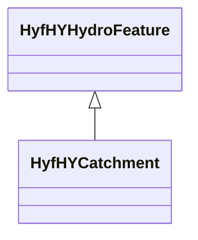

# Class: HyfHYCatchment


URI: [hyf:/HY_Catchment](https://www.opengis.net/def/schema/hy_features/hyf/HY_Catchment)





## Inheritance
* [OwlThing](../classes/OwlThing.md)
    * [HyfHYHydroFeature](../classes/HyfHYHydroFeature.md)
        * **HyfHYCatchment**


## Slots

| Name | Cardinality and Range | Description | Inheritance | Occurrences |
| ---  | --- | --- | --- | --- |


## LinkML Source

<!-- TODO: investigate https://stackoverflow.com/questions/37606292/how-to-create-tabbed-code-blocks-in-mkdocs-or-sphinx -->

### Direct

<details>

```yaml
name: hyf__HY_Catchment
from_schema: okns:hydrology-kg
exact_mappings:
- https://www.opengis.net/def/schema/hy_features/hyf/HY_Catchment
rank: 1000
is_a: hyf__HY_HydroFeature
class_uri: hyf:/HY_Catchment

```
</details>

### Induced

<details>

```yaml
name: hyf__HY_Catchment
from_schema: okns:hydrology-kg
exact_mappings:
- https://www.opengis.net/def/schema/hy_features/hyf/HY_Catchment
rank: 1000
is_a: hyf__HY_HydroFeature
class_uri: hyf:/HY_Catchment

```
</details>