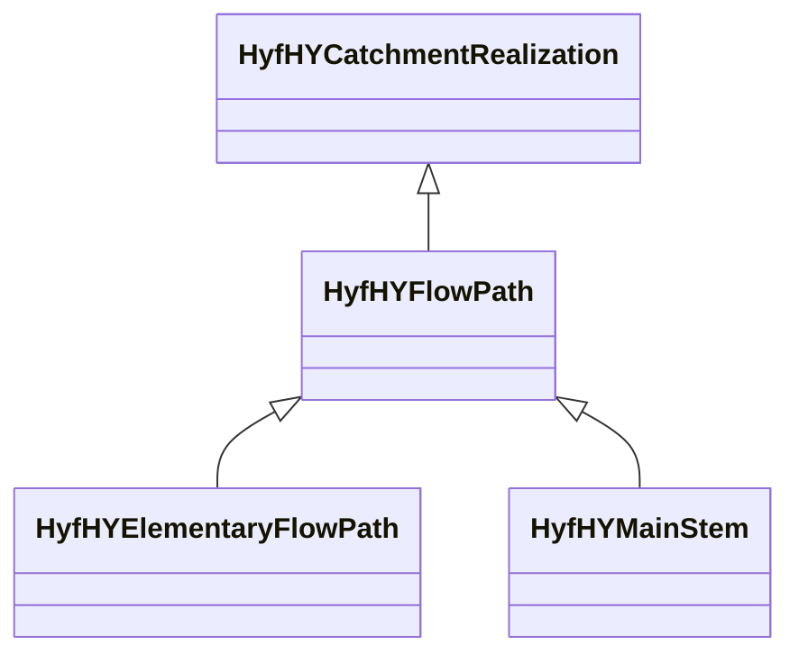

# Class: No class (entity type) name specified -- this class is noted as a superclass of another class in this graph but has not itself been defined. (hyf__HY_FlowPath)


URI: [hyf:/HY_FlowPath](https://www.opengis.net/def/schema/hy_features/hyf/HY_FlowPath)





## Inheritance
* [OwlThing](../classes/OwlThing.md)
    * [HyfHYCatchmentRealization](../classes/HyfHYCatchmentRealization.md)
        * **HyfHYFlowPath**
            * [HyfHYElementaryFlowPath](../classes/HyfHYElementaryFlowPath.md)
            * [HyfHYMainStem](../classes/HyfHYMainStem.md)


## Slots

| Name | Cardinality and Range | Description | Inheritance | Occurrences |
| ---  | --- | --- | --- | --- |


## Usages

| used by | used in | type | used |
| ---  | --- | --- | --- |
| [HyfHYElementaryFlowPath](../classes/HyfHYElementaryFlowPath.md) | [hyf__downstreamFlowPathTC](../slots/hyf__downstreamFlowPathTC.md) | any_of[range] | [HyfHYFlowPath](../classes/HyfHYFlowPath.md) |
| [HyfHYElementaryFlowPath](../classes/HyfHYElementaryFlowPath.md) | [hyf__downstreamFlowPath](../slots/hyf__downstreamFlowPath.md) | any_of[range] | [HyfHYFlowPath](../classes/HyfHYFlowPath.md) |


## LinkML Source

<!-- TODO: investigate https://stackoverflow.com/questions/37606292/how-to-create-tabbed-code-blocks-in-mkdocs-or-sphinx -->

### Direct

<details>

```yaml
name: hyf__HY_FlowPath
title: No class (entity type) name specified -- this class is noted as a superclass
  of another class in this graph but has not itself been defined.
from_schema: okns:hydrology-kg
exact_mappings:
- https://www.opengis.net/def/schema/hy_features/hyf/HY_FlowPath
rank: 1000
is_a: hyf__HY_CatchmentRealization
class_uri: hyf:/HY_FlowPath

```
</details>

### Induced

<details>

```yaml
name: hyf__HY_FlowPath
title: No class (entity type) name specified -- this class is noted as a superclass
  of another class in this graph but has not itself been defined.
from_schema: okns:hydrology-kg
exact_mappings:
- https://www.opengis.net/def/schema/hy_features/hyf/HY_FlowPath
rank: 1000
is_a: hyf__HY_CatchmentRealization
class_uri: hyf:/HY_FlowPath

```
</details>