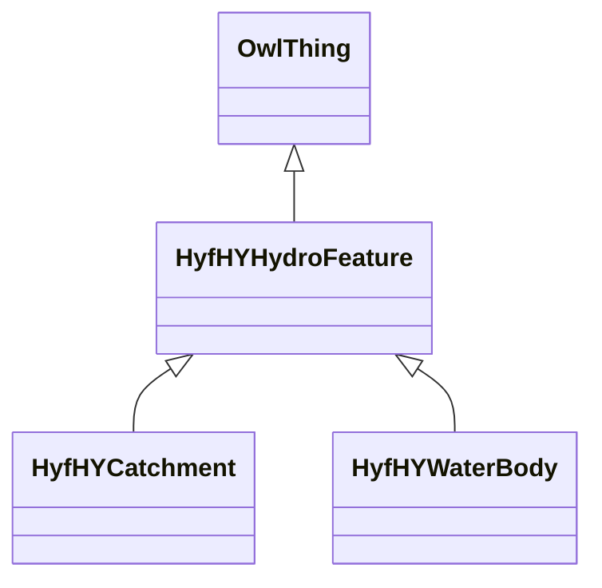

# Class: No class (entity type) name specified -- this class is noted as a superclass of another class in this graph but has not itself been defined. (hyf__HY_HydroFeature)


URI: [hyf:/HY_HydroFeature](https://www.opengis.net/def/schema/hy_features/hyf/HY_HydroFeature)





## Inheritance
* [OwlThing](../classes/OwlThing.md)
    * **HyfHYHydroFeature**
        * [HyfHYCatchment](../classes/HyfHYCatchment.md)
        * [HyfHYWaterBody](../classes/HyfHYWaterBody.md)


## Slots

| Name | Cardinality and Range | Description | Inheritance | Occurrences |
| ---  | --- | --- | --- | --- |


## LinkML Source

<!-- TODO: investigate https://stackoverflow.com/questions/37606292/how-to-create-tabbed-code-blocks-in-mkdocs-or-sphinx -->

### Direct

<details>

```yaml
name: hyf__HY_HydroFeature
title: No class (entity type) name specified -- this class is noted as a superclass
  of another class in this graph but has not itself been defined.
from_schema: okns:hydrology-kg
exact_mappings:
- https://www.opengis.net/def/schema/hy_features/hyf/HY_HydroFeature
rank: 1000
is_a: owl_Thing
class_uri: hyf:/HY_HydroFeature

```
</details>

### Induced

<details>

```yaml
name: hyf__HY_HydroFeature
title: No class (entity type) name specified -- this class is noted as a superclass
  of another class in this graph but has not itself been defined.
from_schema: okns:hydrology-kg
exact_mappings:
- https://www.opengis.net/def/schema/hy_features/hyf/HY_HydroFeature
rank: 1000
is_a: owl_Thing
class_uri: hyf:/HY_HydroFeature

```
</details>